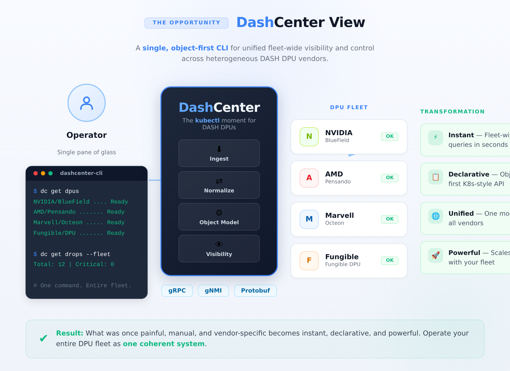
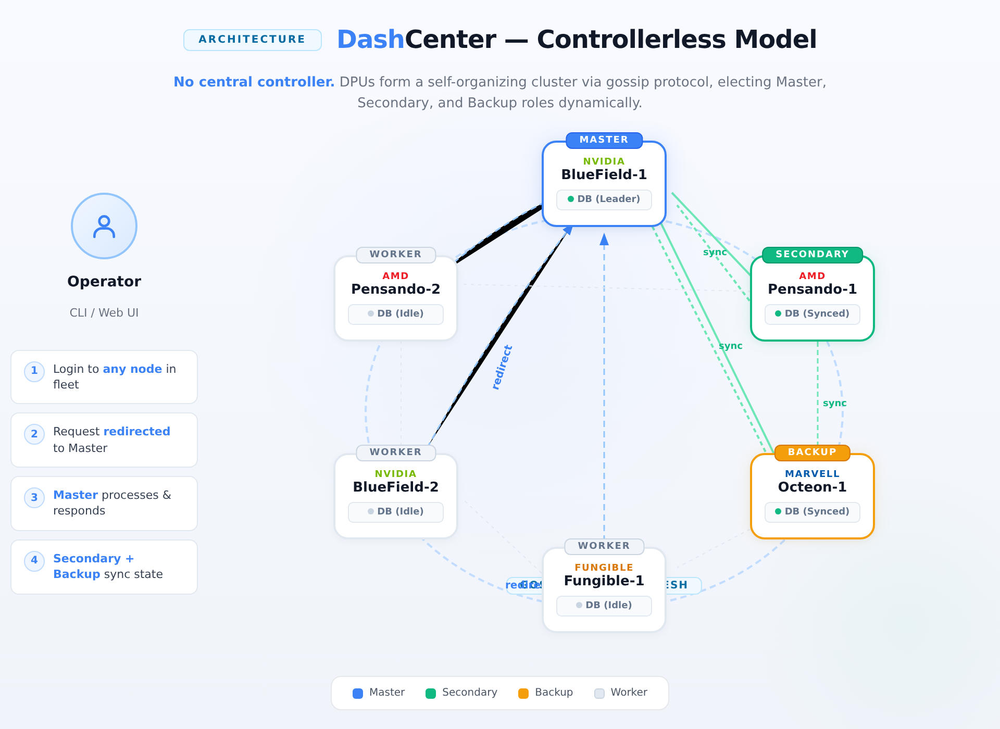

# DashCenter

> Centralized visibility, troubleshooting, and fleet operations for DASH-compliant devices.

DashCenter is an operations platform for environments that run one or many DASH-capable DPUs or appliances. It uses the same DASH object model and API vocabulary as the programming plane, then adds fleet-wide visibility, object inspection, packet/flow reasoning, state reconciliation, ENI mobility diagnostics, health analysis, and evidence collection in one place.

## Why DashCenter

**DASHCenter** is a distributed, multi-tenant state orchestrator and telemetry accumulator designed specifically for SmartNIC and Data Processing Unit (DPU) clusters running the **Disaggregated API for SONiC Hosts (DASH)**.

Think of it as the control room and diagnostic hub for your infrastructure edge. Instead of managing, debugging, and tracing stateful cloud network parameters on a per-card basis using disjointed commands, DASHCenter aggregates the operational states of your entire DPU fleet into a single unified dashboard.

---

### The Paradigm Shift: Why DASHCenter?

Traditional network tools are built for standard Layer 3 stateless routing. DPUs operating on the DASH pipeline handle massive, highly scaled stateful operations directly in hardware—managing millions of concurrent connections, massive Access Control List (ACL) tag matrices, and nested Elastic Network Interface (ENI) virtual routing topologies.

When a packet mysteriously vanishes or a hardware configuration drifts out of sync in production, traditional tools leave operators blind. DASHCenter addresses this challenge by providing a central engine to aggregate, validate, and analyze real-time packet transformations across all nodes simultaneously.

---

## Deployment Models

DashCenter ships with **two interchangeable deployment models**. Both expose the **identical REST + gRPC API contract**, so the `dashctl` CLI, the Web Console, and any 3rd-party SDK work unchanged across either topology. Operators choose the model that matches their site footprint and availability requirements.

| Model | When to use | Footprint | HLD |
|---|---|---|---|
| **Centralized Controller** | Brownfield deployments with existing controller hardware; large fleets (>50 DPUs) where a dedicated `clidemon` host is operationally desirable. | One controller VM/host + N DPUs | [High-Level System Design — Centralized](specs/HLD/high_level_system_design.md) |
| **Controllerless (Self-Clustered DPUs)** | Greenfield edge / branch / pod deployments where shipping an extra controller box is undesirable. Every DPU runs the management stack and the fleet self-elects a Master via gossip + Raft. | N DPUs only (zero extra hardware) | [High-Level System Design — Controllerless](specs/HLD/high_level_system_design_controllerless.md) |

### Model 1 — Centralized Controller

A dedicated `clidemon` appliance owns aggregation, caching, and the API surface. DPUs stream state up via gRPC / gNMI.



> Full breakdown: [High-Level System Design — Centralized](specs/HLD/high_level_system_design.md)

### Model 2 — Controllerless (Symmetric Cluster)

Every DPU runs the identical `dashd` binary. The fleet uses **SWIM-style gossip** for liveness and **Raft consensus** to elect a `Master`, a `Secondary` (hot, sync replica), and `Backup` followers. Operators may log in to **any node** — the local API Front Door transparently redirects writes and strong reads to the current Master, while Secondary and Backup replicas keep their Redis caches warm for sub-second failover.



> Full breakdown: [High-Level System Design — Controllerless](specs/HLD/high_level_system_design_controllerless.md)

---

## Fleet Architecture at a Glance

The diagram below expands the **1-to-Many distributed architecture** and shows how DASHCenter manages a scaled-out fleet of DASH appliances (DPU 01 through DPU 10) under the centralized model. It calls out the user interaction layer, the management suite, and the appliance fleet as three distinct tiers.

> For the full architectural breakdown of the management plane, caching plane, and Protobuf-exclusive network fabric, see the [High-Level System Design](specs/HLD/high_level_system_design.md).

```
==================================================================================================
                                      USER INTERACTION LAYER
==================================================================================================
   +---------------------------+   +---------------------------+   +-------------------------------+
   |    dashctl CLI Client     |   |   DashCenter Web Console  |   |  3rd-Party / Automation       |
   | (Configured Context Layer)|   |  (Browser SPA / Dashboard)|   |  (SDKs, Scripts, CI, IaC)     |
   +-------------+-------------+   +-------------+-------------+   +---------------+---------------+
                 |                               |                                 |
                 |  CLI commands over REST       |  REST / WebSocket (live)        |  REST / gRPC
                 |  (kubectl-style UX)           |  for dashboards & watch streams |  programmatic
                 +---------------+---------------+---------------+-----------------+
                                                 |
                                                 | Aggregated Multi-Node Queries
                                                 v (Unified REST / gRPC API Surface)
==================================================================================================
                                    DASHCenter MANAGEMENT SUITE
==================================================================================================
+------------------------------------------------------------------------------------------------+
|                                      clidemon API Daemon                                       |
|                                                                                                |
|     +-------------------------------------+      +---------------------------------------+     |
|     |         API Request Engine          |      |        State Aggregator Core          |     |
|     |  - Resolves multi-device filters    |      |  - Thread Pool Manager                |     |
|     |  - Executes cross-plane traces      |      |  - Schema Normalizer                  |     |
|     +------------------+------------------+      +-------------------+-------------------+     |
|                        |                                             ^                         |
|                        | Fast Cache Reads                            | Standardized Writes     |
|                        v                                             |                         |
|     +--------------------------------------------------------------------------------------+   |
|     |           Centralized Persistence & TimeSeries Cache (Redis Stack)                   |   |
|     |   [Indexes by Appliance ID: dpu-01, dpu-02, ... dpu-10 to separate state tables]     |   |
|     +--------------------------------------------------------------------------------------+   |
|                                                  ^                                             |
|          +---------------------------------------+---------------------------------------+     |
|          |  Concurrent Ingestion Workers (Async Polling & Push Notification Streams)     |     |
|          |                                                                               |     |
|          v Channel 01                            v Channel 02                            v Channel 10
+----------+---------------------------------------+---------------------------------------+-----+
           | (gNMI / GRPC)                   | (gNMI / GRPC)                   | (gNMI / GRPC)
           |                                       |                                       |
==================================================================================================
                                  DISTRIBUTED DASH APPLIANCE FLEET
==================================================================================================
+-----------------------+              +-----------------------+              +-----------------------+
|  DASH Appliance 01    |              |  DASH Appliance 02    |              |  DASH Appliance 10    |
|                       |              |                       |              |                       |
| +-------------------+ |              | +-------------------+ |              | +-------------------+ |
| | Local Probe Agent | |              | | Local Probe Agent | |              | | Local Probe Agent | |
| +---------+---------+ |              | +---------+---------+ |              | +---------+---------+ |
|           |           |              |           |           |              |           |           |
|           v           |              |           v           |              |           v           |
| +-------------------+ |              | +-------------------+ |              | +-------------------+ |
| |  SONiC Databases  | |              | |  SONiC Databases  | |              | |  SONiC Databases  | |
| | (APP_/ASIC_/STATE)| |              | | (APP_/ASIC_/STATE)| |              | | (APP_/ASIC_/STATE)| |
| +---------+---------+ |              | +---------+---------+ |              | +---------+---------+ |
|           |           |              |           |           |              |           |           |
|           v           |              |           v           |              |           v           |
| +-------------------+ |              | +-------------------+ |              | +-------------------+ |
| | DASH SAI Hardware | |              | | DASH SAI Hardware | |              | | DASH SAI Hardware | |
| | P4 Packet Pipeline| |              | | P4 Packet Pipeline| |              | | P4 Packet Pipeline| |
| +-------------------+ |              | +-------------------+ |              | +-------------------+ |
+-----------------------+              +-----------------------+              +-----------------------+
```

---

### Key Multi-Node Management Mechanics

1. **Partitioned Storage:** Inside the central database, data is partitioned by append keys mapping to individual appliances (e.g., dpu-01:DASH_ENI_TABLE vs. dpu-10:DASH_ENI_TABLE). This prevents collision when different appliances use matching internal layout parameters.
2. **Decoupled Concurrency:** The Aggregator Core handles a dedicated pool of network channels. If DASH Appliance 02 encounters a slow control plane or drops offline, its corresponding worker thread handles timeouts independently, protecting the data collection flow from the remaining healthy nodes.


3. **Scatter-Gather API Logic:** When you run a cross-fabric query like dashctl get enis --all-devices, the API engine gathers data locally from the unified persistence cache instead of executing 10 individual live SSH or gNMI calls down to the hardware. This satisfies our 500ms responsiveness constraint.

---

### Core Structural Features

* **Kubernetes-Like Operations (dashctl):** Built to mimic the seamless declarative style of cloud-native systems. Operators log into the central suite and execute simple, unified commands like dashctl get enis --all-devices or dashctl monitor drops -w rather than jumping across fragmented individual devices. See the [Multi-Node `dashctl` CLI Brief](specs/CLI-INTERFACE/mult_node_cli_brief.md) for the full command reference.


* **Dual Deployment Versatility:** Designed to conform to your topology constraints. It can deploy as a **Dedicated Controller Appliance** on a standalone x86 server or as a **Symmetric Converged Cluster** running locally on the management cores of the DPUs themselves, utilizing an embedded consensus protocol to self-elect an active leader.


* **Asynchronous, Deep Diagnostics:** Leverages non-intrusive data extraction mechanisms—such as gNMI streams, local Redis database taps, and hardware event queues—to extract diagnostic telemetry with **zero performance impact** on the live network packet-forwarding plane.


---

### Signature Superpowers

#### 1. The Virtual Packet Tracer

Allows you to simulate complex packet journeys. You provide a mock network 5-tuple payload to the engine via a REST call or CLI, and DASHCenter steps it analytically through every single phase of the DASH pipeline (ENI, Flow-Table, Route, and ACL matrices), pinpointing exactly where a packet will be forwarded or dropped before sending real traffic.

#### 2. Cross-Plane State Auditing (Merkle-Trees)

Defends against silent state corruption. By organizing control-plane configuration layers and underlying ASIC hardware tables into local cryptographic Merkle trees, DASHCenter can continuously verify state consistency without heavy processing loops. If a root hash mismatches, it traces down the tree to isolate un-synchronized entries in milliseconds.

#### 3. Zero-Copy Drop Attribution

Monitors physical hardware error hooks dynamically. When an appliance drops an unexpected frame, DASHCenter’s local daemon catches the packet’s metadata from shared memory registers and streams back an automated explanation defining the precise failure context (e.g., *Dropped at Outbound ACL Stage due to rule violation*).


## Who it is for

DashCenter is aimed at platform teams, network engineers, SREs, NOC operators, and support teams operating DASH-compliant DPUs in production. It is especially useful when multiple devices, peers, or sites must be managed consistently through one operations layer.

## Project goals

- Make DASH objects operationally visible across layers.
- Provide a kubectl-like workflow for single-device and fleet-scale troubleshooting.
- Improve incident response, ENI mobility safety, and change confidence.
- Reduce dependence on one-off vendor-specific debug procedures by giving a stable DASH-native operations model.

## Status

DashCenter is **shipping** today as a hardware-free reference implementation; the controller layer and Rust parity are next.

[]()
[]()
[]()
[]()
[](LICENSE)

| Phase | Theme | Status |
|---|---|---|
| 1 | Schema parity with upstream sonic-dash-api (all 29 object kinds) | ✅ Done |
| 2 | Behavioural DASH packet pipeline (direction → ACL 1..5 → route LPM → encap) | ✅ Done |
| 3 | SONiC-compatible Redis APP_DB backend | ✅ Done |
| 4 | Fleet controller (`dashd`) + controller CLI (`dashctl`) | ⏳ DRAFT LLD |
| 5 | Rust parity workspace | ⏳ Planned |
| 6 | Production hardening (TLS, auth, observability, persistence) | 🟡 Partial |
| 7 | Behavioural parity uplift (HA, metering, ECMP, PA validation, prefix tags, port maps, flow tables, ...) | 🟡 Partial |
| 8 | gNMI alternative front-end | ⏳ Planned |

For the engineering specification, including functional/non-functional requirements and deployment topologies, see the [DASH Diagnostic System Specification](specs/HLD/dash_diagnostic_system_spec.md). For an item-by-item breakdown of what is implemented, partial, or pending — including every upstream HLD gap and dozens of contributor-pickable issues — see **[docs/roadmap.md](docs/roadmap.md)**.

## What ships today

| Component | Binary | Role | Backend |
|---|---|---|---|
| **dash-sim** | `dash-sim.exe` | Behavioural DPU simulator (full `SimulatePacket` pipeline) | in-memory |
| **dash-redis-adapter** | `dash-redis-adapter.exe` | Same `dashapi.v1.DashApi` service over a SONiC-compatible APP_DB layout | Redis (real or embedded `miniredis`) |
| **dash-sim-client** | `dash-sim-client.exe` | Transport-only Cobra CLI; works against either backend unchanged | — |
| **dashapi-runtime/kinds** | Go module | Shared registry for all 29 upstream DASH object kinds | — |
| **dashd** | `dashd` (scaffold) | Phase 4 fleet controller daemon | — |
| **dashctl** | `dashctl` (scaffold) | Phase 4 controller CLI | — |

All three shipping binaries speak **the same wire contract** — `dashapi.v1.DashApi` over the upstream `sonic-net/sonic-dash-api` proto types, vendored verbatim under `proto/vendor/sonic-dash-api/` at a pinned commit. The same `dash-sim-client` binary works against the simulator, the adapter, and (in future) real hardware.

## Tutorials

Textbook-style onboarding lives in [docs/tutorial/](docs/tutorial/). Start with **[docs/tutorial/00-how-to.md](docs/tutorial/00-how-to.md)** — it picks a reading path based on your role.

| Page | Purpose |
|---|---|
| [00 — How to use this tutorial](docs/tutorial/00-how-to.md) | Navigation, three personas, elevator pitch |
| [01 — Project structure](docs/tutorial/01-project-structure.md) | Every folder explained |
| [02 — Modules](docs/tutorial/02-modules.md) | All 8 Go modules with roles & dependencies |
| [03 — Build setup](docs/tutorial/03-build-setup.md) | Windows + Linux install, with verify script |
| [04 — Build](docs/tutorial/04-build.md) | Compile all binaries; codegen workflow |
| [05 — Run](docs/tutorial/05-run.md) | Start sim and adapter on either OS |
| [06 — Test](docs/tutorial/06-test.md) | Unit + conformance + smoke tests |
| [07 — dash-sim-client CLI](docs/tutorial/07-dash-sim-client.md) | Tutorial-style CLI summary |
| [08 — Docker Compose](docs/tutorial/08-docker-compose.md) | Containerised fleet |
| [docs/CLI_GUIDE.md](docs/CLI_GUIDE.md) | **Canonical CLI reference — every flag, every command, real outputs** |

For internal design, every binary has a Low-Level Design under [specs/LLD/](specs/LLD/) with Go + Rust pseudocode.

## Build & run

```powershell
# Prerequisites (Windows; Linux equivalents in tutorial 03)
# - Go 1.22+, protoc 25.x, protoc-gen-go v1.34.x, protoc-gen-go-grpc v1.5.x
pwsh -File docs\tutorial\scripts\install-check.ps1     # verify toolchain

# Build
cd src\impl-go
go build -o bin\dash-sim.exe           .\dash-sim\cmd\dash-sim
go build -o bin\dash-sim-client.exe    .\dash-sim-client\cmd\dash-sim-client
go build -o bin\dash-redis-adapter.exe .\dash-redis-adapter\cmd\dash-redis-adapter

# Test
go test .\dash-sim\... .\dash-redis-adapter\...

# Run the simulator (Terminal A)
.\bin\dash-sim.exe --scenario .\dash-sim\testdata\scenarios\small.yaml

# Drive it (Terminal B)
.\bin\dash-sim-client.exe kinds -o table
.\bin\dash-sim-client.exe apply --kind vnet --key vnet-prod --value '{"vni":1001}'
.\bin\dash-sim-client.exe list  --kind vnet -o table
.\bin\dash-sim-client.exe simulate --direction outbound --eni eni-001 \
    --src-ip 10.0.0.1 --dst-ip 10.1.0.10 --protocol 6 --dst-port 80 --trace
```

The `simulate --trace` walks the packet through the canonical DASH pipeline (ENI gate → ACL stages 1..5 → route LPM → `vnet_mapping` encap) and prints every step. Full reference: [docs/CLI_GUIDE.md](docs/CLI_GUIDE.md).

## Simulator

**[dash-sim](src/impl-go/dash-sim/)** is a single-process behavioural simulator for one DASH-compliant DPU agent.

- Implements every RPC of `dashapi.v1.DashApi` in-memory.
- Exposes `SimulatePacket` — walks the **full DASH pipeline**: direction lookup → ENI gate → ACL stages 1..5 → eni_route → route LPM → `vnet_mapping` encap / service-tunnel / routing-appliance / drop / direct. 8 conformance tests pin the semantics.
- Ships an **admin HTTP** surface (`/admin/health`, `/admin/dump`, `/admin/faults`, `/admin/scenario`, `/admin/counters`, `/admin/kinds`).
- Loads YAML scenarios so deterministic fixtures replay byte-for-byte.
- Fault injection by RPC name with `error` / `delay` / `drop` modes.

Deep dive: **[specs/LLD/dash-sim.md](specs/LLD/dash-sim.md)** — architecture, every internal package, every RPC, the full pipeline algorithm, Rust pseudocode parity, failure modes, extension recipes.

## SONiC adapter

**[dash-redis-adapter](src/impl-go/dash-redis-adapter/)** exposes the same `dashapi.v1.DashApi` service — but stored in **Redis** in the exact APP_DB layout SONiC's DASH orchagent reads.

| Item | Format |
|---|---|
| Redis key | `DASH_<KIND>_TABLE:<joined-key>` (e.g. `DASH_VNET_MAPPING_TABLE:vnet-prod:10.0.0.10`) |
| Redis value | HASH `{ pb: <binary protobuf>, meta: <json timestamps> }` |
| Subscribe stream | Pub/Sub on channel `dashapi.events` |
| SimulatePacket | returns `Unimplemented` — use `dash-sim` for pipeline simulation |

Self-contained demo (no external Redis):

```powershell
.\bin\dash-redis-adapter.exe --grpc-listen :52051 --embedded-redis
```

Deep dive: **[specs/LLD/dash-redis-adapter.md](specs/LLD/dash-redis-adapter.md)** — APP_DB wire format, every RPC's Redis sequence, per-kind table mapping for all 29 kinds, SONiC-orchagent compatibility checklist.

## Deployments

| Topology | Command | Doc |
|---|---|---|
| Local bare-metal | `.\bin\dash-sim.exe` + `.\bin\dash-sim-client.exe` | [05 — Run](docs/tutorial/05-run.md) |
| Docker Compose | `docker compose up -d redis dash-sim dash-redis-adapter` | [08 — Docker Compose](docs/tutorial/08-docker-compose.md) |
| Scaled simulator fleet | `docker compose up -d --scale dash-sim=10` | [08 — Docker Compose](docs/tutorial/08-docker-compose.md) |
| Kubernetes / Helm | planned | [roadmap §3.4](docs/roadmap.md#34-build--release) |

A one-shot CLI container is also defined in `deploy/compose/docker-compose.yml` so you can drive the fleet **without** installing Go on the host:

```bash
docker compose run --rm cli kinds -o table
docker compose run --rm cli apply --kind vnet --key vnet-prod --value '{"vni":1001}'
docker compose run --rm cli --target dash-redis-adapter:52051 list --kind vnet -o table
```

## Repository structure

```
DashCenter/
├── README.md                              -- this file
├── LICENSE                                -- Apache 2.0
├── docs/
│   ├── CLI_GUIDE.md                       -- canonical CLI reference (copy-paste ready)
│   ├── roadmap.md                         -- what's done, what's next, contributor-pickable
│   └── tutorial/                          -- textbook-style onboarding (12 pages + scripts + modules/)
│
├── specs/
│   ├── LLD/                               -- Low-Level Designs (textbook + Go + Rust pseudocode)
│   │   ├── dash-sim.md                    --   behavioural simulator (~830 lines, 18 sections)
│   │   ├── dash-redis-adapter.md          --   SONiC APP_DB backend
│   │   ├── dash-sim-client.md             --   CLI + SDK
│   │   ├── dashd.md                       --   DRAFT — fleet controller
│   │   └── dashctl.md                     --   DRAFT — controller CLI
│   └── *.md                               -- legacy HLDs (informative)
│
├── proto/
│   ├── dashapi/v1/dashapi.proto           -- our gRPC service envelope
│   └── vendor/sonic-dash-api/             -- upstream protos, vendored at pinned commit
│
├── scripts/
│   ├── vendor-protos.ps1                  -- snapshot upstream sonic-dash-api
│   └── codegen-go.ps1                     -- regenerate Go stubs
│
├── src/
│   ├── impl-go/                           -- Go workspace (primary implementation)
│   │   ├── go.work                        --   7 modules
│   │   ├── gen/go/                        --   generated stubs (31 packages)
│   │   ├── dashapi-runtime/kinds/         --   shared kinds registry
│   │   ├── dash-sim/                      --   behavioural simulator
│   │   ├── dash-sim-client/               --   operator CLI
│   │   ├── dash-redis-adapter/            --   SONiC-compatible backend
│   │   ├── dashd/                         --   (placeholder) fleet controller
│   │   └── dashctl/                       --   (placeholder) controller CLI
│   └── impl-rust/                         -- Rust workspace (placeholder)
│
├── deploy/
│   └── compose/                           -- docker-compose for a local fleet
│       ├── docker-compose.yml
│       └── scenarios/
│
├── test/
│   ├── conformance/                       -- planned cross-impl conformance suite
│   └── interop/                           -- planned sim ↔ adapter parity tests
│
└── third_party/                           -- LICENSE notes for vendored upstream code
```

Folder-by-folder explanation: [docs/tutorial/01-project-structure.md](docs/tutorial/01-project-structure.md).

## Roadmap

| Phase | Theme | Status |
|---|---|---|
| 1 | Schema parity with upstream sonic-dash-api (29 kinds) | ✅ Done |
| 2 | Behavioural DASH packet pipeline + `SimulatePacket` | ✅ Done |
| 3 | SONiC-compatible Redis APP_DB backend | ✅ Done |
| 4 | Fleet controller (`dashd`) + controller CLI (`dashctl`) | ⏳ DRAFT LLD |
| 5 | Rust parity (mirror `impl-go` in `impl-rust`) | ⏳ Planned |
| 6 | Production hardening (TLS, auth, observability, persistence) | 🟡 Partial |
| 7 | Behavioural parity uplift (HA state machine, metering, ECMP, PA validation, prefix tags, port maps, flow tables, connection tracking, FNIC, trusted-VNI, DP probes) | 🟡 Partial |
| 8 | gNMI alternative front-end | ⏳ Planned |

The full breakdown — per-module status, every gap explicitly named, every upstream HLD mapped — lives in **[docs/roadmap.md](docs/roadmap.md)**. That document is the single source of truth for "what's left to do" and is organised so contributors can pick a row and ship.

## Open source direction

DashCenter is an open source operations platform for DASH ecosystems, with a clean core, pluggable adapters, and a stable CLI/API model. The long-term goal is a shared visibility, diagnostics, and orchestration layer that works across multiple DASH-compliant vendors and deployments while still allowing vendor-specific enrichments where available.

## Contributing

> **🆘 = good first issue.** [docs/roadmap.md](docs/roadmap.md) tags 30+ self-contained tasks this way. Each one is bounded, well-scoped, and unblocks downstream work.

### Why contribute?

- **You're working at the schema source.** Every line of DashCenter code is built against the official upstream sonic-dash-api proto types. No forks, no reshaping — your changes flow back into hardware-relevant workflows.
- **Your PR ships end-to-end.** With one wire contract across simulator, Redis backend, and CLI, even small features land visibly across the whole stack.
- **Open architecture, open vision.** Phases 4–8 are intentionally open for community design. The LLDs in [`specs/LLD/`](specs/LLD/) name what needs to be designed, not what has been decided.
- **Test-first culture.** All current features ship with conformance tests. New features are expected to do the same — and the existing fixtures (miniredis + bufconn + per-pipeline tests) make this inexpensive.
- **DASH is the future.** As SmartNIC/DPU offload becomes standard for cloud-scale networking, DASH ecosystem tooling matters. Be part of the layer that makes it operable.

### Suggested first PRs (from the roadmap)

| # | Task | Module | Effort |
|---|---|---|---|
| 1 | `codegen-go.sh` — bash twin of the PowerShell codegen script | `scripts/` | ~30 min |
| 2 | Round-trip unit tests for every kind in `dashapi-runtime/kinds` | shared | ~1 hour |
| 3 | Cobra shell completion (`dash-sim-client completion <shell>`) | CLI | ~30 min |
| 4 | `apply --dry-run` flag — validate inputs without dialling the server | CLI | ~1 hour |
| 5 | Multi-doc YAML support in `scenarios.LoadFile` | dash-sim | ~1 hour |
| 6 | `/admin/faults` parity in `dash-redis-adapter` (copy `dash-sim`'s `faults` package) | adapter | ~2 hours |
| 7 | Cross-backend parity test under `test/interop/` | tests | ~3 hours |
| 8 | GitHub Actions CI (build + test + lint matrix on Linux/Windows) | infra | ~3 hours |
| 9 | Prefix-tag (`src_tag` / `dst_tag`) resolution in pipeline ACLs | dash-sim | ~4 hours |
| 10 | `gen-rust/` skeleton via `tonic-build` | Rust workspace | ~3 hours |
| 11 | Mermaid sequence diagrams in each LLD | docs | ~2 hours |

Big-ticket pickups (multi-PR):

- **Phase 4 — `dashd` M1** (single-node skeleton): see [specs/LLD/dashd.md § 24 milestones](specs/LLD/dashd.md#24-phased-implementation-milestones).
- **Phase 5 — Rust mirror of `dash-sim`** using the pseudocode in [LLD/dash-sim.md § 15](specs/LLD/dash-sim.md#15-rust-pseudocode-parity).
- **Phase 7 — PrivateLink / PrivateLinkNSG routing paths** — upstream-documented flows not yet implemented in the simulator.

### How to contribute

1. Pick an item (or open an issue describing yours). Use a title like `[roadmap §x.x] <one-line-description>`.
2. Read the relevant LLD section. Every PR is expected to align with the design unless the PR *is* an LLD update.
3. Add or update tests:
   - Pipeline change → add a case in [`dash-sim/internal/sim/pipeline/pipeline_test.go`](src/impl-go/dash-sim/internal/sim/pipeline/pipeline_test.go).
   - Adapter change → add a case in [`dash-redis-adapter/internal/adapter/server_test.go`](src/impl-go/dash-redis-adapter/internal/adapter/server_test.go).
   - CLI change → add a golden-file test (one is on the roadmap too).
4. Update docs: user-visible change → [`docs/CLI_GUIDE.md`](docs/CLI_GUIDE.md) and the relevant tutorial page; architectural change → the relevant LLD plus [`docs/roadmap.md`](docs/roadmap.md).
5. Run the full sweep before opening the PR:
   ```bash
   cd src/impl-go
   go build ./dash-sim/... ./dash-sim-client/... ./dash-redis-adapter/... ./gen/go/... ./dashapi-runtime/...
   go test  ./dash-sim/... ./dash-redis-adapter/...
   ```

### Code style

- **Go**: idiomatic. `gofmt -s`. `go vet` clean. No new dependencies without a one-paragraph justification in the PR description.
- **Proto**: vendored upstream is **read-only** — schema changes go upstream first and re-vendor via the script.
- **Docs**: keep `docs/CLI_GUIDE.md` outputs **real captures** from running binaries. Never hand-edit example outputs.
- **Tests**: prefer fixture-driven (`testdata/`) over hand-written setup.

### Wanted

Beyond the roadmap items, we'd love contributions in:

- **DASH adapters for other SmartNIC vendors** — anything that implements `dashapi.v1.DashApi` over a vendor-specific control surface.
- **A portable conformance suite** — make `test/conformance/` runnable against any DashApi server with `--target host:port`.
- **A Web UI** — a thin Vue/React frontend over `dashcenter.v1` (when that proto lands in Phase 4).
- **Real-world scenario YAMLs** — anonymised production-shaped configs that exercise corner cases. Add under `dash-sim/testdata/scenarios/`.

### Code of conduct

This project follows the [Contributor Covenant v2.1](https://www.contributor-covenant.org/version/2/1/code_of_conduct/). Be welcoming. Be precise. Disagree on technical merits, not on people.

## References

### Upstream DASH

- **[sonic-net/DASH](https://github.com/sonic-net/DASH)** — the DASH project itself: HLDs, behavioural model, P4 reference pipeline, SAI extensions.
  - [documentation/](https://github.com/sonic-net/DASH/tree/main/documentation) — the HLDs that drive `dash-sim`'s packet pipeline (ACL stages, routing, vnet mapping, PrivateLink, HA, metering).
- **[sonic-net/sonic-dash-api](https://github.com/sonic-net/sonic-dash-api/tree/master/proto)** — the **proto schemas** vendored under `proto/vendor/sonic-dash-api/`. Every `dashapi.v1.Object` payload is one of these messages, verbatim.
- **[sonic-net/sonic-swss](https://github.com/sonic-net/sonic-swss)** — the orchagent that reads `DASH_<KIND>_TABLE:*` keys from APP_DB. `dash-redis-adapter`'s wire format is designed to match what orchagent expects.
- **[SAI DASH headers](https://github.com/opencomputeproject/SAI/tree/master/inc)** — the underlying hardware abstraction. DashCenter does not call SAI directly; orchagent does.

### Ecosystem & runtime dependencies

- **[SONiC](https://github.com/sonic-net/SONiC)** — the network OS whose APP_DB layout we target.
- **[gRPC](https://grpc.io/)** + **[protobuf](https://protobuf.dev/)** — transport + schema.
- **[redis/go-redis](https://github.com/redis/go-redis)** — Redis client in the adapter.
- **[spf13/cobra](https://github.com/spf13/cobra)** — CLI framework for `dash-sim-client`.
- **[alicebob/miniredis](https://github.com/alicebob/miniredis)** — in-process Redis for `--embedded-redis` mode and tests.

### DashCenter docs

- [docs/tutorial/](docs/tutorial/) — onboarding tutorials.
- [docs/CLI_GUIDE.md](docs/CLI_GUIDE.md) — canonical CLI reference.
- [docs/roadmap.md](docs/roadmap.md) — contributor-pickable roadmap.
- [specs/LLD/](specs/LLD/) — low-level designs.
- [specs/](specs/) — informative legacy HLDs.

## License

[Apache 2.0](LICENSE). DashCenter vendors a snapshot of [sonic-net/sonic-dash-api](https://github.com/sonic-net/sonic-dash-api) under `proto/vendor/sonic-dash-api/`. See [third_party/sonic-dash-api/LICENSE-NOTE.md](third_party/sonic-dash-api/LICENSE-NOTE.md) for the upstream license notice.

---

> *DashCenter exists because a software-defined network deserves software-defined operations. Help us build the open layer that makes DASH-capable hardware operable everywhere.*
