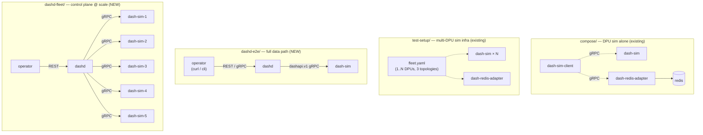

# `deploy/` — DashCenter Deployment Scenarios

This directory contains **all the Docker / docker compose setups** used to run, demo, and test DashCenter components. Each child folder is a distinct deployment scenario with a clear purpose and is **self-contained** — `cd` into any one, follow its README, and you get a working stack.

> **New contributor?** Start with [`dashd-e2e/`](dashd-e2e/README.md). It is the simplest end-to-end demo and explains the whole architecture in one walkthrough.

---

## The four scenarios at a glance

| Folder                                 | Stack                                              | Purpose / when to pick this one                                                                 |
|----------------------------------------|----------------------------------------------------|-------------------------------------------------------------------------------------------------|
| [`compose/`](compose/docker-compose.yml) | `dash-sim` + `redis` + `dash-redis-adapter` + `cli` | **Existing.** Learn the DPU simulator in isolation. Drive it directly with the CLI; store state in Redis. No control plane involved. |
| [`test-setup/`](test-setup/README.md)   | `dash-sim × N` + `dash-redis-adapter` (+ Redis) — 3 topologies | **Existing.** Multi-DPU **test infrastructure** for the simulator. Three progressive topologies (native procs → single Docker → multi-Docker fleet), all driven by one shared `fleet.yaml`. CI & dev-loop oriented. |
| [`dashd-e2e/`](dashd-e2e/README.md)     | `dashd` + 1 × `dash-sim` (+ optional `cli` profile) | **NEW.** Simplest possible **end-to-end demo** of the control plane → DPU data path. Run `e2e.sh` / `e2e.ps1` to see a vnet+eni flow from REST → dashd → sim and PASS in ~10s. The canonical "I understand DashCenter" reference. |
| [`dashd-fleet/`](dashd-fleet/README.md) | `dashd` + 5 × `dash-sim`                            | **NEW.** Production-shape **fleet deployment**: one dashd managing 5 DPUs with persistent state. Use this for integration tests, chaos drills, fleet-wide policy demos. |

---

## Architecture map — what each folder demonstrates



---

## Recommended learning path

If you are new to DashCenter, walk these folders in order. Each one introduces exactly one new concept.

1. **[`compose/`](compose/docker-compose.yml)** — *What is the DPU simulator?*  
   Bring up `dash-sim` alone, push specs into it with `dash-sim-client`, see them in Redis.

2. **[`dashd-e2e/`](dashd-e2e/README.md)** — *What does dashd actually do?*  
   Add the control plane in front of one sim. Run `e2e.sh`. Watch a `vnet` + `eni` flow REST → dashd → sim, end-to-end PASS.

3. **[`dashd-fleet/`](dashd-fleet/README.md)** — *How does it scale to a fleet?*  
   Same dashd, now managing 5 sims. Same `push-vnet.sh` script proves convergence across all 5 DPUs.

4. **[`test-setup/`](test-setup/README.md)** — *How do we do this in CI / across platforms?*  
   The same simulator fleet, but **without dashd**, with cross-platform tooling (PowerShell + bash) and a one-file `fleet.yaml` that drives three different topologies (native procs, single docker, multi-docker compose). Use this as the basis for tests that need a controllable simulator-only fleet.

---

## Quick-start cheat-sheet

```bash
# 1. Just the simulator + Redis adapter (existing)
docker compose -f deploy/compose/docker-compose.yml up -d
docker compose -f deploy/compose/docker-compose.yml run --rm cli ping

# 2. dashd + 1 sim, full end-to-end PASS in ~10s
docker compose -f deploy/dashd-e2e/docker-compose.yml up -d --build
./deploy/dashd-e2e/e2e.sh                        # bash
pwsh -File deploy/dashd-e2e/e2e.ps1              # Windows PowerShell

# 3. dashd + 5 sims (fleet)
docker compose -f deploy/dashd-fleet/docker-compose.yml up -d --build
./deploy/dashd-fleet/push-vnet.sh

# 4. Multi-DPU sim infra (cross-platform; see folder README for fleet.yaml config)
pwsh -File deploy/test-setup/01-host-multi-port/start-fleet.ps1
# or
./deploy/test-setup/01-host-multi-port/start-fleet.sh
```

Tear-down is always `docker compose ... down` (add `-v` to also wipe named volumes).

---

## How the folders relate to each other

| Question                                                              | Folder           |
|----------------------------------------------------------------------|------------------|
| "How do I run a DPU sim?"                                            | `compose/`       |
| "How do I run **many** DPU sims for tests, across OSes, with one config?" | `test-setup/` |
| "How do I run **dashd** and prove it manages a DPU end-to-end?"       | `dashd-e2e/`     |
| "How do I run dashd at fleet scale (multiple DPUs)?"                  | `dashd-fleet/`   |

The two `dashd-*` folders intentionally **do not depend on** anything in `compose/` or `test-setup/` — they each ship their own compose file, configs, and verification scripts so contributors can `cd` straight in.

---

## Port allocation across scenarios

Each folder uses a **distinct compose project name** so multiple scenarios can coexist without container-name collisions. Host port collisions still apply — bring down one scenario before bringing up another that shares the same host ports.

| Scenario        | Host ports used                                                | Compose project |
|----------------|----------------------------------------------------------------|-----------------|
| `compose/`      | 6379 (redis), 50051 (sim gRPC), 8080 (sim admin), 52051 (adapter) | (default)       |
| `test-setup/`   | configurable via `fleet.yaml` (defaults: 50051-50053, 8081-8083, 52051, 6379) | per-topology    |
| `dashd-e2e/`    | 8443, 9443, 7443 (dashd), 50051 (sim gRPC), 8081 (sim admin)   | `dashd-e2e`     |
| `dashd-fleet/`  | 8443, 9443, 7443 (dashd), 8081-8085 (sim admin × 5)            | `dashd-fleet`   |

> **Conflict between `dashd-e2e/` and `compose/` / `test-setup/`**: all three want host port `50051`. Bring down one before starting another, or edit the ports in the affected `docker-compose.yml`.

---

## Each folder has its own README

For full details — topology diagrams, expected output, troubleshooting tables, operator commands — read the README inside each folder:

- [`compose/`](compose/) — inline comments at the top of `compose/docker-compose.yml`
- [`test-setup/README.md`](test-setup/README.md) — 3 topologies, shared config, cross-platform tooling
- [`dashd-e2e/README.md`](dashd-e2e/README.md) — 8-step end-to-end verification
- [`dashd-fleet/README.md`](dashd-fleet/README.md) — 5-DPU fleet operations