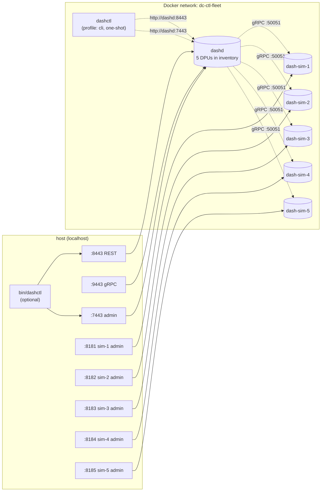

# `dashctl-fleet/` — dashctl + dashd + 5 dash-sims (operator CLI demo)

A self-contained Docker Compose setup that brings up **dashd**, **5 simulated DPUs**, and a one-shot **dashctl** container. The 13-step `dashctl-e2e` script exercises every Phase 1 dashctl verb against the live fleet — from inside the container and (optionally) from the host.

> **Just want dashd + sims (no CLI focus)?** See [`../dashd-fleet/`](../dashd-fleet/README.md).
> **Just want the simplest 1-DPU demo?** See [`../dashd-e2e/`](../dashd-e2e/README.md).

---

## Topology



| Host port | Container       | Purpose                  |
|----------:|-----------------|--------------------------|
| 8443      | dashd           | REST API                 |
| 9443      | dashd           | gRPC API (Phase 2)       |
| 7443      | dashd           | Admin HTTP               |
| 8181..8185| dash-sim-1..5   | sim admin (debug only)   |

> Host ports `8181..8185` are deliberately different from `../dashd-fleet/` (`8081..8085`) so both compose stacks can run side-by-side without port conflicts.

---

## Quick start

```bash
# 1. Build images and bring up the fleet (one-time build, then cached)
docker compose -f deploy/dashctl-fleet/docker-compose.yml up -d --build

# 2. (Optional but recommended) Build the host dashctl binary
make -C src/impl-go/dashctl build

# 3. Run the 13-step end-to-end CLI walkthrough
./deploy/dashctl-fleet/dashctl-e2e.sh         # Linux / macOS / WSL / Git-Bash
pwsh -File deploy/dashctl-fleet/dashctl-e2e.ps1   # Windows PowerShell 7+
```

The script exits **0** with a green `PASS` line when every command path is verified.

---

## The 13-step end-to-end walk

| # | Command                                | Verifies |
|--:|----------------------------------------|---|
|  1 | `dashctl version --client`            | Offline smoke — binary self-test |
|  2 | `GET /admin/health`                    | dashd reachable |
|  3 | `GET /admin/inventory`                 | 5 × `DPU_STATE_UP` |
|  4 | `dashctl get vnet`                     | Empty list path |
|  5 | `dashctl apply -f manifests/`          | Multi-doc + dir + bind-mount apply |
|  6 | `dashctl get vnet -o table`            | Both vnets appear |
|  7 | `dashctl get eni -o wide`              | 5 ENIs + `PLACED-ON` column |
|  8 | `dashctl describe eni eni-app-01`      | Human-readable detail block |
|  9 | `dashctl reconcile`                    | Force-tick succeeds |
| 10 | `dashctl dpu list`                     | All 5 DPUs listed |
| 11 | `dashctl dpu drift --dpu dpu-sim-01`   | Converges to 0 within 30 s |
| 12 | `dashctl delete eni eni-db-03`         | Delete + 404-on-re-get |
| 13 | `dashctl explain vnet`                 | Offline field reference |

Every command is executed inside the `dashctl` container. If `bin/dashctl` (or `.exe`) was built on the host, the script ALSO runs the host binary in steps 1 to prove the host path works against the same fleet.

---

## File layout

```
deploy/dashctl-fleet/
├── README.md                       ← this file
├── docker-compose.yml              ← dashd + 5 × dash-sim + dashctl (profile: cli)
├── configs/
│   ├── dashd.yaml                  ← dashd runtime config (mounted :ro)
│   └── inventory.yaml              ← 5-DPU inventory (mounted :ro)
├── manifests/
│   ├── 00-vnets.yaml               ← 2 vnets (app, db)
│   └── 10-enis.yaml                ← 5 ENIs spread across the 5 sims
├── dashctl-e2e.sh                  ← 13-step verifier (POSIX shell)
└── dashctl-e2e.ps1                 ← same for Windows PowerShell
```

State persistence: dashd's `/var/lib/dashd` is backed by the named Docker volume `dashd-state-ctl-fleet`. It survives `docker compose down`; use `down -v` to wipe.

---

## Useful command snippets

### Run dashctl from the host against the live fleet

```bash
./bin/dashctl --endpoint http://localhost:8443 \
              --admin-endpoint http://localhost:7443 \
              dpu list

./bin/dashctl --endpoint http://localhost:8443 \
              get vnet -o yaml
```

For persistent flags, save them as a context:

```bash
./bin/dashctl config set-context dashctl-fleet \
  --endpoint http://localhost:8443 \
  --admin-endpoint http://localhost:7443 \
  --namespace default

./bin/dashctl --context dashctl-fleet dpu list
```

### One-shot CLI from a container (no host binary needed)

```bash
# Any dashctl verb works:
docker compose -f deploy/dashctl-fleet/docker-compose.yml \
  run --rm dashctl get eni -o wide

# Apply manifests by bind-mounting them into the container:
docker compose -f deploy/dashctl-fleet/docker-compose.yml \
  run --rm \
  -v "$PWD/deploy/dashctl-fleet/manifests:/work:ro" \
  --entrypoint /usr/local/bin/dashctl \
  dashctl apply -f /work
```

### Iterative dev — drop into a shell with dashctl on PATH

```bash
# Spawns an Alpine shell next to dashctl (one-off):
docker run --rm -it --network dashctl-fleet_dc-ctl-fleet \
  -e DASHCTL_ENDPOINT=http://dashd:8443 \
  -e DASHCTL_ADMIN_ENDPOINT=http://dashd:7443 \
  --entrypoint sh \
  dashcenter/dashctl:dev
# (inside) /usr/local/bin/dashctl get vnet
```

---

## Tear down

```bash
# Keep state volume (next 'up' restarts with persisted specs)
docker compose -f deploy/dashctl-fleet/docker-compose.yml down

# Wipe everything including the state volume
docker compose -f deploy/dashctl-fleet/docker-compose.yml down -v
```

---

## What this demonstrates

After `dashctl-e2e.sh` PASSes, you've verified that dashctl:

1. **Drives a fleet declaratively** via `apply -f` (multi-doc + dir + mount).
2. **Reads back** specs with stable `-o table / wide / json / yaml / name` formats.
3. **Round-trips** to dashd's admin endpoint for `dpu list / drift`.
4. **CAS-safe writes** (`delete` returns 404 idempotently on second call).
5. **Works in both modes** — host binary AND distroless container — with identical results.
6. **Embeds a usable Docker image** at `dashcenter/dashctl:dev` ready for CI / scripts.

---

## Troubleshooting

| Symptom                                          | Cause / fix                                                                              |
|--------------------------------------------------|------------------------------------------------------------------------------------------|
| `dpu list` shows DPUs stuck in `DPU_STATE_REGISTERING` | A sim isn't up. `docker compose ps`. Probably the prober hasn't ticked yet — wait 5 s. |
| `apply -f` fails at the bind-mount step         | Wrong host path passed to `-v`. Use `$PWD/deploy/dashctl-fleet/manifests` (POSIX) or `(Get-Location)` (PowerShell). |
| `apply -f` fails with `unknown kind`            | Manifest is missing `apiVersion: dashcenter.v1` or `kind: …`.                            |
| Host `bin/dashctl` not found                    | Run `make -C src/impl-go/dashctl build` once.                                            |
| Port 8443 / 9443 / 7443 in use                  | A sibling `dashd-*` compose is running. `docker compose ps` to find it.                  |
| Port 8181..8185 in use                          | A sibling fleet is running on host. `docker ps`. Adjust the `ports:` block.              |
