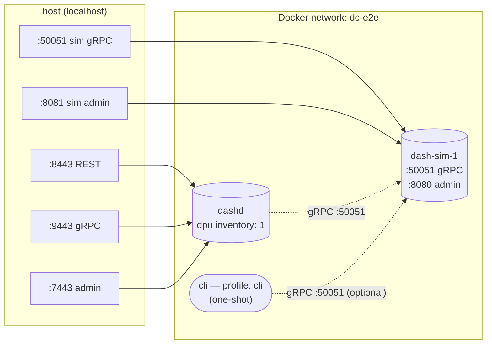

# `dashd-e2e/` — dashd + 1 dash-sim (end-to-end demo)

The **simplest** self-contained Docker Compose setup that proves the full DashCenter control-plane → DPU data path works. Bring it up, run `e2e.sh`/`e2e.ps1`, and watch a vnet + eni flow from REST → dashd → sim and become observable on the DPU.

> **Want a 5-DPU fleet?** See [`../dashd-fleet/`](../dashd-fleet/README.md).  
> **Want only the DPU simulator (no control plane)?** See [`../compose/`](../compose/docker-compose.yml).

---

## Topology



| Host port | Container        | Purpose                  |
|----------:|------------------|--------------------------|
| 8443      | dashd            | REST API                 |
| 9443      | dashd            | gRPC API                 |
| 7443      | dashd            | Admin HTTP               |
| 50051     | dash-sim-1       | sim gRPC (exposed for the optional cli) |
| 8081      | dash-sim-1       | sim admin (debug)        |

---

## The 8-step end-to-end check

`e2e.sh` / `e2e.ps1` runs this sequence against the running compose:

```
[1/8] dashd /admin/health responds
[2/8] dpu-sim-01 state == DPU_STATE_UP
[3/8] PUT /v1/default/vnets/vnet-e2e          → 200, generation=1
[4/8] PUT /v1/default/enis/eni-e2e            → 200, generation=1
[5/8] POST /v1/reconcile                      → force tick now
[6/8] sim /admin/dump contains vnet-e2e       → polled up to 30s
[7/8] sim /admin/dump contains eni-e2e        → polled up to 30s
[8/8] dashd /admin/drift is clean
PASS: end-to-end converged.
```

If any step fails the script exits non-zero with a clear diagnostic.

---

## Quick start

```bash
# 1. Build & bring up
docker compose -f deploy/dashd-e2e/docker-compose.yml up -d --build

# 2. Run the e2e verification
./deploy/dashd-e2e/e2e.sh                       # Linux / macOS / WSL / Git-Bash
pwsh -File deploy/dashd-e2e/e2e.ps1             # Windows PowerShell 7+
```

Expected output (POSIX shell variant):

```
[1/8] dashd health
      OK    dashd /admin/health responded
[2/8] DPU is UP (poll up to 30s)
      OK    dpu-sim-01 state=DPU_STATE_UP (after 5s)
[3/8] PUT /v1/default/vnets/vnet-e2e
      OK    vnet accepted ({"accepted":true,"generation":1})
[4/8] PUT /v1/default/enis/eni-e2e
      OK    eni accepted ({"accepted":true,"generation":1})
[5/8] Triggering immediate reconcile
      OK    reconcile dispatched
[6/8] Verifying vnet 'vnet-e2e' on the sim (poll up to 30s)
      OK    vnet 'vnet-e2e' present on sim (after 1s)
[7/8] Verifying eni 'eni-e2e' on the sim (poll up to 30s)
      OK    eni 'eni-e2e' present on sim (after 0s)
[8/8] Drift report should be empty
      OK    drift report is clean

PASS: end-to-end converged. dashd successfully pushed vnet+eni to dash-sim-01.
```

---

## Optional — drive the SIM directly with the CLI

The `cli` service is on a Docker Compose profile and only starts when explicitly invoked. It bypasses dashd entirely — useful when you want to verify the sim works in isolation:

```bash
# Apply directly to the sim (no dashd involved)
docker compose -f deploy/dashd-e2e/docker-compose.yml run --rm cli ping

docker compose -f deploy/dashd-e2e/docker-compose.yml run --rm cli \
  apply --kind vnet --key direct-vnet --value '{"vni":2}'

# Confirm it landed
curl -s http://localhost:8081/admin/dump | jq '.vnet'
```

This is helpful for triaging: if `e2e.sh` fails at step 6 but `apply` directly to the sim works, the issue is in dashd (not the sim).

---

## File layout

```
deploy/dashd-e2e/
├── README.md                   ← this file
├── docker-compose.yml          ← dashd + 1 × dash-sim + cli profile + named volume
├── configs/
│   ├── dashd.yaml              ← runtime config (tick_interval: 5s for fast convergence)
│   └── inventory.yaml          ← 1-DPU inventory (mounted :ro)
├── e2e.sh                      ← 8-step verification (POSIX shell)
└── e2e.ps1                     ← same for Windows PowerShell
```

State persistence: `/var/lib/dashd` inside the container is backed by the named Docker volume `dashd-state-e2e`. Survives `down`; wiped by `down -v`.

---

## Useful operator commands

```bash
# List desired specs
curl -s http://localhost:8443/v1/default/vnets | jq

# Inspect the sim's observed state
curl -s http://localhost:8081/admin/dump | jq

# Force a reconcile (instead of waiting the 5s tick)
curl -X POST http://localhost:8443/v1/reconcile

# Tail logs
docker compose -f deploy/dashd-e2e/docker-compose.yml logs -f dashd
docker compose -f deploy/dashd-e2e/docker-compose.yml logs -f dash-sim-1
```

---

## Tear down

```bash
# Keep state volume
docker compose -f deploy/dashd-e2e/docker-compose.yml down

# Wipe state + volume
docker compose -f deploy/dashd-e2e/docker-compose.yml down -v
```

---

## What to learn here

This setup is the canonical reference for the **dashd → DPU control-plane data path**. After you can run `e2e.sh` to PASS, you understand:

1. How dashd is configured (`configs/dashd.yaml`)
2. How DPU inventory is declared (`configs/inventory.yaml`)
3. The DPU lifecycle: REGISTERING → UP via the prober's 5-second TCP probes
4. The reconcile loop: desired specs → dispatch worker → southbound gRPC → sim
5. The observability surfaces: `/admin/health`, `/admin/inventory`, `/admin/drift`, sim's `/admin/dump`

Once you're comfortable with this, the [`../dashd-fleet/`](../dashd-fleet/README.md) scenario is just this same pattern, scaled to 5 DPUs.

---

## Troubleshooting

| Symptom                                | Cause / fix                                                                       |
|---------------------------------------|-----------------------------------------------------------------------------------|
| `e2e.sh` fails at step 1              | dashd container failed to start. `docker compose logs dashd`. Most often: bad config mount path. |
| `e2e.sh` fails at step 2              | dash-sim-1 not yet listening or prober hasn't ticked. Re-run after a few seconds. |
| `e2e.sh` fails at step 3 / 4 (HTTP 4xx) | Spec validation error. Check the response body in `/tmp/e2e-vnet.json`.            |
| `e2e.sh` fails at step 6 / 7          | Dispatch path issue. `docker compose logs dashd` — look for "dispatch" / "apply" errors. |
| Port 8443/9443/7443/50051 in use      | Another `dashd-*` compose is running. `docker ps`. Or change the ports in `docker-compose.yml`. |
| Step 8 reports drift items            | First-run only; specs declared but observed state hasn't been polled yet. Re-run `e2e.sh`. |