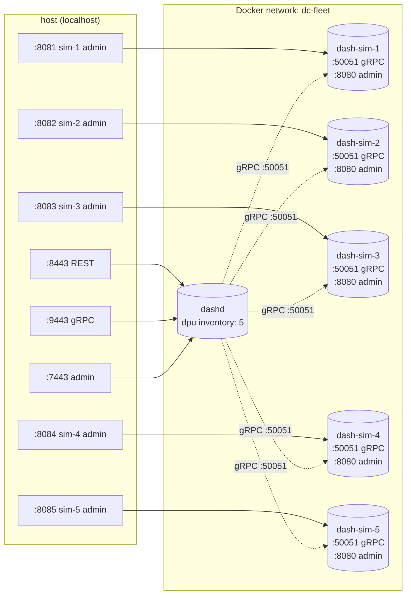

# `dashd-fleet/` — dashd + 5 dash-sims (fleet deployment)

A self-contained Docker Compose setup that brings up **dashd** managing a fleet of **5 simulated DPUs**. Use this folder when you want to see dashd operate at fleet scale, or as a base for integration / chaos tests.

> **Looking for the simpler single-DPU walkthrough?** See [`../dashd-e2e/`](../dashd-e2e/README.md).  
> **Looking for the DPU simulator alone?** See [`../compose/`](../compose/docker-compose.yml).

---

## Topology



| Host port | Container         | Purpose                  |
|----------:|-------------------|--------------------------|
| 8443      | dashd             | REST API                 |
| 9443      | dashd             | gRPC API                 |
| 7443      | dashd             | Admin HTTP               |
| 8081      | dash-sim-1        | sim-1 admin (debug only) |
| 8082      | dash-sim-2        | sim-2 admin (debug only) |
| 8083      | dash-sim-3        | sim-3 admin (debug only) |
| 8084      | dash-sim-4        | sim-4 admin (debug only) |
| 8085      | dash-sim-5        | sim-5 admin (debug only) |

> The southbound gRPC channel from dashd to each sim (`dash-sim-N:50051`) stays **internal** to the Docker bridge network — there is no host port binding for it, which avoids host port conflicts and reflects how a real control-plane / DPU fleet is wired.

---

## What you'll see (end-to-end)

```
T+0s    All 5 dash-sim containers start (gRPC on :50051, admin on :8080)
T+1s    dashd starts; reads /etc/dashd/inventory.yaml — 5 DPUs in REGISTERING
T+5s    dashd's prober TCP-dials each sim :50051 → all 5 DPUs go DPU_STATE_UP
T+30s   reconciler tick — pushes any desired specs to each DPU
```

---

## Quick start

```bash
# 1. Build images and bring up the fleet (one-time build, then cached)
docker compose -f deploy/dashd-fleet/docker-compose.yml up -d --build

# 2. (Wait ~10s) Confirm all 5 DPUs are UP
curl -s http://localhost:7443/admin/inventory | jq '.dpus[] | {id,state}'
# Expect 5 rows with state: "DPU_STATE_UP"

# 3. dashd health
curl -s http://localhost:7443/admin/health

# 4. Push a vnet across the fleet and verify it lands on every sim
./deploy/dashd-fleet/push-vnet.sh                  # Linux / macOS / WSL / Git-Bash
pwsh -File deploy/dashd-fleet/push-vnet.ps1        # Windows PowerShell 7+
```

The script prints a green **PASS** when the vnet appears in the observed state of all 5 simulators.

---

## File layout

```
deploy/dashd-fleet/
├── README.md                   ← this file
├── docker-compose.yml          ← dashd + 5 × dash-sim + named volume
├── configs/
│   ├── dashd.yaml              ← dashd runtime config (mounted :ro)
│   └── inventory.yaml          ← 5-DPU inventory (mounted :ro)
├── push-vnet.sh                ← push + reconcile + verify (POSIX shell)
└── push-vnet.ps1               ← same for Windows PowerShell
```

State persistence: `/var/lib/dashd` inside the dashd container is backed by the named Docker volume `dashd-state-fleet`. The volume survives `docker compose down` (use `down -v` to wipe it).

---

## Useful operator commands

```bash
# List all desired vnets
curl -s http://localhost:8443/v1/default/vnets | jq

# Force an immediate reconcile (do not wait the 30s tick)
curl -X POST http://localhost:8443/v1/reconcile

# Drift report
curl -s http://localhost:7443/admin/drift | jq

# Per-sim observed objects (e.g. sim-3)
curl -s http://localhost:8083/admin/dump | jq

# Tail dashd logs
docker compose -f deploy/dashd-fleet/docker-compose.yml logs -f dashd

# Tail one sim
docker compose -f deploy/dashd-fleet/docker-compose.yml logs -f dash-sim-3
```

---

## Tear down

```bash
# Keep state volume (next 'up' restarts with the same persisted specs)
docker compose -f deploy/dashd-fleet/docker-compose.yml down

# Wipe everything including the state volume
docker compose -f deploy/dashd-fleet/docker-compose.yml down -v
```

---

## Troubleshooting

| Symptom                                        | Cause / fix                                                                              |
|-----------------------------------------------|------------------------------------------------------------------------------------------|
| `inventory` shows DPUs stuck in `REGISTERING` | A sim isn't up. `docker compose ps` → look for restarting sims. `logs -f dash-sim-N`.    |
| `push-vnet.sh` fails at step [3/4]            | Same as above — DPUs not all UP yet. Wait 10s or `docker compose restart dashd`.         |
| `push-vnet.sh` fails at step [4/4]            | Reconcile dispatched but sim has the dump endpoint disabled. Try `docker compose restart dash-sim-N`. |
| Port 8443/9443/7443 in use on host            | Another `dashd` is already running. `docker ps`. Or change ports in `docker-compose.yml`. |
| `docker compose down` complains about volume  | Use `down -v` to also remove the named volume.                                           |