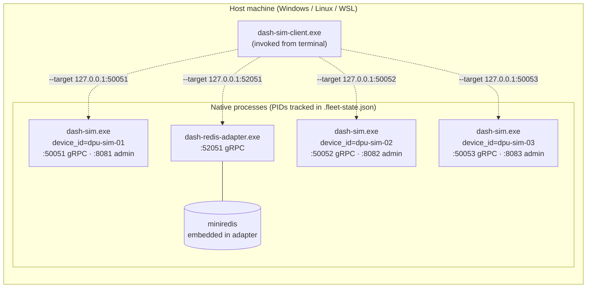

# Topology 01 — Host, multi-port (native processes)

N `dash-sim` processes + (optionally) one `dash-redis-adapter` process
running directly on the host. **One process per DPU entry in
[fleet.yaml](../fleet.example.yaml)**, each on its own gRPC and admin
port. No Docker required.



> **New here?** Follow the [hands-on, step-by-step walkthrough](manual-handson.md) —
> every command + expected log + cleanup, no surprises.

## Prerequisites

Binaries must already be built:

```powershell
cd ..\..\..\src\impl-go
New-Item -ItemType Directory -Path bin -Force | Out-Null
go build -o bin\dash-sim.exe           .\dash-sim\cmd\dash-sim
go build -o bin\dash-sim-client.exe    .\dash-sim-client\cmd\dash-sim-client
go build -o bin\dash-redis-adapter.exe .\dash-redis-adapter\cmd\dash-redis-adapter
```

Linux/WSL:

```bash
cd ../../../src/impl-go
mkdir -p bin
go build -o bin/dash-sim           ./dash-sim/cmd/dash-sim
go build -o bin/dash-sim-client    ./dash-sim-client/cmd/dash-sim-client
go build -o bin/dash-redis-adapter ./dash-redis-adapter/cmd/dash-redis-adapter
```

## Start the fleet

```powershell
pwsh -File .\start-fleet.ps1                          # default config
pwsh -File .\start-fleet.ps1 -Config ..\my.yaml       # custom
pwsh -File .\start-fleet.ps1 -AllowPrivilegedPorts    # permit ports <1024
```

```bash
./start-fleet.sh
./start-fleet.sh -c ../my.json
./start-fleet.sh --allow-privileged
```

What happens:

1. Loads the config (resolution order: see [../README.md](../README.md#config-resolution-order)).
2. Validates (unique ports, scenarios exist, ports ≥ 1024 unless overridden).
3. Spawns `dash-sim` × N as background processes — each with its own
   `--device-id`, `--grpc-listen`, `--admin-listen`, `--scenario`.
4. Spawns `dash-redis-adapter` (only modes `embedded` or `external` are
   supported here; `container` is topology-03-only).
5. Writes `.fleet-state.json` with PIDs + log paths.
6. Runs a `dash-sim-client ping` smoke check against every endpoint.

To grow the fleet, add a DPU entry to `fleet.yaml` and re-run — no
script edits.

## Stop the fleet

```powershell
pwsh -File .\stop-fleet.ps1
```

```bash
./stop-fleet.sh
```

State-file driven, so it's safe and idempotent.

## Files

| File                       | What it is                                  |
|----------------------------|---------------------------------------------|
| `start-fleet.ps1` / `.sh`  | Launch the fleet from `fleet.{yaml,json}`.  |
| `stop-fleet.ps1`  / `.sh`  | Tear it down via `.fleet-state.json`.       |
| `.fleet-state.json`        | Generated at runtime — PIDs + log paths.    |
| `logs/*.log`               | Generated at runtime — one per process.     |
