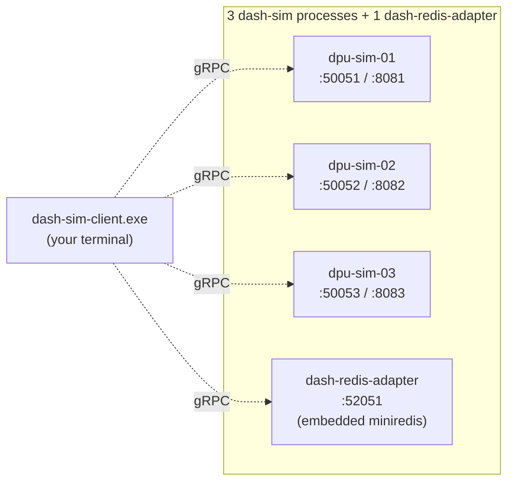

# Topology 01 — Hands-on (Manual Step-by-Step)

A guided, copy-pasteable walkthrough that takes you from a clean
workspace to a running 3-DPU fleet on the host, drives it with the
`dash-sim-client` CLI, and tears it down cleanly. Designed for first-time
operators — every step has a "what to expect" so you know when something
is off.

> **OS coverage.** The PowerShell blocks below run on Windows and on
> PowerShell 7 anywhere. For Linux / WSL / macOS bash, see the §Bash
> equivalents at the end of each section.

---

## What you'll build



| Endpoint              | Port  | What runs there                                |
|-----------------------|------:|------------------------------------------------|
| dpu-sim-01 gRPC       | 50051 | `dash-sim.exe --device-id=dpu-sim-01`          |
| dpu-sim-01 admin HTTP | 8081  | same process, JSON admin API                   |
| dpu-sim-02 gRPC       | 50052 | `dash-sim.exe --device-id=dpu-sim-02`          |
| dpu-sim-02 admin HTTP | 8082  | same process                                   |
| dpu-sim-03 gRPC       | 50053 | `dash-sim.exe --device-id=dpu-sim-03`          |
| dpu-sim-03 admin HTTP | 8083  | same process                                   |
| dash-redis-adapter    | 52051 | `dash-redis-adapter.exe --embedded-redis`      |

---

## Step 1 — Verify the toolchain

```powershell
go version
```

Expect: `go version go1.22.x ...` (or newer).

If `go` is not found, install via `winget install GoLang.Go` and start a
new shell, or follow [scripts/bootstrap.ps1](../../../scripts/bootstrap.ps1).

---

## Step 2 — Build the three binaries

```powershell
cd C:\WorkSpace\PS\PublicRepo\DashCenter\src\impl-go
New-Item -ItemType Directory -Path bin -Force | Out-Null
go build -o bin\dash-sim.exe           .\dash-sim\cmd\dash-sim
go build -o bin\dash-sim-client.exe    .\dash-sim-client\cmd\dash-sim-client
go build -o bin\dash-redis-adapter.exe .\dash-redis-adapter\cmd\dash-redis-adapter
```

**Verify** (expect three `.exe` files, each roughly 15–25 MB):

```powershell
Get-ChildItem bin\*.exe | Format-Table Name, @{N='MB';E={[math]::Round($_.Length/1MB,1)}}
```

```text
Name                       MB
----                       --
dash-redis-adapter.exe   22.0
dash-sim-client.exe      14.9
dash-sim.exe             16.5
```

If the build fails, run `go mod tidy` from `src/impl-go` and retry.

---

## Step 3 — Choose your config file

The tooling reads `fleet.yaml` or `fleet.json` from
`deploy/test-setup/`. The simplest path is to copy the **JSON** example
(no extra dependencies):

```powershell
cd C:\WorkSpace\PS\PublicRepo\DashCenter\deploy\test-setup
Copy-Item .\fleet.example.json .\fleet.json
Get-Content .\fleet.json
```

You should see 3 DPUs (dpu-sim-01/02/03) on ports 50051/52/53 + 8081/82/83,
adapter on 52051, redis mode `embedded`.

**Want to change a port?** Edit `fleet.json` now — every script picks
up the change automatically.

> **YAML lovers:** `Copy-Item .\fleet.example.yaml .\fleet.yaml` works
> too, but requires `Install-Module PowerShell-Yaml -Scope CurrentUser`
> on Windows PowerShell 5.1 (PS 7+ has built-in YAML).

---

## Step 4 — Pre-flight: nothing already on those ports

```powershell
Get-NetTCPConnection -LocalPort 50051,50052,50053,52051,8081,8082,8083 -ErrorAction SilentlyContinue |
  Select-Object LocalPort, State, OwningProcess
```

Expect: empty output. If you see anything in `Listen` state on those
ports, either pick different ports in `fleet.json` or stop the
conflicting process first.

---

## Step 5 — Start the fleet

```powershell
pwsh -File .\01-host-multi-port\start-fleet.ps1
```

You will see:

1. `==> Fleet config: ...\fleet.json` (validation passed).
2. Four `==> Starting ...` blocks (dash-sim/dpu-sim-01/02/03 + dash-redis-adapter).
3. A green table summarising PIDs and endpoints.
4. A `Smoke test:` block with four `OK` lines.

Sample output:

```text
==> Fleet config: C:\WorkSpace\PS\PublicRepo\DashCenter\deploy\test-setup\fleet.json
==> Starting dash-sim/dpu-sim-01
    C:\...\dash-sim.exe --grpc-listen :50051 --admin-listen :8081 --device-id dpu-sim-01 ...
==> Starting dash-sim/dpu-sim-02
==> Starting dash-sim/dpu-sim-03
==> Starting dash-redis-adapter

==> Fleet up. State: ...\01-host-multi-port\.fleet-state.json

role               device_id     pid  grpc            admin
----               ---------     ---  ----            -----
dash-sim           dpu-sim-01   1234  127.0.0.1:50051 http://127.0.0.1:8081
dash-sim           dpu-sim-02   1235  127.0.0.1:50052 http://127.0.0.1:8082
dash-sim           dpu-sim-03   1236  127.0.0.1:50053 http://127.0.0.1:8083
dash-redis-adapter redis-adapter 1237 127.0.0.1:52051

Smoke test:
  127.0.0.1:50051 (dash-sim) ... OK
  127.0.0.1:50052 (dash-sim) ... OK
  127.0.0.1:50053 (dash-sim) ... OK
  127.0.0.1:52051 (dash-redis-adapter) ... OK
```

---

## Step 6 — Verify state files

```powershell
Get-Content .\01-host-multi-port\.fleet-state.json
Get-ChildItem .\01-host-multi-port\logs\
```

Expect:

- `.fleet-state.json` — list of 4 components with their PIDs.
- `logs/` — 4 `.log` files (one per process) plus their `.log.err`
  companions.

**Spot-check a log** to confirm the sim picked up its scenario:

```powershell
Get-Content .\01-host-multi-port\logs\dpu-sim-01.log -TotalCount 10
```

You should see something like:

```text
dash-sim: loaded scenario "...\scenarios\dpu-base.yaml" (sizes=map[acl_group:1 ...])
dash-sim: gRPC listening on :50051 (device=dpu-sim-01)
dash-sim: admin HTTP listening on :8081
```

---

## Step 7 — Confirm the ports are bound

```powershell
Get-NetTCPConnection -LocalPort 50051,50052,50053,52051,8081,8082,8083 -State Listen |
  Select-Object LocalPort, State, OwningProcess | Sort-Object LocalPort
```

Expect: 7 rows, all in `Listen` state, `OwningProcess` matching the PIDs
from step 5.

---

## Step 8 — Set up convenience variables

```powershell
$c    = "..\..\src\impl-go\bin\dash-sim-client.exe"
$sim1 = "127.0.0.1:50051"
$sim2 = "127.0.0.1:50052"
$sim3 = "127.0.0.1:50053"
$ada  = "127.0.0.1:52051"
```

---

## Step 9 — Ping everything

```powershell
$sim1, $sim2, $sim3, $ada | ForEach-Object {
  Write-Host -NoNewline "$_ -> "
  & $c --target $_ ping
}
```

Expect 4 lines like:

```text
127.0.0.1:50051 -> pong device_id=dpu-sim-01 server_time=...
127.0.0.1:50052 -> pong device_id=dpu-sim-02 server_time=...
127.0.0.1:50053 -> pong device_id=dpu-sim-03 server_time=...
127.0.0.1:52051 -> pong device_id=dash-redis-adapter server_time=...
```

---

## Step 10 — Discover the catalog

```powershell
& $c --target $sim1 kinds -o table
```

29 rows showing every DASH object kind and its required key parts.

---

## Step 11 — List the preloaded scenario

The default config preloads
[`scenarios/dpu-base.yaml`](../scenarios/dpu-base.yaml) into every
`dash-sim`. Confirm it's there:

```powershell
& $c --target $sim1 list --kind vnet -o table
& $c --target $sim1 list --kind eni  -o table
& $c --target $sim1 list --kind route -o table
```

Expect 2 vnets (`vnet-prod`, `vnet-stage`), 2 ENIs (`eni-001`,
`eni-002`), 1 route (`rg-prod:10.1.0.0/16`).

---

## Step 12 — Prove the DPUs are independent

```powershell
# Create a VNet only on dpu-sim-02.
& $c --target $sim2 apply --kind vnet --key vnet-only-on-02 --value '{"vni":9002}'

# dpu-sim-02 sees it.
& $c --target $sim2 list --kind vnet -o table

# dpu-sim-01 does NOT.
& $c --target $sim1 list --kind vnet -o table
```

Each `dash-sim` is its own device with its own in-memory store —
this is exactly what makes the multi-DPU topology meaningful.

---

## Step 13 — Run a packet through the pipeline

`dash-sim` implements the full DASH packet pipeline. The preloaded
scenario gives you a working route + vnet_mapping on `eni-001`.

```powershell
# Outbound: should match the LPM route 10.1.0.0/16 and ENCAP.
& $c --target $sim1 simulate `
  --direction outbound --eni eni-001 `
  --src-ip 10.0.0.1 --dst-ip 10.1.0.10 `
  --protocol 6 --src-port 1024 --dst-port 80 --trace
```

The reply (a `Decision`) includes `action`, `matched_route_prefix`,
`matched_acl_priority`, and (because of `--trace`) a per-step pipeline
trace showing direction → ENI → ACL stages → route → mapping → encap.

```powershell
# Inbound: should DELIVER after ACL_IN.
& $c --target $sim1 simulate `
  --direction inbound --eni eni-001 --vni 1001 `
  --src-ip 100.64.0.5 --dst-ip 10.0.0.4 --trace
```

> The `simulate` RPC against `$ada` (redis adapter) returns
> `Unimplemented` by design — Redis APP_DB has no behavioural pipeline.
> Use `dash-sim` for packet sims.

---

## Step 14 — Subscribe to live changes

In a **second** PowerShell window:

```powershell
cd C:\WorkSpace\PS\PublicRepo\DashCenter\deploy\test-setup
$c   = "..\..\src\impl-go\bin\dash-sim-client.exe"
& $c --target 127.0.0.1:50051 subscribe --snapshot --kinds vnet,eni
```

Back in the **first** window:

```powershell
& $c --target $sim1 apply  --kind vnet --key vnet-watch --value '{"vni":1234}'
& $c --target $sim1 delete --kind vnet --key vnet-watch
```

Watch the second window — both events should appear as JSON-ish lines
within a second. `Ctrl-C` to exit the subscribe loop.

---

## Step 15 — Use the admin HTTP endpoints (dash-sim only)

```powershell
Invoke-RestMethod http://127.0.0.1:8081/admin/health | ConvertTo-Json -Depth 5
Invoke-RestMethod http://127.0.0.1:8082/admin/kinds  | ConvertTo-Json -Depth 3
Invoke-RestMethod http://127.0.0.1:8083/admin/dump   | ConvertTo-Json -Depth 6
```

- `/admin/health` — store sizes, subscriber count, dropped events.
- `/admin/kinds` — same 29 names as `dash-sim-client kinds`.
- `/admin/dump` — every object currently in the in-memory store.

**Inject a one-shot Apply failure**, then watch it fire:

```powershell
$body = @{ op = "Apply"; mode = "error"; count = 1; message = "injected" } | ConvertTo-Json
Invoke-RestMethod -Method Post http://127.0.0.1:8081/admin/faults -Body $body -ContentType application/json

# Next Apply against sim1 returns Internal "injected"; subsequent calls succeed.
& $c --target $sim1 apply --kind vnet --key vnet-fault-test --value '{"vni":1}'
& $c --target $sim1 apply --kind vnet --key vnet-fault-test --value '{"vni":1}'
```

---

## Step 16 — Hit the redis adapter (same CLI, different backend)

```powershell
& $c --target $ada apply --kind vnet --key vnet-redis --value '{"vni":7777}'
& $c --target $ada list  --kind vnet -o table
& $c --target $ada get   --kind vnet --key vnet-redis -o yaml
```

The adapter speaks the same gRPC API but persists to (embedded) Redis
in the SONiC APP_DB wire format. From the CLI it looks identical.

---

## Step 17 — Tail a log live (optional)

In a third window:

```powershell
Get-Content .\01-host-multi-port\logs\dpu-sim-01.log -Wait -Tail 30
```

`Ctrl-C` to stop tailing (does **not** stop the process).

---

## Step 18 — Stop the fleet (clean path)

```powershell
pwsh -File .\01-host-multi-port\stop-fleet.ps1
```

Expect 4 `Stopping ... OK` lines and `Fleet stopped.`. Then verify:

```powershell
Get-Content .\01-host-multi-port\.fleet-state.json -ErrorAction SilentlyContinue   # should be empty (file removed)
Get-NetTCPConnection -LocalPort 50051,50052,50053,52051 -State Listen -ErrorAction SilentlyContinue
```

Both checks should produce no output.

---

## Step 19 — Manual cleanup (rescue path)

Only needed if the state file was lost or the stop script can't find
a PID:

```powershell
# Force-kill any lingering processes.
Get-Process dash-sim, dash-redis-adapter -ErrorAction SilentlyContinue |
  Stop-Process -Force

# Confirm none remain.
Get-Process dash-sim, dash-redis-adapter -ErrorAction SilentlyContinue

# Make sure no port is still bound (would indicate a TIME_WAIT we should ignore,
# or a missed process).
Get-NetTCPConnection -LocalPort 50051,50052,50053,52051,8081,8082,8083 -ErrorAction SilentlyContinue |
  Select-Object LocalPort, State, OwningProcess

# Remove state + logs.
Remove-Item .\01-host-multi-port\.fleet-state.json -ErrorAction SilentlyContinue
Remove-Item .\01-host-multi-port\logs -Recurse -Force -ErrorAction SilentlyContinue

# Optional: revert to the fleet.example.yaml fallback.
Remove-Item .\fleet.json -ErrorAction SilentlyContinue
```

---

## Step 20 — Sanity afterglow

```powershell
git status --short deploy\test-setup\
```

Expect just `??` entries for any untracked files you didn't have
before (e.g. `fleet.json` if you kept it). No stray binaries or
state files.

---

## Bash equivalents (Linux / WSL / macOS)

```bash
# Steps 1-2 — build (Linux-native binaries, no .exe suffix)
cd ~/DashCenter/src/impl-go
mkdir -p bin
go build -o bin/dash-sim           ./dash-sim/cmd/dash-sim
go build -o bin/dash-sim-client    ./dash-sim-client/cmd/dash-sim-client
go build -o bin/dash-redis-adapter ./dash-redis-adapter/cmd/dash-redis-adapter

# Steps 3-5 — config + start
cd ~/DashCenter/deploy/test-setup
cp fleet.example.json fleet.json
./01-host-multi-port/start-fleet.sh

# Step 7 — port check
ss -ltnp | grep -E '50051|50052|50053|52051'

# Steps 8-9 — drive
c="../../src/impl-go/bin/dash-sim-client"
$c --target 127.0.0.1:50051 ping
$c --target 127.0.0.1:50052 list --kind vnet -o table

# Step 18 — stop
./01-host-multi-port/stop-fleet.sh

# Step 19 — rescue cleanup
pkill -f 'dash-sim$|dash-sim |dash-redis-adapter' || true
rm -f 01-host-multi-port/.fleet-state.json
rm -rf 01-host-multi-port/logs
```

---

## Troubleshooting

| Symptom | What to do |
|---|---|
| `bind: ... forbidden by its access permissions` | The Windows reserved range claimed your port. Run `netsh interface ipv4 show excludedportrange protocol=tcp`, pick a free port in `fleet.json`, re-run start-fleet. |
| Smoke test prints `FAIL (connection refused)` | The process exited early. Inspect its log: `Get-Content .\01-host-multi-port\logs\<deviceId>.log; Get-Content .\01-host-multi-port\logs\<deviceId>.log.err` |
| `fleet config invalid: port 50051 ...` | Validator caught a duplicate port. Edit `fleet.json` so every port across DPUs + adapter is unique. |
| `Resolve-FleetConfigPath` warned about fallback | You don't have `fleet.json` or `fleet.yaml`; it used `fleet.example.yaml`. Copy the example to a real config to silence the warning. |
| `Missing module 'PowerShell-Yaml'` | You're using a YAML config on Windows PowerShell 5.1. Either `Install-Module PowerShell-Yaml -Scope CurrentUser` or use the JSON example instead. |
| `stop-fleet.ps1` reports `already gone` | The process died before stop was called — fine. Inspect the `.log.err` of that component to see why. |
