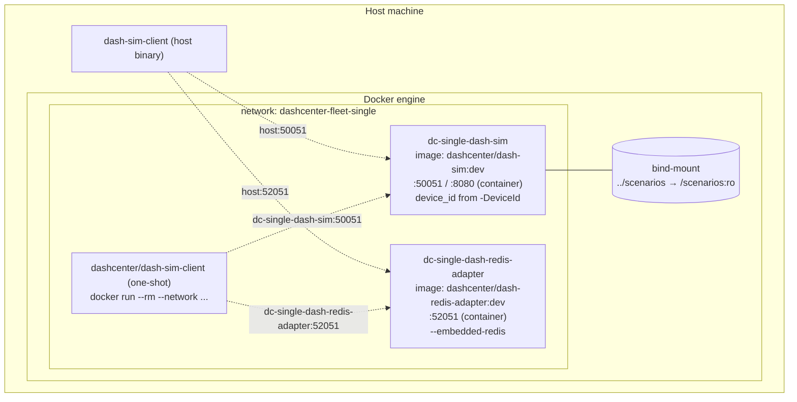

# Topology 02 — Single Docker (one DPU in a container)

Runs **one** `dash-sim` container (the DPU you pick from
[fleet.yaml](../fleet.example.yaml) by `-DeviceId`) plus, by default,
the `dash-redis-adapter` container, on an isolated docker network.

Use this for image validation. For a true multi-DPU fleet, use
[../03-multi-docker-fleet/README.md](../03-multi-docker-fleet/README.md).



> **New here?** Follow the [hands-on, step-by-step walkthrough](manual-handson.md) —
> every command + expected log + cleanup, no surprises.

## 1. Build the images

```powershell
pwsh -File .\build-images.ps1
```

```bash
./build-images.sh
```

Produces (from the repo-root build context):

| Image                                | Dockerfile                                  |
|--------------------------------------|---------------------------------------------|
| `dashcenter/dash-sim:dev`            | `src/impl-go/dash-sim/Dockerfile`           |
| `dashcenter/dash-redis-adapter:dev`  | `src/impl-go/dash-redis-adapter/Dockerfile` |
| `dashcenter/dash-sim-client:dev`     | `src/impl-go/dash-sim-client/Dockerfile`    |

The build is hermetic (multi-stage, distroless runtime) — no Go
toolchain required on the host.

## 2. Run one DPU

```powershell
pwsh -File .\run-single.ps1                          # first DPU in fleet config
pwsh -File .\run-single.ps1 -DeviceId dpu-sim-02     # pick a specific DPU
pwsh -File .\run-single.ps1 -NoAdapter               # skip dash-redis-adapter
pwsh -File .\run-single.ps1 -Stop                    # tear down
```

```bash
./run-single.sh
./run-single.sh -d dpu-sim-02
./run-single.sh --no-adapter
./run-single.sh stop
```

The script reads `fleet.{yaml,json}`, picks the chosen DPU entry, and
runs:

- `dc-single-dash-sim` exposing the DPU's `grpcPort` (host) → `50051`
  (container) and `adminPort` → `8080`.
- `dc-single-dash-redis-adapter` exposing `adapter.grpcPort` → `52051`.
- Mounts `deploy/test-setup/scenarios/` into both containers at
  `/scenarios:ro` so per-DPU scenarios resolve correctly.

`adapter.redis.mode = container` is **not** supported in this topology
(use topology 03). `embedded` and `external` both work.

## 3. Drive it

From the host (port comes from your config):

```powershell
$c = "..\..\..\src\impl-go\bin\dash-sim-client.exe"
& $c --target 127.0.0.1:50051 ping
& $c --target 127.0.0.1:52051 apply --kind vnet --key vnet-prod --value '{"vni":1001}'
```

From inside the docker network (no host binary needed):

```powershell
docker run --rm --network dashcenter-fleet-single dashcenter/dash-sim-client:dev `
  --target dc-single-dash-sim:50051 ping
```

## 4. Tear it down

```powershell
pwsh -File .\run-single.ps1 -Stop
```

```bash
./run-single.sh stop
```
