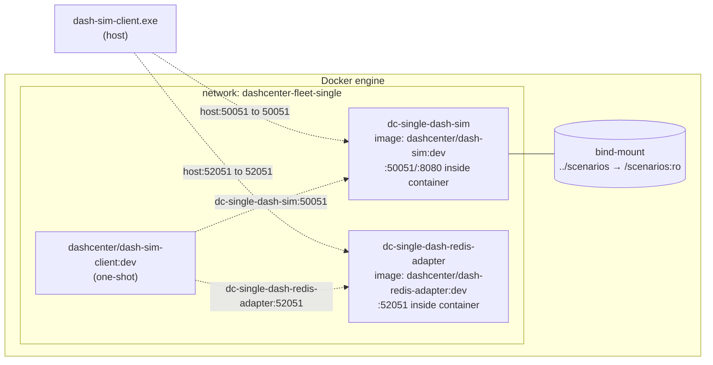

# Topology 02 — Hands-on (Manual Step-by-Step)

A guided, copy-pasteable walkthrough that builds the three DashCenter
container images, runs **one** `dash-sim` container + the
`dash-redis-adapter` container on an isolated docker network, drives
them with `dash-sim-client` (both from the host and via a one-shot CLI
container), and tears everything down cleanly.

> Use this topology to validate the container images. For a true
> multi-DPU fleet, see
> [../03-multi-docker-fleet/manual-handson.md](../03-multi-docker-fleet/manual-handson.md).

---

## What you'll build



| Container                       | Image                                | Host port | Container port |
|---------------------------------|--------------------------------------|----------:|---------------:|
| `dc-single-dash-sim`            | `dashcenter/dash-sim:dev`            | 50051     | 50051 (gRPC)   |
|                                 |                                      | 8081      | 8080 (admin)   |
| `dc-single-dash-redis-adapter`  | `dashcenter/dash-redis-adapter:dev`  | 52051     | 52051 (gRPC)   |
| `dashcenter/dash-sim-client:dev`| —                                    | —         | one-shot CLI   |

The exact host port and the `--device-id` come from your
[fleet.{yaml,json}](../fleet.example.yaml) — picked by `-DeviceId`.

---

## Step 1 — Verify Docker

```powershell
docker version
docker info | Select-String 'Server Version', 'OSType'
```

Expect Docker Desktop running (Server Version + OSType visible). If
not, start Docker Desktop and wait until its tray icon goes green.

---

## Step 2 — Choose your config file

The run script reads the same `fleet.yaml` / `fleet.json` as the other
topologies. JSON is the zero-dependency path:

```powershell
cd C:\WorkSpace\PS\PublicRepo\DashCenter\deploy\test-setup
Copy-Item .\fleet.example.json .\fleet.json -Force
Get-Content .\fleet.json
```

You'll see 3 DPUs defined — topology 02 only launches **one** of them
per `run-single` invocation (default: the first; override with
`-DeviceId`).

---

## Step 3 — Build the three images

```powershell
pwsh -File .\02-single-docker\build-images.ps1
```

What it does (each step takes ~30 s on first run, cached after):

1. `docker build -t dashcenter/dash-sim:dev           -f src/impl-go/dash-sim/Dockerfile           <repo>`
2. `docker build -t dashcenter/dash-redis-adapter:dev -f src/impl-go/dash-redis-adapter/Dockerfile <repo>`
3. `docker build -t dashcenter/dash-sim-client:dev    -f src/impl-go/dash-sim-client/Dockerfile    <repo>`

**Verify** (expect 3 rows, each tagged `dev`, each ~20 MB):

```powershell
docker images --filter "reference=dashcenter/*:dev"
```

```text
REPOSITORY                        TAG   IMAGE ID       SIZE
dashcenter/dash-sim               dev   abc123def456   18MB
dashcenter/dash-redis-adapter     dev   ...            21MB
dashcenter/dash-sim-client        dev   ...            15MB
```

If a build fails, the most common cause is an out-of-date Go module
cache. Re-run after `go mod tidy` in `src/impl-go/dash-sim` (or wherever
the failure pointed).

---

## Step 4 — Pre-flight: ports + name collisions

```powershell
# Are any of our host ports taken?
Get-NetTCPConnection -LocalPort 50051,8081,52051 -ErrorAction SilentlyContinue |
  Select-Object LocalPort, State, OwningProcess

# Are container names still around from a previous run?
docker ps -a --filter "name=dc-single-" --format "table {{.Names}}\t{{.Status}}"
```

If the second command shows leftover containers, either re-run
`run-single.ps1 -Stop` (it's idempotent) or `docker rm -f dc-single-dash-sim dc-single-dash-redis-adapter`.

---

## Step 5 — Start the topology

```powershell
pwsh -File .\02-single-docker\run-single.ps1
```

That defaults to the **first** DPU in `fleet.json` (`dpu-sim-01`).
To pick a specific DPU:

```powershell
pwsh -File .\02-single-docker\run-single.ps1 -DeviceId dpu-sim-02
```

Expected output:

```text
==> No -DeviceId specified; using dpu-sim-01
==> Fleet config: ...\fleet.json
==> Creating network dashcenter-fleet-single
==> Starting dc-single-dash-sim
==> Starting dc-single-dash-redis-adapter

==> Containers:
NAMES                          IMAGE                                  PORTS                                                STATUS
dc-single-dash-sim             dashcenter/dash-sim:dev                127.0.0.1:50051->50051/tcp, 127.0.0.1:8081->8080/tcp Up 1 second
dc-single-dash-redis-adapter   dashcenter/dash-redis-adapter:dev      127.0.0.1:52051->52051/tcp                           Up 1 second

==> Smoke test (via CLI container, on the docker network):
pong device_id=dpu-sim-01 server_time=...
pong device_id=dash-redis-adapter server_time=...

Drive from host: dash-sim-client --target 127.0.0.1:50051 ping
Tear down:       pwsh -File .\run-single.ps1 -Stop
```

---

## Step 6 — Verify the containers are healthy

```powershell
docker ps --filter "name=dc-single-" --format "table {{.Names}}\t{{.Image}}\t{{.Ports}}\t{{.Status}}"
docker network inspect dashcenter-fleet-single |
  Select-String 'Name|Subnet|Container'
```

Expect both containers `Up <n> seconds` and attached to the
`dashcenter-fleet-single` network.

---

## Step 7 — Peek at the logs

```powershell
docker logs dc-single-dash-sim            --tail 10
docker logs dc-single-dash-redis-adapter  --tail 10
```

Sample `dc-single-dash-sim`:

```text
dash-sim: loaded scenario "/scenarios/dpu-base.yaml" (sizes=map[acl_group:1 acl_in:1 ...])
dash-sim: gRPC listening on :50051 (device=dpu-sim-01)
dash-sim: admin HTTP listening on :8080
```

Sample `dc-single-dash-redis-adapter`:

```text
dash-redis-adapter: started embedded miniredis at 127.0.0.1:xxxxx
dash-redis-adapter: connected to Redis at 127.0.0.1:xxxxx (db=0)
dash-redis-adapter: gRPC listening on :52051
```

If either container is `Exited`, immediately:

```powershell
docker logs dc-single-dash-sim            # full output
docker logs dc-single-dash-redis-adapter
```

— the error will be at the bottom.

---

## Step 8 — Drive from the host

```powershell
$c    = "..\..\src\impl-go\bin\dash-sim-client.exe"
$sim  = "127.0.0.1:50051"
$ada  = "127.0.0.1:52051"

& $c --target $sim ping
& $c --target $ada ping
```

Expect (the CLI ping returns a one-line `ok:` summary, not `pong`):

```text
ok: target=127.0.0.1:50051 vnets=2
ok: target=127.0.0.1:52051 vnets=0
```

> No host binary? Skip ahead to step 10 (CLI container).

---

## Step 9 — Exercise the API from the host

```powershell
# What's preloaded (the bind-mounted ../scenarios/dpu-base.yaml).
& $c --target $sim list --kind vnet  -o table
& $c --target $sim list --kind eni   -o table
& $c --target $sim list --kind route -o table

# Add a new VNet, read it back.
& $c --target $sim apply --kind vnet --key vnet-test02 --value '{"vni":2002}'
& $c --target $sim get   --kind vnet --key vnet-test02 -o yaml

# Run a packet through the pipeline (preloaded scenario gives you a route).
# Expected: action=DROP with reason "vnet_mapping vnet-stage/10.1.0.10: not found".
# That's intentional — the preloaded scenario has a route to vnet-stage but no
# vnet_mapping for that destination, so the pipeline honestly says "no mapping".
# The --trace output walks you through every pipeline stage that ran.
& $c --target $sim simulate `
  --direction outbound --eni eni-001 `
  --src-ip 10.0.0.1 --dst-ip 10.1.0.10 `
  --protocol 6 --src-port 1024 --dst-port 80 --trace

# To get an ENCAP decision instead, first add the missing mapping:
#   & $c --target $sim apply --kind vnet_mapping --key "vnet-stage:10.1.0.10" --value '{
#     "underlay_ip":{"ipv4": 343798372},
#     "mac_address":"AKqrzN3u",
#     "routing_type":"ROUTING_TYPE_VNET"
#   }'
# Then re-run the simulate above and observe action=FORWARD with out_underlay_ip set.

# Same CLI against the adapter.
& $c --target $ada apply --kind vnet --key vnet-redis --value '{"vni":7777}'
& $c --target $ada list  --kind vnet -o table
```

---

## Step 10 — Drive via the CLI container (no host binary)

```powershell
docker run --rm --network dashcenter-fleet-single dashcenter/dash-sim-client:dev `
  --target dc-single-dash-sim:50051 ping

docker run --rm --network dashcenter-fleet-single dashcenter/dash-sim-client:dev `
  --target dc-single-dash-sim:50051 list --kind vnet -o table

docker run --rm --network dashcenter-fleet-single dashcenter/dash-sim-client:dev `
  --target dc-single-dash-redis-adapter:52051 apply --kind vnet --key vnet-from-container --value '{"vni":4242}'
```

Note that **container-network targets use the container names**
(`dc-single-dash-sim:50051`), not `localhost`. From outside the docker
network you use the **host port** (50051). Both work.

---

## Step 10a — Referential integrity (FK validation)

`dash-sim` validates foreign-key references at apply time. Wrong refs
are rejected instantly with a clear error telling you what's missing.

### Why this matters

Every DASH object kind exists in a dependency hierarchy:

```
Tier 0 (roots):  vnet, acl_group, route_group, ...  (no dependencies)
Tier 1 (→ T0):   eni→vnet, acl_rule→acl_group, route→route_group
Tier 2 (→ T0+1): eni_route→eni+route_group, acl_in→eni+acl_group
```

If you create an ENI before its vnet, the ENI has a dangling reference.
Packets will drop silently. FK validation catches this at Apply time.

### Experiment A — wrong config (FAIL)

```powershell
# ENI references a vnet that doesn't exist
& $c --target $sim apply --kind eni --key eni-bad --value '{"vnet":"no-such-vnet"}'
```

**Error:**
```
referential integrity: eni references vnet "no-such-vnet" (field vnet)
which does not exist; create it first
```

**Why**: `eni` is Tier 1 — its `vnet` field must point to an existing
vnet object. `"no-such-vnet"` doesn't exist. The ENI is not stored.

### Experiment B — right config: create dependencies first (PASS)

```powershell
# Tier 0: vnet first (no FK checks needed)
& $c --target $sim apply --kind vnet --key vnet-ri --value '{"vni":42}'
# → accepted ✅

# Tier 1: eni references the vnet (now exists)
& $c --target $sim apply --kind eni  --key eni-ri  --value '{"vnet":"vnet-ri"}'
# → accepted ✅  (vnet-ri exists — FK check passes)
```

### Clean up

```powershell
& $c --target $sim delete --kind eni  --key eni-ri
& $c --target $sim delete --kind vnet --key vnet-ri
```

> See [referential-integrity-validation.md](../../../docs/dashd-features/referential-integrity-validation.md)
> for the full FK map and tier ordering.

---

## Step 11 — Admin HTTP (dash-sim only)

The host port mapping is `8081 → container 8080`:

```powershell
Invoke-RestMethod http://127.0.0.1:8081/admin/health | ConvertTo-Json -Depth 5
Invoke-RestMethod http://127.0.0.1:8081/admin/kinds  | ConvertTo-Json -Depth 3
Invoke-RestMethod http://127.0.0.1:8081/admin/dump   | ConvertTo-Json -Depth 6
```

Inject a one-shot Apply failure (mirrors topology 01):

```powershell
$body = @{ op = "Apply"; mode = "error"; count = 1; message = "container-injected" } | ConvertTo-Json
Invoke-RestMethod -Method Post http://127.0.0.1:8081/admin/faults -Body $body -ContentType application/json
& $c --target $sim apply --kind vnet --key vnet-fault --value '{"vni":1}'
& $c --target $sim apply --kind vnet --key vnet-fault --value '{"vni":1}'
```

First call fails with `Internal: container-injected`, second succeeds.

---

## Step 12 — Live log tail (optional)

In a second PowerShell window:

```powershell
docker logs -f dc-single-dash-sim
```

Then trigger something in the first window and watch the log scroll.
`Ctrl-C` stops tailing (does NOT stop the container).

---

## Step 13 — Inspect inside a container (optional)

The image is distroless (no shell), so you can't `docker exec -it ... sh`.
For container introspection use:

```powershell
docker inspect dc-single-dash-sim |
  ConvertFrom-Json |
  Select-Object -ExpandProperty 0 |
  Select-Object Id, @{N='Cmd';E={$_.Config.Cmd -join ' '}}, @{N='Mounts';E={$_.Mounts | ConvertTo-Json -Compress}} |
  Format-List
```

This shows the launch command and the bind-mounted `/scenarios`.

---

## Step 14 — Stop the topology (clean path)

```powershell
pwsh -File .\02-single-docker\run-single.ps1 -Stop
```

Expect:

```text
==> Stopping single-DPU topology
Done.
```

Verify it's actually gone:

```powershell
docker ps -a --filter "name=dc-single-"        # should be empty
docker network ls --filter "name=dashcenter-fleet-single"   # should be empty
Get-NetTCPConnection -LocalPort 50051,8081,52051 -State Listen -ErrorAction SilentlyContinue
```

---

## Step 15 — Manual cleanup (rescue path)

Only if the stop script can't reach docker (or you renamed things):

```powershell
# Force-remove containers.
docker rm -f dc-single-dash-sim dc-single-dash-redis-adapter 2>$null

# Force-remove network.
docker network rm dashcenter-fleet-single 2>$null

# Anything else hanging on our ports?
Get-NetTCPConnection -LocalPort 50051,8081,52051 -ErrorAction SilentlyContinue |
  Select-Object LocalPort, State, OwningProcess
```

---

## Step 16 — Remove images (only if you want to)

The images are reusable across runs. Remove only if you want to free
disk:

```powershell
docker image rm dashcenter/dash-sim:dev `
                dashcenter/dash-redis-adapter:dev `
                dashcenter/dash-sim-client:dev

docker image prune -f      # drops dangling layers
```

Rebuild any time with `pwsh -File .\02-single-docker\build-images.ps1`.

---

## Step 17 — Revert config (only if you want to)

```powershell
Remove-Item .\fleet.json -ErrorAction SilentlyContinue
```

Next start will fall back to `fleet.example.yaml` (with a warning).

---

## Bash equivalents (Linux / WSL / macOS)

```bash
cd ~/DashCenter/deploy/test-setup
cp fleet.example.json fleet.json

./02-single-docker/build-images.sh
./02-single-docker/run-single.sh                     # first DPU
./02-single-docker/run-single.sh -d dpu-sim-02       # pick one
./02-single-docker/run-single.sh --no-adapter        # skip adapter

# Drive from host:
c="../../src/impl-go/bin/dash-sim-client"
$c --target 127.0.0.1:50051 ping
$c --target 127.0.0.1:52051 list --kind vnet -o table

# Drive via container:
docker run --rm --network dashcenter-fleet-single dashcenter/dash-sim-client:dev \
  --target dc-single-dash-sim:50051 ping

# Logs:
docker logs dc-single-dash-sim

# Stop:
./02-single-docker/run-single.sh stop

# Rescue cleanup:
docker rm -f dc-single-dash-sim dc-single-dash-redis-adapter 2>/dev/null || true
docker network rm dashcenter-fleet-single 2>/dev/null || true
```

---

## Troubleshooting

| Symptom | What to do |
|---|---|
| `Missing image(s): dashcenter/dash-sim:dev ...` | You haven't run `build-images.ps1` yet — run it. |
| `Bind for 0.0.0.0:50051 failed: port is already allocated` | Another container (or topology) holds that port. `docker ps`, then `docker rm -f <name>`, then re-run. |
| `Error response from daemon: ... bind source path does not exist: .../scenarios` | The scenarios folder went missing. Verify `Test-Path .\scenarios\dpu-base.yaml` — re-clone or re-check out the repo if absent. |
| Container `Exited (1) Just now` | `docker logs <name>` — the error line is at the bottom (usually a flag typo or scenario decode failure). |
| `Cannot connect to the Docker daemon` | Docker Desktop isn't running on Windows, or `dockerd` isn't running on Linux. Start it and retry. |
| Smoke test `connection refused` to `dc-single-dash-sim:50051` from CLI container | Container died between start and smoke. `docker logs dc-single-dash-sim` will show why; usually a config/scenario issue. |
| `deviceId 'dpu-sim-09' not found` | The `-DeviceId` you passed isn't in `fleet.json`. Either add it or pick one from `Get-Content .\fleet.json`. |
