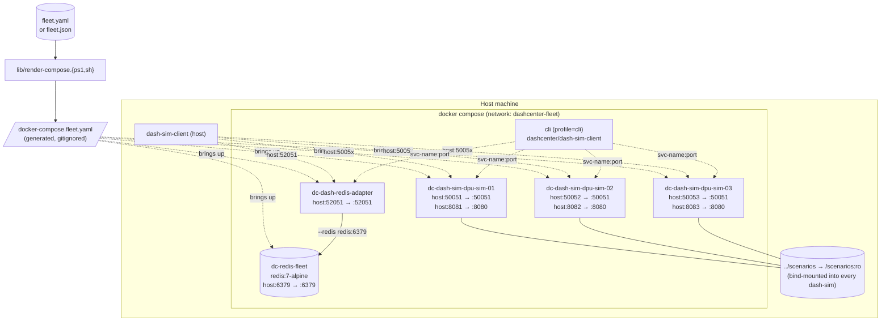

# Topology 03 — Multi-Docker Fleet (compose)

N `dash-sim` containers (one per DPU in [fleet.yaml](../fleet.example.yaml))
+ `dash-redis-adapter` + (optionally) `redis`, all on one compose
network. Each `dash-sim` is a genuinely separate device — own state,
own counters, own `--device-id` — and is reachable on its own host
port.



> **New here?** Follow the [hands-on, step-by-step walkthrough](manual-handson.md) —
> every command + expected log + cleanup, no surprises.

## Compose file: generated, not hand-written

To avoid drift between the user's port plan in `fleet.yaml` and the
compose definition, the compose file is **regenerated** from the active
config on demand:

```powershell
pwsh -File ..\lib\render-compose.ps1
```

```bash
../lib/render-compose.sh
```

This writes:

- `docker-compose.fleet.yaml` — one `dash-sim-<deviceId>` service per
  DPU, redis service iff `adapter.redis.mode == container`, adapter
  service iff `adapter.enabled`, plus a `cli` profile.
- `.env` — informational metadata (`DC_FLEET_CONFIG`, etc.).

Both files are listed in `.gitignore`. Re-run the renderer whenever
`fleet.{yaml,json}` changes.

### Want to hand-tune the compose definition?

Use [docker-compose.fleet.yaml.example](docker-compose.fleet.yaml.example)
as a starting point — it's the same shape the renderer produces, but
committed for hand editing:

```powershell
Copy-Item .\docker-compose.fleet.yaml.example .\docker-compose.fleet.yaml
# edit ...
docker compose -f .\docker-compose.fleet.yaml up -d --build
```

The renderer will overwrite `docker-compose.fleet.yaml` next time you
call it, so keep a copy under a different name if you go this route.

## Quick start (config-driven)

```powershell
pwsh -File ..\lib\render-compose.ps1
docker compose -f .\docker-compose.fleet.yaml up -d --build
docker compose -f .\docker-compose.fleet.yaml ps
```

```bash
../lib/render-compose.sh
docker compose -f docker-compose.fleet.yaml up -d --build
docker compose -f docker-compose.fleet.yaml ps
```

Tear down:

```powershell
docker compose -f .\docker-compose.fleet.yaml down -v
```

## What comes up (with the example config)

| Service                      | Container name             | Host port      | Notes                       |
|------------------------------|----------------------------|---------------:|-----------------------------|
| `dash-sim-dpu-sim-01`        | `dc-dash-sim-dpu-sim-01`   | 50051 / 8081   | device_id `dpu-sim-01`      |
| `dash-sim-dpu-sim-02`        | `dc-dash-sim-dpu-sim-02`   | 50052 / 8082   | device_id `dpu-sim-02`      |
| `dash-sim-dpu-sim-03`        | `dc-dash-sim-dpu-sim-03`   | 50053 / 8083   | device_id `dpu-sim-03`      |
| `redis`                      | `dc-redis-fleet`           | 6379           | only if `redis.mode=container` |
| `dash-redis-adapter`         | `dc-dash-redis-adapter`    | 52051          | `--redis redis:6379` or `--embedded-redis` |
| `cli` (profile=cli)          | one-shot                   | n/a            | `docker compose run cli ...` |

Every `dash-sim` mounts `../scenarios/` read-only and preloads its
configured scenario.

## Drive from the host

```powershell
$c = "..\..\..\src\impl-go\bin\dash-sim-client.exe"
& $c --target 127.0.0.1:50051 ping        # dpu-sim-01
& $c --target 127.0.0.1:50052 ping        # dpu-sim-02
& $c --target 127.0.0.1:50053 ping        # dpu-sim-03
& $c --target 127.0.0.1:52051 ping        # dash-redis-adapter
```

## Drive from inside the docker network

```powershell
docker compose -f .\docker-compose.fleet.yaml --profile cli run --rm cli `
  --target dash-sim-dpu-sim-02:50051 list --kind vnet -o table
```

## Files

| File                                   | What it is                                          |
|----------------------------------------|-----------------------------------------------------|
| `docker-compose.fleet.yaml.example`    | Committed reference for hand editing.               |
| `docker-compose.fleet.yaml`            | Generated by `../lib/render-compose.{ps1,sh}`. *(gitignored)* |
| `.env`                                 | Generated companion. *(gitignored)*                  |
