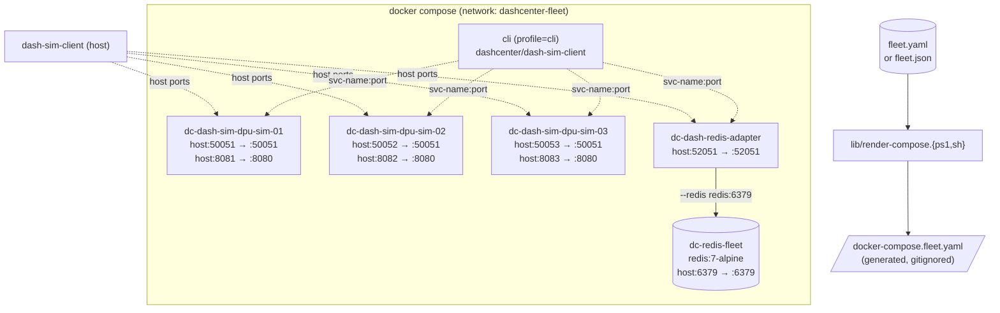

# Topology 03 — Hands-on (Manual Step-by-Step)

A guided, copy-pasteable walkthrough that builds a full multi-DPU
DashCenter fleet with `docker compose`: N `dash-sim` containers (one
per DPU in your fleet config), `dash-redis-adapter`, optionally a real
`redis` container, plus a one-shot `cli` profile. We drive everything
with `dash-sim-client` from both the host and from inside the docker
network, peek at the SONiC APP_DB wire format directly in Redis, and
tear everything down cleanly.

---

## What you'll build



| Service                       | Container name              | Host port      | Notes                              |
|-------------------------------|-----------------------------|---------------:|------------------------------------|
| `redis`                       | `dc-redis-fleet`            | 6379           | Only if `redis.mode == container`  |
| `dash-sim-dpu-sim-01`         | `dc-dash-sim-dpu-sim-01`    | 50051 / 8081   | `device_id=dpu-sim-01`             |
| `dash-sim-dpu-sim-02`         | `dc-dash-sim-dpu-sim-02`    | 50052 / 8082   | `device_id=dpu-sim-02`             |
| `dash-sim-dpu-sim-03`         | `dc-dash-sim-dpu-sim-03`    | 50053 / 8083   | `device_id=dpu-sim-03`             |
| `dash-redis-adapter`          | `dc-dash-redis-adapter`     | 52051          | `--redis redis:6379` (in this run) |
| `cli` (profile=cli)           | one-shot                    | n/a            | for inside-network CLI calls       |

---

## Step 1 — Verify Docker

```powershell
docker version
docker compose version
docker info | Select-String 'Server Version', 'OSType'
```

Both `docker version` and `docker compose version` must succeed. If
`docker compose` says "is not a docker command", install Compose v2
(bundled with Docker Desktop ≥ 20; on Linux `apt-get install docker-compose-plugin`).

---

## Step 2 — Choose a config that uses a real Redis container

For topology 03 we want `adapter.redis.mode = container` so the
adapter talks to a real Redis we can inspect. JSON path (no extra deps):

```powershell
cd C:\WorkSpace\PS\PublicRepo\DashCenter\deploy\test-setup
Copy-Item .\fleet.example.json .\fleet.json -Force
```

Now switch the redis mode from `embedded` to `container`:

```powershell
# View current.
(Get-Content .\fleet.json | ConvertFrom-Json).adapter.redis

# Patch in place.
$cfg = Get-Content .\fleet.json | ConvertFrom-Json
$cfg.adapter.redis.mode = "container"
$cfg | ConvertTo-Json -Depth 6 | Set-Content .\fleet.json -Encoding UTF8

# Confirm.
(Get-Content .\fleet.json | ConvertFrom-Json).adapter.redis
```

> **Why?** Topologies 01 and 02 use the embedded miniredis baked into
> the adapter binary (zero external deps). Topology 03 is where we
> demonstrate the actual SONiC APP_DB wire format, which requires a
> real Redis container.

---

## Step 3 — Render the compose file from the config

The compose file is **generated** so it always matches `fleet.json`:

```powershell
pwsh -File .\lib\render-compose.ps1
```

Expect two `wrote ...` lines:

```text
wrote C:\...\deploy\test-setup\03-multi-docker-fleet\docker-compose.fleet.yaml
wrote C:\...\deploy\test-setup\03-multi-docker-fleet\.env

Next: docker compose -f "C:\...\docker-compose.fleet.yaml" up -d --build
```

Inspect the head of the generated file:

```powershell
Get-Content .\03-multi-docker-fleet\docker-compose.fleet.yaml -TotalCount 30
```

You should see the auto-generated banner and a `redis:` service
block at the top (because we set `mode = container`).

> **Re-run the renderer any time you change `fleet.json`** — the
> compose file is gitignored on purpose.

---

## Step 4 — Pre-flight: ports + name collisions

```powershell
Get-NetTCPConnection -LocalPort 50051,50052,50053,52051,6379,8081,8082,8083 -ErrorAction SilentlyContinue |
  Select-Object LocalPort, State, OwningProcess

docker ps -a --filter "name=dc-" --format "table {{.Names}}\t{{.Status}}"
```

If the second command shows leftover `dc-...` containers from another
topology, stop them first. From topology 02:
`docker rm -f dc-single-dash-sim dc-single-dash-redis-adapter`.

---

## Step 5 — Bring the fleet up

```powershell
cd .\03-multi-docker-fleet
docker compose -f .\docker-compose.fleet.yaml up -d --build
```

First run builds the three images (~30 s each), then starts 5
containers. Expected tail:

```text
 ✔ Network dashcenter-fleet                  Created
 ✔ Container dc-redis-fleet                  Started
 ✔ Container dc-dash-sim-dpu-sim-01          Started
 ✔ Container dc-dash-sim-dpu-sim-02          Started
 ✔ Container dc-dash-sim-dpu-sim-03          Started
 ✔ Container dc-dash-redis-adapter           Started
```

---

## Step 6 — Verify everything is running

```powershell
docker compose -f .\docker-compose.fleet.yaml ps
```

Expect 5 rows, each in `running` state, each with its host port
mapping (`127.0.0.1:50051->50051/tcp`, etc.).

```powershell
docker network inspect dashcenter-fleet |
  ConvertFrom-Json |
  Select-Object -ExpandProperty 0 |
  Select-Object Name, Driver, @{N='Containers';E={ $_.Containers.PSObject.Properties.Name }}
```

You should see all 5 containers attached to `dashcenter-fleet`.

---

## Step 7 — Peek at every log

```powershell
docker compose -f .\docker-compose.fleet.yaml logs --tail=10 dash-sim-dpu-sim-01
docker compose -f .\docker-compose.fleet.yaml logs --tail=10 dash-sim-dpu-sim-02
docker compose -f .\docker-compose.fleet.yaml logs --tail=10 dash-sim-dpu-sim-03
docker compose -f .\docker-compose.fleet.yaml logs --tail=10 dash-redis-adapter
docker compose -f .\docker-compose.fleet.yaml logs --tail=10 redis
```

Each `dash-sim-...` should report `loaded scenario "/scenarios/dpu-base.yaml"`
and `gRPC listening on :50051 (device=dpu-sim-XX)`.

`dash-redis-adapter` should report `connected to Redis at redis:6379`.

---

## Step 8 — Set up host CLI shortcuts

```powershell
cd C:\WorkSpace\PS\PublicRepo\DashCenter\deploy\test-setup
$c    = "..\..\src\impl-go\bin\dash-sim-client.exe"   # built per topology 01 step 2
$sim1 = "127.0.0.1:50051"
$sim2 = "127.0.0.1:50052"
$sim3 = "127.0.0.1:50053"
$ada  = "127.0.0.1:52051"
```

> **No host binary?** Skip to step 13 — you can do everything via the
> `cli` profile container.

---

## Step 9 — Ping every endpoint

```powershell
$sim1, $sim2, $sim3, $ada | ForEach-Object {
  Write-Host -NoNewline "$_ -> "
  & $c --target $_ ping
}
```

All four should return `pong device_id=...`.

---

## Step 10 — Confirm independence: write to one, read on all

```powershell
# Preloaded scenario gives every sim the same starter set:
& $c --target $sim1 list --kind vnet -o table
& $c --target $sim2 list --kind vnet -o table
& $c --target $sim3 list --kind vnet -o table

# But each store is independent — write a new VNet only on sim2:
& $c --target $sim2 apply --kind vnet --key vnet-only-on-02 --value '{"vni":2002}'

& $c --target $sim2 list --kind vnet -o table        # has vnet-only-on-02
& $c --target $sim1 list --kind vnet -o table        # does NOT
& $c --target $sim3 list --kind vnet -o table        # does NOT
```

---

## Step 11 — Multi-DPU fan-out

```powershell
$targets = @($sim1, $sim2, $sim3)

# Same write, every DPU.
foreach ($t in $targets) {
  & $c --target $t apply --kind vnet --key vnet-fleet --value '{"vni":9001}'
}

# Read it back from every DPU — should appear in all three.
foreach ($t in $targets) {
  Write-Host "==> $t"
  & $c --target $t get --kind vnet --key vnet-fleet -o yaml
}
```

This is the smallest-possible multi-DPU integration test: one write per
DPU, three reads, identical results.

---

## Step 12 — Push to the adapter and inspect Redis directly

This is the *point* of topology 03. The adapter speaks the same DASH
gRPC API but persists to Redis in the SONiC APP_DB wire format:

```
Key:   "DASH_<KIND>_TABLE:<joined-key>"
Value: HASH { pb: <binary protobuf>, meta: <JSON {created_ts_ns, updated_ts_ns}> }
```

Write through the adapter:

```powershell
& $c --target $ada apply --kind vnet --key vnet-prod  --value '{"vni":1001}'
& $c --target $ada apply --kind vnet --key vnet-stage --value '{"vni":1002}'
& $c --target $ada list  --kind vnet -o table
```

Now look at the keys directly in Redis:

```powershell
docker exec -it dc-redis-fleet redis-cli KEYS 'DASH_VNET_TABLE:*'
docker exec -it dc-redis-fleet redis-cli HGETALL DASH_VNET_TABLE:vnet-prod
docker exec -it dc-redis-fleet redis-cli HKEYS DASH_VNET_TABLE:vnet-prod
```

You should see:

- Two keys: `DASH_VNET_TABLE:vnet-prod` and `DASH_VNET_TABLE:vnet-stage`.
- HASH fields: `pb` (binary — Redis will show some non-printable bytes)
  and `meta` (JSON with two timestamps).

---

## Step 13 — Drive via the CLI profile container (no host binary)

```powershell
docker compose -f .\03-multi-docker-fleet\docker-compose.fleet.yaml --profile cli run --rm cli `
  --target dash-sim-dpu-sim-01:50051 ping

docker compose -f .\03-multi-docker-fleet\docker-compose.fleet.yaml --profile cli run --rm cli `
  --target dash-sim-dpu-sim-02:50051 list --kind vnet -o table

docker compose -f .\03-multi-docker-fleet\docker-compose.fleet.yaml --profile cli run --rm cli `
  --target dash-redis-adapter:52051 list --kind vnet -o table
```

Inside the docker network you address each service by its **service
name** (e.g. `dash-sim-dpu-sim-01`), not `localhost`. From the host you
use `127.0.0.1:<port>`. Both work.

---

## Step 14 — Packet simulation on dpu-sim-01

```powershell
& $c --target $sim1 simulate `
  --direction outbound --eni eni-001 `
  --src-ip 10.0.0.1 --dst-ip 10.1.0.10 `
  --protocol 6 --src-port 1024 --dst-port 80 --trace
```

The decision includes the matched route/ACL and (with `--trace`) the
per-step pipeline trace. `simulate` against `$ada` returns
`Unimplemented` — APP_DB has no pipeline.

---

## Step 14a — Referential integrity (FK validation)

`dash-sim` validates foreign-key references at apply time. Wrong refs
are rejected instantly with a clear error message.

```powershell
# Wrong: ENI references a vnet that doesn't exist on dpu-sim-01
& $c --target $sim1 apply --kind eni --key eni-bad --value '{"vnet":"no-such-vnet"}'
# → rejected: referential integrity: eni references vnet "no-such-vnet"
#   (field vnet) which does not exist; create it first

# Right: create vnet first, then ENI
& $c --target $sim1 apply --kind vnet --key vnet-ri --value '{"vni":42}'
& $c --target $sim1 apply --kind eni  --key eni-ri  --value '{"vnet":"vnet-ri"}'
# → accepted

# dpu-sim-02 is independent — its own store, own FK checks
& $c --target $sim2 apply --kind eni --key eni-ri --value '{"vnet":"vnet-ri"}'
# → rejected (vnet-ri doesn't exist on sim2)

# Clean up
& $c --target $sim1 delete --kind eni  --key eni-ri
& $c --target $sim1 delete --kind vnet --key vnet-ri
```

---

## Step 15 — Subscribe to live changes across DPUs

Open a second window and watch `dpu-sim-02`:

```powershell
cd C:\WorkSpace\PS\PublicRepo\DashCenter\deploy\test-setup
$c = "..\..\src\impl-go\bin\dash-sim-client.exe"
& $c --target 127.0.0.1:50052 subscribe --snapshot --kinds vnet
```

In the first window:

```powershell
& $c --target $sim2 apply  --kind vnet --key vnet-watch --value '{"vni":1234}'
& $c --target $sim2 delete --kind vnet --key vnet-watch
```

Both events should appear in the second window. `Ctrl-C` to exit.

---

## Step 16 — Admin HTTP across the fleet

```powershell
8081, 8082, 8083 | ForEach-Object {
  Write-Host "==> http://127.0.0.1:$_/admin/health"
  Invoke-RestMethod "http://127.0.0.1:$_/admin/health" | ConvertTo-Json -Depth 5
}
```

Each call returns sizes/subscribers/dropped events for that particular
DPU — proof that the three sims keep independent state.

---

## Step 17 — Live log tail (optional)

In a third window:

```powershell
docker compose -f .\03-multi-docker-fleet\docker-compose.fleet.yaml logs -f --tail=20
```

Now trigger CLI calls in the first window and watch all 5 containers'
logs interleaved. `Ctrl-C` to stop tailing (does NOT stop the fleet).

---

## Step 18 — Restart one component without disturbing the others

```powershell
docker compose -f .\03-multi-docker-fleet\docker-compose.fleet.yaml restart dash-sim-dpu-sim-02

docker compose -f .\03-multi-docker-fleet\docker-compose.fleet.yaml ps

# vnet-only-on-02 from step 10 is GONE — in-memory store reset.
& $c --target $sim2 list --kind vnet -o table
# vnet-prod/vnet-stage are back because they're in the preloaded scenario.
```

This visualises a key property: `dash-sim` is in-memory. Only what's
in the scenario survives a restart. The adapter (Redis-backed) is the
other half of the story.

---

## Step 19 — Stop the fleet (clean path)

```powershell
docker compose -f .\03-multi-docker-fleet\docker-compose.fleet.yaml down
```

Add `-v` to also drop named volumes (we don't define any, but it's safe
to include):

```powershell
docker compose -f .\03-multi-docker-fleet\docker-compose.fleet.yaml down -v
```

Verify:

```powershell
docker ps -a --filter "name=dc-" --format "table {{.Names}}\t{{.Status}}"
docker network ls --filter "name=dashcenter-fleet"
Get-NetTCPConnection -LocalPort 50051,50052,50053,52051,6379,8081,8082,8083 -State Listen -ErrorAction SilentlyContinue
```

All three should return no results.

---

## Step 20 — Manual cleanup (rescue path)

If `compose down` won't run (lost compose file, broken state, etc.):

```powershell
# Force-remove containers by name pattern.
docker ps -a --filter "name=dc-" --format "{{.Names}}" | ForEach-Object { docker rm -f $_ }

# Force-remove the network.
docker network rm dashcenter-fleet 2>$null

# Remove the generated compose artefacts (they're gitignored anyway).
Remove-Item .\03-multi-docker-fleet\docker-compose.fleet.yaml -ErrorAction SilentlyContinue
Remove-Item .\03-multi-docker-fleet\.env -ErrorAction SilentlyContinue
```

---

## Step 21 — Remove images (only if you want to)

```powershell
docker image rm dashcenter/dash-sim:dev `
                dashcenter/dash-redis-adapter:dev `
                dashcenter/dash-sim-client:dev
docker image prune -f
```

Topology 02 will need them again; rebuild with
`pwsh -File .\02-single-docker\build-images.ps1` or
`docker compose ... up --build`.

---

## Step 22 — Revert config (only if you want to)

```powershell
Remove-Item .\fleet.json -ErrorAction SilentlyContinue
```

---

## Bash equivalents (Linux / WSL / macOS)

```bash
cd ~/DashCenter/deploy/test-setup
cp fleet.example.json fleet.json

# Switch redis to container mode (requires jq).
tmp=$(mktemp); jq '.adapter.redis.mode = "container"' fleet.json > "$tmp" && mv "$tmp" fleet.json

./lib/render-compose.sh
cd 03-multi-docker-fleet
docker compose -f docker-compose.fleet.yaml up -d --build
docker compose -f docker-compose.fleet.yaml ps

# Drive from host.
c="../../src/impl-go/bin/dash-sim-client"
$c --target 127.0.0.1:50051 ping
$c --target 127.0.0.1:52051 list --kind vnet -o table

# Drive from inside the network.
docker compose -f docker-compose.fleet.yaml --profile cli run --rm cli \
  --target dash-sim-dpu-sim-02:50051 list --kind vnet -o table

# Inspect Redis directly.
docker exec -it dc-redis-fleet redis-cli KEYS 'DASH_VNET_TABLE:*'
docker exec -it dc-redis-fleet redis-cli HGETALL DASH_VNET_TABLE:vnet-prod

# Tear down.
docker compose -f docker-compose.fleet.yaml down

# Rescue cleanup.
docker ps -a --filter "name=dc-" -q | xargs -r docker rm -f
docker network rm dashcenter-fleet 2>/dev/null || true
rm -f docker-compose.fleet.yaml .env
```

---

## Troubleshooting

| Symptom | What to do |
|---|---|
| `docker compose: 'compose' is not a docker command` | Install compose v2 (bundled with Docker Desktop ≥ 20). Linux: `apt-get install docker-compose-plugin`. |
| Compose `up` errors with `Bind for 127.0.0.1:5005X failed` | Another fleet (or a leftover container) holds the port. `docker ps -a --filter "name=dc-"`, remove them, retry. |
| `dash-redis-adapter` exits with `redis: connection refused` | `redis` container failed to start, or you didn't switch `adapter.redis.mode` to `container` and re-render. `docker compose logs redis`. |
| Re-rendered compose but `docker compose up` uses the old definition | You ran `compose up` from the wrong cwd. Always use `-f .\03-multi-docker-fleet\docker-compose.fleet.yaml` or `cd 03-multi-docker-fleet` first. |
| `dash-sim` container can't see `/scenarios/dpu-base.yaml` | Bind mount points at `../scenarios` (relative to the compose file). Verify with `docker inspect dc-dash-sim-dpu-sim-01 | Select-String Source`. |
| Smoke test fails for one DPU only | `docker logs dc-dash-sim-dpu-sim-XX` — that container died. Usually a flag typo (`extraArgs` in `fleet.json`) or a scenario syntax error. |
| Want to scale to 10 DPUs | Add 7 more `dpus` entries to `fleet.json` with unique ports + device_ids, re-render, `compose up -d --build`. No script edits. |
| Want to use an external Redis instead | Set `adapter.redis.mode = external` + `adapter.redis.address = <host:port>` in `fleet.json`, re-render. The `redis` service block disappears from the compose file. |
