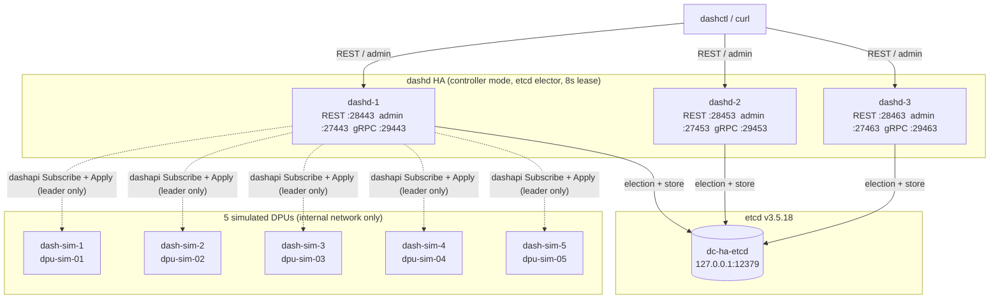

# 04-ha-fleet — full HA reference fleet

> **What it is**: a single-command Docker fleet that runs **3 dashd controllers** (etcd-elected HA), **5 simulated DPUs** (`dash-sim`), and a **shared etcd**, all on one host. Drives the production code paths exactly the way an operator would.
>
> **When to use it**: integration-test HA, demo failover, validate any change that touches the leader/follower split or the etcd-backed store. Also the substrate for the [HA + Migration tutorial](../../../docs/tutorial/10-ha-and-migration-handson.md).
>
> **First time?** Follow the step-by-step [manual-handson.md](manual-handson.md) — it walks every command, every expected output, and every clean-up path.

---

## Topology



| Component | Image | Host ports | Notes |
|---|---|---|---|
| `etcd` | `quay.io/coreos/etcd:v3.5.18` | `127.0.0.1:12379` → 2379 | single-node, healthchecked |
| `dashd-1/2/3` | `dashcenter/dashd:dev` | `28443/28453/28463` (REST), `27443/27453/27463` (admin), `29443/29453/29463` (gRPC) | controller mode, etcd elector, 8s lease TTL |
| `dash-sim-1..5` | `dashcenter/dash-sim:dev` | none | internal-only on `dashcenter-ha-fleet` net |
| `dashctl` (profile `cli`) | `dashcenter/dashctl:dev` | n/a | one-shot CLI container |

---

## Quick start

### Windows / PowerShell
```powershell
pwsh ./start-fleet.ps1                       # build + start + wait for leader
# … operate …
pwsh ./stop-fleet.ps1                        # down + remove volumes
```

### Linux / macOS / WSL
```bash
./start-fleet.sh
# … operate …
./stop-fleet.sh
```

`start-fleet` exits 0 once exactly one of `dashd-1/2/3` reports `leader=true` on its admin endpoint (default budget: 60s). If it exits 1, run `docker compose logs dashd-1 dashd-2 dashd-3`.

---

## What's pre-baked in `./manifest/`

The directory ships a single applyable scenario — **~130 objects across two namespaces** — exercising every dashcenter.v1 spec kind and every behavioural knob the runtime supports:

| File | Kind | Count | Highlights |
|---|---|---|---|
| `00-vnets.yaml` | `Vnet` | **12** | 5 tenants (bank, retail, media, iot, analytics) + shared ingress/egress; VNIs 1001–1902 |
| `01-service-tunnels.yaml` | `ServiceTunnel` | **4** | NAT egress, shared NSG, PrivateLink to managed DB, corp VPN |
| `02-enis.yaml` | `Eni` | **30** | distributed across 5 DPUs via `placement_hint_dpu_ids` |
| `03-vnet-mappings.yaml` | `VnetMapping` | **30** | mostly `vnet_encap`; 2 `service_tunnel` (NAT + NSG demo) |
| `04-route-policies.yaml` | `RoutePolicy` | **12** | covers `vnet` / `service_tunnel` / `drop` next-hops + ECMP |
| `05-acl-policies.yaml` | `AclPolicy` | **12** | **120 ACL rules total** — inbound + outbound, allow / deny / allow_and_continue, single ports + port ranges, tcp/udp/icmp |
| `06-ha-sets.yaml` | `HaSet` | **3** | 2 active/standby (bank, retail), 1 active/active (shared services) |
| `07-multi-namespace.yaml` | mixed in `edge` ns | **10** | second namespace `edge` (2 vnets + 3 ENIs + 3 mappings + 1 route + 1 ACL) — proves cross-namespace isolation |
| `08-disabled-and-resimulate.yaml` | `Eni` | **2** | `admin_state: down` quarantine ENI + RE-applied `eni-bank-web-04` with `resimulate_flows: true` (bumps generation to 2) |
| `09-advanced-acl.yaml` | `AclPolicy` | **3** | numeric protocol matchers (`6`/`17`), multi-protocol single rules, port ranges (`1024-65535`), src-port matchers, layered `allow_and_continue` |
| `10-advanced-routes.yaml` | `RoutePolicy` | **3** | `direct` next-hop, **3-way weighted ECMP** mixing vnet+service_tunnel+drop, multi-route same-prefix metric tie-break |

**Behavioural coverage matrix**:

| Knob | Where it shows |
|---|---|
| All 7 spec kinds | files `00-06` |
| Multi-namespace (`default` + `edge`) | `07` |
| `admin_state: up` / `down` | `02` / `08` |
| `resimulate_flows: true` | `08` |
| `placement_hint_dpu_ids` (fixed) | `02`, `07`, `08` |
| `labels` (operator selectors) | every file; `08` adds `quarantine=true` |
| VnetMapping actions: `vnet_encap`, `service_tunnel` | `03` |
| ServiceTunnel `params` variants (NAT, NSG, PrivateLink, VPN/IPsec) | `01` |
| Route `next_hop_type`: `vnet`, `service_tunnel`, `drop`, `direct` | `04`, `10` |
| ECMP 2-way + 3-way with weights | `04`, `10` |
| Same-prefix multi-metric route tie-break | `10` |
| AclRule actions: `allow`, `deny`, `allow_and_continue` | `05`, `09` |
| AclRule stages: `inbound`, `outbound` | `05`, `09` |
| Numeric protocols (`6`/`17`/`1`/`58`) | `09` |
| Port ranges, src-port matchers | `09` |
| HaSet modes: `active_standby`, `active_active` | `06` |
| Generation/CAS bump on re-apply | `08` (eni-bank-web-04 gen 1→2) |

Apply the whole tree (defaults to `-R` for directories):
```bash
dashctl --endpoint http://127.0.0.1:28443 apply -R -f ./manifest
```

Drive from the one-shot CLI container if no host binary:
```bash
docker compose run --rm dashctl --endpoint http://dashd-1:8443 --insecure apply -R -f /etc/dashd/manifest
```

> The one-shot CLI container does not mount `./manifest` by default — for non-trivial flows, either build a host `dashctl` (`go build -o ./dashctl.exe ../../../src/impl-go/dashctl/cmd/dashctl`) or copy the manifest into the container with `docker cp`.

---

## Verifying state

Counts (use `-o name` so each object is one line):
```bash
for k in vnet eni vnetmapping routepolicy aclpolicy servicetunnel haset; do
  echo "$k: $(dashctl --endpoint http://127.0.0.1:28443 get $k -o name | wc -l)"
done
# vnet: 12 · eni: 30 · vnetmapping: 30 · routepolicy: 12 · aclpolicy: 12 · servicetunnel: 4 · haset: 3
```

Identical reads from any node (followers serve linearizable reads from etcd):
```bash
dashctl --endpoint http://127.0.0.1:28443 get eni       # leader or follower
dashctl --endpoint http://127.0.0.1:28453 get eni       # any other dashd
dashctl --endpoint http://127.0.0.1:28463 get eni
```

DPU inventory (admin endpoint):
```bash
dashctl --endpoint http://127.0.0.1:28443 --admin-endpoint http://127.0.0.1:27443 inventory get
# ID   ENDPOINT   STATE   LAST_SEEN   for each of dpu-sim-01..05
```

Inspect etcd directly:
```bash
docker exec dc-ha-etcd etcdctl --endpoints http://127.0.0.1:2379 \
  get /dashd/fleet/state/ --prefix --keys-only
# 103 keys
docker exec dc-ha-etcd etcdctl --endpoints http://127.0.0.1:2379 \
  get /dashd/fleet/leader/ --prefix
# 3 candidate keys, one per dashd; lowest revision wins the election
```

Leader status per node — three ways, pick your favourite:
```bash
# 1. The shipped helper (uses dashctl version under the hood)
pwsh ./show-leader.ps1                       # Windows
./show-leader.sh                              # Linux/macOS/WSL

# 2. dashctl version, against each node explicitly
for p in 28443 28453 28463; do
  dashctl --endpoint http://127.0.0.1:$p --admin-endpoint http://127.0.0.1:$(($p-1000)) version
done

# 3. raw admin REST
for p in 27443 27453 27463; do
  curl -s "http://127.0.0.1:$p/admin/leader"; echo
done
# Exactly one prints {"leader":true,"leader_id":"dashd-X"}
```

---

## HA orchestration

Planned switchover (drains old active, promotes new — SSE stream):
```bash
curl -N -X POST "http://127.0.0.1:28443/v1/ha/default/ha-bank-prod/switchover" \
     -H "Content-Type: application/json" -d '{}'
# data: {... role: SWITCHING_TO_STANDBY ...}
# data: {... role: SWITCHING_TO_ACTIVE ...}
# data: {... role: STANDBY, reason: "switchover complete" ...}
# data: {... role: ACTIVE,  reason: "switchover complete" ...}
```

Unplanned failover (does NOT contact the failed DPU):
```bash
curl -N -X POST "http://127.0.0.1:28443/v1/ha/default/ha-retail-prod/failover" \
     -H "Content-Type: application/json" -d '{"failed_dpu_id":"dpu-sim-03"}'
```

Subscribe to all HA events on the fleet:
```bash
curl -N "http://127.0.0.1:28443/v1/ha/events"
```

---

## Leader failover (kill-leader test)

```bash
# 1. Find the leader
for p in 27443 27453 27463; do curl -s "http://127.0.0.1:$p/admin/leader"; done

# 2. Kill it (e.g. dashd-2)
docker stop dc-ha-dashd-2

# 3. Wait ~lease_ttl + slack (8s + ~4s)
sleep 12

# 4. Confirm a new leader took over and state survived
for p in 27443 27463; do curl -s "http://127.0.0.1:$p/admin/leader"; done
dashctl --endpoint http://127.0.0.1:28443 get vnet -o name | wc -l    # still 12

# 5. Restart the killed dashd — it rejoins as follower (does NOT steal leadership)
docker start dc-ha-dashd-2
```

---

## Tear down

```bash
./stop-fleet.sh                 # down -v: removes the network + named volumes
./stop-fleet.sh --keep-volumes  # plain down: leaves volumes for next start
```

For a deep clean (also drop the images):
```bash
docker compose down -v --rmi local
```

---

## Troubleshooting

| Symptom | Likely cause | Fix |
|---|---|---|
| `start-fleet.ps1` reports `!! No leader within 60s` even though `docker compose ps` shows everything Up | dashd container exited with `mkdir /var/lib/dashd: permission denied` (your dashd image is older than 2026-06-11 PD wiring, OR your config points the audit dir at a path the distroless `nonroot` user cannot write) | `docker compose build dashd-1 dashctl` to rebuild, then `./start-fleet.sh` again. The supplied `dashd-*.yaml` files don't request an audit dir, so this only bites stale images. |
| `port=XXX EX: The request was canceled due to the configured HttpClient.Timeout` on Windows | `localhost` resolves to `::1`, dashd binds IPv4-only — fixed in the shipped script (probes `127.0.0.1`) | If you hand-rolled the URL, always use `127.0.0.1`. |
| `apply -f ./manifest` returns `Error: apply` with no detail | Most often a malformed YAML envelope — `apiVersion: dashcenter.v1` (not `dashcenter.io/v1`); `kind` capitalised; `metadata.name` set | Pass `--filename <single-file>.yaml` to bisect; run `dashctl explain <kind>` for the spec shape |
| All three dashd report `leader=true` (impossible) | Stale `dashcenter/dashd` image predating the `admin.NewWithElector` fix (2026-06-11) | Rebuild: `docker compose build dashd-1` |
| `dashctl get vnet | wc -l` shows a wild number like 209 for 12 vnets | Default output is YAML; `wc -l` counts every line of every spec body | Use `-o name` or `-o table` |
| Containers can't reach `etcd:2379` | etcd healthcheck still failing (look for `endpoint health` warnings) | `docker compose logs etcd` — first start can pull the image |

---

## See also

- [Tutorial 10 — HA + Migration hands-on](../../../docs/tutorial/10-ha-and-migration-handson.md)
- [Topology 01 — host multi-port](../01-host-multi-port/README.md) — fastest dev loop, single dashd
- [Topology 02 — single docker](../02-single-docker/README.md) — single dashd in a container
- [Topology 03 — multi-docker fleet](../03-multi-docker-fleet/README.md) — multi-DPU, single dashd
