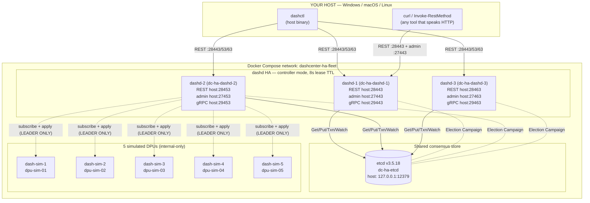
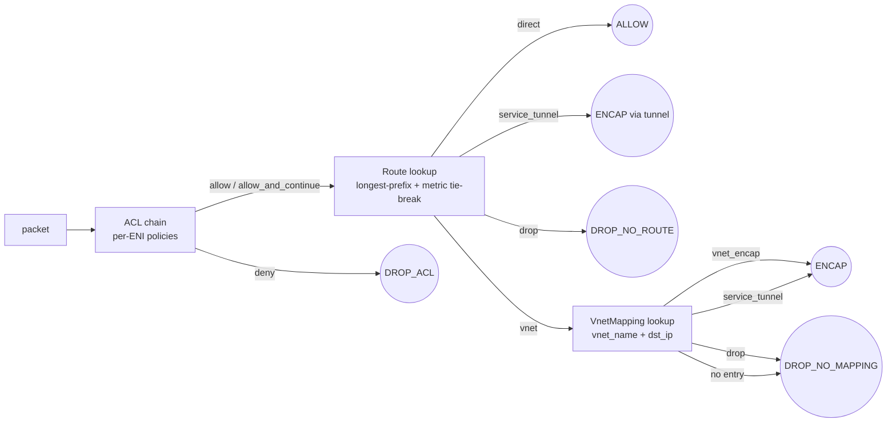
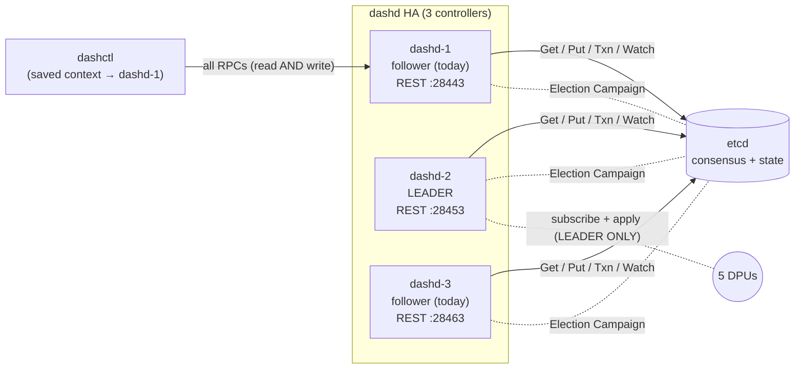

# 04-ha-fleet — manual hands-on

> **Goal**: take you from a fresh `git clone` to a running 3-controller HA fleet with **~130 pre-applied dashcenter objects across 2 namespaces**, exercise every spec kind and every behavioural knob, demonstrate both HA flavours (planned switchover + unplanned failover), drive a 10-phase ENI live migration, and prove kill-leader survival. No prior context required.
>
> **Time**: about 25 minutes the first run (most of it docker pulls + dashd image build), about 8 minutes once images are cached.

Each step has the same structure:

> **Objective** — why this step exists.
> **Run** — exact commands; paste as-is.
> **Expected output** — what success looks like.

---

## Lab topology (what you're about to bring up)



**Read this diagram as**:
- All 3 dashd are **API endpoints** — every northbound RPC (GET, PUT, DELETE, SSE streams) is served by any of them.
- Only **one dashd at a time** holds the etcd election lease and runs the leader-only goroutines (reconciler, dispatch workers, subscribe pumps to DPUs).
- **`dashctl` is hard-coded to talk to `dashd-1`** via the saved `ha-fleet` context (Step 1 sets this). It does NOT auto-discover the leader. This is intentional for the tutorial — see [Appendix A](#appendix-a--how-dashctl-finds-dashd) for why and how a real production deployment changes this.

---

## 0 · Prerequisites

| Tool | Version | Check |
|---|---|---|
| Docker Engine | ≥ 24 | `docker version` |
| Docker Compose v2 | bundled | `docker compose version` |
| PowerShell 7 (Windows) or bash (Linux/macOS/WSL) | — | `pwsh --version` / `bash --version` |
| Go 1.22+ (only if you want a host `dashctl`) | 1.22.x | `go version` |
| Free disk | ~2 GB | first build pulls etcd + golang + distroless |
| Free host ports | `127.0.0.1`: `12379`, `27443/27453/27463`, `28443/28453/28463`, `29443/29453/29463` | `Get-NetTCPConnection -LocalPort 28443` / `lsof -i:28443` |

> **Always use `127.0.0.1`, never `localhost`.** On Windows `localhost` resolves to `::1` first and dashd binds IPv4-only — the IPv6 stall would make every probe look broken. The shipped scripts already do this; only your hand-typed `curl` / `Invoke-RestMethod` need it.

Build a host `dashctl` once (10 s on warm cache):
```powershell
cd <repo>/src/impl-go
go build -o ../../deploy/test-setup/04-ha-fleet/dashctl.exe ./dashctl/cmd/dashctl
```
Then `cd deploy/test-setup/04-ha-fleet` — every command on this page assumes that as the working directory.

---

## Step 1 · Bring the fleet up

**Objective**: stand up etcd + 5 dash-sim + 3 dashd; wait until exactly one dashd reports `leader=true`; auto-configure a `dashctl` context named `ha-fleet` so you never have to type `--endpoint`.

**Run** (Windows):
```powershell
pwsh ./start-fleet.ps1
```
or (Linux/macOS/WSL):
```bash
./start-fleet.sh
```

**Expected output (tail)**:
```
==> Waiting for a dashd leader to be elected (max 60 s)
==> Leader: dashd-3
==> dashctl context 'ha-fleet' active (no --endpoint needed)

Per-node REST/admin endpoints (host):
  dashd-1: http://127.0.0.1:28443  (admin :27443)
  dashd-2: http://127.0.0.1:28453  (admin :27453)
  dashd-3: http://127.0.0.1:28463  (admin :27463)

Confirm leader on every node:
  pwsh ./show-leader.ps1

Apply the pre-built manifest set (~130 objects across 2 namespaces):
  ./dashctl.exe apply -R -f ./manifest
```

The reported leader is whichever node wins the etcd campaign first — it is not always the same node. Subsequent commands discover it via etcd, so it never matters.

Sanity-check the containers:
```powershell
docker compose ps --format 'table {{.Name}}\t{{.Status}}'
```
All 9 containers should be `Up`; `dc-ha-etcd` should report `(healthy)`.

> **Why no `--endpoint`?** dashctl ships with a default context pointing at `http://localhost:8443` (matches dev fleets like topology 01). Our HA fleet uses non-standard host ports (28443/28453/28463), so the script runs `dashctl config set-context ha-fleet --endpoint http://127.0.0.1:28443 …` and activates it. Use `--endpoint` only when you want to address a *specific* dashd (e.g. to compare reads across nodes). Pass `-SkipContext` to `start-fleet.ps1` to opt out.

---

## Step 2 · Confirm leader election

**Objective**: prove exactly one of the 3 dashd holds the etcd lease, and see all 3 candidate keys in etcd.

**Run**:
```powershell
pwsh ./show-leader.ps1
```

**Expected output**:
```
NODE      LEADER     RESPONSE
dashd-1   false      Server: dashd  dashd (transport=rest endpoint=http://127.0.0.1:28443) leader=false
dashd-2   false      Server: dashd  dashd (transport=rest endpoint=http://127.0.0.1:28453) leader=false
dashd-3   true       Server: dashd  dashd (transport=rest endpoint=http://127.0.0.1:28463) leader=true
```
Exactly one row says `true`. The "true" line will be green in your terminal.

**Why three keys in etcd, only one leader?**
```powershell
docker exec dc-ha-etcd etcdctl --endpoints http://127.0.0.1:2379 get /dashd/fleet/leader/ --prefix
```
Each dashd holds its own etcd lease and writes one key under the election prefix. etcd's Election abstraction picks the key with the lowest `mod_revision` as the leader; the rest block in `Election.Wait`. When the leader's lease expires (it dies / loses connectivity), etcd atomically promotes the next candidate.

---

## Step 3 · Apply the pre-baked 130-object scenario

**Objective**: populate dashd with every spec kind and every behavioural knob the runtime supports. Manifests are split into 11 files so you can apply them à la carte for debugging.

**Run**:
```powershell
./dashctl.exe apply -R -f ./manifest
```

**Expected output (tail, last ~5 lines)**:
```
…
routepolicy/rp-mgmt-direct apply in namespace default (generation 1)
routepolicy/rp-analytics-ecmp-3way apply in namespace default (generation 1)
routepolicy/rp-iot-backup-uplink apply in namespace default (generation 1)
```
Notice `eni-bank-web-04` lands at **generation 2** — manifest `08-disabled-and-resimulate.yaml` deliberately re-applies it with `resimulate_flows: true`, which is the operator hook for "ask the DPU to re-evaluate every existing flow against the new policy".

**Verify counts**:
```powershell
foreach ($k in 'vnet','eni','vnetmapping','routepolicy','aclpolicy','servicetunnel','haset') {
  $n = (./dashctl.exe get $k -o name | Where-Object { $_ -match '/' }).Count
  "$k = $n"
}
```
**Expected**:
```
vnet = 12 · eni = 31 · vnetmapping = 30 · routepolicy = 15 · aclpolicy = 15 · servicetunnel = 4 · haset = 3
```
(31 ENIs = 30 baseline + `eni-quarantine-01`. 15 RoutePolicy / 15 AclPolicy = 12 baseline + 3 advanced.)

**Edge namespace**:
```powershell
foreach ($k in 'vnet','eni','vnetmapping','routepolicy','aclpolicy') {
  $n = (./dashctl.exe -n edge get $k -o name | Where-Object { $_ -match '/' }).Count
  "edge/$k = $n"
}
```
**Expected**: `edge/vnet = 2 · edge/eni = 3 · edge/vnetmapping = 3 · edge/routepolicy = 1 · edge/aclpolicy = 1`.

**Confirm etcd persisted everything**:
```powershell
(docker exec dc-ha-etcd etcdctl --endpoints http://127.0.0.1:2379 get /dashd/fleet/state/ --prefix --keys-only | Measure-Object -Line).Lines
```
**Expected**: `120` (110 default + 10 edge).

---

## Step 4 · Read fan-out across all 3 dashd

**Objective**: prove every dashd serves linearizable reads from the same etcd. Followers don't forward — they read directly.

**Run**:
```powershell
foreach ($p in 28443, 28453, 28463) {
  "=== dashd at $p ==="
  ./dashctl.exe --endpoint http://127.0.0.1:$p get vnet -o name | Sort-Object
}
```

**Expected**: 3 identical sorted blocks of 12 vnet names — byte-equal across all dashd.

> **Note on `--endpoint`**: this is the only step that overrides the saved context (because we explicitly want to compare nodes). For normal operator use, omit `--endpoint`.

---

## Step 5 · Inspect a single object every way dashd exposes it

**Objective**: see the 5 representations of one object — human, YAML, JSON, raw REST, etcd row.

```powershell
# 5.1 Human-friendly
./dashctl.exe describe eni eni-bank-web-04
# Expect: Name, Namespace, Kind, Generation: 2 (re-applied with resimulate_flows), Spec table

# 5.2 YAML (copy-paste-able manifest body)
./dashctl.exe get eni eni-bank-web-04 -o yaml

# 5.3 JSON (jq pipelines)
./dashctl.exe get eni eni-bank-web-04 -o json | jq .

# 5.4 Raw REST
curl -s http://127.0.0.1:28443/v1/default/enis/eni-bank-web-04 | jq .

# 5.5 Underlying etcd row (raw protobuf-encoded JSON)
docker exec dc-ha-etcd etcdctl --endpoints http://127.0.0.1:2379 `
  get /dashd/fleet/state/default/eni/eni-bank-web-04
```

**Expected**: each representation shows the same `mac_address aa:bb:cc:01:00:04`, `underlay_ip 10.0.1.14`, `placement_hint_dpu_ids [dpu-sim-02]`, `admin_state up`, `resimulate_flows true`, `generation 2`.

---

## Step 6 · Cross-namespace isolation

**Objective**: prove dashd refuses cross-namespace references at admission time.

```powershell
# 6.1 Same name in two namespaces?
./dashctl.exe -A get vnet                            # all namespaces
./dashctl.exe -n default get vnet cdn-pop            # 404 — only in `edge`
./dashctl.exe -n edge    get vnet cdn-pop            # OK
./dashctl.exe -n edge    get eni edge-cdn-01         # OK

# 6.2 Try to violate isolation
@"
apiVersion: dashcenter.v1
kind: Eni
metadata: { name: bad-eni, namespace: edge }
spec:
  namespace: edge
  vnet_name: bank-prod-web     # in `default`, NOT `edge`
  mac_address: aa:bb:cc:de:ad:01
  underlay_ip: 10.99.99.99
  admin_state: up
  placement_hint_dpu_ids: [dpu-sim-01]
"@ | Set-Content -Encoding ascii .\bad-eni.yaml

./dashctl.exe apply -f .\bad-eni.yaml
```

**Expected**:
```
Error: apply
```
with dashd reporting (in its logs) `cross-namespace reference rejected: edge/vnet/bank-prod-web not found in this namespace`.

Cleanup:
```powershell
Remove-Item .\bad-eni.yaml
```

---

## Step 7 · Explore the advanced behavioural objects

**Objective**: see the manifests that exercise each runtime knob.

| Knob | Object | Inspect with |
|---|---|---|
| `admin_state: down` | `eni-quarantine-01` | `./dashctl.exe describe eni eni-quarantine-01` |
| `resimulate_flows: true` | `eni-bank-web-04` (gen=2) | `./dashctl.exe get eni eni-bank-web-04 -o yaml` |
| 3-way weighted ECMP | `rp-analytics-ecmp-3way` | `./dashctl.exe describe route rp-analytics-ecmp-3way` |
| `next_hop_type: direct` | `rp-mgmt-direct` | `./dashctl.exe describe route rp-mgmt-direct` |
| Same-prefix multi-metric tie-break | `rp-iot-backup-uplink` | `./dashctl.exe describe route rp-iot-backup-uplink` |
| Numeric protocol matchers (`6` / `17` / `1` / `58`) | `acl-platform-prom-allow` | `./dashctl.exe describe acl acl-platform-prom-allow` |
| Multi-protocol single rule + port range `1024-65535` | `acl-iot-edge-rate-limit` | `./dashctl.exe describe acl acl-iot-edge-rate-limit` |
| `src_port` matcher | `acl-platform-egress-tag` | `./dashctl.exe describe acl acl-platform-egress-tag` |

**Expected**: each `describe` renders the spec verbatim. The "advanced" descriptors carry comments inside each rule explaining the operator intent.

---

## Step 8 · Label selectors

**Objective**: use `-l key=value` to filter — same syntax as kubectl.

```powershell
./dashctl.exe get eni -l tenant=bank          # all ENIs tagged tenant=bank
./dashctl.exe get acl -l class=platform       # the 3 platform-wide ACLs from manifest 09
./dashctl.exe get eni -l quarantine=true      # 1 row: eni-quarantine-01
```

**Expected**: only matching rows in each table.

---

## Step 9 · Admin endpoints

**Objective**: every dashd exposes operator-facing admin views (live, no etcd round-trip needed).

```powershell
Invoke-RestMethod http://127.0.0.1:27443/admin/health    | ConvertTo-Json -Depth 5
Invoke-RestMethod http://127.0.0.1:27443/admin/inventory | ConvertTo-Json -Depth 5
Invoke-RestMethod http://127.0.0.1:27443/admin/drift     | ConvertTo-Json -Depth 5
Invoke-RestMethod http://127.0.0.1:27443/admin/desired?kind=acl_policy | ConvertTo-Json -Depth 5
Invoke-RestMethod http://127.0.0.1:27443/admin/observed?dpu=dpu-sim-01 | ConvertTo-Json -Depth 5
Invoke-RestMethod 'http://127.0.0.1:27443/admin/eni-placement?eni=eni-bank-web-04' | ConvertTo-Json -Depth 5
```

**Expected**:
- `/admin/health` → `{status: "ok"|"degraded", leader, leader_id, dpus[]}`. `leader=true` only on the elected node, `false` on followers.
- `/admin/inventory` → 5 DPUs in `DPU_STATE_UP`.
- `/admin/drift` → empty (or close to) if dispatch caught up.

---

## Step 10 · Add → edit → delete an object

**Objective**: full CRUD round-trip; observe generation/CAS in action.

```powershell
# 10.1 Add a 13th vnet + 32nd ENI bound to it
@"
apiVersion: dashcenter.v1
kind: Vnet
metadata: { name: bank-prod-cache, labels: { tenant: bank, tier: cache } }
spec: { vni: 1003 }
---
apiVersion: dashcenter.v1
kind: Eni
metadata: { name: eni-bank-cache-01, labels: { tenant: bank, tier: cache } }
spec:
  vnet_name: bank-prod-cache
  mac_address: aa:bb:cc:03:00:01
  underlay_ip: 10.0.3.11
  admin_state: up
  placement_hint_dpu_ids: [dpu-sim-01]
"@ | Set-Content -Encoding ascii .\new-cache.yaml

./dashctl.exe apply -f .\new-cache.yaml
# Expected: vnet/bank-prod-cache apply in namespace default (generation 1)
#           eni/eni-bank-cache-01 apply in namespace default (generation 1)

./dashctl.exe get vnet bank-prod-cache
./dashctl.exe get eni eni-bank-cache-01

# 10.2 Edit — disable the ENI; observe generation 1 → 2
./dashctl.exe get eni eni-bank-cache-01 -o yaml | Set-Content .\eni-edit.yaml
(Get-Content .\eni-edit.yaml) -replace 'admin_state: up','admin_state: down' | Set-Content .\eni-edit.yaml
./dashctl.exe apply -f .\eni-edit.yaml
# Expected: eni/eni-bank-cache-01 apply in namespace default (generation 2)

./dashctl.exe describe eni eni-bank-cache-01
# Expected: Generation: 2  ·  Spec.admin_state: down

# 10.3 Delete in dependency order (ENI before its Vnet)
./dashctl.exe delete eni eni-bank-cache-01
./dashctl.exe delete vnet bank-prod-cache
./dashctl.exe get vnet bank-prod-cache
# Expected: Error: not found (Code: NOT_FOUND)

Remove-Item .\new-cache.yaml,.\eni-edit.yaml
```

---

## Step 10a · Referential integrity (FK validation)

**Objective**: prove dashd rejects wrong-order creates and protects
against orphan-creating deletes.

### Why this matters at the dashd level

dashd is the fleet controller. When an operator PUTs an ENI spec that
says `vnet_name: "vnet-nonexistent"`, dashd checks whether that vnet
exists in the same namespace. If not — the PUT is rejected with a
clear error. The ENI is never stored, never dispatched to DPUs.

On the Delete side, dashd checks whether anything still references
the object you're deleting. Deleting a vnet while ENIs reference it
would orphan those ENIs and drop all their traffic silently.

### Experiment A — wrong config: ENI with missing vnet (FAIL)

```powershell
@"
apiVersion: dashcenter.v1
kind: Eni
metadata: { name: eni-orphan-test }
spec:
  vnet_name: vnet-nonexistent
  mac_address: aa:bb:cc:99:00:01
  underlay_ip: 10.0.99.1
  admin_state: up
"@ | Set-Content -Encoding ascii .\bad-eni.yaml

./dashctl.exe apply -f .\bad-eni.yaml
```

**Error:**
```
Error: invalid argument: eni.vnet_name="vnet-nonexistent":
  namespace: cross-namespace reference rejected
  (referenced default/vnet/vnet-nonexistent not found in this namespace)
```

**Why it failed**: dashd's `CheckEni()` called `refExists()` to look up
`vnet-nonexistent` in the `default` namespace. The store returned
`ErrNotFound`. The ENI spec was not persisted.

### Experiment B — wrong config: delete vnet with dependents (FAIL)

```powershell
./dashctl.exe delete vnet bank-prod-web
```

**Error:**
```
Error: failed precondition: referential integrity: object has dependents:
  cannot delete vnet "bank-prod-web" — eni "eni-bank-web-01" still references it
```

**Why it failed**: dashd's `CheckDelete()` scanned all ENIs in the
`default` namespace and found `eni-bank-web-01` with
`vnet_name: "bank-prod-web"`. Deleting the vnet would orphan the ENI.

**The right approach** — delete dependents first (top-down):
```
delete eni-bank-web-01  →  then delete vnet bank-prod-web
```

### Experiment C — validate manifests against the live store

```powershell
./dashctl.exe validate -f manifest/
# Expected: all objects accepted (manifests are in correct tier order)
```

**Why it works**: the manifest files are numbered `00-vnets.yaml`,
`01-enis.yaml`, etc. — they naturally follow the dependency order.

```powershell
Remove-Item .\bad-eni.yaml
```

---

## Step 11 · HA planned switchover (drains old, promotes new)

**Objective**: roll the active role from one DPU to the other inside an `active_standby` HA set, with a controlled `drain` on the way down.

```powershell
# 11.1 Look at starting state (dpu-sim-01 is initial ACTIVE)
curl.exe -s http://127.0.0.1:28443/v1/ha/default/ha-bank-prod | jq .
# Expected: members[0].role=6 (ACTIVE) on dpu-sim-01, members[1].role=5 (STANDBY) on dpu-sim-02

# 11.2 Trigger switchover and watch SSE events
curl.exe -N -X POST http://127.0.0.1:28443/v1/ha/default/ha-bank-prod/switchover `
         -H 'Content-Type: application/json' -d '{}'
```

**Expected — 4 SSE events** (each preceded by `data:`):
```
data: {... dpu-sim-01 ... role:"HA_SCOPE_ROLE_SWITCHING_TO_STANDBY" reason:"drain started" ...}
data: {... dpu-sim-02 ... role:"HA_SCOPE_ROLE_SWITCHING_TO_ACTIVE"  reason:"promotion staged" ...}
data: {... dpu-sim-01 ... role:"HA_SCOPE_ROLE_STANDBY"              reason:"switchover complete" ...}
data: {... dpu-sim-02 ... role:"HA_SCOPE_ROLE_ACTIVE"               reason:"switchover complete" is_role_holder:true ...}
```
Press **Ctrl-C** when you see the final ACTIVE event. The `is_role_holder` flag tells you which DPU owns the VIP (`10.0.0.100`).

**Important: HA state is not idempotent.** A second switchover flips the roles back. Confirm with:
```powershell
curl.exe -s http://127.0.0.1:28443/v1/ha/default/ha-bank-prod | jq .
```

---

## Step 12 · HA unplanned failover (does NOT touch the failed DPU)

**Objective**: prove that failover does not contact the failed DPU (otherwise it would be useless when the DPU is unreachable).

```powershell
# 12.1 Reset ha-retail-prod so we have a fresh ACTIVE/STANDBY pair
#      (delete + re-apply because the in-memory orchestrator state persists
#       across re-applies of the same haset)
./dashctl.exe delete haset ha-retail-prod
./dashctl.exe apply -f ./manifest/06-ha-sets.yaml
curl.exe -s http://127.0.0.1:28443/v1/ha/default/ha-retail-prod | jq .
# Expected: dpu-sim-03 role=6 (ACTIVE), dpu-sim-04 role=5 (STANDBY)

# 12.2 Failover — note the JSON body shape
curl.exe -N -X POST http://127.0.0.1:28443/v1/ha/default/ha-retail-prod/failover `
         -H 'Content-Type: application/json' -d '{"failed_dpu_id":"dpu-sim-03"}'
```

**Expected — 3 SSE events** (failover has only 3, not 4; the dead DPU is never asked to drain):
```
data: {... dpu-sim-03 ... role:"HA_SCOPE_ROLE_DEAD"                reason:"declared dead" ...}
data: {... dpu-sim-04 ... role:"HA_SCOPE_ROLE_SWITCHING_TO_ACTIVE" reason:"promotion staged" ...}
data: {... dpu-sim-04 ... role:"HA_SCOPE_ROLE_ACTIVE"              reason:"failover complete" is_role_holder:true ...}
```
**Compare to step 11**: failover has 3 events (DEAD → SWITCHING_TO_ACTIVE → ACTIVE), switchover has 4 (SWITCHING_TO_STANDBY → SWITCHING_TO_ACTIVE → STANDBY → ACTIVE). The dead DPU is never asked to drain.

**Why re-running fails**: after this failover, the set has DPU-03=DEAD + DPU-04=ACTIVE — no STANDBY left. A second `failover` returns:
```
{"error":"failed precondition: orchestrator: invalid HA transition: no eligible STANDBY target for failover in default/ha-retail-prod"}
```
That's correct behaviour. To run it again, delete + re-apply the haset first.

**Subscribe to all HA events on the fleet** (Ctrl-C to exit):
```powershell
curl.exe -N http://127.0.0.1:28443/v1/ha/events
```

---

## Step 13 · ENI live migration (10-phase)

**Objective**: walk an ENI through dashd's 10-phase migration state machine, persisting every transition to etcd.

> **Field-name reminder** (the REST body matches the proto exactly):
> - `eni_names` is an **array**, not `eni_name`
> - destination DPU is `target_dpu_id`, not `destination_dpu_id`
> - `strategy` is an **integer**: `1=NEW_FLOWS_FIRST_DRAIN`, `2=FULL_REHOME`, `3=MAINTENANCE_FAST`, `4=CANARY_SPLIT`
> - phase advance uses `to_phase` (number or enum string), not `next_phase`
> - response field is `session_id`, not `id`

```powershell
# 13.1 Start a session: migrate eni-bank-web-03 from dpu-sim-02 → dpu-sim-04
$plan = '{"plan":{"namespace":"default","eni_names":["eni-bank-web-03"],"source_dpu_id":"dpu-sim-02","target_dpu_id":"dpu-sim-04","strategy":1}}'
$resp = curl.exe -s -X POST http://127.0.0.1:28443/v1/migrations/sessions `
                 -H 'Content-Type: application/json' -d $plan
$resp
# Expected JSON: { "session_id":"mig-…", "phase":1, "generation":1, "plan":{…} }

# Extract the session id
$SID = ($resp | ConvertFrom-Json).session_id
"SID = $SID"

# 13.2 Walk phases 2..10
foreach ($next in 2,3,4,5,6,7,8,9,10) {
  $body = "{`"to_phase`":$next,`"expected_generation`":$($next-1)}"
  $r = curl.exe -s -X POST "http://127.0.0.1:28443/v1/migrations/sessions/$SID/advance" `
                 -H 'Content-Type: application/json' -d $body
  $r | ConvertFrom-Json | Select-Object phase,generation | Format-Table
}
```

**Expected**: 9 rows, `phase` going 2→10, `generation` going 2→10.

```powershell
# 13.3 Confirm the ENI actually moved (CUTOVER at phase 6 mutates placement)
./dashctl.exe get eni eni-bank-web-03 -o yaml | Select-String 'placement_hint'
# Expected: placement_hint_dpu_ids: [dpu-sim-04]

# 13.4 Inspect the persistent session in etcd
docker exec dc-ha-etcd etcdctl --endpoints http://127.0.0.1:2379 `
  get /dashd/fleet/state/_migrations/migration_session/$SID
# Expected: large JSON blob; "phase":10 ("COMPLETED")
```

> **Rollback** (PC-G5): if you stop before phase 8 (COMMIT), `POST .../sessions/$SID/rollback` with `{"expected_generation":N,"reason":"…"}` walks the session phase → 11 (ROLLBACK) → 12 (ABORTED) and restores the pre-cutover placement. Rollback after COMMIT returns 412.

---

## Step 14 · Kill the dashd leader → confirm failover + state survival

**Objective**: lose 1/3 controllers; etcd promotes a new leader within `lease_ttl + slack` (8 s + ~4 s); all 120 objects survive.

```powershell
# 14.1 Find the current leader
pwsh ./show-leader.ps1

# 14.2 Kill the leader (replace X with the leader node from above)
docker stop dc-ha-dashd-X

# 14.3 Wait ~12 s
Start-Sleep -Seconds 12

# 14.4 New leader has been promoted
pwsh ./show-leader.ps1

# 14.5 State survived — count is still 120
$total = 0
foreach ($k in 'vnet','eni','vnetmapping','routepolicy','aclpolicy','servicetunnel','haset') {
  $total += (./dashctl.exe get $k -o name | Where-Object { $_ -match '/' }).Count
  $total += (./dashctl.exe -n edge get $k -o name 2>$null | Where-Object { $_ -match '/' }).Count
}
"total = $total"
# Expected: 120 (or close — if you deleted/added objects in earlier steps)

# 14.6 Write through the new leader — proves it's not just read-only
@"
apiVersion: dashcenter.v1
kind: Vnet
metadata: { name: post-failover-canary }
spec: { vni: 9999 }
"@ | Set-Content -Encoding ascii .\canary.yaml
./dashctl.exe apply -f .\canary.yaml
# Expected: vnet/post-failover-canary apply in namespace default (generation 1)

# 14.7 Restart the killed dashd — rejoins as FOLLOWER (does NOT steal leadership)
docker start dc-ha-dashd-X
Start-Sleep -Seconds 5
pwsh ./show-leader.ps1
# Expected: the resurrected node shows leader=false; the new leader still true

# 14.8 Cleanup the canary
./dashctl.exe delete vnet post-failover-canary
Remove-Item .\canary.yaml
```

What you just proved:
- **Liveness**: ≤ 12 s leader-loss window.
- **Durability**: 120 objects in etcd survive controller loss.
- **No split-brain**: only one new leader after lease expiry.
- **Stable leadership**: recovered node rejoins at the back of the election queue (etcd `Election.Campaign` semantics) — no leader theft.

---

## Step 15 · Diagnostics — answer "why?" without touching the DPUs

**Objective**: use the PE-1 Diagnostics REST API (landed 2026-06-11) to
answer the three operator questions every fleet eventually faces:

1. "If a packet arrived now, what would the policy chain decide?" (`trace-flow`)
2. "Why did rule X match / not match?" (`explain-match`)
3. "Which ACL rules have never been hit?" (`acl-hit-stats`)

All three are pure-cache compute against dashd's desired state — no DPU
round-trip, sub-millisecond response, deterministic from the same
manifest you applied in Step 3.

### The pipeline `trace-flow` walks



Three stages, evaluated in order:
- **ACL chain** — priority asc; first `deny` / `allow` terminates; `allow_and_continue` falls through.
- **Route lookup** — longest-prefix wins; metric breaks ties.
- **VnetMapping** — only reached when route's `next_hop_type=vnet`; resolves overlay IP → underlay encap target.

Each `trace[]` line in the response narrates one hop; the round terminal nodes are the `verdict` integer.

**Five endpoints land in PE-1**:

| Endpoint | Answers |
|---|---|
| `POST /v1/diagnostics/trace-flow` | "If a packet with this 7-tuple arrived now, what does the chain decide?" |
| `POST /v1/diagnostics/explain-match` | "Walk every candidate and tell me why each matched or not." |
| `POST /v1/diagnostics/explain-drift` | "For NameRef X on DPU Y, suggested remediation?" |
| `POST /v1/diagnostics/acl-hit-stats` | "List ACL rules + hit counters; optionally zero-only." |
| `POST /v1/diagnostics/trigger-resimulation` | "Tell named DPUs/ENIs to re-evaluate active flows against current policy." |

> All examples use **the leader's REST port** (substitute the result of
> `pwsh ./show-leader.ps1` — the live capture below was against
> dashd-2 on `:28453`). Read RPCs work on any dashd. The endpoint
> ignores leader / follower distinction; we use the leader by
> convention so the trace-flow response is computed against the
> freshest desired state without a follower-side replica lag.

### 15.1 `trace-flow` ALLOW — full vnet_encap happy path

```powershell
$BODY = '{"flow":{"direction":1,"eni_name":"eni-bank-web-04","src_ip":"203.0.113.10","dst_ip":"192.168.11.4","dst_port":443,"protocol":"tcp"}}'
curl.exe -s -X POST http://127.0.0.1:28453/v1/diagnostics/trace-flow `
        -H 'Content-Type: application/json' -d $BODY | python -m json.tool
```

**Expected**: `verdict: 3` (ENCAP) and a 7-line trace[] showing
INPUT → ACL allow rule 100 → route 192.168.11.0/24 vnet hop →
vnet_mapping → underlay 10.0.1.14. `matched_acl_rule`, `matched_route`,
and `matched_vnet_mapping` name the exact spec objects that won.

### 15.2 `trace-flow` DROP_ACL — see every skipped rule

Change `dst_port: 443` to `dst_port: 22` in the body above and re-run.
**Expected**: `verdict: 6` (DROP_ACL), with the trace[] showing the 6
preceding `ACL skip:` lines and the final `ACL DENY:` line (priority
150) that terminated the chain. Each skip carries a reason like
`dst_port: 22 not in any of [443]` — exactly the information operators
need to answer "why is my SSH being dropped".

### 15.3 `trace-flow` DROP_NO_MAPPING — half-configured tenant

Change `dst_ip: 192.168.11.4` (mapped) to `dst_ip: 192.168.11.99` (in
the /24 route but unmapped).
**Expected**: `verdict: 5` (DROP_NO_MAPPING), trace ending with
`VNET_MAPPING: no entry for 192.168.11.99 in vnet=bank-prod-web →
DROP_NO_MAPPING`. Fix: `dashctl apply -f <new VnetMapping>` then
re-trace — verdict flips to ENCAP.

### 15.4 `explain-match SUBJECT_ROUTE` — see every candidate

```powershell
$BODY = '{"subject":2,"flow":{"direction":1,"eni_name":"eni-spark-01","src_ip":"10.4.1.11","dst_ip":"10.200.5.5","dst_port":9092,"protocol":"tcp"}}'
curl.exe -s -X POST http://127.0.0.1:28453/v1/diagnostics/explain-match `
        -H 'Content-Type: application/json' -d $BODY | python -m json.tool
```

**Expected**: a `candidates[]` array with every route in scope, each
carrying `matched: true|false` and a `reason` string using `⊇`
("contains") / `⊅` ("does not contain"). `selected_candidate_id`
names the longest-prefix + lowest-metric winner.

### 15.5 `acl-hit-stats {"zero_hits_only":true}` — find dead rules

```powershell
curl.exe -s -X POST http://127.0.0.1:28453/v1/diagnostics/acl-hit-stats `
        -H 'Content-Type: application/json' -d '{"zero_hits_only":true}' `
        | python -m json.tool | Select-Object -First 30
```

**Expected**: ~150 zero-hit rules (every rule across every policy is
`hits: 0` because PE-1 ships with `HitStatsSource = NilHitStats` —
the safe-default stub that returns "never observed"). PD-G5 swaps in
the live counter store and the same endpoint becomes the "find unused
security rules" report with zero operator-side changes.

> **`5-full-console` extension**: the dashw Web Console proxies these
> at `http://127.0.0.1:3000/api/v1/diagnostics/*` — same body shapes,
> same responses. See [05-full-console/manual-handson.md § Lab 12.6](../05-full-console/manual-handson.md)
> for the BFF-fronted version of these demos.

---

## Step 16 · Tear down

**Objective**: stop all containers; optionally drop volumes.

```powershell
pwsh ./stop-fleet.ps1                 # default: down -v (removes docker network + volumes)
pwsh ./stop-fleet.ps1 -KeepVolumes    # keep volumes for the next start
```

For a fully clean slate (also drop the locally-built images):
```powershell
docker compose down -v --rmi local
```

---

## Common pitfalls

| Symptom | Likely cause | Fix |
|---|---|---|
| `dashctl` returns `Server: unavailable … dial tcp [::1]:7443` | You skipped Step 1's context setup OR ran on a different shell where the saved context isn't active. | Re-run `./dashctl.exe config use-context ha-fleet`. Or pass `--endpoint http://127.0.0.1:28443 --admin-endpoint http://127.0.0.1:27443` explicitly. |
| `start-fleet.ps1` reports `!! No leader within 60s` even though `docker compose ps` shows everything Up | Stale `dashcenter/dashd:dev` image predating 2026-06-11 PD wiring (logs say `etcd is not yet implemented`) | `docker compose build dashd-1` then re-run |
| All 3 dashd report `leader=true` (impossible) | Same stale image — admin handler hardcoded `leader=true` before 2026-06-11 | rebuild |
| `apply -f` returns `Error: apply` with no detail | YAML envelope malformed — `apiVersion: dashcenter.v1` (not `dashcenter.io/v1`), `kind` capitalised, `metadata.name` set | `dashctl explain <kind>` shows the spec shape |
| HA `failover` returns `412 no eligible STANDBY target` | This set already had a failover/switchover applied — current state has no STANDBY | `dashctl delete haset <name>` + `dashctl apply -f manifest/06-ha-sets.yaml` to reset |
| Migration `start` returns `parse body: unknown field "eni_name"` | The proto field is `eni_names` (array) | Use the body shape in Step 13.1 |
| Migration `start` returns `cannot unmarshal string into … MigrationStrategy` | `strategy` is an enum number, not a string | Use `"strategy":1` (NEW_FLOWS_FIRST_DRAIN); see Step 13 sidebar for all 4 values |
| Migration `advance` returns `parse body: unknown field "next_phase"` | Field is `to_phase` | Use `{"to_phase":N,"expected_generation":N-1}` |
| `dashctl get vnet | wc -l` shows a wild number like 209 for 12 vnets | Default REST output is multi-line YAML | Use `-o name` for line-per-object counting |
| `Invoke-WebRequest` to `http://localhost:27443` hangs ~5 s then 404s | `localhost` → `::1`; dashd binds IPv4-only | Always use `http://127.0.0.1:…` |
| Containers can't reach `etcd:2379` | etcd healthcheck failing | `docker compose logs etcd` — usually a host port `12379` collision |

---

## What this fleet does NOT do

| Out of scope | Why | Where it lives |
|---|---|---|
| Real packet traffic between ENIs | `dash-sim` accepts policy but does not forward packets | use a real DPU + topology 03 |
| TLS / auth / RBAC | this fleet runs with `auth.mode: none` for tutorial clarity | PD live e2e fixture (post-2.0.0 GA) |
| 3-node etcd cluster | single-node etcd is sufficient for tutorial use; reduces resource footprint to ~250 MB | production deployments should use a 3-node external etcd cluster |
| ENI live migration via native `dashctl migration` sub-command | the `migration` sub-commands are stubs ("requires dashd Phase 2") — only the REST surface is wired today | tracked in [docs/next-actions.md](../../../docs/next-actions.md) for after PE |
| HA orchestration via native `dashctl ha set get` | likewise stubbed today — use REST as shown in Steps 11–12 | same |

---

# Appendix A — How `dashctl` finds dashd (and why it does *not* track the leader)

This appendix unpacks two questions every learner asks once they have the fleet running:

1. **How did `--endpoint` stop being mandatory?**
2. **Which dashd instance does `dashctl` actually talk to? Does it pick the leader?**

## A.1 Endpoint resolution — kubectl-style contexts

`dashctl` resolves the dashd it talks to in this priority order (highest first):

| # | Source | Example |
|---|---|---|
| 1 | `--endpoint` flag | `dashctl --endpoint http://127.0.0.1:28453 get vnet` |
| 2 | `$DASHCTL_ENDPOINT` env var | (today a placeholder; flag + context cover it) |
| 3 | Active context in `~/.dashctl/config.yaml` | Whatever `dashctl config use-context …` last set |
| 4 | Built-in default `http://localhost:8443` | Matches topology 01 single-instance dev fleet |

Our HA fleet binds dashd REST to non-standard host ports (`28443 / 28453 / 28463`), so the built-in default in row 4 reaches nothing. To avoid making operators type `--endpoint` on every command, `start-fleet` runs:

```powershell
./dashctl.exe config set-context ha-fleet `
    --endpoint http://127.0.0.1:28443 `
    --admin-endpoint http://127.0.0.1:27443
./dashctl.exe config use-context ha-fleet
```

That writes a context to `~/.dashctl/config.yaml` and activates it. From then on, plain `dashctl get vnet` resolves via row 3.

Inspect what's stored:
```powershell
./dashctl.exe config view
./dashctl.exe config current-context
./dashctl.exe config get-contexts
```

To opt out of the auto-context: pass `-SkipContext` to `start-fleet.ps1` (or `--skip-context` to the bash version).

## A.2 The architecture, in one picture



Notice the critical detail: **every dashd serves every northbound RPC**, leader or follower. The reason is that **etcd is the consensus layer**, not dashd. Read paths are linearizable etcd `Get`s. Write paths are etcd `Txn(If(modRevision)).Then(Put())`s. Either type of call works equally well from any dashd. The dashd "leader" is only special in two ways:

1. It runs the reconciler, dispatch workers, and subscribe pumps (the things that touch DPUs).
2. It runs the HA orchestrator's in-RAM state machine (the part that decides switchover sequences).

Followers don't proxy your write to the leader — they execute it directly against etcd, then the leader picks it up via its `Watch` on the next reconcile tick.

## A.3 Which instance does `dashctl` actually talk to?

**Always `dashd-1` (`http://127.0.0.1:28443`)** — the saved context hard-codes that one host port. Not the leader. Not chosen dynamically. Always dashd-1.

This is fine for the tutorial because of A.2: writes don't need to go to the leader. A read served by dashd-1 returns the same bytes as the same read served by dashd-3 — both nodes are reading the same etcd at the same revision.

## A.4 What happens to `dashctl` on `dashd-2` switchover (or any dashd-3 switchover)?

| Scenario | What `dashctl` sees |
|---|---|
| **dashd-2 is killed** (current leader), dashctl is pointed at dashd-1 (follower) | `dashctl` keeps working — reads + writes both succeed against dashd-1. dashd-1 may *become* the leader after the 8 s lease expires, but `dashctl` doesn't notice. |
| **dashd-3 is killed** (a follower), dashctl is pointed at dashd-1 | Same — totally transparent. |
| **dashd-1 is killed** (whatever dashd `dashctl` is pinned to) | `dashctl version` → `Server: unavailable (network error: connection refused)`. The saved context does NOT fail over. You have to either `docker start dc-ha-dashd-1` or temporarily override with `--endpoint http://127.0.0.1:28453`. |

In short: the dashctl context survives a *dashd leader* switchover. It does NOT survive losing the *one specific dashd instance* the context names.

---

# Lab task — make `dashctl` survive losing its target dashd

## The problem statement

The cookbook in Step 1 pins `dashctl`'s saved context to `http://127.0.0.1:28443`. That works fine until `dashd-1` itself dies — at which point every `dashctl` call returns `connection refused`, even though `dashd-2` and `dashd-3` are healthy and serving the API. Refresh the table:

| You kill | dashd-1 connectivity | dashctl still works? | Reason |
|---|---|---|---|
| dashd-2 (current leader) | unaffected | ✅ yes | dashd-1 is alive and serves all RPCs against etcd |
| dashd-3 (follower) | unaffected | ✅ yes | same |
| **dashd-1** (whatever dashctl points at) | **dead** | ❌ no | context is hard-coded to dashd-1; doesn't fail over |

This is a real production concern: a fleet that survives `dashd` failure at the *server* level (which etcd HA guarantees) still appears broken at the *operator* level because the CLI is pinned to one node.

## Your task

> Find a way to make `dashctl` keep working when `dashd-1` is down, without manually changing the saved context every time something dies.

You are encouraged to think about it before peeking at the solutions. Hints:

- The dashctl client speaks plain HTTP — anything you can put between a TCP client and a TCP server is fair game.
- `dashctl` already supports `--endpoint` as a per-call override, so any solution that you can name with a single URL is enough.
- Production fleets do not stop here — they want the CLI to choose intelligently between targets.

### **Reproduce the failure first**

```powershell
# Baseline: dashctl works
./dashctl.exe version

# Kill the dashd dashctl is pointed at
docker stop dc-ha-dashd-1

# Now this fails
./dashctl.exe version
# Server: unavailable (network error: ... connection refused)

# But the other two dashd are still up and answering
curl -s http://127.0.0.1:27453/admin/health | jq .status
curl -s http://127.0.0.1:27463/admin/health | jq .status
# Both return "ok"

# Manual workaround (one-shot override)
./dashctl.exe --endpoint http://127.0.0.1:28453 --admin-endpoint http://127.0.0.1:27453 version

# Restore for the rest of the lab
docker start dc-ha-dashd-1
```

Can't think of a real solution? See below.

<details>
<summary><strong>Solution 1 — Front-door load balancer (the production answer)</strong></summary>

Run a small TCP/HTTP load balancer in front of all 3 dashd host ports. The LB does the health-checking and the failover; `dashctl`'s context points at the LB and never has to know which dashd is alive.

The simplest implementation is one HAProxy or nginx container added to the compose file:

```yaml
# Add to docker-compose.yml
  dashd-lb:
    image: haproxy:2.9-alpine
    container_name: dc-ha-dashd-lb
    networks: [ha-fleet]
    depends_on: [dashd-1, dashd-2, dashd-3]
    volumes:
      - ./haproxy.cfg:/usr/local/etc/haproxy/haproxy.cfg:ro
    ports:
      - "127.0.0.1:38443:8443"      # LB front-door REST
      - "127.0.0.1:37443:7443"      # LB front-door admin
```

```haproxy
# haproxy.cfg
defaults
  mode http
  timeout connect 5s
  timeout client  60s
  timeout server  60s
  option httpchk GET /admin/health
  http-check expect status 200

frontend rest-front
  bind *:8443
  default_backend dashd-rest

frontend admin-front
  bind *:7443
  default_backend dashd-admin

backend dashd-rest
  balance roundrobin
  server dashd-1 dashd-1:8443 check port 7443
  server dashd-2 dashd-2:8443 check port 7443
  server dashd-3 dashd-3:8443 check port 7443

backend dashd-admin
  balance roundrobin
  server dashd-1 dashd-1:7443 check
  server dashd-2 dashd-2:7443 check
  server dashd-3 dashd-3:7443 check
```

Then point dashctl at the LB:
```powershell
./dashctl.exe config set-context ha-fleet `
    --endpoint http://127.0.0.1:38443 `
    --admin-endpoint http://127.0.0.1:37443
```

When `dashd-1` dies, HAProxy marks it unhealthy via the `/admin/health` probe and routes the next call to dashd-2 or dashd-3. `dashctl` keeps working without any reconfig.

**Real-world equivalents**:
- Kubernetes: a `Service` of type `ClusterIP` over a 3-Pod `Deployment` of dashd — kube-proxy does the load-balancing and the health-check is the Pod's readiness probe.
- AWS: an NLB / ALB in front of an Auto Scaling Group of EC2 dashd nodes.
- Bare metal: HAProxy / nginx exactly as above, or BGP-anycast a VIP across the dashd hosts.

**Pros**: zero changes to `dashctl`; transparent to the operator; matches every production deployment pattern.
**Cons**: one more component to run, monitor, and upgrade.

</details>

<details>
<summary><strong>Solution 2 — Client-side multi-endpoint context (smaller surface)</strong></summary>

Teach `dashctl` itself about multiple endpoints. The context would look like:

```yaml
contexts:
  ha-fleet:
    endpoints:
      - http://127.0.0.1:28443
      - http://127.0.0.1:28453
      - http://127.0.0.1:28463
    admin_endpoints:
      - http://127.0.0.1:27443
      - http://127.0.0.1:27453
      - http://127.0.0.1:27463
```

The client tries each endpoint in order on every call; on `connection refused` it advances to the next. Optionally it caches the last successful endpoint to avoid waiting for the timeout on every call.

**Code change** (sketch): add an `Endpoints []string` field to `internal/config/config.go::ContextEntry`, then wrap the existing single-endpoint REST client in a small "first-healthy" dialer that iterates the slice and shifts to the next address on `net.OpError`.

**Pros**: zero infrastructure; works in air-gapped or single-host dev setups; survives any single dashd failure.
**Cons**: every operator-host has to know all the endpoints; sequential dial latency on failure (mitigate with parallel probes); doesn't help non-dashctl clients (curl, SDKs).

</details>

<details>
<summary><strong>Solution 3 — Leader-aware routing (architecturally wrong, included for discussion)</strong></summary>

The naïve instinct: "always send writes to the leader, reads to anyone." Have `dashctl` ask `/admin/leader` first, then route the request to the named leader.

**Why this is architecturally wrong for dashd**: writes don't need to go to the leader. The etcd cluster is the consensus layer; dashd writes are just `etcd.Txn(...)` calls, and etcd is what serialises them. Any dashd that can dial etcd can serve a write. Leader-aware routing would:

1. Add a round-trip per call (the `/admin/leader` probe).
2. Stop working the moment the leader DPU changes mid-call.
3. Bottleneck all writes through one dashd that didn't need to handle them.

It would be the right answer if dashd *itself* were the consensus log (e.g. controllerless / PF, where each dashd holds its own raft replica) — there, only the raft leader can accept writes. But in controller mode (where this fleet runs), etcd is the leader; dashd just talks to it.

**Pros**: superficially intuitive.
**Cons**: solves the wrong problem for this architecture; per-call probe overhead; still doesn't survive losing the dashd the context is pinned to (you need a separate probe target).

</details>

### Conclusion

Solution 1 is what every production deployment uses. Solution 2 is a nice optional polish for power users. Solution 3 is the trap — recognise that "leader" in `dashd-leader` is about *which dashd runs the reconciler*, not *which dashd accepts writes*. The two are decoupled by etcd.

Once you understand that, the surprising consequence is **good news**: a stateless TCP LB in front of 3 dashd is the entire HA story. No sticky sessions. No follower-read inconsistencies. No write-forwarding logic. The hard work was done by etcd; dashd is structured to leave it there.
