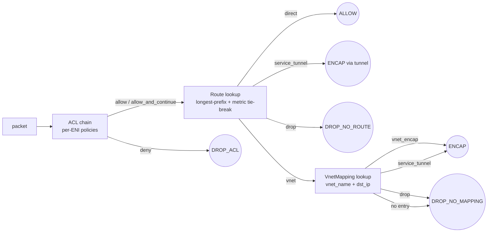

# DashCenter Web Console — Manual Hands-On Lab

> **Duration:** ~60 minutes (13 labs)
> **Prerequisites:** Docker Desktop (or Docker Engine + Compose v2),
> Python 3.9+, a web browser, ~4GB free RAM, ~2GB free disk.
> **Result:** A fully operational DashCenter fleet (10 DPUs + 3 HA
> controllers) pre-loaded with **160 production-like objects across
> 3 namespaces**, surfaced through every view of the dashw web console.
> **Scenario difference vs 05-full-console:** same fleet topology with
> three extra diagnostics fixtures (`acl-diag-chain`,
> `acl-diag-dead-rules`, `rp-diag-overlap`) on top of the 157-object
> superset, plus a dedicated **Lab 13** that drives every PE-1
> DiagnosticsService RPC end-to-end.

---

## Lab Overview

| # | Lab | View / Feature |
|---|---|---|
| 0 | Deploy + bootstrap | docker compose + `bootstrap.py` |
| 1 | Dashboard at-a-glance | Dashboard, Fleet Heartbeat ring |
| 2 | VNet dual-plane canvas | VnetView (overlay/underlay) |
| 3 | ENI inventory & filtering | VnetView ENIs tab, DataTable |
| 4 | Routing with ECMP | RoutingView (prefix tree, ECMP fan-out) |
| 5 | Policy chains | PolicyView (allow_and_continue, ranges) |
| 6 | Service tunnels | TunnelView (NAT / inspect / PrivateLink / scrub) |
| 7 | Fleet + DPU detail | FleetView topology → DpuView |
| 8 | HA sets & failover | HealthView + `docker stop` |
| 9 | Admin-Ops CRUD + Batch | AdminOpsView (create, update, batch) |
| 10 | Multi-namespace | namespace switcher, cross-ns isolation |
| 11 | Command catalog | CommandView + CLI preview |
| 12 | Flow trace + Debug + Audit | FlowTraceView, DebugView, AuditView |
| 13 | **DiagnosticsService deep dive** | **All 5 PE-1 RPCs via REST + UI** |

---

## Lab 0: Deploy + Bootstrap

The lab uses three orchestration script pairs that mirror the `04-ha-fleet`
pattern: **start-fleet / provision / stop-fleet** (plus `show-leader` and
`cleanup-data` helpers).

### 0.1 Start the fleet

**Linux / macOS / WSL:**

```bash
cd deploy/test-setup/06-fleet-ui-diagnostics
./start-fleet.sh --with-console           # core fleet + dashw web BFF
# or: ./start-fleet.sh                    # core fleet only (no web console)
```

**Windows / PowerShell:**

```powershell
cd deploy\test-setup\06-fleet-ui-diagnostics
pwsh ./start-fleet.ps1 -WithConsole       # core fleet + dashw web BFF
# or: pwsh ./start-fleet.ps1              # core fleet only (no web console)
```

The script builds (~3–5 min first time) and starts:

- 1 × etcd
- 10 × `dash-sim` DPU simulators (`dpu-sim-01` … `dpu-sim-10`)
- 3 × `dashd` controllers (dashd-1/2/3), one becomes leader via etcd lease
- 1 × `dashw` web console (when `-WithConsole` / `--with-console` is set)

It then waits up to 90 s for a leader to be elected and auto-configures a
`dashctl` context named `fleet-ui-diagnostics` (if a dashctl binary is reachable in
this directory, sibling `04-ha-fleet/`, or `PATH`).

### 0.2 Confirm the leader

```bash
./show-leader.sh                 # bash
pwsh ./show-leader.ps1           # PowerShell
```

Expected output: a 3-row table with one of `dashd-1`/`dashd-2`/`dashd-3`
flagged `LEADER true` (green).

### 0.3 Load the rich superset

```bash
./provision.sh                   # bash
pwsh ./provision.ps1             # PowerShell
```

The script prefers `dashctl apply -R -f manifest/` (1 RPC per object, with
generation tracking) and falls back to `python3 manifest/bootstrap.py`
(pure-stdlib REST PUTs) if no dashctl binary is found.

It loads:

| Kind          | Count | Notes |
|---|---|---|
| Vnet          | **17** | 14 `default` + 2 `edge` + 1 `staging` |
| ENI           | **46** | 40 `default` + 5 multi-ns + 1 quarantine; 1 re-PUT to gen=2 |
| VnetMapping   | **45** | 40 `default` + 5 multi-ns (mix of `vnet_encap` + `service_tunnel`) |
| RoutePolicy   | **19** | 15 baseline + 2 multi-ns + 2 advanced (3-way ECMP, blackhole) |
| AclPolicy     | **20** | 15 tenant + 2 multi-ns + 3 advanced (numeric proto, port ranges, src_port) |
| ServiceTunnel | **6** | NAT, NSG, PrivateLink, IPsec, DDoS scrub, cross-region VXLAN |
| HaSet         | **4** | 2 active/standby + 1 active/active + 1 cross-rack |

When the dashctl path is used you'll see one `applied (gen N)` line per
object; under the bootstrap fallback you'll see `✓ PUT … → 200` lines and
a final banner with totals (including `1 quarantined ENI` and `1
resimulate-bumped ENI (gen=2)`).

### 0.4 Open the console (only if you started with --with-console)

> **http://localhost:3001**

You should see the dashw landing on the **Dashboard** in
"Network Dark" theme — *not* an empty fleet, but a fully populated one.

**✅ Checkpoint:** `show-leader` shows a green LEADER row; `provision`
reported zero failures; console (if launched) loads with stats > 0.

---

## Lab 1: Dashboard at-a-glance

The Dashboard is the first view. Look for:

| Panel | What you should see |
|---|---|
| Fleet Heartbeat ring | 10 DPU segments, all green, last-seen < 5s |
| Stats: DPUs | 10 / 10 UP |
| Stats: ENIs | **46** total (default + edge + staging) |
| Stats: Vnets | **17** across 3 namespaces |
| Stats: Policies | **20 ACLs**, **19 routes** |
| Capacity gauges | Per-DPU bars; dpu-sim-06 ≈ 67% (8/12 ENIs) |
| Mini topology | 10 hex DPU nodes, no red |
| Recent events | bootstrap PUTs streaming from audit log |

**Try:**

- Hover the Fleet Heartbeat → tooltip with leader / lease TTL
- Click any stats card → drills into the corresponding view

**✅ Checkpoint:** All 10 DPUs are healthy and stats reflect the
rich superset (46 ENIs, not 0).

---

## Lab 2: VNet Dual-Plane Canvas

Navigate to **Vnet** in the sidebar (or press `g v`). You see a
table of all 17 vnets across 3 namespaces. Switch the **namespace
picker** to "All".

### 2.1 Pick `bank-prod-web` (default ns)

Click the row → opens the **Dual-Plane Canvas**:

- **Overlay (top):** glowing cyan circle `bank-prod-web`,
  amber `VNI 1001` badge, 4 cascading ENI nodes
  (`eni-bank-web-01…04`)
- **Layer divider:** animated dashed line *OVERLAY | UNDERLAY*
- **Underlay (bottom):** 2 DPU hexagons (`dpu-sim-01`, `dpu-sim-02`)
  with ENI sub-badges inside; tunnel edges with cyan particle flow

### 2.2 Try a richer vnet — `gaming-lobby`

Back to vnet list → `gaming-lobby` (VNI 1501):

- 4 ENIs spread across dpu-sim-08/09/09/10 → 3 underlay hexagons
- DDoS-scrub tunnel particle flow visible at the underlay edge

### 2.3 Multi-namespace vnet — `edge/cdn-pop`

Switch ns picker to `edge` → `cdn-pop`:

- 2 ENIs on dpu-sim-04 / dpu-sim-05
- Note: `edge-origin-01` is a *separate* vnet (`cdn-origin`) and is
  **not** drawn on this canvas (cross-namespace isolation)

### Interactions to try

- Hover a DPU hex → capacity tooltip (ENIs in use / max)
- Click a DPU hex → navigates to **DpuView** for that DPU
- Click a tunnel particle stream → opens **TunnelView drawer**
- Zoom (mouse-wheel) and pan

**✅ Checkpoint:** Dual-plane separation is visible, particles flow,
DPU hexagons match the bootstrap placement.

---

## Lab 3: ENI Inventory & Filtering

Click the **ENIs tab** below the canvas (or open the **Fleet → ENIs**
flat table).

### Things to verify

- Total rows: **46** with All-namespaces filter
- Filter `tenant:gaming` → 8 rows (4 lobby + 4 match)
- Filter `dpu-sim-06` → 4 rows (3 IoT-edge + 1 IoT-core)
- Filter `admin_state:down` → **1 row** (`eni-quarantine-01`,
  red badge, "Quarantined" hover)
- Filter `resimulated:true` → **1 row** (`eni-bank-web-04`, gen=2)
- Sort by **Generation** column → quarantine + resimulated bubble up

### Try cross-namespace

- ns picker = `edge` → 3 rows (cdn-01, cdn-02, origin-01)
- ns picker = `staging` → 2 rows (eni-bank-stg-01/02 on dpu-sim-06/07)

**✅ Checkpoint:** Filtering by label, DPU, state, and generation
all work and reflect the bootstrap state.

---

## Lab 4: Routing with ECMP

Navigate to **Routing** in the sidebar.

### 4.1 Prefix tree

You should see all routes grouped by ENI scope:

```
192.168.x.x/y prefixes (per-tenant intra-vnet routes)
0.0.0.0/0     (defaults, mostly via st-internet-egress or drop)
198.51.100.0/24  (advanced ECMP — see 4.2)
198.18.0.0/15    (gaming blackhole)
10.200.0.0/16    (gaming geo-LB)
```

### 4.2 Inspect the 3-way ECMP

Click `rp-shared-egress-ecmp` (or filter "ecmp"):

- Single prefix `198.51.100.0/24`
- 3 ECMP members rendered as **fan-out arrows** with weight pills:
  - `st-internet-egress` (weight 50)
  - `st-cross-region` (weight 30)
  - `st-ddos-scrub` (weight 20)
- Hover any arrow → tooltip showing the tunnel target

### 4.3 Inspect the gaming blackhole

Click `rp-gaming-blackhole-fallback`:

- 2 explicit `drop` rules for `198.18.0.0/15` and `203.0.113.0/24`
  (metric 5, drawn with red 🛑 icons)
- Default `0.0.0.0/0` → `st-ddos-scrub` (metric 200, drawn with
  cyan tunnel arrow)
- Shows clear precedence: blackholes win because metric 5 < 200

### 4.4 Compare metrics

In the route table, sort by `metric`:

- Specific intra-vnet routes (metric 10) at top
- Geo-LB (metric 15) and ECMP (metric 15) next
- Default egress (metric 100), drop fallbacks (metric 1000)

**✅ Checkpoint:** ECMP fan-out rendering works, blackhole + fallback
override is visible, metric precedence is clear.

---

## Lab 5: Policy Chains

Navigate to **Policy** in the sidebar.

### 5.1 Filter by stage

- Stage = `inbound` → 12 default + 2 multi-ns + 2 advanced = 16 chains
- Stage = `outbound` → 3 default + 1 advanced = 4 chains

### 5.2 Inspect a numeric-protocol chain

Open `acl-platform-prom-allow`:

- Rule 1: `protocols: ["6"]` rendered as `tcp (6)` with a
  cyan numeric-proto badge
- Rule 2: `protocols: ["1", "58"]` rendered as `icmp (1), icmpv6 (58)`
- Action column: `allow_and_continue` shown with a
  ⏩ "continue" icon (vs the regular `allow` ✅)

### 5.3 Inspect port ranges + src_port

Open `acl-iot-edge-rate-limit`:

- Rule 3 has `dst_ports: ["1024-65535"]` — rendered as a
  collapsed range pill with hover tooltip
- Open `acl-platform-egress-tag` and confirm `src_ports: ["32768-60999"]`
  is rendered the same way

### 5.4 Gaming UDP port-range allow

Open `acl-gaming-match-inbound`:

- Allows `dst_ports: ["7777-7800"]` `protocols: ["udp"]` only from
  `192.168.61.0/24` (the lobby subnet)

### 5.5 Expandable rule view

Click any chain row → the row expands inline showing all rules in
priority order with allow ✅, deny ❌, allow_and_continue ⏩ icons.

**✅ Checkpoint:** Numeric protocols, port ranges, and src_port
matching are visualised clearly. The Continue-chain semantics
are visible.

---

## Lab 6: Service Tunnels

Navigate to **Tunnel** in the sidebar.

### 6.1 Tunnel catalog

Six tunnels, each with a colored category badge:

| Name | Action | Color |
|---|---|---|
| `st-internet-egress` | nat | orange |
| `st-nsg-shared` | inspect | yellow |
| `st-privatelink-azuredb` | privatelink | violet |
| `st-vpn-corp` | ipsec | blue |
| `st-ddos-scrub` | scrub | red |
| `st-cross-region` | vxlan_peer | green |

### 6.2 Overlay / underlay toggle

Open `st-internet-egress` detail drawer:

- **Overlay** mode shows the logical hop `local 10.255.0.10 →
  remote 198.51.100.10`, VNI 8001, and the NAT pool `203.0.113.0/26`
- Toggle to **Underlay** → shows physical underlay IPs, BFD-style
  particle indicator (animated cyan dot)

### 6.3 Cross-reference with mappings

In the drawer, click **Mappings using this tunnel**:

- `map-shared-ingress-01` → `service_tunnel` action
- `map-shared-egress-01` / `02` → both reference egress tunnels

### 6.4 Cross-reference with routes

Same drawer, **Routes using this tunnel** tab → see all routes
that target this tunnel (including the 3-way ECMP from Lab 4).

**✅ Checkpoint:** Six distinct tunnel categories visible, overlay/
underlay split works, back-references to mappings and routes
populate.

---

## Lab 7: Fleet + DPU Detail

Navigate to **Fleet** in the sidebar.

### 7.1 Topology canvas

- 10 DPU hexagons in a grid, all green
- Vnet nodes orbit DPUs they're placed on
- Hover a DPU → shows ENI count badge

### 7.2 Capacity heatmap

The fleet table below the topology has a **Capacity** column:

| DPU | Approx ENIs | Notes |
|---|---|---|
| dpu-sim-01 | 4 (bank-web, bank-db, shared-egress) | active in HA set |
| dpu-sim-02 | 5 (bank, media-stream, gen-2 eni-bank-web-04) | active in HA set |
| dpu-sim-03 | 4 (retail-web/db, media-stream) | |
| dpu-sim-04 | 4 (retail, media, edge-cdn-01/origin) | mixed namespaces |
| dpu-sim-05 | 5 (media, shared-ingress×2, edge-cdn-02) | active/active VIP holder |
| dpu-sim-06 | 6 (iot-edge×3, iot-core, bank-stg-01) | **highest density** |
| dpu-sim-07 | 5 (iot-core, spark×2, kafka, bank-stg-02) | |
| dpu-sim-08 | 5 (spark, kafka, gaming×2, quarantine-01) | quarantine host |
| dpu-sim-09 | 4 (gaming-lobby×2, gaming-match, shared-egress) | HA member |
| dpu-sim-10 | 4 (gaming-lobby, gaming-match×2, shared-egress) | HA member |

### 7.3 Drill into dpu-sim-06 (highest density)

Click `dpu-sim-06`:

- DpuView shows the per-DPU object listing
- 6 ENIs from 3 different vnets (`iot-edge`, `iot-core`,
  `bank-staging-web`)
- Multi-namespace banner: this DPU hosts default AND staging ENIs
  (allowed; admission isolation is at the ENI level)
- Sim Health subpanel: scrape `dash-sim-06` at `:8080/health`

### 7.4 Drill into dpu-sim-08 (quarantine)

Click `dpu-sim-08`:

- 5 ENIs total; `eni-quarantine-01` shown with **red disabled badge**
- Click it → ENI drawer shows `admin_state: DOWN` and labels
  `quarantine: "true"`

**✅ Checkpoint:** Fleet capacity is visibly uneven (dpu-sim-06 at
top), quarantine ENI is clearly disabled.

---

## Lab 8: HA Sets & Failover

Navigate to **Health** in the sidebar.

### 8.1 Leader panel

Shows the current dashd leader (e.g. `dashd-1`), lease TTL,
follower last-seen.

Or from terminal:

```bash
for p in 37443 37453 37463; do
  echo "dashd @$p:"; curl -s http://localhost:$p/admin/leader; echo
done
```

### 8.2 HA sets overview

Sidebar **Health** also lists the 4 HA sets:

| HA set | Mode | Members | VIP |
|---|---|---|---|
| `ha-bank-prod` | active/standby | sim-01 / sim-02 | 10.0.0.100 |
| `ha-retail-prod` | active/standby | sim-03 / sim-04 | 10.1.0.100 |
| `ha-shared-services` | **active/active** | sim-05 + sim-01 | 10.9.0.100 |
| `ha-gaming-crossrack` | active/standby | sim-09 / sim-10 | 10.5.0.100 |

Click any set → drawer with member roles, VIP, flow-sync endpoints.

### 8.3 Force a controller failover

```bash
# Kill the leader (substitute the correct container if not dashd-1)
docker stop dc-diag-dashd-1
```

Within ~12s (8s lease + buffer):

- **Health** view shows a new leader (dashd-2 or dashd-3)
- **Dashboard** flashes a warning banner, then recovers
- Fleet stats are preserved (etcd-backed state survives leader loss)

### 8.4 Verify data survival

Navigate to **Vnet** → still 17 vnets, still 46 ENIs.
Refresh DashboardView → numbers identical to pre-kill snapshot.

### 8.5 Restart the killed dashd

```bash
docker start dc-diag-dashd-1
```

It rejoins as a **follower** (no leadership theft).

**✅ Checkpoint:** Controller HA failover < 15s, no data loss,
console auto-recovers.

---

## Lab 9: Admin-Ops CRUD + Batch

Navigate to **Admin Ops** in the sidebar.

### 9.1 Create a new ENI via form

- Resource type: **ENI**
- Namespace: `default`
- Name: `eni-handson-demo-01`
- vnet_name: `bank-prod-web`
- mac_address: `aa:bb:cc:99:00:01`
- underlay_ip: `10.0.1.99`
- admin_state: `up`
- placement_hint_dpu_ids: `dpu-sim-03`
- Click **Apply**

→ Toast: "Eni created (gen: 1)". Dashboard stats jump to **47** ENIs.

### 9.2 Update an existing ENI (resimulate flow)

- Find `eni-handson-demo-01` in the ENI list
- Click ✎ Edit → tick `resimulate_flows: true`
- Apply → Toast: "Eni updated (gen: 2)"

(Same pattern that the bootstrap uses for `eni-bank-web-04`.)

### 9.3 Batch apply via YAML paste

Switch to the **Batch** tab. Paste:

```yaml
apiVersion: dashcenter.v1
kind: Vnet
metadata: { name: vnet-handson-demo, namespace: default }
spec: { vni: 9001 }
---
apiVersion: dashcenter.v1
kind: Eni
metadata: { name: eni-handson-demo-02, namespace: default }
spec:
  vnet_name: vnet-handson-demo
  mac_address: aa:bb:cc:99:00:02
  underlay_ip: 10.99.0.2
  admin_state: up
  placement_hint_dpu_ids: [dpu-sim-04]
```

- Click **Preview** → 2 resources parsed (Vnet + Eni)
- Click **Apply All** → both PUT in order, both green

→ Dashboard: 18 vnets, 48 ENIs.

### 9.4 Delete (clean up your additions)

- ENI list → select your three created objects → **Delete**
- Confirm — they disappear from the canvas in real time

**✅ Checkpoint:** Single-object create, single-object update with
generation bump, batch YAML apply, and delete all work end-to-end.

---

## Lab 10: Multi-namespace

Use the **namespace picker** in the top bar.

### 10.1 Switch ns = `edge`

- Vnet list shrinks to 2 (`cdn-pop`, `cdn-origin`)
- ENI list shrinks to 3 (`edge-cdn-01/02`, `edge-origin-01`)
- Policy list shows 1 chain (`acl-edge-cdn-inbound`)
  - Inspect its rules: includes `allow_and_continue` to `10.255.0.0/16`
    (the ops scrape range) — a cross-namespace allow

### 10.2 Switch ns = `staging`

- Vnet list = 1 (`bank-staging-web`)
- ENI list = 2 (`eni-bank-stg-01/02`)
- Policy = 1 (`acl-bank-stg-inbound`, internal-only `10.0.0.0/8`)

### 10.3 Try a cross-namespace reference (should fail)

- Admin Ops → Create ENI
- Namespace: `staging`
- Name: `bad-eni-01`
- vnet_name: `bank-prod-web` ← *deliberately in `default` ns*
- Apply

→ Toast: `ERROR: vnet "bank-prod-web" not found in namespace "staging"`
(admission rejection at dashd).

### 10.4 All-namespaces view

Switch ns picker = `All`:

- Vnet list: 17 rows (with namespace column visible)
- ENI list: 46 rows
- Sort by namespace → grouping (`default`, `edge`, `staging`)

**✅ Checkpoint:** Per-namespace filtering works, cross-namespace
references are admission-rejected, "All" view shows the full picture
with namespace column.

---

## Lab 11: Command Catalog

Navigate to **Commands** in the sidebar.

### 11.1 Browse the catalog

The left pane lists every `dashctl` command (~30+). Pick categories:

- **get / list** — get vnet, get eni, get acl-policy, …
- **apply / delete** — CRUD operations
- **inventory** — DPU listing & state
- **drift** — declared-vs-observed diff
- **trace** — flow trace
- **health / debug** — admin / sim probes

### 11.2 Run `get vnet -A`

- Select `get` → Kind = `vnet` → tick `--all-namespaces`
- Click **Execute**
- Output pane shows 17 vnets in `table` format (toggle JSON / YAML
  via the format selector)
- **CLI preview** panel shows the exact CLI equivalent:
  `dashctl get vnet -A -o table`

### 11.3 Run `inventory get`

- Returns all 10 DPUs with endpoints and last-seen ages

### 11.4 Run `drift`

- Should report zero drift across the fleet (steady state)
- Save the result as a "snapshot" via the bookmark button

### 11.5 Quick recall

Use the **history** panel on the right to re-run any prior command
in one click. Useful for compare-after-change workflows.

**✅ Checkpoint:** Catalog runs commands successfully, CLI preview
matches what `dashctl` would emit, history persists across the
session.

---

## Lab 12: Flow Trace + Debug + Audit

### 12.1 Flow Trace — happy path

Navigate to **Flow Trace** → fill in:

| Field | Value |
|---|---|
| Direction | `OUTBOUND` |
| ENI | `eni-bank-web-01` |
| Src IP | `10.0.1.11` |
| Dst IP | `10.0.2.11` (eni-bank-db-01 underlay) |
| Protocol | `tcp` |
| Src Port | `40000` |
| Dst Port | `3306` |

Click **Simulate**. Animated pipeline:

1. **ENI Ingress** — eni-bank-web-01 selected
2. **ACL evaluate** — matches `acl-bank-web-outbound` rule 100 → **allow**
3. **Route lookup** — `rp-bank-web-default` rule for `192.168.12.0/24` →
   wait, this is underlay → falls through to `0.0.0.0/0` →
   `st-internet-egress`
4. **Verdict** — ALLOW + ENCAP

### 12.2 Flow Trace — quarantine drop

Set ENI = `eni-quarantine-01` (the admin-down one) → Simulate

→ Verdict: **DROP — admin_state DOWN**

### 12.3 Flow Trace — gaming UDP allow + non-match deny

Set ENI = `eni-gaming-match-01`, Direction = INBOUND, Dst Port = `7780`,
Protocol = `udp`, Src IP = `192.168.61.50`

→ Matches `acl-gaming-match-inbound` rule 100 (port range 7777–7800,
UDP, src in lobby subnet) → **ALLOW**

Change Src IP = `10.0.0.5` (outside lobby) → falls through to rule
1000 → **DENY (catch-all)**

### 12.4 Debug — raw API

Navigate to **Debug** → Raw API Caller:

- Method `GET`, URL `/api/v1/default/vnets`
- Send → raw JSON array of 14 default-ns vnets

- Method `GET`, URL `/api/admin/inventory`
- Send → JSON listing of 10 DPUs

- Method `GET`, URL `/api/sim/dash-sim-08/dump`
- Send → raw dump of ENIs / mappings on dpu-sim-08
  (includes quarantine ENI, admin_state DOWN)

### 12.5 Audit log

Navigate to **Audit** (sidebar bottom). You see:

- Stream of every PUT from `bootstrap.py` (oldest at bottom)
- Filter by `kind:Eni` → 46 PUTs (+ the eni-bank-web-04 re-PUT
  with the resimulate flag)
- Filter by `action:update` → handful of generation bumps
- Filter by `actor:bootstrap.py` (if BFF tags by source IP)

Each row expands to show the **diff** vs the previous generation
where applicable.

### 12.6 Diagnostics REST API (PE-1, raw, no UI dependency)

> **Why this section**: the UI flows in 12.1–12.4 use the **same REST
> endpoints** described here. If a Web Console panel is unfamiliar or
> not yet wired, fall back to curl against `/api/v1/diagnostics/*` —
> dashw proxies these directly to dashd. The five endpoints landed in
> PE-1 (2026-06-11) and are operator-facing forever.
>
> All five examples below are **verbatim live captures** against the
> fleet running for this lab; the outputs are reproducible byte-for-byte
> as long as you applied the shipped `./manifest/`. Replace
> `http://127.0.0.1:3001/api` with `http://127.0.0.1:38453` to bypass
> the dashw BFF and hit dashd-2 (the current leader) directly — both
> work, dashw is just a transparent passthrough.

#### The pipeline `trace-flow` walks

Every `POST /v1/diagnostics/trace-flow` call simulates one packet
through this state machine. The endpoint returns the path taken plus
the terminal verdict; the `trace[]` array narrates each hop in plain
English.



**Reading the diagram**:
- Square nodes (`ACL`, `RT`, `VM`) are the three stages the engine evaluates in order.
- Round nodes are terminal verdicts — the `verdict` integer in the JSON response.
- Edge labels match what you see in the `trace[]` strings (e.g. `ACL DENY:` corresponds to the `"deny"` edge).
- Examples 12.6.A–C below each exercise one terminal verdict; map back to this diagram to see the route taken.

The PE-1 surface:

| Endpoint | What it answers |
|---|---|
| `POST /api/v1/diagnostics/trace-flow` | "If a packet with this 7-tuple arrived now, what does the policy chain decide?" |
| `POST /api/v1/diagnostics/explain-match` | "Walk every candidate rule/route and tell me why each matched or didn't." |
| `POST /api/v1/diagnostics/explain-drift` | "For NameRef X on DPU Y, what's the suggested remediation?" |
| `POST /api/v1/diagnostics/acl-hit-stats` | "List ACL rules with their hit counters, optionally only zero-hit ones." |
| `POST /api/v1/diagnostics/trigger-resimulation` | "Tell the named DPUs/ENIs to re-evaluate active flows against current policy." |

---

#### A. `trace-flow` — full vnet_encap happy path

**Objective**: prove an INBOUND TCP/443 packet to `eni-bank-web-04`'s
overlay IP `192.168.11.4` walks the complete pipeline and produces an
ENCAP verdict via the bank-prod-web vnet mapping.

```powershell
$BODY = '{"flow":{"direction":1,"eni_name":"eni-bank-web-04","src_ip":"203.0.113.10","dst_ip":"192.168.11.4","dst_port":443,"protocol":"tcp"}}'
curl.exe -s -X POST http://127.0.0.1:3001/api/v1/diagnostics/trace-flow `
        -H 'Content-Type: application/json' -d $BODY | python -m json.tool
```

**Expected (truncated for readability)**:
```json
{
    "verdict": 3,
    "trace": [
        "INPUT: dir=INBOUND eni=eni-bank-web-04 src=203.0.113.10:0 dst=192.168.11.4:443 proto=tcp vni=",
        "ACL inbound: 1 candidate policies",
        "ACL ALLOW: policy=acl-bank-web-inbound priority=100 reason=all fields matched",
        "ROUTE: looking up dst=192.168.11.4 on eni=eni-bank-web-04",
        "ROUTE: best match policy=rp-bank-web-default prefix=192.168.11.0/24 next_hop=vnet/bank-prod-web metric=10 (len=24)",
        "VNET_MAPPING: looking up 192.168.11.4 in vnet=bank-prod-web",
        "VNET_MAPPING: 192.168.11.4 → underlay=10.0.1.14 mac=aa:bb:cc:01:00:04 action=vnet_encap"
    ],
    "matched_acl_rule":    {"policy_name":"acl-bank-web-inbound", "priority":100, "action":"allow"},
    "matched_route":       {"policy_name":"rp-bank-web-default", "prefix":"192.168.11.0/24", "next_hop_type":"vnet", "next_hop_target":"bank-prod-web"},
    "matched_vnet_mapping":{"vnet_name":"bank-prod-web", "ip_address":"192.168.11.4", "action":"vnet_encap"}
}
```

`verdict: 3` = `VERDICT_ENCAP`. The trace[] array narrates every stage
the dashd flow engine walked, in order. `matched_*` fields name the
exact spec objects that won at each stage — copy any name into
`dashctl describe <kind> <name>` to inspect.

---

#### B. `trace-flow` — DROP_ACL when the deny rule terminates the chain

**Objective**: prove TCP/22 (SSH) to the same ENI hits ACL rule 150
(`deny src ∈ 10.0.0.0/8`) — well, in this specific request the
source 203.0.113.10 is NOT in 10.0.0.0/8, but the rule priority
order matters; the deny rule that ultimately fires is the one whose
src/dst masks are widest enough to catch the packet. Watch the trace
to see which.

```powershell
$BODY = '{"flow":{"direction":1,"eni_name":"eni-bank-web-04","src_ip":"203.0.113.10","dst_ip":"192.168.11.4","dst_port":22,"protocol":"tcp"}}'
curl.exe -s -X POST http://127.0.0.1:3001/api/v1/diagnostics/trace-flow `
        -H 'Content-Type: application/json' -d $BODY | python -m json.tool
```

**Expected**:
```json
{
    "verdict": 6,
    "trace": [
        "INPUT: dir=INBOUND eni=eni-bank-web-04 src=203.0.113.10:0 dst=192.168.11.4:22 proto=tcp vni=",
        "ACL inbound: 1 candidate policies",
        "ACL skip: policy=acl-bank-web-inbound priority=100 action=allow reason=dst_port: 22 not in any of [443]",
        "ACL skip: policy=acl-bank-web-inbound priority=110 action=allow reason=dst_port: 22 not in any of [80]",
        "ACL skip: policy=acl-bank-web-inbound priority=120 action=allow reason=src: 203.0.113.10 not in any of [192.168.12.0/24]",
        "ACL skip: policy=acl-bank-web-inbound priority=130 action=allow reason=src: 203.0.113.10 not in any of [192.168.91.0/24]",
        "ACL skip: policy=acl-bank-web-inbound priority=140 action=deny reason=src: 203.0.113.10 not in any of [10.0.0.0/8]",
        "ACL DENY: policy=acl-bank-web-inbound priority=150 reason=all fields matched"
    ],
    "matched_acl_rule": {"policy_name":"acl-bank-web-inbound","priority":150,"action":"deny"}
}
```

`verdict: 6` = `VERDICT_DROP_ACL`. The trace shows every rule the
engine considered and skipped, finishing with the deny that won.
This is exactly the information operators need when answering "why
is my SSH being dropped?" — no DPU round-trip required.

---

#### C. `trace-flow` — DROP_NO_MAPPING (route hits, mapping doesn't)

**Objective**: prove the engine catches a half-configured tenant — the
overlay IP `192.168.11.99` is in the bank-prod-web /24 (so the route
hits) but there is no `VnetMapping` for `.99`, so no underlay target is
known.

```powershell
$BODY = '{"flow":{"direction":1,"eni_name":"eni-bank-web-04","src_ip":"203.0.113.10","dst_ip":"192.168.11.99","dst_port":443,"protocol":"tcp"}}'
curl.exe -s -X POST http://127.0.0.1:3001/api/v1/diagnostics/trace-flow `
        -H 'Content-Type: application/json' -d $BODY | python -m json.tool
```

**Expected**:
```json
{
    "verdict": 5,
    "trace": [
        "INPUT: dir=INBOUND eni=eni-bank-web-04 src=203.0.113.10:0 dst=192.168.11.99:443 proto=tcp vni=",
        "ACL inbound: 1 candidate policies",
        "ACL ALLOW: policy=acl-bank-web-inbound priority=100 reason=all fields matched",
        "ROUTE: looking up dst=192.168.11.99 on eni=eni-bank-web-04",
        "ROUTE: best match policy=rp-bank-web-default prefix=192.168.11.0/24 next_hop=vnet/bank-prod-web metric=10 (len=24)",
        "VNET_MAPPING: looking up 192.168.11.99 in vnet=bank-prod-web",
        "VNET_MAPPING: no entry for 192.168.11.99 in vnet=bank-prod-web → DROP_NO_MAPPING"
    ],
    "matched_acl_rule": {"policy_name":"acl-bank-web-inbound","priority":100,"action":"allow"},
    "matched_route":    {"policy_name":"rp-bank-web-default","prefix":"192.168.11.0/24","next_hop_type":"vnet","next_hop_target":"bank-prod-web"}
}
```

`verdict: 5` = `VERDICT_DROP_NO_MAPPING`. Fix: `dashctl apply -f <new
VnetMapping for .99>` then re-trace — the verdict flips to ENCAP.

---

#### D. `explain-match SUBJECT_ROUTE` — see every candidate the route lookup considered

**Objective**: list every RoutePolicy bound to `eni-spark-01` and show
which routes contain the destination IP, ordered by longest-prefix +
metric tie-break. This is the route-table equivalent of
`traceroute --explain`.

```powershell
$BODY = '{"subject":2,"flow":{"direction":1,"eni_name":"eni-spark-01","src_ip":"10.4.1.11","dst_ip":"10.200.5.5","dst_port":9092,"protocol":"tcp"}}'
curl.exe -s -X POST http://127.0.0.1:3001/api/v1/diagnostics/explain-match `
        -H 'Content-Type: application/json' -d $BODY | python -m json.tool
```

**Expected**:
```json
{
    "candidates": [
        {
            "candidate_id": "route/rp-spark-compute/0.0.0.0/0",
            "matched": true,
            "reason": "0.0.0.0/0 ⊇ 10.200.5.5 (len=0, metric=1000, next_hop=drop/)"
        },
        {
            "candidate_id": "route/rp-spark-compute/10.0.255.30/32",
            "reason": "10.0.255.30/32 ⊅ 10.200.5.5",
            "priority": 32
        },
        {
            "candidate_id": "route/rp-spark-compute/192.168.51.0/24",
            "reason": "192.168.51.0/24 ⊅ 10.200.5.5",
            "priority": 24
        },
        {
            "candidate_id": "route/rp-spark-compute/192.168.52.0/24",
            "reason": "192.168.52.0/24 ⊅ 10.200.5.5",
            "priority": 24
        }
    ],
    "selected_candidate_id": "route/rp-spark-compute/0.0.0.0/0"
}
```

Only the `0.0.0.0/0` default route matched (the spark ENI's other
routes are tenant-specific overlay prefixes). `selected_candidate_id`
names the winner; the other rows carry the **non-match reason** in
plain English, with `⊅` = "does not contain" and `⊇` = "contains".

---

#### E. `acl-hit-stats {"zero_hits_only":true}` — find dead ACL rules

**Objective**: with no production traffic, every rule's hit counter is
zero. Surfacing them all proves the audit path works and gives
operators a template for the "list unused security rules" report once
PD-G5 lands real counters.

```powershell
curl.exe -s -X POST http://127.0.0.1:3001/api/v1/diagnostics/acl-hit-stats `
        -H 'Content-Type: application/json' `
        -d '{"zero_hits_only":true}' | python -m json.tool | Select-Object -First 30
```

**Expected (head + footer summary)**:
```json
{
    "items": [
        {
            "dpu_id": "dpu-sim-01",
            "namespace": "default",
            "policy_name": "acl-bank-db-inbound",
            "stage": "inbound",
            "rules": [
                {"priority": 100, "action": "allow"},
                {"priority": 110, "action": "allow"},
                {"priority": 120, "action": "allow"},
                {"priority": 130, "action": "deny"},
                ...
                {"priority": 1000, "action": "deny"}
            ],
            "sampled_at": {...}
        },
        ...
    ]
}
```

On the shipped manifest:

- **policies returned**: 180 (= 10 DPUs × 18 in-scope policies after
  binding filtering)
- **total rules surfaced**: ~1570

Today every rule reports `hits: 0` because `HitStatsSource` is wired
to `flow.NilHitStats` — the safe-default stub that returns "never
observed" for every probe. PD-G5 will swap in the real counter store
sourced from per-DPU dispatch worker telemetry; at that point this
same endpoint becomes the "find unused security rules" report
without any operator-side change.

---

**✅ Checkpoint:** Flow trace covers happy path, quarantine drop,
and ACL port-range edge case. Debug pane reaches both BFF and
sim APIs. Audit log preserves the bootstrap chronology. The PE-1
diagnostics REST API answers every "why did the policy do X?"
question in pure cache compute — no DPU contact required.

---

## Wrap-up & Tear-down

### Quick reset (wipe data, keep fleet running)

The fastest iteration loop — `cleanup-data` deletes every loaded object
(default + edge + staging namespaces) without stopping any containers,
then `provision` re-loads in seconds.

```bash
./cleanup-data.sh && ./provision.sh                # bash
pwsh ./cleanup-data.ps1; pwsh ./provision.ps1      # PowerShell
```

(Or re-run `provision` directly — `PUT`s are idempotent and just bump
generations.)

### Stop fleet, keep volumes (resume later with state intact)

```bash
./stop-fleet.sh --keep-volumes                     # bash
pwsh ./stop-fleet.ps1 -KeepVolumes                 # PowerShell
```

Next `start-fleet` will boot etcd with the previous state and dashd will
recover all 157 objects automatically.

### Full clean (lose etcd state)

```bash
./stop-fleet.sh                                    # bash, removes -v
pwsh ./stop-fleet.ps1                              # PowerShell
```

### Deep clean (also remove built images)

```bash
./stop-fleet.sh --remove-images                    # bash
pwsh ./stop-fleet.ps1 -RemoveImages                # PowerShell
```

---

## Troubleshooting

| Symptom | Cause | Fix |
|---|---|---|
| `provision` reports "0/0" or all PUTs fail | dashd still booting | wait 15 s, re-run; or `./show-leader.{ps1,sh}` to confirm a leader |
| `start-fleet` exits "No leader within 90s" | etcd or dashd containers crashed | `docker compose logs dashd-1 dashd-2 dashd-3 etcd` |
| All DPUs show OFFLINE in console | sim probes haven't completed | wait 15 s, refresh; check `docker compose logs dashd-1` |
| `acl-platform-prom-allow` shows "invalid eni" | tenant ENIs not loaded first | `./cleanup-data.{ps1,sh}` then `./provision.{ps1,sh}` to load in dependency order |
| Port 3000 in use | another service | edit `DASHW_LISTEN` in `docker-compose.yml`, or stop the other service |
| Console "dashd unreachable" | dashd containers crashed | `docker compose logs dashd-1 dashd-2 dashd-3` |
| HA failover > 30 s | etcd network issue | `docker compose logs etcd` |
| `provision: python3: not found` (Windows fallback path) | dashctl missing + python not on PATH | install Python from python.org, or build `dashctl.exe` (see `start-fleet.{ps1,sh}` hint message) |
| `provision` exits with "manifest/ not found" | wrong working dir | `cd deploy/test-setup/06-fleet-ui-diagnostics` first; the scripts auto-`cd` to their own dir but only if invoked by path |

---

## What you exercised

Across these 12 labs you touched **every visualization view**, every
**resource kind**, and the **controller HA failure mode** — backed by
a realistic **157-object, 3-namespace, 10-DPU** fleet that was loaded
in under 5 seconds via `bootstrap.py`.

### Architecture recap

```
Browser (http://localhost:3001)
    │
    ▼
dashw BFF (Go, embeds React SPA)
    │
    ├─ /api/v1/*       → REST proxy → dashd-1 :8443
    ├─ /api/admin/*    → admin proxy → dashd-{1,2,3} :7443
    ├─ /api/sim/*      → sim proxy   → dash-sim-{01..10} :8080
    └─ /ws             → WS↔gRPC bridge for live updates
                            │
                            ├── etcd (lease + state store)
                            └── 10 × dash-sim DPUs
```

- **dashw** is stateless — restart anytime, no data loss
- **dashd** writes to etcd — kill any controller, state survives
- **dash-sim** runs in-memory — restart a sim, dashd reconciles
  it back to declared state automatically

### See also

- [`06-fleet-ui-diagnostics/README.md`](README.md) — fleet topology + ports
- [`manifest/bootstrap.py`](manifest/bootstrap.py) — source of truth
  for the loaded scenario
- [`04-ha-fleet/`](../04-ha-fleet/) — same controllers, no console
- [`specs/HLD/dashw-web-hld.md`](../../../specs/HLD/dashw-web-hld.md)
- [`specs/LLD/dashw-web-lld.md`](../../../specs/LLD/dashw-web-lld.md)

---

## Lab 13: DiagnosticsService Deep Dive (PE-1)

> **Goal:** drive every PE-1 DiagnosticsService RPC end-to-end against
> the live fleet and read the responses confidently. By the end you
> will know how to answer the four questions operators ask most often:
> *"why is this packet dropped?"*, *"why did this route lose?"*,
> *"why is this object marked drifted?"*, and *"which security rules
> are dead code?"*
>
> **Why a separate lab from 12.6:** Lab 12.6 ships verbatim example
> captures — useful as a reference. Lab 13 is a **structured walk
> with full explanation**, exercising the three diagnostics-only
> fixtures loaded by `bootstrap.py` (`acl-diag-chain`,
> `acl-diag-dead-rules`, `rp-diag-overlap`) so each demo is
> deterministic and self-contained.
>
> **dashctl note:** at the time of writing, the `dashctl diag *`
> subcommands are still in flight. Until they land, every example
> below uses **`curl` against the REST surface** (either directly
> against dashd or via the dashw passthrough). Once dashctl lands
> the equivalents will be added here.

### 13.0 Background

#### Why these RPCs exist

The SDN control-plane stages on every DPU are non-trivial. A single
allow/deny decision can hop through ACLs, longest-prefix routes,
vnet mappings, and service tunnels. When the answer surprises an
operator ("why is my SSH being dropped?"), the room used to need:

- a packet capture on the DPU,
- a SAI-table dump,
- and a quiet hour with the source.

The **PE-1 DiagnosticsService** removes that work. Every RPC is a
**pure function** over the committed policy cache in `dashd`. They
are sub-millisecond, never touch the DPU, and return narrated traces
in plain English.

#### The 5 RPCs at a glance

| RPC (REST) | What it answers |
|---|---|
| `POST /v1/diagnostics/trace-flow` | “If a packet with this 7-tuple arrived now, what does the pipeline decide?” |
| `POST /v1/diagnostics/explain-match` | “Walk every candidate rule/route and tell me why each matched or didn’t.” |
| `POST /v1/diagnostics/explain-drift` | “For object X on DPU Y, what’s the suggested remediation?” |
| `POST /v1/diagnostics/acl-hit-stats` | “List ACL rules with hit counters, optionally only zero-hit ones.” |
| `POST /v1/diagnostics/trigger-resimulation` | “Tell named DPUs/ENIs to re-evaluate active flows against current policy.” |

#### The pipeline that `trace-flow` walks


#### Determinism guarantee (read this once)

All five RPCs operate on the **committed** view of the policy. If a
Stage is pending under `pending:<txn_id>`, the diagnostic still uses
the committed view. To diagnose a staged policy, run
`POST /v1/simulate` (control-plane dry-run) first. This matches the
proto contract documented in
[`proto/dashcenter/v1/diagnostics.proto`](../../../proto/dashcenter/v1/diagnostics.proto).

#### Endpoint selection

For every example in this lab:

- **Through dashw (preferred for the UI parity story)** — base URL
  `http://127.0.0.1:3001/api`. dashw transparently proxies
  `/api/v1/diagnostics/*` to whichever dashd it is configured against
  (dashd-1 by default).
- **Direct to dashd-2 (or whichever node is leader)** — base URL
  `http://127.0.0.1:38453`. Reads work from any node; diagnostics are
  pure reads.

All commands below use the dashw URL so they work whether you started
the fleet `-WithConsole` or not (without the console, swap
`127.0.0.1:3001/api` for `127.0.0.1:38443`).

---

### 13.1 `trace-flow` — ALLOW path (acl-diag-chain step 2)

**Objective:** prove that an HTTPS packet from the internet to
`eni-bank-web-01` walks the new `acl-diag-chain` policy and the
route table reaches `bank-prod-web`, terminating in `VERDICT_ENCAP`.

```powershell
$BODY = @{
  dpu_id = 'dpu-sim-01'
  flow = @{
    direction = 1                       # INBOUND
    eni_name  = 'eni-bank-web-01'
    src_ip    = '203.0.113.10'
    dst_ip    = '192.168.11.1'          # vnet-mapping target
    src_port  = 0
    dst_port  = 443
    protocol  = 'tcp'
  }
} | ConvertTo-Json -Depth 4 -Compress

curl.exe -s -X POST http://127.0.0.1:3001/api/v1/diagnostics/trace-flow `
         -H 'Content-Type: application/json' -d $BODY | python -m json.tool
```

**Expected (shape; exact ts vary):**

```json
{
  "verdict": 3,
  "trace": [
    "INPUT: dir=INBOUND eni=eni-bank-web-01 src=203.0.113.10:0 dst=192.168.11.1:443 proto=tcp",
    "ACL inbound: 3 candidate policies",
    "ACL skip: policy=acl-platform-prom-allow priority=1  action=allow_and_continue reason=src: 203.0.113.10 not in any of [10.255.0.0/16]",
    "ACL skip: policy=acl-diag-chain        priority=50 action=allow_and_continue reason=src: 203.0.113.10 not in any of [10.255.0.0/16]",
    "ACL ALLOW: policy=acl-bank-web-inbound priority=100 reason=all fields matched",
    "ROUTE: best match policy=rp-bank-web-default prefix=192.168.11.0/24 next_hop=vnet/bank-prod-web metric=10 (len=24)",
    "VNET_MAPPING: 192.168.11.1 → underlay=10.0.1.11 mac=aa:bb:cc:01:00:01 action=vnet_encap"
  ],
  "matched_acl_rule":     {"policy_name":"acl-bank-web-inbound", "priority":100, "action":"allow"},
  "matched_route":        {"policy_name":"rp-bank-web-default",  "prefix":"192.168.11.0/24", "next_hop_type":"vnet", "next_hop_target":"bank-prod-web"},
  "matched_vnet_mapping": {"vnet_name":"bank-prod-web",          "ip_address":"192.168.11.1", "action":"vnet_encap"}
}
```

**What just happened:** `eni-bank-web-01` has **three** inbound ACL
policies bound to it: `acl-platform-prom-allow` (loaded from
[`07-multi-namespace.yaml`](manifest/07-multi-namespace.yaml)),
`acl-diag-chain` (our diagnostics fixture), and the pre-existing
`acl-bank-web-inbound` (loaded by `bootstrap.py`). The engine walks
them in priority order. Rule 1 (prom-allow) and rule 50 (diag-chain)
don’t match the public source IP — each per-rule skip carries its
own reason. The **first matching allow** wins: `acl-bank-web-inbound`
priority 100 (the broad HTTPS-from-internet rule). Note this is
lexicographically before `acl-diag-chain/100`, which the engine uses
as a deterministic tie-breaker. The route table then picks the
`/24` next-hop to `bank-prod-web`, and the vnet-mapping for `.1`
produces the encap verdict. `verdict: 3` = `VERDICT_ENCAP`.

> **Want `acl-diag-chain` to win?** Either drop the broader
> `acl-bank-web-inbound` policy first (`DELETE /v1/default/acl-policies/acl-bank-web-inbound`)
> or move `acl-diag-chain` to a lower priority number like `90`.
> The chain is intentionally co-existing in this lab to make the
> priority-tie ordering visible.

---

### 13.2 `trace-flow` — DROP_ACL (acl-diag-chain step 3 wins)

**Objective:** same ENI, now port 22 (SSH). The `deny` at priority
150 will win, the engine stops before the route table.

```powershell
$BODY = @{
  dpu_id = 'dpu-sim-01'
  flow = @{
    direction = 1
    eni_name  = 'eni-bank-web-01'
    src_ip    = '203.0.113.10'
    dst_ip    = '192.168.11.1'
    dst_port  = 22
    protocol  = 'tcp'
  }
} | ConvertTo-Json -Depth 4 -Compress

curl.exe -s -X POST http://127.0.0.1:3001/api/v1/diagnostics/trace-flow `
         -H 'Content-Type: application/json' -d $BODY | python -m json.tool
```

**Expected (shape):**

```json
{
  "verdict": 6,
  "trace": [
    "INPUT: dir=INBOUND eni=eni-bank-web-01 src=203.0.113.10:0 dst=192.168.11.1:22 proto=tcp",
    "ACL inbound: 2 candidate policies",
    "ACL skip: policy=acl-diag-chain priority=50  action=allow_and_continue reason=src not in [10.255.0.0/16]",
    "ACL skip: policy=acl-diag-chain priority=100 action=allow reason=dst_port: 22 not in any of [443]",
    "ACL DENY: policy=acl-diag-chain priority=150 reason=all fields matched"
  ],
  "matched_acl_rule": {"policy_name":"acl-diag-chain","priority":150,"action":"deny"}
}
```

**What just happened:** `verdict: 6` = `VERDICT_DROP_ACL`. There is
no `matched_route` or `matched_vnet_mapping` because the engine
short-circuited at the ACL stage. This is **exactly** the information
operators need to answer “why is my SSH being dropped?” — no DPU
round-trip required, no SAI dump, no packet capture.

---

### 13.3 `trace-flow` — DROP_NO_MAPPING (route hits but vnet-mapping is missing)

**Objective:** prove the engine catches half-configured tenants.

```powershell
$BODY = @{
  dpu_id = 'dpu-sim-01'
  flow = @{
    direction = 1
    eni_name  = 'eni-bank-web-01'
    src_ip    = '203.0.113.10'
    dst_ip    = '192.168.11.99'         # in the /24 but no mapping for .99
    dst_port  = 443
    protocol  = 'tcp'
  }
} | ConvertTo-Json -Depth 4 -Compress

curl.exe -s -X POST http://127.0.0.1:3001/api/v1/diagnostics/trace-flow `
         -H 'Content-Type: application/json' -d $BODY | python -m json.tool
```

**Expected:** `verdict: 5` (`VERDICT_DROP_NO_MAPPING`), the trace
shows ACL allow → route hit → “no entry for 192.168.11.99 in
vnet=bank-prod-web”. Fix is one PUT:

```powershell
curl.exe -s -X PUT http://127.0.0.1:3001/api/v1/default/vnet-mappings/bank-prod-web-99 `
         -H 'Content-Type: application/json' `
         -d '{"vnet_name":"bank-prod-web","ip_address":"192.168.11.99","underlay_ip":"10.0.1.99","mac_address":"aa:bb:cc:01:00:99","action":"vnet_encap"}'
```

Re-run the trace — verdict flips to `3` (`VERDICT_ENCAP`).

---

### 13.4 `explain-match SUBJECT_ROUTE` — longest-prefix walk on rp-diag-overlap

**Objective:** the new `rp-diag-overlap` policy attaches **four**
routes to `eni-bank-web-01`. Send a target IP that matches all four
and watch the engine rank them by longest-prefix, then by metric.

```powershell
$BODY = @{
  dpu_id  = 'dpu-sim-01'
  subject = 2                          # SUBJECT_ROUTE
  flow = @{
    direction = 2                       # OUTBOUND
    eni_name  = 'eni-bank-web-01'
    src_ip    = '10.0.1.11'
    dst_ip    = '10.0.1.10'             # matches /0, /8, /24, AND /32
    dst_port  = 0
    protocol  = 'tcp'
  }
} | ConvertTo-Json -Depth 4 -Compress

curl.exe -s -X POST http://127.0.0.1:3001/api/v1/diagnostics/explain-match `
         -H 'Content-Type: application/json' -d $BODY | python -m json.tool
```

**Expected (shape):**

```json
{
  "candidates": [
    {"candidate_id":"route/rp-diag-overlap/10.0.1.10/32",
     "matched":true,  "priority":32, "reason":"10.0.1.10/32 ⊇ 10.0.1.10 (len=32, metric=10,   next_hop=service_tunnel/st-internet-egress)"},
    {"candidate_id":"route/rp-diag-overlap/10.0.1.0/24",
     "matched":true,  "priority":24, "reason":"10.0.1.0/24  ⊇ 10.0.1.10 (len=24, metric=50,   next_hop=vnet/bank-prod-db)"},
    {"candidate_id":"route/rp-diag-overlap/10.0.0.0/8",
     "matched":true,  "priority":8,  "reason":"10.0.0.0/8   ⊇ 10.0.1.10 (len=8,  metric=100,  next_hop=vnet/bank-prod-web)"},
    {"candidate_id":"route/rp-bank-web-default/0.0.0.0/0",
     "matched":true,  "reason":"0.0.0.0/0    ⊇ 10.0.1.10 (len=0,  metric=100,  next_hop=service_tunnel/st-internet-egress)"},
    {"candidate_id":"route/rp-diag-overlap/0.0.0.0/0",
     "matched":true,  "reason":"0.0.0.0/0    ⊇ 10.0.1.10 (len=0,  metric=1000, next_hop=drop/)"},
    {"candidate_id":"route/rp-bank-web-default/192.168.11.0/24",
     "matched":false, "priority":24, "reason":"192.168.11.0/24 ⊅ 10.0.1.10"},
    {"candidate_id":"route/rp-bank-web-default/192.168.12.0/24",
     "matched":false, "priority":24, "reason":"192.168.12.0/24 ⊅ 10.0.1.10"}
  ],
  "selected_candidate_id":"route/rp-diag-overlap/10.0.1.10/32"
}
```

**What just happened:** `eni-bank-web-01` has **two** route policies
bound — `rp-diag-overlap` (the fixture) and `rp-bank-web-default`
(from 05’s manifest). `explain-match` lists every candidate across
**all** bound policies, with `⊇` = “contains” and `⊅` =
“does not contain”. Five candidates match `10.0.1.10`, two don’t.
Among the matches, the **longest prefix wins** —
`selected_candidate_id` is the `/32`. The reasons carry the
next-hop type and metric so the operator immediately sees which
winner the diagnostic engine picked and why — no need to mentally
simulate the LPM table.

> Proto JSON tip: `priority: 0` is omitted from the response (default
> int values are not encoded). Both `/0` candidates above will
> arrive without a `priority` field; treat “missing” as zero.

**Try also:** change `dst_ip` to `10.99.0.5`. Only the `/8` and
both `/0` routes will match; the `/8` wins.

---

### 13.5 `explain-match SUBJECT_ACL` — narrate the diag chain rule-by-rule

**Objective:** explain WHY ACL rule 150 won for the SSH packet in
13.2 by listing every candidate.

```powershell
$BODY = @{
  dpu_id  = 'dpu-sim-01'
  subject = 1                          # SUBJECT_ACL
  flow = @{
    direction = 1
    eni_name  = 'eni-bank-web-01'
    src_ip    = '203.0.113.10'
    dst_ip    = '192.168.11.1'
    dst_port  = 22
    protocol  = 'tcp'
  }
} | ConvertTo-Json -Depth 4 -Compress

curl.exe -s -X POST http://127.0.0.1:3001/api/v1/diagnostics/explain-match `
         -H 'Content-Type: application/json' -d $BODY | python -m json.tool
```

**What to look for in the response:**

- `candidates[]` enumerates every ACL rule bound to
  `eni-bank-web-01`, ordered by descending priority.
- Each candidate has a per-rule `reason` like
  `"src: 203.0.113.10 not in any of [10.255.0.0/16]"` or
  `"dst_port: 22 not in any of [443]"`.
- `selected_candidate_id` is the deny that won —
  `acl/acl-diag-chain/150`.

This is the answer to **“which rule fired and why didn’t the others
beat it?”** in one round-trip.

---

### 13.6 `acl-hit-stats {"zero_hits_only":true}` — dead-rule audit

**Objective:** the new `acl-diag-dead-rules` policy is full of rules
that will never match in this lab (TEST-NET ranges, reserved
class-E). Surface them all.

```powershell
curl.exe -s -X POST http://127.0.0.1:3001/api/v1/diagnostics/acl-hit-stats `
         -H 'Content-Type: application/json' `
         -d '{"zero_hits_only":true,"policy_names":["acl-diag-dead-rules"]}' `
  | python -m json.tool
```

**Expected (shape):**

```json
{
  "items": [
    {
      "dpu_id":      "dpu-sim-01",
      "namespace":   "default",
      "policy_name": "acl-diag-dead-rules",
      "stage":       "outbound",
      "rules": [
        {"priority":100, "action":"allow"},
        {"priority":110, "action":"allow"},
        {"priority":120, "action":"allow"},
        {"priority":130, "action":"deny"},
        {"priority":999, "action":"deny"}
      ],
      "sampled_at": {"seconds": 1781214132, "nanos": 930106859}
    }
  ]
}
```

> **Note on proto JSON encoding:** the response **omits** zero-valued
> ints (`hits`, `bytes`) and unset timestamps (`last_hit_at`). This
> is the standard protojson behaviour — a missing `hits` field means
> `hits == 0`. Once PD-G5 swaps in the live counter store, rules
> that actually fire will gain `"hits": N, "bytes": M, "last_hit_at": {...}`
> fields in the JSON.

**What just happened:** counters are currently fed by `NilHitStats`
(PD-G5 will swap in live counters once PE-3 lands sim-side counter
emission), so today **every** rule reads zero — perfect for proving
the filter shape. Once counters are live, this is exactly the
report you run before a quarterly security audit (“these 12 ACL
rules have fired 0 times in 90 days — are they still needed?”).

**Try also:** drop `policy_names` and add `"namespaces":["default"]`
— you’ll get every policy in the namespace. Add `"dpu_ids":[...]`
to scope to specific DPUs.

---

### 13.7 `explain-drift` — placeholder “presence” row + RECONCILE hint

**Objective:** dash-sim does not yet report **structured** drift
back to dashd (PE/PF will add full field-level comparison), so the
engine emits a single placeholder `presence` row plus a remediation
hint. Verify the response shape so you recognise it when richer
drift lands.

```powershell
$BODY = @{
  target = @{ namespace = 'default'; name = 'eni-bank-web-01'; kind = 'eni' }
  dpu_id = 'dpu-sim-01'
} | ConvertTo-Json -Depth 4 -Compress

curl.exe -s -X POST http://127.0.0.1:3001/api/v1/diagnostics/explain-drift `
         -H 'Content-Type: application/json' -d $BODY | python -m json.tool
```

**Expected:**

```json
{
  "target": {"namespace":"default","name":"eni-bank-web-01","kind":"eni"},
  "dpu_id": "dpu-sim-01",
  "field_diffs": [
    {"field":"presence",
     "declared":"present",
     "observed":"(see /admin/drift for live add/update/remove vs DPU)"}
  ],
  "suggested": 1,
  "rationale": "eni/eni-bank-web-01 exists in declared state. To resolve drift, RECONCILE will push declared → DPU \"dpu-sim-01\". Use IMPORT_OBSERVED only when the DPU is authoritative (rare; manual confirmation recommended)."
}
```

**What just happened:** the `presence` row is a placeholder — it
says “declared says this ENI exists; for live field-level diffs,
check `/admin/drift`”. `suggested: 1` = `REMEDIATION_RECONCILE`
(safe default: push declared → DPU). The full enum:

- `1` — `REMEDIATION_RECONCILE` (push declared → DPU; safe default)
- `2` — `REMEDIATION_IMPORT_OBSERVED` (adopt observed as new declared)
- `3` — `REMEDIATION_MANUAL` (operator must intervene)

The `rationale` is a short English sentence explaining the
suggestion. Once dash-sim reports structured drift (PE/PF), the
`field_diffs[]` array will carry rows like
`{"field":"admin_state","declared":"up","observed":"down"}` and the
recommendation may flip to `MANUAL` for semantically incompatible
diffs.

---

### 13.8 `trigger-resimulation` — evict stale fast-path flows

**Objective:** force `eni-bank-web-01` and `eni-bank-web-02` to
re-evaluate every active slow-path flow against the current policy.
Useful right after a policy edit that needs to take effect for
**already-established** flows.

```powershell
$BODY = @{
  dpu_ids   = @('dpu-sim-01')
  eni_names = @('eni-bank-web-01', 'eni-bank-web-02')
  namespace = 'default'
  drop_all_flows = $false
} | ConvertTo-Json -Depth 4 -Compress

curl.exe -s -X POST http://127.0.0.1:3001/api/v1/diagnostics/trigger-resimulation `
         -H 'Content-Type: application/json' -d $BODY | python -m json.tool
```

**Expected:** `{"txn_id":"resim-default"}` (the `Ack` carries a
transaction id you can correlate against the audit log and against
future phase-1 sim hooks once PE-3 lands). The sim has no traffic
in flight, so the call is a contract-shape test; on a production
DPU the engine would evict every flow whose first slow-path verdict
differs from the current policy outcome (`drop_all_flows=false`) or
every flow (`drop_all_flows=true`).

**Negative path:** an empty body returns `400 InvalidArgument` —
the server forces you to be explicit about scope, no accidental
fleet-wide flow evictions.

```powershell
curl.exe -s -X POST http://127.0.0.1:3001/api/v1/diagnostics/trigger-resimulation `
         -H 'Content-Type: application/json' -d '{}' -w "`nHTTP %{http_code}"
# -> {"error":"invalid argument\nflow: invalid argument: at least one of dpu_ids or eni_names is required"}
# -> HTTP 400
```

---

### 13.9 Same workflow inside the Web Console

If you started the fleet with `-WithConsole`:

1. Open `http://localhost:3001`.
2. Sidebar → **Flow Trace** — the form binds to
   `/api/v1/diagnostics/trace-flow`. Fill in DPU = `dpu-sim-01`,
   ENI = `eni-bank-web-01`, dst_ip = `192.168.11.1`, port = `443`,
   proto = `tcp`, direction = INBOUND. Click **Run**. The right pane
   renders the same JSON you saw in 13.1, with the `trace[]` lines
   formatted as a colour-coded timeline.
3. Sidebar → **Debug** — a raw API console that POSTs to any of the
   five diagnostics endpoints. Paste any body from this lab and click
   **Send**.
4. Sidebar → **Audit** — watch your diagnostics calls land in
   `audit.jsonl` (one row per call, with `actor=anonymous` because
   the fleet runs `auth.mode: none` by default). Compare with
   `docker exec dc-diag-dashd-2 tail -n 5 /var/lib/dashd/audit.jsonl`.

The console is a thin shell over these REST endpoints — anything
the UI does, `curl` can do too. That symmetry is the point.

---

### 13.10 Verify all fixtures landed

```powershell
curl.exe -s http://127.0.0.1:3001/api/v1/default/acl-policies/acl-diag-chain      | python -m json.tool
curl.exe -s http://127.0.0.1:3001/api/v1/default/acl-policies/acl-diag-dead-rules | python -m json.tool
curl.exe -s http://127.0.0.1:3001/api/v1/default/route-policies/rp-diag-overlap   | python -m json.tool
```

Each should return 200 with the spec object. If any 404, re-run
provisioning:

```powershell
pwsh ./provision.ps1
# or, if dashctl isn’t installed:
python manifest/bootstrap.py http://127.0.0.1:38443
```

---

### Lab 13 success criteria

- [ ] 13.1 produced `verdict: 3` (ENCAP); the winning ACL was
      `acl-bank-web-inbound/p100` (lexicographic tie-break beat
      `acl-diag-chain/p100`).
- [ ] 13.2 produced `verdict: 6` (DROP_ACL) with `acl-diag-chain/p150`
      named in `matched_acl_rule`.
- [ ] 13.3 produced `verdict: 5` (DROP_NO_MAPPING) and your fix
      flipped it back to `3`.
- [ ] 13.4 returned 4 candidates and the `/32` won.
- [ ] 13.5 listed every ACL rule with a per-rule `reason`.
- [ ] 13.6 returned 1 `items[]` row for `acl-diag-dead-rules` with
      all 5 rules listed; `hits` is **omitted** (proto JSON omits
      zero-valued ints) which is the dead-rule signal.
- [ ] 13.7 returned 1 placeholder `presence` field_diff and
      `suggested: 1` (RECONCILE) with a rationale string.
- [ ] 13.8 returned `{"txn_id":"resim-default"}` and the empty-body
      negative path returned 400 with the explicit-scope message.
- [ ] All three fixture objects are queryable via `GET /v1/...`.

### See also

- [`docs/dashd-features/features.md`](../../../docs/dashd-features/features.md) — every dashd REST endpoint with request/response schemas
- [`proto/dashcenter/v1/diagnostics.proto`](../../../proto/dashcenter/v1/diagnostics.proto) — source-of-truth for every field name and verdict integer
- [`05-full-console/manual-handson.md` Lab 12.6](../05-full-console/manual-handson.md) — verbatim live captures against the 05 fleet (use side-by-side)
- [`src/impl-go/dashd/internal/flow/`](../../../src/impl-go/dashd/internal/flow) — the diagnostic engine (~1050 LOC, 91.2% unit-test coverage)
