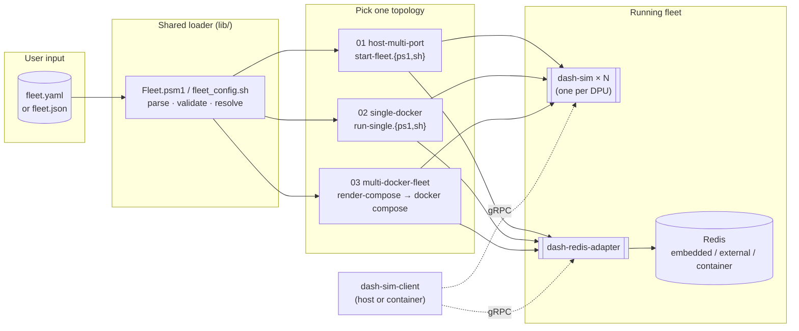
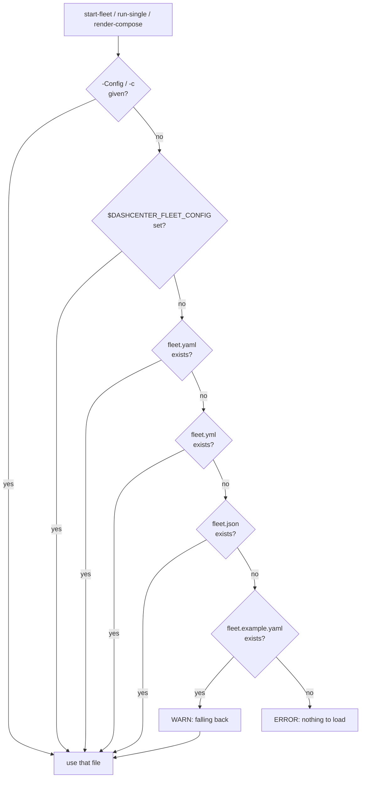
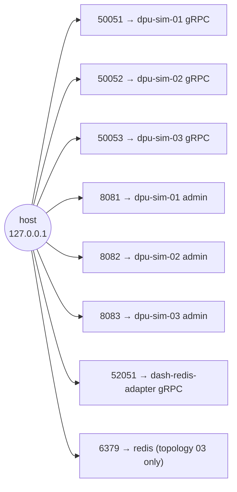

# DashCenter — Multi-DPU Test Infrastructure

Three turnkey topologies for spinning up a DashCenter fleet (multiple
simulated DPUs plus the Redis APP_DB adapter) and driving it with
`dash-sim-client`. **All three are driven by one config file** — pick
your ports, your DPU count, and your redis mode in one place and every
topology uses it.

> **New to DashCenter?** Read
> [docs/tutorial/09-multi-dpu-test-infra.md](../../docs/tutorial/09-multi-dpu-test-infra.md)
> first — it puts this folder in context (what it is, when to pick which
> topology, where it sits in the tutorial sequence). The current page
> is the operator reference; the tutorial is the learning path.

| #  | Topology                                                          | When to use                                              |
|----|-------------------------------------------------------------------|----------------------------------------------------------|
| 01 | [Host, multi-port](01-host-multi-port/README.md) — native procs   | Fastest dev loop — you just ran `go build`.              |
| 02 | [Single docker](02-single-docker/README.md) — one DPU container   | Validating the container image before promoting it.      |
| 03 | [Multi-docker fleet](03-multi-docker-fleet/README.md) — compose   | Multi-DPU integration tests, CI, demo days.              |

> **First time?** Each topology has a **hands-on, step-by-step guide**
> with every command, expected log, and clean-up rescue path —
> beginner-friendly, no prior context assumed:
>
> - [01-host-multi-port/manual-handson.md](01-host-multi-port/manual-handson.md)
> - [02-single-docker/manual-handson.md](02-single-docker/manual-handson.md)
> - [03-multi-docker-fleet/manual-handson.md](03-multi-docker-fleet/manual-handson.md)


## How the pieces fit together

One config file feeds all three topologies, and the same
`dash-sim-client` CLI drives whichever fleet is running.




User-editable inputs live in **`fleet.yaml`** or **`fleet.json`** at this
directory level. Both forms are equivalent — pick by team preference.
The committed reference is [fleet.example.yaml](fleet.example.yaml) /
[fleet.example.json](fleet.example.json). Schema:
[fleet.schema.json](fleet.schema.json).

```yaml
apiVersion: dashcenter.io/test-setup/v1
kind: FleetConfig
defaults:
  scenario:     scenarios/dpu-base.yaml      # paths are POSIX, relative to this file
  imageTag:     dev
  bindHost:     127.0.0.1                    # 0.0.0.0 to expose on LAN
  network:      dashcenter-fleet
  tickInterval: 1s
dpus:
  - { deviceId: dpu-sim-01, grpcPort: 50051, adminPort: 8081 }
  - { deviceId: dpu-sim-02, grpcPort: 50052, adminPort: 8082 }
  - { deviceId: dpu-sim-03, grpcPort: 50053, adminPort: 8083 }
adapter:
  enabled:  true
  grpcPort: 52051
  redis:
    mode:     embedded                       # embedded | external | container
    hostPort: 6379
    address:  localhost:6379
```

### Config resolution order

When you run any topology's start script, it picks the config file using:

1. `-Config <path>` / `-c <path>` on the script.
2. `$env:DASHCENTER_FLEET_CONFIG`.
3. `deploy/test-setup/fleet.yaml`.
4. `deploy/test-setup/fleet.yml`.
5. `deploy/test-setup/fleet.json`.
6. `deploy/test-setup/fleet.example.yaml` (fallback, with a warning).



### Validation

Every start script validates the config before launching anything:

- Non-empty `dpus`.
- Unique `deviceId` values.
- Unique host-side ports across DPUs + adapter + redis container.
- Ports ≥ 1024 (pass `--allow-privileged` / `-AllowPrivilegedPorts` to override).
- `adapter.redis.mode` ∈ `{embedded, external, container}` + companion field present.
- Every `scenario` file exists on disk.

Failures print the field path that's wrong (e.g.
`dpus[1].grpcPort: 50051 conflicts with dpus[0].grpcPort`) and refuse to start.

## Cross-platform support

| Environment                       | Use these scripts |
|-----------------------------------|-------------------|
| Windows + PowerShell 7+           | `*.ps1`           |
| Windows + Windows PowerShell 5.1  | `*.ps1` (JSON config only without `PowerShell-Yaml` module) |
| WSL (any distro)                  | `*.sh`            |
| Linux / macOS native              | `*.sh`            |
| Git-Bash / MSYS on Windows        | `*.sh`            |
| CI                                | matches the runner — same config file |

Both script families read the **same** `fleet.{yaml,json}` and produce
identical results. Cross-platform invariants the tooling enforces:

- Paths in the config are POSIX-style (`scenarios/dpu-base.yaml`).
- All scripts auto-detect the repo root by walking up to find `src/impl-go/go.work`.
- [`.gitattributes`](.gitattributes) pins `*.sh` to LF and `*.ps1` to CRLF so WSL never trips on `\r`.
- `dash-sim` and `dash-redis-adapter` listen on numeric ports identically on all OSes.

### Optional tooling

| Tool                | Required for                                    | Install                                         |
|---------------------|-------------------------------------------------|-------------------------------------------------|
| `jq`                | every `.sh` script                              | bundled on most distros; `winget install jqlang.jq` |
| `yq` (Mike Farah)   | loading YAML config with the `.sh` scripts      | `winget install MikeFarah.yq` / `brew install yq` |
| `PowerShell-Yaml`   | loading YAML config with PS 5.1                 | `Install-Module PowerShell-Yaml -Scope CurrentUser` |
| Docker              | topologies 02 + 03                              | Docker Desktop / `docker.io`                    |

If you only ever use **JSON** config + **PowerShell** (or **JSON** + **bash with jq**), you need zero extra tooling.

## Port plan (default `fleet.example.yaml`)

| Service              | Host port (gRPC) | Admin HTTP | Device ID    |
|----------------------|-----------------:|-----------:|--------------|
| dash-sim #1          | 50051            | 8081       | `dpu-sim-01` |
| dash-sim #2          | 50052            | 8082       | `dpu-sim-02` |
| dash-sim #3          | 50053            | 8083       | `dpu-sim-03` |
| dash-redis-adapter   | 52051            | —          | n/a          |
| redis (topology 03)  | 6379             | —          | —            |



> Windows reserved ports? Run `netsh interface ipv4 show excludedportrange protocol=tcp`,
> then change the offending entry in `fleet.yaml` — no script edits.

## Quick start

```powershell
# 0. (Once) copy the example to a real config and edit if desired.
Copy-Item .\fleet.example.yaml .\fleet.yaml      # or fleet.json
# Edit .\fleet.yaml to taste.

# 1. Pick a topology.
pwsh -File .\01-host-multi-port\start-fleet.ps1                                 # native procs
pwsh -File .\02-single-docker\build-images.ps1
pwsh -File .\02-single-docker\run-single.ps1 -DeviceId dpu-sim-01               # one DPU container
pwsh -File .\lib\render-compose.ps1                                             # generate compose
docker compose -f .\03-multi-docker-fleet\docker-compose.fleet.yaml up -d --build

# 2. Drive with the CLI — same commands work against every topology.
$c = "..\..\src\impl-go\bin\dash-sim-client.exe"
& $c --target 127.0.0.1:50051 ping
& $c --target 127.0.0.1:52051 apply --kind vnet --key vnet-prod --value '{"vni":1001}'
```

Linux / WSL / macOS:

```bash
cp fleet.example.yaml fleet.yaml          # or fleet.json
./01-host-multi-port/start-fleet.sh
./lib/render-compose.sh
docker compose -f 03-multi-docker-fleet/docker-compose.fleet.yaml up -d --build
```

Full operator drill: [cli-walkthrough.md](cli-walkthrough.md).

## Pick a preload scenario

The `defaults.scenario` field in your fleet config selects which YAML
gets preloaded into every `dash-sim` at boot. Three ship in
[scenarios/](scenarios/README.md) — see that page for full per-scenario
docs, including **7 worked `simulate` examples** for the medium scenario
that walk every meaningful packet-pipeline outcome.

| Scenario | Size | Use it when… |
|---|---:|---|
| [`scenarios/dpu-base.yaml`](scenarios/dpu-base.yaml) | ~10 objects | You want a minimal, working snapshot — 1 appliance, 2 vnets, 2 ENIs, 1 ACL/route/mapping. **This is the default.** |
| [`scenarios/dpu-all-kinds.yaml`](scenarios/dpu-all-kinds.yaml) | 30 objects, one of every kind | You want every supported DASH kind populated for **exploration** — `kinds`/`list`/`get` return at least one row for all 29 types. Values are syntactically valid but not packet-pipeline meaningful. |
| [`scenarios/dpu-medium.yaml`](scenarios/dpu-medium.yaml) | ~50 objects | You want a **realistic mid-scale** fleet: 3 vnets, 5 ENIs (one admin-disabled), 3 ACL groups, 2 route groups with multi-prefix LPM (including a surgical /24 hole), 3 vnet_mappings, inbound `route_rule`, QoS/meter scaffolding. See [scenarios/README.md](scenarios/README.md#what-the-medium-scenario-teaches-via-simulate) for the 7 worked simulate examples. |

Full per-scenario walkthroughs, when to use which, and how to write your
own → [**scenarios/README.md**](scenarios/README.md).

Swap by editing `fleet.yaml` / `fleet.json` once — every topology picks
it up. To preload **a different scenario per DPU**, use `dpus[i].scenario`:

```yaml
dpus:
  - { deviceId: dpu-sim-01, grpcPort: 50051, adminPort: 8081, scenario: scenarios/dpu-medium.yaml }
  - { deviceId: dpu-sim-02, grpcPort: 50052, adminPort: 8082 }   # uses defaults.scenario
  - { deviceId: dpu-sim-03, grpcPort: 50053, adminPort: 8083, scenario: scenarios/dpu-all-kinds.yaml }
```

## Layout

```
deploy/test-setup/
├── fleet.example.yaml / .json   ← committed defaults
├── fleet.schema.json            ← JSON Schema (for editor linting)
├── fleet.yaml / fleet.json      ← YOUR config (gitignored)
├── scenarios/                   ← shared DPU preloads (pick via defaults.scenario)
│   ├── README.md                — per-scenario walkthroughs + worked simulate examples
│   ├── dpu-base.yaml            — minimal working snapshot (default)
│   ├── dpu-all-kinds.yaml       — one example of EVERY 29 kinds (explorer)
│   └── dpu-medium.yaml          — realistic mid-scale fleet (multi-vnet, multi-ACL, LPM)
├── lib/                         ← shared loaders + validators
│   ├── Fleet.psm1               (PowerShell)
│   ├── fleet_config.sh          (bash)
│   ├── render-compose.ps1
│   └── render-compose.sh
├── 01-host-multi-port/
│   ├── start-fleet.ps1 / .sh
│   └── stop-fleet.ps1  / .sh
├── 02-single-docker/
│   ├── build-images.ps1 / .sh
│   └── run-single.ps1   / .sh
├── 03-multi-docker-fleet/
│   ├── docker-compose.fleet.yaml.example   ← hand-edit reference (committed)
│   └── docker-compose.fleet.yaml           ← generated (gitignored)
├── cli-walkthrough.md
├── .gitattributes               ← LF for *.sh, CRLF for *.ps1
└── .gitignore
```
