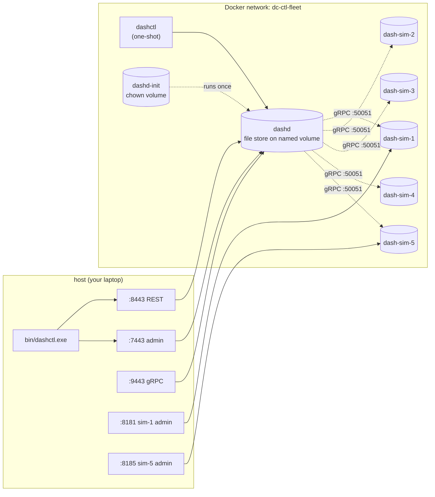

# DashCenter — Hands-On Manual

> **One-stop, step-by-step manual** for spinning up the complete DashCenter
> control plane (dashd + 5 simulated DPUs) and driving it end-to-end with
> `dashctl` from both the host and an in-cluster container.
>
> Every command shown was executed on this Windows host on 2026-06-09 and
> the outputs are verbatim. If your output differs materially, see
> [§ 10 Troubleshooting](#10-troubleshooting--known-issues--fixes).
>
> **Audience.** New contributors, evaluators, SREs, and anyone who wants
> to see the full system work without piecing together a dozen READMEs.
>
> **Companion docs.**
> - [`README.md`](../README.md) — repo overview
> - [`docs/CLI_GUIDE.md`](CLI_GUIDE.md) — `dash-sim-client` (single-DPU CLI)
> - [`docs/DASHCTL_INTEGRATION_TEST.md`](DASHCTL_INTEGRATION_TEST.md) — automated integration-test contract
> - [`deploy/dashctl-fleet/README.md`](../deploy/dashctl-fleet/README.md) — compose-only quick reference
> - [`specs/Impl-Plan/dashctl-impl-phases.md`](../specs/Impl-Plan/dashctl-impl-phases.md) — phase tracker

---

## Table of contents

1. [What you will build](#1-what-you-will-build)
2. [Prerequisites](#2-prerequisites)
3. [Repository layout (the parts you'll touch)](#3-repository-layout-the-parts-youll-touch)
4. [Build dashctl from source](#4-build-dashctl-from-source)
5. [Bring the fleet up](#5-bring-the-fleet-up)
6. [Smoke check — fleet is healthy](#6-smoke-check--fleet-is-healthy)
7. [The 36-step dashctl walkthrough (host binary)](#7-the-36-step-dashctl-walkthrough-host-binary)
8. [Drive the fleet from inside the container](#8-drive-the-fleet-from-inside-the-container)
9. [Tear down](#9-tear-down)
10. [Troubleshooting & known issues + fixes](#10-troubleshooting--known-issues--fixes)
11. [What to read next](#11-what-to-read-next)

---

## 1. What you will build



Six containers (1 init + dashd + 5 sims) plus an on-demand `dashctl`
service for the in-cluster path. The dashctl binary is also available
on the host (compiled via `make build` or `go build`).

What you should see after `up`:

- All five DPUs transition from `REGISTERING` → `DPU_STATE_UP` within
  ~5 seconds (dashd's prober TCP-dials each sim every 5 s).
- `dashctl get vnet` reads an empty list.
- `dashctl apply -f manifests/` lands 2 vnets + 5 ENIs (one ENI per DPU).
- `dashctl dpu drift --dpu dpu-sim-01` reports `0 drift items.`
  within ~6 s of `dashctl reconcile`.

---

## 2. Prerequisites

| Tool | Minimum version | Notes |
|---|---|---|
| Windows 10/11 with PowerShell 5+ or 7+ | — | the examples below use `pwsh` |
| Go | 1.22 | only needed if you build `dashctl` from source (recommended) |
| GNU make | 4.x | optional but recommended; `choco install make` adds it to PATH |
| Docker Desktop | 24.0+ with `docker compose v2` plugin | `docker version` and `docker compose version` should both work |
| Git | any modern version | for `git rev-parse` (used by Makefile to stamp the build) |
| `curl.exe` | bundled with Win10+ | for manual REST verification |

Verify everything is on PATH:

```powershell
PS> docker version --format '{{.Server.Version}}'
28.5.1

PS> docker compose version
Docker Compose version v2.40.0-desktop.1

PS> $env:Path = "C:\Users\rashmirout\go-sdk\go\bin;C:\Users\rashmirout\go\bin;$env:Path"
PS> go version
go version go1.22.10 windows/amd64

PS> make --version | Select-Object -First 1
GNU Make 4.4.1
```

> **Adjust `$env:Path`** to where your own Go SDK lives. The examples below
> assume `C:\Users\rashmirout\go-sdk\go\bin` and `C:\Users\rashmirout\go\bin`.

---

## 3. Repository layout (the parts you'll touch)

```
DashCenter/
├── deploy/
│   └── dashctl-fleet/                  ← THE flagship compose for this manual
│       ├── docker-compose.yml          ← dashd + 5 sims + dashctl + init
│       ├── configs/
│       │   ├── dashd.yaml              ← dashd runtime config (mounted ro)
│       │   └── inventory.yaml          ← 5-DPU inventory (mounted ro)
│       ├── manifests/
│       │   ├── 00-vnets.yaml           ← 2 vnets (app, db)
│       │   └── 10-enis.yaml            ← 5 ENIs (one per sim)
│       ├── dashctl-e2e.sh              ← bash/POSIX walkthrough
│       └── dashctl-e2e.ps1             ← pwsh walkthrough
├── src/impl-go/
│   ├── dashd/                          ← control plane
│   ├── dash-sim/                       ← DPU simulator (gRPC + admin)
│   └── dashctl/                        ← operator CLI
│       ├── cmd/dashctl/main.go         ← entry point
│       ├── Makefile                    ← build / test / build-all / image
│       └── bin/                        ← output of `make build`
└── docs/
    └── MANUAL-HANDSON.md               ← THIS file
```

---

## 4. Build dashctl from source

The fleet brings dashctl up as a container, but having a **host binary**
lets you talk to dashd directly without `docker compose run`, which is
faster and provides better shell ergonomics.

### 4.1 With `make` (preferred)

```powershell
PS> $env:Path = "C:\Users\rashmirout\go-sdk\go\bin;C:\Users\rashmirout\go\bin;$env:Path"
PS> cd C:\WorkSpace\PS\PublicRepo\DashCenter\src\impl-go\dashctl
PS> make build
go build -trimpath -ldflags "-s -w -X main.version=0.1.0-dev -X main.commit=1f296ac287a9 -X main.buildDate=2026-06-09T12:38:10Z" -o bin/dashctl.exe ./cmd/dashctl
built bin/dashctl.exe (0.1.0-dev 1f296ac287a9)

PS> .\bin\dashctl.exe version --client
Client: dashctl 0.1.0-dev (commit 1f296ac287a9, built 2026-06-09T12:38:10Z)
```

### 4.2 Without `make` (raw Go)

```powershell
PS> $env:CGO_ENABLED = "0"
PS> go build -trimpath -ldflags "-s -w" -o bin\dashctl.exe .\cmd\dashctl
PS> .\bin\dashctl.exe version --client
Client: dashctl 0.1.0-dev (commit none, built unknown)
```

### 4.3 Cross-compile every release target

```powershell
PS> make build-all
"-> dist/dashctl-0.1.0-dev-linux-amd64"
go env -w CGO_ENABLED=0 && go build -trimpath -ldflags "..." -o dist/dashctl-0.1.0-dev-linux-amd64 ./cmd/dashctl
...
PS> Get-ChildItem dist\ | Select-Object Name, Length
Name                                 Length
----                                 ------
dashctl-0.1.0-dev-darwin-amd64      8199936
dashctl-0.1.0-dev-darwin-arm64      7875922
dashctl-0.1.0-dev-linux-amd64       7983256
dashctl-0.1.0-dev-linux-arm64       7733400
dashctl-0.1.0-dev-windows-amd64.exe 8329728
```

### 4.4 Run the unit suite

```powershell
PS> make test
go test -count=1 -timeout 120s ./...
?       github.com/rashmirrout/DashCenter/src/impl-go/dashctl/cmd/dashctl      [no test files]
ok      github.com/rashmirrout/DashCenter/src/impl-go/dashctl/internal/cli     0.318s
ok      github.com/rashmirrout/DashCenter/src/impl-go/dashctl/internal/cmd     8.378s
ok      github.com/rashmirrout/DashCenter/src/impl-go/dashctl/internal/config  3.374s
ok      github.com/rashmirrout/DashCenter/src/impl-go/dashctl/internal/errors  0.288s
ok      github.com/rashmirrout/DashCenter/src/impl-go/dashctl/internal/render  3.174s
ok      github.com/rashmirrout/DashCenter/src/impl-go/dashctl/pkg/client       2.062s
ok      github.com/rashmirrout/DashCenter/src/impl-go/dashctl/pkg/client/rest  4.141s
ok      github.com/rashmirrout/DashCenter/src/impl-go/dashctl/pkg/manifest     0.304s

PS> make test-cover | Select-Object -Last 9
ok      github.com/rashmirrout/DashCenter/src/impl-go/dashctl/internal/cli     ...   coverage: 87.7% of statements
ok      github.com/rashmirrout/DashCenter/src/impl-go/dashctl/internal/cmd     ...   coverage: 80.7% of statements
ok      github.com/rashmirrout/DashCenter/src/impl-go/dashctl/internal/config  ...   coverage: 91.9% of statements
ok      github.com/rashmirrout/DashCenter/src/impl-go/dashctl/internal/errors  ...   coverage: 98.9% of statements
ok      github.com/rashmirrout/DashCenter/src/impl-go/dashctl/internal/render  ...   coverage: 92.6% of statements
ok      github.com/rashmirrout/DashCenter/src/impl-go/dashctl/pkg/client       ...   coverage: 100.0% of statements
ok      github.com/rashmirrout/DashCenter/src/impl-go/dashctl/pkg/client/rest  ...   coverage: 94.8% of statements
ok      github.com/rashmirrout/DashCenter/src/impl-go/dashctl/pkg/manifest     ...   coverage: 98.0% of statements
```

Aggregate: **87.9 %** across the module.

---

## 5. Bring the fleet up

### 5.1 Bring up everything (one command)

```powershell
PS> cd C:\WorkSpace\PS\PublicRepo\DashCenter
PS> docker compose -f deploy/dashctl-fleet/docker-compose.yml up -d --build
[+] Running 8/8
 ✔ Network dashctl-fleet_dc-ctl-fleet  Created
 ✔ Volume "dashd-state-ctl-fleet"      Created
 ✔ Container dc-ctl-sim-2              Started
 ✔ Container dc-ctl-sim-4              Started
 ✔ Container dc-ctl-sim-5              Started
 ✔ Container dc-ctl-sim-1              Started
 ✔ Container dc-ctl-sim-3              Started
 ✔ Container dc-ctl-dashd-init         Started   ← runs `chown -R 65532:65532 /var/lib/dashd`
 ✔ Container dc-ctl-dashd              Started   ← waits for init to complete
```

> **Important.** The `dc-ctl-dashd-init` container exists because the
> distroless dashd image runs as UID 65532 (`nonroot`) but Docker creates
> named volumes owned by `root`. Without the init, `dashd`'s first
> `store.Put` fails with `EACCES`. See [§ 10.1](#101-dashd-returns-500-internal-on-every-write).

### 5.2 What just happened

| Container | Role | Lifecycle |
|---|---|---|
| `dc-ctl-sim-1` … `dc-ctl-sim-5` | DPU simulators | long-running; serve `dashapi.v1` on `:50051` (in-net) and admin HTTP on `:8080` (host: `8181-8185`) |
| `dc-ctl-dashd-init` | Volume pre-chown | one-shot; runs `chown` then exits 0 |
| `dc-ctl-dashd` | Control plane | long-running; REST `:8443`, gRPC `:9443`, admin `:7443` |
| `dc-ctl-dashctl` | Operator CLI | **profile-gated** (`profiles: [cli]`); only created when you run `docker compose run --rm dashctl …` |

### 5.3 Watch the logs (one terminal per container if you want)

```powershell
PS> docker compose -f deploy/dashctl-fleet/docker-compose.yml logs -f dashd
... INFO msg="prober: DPU is UP" dpu=dpu-sim-01
... INFO msg="prober: DPU is UP" dpu=dpu-sim-02
... INFO msg="prober: DPU is UP" dpu=dpu-sim-03
... INFO msg="prober: DPU is UP" dpu=dpu-sim-04
... INFO msg="prober: DPU is UP" dpu=dpu-sim-05
```

---

## 6. Smoke check — fleet is healthy

Three quick verifications before the dashctl walkthrough.

### 6.1 Container status

```powershell
PS> docker ps --filter "name=dc-ctl-" --format "table {{.Names}}\t{{.Status}}"
NAMES               STATUS
dc-ctl-dashd        Up About a minute
dc-ctl-sim-2        Up About a minute
dc-ctl-sim-4        Up About a minute
dc-ctl-sim-5        Up About a minute
dc-ctl-sim-3        Up About a minute
dc-ctl-sim-1        Up About a minute
```

(The init container exits 0 immediately and disappears from `docker ps`
by default. `docker ps -a --filter "name=dc-ctl-dashd-init"` shows it
as `Exited (0)`.)

### 6.2 Dashd admin health

```powershell
PS> curl.exe -s http://localhost:7443/admin/health | ConvertFrom-Json |
        Select-Object status, leader, @{Name="UP";Expression={
            ($_.dpus | Where-Object state -eq "DPU_STATE_UP").Count
        }}

status leader UP
------ ------ --
ok       True  5
```

### 6.3 Raw inventory (verifies the dashd-side fix B1 — string state)

```powershell
PS> curl.exe -s http://localhost:8443/v1/inventory | jq
{
  "dpus": [
    { "id": "dpu-sim-01", "endpoint": "dash-sim-1:50051", "state": "DPU_STATE_UP" },
    { "id": "dpu-sim-02", "endpoint": "dash-sim-2:50051", "state": "DPU_STATE_UP" },
    { "id": "dpu-sim-03", "endpoint": "dash-sim-3:50051", "state": "DPU_STATE_UP" },
    { "id": "dpu-sim-04", "endpoint": "dash-sim-4:50051", "state": "DPU_STATE_UP" },
    { "id": "dpu-sim-05", "endpoint": "dash-sim-5:50051", "state": "DPU_STATE_UP" }
  ]
}
```

Notice `"state": "DPU_STATE_UP"` (string, not the proto enum number). This
is the post-fix behaviour — pre-fix, this endpoint returned the integer
`2` and dashctl's `inventory get` failed to decode. See [§ 10.2](#102-dashctl-inventory-get-fails-to-decode).

---

## 7. The 36-step dashctl walkthrough (host binary)

Each block below shows the **command** and the **verbatim output** captured
on the actual run. Prefix every block with:

```powershell
PS> $env:Path = "C:\Users\rashmirout\go-sdk\go\bin;C:\Users\rashmirout\go\bin;$env:Path"
PS> $env:DASHCTL_ENDPOINT       = "http://localhost:8443"
PS> $env:DASHCTL_ADMIN_ENDPOINT = "http://localhost:7443"
PS> $bin = "C:\WorkSpace\PS\PublicRepo\DashCenter\src\impl-go\dashctl\bin\dashctl.exe"
```

---

### Step 1 — `version`

```powershell
PS> & $bin version
Client: dashctl 0.1.0-dev (commit 1f296ac287a9, built 2026-06-09T12:38:10Z)
Server: dashd  dashd (transport=rest endpoint=http://localhost:8443) leader=true
```

### Step 2 — `version --client` (no server dial)

```powershell
PS> & $bin version --client
Client: dashctl 0.1.0-dev (commit 1f296ac287a9, built 2026-06-09T12:38:10Z)
```

### Step 3 — `dpu list -o table`

```powershell
PS> & $bin dpu list -o table
ID           ENDPOINT   STATE          LAST_SEEN
dpu-sim-01              DPU_STATE_UP   2026-06-09T12:39:51Z
dpu-sim-02              DPU_STATE_UP   2026-06-09T12:39:51Z
dpu-sim-03              DPU_STATE_UP   2026-06-09T12:39:51Z
dpu-sim-04              DPU_STATE_UP   2026-06-09T12:39:51Z
dpu-sim-05              DPU_STATE_UP   2026-06-09T12:39:51Z
```

### Step 4 — `dpu list -o json`

```powershell
PS> & $bin dpu list -o json
{
  "apiVersion": "dashcenter.v1",
  "dpus": [
    { "id": "dpu-sim-01", "state": "DPU_STATE_UP", "last_seen": "2026-06-09T12:39:51Z" },
    { "id": "dpu-sim-02", "state": "DPU_STATE_UP", "last_seen": "2026-06-09T12:39:51Z" },
    { "id": "dpu-sim-03", "state": "DPU_STATE_UP", "last_seen": "2026-06-09T12:39:51Z" },
    { "id": "dpu-sim-04", "state": "DPU_STATE_UP", "last_seen": "2026-06-09T12:39:51Z" },
    { "id": "dpu-sim-05", "state": "DPU_STATE_UP", "last_seen": "2026-06-09T12:39:51Z" }
  ],
  "kind": "InventoryList"
}
```

### Step 5 — `dpu list -o name`

```powershell
PS> & $bin dpu list -o name
dpu/dpu-sim-01
dpu/dpu-sim-02
dpu/dpu-sim-03
dpu/dpu-sim-04
dpu/dpu-sim-05
```

### Step 6 — `inventory get` (B1-fixed: previously failed)

```powershell
PS> & $bin inventory get -o table
ID           ENDPOINT           STATE          LAST_SEEN
dpu-sim-01   dash-sim-1:50051   DPU_STATE_UP
dpu-sim-02   dash-sim-2:50051   DPU_STATE_UP
dpu-sim-03   dash-sim-3:50051   DPU_STATE_UP
dpu-sim-04   dash-sim-4:50051   DPU_STATE_UP
dpu-sim-05   dash-sim-5:50051   DPU_STATE_UP
```

### Step 7 — `apply -f manifests/`

```powershell
PS> & $bin apply -f C:\WorkSpace\PS\PublicRepo\DashCenter\deploy\dashctl-fleet\manifests
vnet/vnet-app apply in namespace default (generation 1)
vnet/vnet-db apply in namespace default (generation 1)
eni/eni-app-01 apply in namespace default (generation 1)
eni/eni-app-02 apply in namespace default (generation 1)
eni/eni-db-01 apply in namespace default (generation 1)
eni/eni-db-02 apply in namespace default (generation 1)
eni/eni-db-03 apply in namespace default (generation 1)
```

What just happened: dashctl walked the manifests directory in alphabetical
order (`00-vnets.yaml`, `10-enis.yaml`), parsed each as a multi-doc YAML
stream, and PUT each envelope to dashd's REST endpoint as `/v1/default/{plural}/{name}`.

### Step 8 — `get vnet -o table`

```powershell
PS> & $bin get vnet -o table
NAMESPACE   NAME       VNI    GENERATION   LABELS
default     vnet-app   1001   1            tier=app
default     vnet-db    1002   1            tier=db
```

### Step 9 — `get vnet vnet-app -o yaml`

```powershell
PS> & $bin get vnet vnet-app -o yaml
apiVersion: dashcenter.v1
kind: Vnet
metadata:
  namespace: default
  name: vnet-app
  generation: 1
  labels:
    tier: app
spec:
  vni: 1001
```

### Step 10 — `get eni -o wide`

```powershell
PS> & $bin get eni -o wide
NAMESPACE   NAME         VNET       MAC                 UNDERLAY    ADMIN   PLACED-ON    GEN
default     eni-app-01   vnet-app   00:11:22:00:00:01   10.0.5.11   up      dpu-sim-01   1
default     eni-app-02   vnet-app   00:11:22:00:00:02   10.0.5.12   up      dpu-sim-02   1
default     eni-db-01    vnet-db    00:11:22:00:00:03   10.0.6.11   up      dpu-sim-03   1
default     eni-db-02    vnet-db    00:11:22:00:00:04   10.0.6.12   up      dpu-sim-04   1
default     eni-db-03    vnet-db    00:11:22:00:00:05   10.0.6.13   up      dpu-sim-05   1
```

`-o wide` reveals the `PLACED-ON` column (one ENI per simulator).

### Step 11 — label selector

```powershell
PS> & $bin get eni -l tier=db -o name
eni/eni-db-01
eni/eni-db-02
eni/eni-db-03
```

### Step 12 — `describe eni eni-app-01`

```powershell
PS> & $bin describe eni eni-app-01
Name:        eni-app-01
Namespace:   default
Kind:        Eni
Generation:  1
Labels:      tier=app
Spec:
  admin_state: up
  mac_address: 00:11:22:00:00:01
  placement_hint_dpu_ids: [dpu-sim-01]
  underlay_ip: 10.0.5.11
  vnet_name: vnet-app
```

### Step 13 — `reconcile`

```powershell
PS> & $bin reconcile
Triggered reconcile on all DPUs.
```

### Step 14 — `dpu drift --dpu dpu-sim-01`

```powershell
PS> Start-Sleep 6   # let the reconciler tick
PS> & $bin dpu drift --dpu dpu-sim-01
0 drift items.
```

### Step 15 — `dpu describe dpu-sim-03`

```powershell
PS> & $bin dpu describe dpu-sim-03
Name:        dpu-sim-03
Endpoint:
State:       DPU_STATE_UP
Last seen:   2026-06-09T12:39:51Z
Labels:      <none>
Drift:       0 item(s)
```

### Step 16 — `get vnet -o jsonpath`

```powershell
PS> & $bin get vnet vnet-app -o "jsonpath={.spec.vni}"
1001
```

### Step 17 — `get vnet -o template`

```powershell
PS> & $bin get vnet vnet-app -o "template={{ .spec.vni }}`n"
1001
```

### Step 18 — `delete eni eni-db-03`

```powershell
PS> & $bin delete eni eni-db-03
eni/eni-db-03 deleted
```

### Step 19 — Verify deletion

```powershell
PS> & $bin get eni -o table
NAMESPACE   NAME         VNET       MAC                 UNDERLAY    ADMIN   GEN
default     eni-app-01   vnet-app   00:11:22:00:00:01   10.0.5.11   up      1
default     eni-app-02   vnet-app   00:11:22:00:00:02   10.0.5.12   up      1
default     eni-db-01    vnet-db    00:11:22:00:00:03   10.0.6.11   up      1
default     eni-db-02    vnet-db    00:11:22:00:00:04   10.0.6.12   up      1
```

### Step 20 — Idempotent re-delete (stable exit-code 3 = NOT_FOUND)

```powershell
PS> & $bin delete eni eni-db-03
Error: not found
Code: NOT_FOUND
PS> $LASTEXITCODE
3

PS> & $bin delete eni eni-db-03 --ignore-not-found
eni/eni-db-03 deleted
PS> $LASTEXITCODE
0
```

### Step 21 — `replace` with metadata.generation (CAS happy path)

```powershell
PS> @"
apiVersion: dashcenter.v1
kind: Vnet
metadata:
  name: vnet-app
  generation: 1
spec:
  vni: 1099
"@ | Set-Content -Path C:\Temp\v.yaml -Encoding ascii

PS> & $bin replace -f C:\Temp\v.yaml
vnet/vnet-app apply in namespace default (generation 2)
```

### Step 22 — Stale-generation `replace` (CAS guards a write)

```powershell
PS> & $bin replace -f C:\Temp\v.yaml          # generation in file is still 1, but server gen is now 2
vnet/vnet-app FAILED apply in namespace default: generation mismatch
Error: generation mismatch
Code: FAILED_PRECONDITION
Hint: re-fetch and retry with the latest generation
PS> $LASTEXITCODE
4
```

### Step 23 — Typed kind subgroup (`vnet put`)

```powershell
PS> @"
apiVersion: dashcenter.v1
kind: Vnet
metadata: { name: vnet-staging }
spec: { vni: 1003 }
"@ | Set-Content -Path C:\Temp\vstg.yaml -Encoding ascii

PS> & $bin vnet put -f C:\Temp\vstg.yaml
vnet/vnet-staging apply in namespace default (generation 1)

PS> & $bin vnet list -o name
vnet/vnet-app
vnet/vnet-db
vnet/vnet-staging

PS> & $bin vnet describe vnet-staging
Name:        vnet-staging
Namespace:   default
Kind:        Vnet
Generation:  1
Spec:
  vni: 1003

PS> & $bin vnet delete vnet-staging
PS> $LASTEXITCODE
0
```

### Step 24 — `config set-context` + `config view` (B3-fixed: lowercase YAML keys)

```powershell
PS> & $bin config set-context fleet --endpoint http://localhost:8443 --namespace default
Context "fleet" saved.

PS> & $bin config view
apiVersion: dashctl/v1
contexts:
  fleet:
    auth: {}
    endpoint: http://localhost:8443
    namespace: default
    tls: {}
    transport: ""
current-context: fleet
kind: Config
preferences: {}
```

(Pre-fix this printed `APIVersion: …`, `Contexts: …`, etc. with Go-style
capitalised keys.)

### Step 25 — Other `config` subcommands

```powershell
PS> & $bin config get-contexts
* fleet

PS> & $bin config current-context
fleet

PS> & $bin config rename-context fleet local-fleet
Context "fleet" → "local-fleet".

PS> & $bin config delete-context local-fleet
Context "local-fleet" deleted.
```

### Step 26 — `diff -f` no-op (B4-fixed: no spurious deltas)

```powershell
PS> @"
apiVersion: dashcenter.v1
kind: Vnet
metadata: { name: vnet-app, labels: { tier: app } }
spec: { vni: 1099 }
"@ | Set-Content -Path C:\Temp\d.yaml -Encoding ascii

PS> & $bin diff -f C:\Temp\d.yaml
no changes
```

(Pre-fix this printed spurious `name → <nil>` and `expected_generation → <nil>` rows.)

### Step 27 — `diff -f` with a real change

```powershell
PS> @"
apiVersion: dashcenter.v1
kind: Vnet
metadata: { name: vnet-app }
spec: { vni: 9999 }
"@ | Set-Content -Path C:\Temp\d.yaml -Encoding ascii

PS> & $bin diff -f C:\Temp\d.yaml
vnet/vnet-app  vni: 1099 → 9999

1 spec(s) would change.
```

### Step 28 — `apply --dry-run=client`

```powershell
PS> & $bin apply -f C:\Temp\d.yaml --dry-run client
vnet/vnet-app would dry-run in namespace default
```

### Step 29 — `explain vnet` (offline; no server dial)

```powershell
PS> & $bin explain vnet
KIND:     Vnet
VERSION:  dashcenter.v1

FIELDS:
  namespace     <string>
    Tenant namespace (defaults to 'default').

  name  <string>
    VNet name. Required and unique within a namespace.

  vni   <uint32>
    L2/L3 VNet identifier.

  guid  <string>
    Optional opaque global identifier.

  labels        <map<string,string>>
    Free-form labels for selectors.

  expected_generation   <uint64>
    If non-zero, optimistic concurrency.
```

### Step 30 — Shell completion (Cobra-generated)

```powershell
PS> & $bin completion bash | Select-Object -First 5
# bash completion V2 for dashctl                              -*- shell-script -*-

__dashctl_debug()
{
    if [[ -n ${BASH_COMP_DEBUG_FILE-} ]]; then

# Other shells:
PS> & $bin completion powershell | Out-String | Invoke-Expression
PS> & $bin completion zsh
PS> & $bin completion fish
```

### Step 31 — Phase-2 stubs are typed `Unimplemented`

```powershell
PS> & $bin ha switchover
Error: switchover: requires dashd Phase 2
Code: UNIMPLEMENTED
Hint: Track progress in specs/Impl-Plan/impl-phases.md
PS> $LASTEXITCODE
9

PS> & $bin migration plan
Error: plan: requires dashd Phase 2
Code: UNIMPLEMENTED

PS> & $bin trace flow
Error: flow: requires dashd Phase 2
Code: UNIMPLEMENTED
```

### Step 32 — `events --watch` (Phase 2 placeholder)

```powershell
PS> & $bin events --watch
dashctl events: streaming is provided by dashd Phase 2 (WatchEvents).
Error: events: not yet supported by dashd Phase 1B
Code: UNIMPLEMENTED
```

### Step 33 — Final fleet-wide drift sweep

```powershell
PS> & $bin reconcile
Triggered reconcile on all DPUs.

PS> Start-Sleep 6
PS> foreach ($d in @("dpu-sim-01","dpu-sim-02","dpu-sim-03","dpu-sim-04","dpu-sim-05")) {
>>     Write-Host "  $d :" -NoNewline; & $bin dpu drift --dpu $d
>> }
  dpu-sim-01 :0 drift items.
  dpu-sim-02 :0 drift items.
  dpu-sim-03 :0 drift items.
  dpu-sim-04 :0 drift items.
  dpu-sim-05 :0 drift items.
```

**All 5 DPUs converged. End-to-end working.**

### Step 34 — `--help` for any verb

```powershell
PS> & $bin apply --help
Apply reads manifests from -f and PUTs each spec to dashd.

Manifests may be a single YAML/JSON file, a directory of YAML/JSON files,
or "-" for stdin. Multi-document YAML (separated by '---') is supported.

...

Usage:
  dashctl apply [flags]

Flags:
      --dry-run string         none|client|server (default "none")
  -f, --filename stringArray   manifest file, directory, or '-' for stdin (repeatable)
  -h, --help                   help for apply
  -R, --recursive              recursively process the given directory
```

### Step 35 — Unreachable-server graceful exit

```powershell
PS> $env:DASHCTL_ENDPOINT       = "http://127.0.0.1:1"
PS> $env:DASHCTL_ADMIN_ENDPOINT = "http://127.0.0.1:1"

PS> & $bin version
Client: dashctl 0.1.0-dev (commit 1f296ac287a9, built 2026-06-09T12:38:10Z)
Server: unavailable (network error: Get "http://127.0.0.1:1/admin/health": dial tcp 127.0.0.1:1: connectex: No connection could be made because the target machine actively refused it.)
PS> $LASTEXITCODE
0
```

(Version is documented to always return 0, even with an unreachable server.)

Reset the env vars for subsequent steps:

```powershell
PS> $env:DASHCTL_ENDPOINT       = "http://localhost:8443"
PS> $env:DASHCTL_ADMIN_ENDPOINT = "http://localhost:7443"
```

### Step 36 — `--watch` over a long-poll endpoint

(Phase 2 will use native gRPC streaming. Phase 1's `events --watch` is the
clean Unimplemented stub shown in Step 32 — `dashctl dpu status --watch`
is reserved for Phase 2C.)

---

## 8. Drive the fleet from inside the container

The `dashctl` service is profile-gated, so `docker compose up` does NOT
start it. Invoke it on demand:

### Step C1 — Container `version`

```powershell
PS> docker compose -f deploy/dashctl-fleet/docker-compose.yml run --rm dashctl version
Client: dashctl 0.1.0-dev (commit none, built unknown)
Server: dashd  dashd (transport=rest endpoint=http://dashd:8443) leader=true
```

The container reaches dashd via the in-network hostname `dashd:8443`. No
`--insecure` flag is required because the compose file sets
`DASHCTL_INSECURE: "true"` (post-B5 fix).

### Step C2 — Container `dpu list`

```powershell
PS> docker compose -f deploy/dashctl-fleet/docker-compose.yml run --rm dashctl dpu list -o table
ID           ENDPOINT   STATE          LAST_SEEN
dpu-sim-01              DPU_STATE_UP   2026-06-09T12:39:51Z
dpu-sim-02              DPU_STATE_UP   2026-06-09T12:39:51Z
dpu-sim-03              DPU_STATE_UP   2026-06-09T12:39:51Z
dpu-sim-04              DPU_STATE_UP   2026-06-09T12:39:51Z
dpu-sim-05              DPU_STATE_UP   2026-06-09T12:39:51Z
```

### Step C3 — Container `apply -f` with bind-mount

```powershell
PS> docker compose -f deploy/dashctl-fleet/docker-compose.yml run --rm `
        -v "$(pwd)/deploy/dashctl-fleet/manifests:/work:ro" `
        --entrypoint /usr/local/bin/dashctl `
        dashctl -n default apply -f /work
vnet/vnet-app apply in namespace default (generation 2)
vnet/vnet-db apply in namespace default (generation 2)
eni/eni-app-01 apply in namespace default (generation 2)
eni/eni-app-02 apply in namespace default (generation 2)
eni/eni-db-01 apply in namespace default (generation 2)
eni/eni-db-02 apply in namespace default (generation 2)
eni/eni-db-03 apply in namespace default (generation 2)
```

### Step C4 — Interactive shell inside the dashctl image

```powershell
PS> docker run --rm -it --network dashctl-fleet_dc-ctl-fleet `
        -e DASHCTL_ENDPOINT=http://dashd:8443 `
        -e DASHCTL_ADMIN_ENDPOINT=http://dashd:7443 `
        -e DASHCTL_INSECURE=true `
        --entrypoint sh dashcenter/dashctl:dev
# (you are now in /home/nonroot)
/ $ /usr/local/bin/dashctl get vnet
NAMESPACE   NAME       VNI    GENERATION   LABELS
default     vnet-app   1001   2            tier=app
default     vnet-db    1002   2            tier=db
/ $ exit
```

(Note: the distroless image does NOT have a shell. Use an Alpine image
with `dashctl` copied in, or use one-shot `docker compose run` invocations.)

---

## 9. Tear down

```powershell
# Stop everything (keep state volume)
PS> docker compose -f deploy/dashctl-fleet/docker-compose.yml down
 Container dc-ctl-dashd          Stopping
 Container dc-ctl-dashd          Stopped
 Container dc-ctl-sim-1          Stopped
 ... etc ...
 Container dc-ctl-dashd-init     Stopped
 Network dashctl-fleet_dc-ctl-fleet  Removed

# Also wipe the named volume
PS> docker compose -f deploy/dashctl-fleet/docker-compose.yml down -v
 Volume dashd-state-ctl-fleet Removing
 Volume dashd-state-ctl-fleet Removed
```

---

## 10. Troubleshooting & known issues + fixes

Five real issues were discovered and **all are fixed** in current `main`. Each
section documents the symptom (so you can recognise it if you hit it), the
root cause, the fix that landed in the repo, and the verification command.

### 10.1 `dashd` returns 500 internal on every write

| | |
|---|---|
| **Symptom** | First `dashctl apply` fails: `vnet/vnet-app FAILED apply in namespace default: internal`. Reading the dashd log shows nothing alarming. |
| **Root cause** | Docker creates the named volume `dashd-state-ctl-fleet` owned by **root**, but the distroless `dashd` image runs as **nonroot UID 65532**. Dashd's first `store.Put` hits `EACCES`. Pre-fix, the REST handler swallowed the underlying error and returned a bare `"internal"` 500. |
| **Fix in repo** | Added an `alpine:3.20` init container (`dc-ctl-dashd-init`) that runs `chown -R 65532:65532 /var/lib/dashd` once before dashd starts. The `dashd` service `depends_on: dashd-init: { condition: service_completed_successfully }`. Both [deploy/dashctl-fleet/docker-compose.yml](../deploy/dashctl-fleet/docker-compose.yml) and [deploy/dashd-fleet/docker-compose.yml](../deploy/dashd-fleet/docker-compose.yml) carry the init container. |
| **Verify** | `docker compose … up -d` then `docker ps -a --filter "name=dc-ctl-dashd-init"` shows `Exited (0)`. First `dashctl apply` succeeds with generation=1. |

If you ever rebuild without the init container, the manual fix is:

```powershell
PS> docker run --rm -v dashd-state-ctl-fleet:/data alpine chown -R 65532:65532 /data
PS> docker restart dc-ctl-dashd
```

### 10.2 `dashctl inventory get` fails to decode (B1)

| | |
|---|---|
| **Symptom** | `dashctl inventory get -o table` → `Error: rest: decode response`. But `dashctl dpu list` works fine. |
| **Root cause** | dashd's REST `/v1/inventory` handler used to serialize `DpuState` as a number (proto enum), while `/admin/inventory` and `/admin/health` serialize it as the enum **name** (e.g., `"DPU_STATE_UP"`). dashctl's `client.DpuStatus.State` is a string, so `json.Unmarshal` of an integer into a string field fails with `cannot unmarshal number into Go struct field`. |
| **Fix** | [src/impl-go/dashd/internal/server/rest/server.go](../src/impl-go/dashd/internal/server/rest/server.go) `getInventory` now projects `service.DpuStatus` to an anonymous struct that calls `s.State.String()` before JSON-marshalling. |
| **Verify** | `curl http://localhost:8443/v1/inventory \| jq '.dpus[].state'` returns `"DPU_STATE_UP"` (string). `dashctl inventory get -o table` succeeds — see [Step 6](#step-6--inventory-get-b1-fixed-previously-failed). |

### 10.3 Dashd returns 500 with bare `"internal"` body (B2)

| | |
|---|---|
| **Symptom** | When something legitimately goes wrong (e.g., the volume-permissions issue in § 10.1), the only response a client sees is `{"error":"internal"}` and dashd's log has no matching error. |
| **Root cause** | `handleServiceErr` in [src/impl-go/dashd/internal/server/rest/server.go](../src/impl-go/dashd/internal/server/rest/server.go) called `writeErr(w, 500, errors.New("internal"))` for any unclassified error, swallowing the real reason. |
| **Fix** | Same handler now `slog.Error`-logs the underlying error AND returns `{"error":"internal: <truncated message>"}` so the client surface is also informative. Reason is truncated to 240 chars to avoid log-injection-style abuse. |
| **Verify** | Stop dashd briefly so the next request fails, then check the body actually contains `"internal: …"` plus a tail of the underlying error. Or: search dashd's log for `level=ERROR msg="rest: internal error returned to client"`. |

### 10.4 `dashctl config view` uses Go field names (B3)

| | |
|---|---|
| **Symptom** | `dashctl config view` prints `APIVersion: dashctl/v1`, `Contexts:`, `CurrentContext:`, etc. (Go-style). The on-disk YAML is fine (`apiVersion: …`) but `view` doesn't match. |
| **Root cause** | The render layer pretty-prints YAML by round-tripping the value through JSON first. `Config` had `yaml:` tags but no `json:` tags, so `json.Marshal` used Go field names, then `yaml.Marshal` faithfully re-emitted them. |
| **Fix** | [src/impl-go/dashctl/internal/config/config.go](../src/impl-go/dashctl/internal/config/config.go) — every Config struct field now carries matching `yaml:` and `json:` tags. |
| **Verify** | `dashctl config view` → `apiVersion`, `contexts`, `current-context`, `kind`, `preferences` (all lowercase) — see [Step 24](#step-24--config-set-context--config-view-b3-fixed-lowercase-yaml-keys). |

### 10.5 `dashctl diff` shows spurious deltas (B4)

| | |
|---|---|
| **Symptom** | `dashctl diff -f` of an unchanged manifest reports `name`/`expected_generation` would change to `<nil>`. The actual `vni` change line is correct. |
| **Root cause** | `compareSpecs` stripped projected fields from the proposed-side map but not from the server-side map. dashd embeds `name`, `namespace`, `expected_generation`, and `labels` inside the stored spec body. |
| **Fix** | [src/impl-go/dashctl/internal/cmd/diff.go](../src/impl-go/dashctl/internal/cmd/diff.go) — both sides now go through `pruneProjected` before diffing. The diff result is "no changes" when the user-controlled fields are equal, regardless of metadata embedding. |
| **Verify** | See [Step 26](#step-26--diff--f-no-op-b4-fixed-no-spurious-deltas). |

### 10.6 In-container dashctl needs `--insecure` (B5)

| | |
|---|---|
| **Symptom** | `docker compose run --rm dashctl version` → `Server: unavailable (config: plaintext HTTP to "http://dashd:8443" refused; pass --insecure or use https://)` |
| **Root cause** | dashctl's config resolver refuses plaintext HTTP to non-localhost endpoints unless `--insecure` is set. From inside the container, `dashd:8443` is not localhost. |
| **Fix** | (a) Added `DASHCTL_INSECURE` env-var support in dashctl ([src/impl-go/dashctl/internal/config/config.go](../src/impl-go/dashctl/internal/config/config.go)). (b) The compose `dashctl` service sets `DASHCTL_INSECURE: "true"` ([deploy/dashctl-fleet/docker-compose.yml](../deploy/dashctl-fleet/docker-compose.yml)). |
| **Verify** | `docker compose run --rm dashctl version` works without `--insecure` — see [Step C1](#step-c1--container-version). |

### 10.7 Port already in use

| | |
|---|---|
| **Symptom** | `docker compose … up` fails with `bind: Only one usage of each socket address`. |
| **Root cause** | Another stack (often a leftover `go run dashd` from an integration test, or a sibling compose like `dashd-fleet`) holds one of `:8443 / :9443 / :7443`. |
| **Diagnose** | `Get-NetTCPConnection -LocalPort 9443 -State Listen \| ForEach-Object { Get-Process -Id $_.OwningProcess }` |
| **Fix** | `docker compose -f deploy/dashd-fleet/docker-compose.yml down -v` (kill the sibling stack) OR `taskkill /F /PID <pid>` for stray Go processes. |

### 10.8 Stale `dashctl` config sets the wrong namespace

| | |
|---|---|
| **Symptom** | `dashctl get vnet` returns nothing even though apply succeeded. `dashctl -n default get vnet` works. |
| **Root cause** | A previous `dashctl config set-context … --namespace ns-a` left a config file at `%APPDATA%\dashctl\config` (Windows) or `~/.config/dashctl/config` (POSIX) and the current context's `namespace: ns-a` overrides the default. |
| **Fix** | `Remove-Item $env:APPDATA\dashctl\config` (Windows) OR `dashctl config delete-context <name>` then re-create with `--namespace default`. |
| **Prevent** | Always pass `-n default` if you're not sure. `dashctl config view` shows the active context. |

---

## 11. What to read next

| You want to … | Read |
|---|---|
| Understand dashd's architecture | [`specs/HLD/dashd-hld.md`](../specs/HLD/dashd-hld.md) |
| Understand the dashctl CLI | [`specs/HLD/dashctl-hld.md`](../specs/HLD/dashctl-hld.md) + [`specs/LLD/dashctl-lld.md`](../specs/LLD/dashctl-lld.md) |
| See the implementation roadmap | [`specs/Impl-Plan/dashctl-impl-phases.md`](../specs/Impl-Plan/dashctl-impl-phases.md) and [`specs/Impl-Plan/impl-phases.md`](../specs/Impl-Plan/impl-phases.md) |
| Add a new dashctl verb | LLD § 5 "Command graph & per-command specs" + Phase-2 sub-phase tables |
| Pick up a "good first issue" | Phase-2 first-time contributor guide in the tracker (🟢 difficulty markers) or 3.A — 3.L themes in the future-enhancements section |
| Drive a single DPU directly | [`docs/CLI_GUIDE.md`](CLI_GUIDE.md) (dash-sim-client) |
| Run the dashctl integration suite in Go | `cd src/impl-go/dashctl && make test-integration` |
| Run the dashctl integration suite in shell | `./deploy/dashctl-fleet/dashctl-e2e.sh` (POSIX) · `pwsh -File deploy/dashctl-fleet/dashctl-e2e.ps1` |

---

## Appendix A — Full set of host environment variables

| Variable | Default | Purpose |
|---|---|---|
| `DASHCTL_CONFIG` | platform default | path to dashctl config file |
| `DASHCTL_CONTEXT` | `current-context` from config | named context |
| `DASHCTL_ENDPOINT` | `http://localhost:8443` | dashd REST endpoint |
| `DASHCTL_ADMIN_ENDPOINT` | `http://localhost:7443` | dashd admin endpoint |
| `DASHCTL_TRANSPORT` | `rest` (Phase 1) | `rest` / `grpc` |
| `DASHCTL_NAMESPACE` | `default` | spec namespace |
| `DASHCTL_OUTPUT` | auto (table on TTY, json on pipe) | default `-o` |
| `DASHCTL_TIMEOUT` | `30s` | per-RPC timeout |
| `DASHCTL_TOKEN` | — | bearer token (overrides any `--token`) |
| `DASHCTL_INSECURE` | `false` | allow plaintext HTTP to non-localhost (truthy: `1/true/yes/y/on`) |
| `NO_COLOR` | unset | disable colour output (industry std) |

---

## Appendix B — Exit codes (stable contract)

| Code | Meaning | Example |
|---|---|---|
| 0 | success | most happy paths |
| 1 | generic CLI error | bad flag, parse failure |
| 2 | usage error | Cobra surfaced this |
| 3 | not-found | `dashctl get vnet missing` |
| 4 | conflict / generation mismatch | `dashctl replace -f stale.yaml` |
| 5 | validation error | bad spec field, server returned `INVALID_ARGUMENT` |
| 6 | permission denied | bad token, role boundary (Phase 2) |
| 7 | unavailable | `UNAVAILABLE` / 503 |
| 8 | timeout | `DEADLINE_EXCEEDED` |
| 9 | unimplemented | `dashctl ha switchover` (Phase-2 stub) |
| 10 | internal | unclassified 5xx |
| 130 | cancelled by signal | Ctrl-C |

---

## Appendix C — Manifest reference (used by `dashctl apply -f`)

### Vnet

```yaml
apiVersion: dashcenter.v1
kind: Vnet
metadata:
  namespace: default              # optional (defaults to 'default')
  name: vnet-app                  # required, unique per namespace
  generation: 7                   # optional; sent as expected_generation for CAS
  labels:                         # optional
    tier: app
spec:
  vni: 1001                       # required
  guid: ""                        # optional opaque id
```

### Eni

```yaml
apiVersion: dashcenter.v1
kind: Eni
metadata: { name: eni-app-01 }
spec:
  vnet_name: vnet-app             # FK to Vnet
  mac_address: "00:11:22:33:44:55"
  underlay_ip: "10.0.5.11"
  admin_state: "up"               # "up" | "down"
  placement_hint_dpu_ids: ["dpu-sim-01"]
```

### Inventory (full-replace)

```yaml
apiVersion: dashcenter.v1
kind: Inventory
spec:
  dpus:
    - { id: dpu-sim-01, endpoint: "dash-sim-1:50051", labels: { rack: sim, slot: "1" } }
    # ... up to N entries
```

### Multi-document streams

Files (or stdin) may contain multiple YAML documents separated by `---`:

```yaml
apiVersion: dashcenter.v1
kind: Vnet
metadata: { name: vnet-a }
spec: { vni: 1 }
---
apiVersion: dashcenter.v1
kind: Vnet
metadata: { name: vnet-b }
spec: { vni: 2 }
```

`dashctl apply -f file.yaml` and `dashctl apply -f -` both honour this.
`-R/--recursive` walks subdirectories.

---

## Appendix D — Quick reference card

```
# Fleet up / down
docker compose -f deploy/dashctl-fleet/docker-compose.yml up -d --build
docker compose -f deploy/dashctl-fleet/docker-compose.yml down -v

# Build host binary
cd src/impl-go/dashctl && make build         # -> bin/dashctl.exe
                              make test
                              make test-cover
                              make build-all  # 5-platform matrix

# Daily ops
dashctl version
dashctl apply -f manifests/
dashctl get vnet  -o table
dashctl get eni   -o wide
dashctl describe eni eni-app-01
dashctl reconcile
dashctl dpu list
dashctl dpu drift --dpu dpu-sim-01
dashctl delete eni eni-db-03 --ignore-not-found
dashctl explain vnet
dashctl config set-context  fleet --endpoint http://localhost:8443
dashctl config use-context  fleet
dashctl config view
```

---

> Found a step that doesn't work for you?
> Open an issue with the exact command + error + your OS + Go version,
> and link this manual section. The maintainers will use this doc as
> the authoritative reproduction recipe.
