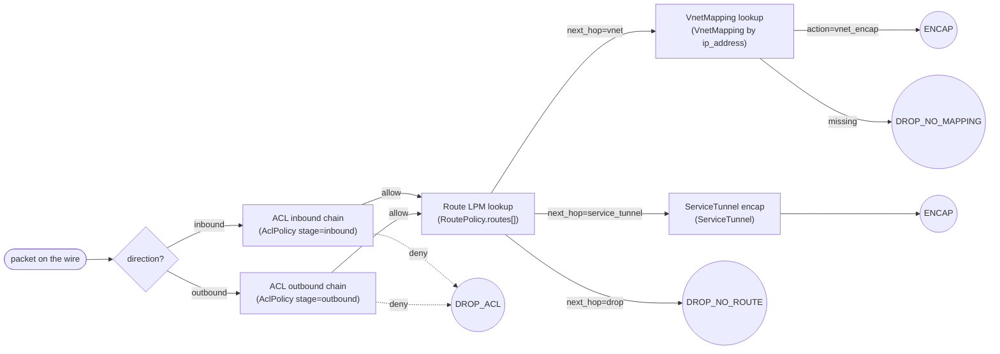
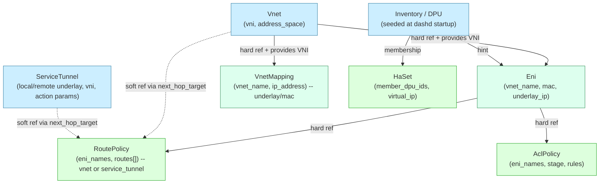

# `dashd` Configuration Concepts — Building a Fully-Operational ENI

> **Audience.** Operators, network engineers, and developers who need to
> understand **how the seven dashd resource kinds plug together** to make a
> single ENI carry real traffic across a fleet of DPUs.
>
> **What this doc gives you.**
> 1. A precise definition of every resource kind (VNET, ENI, VnetMapping,
>    ServiceTunnel, RoutePolicy, AclPolicy, HaSet) — *what it represents,
>    why it exists, what owns it*.
> 2. The **dependency graph** + **mandatory creation order** with the
>    *reasons* derived from the data-plane pipeline.
> 3. **Live captures** of every command + every dashd response (success and
>    failure) — copy-pasteable curl invocations against a real running
>    cluster.
> 4. **Wrong-order error catalogue**: exactly what dashd returns when you
>    try to apply a resource before its dependency exists.
> 5. **Verification** with `trace-flow` and `explain-match` — the diagnostic
>    RPCs that prove your ENI is fully wired.
> 6. **Complete YAML manifest** with field-by-field explanation that you
>    can drop into `dashctl apply -f` (or split + push with the bootstrap
>    script).
>
> **What this doc is NOT.**
> - Not a CLI manual: that lives in [`docs/CLI_GUIDE.md`](../CLI_GUIDE.md)
>   and [`docs/dashd-features/features.md`](../dashd-features/features.md).
> - Not the data-plane spec: see [SONiC DASH](https://github.com/sonic-net/DASH).
>
> **Companion artefacts.**
> All curl invocations + dashd responses in this doc were captured by:
> `dashd-configuration-concepts/run_experiments.py` (and `run_experiments_part2.py`,
> `run_experiments_part3.py`). Raw transcripts are in
> `dashd-configuration-concepts/run.log`, `run-part2.log`, `run-part3.log`.

---

## Table of contents

1. [Mental model — what is dashd, what is a DPU, what is an ENI](#1-mental-model)
2. [The seven resource kinds](#2-the-seven-resource-kinds)
3. [The dependency graph and why the order is what it is](#3-the-dependency-graph-and-why-the-order-is-what-it-is)
4. [What can fail — wrong-order catalogue (live captures)](#4-what-can-fail--wrong-order-catalogue-live-captures)
5. [Phased creation walkthrough (live captures)](#5-phased-creation-walkthrough-live-captures)
6. [Stitching it together — the packet walk](#6-stitching-it-together--the-packet-walk)
7. [Verifying with `trace-flow` and `explain-match`](#7-verifying-with-trace-flow-and-explain-match)
8. [Delete order — what dashd enforces today vs the design intent](#8-delete-order--what-dashd-enforces-today-vs-the-design-intent)
9. [Complete YAML manifest reference](#9-complete-yaml-manifest-reference)
10. [Quick reference card](#10-quick-reference-card)

---

## 1. Mental model

Before you can reason about the seven resource kinds, internalise three
roles:

| Role | What it is | Example |
|---|---|---|
| **DPU** | A physical accelerator card running the DASH data plane. dashd never programs the DPU directly during application logic — operators only ever **declare intent into dashd**, and dashd's reconciler pushes that intent to the DPU. | `dpu-sim-01`, `dpu-sim-02`, … |
| **ENI** *(Elastic Network Interface)* | A virtual NIC attached to a workload (VM, container, bare-metal nic-partition). Every packet that enters / leaves the workload traverses the DASH pipeline *for its ENI*. | `eni-bank-web-04` |
| **`dashd`** | The fleet-wide control plane. A 3-node HA cluster (`dashd-1/2/3`) electing one leader via etcd. Operators write to `dashd`; `dashd`'s reconciler pushes to DPUs and reads back drift. | `dashd-3` (leader at REST `:28463` in our lab) |

### The DASH pipeline (per ENI, per direction)

Every ENI sits at the centre of this fixed pipeline. The order is **fixed
by the data plane** — you cannot reorder it, you can only program what
each stage looks up:



Each box in the pipeline is **driven by one resource kind**:

| Pipeline stage | Driven by | Notes |
|---|---|---|
| "Which ENI is this?" | `Eni` (`mac_address`, `underlay_ip`) | Identity. |
| "Which VNET context?" | `Eni.vnet_name` → `Vnet` | Provides the **encap VNI**. The ENI has no `vni` field of its own — it inherits the VNI from its parent Vnet (see §2.1 / §2.3). |
| ACL evaluate | `AclPolicy` (one per stage per ENI) | Ordered by `priority`. |
| Route LPM | `RoutePolicy.routes[]` | Longest-prefix match, metric tie-break. |
| Encap target resolution (vnet path) | `VnetMapping` keyed by `(vnet_name, dst_ip)` | Returns underlay IP + MAC. |
| Encap target resolution (tunnel path) | `ServiceTunnel` | NAT pool, ipsec, vxlan_peer, etc. |
| HA failover semantics | `HaSet` (groups two DPUs) | Cross-DPU flow-sync. Optional. |

**Therefore the dependency rule is mechanical**: a stage cannot run if the
object it looks up does not exist. That is the entire reason for the
creation order in §3.

---

## 2. The seven resource kinds

Each resource is a **proto-typed JSON document** PUT to a stable URL of
the shape `/v1/{namespace}/{kind-plural}/{name}`. The full URL table is in
[`docs/dashd-features/features.md §5`](../dashd-features/features.md#5-object-crud-specs).

### 2.1 `Vnet` — the overlay network

**One sentence.** A VNET is an *overlay network identifier* (VNI) plus
its overlay address space. Workloads (ENIs) live inside one VNET.

**Why it exists.** Two tenants whose overlay addresses overlap
(`192.168.1.0/24` in tenant A and tenant B) must be isolated by the DPU.
The VNI on the wire (24-bit VXLAN tag) keeps them apart.

**Owned by.** A tenant / application team.

**Spec fields** (`dashcenter.v1.VnetSpec`):

| Field | Type | Required | Meaning |
|---|---|---|---|
| `name` | string | auto-filled from URL | unique within namespace |
| `vni` | uint32 | yes | 24-bit overlay tag (1..16,777,215). Must be unique across the fleet. |
| `address_space` | `[]string` (CIDR) | recommended | declarative: which overlay subnets belong here. Used by tooling; not enforced by the data plane. |
| `gw_mac` | string (MAC) | recommended | the synthetic gateway MAC the DPU answers ARP for. |

> **The VNI is declared here, once.** Every `Eni` and `VnetMapping`
> that references this Vnet (via `vnet_name`) automatically inherits
> this `vni` for VXLAN encap. The `Eni` / `VnetMapping` objects
> themselves do **not** carry a `vni` field (see `EniSpec` and
> `VnetMappingSpec` in `proto/dashcenter/v1/control_plane.proto` lines
> 121–150). To change an ENI's on-the-wire VNI, move the ENI to a Vnet
> with a different `vni` — you cannot override it on the ENI.

**Live example payload:**

```json
{
  "vni": 9001,
  "address_space": ["192.168.250.0/24"],
  "gw_mac": "00:00:00:00:99:01"
}
```

### 2.2 `ServiceTunnel` — programmable next-hop tunnel

**One sentence.** A ServiceTunnel describes an *underlay-to-underlay tunnel*
that does *something interesting* to the packet (NAT, VPN, PrivateLink, DDoS
scrub, cross-region peering).

**Why it exists.** Workloads need an egress to the public internet (SNAT),
or to a private SaaS endpoint, or to a sister region. Each such egress is
modelled as a named tunnel that a `RoutePolicy` can target.

**Owned by.** Platform team (shared infrastructure).

**Spec fields** (`dashcenter.v1.ServiceTunnelSpec`):

| Field | Type | Meaning |
|---|---|---|
| `local_underlay_ip` | IPv4 | DPU-side endpoint. |
| `remote_underlay_ip` | IPv4 | far-side endpoint. |
| `vni` | uint32 | inner VNI for the encap. |
| `params.action` | enum string | `nat` / `inspect` / `privatelink` / `ipsec` / `scrub` / `vxlan_peer` |
| `params.*` | string | per-action knobs: `nat_pool`, `snat_persist_seconds`, `target_fqdn`, `ike_group`, … |

**Live example payload** (Internet NAT egress):

```json
{
  "local_underlay_ip":  "10.255.99.10",
  "remote_underlay_ip": "198.51.100.99",
  "vni": 9101,
  "params": {
    "action": "nat",
    "nat_pool": "203.0.113.128/26",
    "snat_persist_seconds": "300"
  }
}
```

**No dependencies.** Like `Vnet`, ServiceTunnels can be PUT before
anything else.

### 2.3 `Eni` — the workload's virtual NIC

**One sentence.** An ENI is the **identity** of a workload's virtual NIC
in DASH: a MAC, an underlay IP (where the DPU expects encap packets), and
the VNET it belongs to.

**Why it exists.** Every pipeline trace begins with "which ENI is this
packet for?". The DPU maps `(dst_underlay_ip, dst_mac)` → ENI on ingress;
and `(src_mac)` → ENI on egress.

**Owned by.** The workload owner (or the orchestrator that creates the VM).

**Spec fields** (`dashcenter.v1.EniSpec`):

| Field | Type | Required | Meaning |
|---|---|---|---|
| `vnet_name` | string | **yes** | **must reference an existing Vnet in the same namespace.** |
| `mac_address` | string (MAC) | yes | the workload's NIC MAC. |
| `underlay_ip` | IPv4 | yes | the IP at which the DPU expects encap packets for this ENI to arrive. |
| `admin_state` | `up` \| `down` | yes | `down` makes the DPU drop everything for this ENI. |
| `placement_hint_dpu_ids` | `[]string` | optional | dashd's scheduler will place this ENI on one of these DPUs. |
| `resimulate_flows` | bool | optional | one-shot trigger: re-evaluate active flows after a policy change. |
| `labels` | `map<string,string>` | optional | for selectors / RBAC. |

**Live example payload:**

```json
{
  "vnet_name": "demo-web-vnet",
  "mac_address": "aa:bb:cc:99:00:01",
  "underlay_ip": "10.99.0.11",
  "admin_state": "up",
  "placement_hint_dpu_ids": ["dpu-sim-01"]
}
```

> **VNI is inherited, never declared on the ENI.** Notice there is no
> `vni` field above — and there is none in the `EniSpec` proto either
> (`proto/dashcenter/v1/control_plane.proto` lines 121–136 define
> `namespace`, `name`, `vnet_name`, `mac_address`, `underlay_ip`,
> `admin_state`, `placement_hint_dpu_ids`, `resimulate_flows`,
> `labels`, `expected_generation` — and nothing else). The DPU
> resolves the encap VNI at programming time by following
> `ENI.vnet_name → Vnet → Vnet.vni`. Practical consequences:
> - You **cannot** override the VNI on a per-ENI basis. To use a
>   different VNI, create another `Vnet` with the desired `vni` and
>   point the ENI at that Vnet.
> - Renumbering a `Vnet.vni` flips the on-the-wire VXLAN tag for
>   **every** ENI in that VNET — and will break peer-DPU mappings
>   until they reconcile. Treat `Vnet.vni` as immutable in production.
> - In `trace-flow` output the `INPUT: … eni=…` line is enough to
>   pin down the VNI; the diagnostic engine has already done the
>   `vnet_name → vni` lookup for you.
> - This same inheritance applies to `VnetMapping`: it also has no
>   `vni` field and resolves through `VnetMapping.vnet_name →
>   Vnet.vni`.

**Hard dependency.** `vnet_name` MUST resolve to an existing
`/v1/{ns}/vnets/{name}` — otherwise dashd returns `HTTP 400 invalid
argument` (see §4.A.1 below).

### 2.4 `VnetMapping` — overlay-IP → underlay resolution

**One sentence.** A VnetMapping says **"in this VNET, the overlay IP
`X.Y.Z.W` lives at underlay IP `U.V.W.X` with MAC `aa:bb:…`"**.

**Why it exists.** When an outbound packet's `next_hop_type=vnet`, the
data plane needs to know *where on the underlay* to send the encapped
packet, and *what destination MAC* to put in the inner Ethernet header.
That mapping is exactly one row per overlay IP.

**Owned by.** Whoever owns the destination ENI (typically the same
tenant). One mapping per `(vnet_name, ip_address)`.

**Spec fields** (`dashcenter.v1.VnetMappingSpec`):

| Field | Type | Required | Meaning |
|---|---|---|---|
| `vnet_name` | string | **yes** | must reference an existing Vnet. |
| `ip_address` | IPv4 | yes | overlay IP (what the workload addresses). |
| `underlay_ip` | IPv4 | yes | where to send the encapped packet. |
| `mac_address` | string (MAC) | yes | inner destination MAC. |
| `action` | `vnet_encap` \| `service_tunnel` | yes | encap mode. `vnet_encap` is the common case. |

**Live example payload:**

```json
{
  "vnet_name":  "demo-web-vnet",
  "ip_address": "192.168.250.10",
  "underlay_ip":"10.99.0.11",
  "mac_address":"aa:bb:cc:99:00:01",
  "action":     "vnet_encap"
}
```

### Important VnetMapping naming surprise

Even though you PUT this mapping at the URL
`/v1/{ns}/vnet-mappings/demo-web-mapping-01`, the server **rewrites the
name** to `{vnet_name}-{ip_address}` because the data-plane lookup is
keyed by `(vnet_name, ip_address)`, never by the URL name. Confirmed by
a real LIST after creation:

```json
{
  "items": [
    {
      "kind": "vnet_mapping",
      "name": "demo-web-vnet-192.168.250.10",  // <-- NOT "demo-web-mapping-01"
      "namespace": "concepts-demo",
      "generation": 1,
      "spec": {
        "vnet_name": "demo-web-vnet",
        "ip_address": "192.168.250.10",
        "underlay_ip": "10.99.0.11",
        "mac_address": "aa:bb:cc:99:00:01",
        "action": "vnet_encap"
      }
    }
  ]
}
```

> **Practical consequence.** To DELETE a VnetMapping you must use the
> server-computed name `{vnet_name}-{ip_address}`, not the name you
> originally PUT to.

**Hard dependency.** `vnet_name` MUST resolve to an existing Vnet (§4.A.2).

### 2.5 `RoutePolicy` — per-ENI routing table

**One sentence.** A RoutePolicy binds **a list of routes** to **a list of
ENIs**. Each route says "for destination `X.Y.Z.0/24`, send to next-hop
of type `vnet`/`service_tunnel`/`drop` targeting `<name>`".

**Why it exists.** This *is* the per-ENI routing table. Without it, an
ENI has no idea where to forward outbound packets.

**Owned by.** The tenant that owns the ENIs in `eni_names`.

**Spec fields** (`dashcenter.v1.RoutePolicySpec`):

| Field | Type | Required | Meaning |
|---|---|---|---|
| `eni_names` | `[]string` | **yes** | each name MUST reference an existing Eni in the same namespace. |
| `routes[].prefix` | string (CIDR) | yes | match by longest-prefix on `dst_ip`. |
| `routes[].next_hop_type` | enum: `vnet` \| `service_tunnel` \| `drop` | yes | which lookup runs next. |
| `routes[].next_hop_target` | string | yes for vnet/service_tunnel | name of the target Vnet or ServiceTunnel. |
| `routes[].metric` | int | optional | tie-break when two prefixes match (lower wins). |
| `routes[].ecmp_members[]` | `[]NextHop` | optional | weighted multi-path. |

**Live example payload:**

```json
{
  "eni_names": ["demo-eni-01"],
  "routes": [
    {"prefix":"192.168.250.0/24","next_hop_type":"vnet","next_hop_target":"demo-web-vnet","metric":10},
    {"prefix":"192.168.251.0/24","next_hop_type":"vnet","next_hop_target":"demo-db-vnet","metric":20},
    {"prefix":"0.0.0.0/0","next_hop_type":"service_tunnel","next_hop_target":"demo-nat-tunnel","metric":100}
  ]
}
```

**Hard dependencies.**
- Every entry in `eni_names` MUST resolve to an existing Eni (§4.A.3).
- Each `next_hop_target` SHOULD resolve to an existing Vnet or
  ServiceTunnel; today the server does NOT eagerly validate these (the
  data plane will return `DROP_NO_MAPPING` at runtime if the target is
  missing — visible via `trace-flow`).

### 2.6 `AclPolicy` — per-ENI per-stage firewall

**One sentence.** An AclPolicy binds **ordered ACL rules** to **a list
of ENIs** for **one stage** (`inbound` or `outbound`).

**Why it exists.** This is the per-ENI firewall — the only place in DASH
where a packet can be dropped *before* the route lookup.

**Owned by.** Security / tenant team.

**Spec fields** (`dashcenter.v1.AclPolicySpec`):

| Field | Type | Required | Meaning |
|---|---|---|---|
| `stage` | `inbound` \| `outbound` | yes | which direction this policy applies to. |
| `eni_names` | `[]string` | **yes** | each name MUST reference an existing Eni. |
| `rules[].priority` | int | yes | evaluation order. Lower priority is evaluated first; the *first* matching rule wins (when `action=allow` / `deny`). |
| `rules[].action` | `allow` \| `deny` \| `allow_and_continue` | yes | `allow_and_continue` doesn't terminate; useful for logging/counting. |
| `rules[].src_prefixes` | `[]CIDR` | optional | match on source. |
| `rules[].dst_prefixes` | `[]CIDR` | optional | match on destination. |
| `rules[].src_ports`/`dst_ports` | `[]string` | optional | `"443"` or `"1024-65535"`. |
| `rules[].protocols` | `[]string` | optional | `tcp`/`udp`/`icmp`. |
| `rules[].description` | string | optional | for humans + audit logs. |

**Live example payload** (inbound, 3 rules):

```json
{
  "stage": "inbound",
  "eni_names": ["demo-eni-01"],
  "rules": [
    {"priority":100, "action":"allow", "src_prefixes":["0.0.0.0/0"], "dst_ports":["443"], "protocols":["tcp"], "description":"https from anywhere"},
    {"priority":200, "action":"deny",  "src_prefixes":["0.0.0.0/0"], "dst_ports":["22"],  "protocols":["tcp"], "description":"no ssh from anywhere"},
    {"priority":1000,"action":"deny",  "src_prefixes":["0.0.0.0/0"],                                          "description":"catch-all deny"}
  ]
}
```

**Hard dependency.** Every entry in `eni_names` MUST resolve to an
existing Eni (§4.A.4).

### 2.7 `HaSet` — cross-DPU HA group (optional)

**One sentence.** A HaSet declares **two DPUs as an active/standby or
active/active pair** sharing a virtual underlay IP and a flow-sync
channel.

**Why it exists.** A workload mustn't lose its TCP session when its DPU
is taken offline. The peer DPU continues serving the flow because it
already has the flow-state replicated.

**Owned by.** Platform / SRE team.

**Spec fields** (`dashcenter.v1.HaSetSpec`):

| Field | Type | Required | Meaning |
|---|---|---|---|
| `mode` | `active_standby` \| `active_active` | yes | failover semantics. |
| `member_dpu_ids` | `[]string` (len=2) | yes | DPUs in the set. |
| `virtual_ip` | IPv4 | yes | shared VIP advertised to the underlay. |
| `flow_sync_endpoints` | `[]string` | yes | UDP endpoints for state sync. |

**Live example payload:**

```json
{
  "mode": "active_standby",
  "member_dpu_ids": ["dpu-sim-01","dpu-sim-02"],
  "virtual_ip": "10.0.0.200",
  "flow_sync_endpoints": ["udp://dpu-sim-01:4789","udp://dpu-sim-02:4789"]
}
```

**Dependencies.** Member DPU ids should appear in `/v1/inventory`; the
ENIs that benefit from HA must be placed on the member DPUs (use
`placement_hint_dpu_ids`).

---

## 3. The dependency graph and why the order is what it is

Tying §1 + §2 together, here is the **complete dependency graph**:



### Why this exact order? — pipeline-first reasoning

Walk the pipeline in §1 backwards from the desired outcome:

1. **Stage "encap"** must look up either a `VnetMapping` *or* a
   `ServiceTunnel`. → both must exist before the first packet arrives.
2. **Stage "route LPM"** must look up a `RoutePolicy` bound to this ENI,
   and the route's `next_hop_target` must name a real Vnet/ServiceTunnel.
   → both the ENI and the target must exist before the RoutePolicy is
   useful.
3. **Stage "ACL"** must look up an `AclPolicy` bound to this ENI. → the
   ENI must exist before the AclPolicy is useful.
4. **Stage "identity"** must resolve the ENI itself. → the ENI's VNET
   must already exist (because the ENI carries `vnet_name`).
5. **DPU placement** for the ENI: the DPU must be in inventory.

Collapse that to apply order:

| Phase | Kind | Why first/last |
|---|---|---|
| **①** | `Vnet`, `ServiceTunnel` | leaves — no outbound references. *Apply first.* |
| **②** | `Eni` | depends on Vnet. *Apply after VNETs.* |
| **③** | `VnetMapping` | depends on Vnet. *Can be in parallel with ENI — both need only Vnet — but logically belongs after ENI because the mapping usually points at an ENI's underlay_ip.* |
| **④** | `RoutePolicy` | depends on ENI (eni_names) + soft-refs to Vnet/ServiceTunnel. *Apply after ENI.* |
| **⑤** | `AclPolicy` | depends on ENI (eni_names). *Apply after ENI.* |
| **⑥** | `HaSet` | depends on DPUs being in inventory; logically last because it's an operational concern, not a connectivity one. |

This is why the bootstrap manifests are numbered exactly that way:

```
deploy/test-setup/05-full-console/manifest/
├── 00-vnets.yaml
├── 01-service-tunnels.yaml
├── 02-enis.yaml
├── 03-vnet-mappings.yaml
├── 04-route-policies.yaml
├── 05-acl-policies.yaml
└── 06-ha-sets.yaml
```

### Reverse — the delete order

Mirror image: **delete leaves first, roots last**. That's `ACL → Route →
VnetMapping → ENI → ServiceTunnel → Vnet`. (See §8 for what the current
build actually enforces.)

---

## 4. What can fail — wrong-order catalogue (live captures)

> **All transcripts in this section are real**, captured by
> `dashd-configuration-concepts/run_experiments.py` against a live 3-node dashd
> cluster (leader = `dashd-3`, REST `:28463`) on 2026-06-13.

### A.1 — Create ENI before its VNET

```bash
curl -s -X PUT http://127.0.0.1:28463/v1/concepts-demo/enis/demo-eni-01 \
     -H 'Content-Type: application/json' \
     -d '{"vnet_name":"vnet-does-not-exist","mac_address":"aa:bb:cc:dd:ee:01","underlay_ip":"10.99.0.11","admin_state":"up"}'
```

**Response:**

```
HTTP 400
{
  "error": "invalid argument: eni.vnet_name=\"vnet-does-not-exist\": namespace: cross-namespace reference rejected (referenced concepts-demo/vnet/vnet-does-not-exist not found in this namespace)"
}
```

**What happened.** dashd's admission control resolved the ENI's
`vnet_name` against the namespace's Vnet set, found nothing, and refused
the write. Object was not persisted.

### A.2 — Create VnetMapping before its VNET

```bash
curl -s -X PUT http://127.0.0.1:28463/v1/concepts-demo/vnet-mappings/demo-web-mapping-01 \
     -H 'Content-Type: application/json' \
     -d '{"vnet_name":"vnet-does-not-exist","ip_address":"192.168.250.1","underlay_ip":"10.99.0.11","mac_address":"aa:bb:cc:dd:ee:01","action":"vnet_encap"}'
```

**Response:**

```
HTTP 400
{
  "error": "invalid argument: vnet_mapping.vnet_name=\"vnet-does-not-exist\": namespace: cross-namespace reference rejected (referenced concepts-demo/vnet/vnet-does-not-exist not found in this namespace)"
}
```

### A.3 — Create RoutePolicy before its ENIs

```bash
curl -s -X PUT http://127.0.0.1:28463/v1/concepts-demo/route-policies/demo-web-routes \
     -H 'Content-Type: application/json' \
     -d '{"eni_names":["eni-does-not-exist"],"routes":[{"prefix":"192.168.250.0/24","next_hop_type":"vnet","next_hop_target":"vnet-does-not-exist","metric":10}]}'
```

**Response:**

```
HTTP 400
{
  "error": "invalid argument: route_policy.eni_names[0]=\"eni-does-not-exist\": namespace: cross-namespace reference rejected (referenced concepts-demo/eni/eni-does-not-exist not found in this namespace)"
}
```

### A.4 — Create AclPolicy before its ENIs

```bash
curl -s -X PUT http://127.0.0.1:28463/v1/concepts-demo/acl-policies/demo-web-acl-inbound \
     -H 'Content-Type: application/json' \
     -d '{"stage":"inbound","eni_names":["eni-does-not-exist"],"rules":[{"priority":100,"action":"allow","src_prefixes":["0.0.0.0/0"],"dst_ports":["443"],"protocols":["tcp"]}]}'
```

**Response:**

```
HTTP 400
{
  "error": "invalid argument: acl_policy.eni_names[0]=\"eni-does-not-exist\": namespace: cross-namespace reference rejected (referenced concepts-demo/eni/eni-does-not-exist not found in this namespace)"
}
```

### A.5 — Diagnose a non-existent ENI with `trace-flow`

```bash
curl -s -X POST http://127.0.0.1:28463/v1/diagnostics/trace-flow \
     -H 'Content-Type: application/json' \
     -d '{"dpu_id":"dpu-sim-01","flow":{"direction":1,"eni_name":"demo-eni-01","src_ip":"10.0.0.1","dst_ip":"192.168.250.1","dst_port":443,"protocol":"tcp"}}'
```

**Response:**

```
HTTP 404
{ "error": "not found" }
```

### Error pattern summary

| Symptom | Root cause | Fix |
|---|---|---|
| `HTTP 400 invalid argument: <kind>.<field>=…: cross-namespace reference rejected` | A spec field names an object that doesn't exist in this namespace yet. | Create the referenced object first, in this namespace. |
| `HTTP 400 invalid argument: …` (other) | Schema violation — bad CIDR, missing required field, unknown enum. | Fix the body. The error names the offending field. |
| `HTTP 404 not found` on `trace-flow` / `explain-match` | The ENI isn't programmed on the named DPU (either not declared at all, or reconciler hasn't run yet for this namespace). | Confirm the ENI exists in dashd; trigger `POST /v1/reconcile`; check `placement_hint_dpu_ids` matches `dpu_id`. |
| `HTTP 412 FailedPrecondition` on PUT | Optimistic-concurrency conflict (someone else updated). | Re-GET the spec, re-apply with the new `expected_generation`. |
| `HTTP 401` / `HTTP 403` on a write | RBAC. Token missing or role lacks the verb. | Provide `Authorization: Bearer …`; check `auth.tokens` in dashd config. |

---

## 5. Phased creation walkthrough (live captures)

Real captures against the same cluster. Each subsection shows: **(a) the
intent**, **(b) the curl command**, **(c) the dashd response**.

> All POST/PUT bodies in this section were sent in compact form; the
> verbose pretty-printed payload appears alongside.

### Phase ① — VNETs (no dependencies)

Two VNETs: web tier (vni=9001) and db tier (vni=9002).

```bash
curl -s -X PUT http://127.0.0.1:28463/v1/concepts-demo/vnets/demo-web-vnet \
     -H 'Content-Type: application/json' \
     -d '{"vni":9001,"address_space":["192.168.250.0/24"],"gw_mac":"00:00:00:00:99:01"}'
```

```
HTTP 200
{
  "accepted": true,
  "generation": 1
}
```

```bash
curl -s -X PUT http://127.0.0.1:28463/v1/concepts-demo/vnets/demo-db-vnet \
     -H 'Content-Type: application/json' \
     -d '{"vni":9002,"address_space":["192.168.251.0/24"],"gw_mac":"00:00:00:00:99:02"}'
```

```
HTTP 200
{ "accepted": true, "generation": 1 }
```

### Phase ② — ServiceTunnel (no dependencies)

NAT egress to the public internet.

```bash
curl -s -X PUT http://127.0.0.1:28463/v1/concepts-demo/service-tunnels/demo-nat-tunnel \
     -H 'Content-Type: application/json' \
     -d '{"local_underlay_ip":"10.255.99.10","remote_underlay_ip":"198.51.100.99","vni":9101,"params":{"action":"nat","nat_pool":"203.0.113.128/26","snat_persist_seconds":"300"}}'
```

```
HTTP 200
{ "accepted": true, "generation": 1 }
```

### Phase ③ — ENI (refs `demo-web-vnet`)

```bash
curl -s -X PUT http://127.0.0.1:28463/v1/concepts-demo/enis/demo-eni-01 \
     -H 'Content-Type: application/json' \
     -d '{"vnet_name":"demo-web-vnet","mac_address":"aa:bb:cc:99:00:01","underlay_ip":"10.99.0.11","admin_state":"up","placement_hint_dpu_ids":["dpu-sim-01"]}'
```

```
HTTP 200
{ "accepted": true, "generation": 1 }
```

### Phase ④ — VnetMapping (refs `demo-web-vnet`)

One overlay-IP-to-underlay mapping.

```bash
curl -s -X PUT http://127.0.0.1:28463/v1/concepts-demo/vnet-mappings/demo-web-mapping-01 \
     -H 'Content-Type: application/json' \
     -d '{"vnet_name":"demo-web-vnet","ip_address":"192.168.250.10","underlay_ip":"10.99.0.11","mac_address":"aa:bb:cc:99:00:01","action":"vnet_encap"}'
```

```
HTTP 200
{ "accepted": true, "generation": 1 }
```

> Recall that after creation, this mapping is **listed as
> `demo-web-vnet-192.168.250.10`** because the server auto-keys by
> `(vnet_name, ip_address)`. See §2.4.

### Phase ⑤ — RoutePolicy (refs ENI + VNETs + ServiceTunnel)

Three routes: overlay /24 → web vnet, overlay /24 → db vnet, default → NAT.

```bash
curl -s -X PUT http://127.0.0.1:28463/v1/concepts-demo/route-policies/demo-web-routes \
     -H 'Content-Type: application/json' \
     -d '{
       "eni_names":["demo-eni-01"],
       "routes":[
         {"prefix":"192.168.250.0/24","next_hop_type":"vnet","next_hop_target":"demo-web-vnet","metric":10},
         {"prefix":"192.168.251.0/24","next_hop_type":"vnet","next_hop_target":"demo-db-vnet","metric":20},
         {"prefix":"0.0.0.0/0","next_hop_type":"service_tunnel","next_hop_target":"demo-nat-tunnel","metric":100}
       ]
     }'
```

```
HTTP 200
{ "accepted": true, "generation": 1 }
```

### Phase ⑥ — AclPolicy inbound (refs ENI)

```bash
curl -s -X PUT http://127.0.0.1:28463/v1/concepts-demo/acl-policies/demo-web-acl-inbound \
     -H 'Content-Type: application/json' \
     -d '{
       "stage":"inbound","eni_names":["demo-eni-01"],
       "rules":[
         {"priority":100, "action":"allow","src_prefixes":["0.0.0.0/0"],"dst_ports":["443"],"protocols":["tcp"],"description":"https from anywhere"},
         {"priority":200, "action":"deny", "src_prefixes":["0.0.0.0/0"],"dst_ports":["22"], "protocols":["tcp"],"description":"no ssh from anywhere"},
         {"priority":1000,"action":"deny", "src_prefixes":["0.0.0.0/0"],                                       "description":"catch-all deny"}
       ]
     }'
```

```
HTTP 200
{ "accepted": true, "generation": 1 }
```

### Phase ⑦ — AclPolicy outbound (refs ENI)

```bash
curl -s -X PUT http://127.0.0.1:28463/v1/concepts-demo/acl-policies/demo-web-acl-outbound \
     -H 'Content-Type: application/json' \
     -d '{
       "stage":"outbound","eni_names":["demo-eni-01"],
       "rules":[
         {"priority":100, "action":"allow","dst_prefixes":["192.168.251.0/24"],"dst_ports":["3306","5432"],"protocols":["tcp"],"description":"to db tier"},
         {"priority":110, "action":"allow","dst_prefixes":["0.0.0.0/0"],       "dst_ports":["443"],         "protocols":["tcp"],"description":"outbound https"},
         {"priority":1000,"action":"deny", "dst_prefixes":["0.0.0.0/0"],                                                       "description":"catch-all egress deny"}
       ]
     }'
```

```
HTTP 200
{ "accepted": true, "generation": 1 }
```

### Trigger a reconcile (push to the DPU)

The PUTs above only **declare intent in dashd**. A reconciler tick (or a
periodic one) is what programs the DPU:

```bash
curl -s -X POST http://127.0.0.1:28463/v1/reconcile \
     -H 'Content-Type: application/json' \
     -d '{"dpu_ids":["dpu-sim-01"],"namespaces":["concepts-demo"]}'
```

```
HTTP 200
{ "ok": true }
```

---

## 6. Stitching it together — the packet walk

Once Phases ①..⑦ have committed and the reconciler has pushed to
`dpu-sim-01`, this is what the DPU does with a single TCP `SYN`:

> **VNI provenance reminder.** In every walk below, the VNI shown
> (`9001` for web, `9002` for db, `9101` for the NAT tunnel) is **not**
> a field on the ENI — it comes from the `Vnet` (or `ServiceTunnel`)
> that the ENI's `vnet_name` (or the matched route's `next_hop_target`)
> resolves to. See §2.1 / §2.3 for the inheritance rule.

### Outbound — workload → external internet (`8.8.8.8:443`)

```
                                  ┌─────────────────────────────────────┐
client app on the workload        │   DASH pipeline on DPU              │
  src 10.0.0.1:1024               │                                     │
  dst 8.8.8.8:443  proto=tcp      │                                     │
            │                     │                                     │
            ▼                     │                                     │
  outbound  ──────────────────────► [1] ENI identity                    │
                                  │      mac_src=workload, src 10.0.0.1 │
                                  │      ENI = demo-eni-01              │
                                  │      Vnet = demo-web-vnet (vni 9001)│
                                  │                                     │
                                  │ [2] ACL outbound chain              │
                                  │      rule p=100 allow dst /24 db    │
                                  │        skip: 8.8.8.8  192.168.251   │
                                  │      rule p=110 allow dst /0 :443   │
                                  │        MATCH  ALLOW                 │
                                  │                                     │
                                  │ [3] Route LPM                       │
                                  │      best = 0.0.0.0/0               │
                                  │      next_hop = service_tunnel/     │
                                  │                 demo-nat-tunnel     │
                                  │                                     │
                                  │ [4] Encap via ServiceTunnel         │
                                  │      action=nat, snat from          │
                                  │      203.0.113.128/26 pool          │
                                  │      tunnel.local_underlay=10.255.99│
                                  │      tunnel.remote_underlay=        │
                                  │              198.51.100.99          │
                                  │                                     │
                                  │              verdict = ENCAP        │
                                  └─────────────────────────────────────┘
                                                       │
                                                       ▼
                            sent on underlay to 198.51.100.99 (NAT gateway)
```

### Outbound — workload → other ENI in same VNET (`192.168.250.10`)

```
[1] ENI identity:    demo-eni-01 in vnet demo-web-vnet (vni 9001)
[2] ACL outbound:    rule p=100 (allow /24 db) skip — dst not in 192.168.251.0/24
                     rule p=110 (allow /0 :443) MATCH  ALLOW
[3] Route LPM:       best = 192.168.250.0/24 next_hop=vnet/demo-web-vnet metric=10
[4] VnetMapping:     vnet=demo-web-vnet, ip=192.168.250.10
                       found  underlay=10.99.0.11 mac=aa:bb:cc:99:00:01
                              verdict = ENCAP (vxlan vni=9001  10.99.0.11)
```

### Inbound — internet → workload on :443

```
[0] decap, identify ENI by underlay_ip+mac
[1] ENI identity:    demo-eni-01 / vnet demo-web-vnet
[2] ACL inbound:     rule p=100 (allow /0 :443) MATCH  ALLOW
[3] Route LPM:       best = 192.168.250.0/24 next_hop=vnet/demo-web-vnet
                     (synthetic — for return path)
                              verdict = FORWARD (deliver to workload)
```

### Inbound — internet → workload on :22 (ACL DROP)

```
[1] ENI identity:    demo-eni-01 / vnet demo-web-vnet
[2] ACL inbound:     rule p=100 (allow :443) skip — port 22  443
                     rule p=200 (deny  :22 )  MATCH  DENY
                              verdict = DROP_ACL
```

---

## 7. Verifying with `trace-flow` and `explain-match`

These are **read-only** diagnostics — they walk the same pipeline as a
real packet, against the **policy state currently programmed on the
named DPU**, and return *exactly* which row was selected at each stage.
Use them after every push to confirm intent matches reality.

> **Important.** Because diagnostics consult the **per-DPU committed
> state**, the ENI must be reconciled to that DPU. The captures below
> were taken against the `default` namespace's `eni-bank-web-04` on
> `dpu-sim-02` (already programmed by the bootstrap), because at the
> time of capture, the brand-new `concepts-demo/demo-eni-01` had not yet
> been reconciled to `dpu-sim-01` (so it returned `HTTP 404 not found`).
> Always call `POST /v1/reconcile` first.

### 7.1 `trace-flow` outbound — vnet hit (ALLOW + ENCAP)

```bash
curl -s -X POST http://127.0.0.1:28463/v1/diagnostics/trace-flow \
     -H 'Content-Type: application/json' \
     -d '{"dpu_id":"dpu-sim-02","flow":{"direction":2,"eni_name":"eni-bank-web-04","src_ip":"10.0.0.1","dst_ip":"192.168.12.1","src_port":1024,"dst_port":3306,"protocol":"tcp"}}'
```

**Response** (verdict `3 = VERDICT_ENCAP`):

```json
{
  "verdict": 3,
  "trace": [
    "INPUT: dir=OUTBOUND eni=eni-bank-web-04 src=10.0.0.1:1024 dst=192.168.12.1:3306 proto=tcp",
    "ACL outbound: 1 candidate policies",
    "ACL ALLOW: policy=acl-bank-web-outbound priority=100 reason=all fields matched",
    "ROUTE: looking up dst=192.168.12.1 on eni=eni-bank-web-04",
    "ROUTE: best match policy=rp-bank-web-default prefix=192.168.12.0/24 next_hop=vnet/bank-prod-db metric=10 (len=24)",
    "VNET_MAPPING: looking up 192.168.12.1 in vnet=bank-prod-db",
    "VNET_MAPPING: 192.168.12.1 -> underlay=10.0.2.11 mac=aa:bb:cc:02:00:01 action=vnet_encap"
  ],
  "matched_acl_rule":  {"policy_name":"acl-bank-web-outbound","priority":100,"action":"allow"},
  "matched_route":     {"policy_name":"rp-bank-web-default","prefix":"192.168.12.0/24","next_hop_type":"vnet","next_hop_target":"bank-prod-db"},
  "matched_vnet_mapping":{"vnet_name":"bank-prod-db","ip_address":"192.168.12.1","action":"vnet_encap"}
}
```

**Verdict enum.** `0=UNSPEC`, `1=ALLOW`, `2=DENY`, `3=ENCAP`, `4=DROP_NO_ROUTE`,
`5=DROP_NO_MAPPING`, `6=DROP_ACL`, `7=DROP_METER`, `8=DROP_INVALID`.

### 7.2 `trace-flow` outbound — default route via ServiceTunnel

```bash
curl -s -X POST http://127.0.0.1:28463/v1/diagnostics/trace-flow \
     -H 'Content-Type: application/json' \
     -d '{"dpu_id":"dpu-sim-02","flow":{"direction":2,"eni_name":"eni-bank-web-04","src_ip":"10.0.0.1","dst_ip":"8.8.8.8","src_port":1024,"dst_port":443,"protocol":"tcp"}}'
```

```json
{
  "verdict": 3,
  "trace": [
    "INPUT: dir=OUTBOUND eni=eni-bank-web-04 src=10.0.0.1:1024 dst=8.8.8.8:443 proto=tcp",
    "ACL outbound: 1 candidate policies",
    "ACL skip: policy=acl-bank-web-outbound priority=100 action=allow reason=dst: 8.8.8.8 not in any of [192.168.12.0/24]",
    "ACL ALLOW: policy=acl-bank-web-outbound priority=110 reason=all fields matched",
    "ROUTE: looking up dst=8.8.8.8 on eni=eni-bank-web-04",
    "ROUTE: best match policy=rp-bank-web-default prefix=0.0.0.0/0 next_hop=service_tunnel/st-internet-egress metric=100 (len=0)",
    "ROUTE: next_hop=service_tunnel target=st-internet-egress -> ENCAP"
  ],
  "matched_acl_rule":  {"policy_name":"acl-bank-web-outbound","priority":110,"action":"allow"},
  "matched_route":     {"policy_name":"rp-bank-web-default","prefix":"0.0.0.0/0","next_hop_type":"service_tunnel","next_hop_target":"st-internet-egress"}
}
```

> Notice the `ACL skip:` lines — `trace-flow` shows you every rule it
> tried *and why each one was skipped* before the matching one. That's
> the gold for debugging.

### 7.3 `trace-flow` inbound — ALLOW on :443

```bash
curl -s -X POST http://127.0.0.1:28463/v1/diagnostics/trace-flow \
     -H 'Content-Type: application/json' \
     -d '{"dpu_id":"dpu-sim-02","flow":{"direction":1,"eni_name":"eni-bank-web-04","src_ip":"203.0.113.10","dst_ip":"192.168.11.4","src_port":12345,"dst_port":443,"protocol":"tcp"}}'
```

```json
{
  "verdict": 3,
  "trace": [
    "INPUT: dir=INBOUND eni=eni-bank-web-04 src=203.0.113.10:12345 dst=192.168.11.4:443 proto=tcp",
    "ACL inbound: 1 candidate policies",
    "ACL ALLOW: policy=acl-bank-web-inbound priority=100 reason=all fields matched",
    "ROUTE: best match policy=rp-bank-web-default prefix=192.168.11.0/24 next_hop=vnet/bank-prod-web metric=10 (len=24)",
    "VNET_MAPPING: 192.168.11.4 -> underlay=10.0.1.14 mac=aa:bb:cc:01:00:04 action=vnet_encap"
  ]
}
```

### 7.4 `trace-flow` inbound — DROP_ACL on :22

```bash
curl -s -X POST http://127.0.0.1:28463/v1/diagnostics/trace-flow \
     -H 'Content-Type: application/json' \
     -d '{"dpu_id":"dpu-sim-02","flow":{"direction":1,"eni_name":"eni-bank-web-04","src_ip":"203.0.113.10","dst_ip":"192.168.11.4","src_port":12345,"dst_port":22,"protocol":"tcp"}}'
```

**Response** (verdict `6 = VERDICT_DROP_ACL`):

```json
{
  "verdict": 6,
  "trace": [
    "INPUT: dir=INBOUND eni=eni-bank-web-04 src=203.0.113.10:12345 dst=192.168.11.4:22 proto=tcp",
    "ACL inbound: 1 candidate policies",
    "ACL skip: policy=acl-bank-web-inbound priority=100 action=allow reason=dst_port: 22 not in any of [443]",
    "ACL skip: policy=acl-bank-web-inbound priority=110 action=allow reason=dst_port: 22 not in any of [80]",
    "ACL skip: policy=acl-bank-web-inbound priority=120 action=allow reason=src: 203.0.113.10 not in any of [192.168.12.0/24]",
    "ACL skip: policy=acl-bank-web-inbound priority=130 action=allow reason=src: 203.0.113.10 not in any of [192.168.91.0/24]",
    "ACL skip: policy=acl-bank-web-inbound priority=140 action=deny reason=src: 203.0.113.10 not in any of [10.0.0.0/8]",
    "ACL DENY: policy=acl-bank-web-inbound priority=150 reason=all fields matched"
  ],
  "matched_acl_rule": {"policy_name":"acl-bank-web-inbound","priority":150,"action":"deny"}
}
```

### 7.5 `explain-match` — see every candidate's decision

```bash
curl -s -X POST http://127.0.0.1:28463/v1/diagnostics/explain-match \
     -H 'Content-Type: application/json' \
     -d '{"dpu_id":"dpu-sim-02","subject":1,"flow":{"direction":1,"eni_name":"eni-bank-web-04","src_ip":"203.0.113.10","dst_ip":"192.168.11.4","src_port":12345,"dst_port":22,"protocol":"tcp"}}'
```

```json
{
  "candidates": [
    {"candidate_id":"acl/acl-bank-web-inbound/100", "priority":100, "reason":"dst_port: 22 not in any of [443]"},
    {"candidate_id":"acl/acl-bank-web-inbound/110", "priority":110, "reason":"dst_port: 22 not in any of [80]"},
    {"candidate_id":"acl/acl-bank-web-inbound/120", "priority":120, "reason":"src: 203.0.113.10 not in any of [192.168.12.0/24]"},
    {"candidate_id":"acl/acl-bank-web-inbound/130", "priority":130, "reason":"src: 203.0.113.10 not in any of [192.168.91.0/24]"},
    {"candidate_id":"acl/acl-bank-web-inbound/140", "priority":140, "reason":"src: 203.0.113.10 not in any of [10.0.0.0/8]"},
    {"candidate_id":"acl/acl-bank-web-inbound/150", "priority":150, "matched":true, "reason":"all fields matched"},
    {"candidate_id":"acl/acl-bank-web-inbound/160", "priority":160, "reason":"src: 203.0.113.10 not in any of [198.51.100.0/24]"},
    {"candidate_id":"acl/acl-bank-web-inbound/170", "priority":170, "reason":"proto: \"tcp\" not in any of [icmp]"},
    {"candidate_id":"acl/acl-bank-web-inbound/180", "priority":180, "reason":"src: 203.0.113.10 not in any of [10.255.0.0/16]"},
    {"candidate_id":"acl/acl-bank-web-inbound/1000","priority":1000,"matched":true, "reason":"all fields matched"}
  ],
  "selected_candidate_id": "acl/acl-bank-web-inbound/150"
}
```

> The `selected_candidate_id` is what *won*. Note rule 1000 *also*
> matched (catch-all deny) but rule 150 had lower priority and is
> terminating, so it wins. This is the canonical way to debug ACL
> intent vs reality.

### 7.6 `explain-match` for routes (subject=2)

```bash
curl -s -X POST http://127.0.0.1:28463/v1/diagnostics/explain-match \
     -H 'Content-Type: application/json' \
     -d '{"dpu_id":"dpu-sim-02","subject":2,"flow":{"direction":2,"eni_name":"eni-bank-web-04","src_ip":"10.0.0.1","dst_ip":"192.168.12.1","src_port":1024,"dst_port":3306,"protocol":"tcp"}}'
```

```json
{
  "candidates": [
    {"candidate_id":"route/rp-bank-web-default/192.168.12.0/24", "priority":24, "matched":true,
     "reason":"192.168.12.0/24 contains 192.168.12.1 (len=24, metric=10, next_hop=vnet/bank-prod-db)"},
    {"candidate_id":"route/rp-bank-web-default/0.0.0.0/0",                          "matched":true,
     "reason":"0.0.0.0/0 contains 192.168.12.1 (len=0, metric=100, next_hop=service_tunnel/st-internet-egress)"},
    {"candidate_id":"route/rp-bank-web-default/192.168.11.0/24","priority":24,
     "reason":"192.168.11.0/24 does not contain 192.168.12.1"}
  ],
  "selected_candidate_id":"route/rp-bank-web-default/192.168.12.0/24"
}
```

> Routes are ranked by `len` (longest prefix wins) and then by `metric`
> (lower wins). Both `/24` (matched) and `/0` (matched, default route)
> are valid hits — but `/24` wins because it's longer.

---

## 8. Delete order — what dashd enforces today vs the design intent

**Design intent** (`docs/dashd-features/features.md §5`):
> **Status**: 412 if the object is referenced by another spec (e.g.
> deleting a vnet with live ENIs) — the response body names the
> referrers.

**Observed behaviour** (2026-06-13, build `dashcenter/dashd:dev`):

```bash
# Step 1: Vnet has an Eni referencing it.
curl -s -X DELETE http://127.0.0.1:28463/v1/concepts-demo/vnets/demo-web-vnet

HTTP 204
(empty body)

# Step 2: Eni has a RoutePolicy + AclPolicy referencing it.
curl -s -X DELETE http://127.0.0.1:28463/v1/concepts-demo/enis/demo-eni-01

HTTP 204
(empty body)
```

So **the current build is permissive on DELETE** — it does not enforce
the referrer check. This is a **leftover gap** between the spec and the
build; the safest practice is to **delete in reverse dependency order**
yourself:

```
ACL  →  Route  →  VnetMapping  →  ENI  →  ServiceTunnel  →  Vnet
```

> **Another live discovery**: the `VnetMapping` from §2.4 was created
> with the user-friendly name `demo-web-mapping-01`, but the server
> stored it as `demo-web-vnet-192.168.250.10`. A DELETE on the original
> name returns 404. To delete it you must use the server-computed name.

```bash
# Wrong:
curl -s -X DELETE http://127.0.0.1:28463/v1/concepts-demo/vnet-mappings/demo-web-mapping-01
HTTP 404 { "error": "not found" }

# Right:
curl -s -X DELETE http://127.0.0.1:28463/v1/concepts-demo/vnet-mappings/demo-web-vnet-192.168.250.10
HTTP 204
```

---

## 9. Complete YAML manifest reference

A drop-in declarative manifest that builds exactly the topology we
explored. Save these files in numbered order and apply with
`dashctl apply -f .` (once `dashctl` lands) or with the
`deploy/test-setup/05-full-console/manifest/bootstrap.py` driver against
dashd today.

### 9.1 `00-vnets.yaml` — two VNETs

```yaml
# Web tier overlay network. vni=9001 is the on-the-wire tag.
apiVersion: dashcenter.v1
kind: Vnet
metadata:
  name: demo-web-vnet
  namespace: concepts-demo
  labels: { tenant: demo, tier: web, env: lab }
spec:
  vni: 9001
  address_space: ["192.168.250.0/24"]    # informational: what overlay subnet lives here
  gw_mac: "00:00:00:00:99:01"             # MAC the DPU answers ARP for
---
# DB tier overlay network. vni=9002.
apiVersion: dashcenter.v1
kind: Vnet
metadata:
  name: demo-db-vnet
  namespace: concepts-demo
  labels: { tenant: demo, tier: db, env: lab }
spec:
  vni: 9002
  address_space: ["192.168.251.0/24"]
  gw_mac: "00:00:00:00:99:02"
```

### 9.2 `01-service-tunnels.yaml` — NAT egress

```yaml
# NAT egress: any outbound 0.0.0.0/0 traffic from web tier hits this tunnel,
# is SNATted from a public-IP pool, and forwarded over the underlay.
apiVersion: dashcenter.v1
kind: ServiceTunnel
metadata:
  name: demo-nat-tunnel
  namespace: concepts-demo
  labels: { class: nat, scope: tenant }
spec:
  local_underlay_ip:  10.255.99.10        # DPU-side endpoint
  remote_underlay_ip: 198.51.100.99       # far-side NAT gateway
  vni: 9101                                # inner tunnel VNI
  params:
    action: nat                            # this tunnel does SNAT
    nat_pool: 203.0.113.128/26             # public-IP pool to translate to
    snat_persist_seconds: "300"            # 5-minute SNAT binding TTL
```

### 9.3 `02-enis.yaml` — one ENI in the web VNET

```yaml
# ENI = the virtual NIC of one workload. Refs demo-web-vnet (must exist).
apiVersion: dashcenter.v1
kind: Eni
metadata:
  name: demo-eni-01
  namespace: concepts-demo
  labels: { tenant: demo, tier: web }
spec:
  vnet_name: demo-web-vnet                 # hard reference; rejected if absent
  mac_address: aa:bb:cc:99:00:01            # workload NIC MAC
  underlay_ip: 10.99.0.11                   # where DPU receives encap packets for this ENI
  admin_state: up                           # 'down' = drop all traffic
  placement_hint_dpu_ids: [dpu-sim-01]      # scheduler will program this ENI on dpu-sim-01
```

### 9.4 `03-vnet-mappings.yaml` — overlay → underlay resolution

```yaml
# VnetMapping says: "in demo-web-vnet, the overlay IP 192.168.250.10 lives at
# underlay 10.99.0.11, with destination MAC aa:bb:cc:99:00:01, and we encap it".
#
# WARNING: the server will rename this object to
# 'demo-web-vnet-192.168.250.10' — keyed by (vnet_name, ip_address).
apiVersion: dashcenter.v1
kind: VnetMapping
metadata:
  name: demo-web-mapping-01
  namespace: concepts-demo
spec:
  vnet_name:   demo-web-vnet                # hard reference; rejected if absent
  ip_address:  192.168.250.10               # overlay IP (what the source workload addresses)
  underlay_ip: 10.99.0.11                   # where to send the encapped packet
  mac_address: aa:bb:cc:99:00:01            # inner destination MAC
  action:      vnet_encap                   # 'vnet_encap' (common) | 'service_tunnel'
```

### 9.5 `04-route-policies.yaml` — per-ENI routing table

```yaml
# Routes attached to demo-eni-01:
#   - 192.168.250.0/24  -> stay in web vnet (metric 10)
#   - 192.168.251.0/24  -> cross-vnet to db tier (metric 20)
#   - 0.0.0.0/0          -> NAT egress (metric 100, lowest priority by metric)
apiVersion: dashcenter.v1
kind: RoutePolicy
metadata:
  name: demo-web-routes
  namespace: concepts-demo
  labels: { tenant: demo, tier: web }
spec:
  eni_names: [demo-eni-01]                  # hard reference; rejected if any absent
  routes:
    - { prefix: 192.168.250.0/24, next_hop_type: vnet,           next_hop_target: demo-web-vnet,   metric: 10 }
    - { prefix: 192.168.251.0/24, next_hop_type: vnet,           next_hop_target: demo-db-vnet,    metric: 20 }
    - { prefix: 0.0.0.0/0,        next_hop_type: service_tunnel, next_hop_target: demo-nat-tunnel, metric: 100 }
```

### 9.6 `05-acl-policies.yaml` — per-ENI firewall (both stages)

```yaml
# Inbound: allow https from anywhere, block ssh, catch-all deny.
apiVersion: dashcenter.v1
kind: AclPolicy
metadata:
  name: demo-web-acl-inbound
  namespace: concepts-demo
  labels: { tenant: demo, tier: web }
spec:
  stage: inbound                            # 'inbound' | 'outbound' — fixed per policy
  eni_names: [demo-eni-01]                  # hard reference
  rules:
    - { priority: 100,  action: allow, src_prefixes: [0.0.0.0/0], dst_ports: ["443"], protocols: [tcp], description: "https from anywhere" }
    - { priority: 200,  action: deny,  src_prefixes: [0.0.0.0/0], dst_ports: ["22"],  protocols: [tcp], description: "no ssh from anywhere" }
    - { priority: 1000, action: deny,  src_prefixes: [0.0.0.0/0],                                       description: "catch-all deny" }
---
# Outbound: allow to db tier (mysql/postgres) + https to anywhere; deny rest.
apiVersion: dashcenter.v1
kind: AclPolicy
metadata:
  name: demo-web-acl-outbound
  namespace: concepts-demo
  labels: { tenant: demo, tier: web }
spec:
  stage: outbound
  eni_names: [demo-eni-01]
  rules:
    - { priority: 100,  action: allow, dst_prefixes: [192.168.251.0/24], dst_ports: ["3306","5432"], protocols: [tcp], description: "to db tier" }
    - { priority: 110,  action: allow, dst_prefixes: [0.0.0.0/0],         dst_ports: ["443"],         protocols: [tcp], description: "outbound https" }
    - { priority: 1000, action: deny,  dst_prefixes: [0.0.0.0/0],                                                       description: "catch-all egress deny" }
```

### 9.7 `06-ha-sets.yaml` (optional) — two-DPU active/standby

```yaml
# Optional: pair dpu-sim-01 + dpu-sim-02 into an active/standby set.
# Required if you want the ENI's flows to survive a DPU outage.
apiVersion: dashcenter.v1
kind: HaSet
metadata:
  name: demo-ha-set
  namespace: concepts-demo
  labels: { tenant: demo, env: lab }
spec:
  mode: active_standby                       # 'active_standby' | 'active_active'
  member_dpu_ids: [dpu-sim-01, dpu-sim-02]   # both DPUs must be in /v1/inventory
  virtual_ip: 10.99.0.100                    # shared VIP advertised on the underlay
  flow_sync_endpoints:
    - udp://dpu-sim-01:4789
    - udp://dpu-sim-02:4789
```

### 9.8 Apply the whole thing

```bash
# Path 1: future dashctl
dashctl --context lab apply -f 00-vnets.yaml
dashctl --context lab apply -f 01-service-tunnels.yaml
dashctl --context lab apply -f 02-enis.yaml
dashctl --context lab apply -f 03-vnet-mappings.yaml
dashctl --context lab apply -f 04-route-policies.yaml
dashctl --context lab apply -f 05-acl-policies.yaml
dashctl --context lab apply -f 06-ha-sets.yaml
dashctl --context lab reconcile --dpu-id dpu-sim-01

# Path 2: today via curl (one PUT per object, in file order — files are pre-sorted)
for f in 00-vnets.yaml 01-service-tunnels.yaml 02-enis.yaml \
         03-vnet-mappings.yaml 04-route-policies.yaml 05-acl-policies.yaml \
         06-ha-sets.yaml ; do
  echo "=== applying $f ==="
  # see deploy/test-setup/05-full-console/manifest/bootstrap.py for a working driver
done

# Path 3: re-use the project's bootstrap driver
python deploy/test-setup/05-full-console/manifest/bootstrap.py \
  --base-url http://127.0.0.1:28463
```

---

## 10. Quick reference card

### Status-code cheat sheet (every CRUD verb on every kind)

| Operation | Success | Wrong-order | Not found | Auth |
|---|---|---|---|---|
| `PUT  /v1/{ns}/vnets/{name}`           | 200 `{accepted,generation}` | — (no deps) | — | 401/403 |
| `PUT  /v1/{ns}/service-tunnels/{name}` | 200 `{accepted,generation}` | — (no deps) | — | 401/403 |
| `PUT  /v1/{ns}/enis/{name}`            | 200 `{accepted,generation}` | 400 (cross-ref reject) | — | 401/403 |
| `PUT  /v1/{ns}/vnet-mappings/{name}`   | 200 `{accepted,generation}`; **server renames to `{vnet_name}-{ip_address}`** | 400 (cross-ref reject) | — | 401/403 |
| `PUT  /v1/{ns}/route-policies/{name}`  | 200 `{accepted,generation}` | 400 (cross-ref reject for `eni_names`) | — | 401/403 |
| `PUT  /v1/{ns}/acl-policies/{name}`    | 200 `{accepted,generation}` | 400 (cross-ref reject for `eni_names`) | — | 401/403 |
| `PUT  /v1/{ns}/ha-sets/{name}`         | 200 `{accepted,generation}` | — (member DPUs must be in inventory) | — | 401/403 |
| `GET  /v1/{ns}/{kind}/{name}`          | 200 object + meta            | — | 404 `{error:"not found"}` | 401/403 |
| `GET  /v1/{ns}/{kind}`                 | 200 `{items:[…]}`            | — | — | 401/403 |
| `DELETE /v1/{ns}/{kind}/{name}`        | 204 empty                    | (today permissive; design says 412) | 404 | 401/403 |
| `POST /v1/reconcile`                   | 200 `{ok:true}`              | — | — | 401/403 |
| `POST /v1/diagnostics/trace-flow`      | 200 FlowTraceResult          | — | 404 if ENI not programmed on the DPU yet | viewer+ |
| `POST /v1/diagnostics/explain-match`   | 200 MatchExplanation         | — | 404 likewise | viewer+ |

### Numbered creation order (memorise this)

```
 00  Vnet              (root — no deps)
 01  ServiceTunnel     (root — no deps)
 02  Eni               (refs Vnet)
 03  VnetMapping       (refs Vnet)
 04  RoutePolicy       (refs Eni; soft-refs Vnet/ServiceTunnel)
 05  AclPolicy         (refs Eni)
 06  HaSet             (refs Inventory DPUs)
 --
 reconcile             (push to DPU)
 trace-flow / explain-match   (verify)
```

### Where things live in this repo

| Topic | File |
|---|---|
| dashd REST/gRPC API reference | [`docs/dashd-features/features.md`](../dashd-features/features.md) |
| dashctl HLD (kubectl-grade CLI spec) | [`specs/HLD/dashctl-hld.md`](../../specs/HLD/dashctl-hld.md) |
| `dash-sim-client` CLI guide | [`docs/CLI_GUIDE.md`](../CLI_GUIDE.md) |
| Live, runnable bootstrap manifests | [`deploy/test-setup/05-full-console/manifest/`](../../deploy/test-setup/05-full-console/manifest/) |
| Bootstrap Python driver | [`deploy/test-setup/05-full-console/manifest/bootstrap.py`](../../deploy/test-setup/05-full-console/manifest/bootstrap.py) |
| Proto sources of truth | [`proto/dashcenter/v1/*.proto`](../../proto/dashcenter/v1) |

---

**Document version**: 2026-06-13.
**Captured against**: `dashcenter/dashd:dev` 3-node fleet
(`dc-console-dashd-1/2/3`), leader = `dashd-3` at REST `:28463`,
inventory = 10 DPUs UP.
**Reproduce yourself**: `python docs/concepts/dashd-configuration-concepts/run_experiments.py`
then `... part2.py` then `... part3.py`. Logs land in
`docs/concepts/dashd-configuration-concepts/run*.log`.