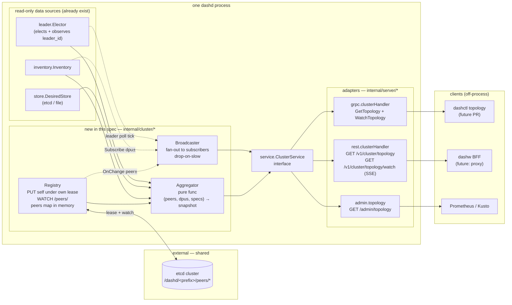
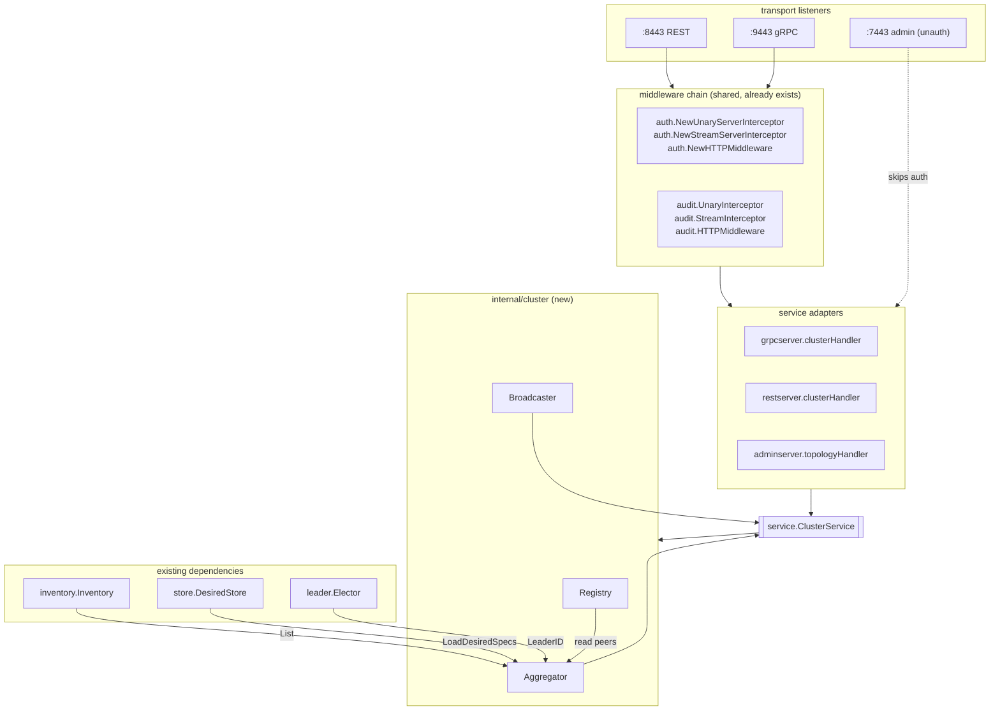
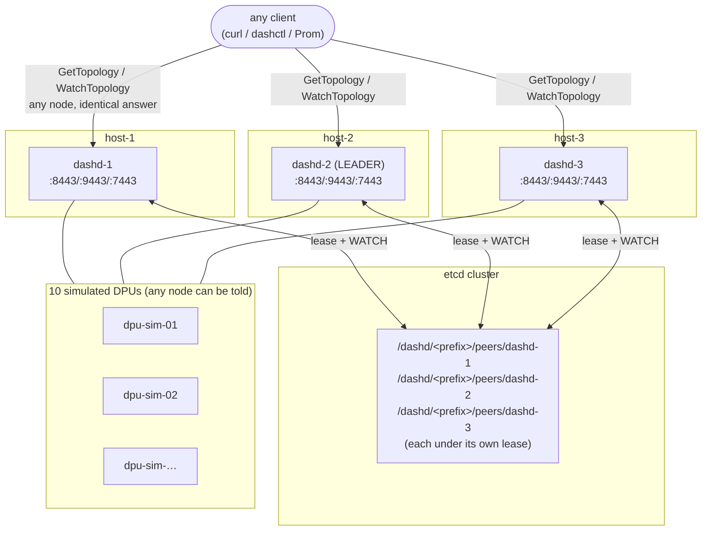
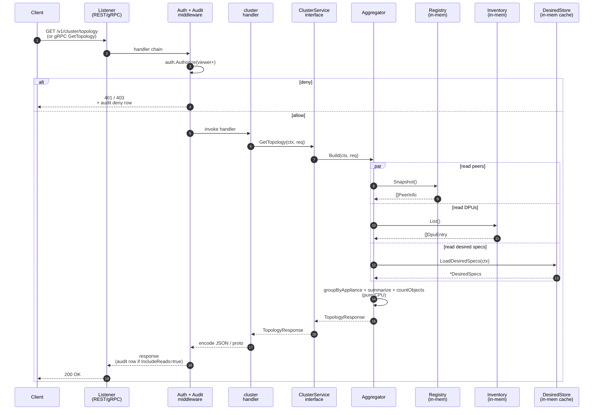
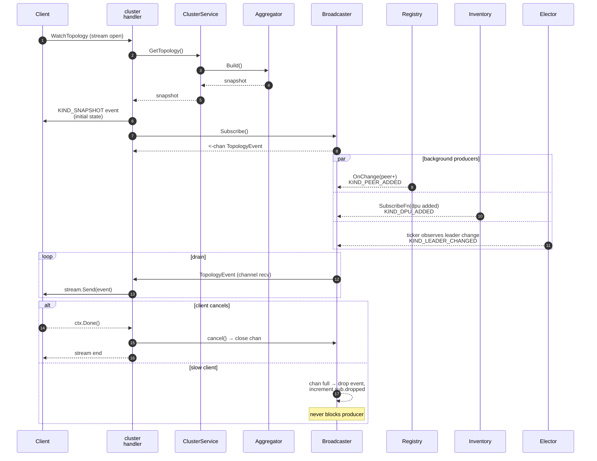
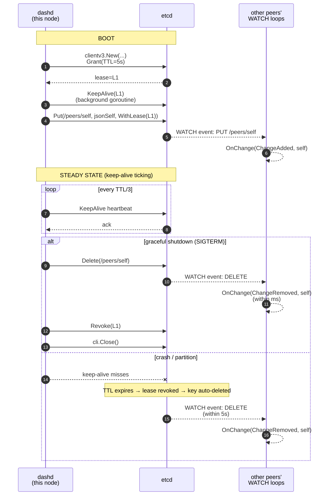

# Cluster Topology Service — Design Spec

**Status:** Approved (2026-06-12), in implementation
**Authors:** dashd core
**Scope:** dashd northbound `ClusterService` — fleet-topology snapshot + watch stream
**Phase:** PE-G6 (slots in immediately after PE-1 diagnostics)
**Cross-references:**
[features.md §9](features.md#9-diagnostics-pe-1) (Diagnostics, sibling read-only service) ·
[proto/dashcenter/v1/diagnostics.proto](../../proto/dashcenter/v1/diagnostics.proto) (pattern mirror) ·
[src/impl-go/console/internal/aggregation/aggregator.go](../../src/impl-go/console/internal/aggregation/aggregator.go) (current dashw aggregator that this spec consolidates into dashd)

---

## 1. Problem statement

There is no single dashd API that returns a complete view of the fleet
("who runs the controller cluster, where do they listen, which DPUs do
they manage, which ENIs live on each DPU, what's the leader, what's
healthy?"). Today an operator or client must:

1. Be told the REST/gRPC address of **every** dashd controller in
   advance (hand-rolled config).
2. Call `GET /admin/health` against each one and pick the leader from
   the responses.
3. Call `GET /v1/inventory` on the leader to enumerate DPUs.
4. Call `GET /admin/eni-placement` to find which ENIs live where.
5. Stitch all of the above into a tree in client code.

The dashw web console (`src/impl-go/console`) does exactly this and
exposes the result as `GET /api/console/service-topology`. The
implementation is **~400 LOC of parallel fan-out + map joins** living
in the BFF aggregator. Today this works only because dashw is the
single client and the operator configured `DashdClusterAddrs` per
deployment.

### Why this is a real problem for production

1. **Peer discovery is config-driven, not runtime-discovered.** A new
   dashd added to the cluster is invisible to every client until each
   client's `DashdClusterAddrs` config is updated. This breaks the
   "etcd is the source of truth" promise of HA mode.
2. **Topology is dashw-only.** `dashctl topology`, monitoring agents
   (Prometheus, Grafana, Kusto), and 3rd-party automation cannot
   consume it without either embedding the same fan-out logic or
   reaching back through the dashw BFF (which couples them to a
   browser-facing process).
3. **There is no push channel.** Clients that want live topology
   updates must poll — which scales linearly with client count and
   adds latency floor of one poll-interval to every leader change /
   DPU state transition / appliance add.
4. **The aggregator bypasses the auth chain.** dashw fans out to the
   admin port (`:7443`), which is unauthenticated by design. A
   future operator who needs RBAC on topology reads has nowhere to
   put it.
5. **Each node only knows its own `listen.*` addrs.** Even on a
   well-behaved cluster, a node cannot tell a client where its peers
   are reachable — only the elected `leader_id` string is in etcd.

The result: any new client (k8s operator, `dashctl topology`, a
custom CLI, a metrics exporter) re-implements the dashw aggregator,
in a language of its choice, against the same fragile pre-configured
peer list.

### Non-goals (this spec)

- Replacing dashw's `/api/console/service-topology` (that's a
  follow-up that collapses dashw to a thin proxy — see §9).
- Topology mutation (this is a read-only service).
- Adding new DPU-side telemetry (counters polling is PD-G5 / PE-3,
  unrelated).
- Replacing `/admin/health` or `/admin/leader` (kept for backward
  compat; the cluster service is the new richer surface).

---

## 2. Solution overview

Introduce a first-class `dashcenter.v1.ClusterService` with two RPCs:

| RPC | Type | Returns | Auth |
|---|---|---|---|
| `GetTopology(GetTopologyRequest)` | Unary | `TopologyResponse` (snapshot) | viewer+ |
| `WatchTopology(WatchTopologyRequest)` | Server-streaming | `stream TopologyEvent` | viewer+ |

Both RPCs run on **every node** (leader and follower) so any client
can hit any address. The implementation rests on three internal
packages:

| Package | Purpose | Lifecycle |
|---|---|---|
| `internal/cluster/registry` | Self-publish this node's `PeerInfo` (id, endpoints, version, started_at, labels) under its **own etcd lease**; watch the `/peers/*` prefix for the live peer map. | Starts after etcd backend is configured; stops on `SIGTERM` (lease is explicitly DELETEd, then revoked). |
| `internal/cluster/aggregator` | Pure function over (`registry.Snapshot()`, `inventory.List()`, `placement.LoadDesiredSpecs()`) → `TopologyResponse`. No IO. | Per-call. |
| `internal/server/grpc/cluster` | Adapter that registers the gRPC service + drives a `Broadcaster` for `WatchTopology` (mirrors `internal/ha/orchestrator/broadcaster.go`). REST gateway re-uses the same aggregator. | Owned by gRPC + REST servers. |

### Why this design is production-best

| Production property | How achieved |
|---|---|
| Peer discovery is **runtime, not config** | Every dashd writes its own `{node_id → endpoints}` to etcd under its lease; every dashd watches the prefix |
| Peer info **survives partition, dies on crash** | etcd lease keep-alive (5s TTL); dashd process death → lease drop within 1×TTL → peer vanishes from every node's view |
| **Independent failure** of cluster/topology vs leader election | Registry holds its OWN etcd client + lease; the elector keeps its own. Losing leadership does NOT remove this node from the peer registry |
| Topology read is **O(1) memory + O(N) lookup** | Local in-memory peers map, refreshed by etcd watch; no per-request fan-out |
| **Same auth + audit** as every other RPC | Registered on the existing `auth.NewUnaryServerInterceptor` / `audit.UnaryInterceptor` chain |
| **Versioned wire contract** | Proto file under `proto/dashcenter/v1/` — same governance as `ControlPlane`, `Diagnostics`, `HaService`, `MigrationService` |
| **No polling** for live updates | `WatchTopology` server-streaming RPC backed by `cluster.Broadcaster` (drop-on-slow-subscriber, mirrors HA broadcaster) |
| Works **without etcd** (single-node `mode: file`) | Registry degrades gracefully — has 1 peer (self), no watch, aggregator returns a 1-node `TopologyResponse` |
| **Backward-compatible** | `/admin/health`, `/admin/leader`, `/admin/inventory`, `/admin/eni-placement` unchanged. Older clients keep working unchanged. |
| Single source of truth | Once landed, dashw's `/api/console/service-topology` becomes a thin proxy (follow-up PR, not this spec) |

---

## 3. Architecture

### 3.1 Component block diagram

The runtime decomposes into seven small components per dashd process,
plus etcd (shared) and the clients (off-process). Solid arrows are
function calls / direct dependencies; dashed arrows are
publish/subscribe.



### 3.2 Per-process layered view

What runs where, from listener down to data, in a single dashd
process. The auth + audit layer is the same chain every other RPC
already passes through.



### 3.3 Top-level deployment diagram (3-node fleet)

How the components compose in a typical HA deployment. Every dashd
runs the **same** code; the etcd cluster is the only shared
coordination plane.



### 3.4 `GetTopology` request flow

Unary RPC. Sub-ms because no network IO is performed on the request
path — the registry holds peers in memory, the inventory is local,
the desired-store cache is in-process.



### 3.5 `WatchTopology` stream flow

Server-streaming RPC. First event is a SNAPSHOT (same payload as
`GetTopology`). Subsequent events are typed deltas pushed by the
broadcaster as the underlying data sources change. The broadcaster
never blocks the producer — slow clients lose events, fast clients
get every one.



### 3.6 Registry lease lifecycle

The lease is the entire correctness story for membership. This shows
all four transitions a single dashd's peer entry can make.



### 3.7 Peer state machine (as seen by every other node)

What a peer's entry looks like from the perspective of a remote
node's in-memory `peers` map.

```mermaid
stateDiagram-v2
    [*] --> Absent: process not yet booted
    Absent --> Present: WATCH PUT<br/>(remote dashd published)
    Present --> Present: WATCH PUT<br/>(labels/version updated)
    Present --> Absent: WATCH DELETE<br/>(graceful stop OR lease revoke)
    Absent --> [*]
    note right of Present: TopologyResponse.cluster.nodes\nincludes this peer
    note right of Absent: peer omitted from snapshot;\nsubscribers receive\nKIND_PEER_REMOVED
```



---

## 4. Data flow narratives

### Data flow — `GetTopology`

1. Client calls `GetTopology` over gRPC (any node) or `GET /v1/cluster/topology` (any node).
2. Auth interceptor admits viewer/operator/admin; audit middleware records the call.
3. Handler invokes `aggregator.Build(ctx, registry.Snapshot(), inventory, store)`.
4. Aggregator emits `TopologyResponse{Cluster, Appliances, Zones, Summary, ObjectCounts}` — pure-CPU.
5. Response returned. Whole path is sub-millisecond (no network IO; no etcd reads).

### Data flow — `WatchTopology`

1. Client opens a stream (any node).
2. Handler immediately sends `SNAPSHOT` event (= one `GetTopology` payload).
3. Handler subscribes to `cluster.Broadcaster`.
4. Whenever:
   - Registry sees a peer add/remove (etcd WATCH event), OR
   - Inventory `Subscribe` fires (DPU added/removed/state change), OR
   - The elector observes a leader change,
   the broadcaster publishes a typed `TopologyEvent` to all subscribers.
5. On slow subscriber: drop the event, increment `subscriber.dropped`, surface in `/admin/health`. **Never** block the broadcaster.
6. On client disconnect or ctx cancel: unsubscribe + close channel.

### Lifecycle — registry

```
boot:
    cli = clientv3.New(...)                  // dedicated client (own conn pool)
    lease = cli.Grant(ctx, TTL=5s)
    cli.KeepAlive(ctx, lease.ID)             // background goroutine
    cli.Put(ctx, /peers/<self_id>, jsonSelf, WithLease(lease.ID))
    wc = cli.Watch(ctx, /peers/, WithPrefix())
    spawn watchLoop(wc): refresh in-memory peers map, fire OnChange

graceful shutdown (SIGTERM):
    cli.Delete(ctx, /peers/<self_id>)        // explicit, so peers see us
                                              // disappear instantly instead
                                              // of waiting TTL
    cli.Revoke(ctx, lease.ID)                 // belt-and-suspenders
    wc.cancel()
    cli.Close()

crash / network partition:
    keep-alive misses → etcd revokes lease within TTL → key auto-deletes
                       → every peer's WATCH fires → peers map updated
```

---

## 5. Wire contract

```proto
syntax = "proto3";
package dashcenter.v1;
option go_package = "github.com/rashmirrout/DashCenter/src/impl-go/gen/go/dashcenter/v1;dashcenterv1";

import "google/protobuf/timestamp.proto";

service ClusterService {
  // Returns the current fleet topology snapshot. Read-only.
  // Runs on any node (leader or follower). Auth: viewer+.
  rpc GetTopology(GetTopologyRequest) returns (TopologyResponse);

  // Server-streams the snapshot, then emits a TopologyEvent per
  // membership / leader / DPU-state change. Auth: viewer+.
  // First event = SNAPSHOT (full payload). Subsequent events = deltas.
  rpc WatchTopology(WatchTopologyRequest) returns (stream TopologyEvent);
}

// ── Request envelopes ─────────────────────────────────────────────

message GetTopologyRequest {
  // When true the response includes per-DPU ENI arrays (default false:
  // ENI counts only, no names). Lets cheap clients keep payloads small.
  bool include_enis = 1;
}

message WatchTopologyRequest {
  // Same toggle as GetTopologyRequest.include_enis. Applies to the
  // initial SNAPSHOT and every subsequent delta that references ENIs.
  bool include_enis = 1;
}

// ── Snapshot envelope ─────────────────────────────────────────────

message TopologyResponse {
  google.protobuf.Timestamp computed_at = 1;
  ClusterInfo cluster = 2;                       // controllers
  repeated ApplianceInfo appliances = 3;         // physical rack rollup
  repeated ZoneInfo zones = 4;                   // AZ rollup
  TopologySummary summary = 5;                   // fleet-wide rollup
  map<string, NamespaceObjectCounts> objects = 6; // namespace -> per-kind counts
}

// ── Controllers / cluster ─────────────────────────────────────────

message ClusterInfo {
  bool healthy = 1;
  string leader_id = 2;     // empty = no leader (split-brain / election in progress)
  int32 node_count = 3;
  repeated ClusterNodeInfo nodes = 4;
}

message ClusterNodeInfo {
  string node_id = 1;
  string rest_addr = 2;     // e.g. "dashd-1:8443" or "https://1.2.3.4:8443"
  string grpc_addr = 3;     // e.g. "dashd-1:9443"
  string admin_addr = 4;    // e.g. "http://dashd-1:7443"
  string version = 5;       // dashd version string
  string build_sha = 6;     // optional; empty until build pipeline injects
  google.protobuf.Timestamp started_at = 7;
  bool is_leader = 8;
  map<string, string> labels = 9;  // operator-supplied
}

// ── Appliances / DPUs / ENIs ──────────────────────────────────────

message ApplianceInfo {
  string id = 1;            // from inventory label "rack" / appliance_id
  string zone = 2;
  string tier = 3;
  repeated DpuTopInfo dpus = 4;
}

message DpuTopInfo {
  string id = 1;
  int32 slot = 2;
  string state = 3;         // "DPU_STATE_UP" | ... — DpuState enum name
  google.protobuf.Timestamp last_seen = 4;
  int32 eni_count = 5;
  bool cordoned = 6;
  repeated EniTopInfo enis = 7;  // omitted unless include_enis=true
}

message EniTopInfo {
  string name = 1;
  string namespace = 2;
  string vnet_name = 3;
  string mac_address = 4;
  string admin_state = 5;
}

// ── Rollups ───────────────────────────────────────────────────────

message ZoneInfo {
  string zone = 1;
  int32 appliance_count = 2;
  int32 dpu_count = 3;
  int32 eni_count = 4;
}

message TopologySummary {
  int32 total_nodes = 1;
  int32 total_appliances = 2;
  int32 total_dpus = 3;
  int32 total_enis = 4;
  int32 healthy_dpus = 5;
  int32 degraded_dpus = 6;
  int32 offline_dpus = 7;
  int32 cordoned_dpus = 8;
}

message NamespaceObjectCounts {
  int32 vnets = 1;
  int32 enis = 2;
  int32 vnet_mappings = 3;
  int32 acl_policies = 4;
  int32 route_policies = 5;
  int32 ha_sets = 6;
  int32 service_tunnels = 7;
}

// ── Stream events ─────────────────────────────────────────────────

message TopologyEvent {
  enum Kind {
    KIND_UNSPECIFIED = 0;
    KIND_SNAPSHOT     = 1;  // initial: full TopologyResponse
    KIND_PEER_ADDED   = 2;
    KIND_PEER_REMOVED = 3;
    KIND_PEER_UPDATED = 4;  // labels / endpoints changed
    KIND_LEADER_CHANGED = 5;
    KIND_DPU_STATE     = 6; // single DPU state transition
    KIND_DPU_ADDED     = 7;
    KIND_DPU_REMOVED   = 8;
  }
  Kind kind = 1;
  google.protobuf.Timestamp ts = 2;

  // Exactly one of:
  oneof body {
    TopologyResponse snapshot = 10;
    ClusterNodeInfo  peer     = 11;
    string           old_leader_id = 12;  // for KIND_LEADER_CHANGED
    DpuTopInfo       dpu      = 13;
  }
  string new_leader_id = 14;  // for KIND_LEADER_CHANGED, paired with old_leader_id
}
```

### Stable wire conventions

- **Field numbering** is the same convention used by `diagnostics.proto`
  and `ha.proto`: scalars first, message fields next, repeated fields
  last. Reserved numbers TBD on first breaking change.
- **`map<string, NamespaceObjectCounts>`** instead of `repeated`
  envelope; clients iterate by namespace key. The dashw aggregator
  already produces this shape; mirroring keeps the BFF proxy
  collapse trivial.
- **`labels map<string, string>`** on every node + DPU level for
  operator-supplied tags (region, role, cost-centre, etc.) without
  proto changes.

---

## 6. Internal implementation

### 6.1 `internal/cluster/registry.go`

```go
package cluster

import (
    "context"
    "encoding/json"
    "log/slog"
    "sync"
    "time"

    clientv3 "go.etcd.io/etcd/client/v3"
)

// PeerInfo is the payload published under /peers/<node_id>.
type PeerInfo struct {
    NodeID    string            `json:"node_id"`
    RESTAddr  string            `json:"rest_addr"`
    GRPCAddr  string            `json:"grpc_addr"`
    AdminAddr string            `json:"admin_addr"`
    Version   string            `json:"version"`
    BuildSHA  string            `json:"build_sha,omitempty"`
    StartedAt time.Time         `json:"started_at"`
    Labels    map[string]string `json:"labels,omitempty"`
}

// Config is the etcd connection + identity needed by Open.
type Config struct {
    Endpoints   []string
    KeyPrefix   string        // e.g. "/dashd/<cluster>/peers/"
    DialTimeout time.Duration // default 5s
    LeaseTTL    time.Duration // default 8s
    TLS         *TLSConfig    // optional; same fields as leader.EtcdConfig
}

// ChangeKind enumerates the events the registry emits.
type ChangeKind int
const (
    ChangeAdded ChangeKind = iota + 1
    ChangeRemoved
    ChangeUpdated
)

// OnChange is invoked from the watch goroutine (single writer). Implementations
// MUST be non-blocking — long work belongs on the caller's own goroutine.
type OnChange func(kind ChangeKind, peer PeerInfo)

// Registry is the live peer membership.
type Registry struct {
    cfg    Config
    self   PeerInfo

    mu     sync.RWMutex
    peers  map[string]PeerInfo
    subs   []OnChange

    cli    *clientv3.Client
    lease  clientv3.LeaseID
    cancel context.CancelFunc
}

// Open dials etcd, grants a lease, publishes self, starts the watch.
// Returns an error if the initial connect/put fails.
func Open(ctx context.Context, cfg Config, self PeerInfo) (*Registry, error) { ... }

// Snapshot returns a copy of the current peer map. Safe for concurrent use.
func (r *Registry) Snapshot() []PeerInfo { ... }

// Subscribe adds an OnChange callback.
func (r *Registry) Subscribe(fn OnChange) { ... }

// Close explicitly DELETEs self from etcd then revokes the lease and closes
// the client. Idempotent.
func (r *Registry) Close() error { ... }
```

#### Failure-mode behaviour

| Failure | Effect | Recovery |
|---|---|---|
| etcd unreachable at `Open` | `Open` returns error; main.go logs warning and continues with **single-peer registry** (self only). Topology still works on this one node. | Auto-reconnect on next `Open` (next dashd restart). |
| etcd reachable at boot, then unreachable | etcd client auto-reconnects (clientv3 default); KeepAlive will resume once etcd is back. During outage, peers see THIS node disappear after TTL; this node sees the etcd-side peer map go stale (but its in-memory snapshot persists). | Watch resumes, peers re-populate. |
| Crash | Lease expires within TTL → key auto-deleted → peers see `ChangeRemoved`. | None needed. |
| Graceful stop | `Close()` explicitly DELETEs `/peers/<self>` then revokes lease; peers see `ChangeRemoved` within one watch tick (~ms). | None. |

### 6.2 `internal/cluster/aggregator.go`

Pure, deterministic function over the three local data sources.
Algorithm mirrors `console/internal/aggregation/aggregator.go::ServiceTopology`
but **without** the parallel HTTP fan-out (no IO; the registry already
holds the peer map locally).

```go
type Aggregator struct {
    registry *Registry
    inv      *inventory.Inventory
    store    store.DesiredStore
    elector  LeaderObserver        // for cluster.leader_id
    version  string                // dashd version
    nodeID   string                // self
}

func (a *Aggregator) Build(ctx context.Context, req *dashcenterv1.GetTopologyRequest) (*dashcenterv1.TopologyResponse, error) {
    peers := a.registry.Snapshot()
    dpus  := a.inv.List()
    specs, err := placement.LoadDesiredSpecs(ctx, a.store)
    if err != nil { return nil, fmt.Errorf("aggregator: load desired: %w", err) }

    cluster := buildCluster(peers, a.elector.LeaderID(), a.nodeID)
    appliances, zones := groupByAppliance(dpus, req.IncludeEnis, specs)
    summary := summarize(peers, appliances)
    objects := countObjects(specs)

    return &dashcenterv1.TopologyResponse{
        ComputedAt: timestamppb.Now(),
        Cluster:    cluster,
        Appliances: appliances,
        Zones:      zones,
        Summary:    summary,
        Objects:    objects,
    }, nil
}
```

**Determinism guarantee:** every list (`Cluster.Nodes`, `Appliances`,
each `Appliances[i].Dpus`, etc.) is sorted by stable key so two
back-to-back calls on identical inputs return byte-identical bodies.
This is important for clients that compute diffs.

### 6.3 `internal/cluster/broadcaster.go`

Mirrors `internal/ha/orchestrator/broadcaster.go` (~150 LOC).
Per-subscriber buffered channel (default 32), drop-on-full, never
blocks the producer. Wired by:

- `Registry.Subscribe(fn)` — peer adds/removes → `KIND_PEER_*` events
- `inventory.Inventory.Subscribe(fn)` — DPU adds/removes → `KIND_DPU_*` events
- A 1s ticker watching `elector.LeaderID()` for changes → `KIND_LEADER_CHANGED` events

### 6.4 `internal/server/grpc/cluster.go`

Same shape as `internal/server/grpc/diagnostics.go`:

```go
type clusterHandler struct {
    dashcenterv1.UnimplementedClusterServiceServer
    svc service.ClusterService
}

func registerCluster(gs *grpc.Server, svc service.ClusterService) {
    if svc == nil { return }   // optional; absent ⇒ codes.Unimplemented
    dashcenterv1.RegisterClusterServiceServer(gs, &clusterHandler{svc: svc})
}

func (h *clusterHandler) GetTopology(ctx context.Context, req *dashcenterv1.GetTopologyRequest) (*dashcenterv1.TopologyResponse, error) { ... }

func (h *clusterHandler) WatchTopology(req *dashcenterv1.WatchTopologyRequest, stream grpc.ServerStreamingServer[dashcenterv1.TopologyEvent]) error {
    // 1. Send initial SNAPSHOT
    snap, err := h.svc.GetTopology(stream.Context(), &dashcenterv1.GetTopologyRequest{IncludeEnis: req.IncludeEnis})
    if err != nil { return serviceErrToStatus(err) }
    if err := stream.Send(&dashcenterv1.TopologyEvent{Kind: KIND_SNAPSHOT, Body: &TopologyEvent_Snapshot{Snapshot: snap}}); err != nil { return err }

    // 2. Subscribe + drain
    ch, cancel := h.svc.Subscribe()
    defer cancel()
    for {
        select {
        case <-stream.Context().Done(): return stream.Context().Err()
        case ev, ok := <-ch:
            if !ok { return nil }   // broadcaster closed
            if err := stream.Send(ev); err != nil { return err }
        }
    }
}
```

### 6.5 REST surface

| Path | Method | Notes |
|---|---|---|
| `GET /v1/cluster/topology` | unary | Body = `TopologyResponse` (proto-json). Query param `?include_enis=true`. |
| `GET /v1/cluster/topology/watch` | SSE | `data:` lines = JSON-encoded `TopologyEvent`. Wires through the same auth middleware. |
| `GET /admin/topology` | unary | **Convenience on admin port (:7443) — unauthenticated**. Same body. For operator scripts that already trust the admin network. |

### 6.6 RBAC additions (`internal/auth/rpcs.go`)

```go
registerR("/dashcenter.v1.ClusterService/GetTopology")
registerR("/dashcenter.v1.ClusterService/WatchTopology")
```

Both read-only (viewer/operator/admin). No write paths in this
service.

---

## 7. Testing strategy

| Layer | Test | Where |
|---|---|---|
| **Registry, unit** | Open against embedded etcd → assert self appears in `/peers/<id>` → assert KV value parses back to `PeerInfo` | `internal/cluster/registry_test.go` |
| **Registry, lease loss** | Open → kill the embedded etcd → wait `>TTL` → bring back → assert reconnect + key re-PUT | `internal/cluster/registry_test.go` |
| **Registry, OnChange** | 2 registries on the same etcd → add → assert callback fires `ChangeAdded` on the other; remove → `ChangeRemoved` | `internal/cluster/registry_test.go` |
| **Aggregator, unit** | Mock registry/inventory/store → assert deterministic ordering, summary math, object counts. Table tests for empty fleet / partial labels / unknown appliance | `internal/cluster/aggregator_test.go` |
| **Broadcaster, unit** | Subscribe → publish 100 events → assert all received in order; slow subscriber → assert drop, no blocking | `internal/cluster/broadcaster_test.go` |
| **gRPC handler, unit** | bufconn server → GetTopology returns; WatchTopology delivers SNAPSHOT then a follow-up event after a synthetic Publish | `internal/server/grpc/cluster_test.go` |
| **REST handler, unit** | `httptest.NewServer` over the router → GET /v1/cluster/topology returns expected JSON | `internal/server/rest/cluster_test.go` |
| **Live e2e** | Provision 05-full-console fleet → curl `GET /v1/cluster/topology` from each node → assert 3 peers, 10 DPUs, expected ENI count | manual + scripted lab |

Coverage target: 85%+ on `internal/cluster/*` (matches the
`internal/flow` PE-1 bar).

---

## 8. Audit, observability, security

- **Audit:** every `GetTopology` and `WatchTopology` invocation is
  audited via the existing `audit.InterceptorConfig{IncludeReads:false}`
  default — read-only RPCs are NOT auto-logged. Operators who need
  read audit can flip `IncludeReads:true` in `dashd.yaml` (a global
  toggle that already exists).
- **Audit on deny:** the new `auth.DenyAuditor` (landed 2026-06-11)
  records 401 / 403 attempts against these methods automatically.
- **Metrics:** `cluster_registry_peers_total{node_id}` gauge,
  `cluster_registry_change_events_total{kind}` counter,
  `cluster_broadcaster_subscribers_total` gauge,
  `cluster_broadcaster_dropped_total` counter. Wired through the same
  Prometheus exposition surface the audit + capacity packages use.
- **Tracing:** add an OpenTelemetry span around `aggregator.Build`
  so slow lookups are observable (today the path is sub-ms, but a
  fleet of 1000 ENIs may stretch — premature optimisation guard).

---

## 9. Rollout & compatibility

- **Single-node clusters (`mode: file`, no etcd):** registry opens
  in "self-only" mode — no etcd client, no watch, just an in-memory
  map containing the one peer. Aggregator + handlers work unchanged.
  Topology becomes a richer `/admin/health`.
- **Multi-node etcd clusters:** as soon as one node ships the new
  code, it begins publishing its peer record. Other (older) nodes
  ignore the keys (no code reads them). The first time ALL nodes
  ship the new code, every node sees every peer.
- **Wire stability:** proto fields ≤10 are stable; field 11+ may be
  added freely (additive); breaking changes require a new method
  name (`GetTopologyV2`).
- **REST stability:** path is `/v1/cluster/...` — same `/v1/`
  prefix as the rest of the API surface; URL is permanent.

---

## 10. Follow-up work (out of scope for this PR)

These are NOT part of the patch this spec describes:

1. **dashw aggregator collapse** — replace
   `console/internal/aggregation/aggregator.go::ServiceTopology` with
   a thin `GET /api/console/service-topology` → `dashd.ClusterService.GetTopology`
   proxy (translates proto-JSON 1:1). Deletes ~300 LOC + the
   `DashdClusterAddrs` config knob.
2. **`dashctl topology [--follow]`** — a CLI client over the new gRPC
   surface. Falls out naturally; ~120 LOC.
3. **Topology UI redesign in dashw** — operator-facing view that
   consumes `WatchTopology` directly (no polling).
4. **`PeerInfo.health_status` field** — when PD-G5 lands per-node
   health beyond "alive", publish into the registry payload.
5. **Etcd peer endpoints surfaced** — if storage backend is etcd,
   expose `etcd.MemberList` URLs as a separate `EtcdInfo` block.

---

## 11. Acceptance criteria

This spec is satisfied when **all** of the following are true:

- [ ] `proto/dashcenter/v1/cluster.proto` exists and `make protos` regenerates `gen/go/dashcenter/v1/cluster*.pb.go` cleanly.
- [ ] `internal/cluster/{registry,aggregator,broadcaster}.go` exist with the public APIs documented above, ≥85% unit test coverage on each.
- [ ] `internal/server/grpc/cluster.go` registers `ClusterServiceServer`; `internal/server/rest/cluster.go` registers `GET /v1/cluster/topology[/watch]`; `internal/server/admin/topology.go` registers `GET /admin/topology`.
- [ ] `internal/auth/rpcs.go` lists both methods as `registerR(...)`.
- [ ] `main.go` opens the registry after the elector, plumbs the aggregator into both server `Options` structs, and closes it on shutdown.
- [ ] All unit tests pass; full `go test ./...` from `src/impl-go/dashd` green.
- [ ] Live e2e against 05-full-console: `curl http://127.0.0.1:28453/v1/cluster/topology | jq .cluster.nodes | length` returns `3`, `summary.total_dpus` returns `10`, `objects.default.vnets` returns `14`.
- [ ] Adding a 4th dashd at runtime (`docker compose up -d dashd-4`) causes every existing peer's `/v1/cluster/topology` to show 4 nodes within one TTL (5s).
- [ ] Stopping `dashd-1` causes every other peer's `/v1/cluster/topology` to drop it from `cluster.nodes` within one TTL.
- [ ] Audit log records every deny (401/403) and every `WatchTopology` subscribe (when `audit.include_reads=true`).
- [ ] [features.md](features.md) §11 quick-reference index gets the four new paths.

---

## 12. Open questions

1. **TTL** — defaulting to **5s** (etcd best practice for `concurrency.Session` is 5–15s; 5s is the lowest etcd allows without burning CPU on keep-alives). Acceptable for our blast-radius targets. Revisit if k8s liveness probes become noisier.
2. **`include_enis=true` payload size** — at 10 DPUs × ~4 ENIs each, payload is ~5KB. At 100 DPUs × 100 ENIs the payload is ~500KB. We document `include_enis=false` as the default and add `?label=` filtering in a follow-up if anyone actually hits the scale.
3. **etcd lease coupling with leader-elector lease?** No — explicitly decoupled (each holds its own lease) so leadership loss does NOT depublish the peer entry. This is documented in §2 ("Why this design is production-best") and verified by a dedicated test.

---

## 13. Implementation order

Phases land as a single PR in this order to keep `main` green at every step:

1. **P1** — `internal/cluster/registry.go` + 6 unit tests (uses `embed/v3` etcd; no other code touched)
2. **P2** — `proto/dashcenter/v1/cluster.proto` + `make protos`
3. **P3** — `internal/cluster/aggregator.go` + `internal/cluster/broadcaster.go` + tests
4. **P4** — `internal/service/cluster.go` (transport-agnostic interface) + `internal/server/grpc/cluster.go` + bufconn test
5. **P5** — `internal/server/rest/cluster.go` + `internal/server/admin/topology.go` + httptest tests
6. **P6** — `internal/auth/rpcs.go` rows + `main.go` wiring
7. **P7** — Live e2e + cross-link in [features.md](features.md) §11

Each phase has its own commit so a reverter can stop at any clean boundary.
