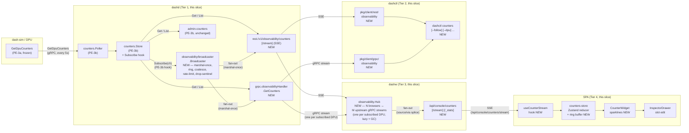

# Counter Streaming — `ObservabilityService.GetCounters` end-to-end

> **Audience**: dashd / dashw / dashctl maintainers, SREs running
> production fleets, SPA contributors adding live-data widgets,
> operators wiring sparkline dashboards or alerting against
> per-DPU counters.
> **Scope**: the **streaming half** of the counter pipeline. The
> producer half (sim-side emission + dashd-side polling + per-DPU
> cache) shipped in PE-3a + PE-3b; this doc covers the consumer
> path from cache → gRPC stream → REST/SSE → dashw multiplexer →
> SPA sparkline. Closes phase gate **PD-G5** (`Phase 2 · PD`
> Security & Observability → 5/5) and tracker row [#22](../next-actions.md).
> **Companion docs**:
> [dash-sim-counter-rollups.md](dash-sim-counter-rollups.md)
> (PE-3a — sim emission),
> [topology-streaming-design.md](topology-streaming-design.md)
> (PE-G7 — the broadcaster + Hub pattern this doc mirrors),
> [sse-event-provenance.md](sse-event-provenance.md)
> (PE-G7.1 — `source` + `via` stamping reused here),
> [features.md](features.md) (REST/SSE reference).
> **Status**: ✅ Complete — Started 2026-06-14, Closed 2026-06-14. Tier 1 (dashd) ✅ → Tier 2 (dashctl) ✅ → Tier 3 (dashw) ✅ → Tier 4 (SPA) ✅ → Tier 5 (cross-cutting) ✅. Closes phase gate **PD-G5** and tracker [#22](../next-actions.md). Live e2e validated in [05-full-console](../../deploy/test-setup/05-full-console/) — see §9.

---

## Table of contents

1. [Problem statement](#1-problem-statement)
2. [Goals & non-goals](#2-goals--non-goals)
3. [Architecture](#3-architecture)
4. [Wire contract](#4-wire-contract) — *TBD when Tier 1.3/1.4 lands*
5. [Implementation](#5-implementation) — *TBD per-tier as each lands*
6. [Configuration](#6-configuration) — *TBD when config block lands*
7. [Operator UX](#7-operator-ux) — *TBD when SPA + dashctl land*
8. [Test strategy](#8-test-strategy) — *TBD as tests accumulate*
9. [Live e2e](#9-live-e2e) — *TBD at Tier 5*
10. [Future Scopes](#10-future-scopes) — *seeded; ≥3 required at close*

---

## 1. Problem statement

PE-3a shipped per-DPU + per-ENI + per-VNET counter rollups from
dash-sim. PE-3b shipped the dashd-side ingestion: a `Poller` walks
inventory every 5s (configurable), calls each DPU's `GetDpuCounters`,
maps the generic sim shape into typed `dashcenter.v1.CounterReport`
records, and `Put()`s them into a per-DPU `Store`. Three admin
endpoints (`GET /admin/counters[?dpu=ID]`,
`POST /admin/counters/poll-interval`, `POST /admin/counters/enable`)
let operators inspect + tune at runtime.

What's missing — and what blocks the `dashd-2.0.0` GA tag — is
**every consumer surface above the admin endpoint**:

1. **No public gRPC stream.** `dashcenter.v1.ObservabilityService.GetCounters(CounterRequest) returns (stream CounterReport)` has been in the proto since alpha but the dashd handler still returns `codes.Unimplemented` (it inherits the default from `UnimplementedObservabilityServiceServer`). Any operator or third-party tool that wants live counters has to call the admin endpoint in a polling loop — defeating the point of having a streaming API.

2. **No browser surface.** The `/topology-v2` SPA shows DPU lifecycle (state, leader, cordoned) but not load: an operator can see *that* a DPU is alive, not *how busy* it is. There is no widget anywhere in the SPA that visualises packet rate, drop rate, or flow-table size as it changes.

3. **No CLI parity with the browser.** `dashctl counters [--follow]` does not exist. The PE-G7.1 polish slice taught us that **CLI parity matters**: every operator-facing live data path in the browser must also be reachable from a terminal so SREs can paste output into incident channels, pipe through `jq`, drive synthetic monitoring.

4. **No multiplexer between browsers and dashd.** Per §7 of [agent-operating-discipline.md](../agent-operating-discipline.md) the browser MUST NEVER talk to dashd directly. PE-G7 solved this for cluster topology with dashw's `cluster.Hub`. Counters need the parallel structure or browsers will be forced to violate the contract.

5. **The existing PE-3b store has a deliberately empty consumer.** Read the package comment on [src/impl-go/dashd/internal/counters/store.go](../../src/impl-go/dashd/internal/counters/store.go) — `Subscribe(ch chan<- string) func()` was added in PE-3b explicitly *"to drive `ObservabilityService.GetCounters` streaming … PE-3b only wires the publisher so subscribers in PE-3c plug in without store rework."* The hook is sitting there waiting.

Operator pain today, with PE-3b shipped:

> "I want to see live counters for the DPUs my ENIs are landing on. I can `curl /admin/counters?dpu=…` in a loop, but that's a 5-second-resolution snapshot, has no auth (admin port is internal-only), and gives me no way to know when an event was dropped. I want a sparkline in the browser and a `--follow` flag on dashctl."

That's PD-G5.

---

## 2. Goals & non-goals

### 2.1 Goals

- **G1**: Implement `ObservabilityService.GetCounters` on dashd as a real server-streaming RPC over the existing `counters.Store.Subscribe` hook, with the same hardening as the PE-G7 cluster broadcaster: marshal-once-send-many, drop-on-slow with a `KIND_DROPPED` sentinel, per-subject + global subscriber caps, leaky-bucket rate limit, coalescing window, single global keepalive ticker, ring buffer for `Last-Event-ID` resume. **Wire envelope is the new `CounterEvent` wrapper** that mirrors PE-G7's `TopologyEvent` exactly (additive proto change — see §3.3.1).
- **G2**: Expose the same surface over REST/SSE at `GET /v1/observability/counters` (snapshot) + `GET /v1/observability/counters/stream` (SSE, with `Last-Event-ID` header + `?last_event_id=` query parity per PE-G7).
- **G3**: Ship `dashctl counters [--dpu=ID...] [--follow] [--interval=DURATION] [-o table|json|csv]` with **both REST and gRPC backends** (user direction: gRPC backend is required, not deferred). Backend selector follows existing dashctl convention.
- **G4**: Ship a dashw counter `Hub` multiplexer mirroring the PE-G7 cluster Hub structurally, with **one upstream gRPC stream per subscribed DPU**, lazy-opened on first subscriber and GC'd after `upstream_idle_gc` once the last subscriber leaves. Source + via stamping per PE-G7.1.
- **G5**: Ship an SPA `CounterWidget` rendered in the `/topology-v2` inspector drawer when a DPU is selected: top-line numbers + 60s sparklines for `vxlan_decap`, `vxlan_encap`, `drop_acl_in`, `flow_table_size`. Auto-scale per counter with a 5s smoothing window.
- **G6**: Make every tunable knob **configurable**, with sane defaults and admin-endpoint runtime overrides where safe (interval, enabled, per-DPU overrides). User direction: ultra-flexibility.
- **G7**: 100 % unit-test coverage on every new file. Real-dependency integration tests for every cross-module boundary (`-race` enabled).
- **G8**: Preserve the **marshal-once invariant** (§8 of agent-operating-discipline.md) on both dashd broadcaster and dashw Hub fan-out paths.
- **G9**: Preserve the **browser → dashw → dashd contract** (§7). Zero SPA → dashd direct calls.

### 2.2 Non-goals

- **NG1**: We do NOT introduce a one-off sentinel-in-payload encoding. The codebase has a first-class streaming convention (PE-G7 `TopologyEvent` wrapper with a `Kind` enum + `Notice` body + `event_id` cursor; `MigrationBundleChunk` with `oneof` envelope). `GetCounters` mirrors that convention exactly via a new `CounterEvent` wrapper — see §3.3. Encoding sentinels by stuffing magic keys into the payload was an early-draft mistake (recorded under §10.11 of [agent-operating-discipline.md](../agent-operating-discipline.md)).
- **NG2**: We do NOT add **alerting**, **threshold-based events**, or **per-flow counters** in this slice. Alerting is a Future Scope; per-flow is a follow-up to PE-3a (deferred there).
- **NG3**: We do NOT replace the admin endpoints from PE-3b. They remain as the troubleshooting backdoor; the public surfaces are additive.
- **NG4**: We do NOT extract the broadcaster pattern shared between `internal/cluster/` and `internal/observability/broadcaster/` here. That extraction is **scheduled** into the post-GA cleanup window (T1.3 in [recommended-postGA-cleanup.md](../recommended-postGA-cleanup.md)) where it gets dedicated review attention per §4.5.
- **NG5**: We do NOT change `dash-sim` or `dash-sim-client`. PE-3a is upstream of this work and is frozen for the slice.
- **NG6**: We do NOT add **WebSocket** as a parallel transport. SSE is the canonical browser-side transport for this surface (matches PE-G7 default; the WS path PE-G7 carries is unused in production and stays out-of-band here).

---

## 3. Architecture

### 3.1 Tier diagram



Browsers connect ONLY to `/api/console/counters*` on dashw. dashctl
connects ONLY to dashd (either REST or gRPC, operator choice). admin
endpoints from PE-3b remain reachable on dashd's admin port for
internal troubleshooting and never appear in this slice's diagram
above as anything other than a peer consumer of the same store.

### 3.2 Why a separate broadcaster (not just `Store.Subscribe`)

`counters.Store.Subscribe(ch chan<- string) func()` is the **producer
half**: it tells subscribers "DPU X's entry changed". That's the right
shape for a publisher but the wrong shape for a transport:

- Subscribers receive only the **id** of the changed DPU. Each would
  have to `Get(id)` from the store, protojson-Marshal the result, and
  send it. With N subscribers that's N marshal calls per Put — exactly
  the D2 defect PE-G7 killed for cluster topology.
- The store has no concept of `event_id`, no ring buffer, no
  coalescing, no rate limit, no `DROPPED` sentinel, no per-subject
  caps. Every subscriber would reimplement these and drift apart.
- The store has no concept of "subjects" (auth identities). Cap
  enforcement requires it.

So **`observability/broadcaster.Broadcaster` sits between the store
and every consumer** and is the only thing that ever calls
`protojson.Marshal` on a `CounterReport`. Every consumer (gRPC handler,
REST/SSE handler) calls `Broadcaster.Subscribe(opts)` and receives
`*Frame{Event, JSON}` where `JSON` is the **shared byte slice**.

This is structurally identical to PE-G7's `cluster.Broadcaster`. The
similarity is *deliberate* and the second instance is what justifies
extracting a generic broadcaster in the post-GA cleanup window (T1.3).

### 3.3 dashd broadcaster — anatomy + wire envelope

#### 3.3.1 Wire envelope — `CounterEvent` (Pattern A, mirrors `TopologyEvent`)

**§0.2.1 Pattern reconnaissance**: every long-lived high-rate fan-out
stream in this repo uses the same shape: a wrapper message with a
`Kind` enum, a `oneof body`, a monotonic `event_id`, a `ts` timestamp,
and a `Notice` body for sentinels. PE-G7's
[`TopologyEvent`](../../proto/dashcenter/v1/cluster.proto#L234-L290)
is the exemplar. `GetCounters` mirrors it exactly:

```proto
// proto/dashcenter/v1/observability.proto — additive change
import "dashcenter/v1/cluster.proto";  // for Notice (consolidation deferred)

service ObservabilityService {
  ...
  rpc GetCounters(CounterRequest) returns (stream CounterEvent);  // CHANGED
}

message CounterRequest {
  repeated string dpu_ids       = 1;  // existing
  bool   follow                 = 2;  // existing
  int32  interval_seconds       = 3;  // existing
  uint64 resume_after_event_id  = 4;  // NEW — matches WatchTopologyRequest
}

message CounterEvent {
  enum Kind {
    KIND_UNSPECIFIED   = 0;
    KIND_SNAPSHOT      = 1;   // body = report; one per DPU on subscribe
    KIND_REPORT        = 2;   // body = report; per-DPU delta
    KIND_KEEPALIVE     = 9;   // body = notice (optional)
    KIND_DROPPED       = 10;  // body = notice (dropped_count)
    KIND_RATE_LIMITED  = 11;  // body = notice (suppressed_count)
    KIND_RESYNC        = 12;  // body = notice (current_event_id)
  }
  Kind kind                              = 1;
  google.protobuf.Timestamp ts           = 2;
  uint64 event_id                        = 3;
  oneof body {
    CounterReport report                 = 10;
    dashcenter.v1.Notice notice          = 11;
  }
}
```

**Decision matrix** (from planning):

| Aspect | `CounterEvent` wrapper (chosen — Pattern A) | `_meta.*` keys inside `CounterReport` (rejected) |
|---|---|---|
| Codebase consistency | ✅ Matches `TopologyEvent` / `MigrationBundleChunk` | ❌ One-off; divergence tax forever |
| Type safety in Go | ✅ Sentinel kind is an enum; compile-time mistakes caught | ❌ String keys; typos break silently |
| SPA TypeScript ergonomics | ✅ Discriminated union on `kind` matches topology-v2 reducer | ❌ Counter-render code must filter `_meta.*` from sparkline math |
| Reverse-proxy friendliness | ✅ `event_id` first-class field | ⚠️ Have to fish it out of `_meta` |
| Prometheus scrape footgun | ✅ None | ❌ Downstream scraping all counter names sees fake `_meta.dropped` series |
| Cost of proto change | One additive proto edit + regen | None |
| Cost of NG1 violation | NG1 was wrong; retracted | "Preserves" a non-goal we shouldn't have set |

**§10.11 anti-pattern recorded**: "Don't invent a new pattern when
the codebase already has one." The PE-3c first-draft `_meta.*` approach
is the canonical example.

#### 3.3.2 Broadcaster

`Notice` is reused verbatim from `cluster.proto` via cross-package
import (additive, zero churn). Future consolidation into `types.proto`
is filed as a T2 cleanup row (Future Scope 10.6).

| Component | Responsibility |
|---|---|
| `Broadcaster` struct | Owns the subscriber map, the ring buffer, the leaky-bucket state, the keepalive ticker lifecycle. One per dashd process. |
| `NewBroadcaster(cfg, store, logger)` | Wires `Store.Subscribe(ch)` once at construction; the returned unsubscribe func is held for `Close()`. |
| `Subscribe(opts SubscribeOptions) (*Subscription, error)` | Returns a handle whose `Recv() <-chan *Frame` delivers `*CounterEvent` envelopes. Enforces `MaxSubscribers` + `MaxSubscribersPerSubject`. Replays from `opts.ResumeAfterEventID` via ring; emits `KIND_RESYNC` if cursor predates the ring. |
| `publishLoop(ctx)` | Goroutine. Reads from the store-subscribe channel; for each DPU id, calls `store.Get(id)`, builds a `CounterEvent{Kind: KIND_REPORT, …, Body: &CounterEvent_Report{report}}`, runs through coalesce + rate-limit, marshals once via protojson, appends to ring, fans out. |
| `coalesceTick(ctx)` | Drains the coalesce window every `cfg.CoalesceWindow`; one event per `(KIND_REPORT, dpu_id)` survives. Sentinels are NEVER coalesced. |
| `keepaliveLoop(ctx)` | One ticker → `CounterEvent{Kind: KIND_KEEPALIVE}` frame on every active subscriber. O(1) regardless of subscriber count. |
| `Close()` | Stops all goroutines, unsubscribes from store, closes all subscriber channels. Idempotent. |

`Frame` mirrors PE-G7's exactly:

```go
type Frame struct {
    Event *dashcenterv1.CounterEvent
    JSON  []byte  // marshalled ONCE per Publish; shared across all subscribers
}
```

Sentinel construction lives in `internal/observability/broadcaster/sentinels.go`
as small constructor helpers (`newDroppedNotice(n)`, `newResyncNotice(id)`,
`newKeepalive()`) so every consumer parses + emits them identically.

### 3.4 dashw counter Hub — sharding decision (Q2 from planning)

The cluster Hub holds **one** upstream `WatchTopology` stream — the
cluster has one shape. Counters are **per-DPU** and a fleet has
10-1000+ DPUs. Three sharding options:

| Option | Pros | Cons | Verdict |
|---|---|---|---|
| One upstream stream covering ALL DPUs | Simplest code; one reconnect path | Pays for every DPU's stream even when no one is watching → wasted bandwidth + dashd CPU at fleet scale | **Reject** |
| One upstream stream per browser session | No multiplexing | Defeats the entire purpose of dashw; N browsers = N upstream streams | **Reject** |
| **One upstream stream per subscribed DPU, lazy + GC'd** | Bounded cost (subscribed DPUs only); reuses PE-G7 reconnect machinery per stream; clean GC when last browser closes a DPU's drawer | More state: M streams to manage; per-stream reconnect goroutines | ✅ **Chosen** |

The Hub maintains `streams map[dpuID]*upstreamStream`. When the first
subscriber registers interest in `dpu-1`, the Hub opens a gRPC
`GetCounters(req={dpu_ids:["dpu-1"], follow:true})` stream. When the
last subscriber leaves, the stream stays open for `upstream_idle_gc`
(default 30s — defends against tab-flicker / drawer reopening) before
being closed. New subscribers within that window reuse the existing
stream.

Per-DPU fan-out preserves the marshal-once invariant: bytes from a
single upstream stream are shared across all browser subscribers
watching that DPU. Source + via stamping is byte-spliced per PE-G7.1.

### 3.5 Data flow on a single counter Put

```
t=0ms     Sim publishes (PE-3a, frozen)
t=5000ms  Poller wakes, calls GetDpuCounters(dpu-1) (PE-3b, frozen)
t=5050ms  Mapper translates, Store.Put(Entry{DpuID:"dpu-1", Report,…}) (PE-3b)
t=5050ms  Store fires "dpu-1" on every Subscribe channel (PE-3b hook)
t=5051ms  Broadcaster.publishLoop receives, store.Get("dpu-1"),
          builds CounterEvent{KIND_REPORT, body.report}, runs coalesce
          window (default 250ms), on next coalesce tick: leaky-bucket
          admits, marshals ONCE, ring-appends, fans out to N subscribers
          (this slice)
t=5052ms  gRPC handler stream.Send(frame.Event)
t=5052ms  REST handler writes "event: report\nid: N\ndata: {json}\n\n"
          to ResponseWriter
t=5052ms  dashw Hub receives the gRPC frame on its upstream stream
          for dpu-1, byte-splices source+via, fans out to browser SSE
t=5053ms  Browser EventSource onmessage fires, useCounterStream pushes
          into counters-store Zustand reducer, CounterWidget re-renders
          sparkline with the new sample
```

End-to-end p99 budget: **< 100ms** from store.Put to browser render.
This is generous (PE-G7 cluster path measured ~15ms p50). Captured
as a perf assertion in Tier 5 live e2e.

### 3.6 Failure-mode enumeration (per §0.2.1)

For each, the slice MUST have a tested handling decision:

| Failure | Handling | Tested where |
|---|---|---|
| Slow subscriber (channel full) | Drop event; increment `droppedCount`; emit `_meta.dropped` sentinel on next successful Send | `broadcaster_test.go` |
| dashd restart mid-stream | Subscribers receive stream EOF; gRPC client / SSE reconnects; dashw Hub auto-reconnects via existing PE-G7 machinery; `KIND_RESYNC` sentinel forces snapshot refetch | `hub_test.go` (dashw side) + integration in 05-full-console |
| Sim death / DPU unreachable | Poller logs WARN, skips DPU in that round (PE-3b); broadcaster simply stops receiving updates for that dpu_id (no event, no sentinel — counters are best-effort); next successful poll resumes flow | poller already tested in PE-3b; this slice asserts no spurious frames |
| Network blip dashw → dashd | Hub's upstream reconnect (500ms→15s exp backoff); subscribers see no interruption beyond a brief gap; reconnect emits `KIND_RESYNC` to all subscribers for that DPU | `hub_test.go` |
| Browser tab hidden | `useCounterStream` pauses on `visibilitychange:hidden` (matches `useTopologyStream`); resumes on visible with `Last-Event-ID` | `useCounterStream.test.ts` |
| Browser tab refresh | EventSource re-connects with `Last-Event-ID` header; dashw Hub replays from ring; SPA store rehydrates | `useCounterStream.test.ts` + `hub_test.go` |
| ctx cancel mid-Put | Broadcaster drains its `publishLoop` to current event then exits; never blocks on send to a cancelled subscriber | `broadcaster_test.go` |
| Broadcaster backlog overflow | Leaky bucket suppresses; emits `KIND_RATE_LIMITED` notice with suppressed count (mirrors PE-G7) | `broadcaster_test.go` |
| dashw upstream reconnect storm | Bounded by `upstream_reconnect_max` (15s default) + per-DPU jitter (±20 %) | `hub_test.go` |
| Per-IP cap exceeded | Handler returns HTTP 429 + `Retry-After: 30` (mirrors PE-G7) | `handler_test.go` |
| Per-subject cap exceeded | gRPC handler returns `codes.ResourceExhausted` | `grpc/observability_test.go` |
| Clock skew (browser vs dashd) | Sparkline x-axis uses event arrival time on the browser side, not server `ts` — eliminates skew sensitivity | `CounterWidget.test.tsx` |
| Sim emits negative or wrapped counter | Mapper passes through verbatim (PE-3b); sparkline auto-scale handles non-monotonic gracefully; documented as "best-effort observability" | covered by existing PE-3b mapper tests |

---

## 4. Wire contract

### 4.1 gRPC envelope

```proto
rpc GetCounters(CounterRequest) returns (stream CounterEvent);

message CounterRequest {
  repeated string dpu_ids       = 1;
  bool   follow                 = 2;
  int32  interval_seconds       = 3;
  uint64 resume_after_event_id  = 4;
}

message CounterEvent {
  enum Kind {
    KIND_UNSPECIFIED  = 0; KIND_SNAPSHOT     = 1; KIND_REPORT       = 2;
    KIND_KEEPALIVE    = 9; KIND_DROPPED     = 10; KIND_RATE_LIMITED = 11;
    KIND_RESYNC      = 12;
  }
  Kind kind                    = 1;
  google.protobuf.Timestamp ts = 2;
  uint64 event_id              = 3;
  oneof body {
    CounterReport report       = 10;
    dashcenter.v1.Notice notice = 11;
  }
}
```

**Field semantics**

| Field | Default | Notes |
|---|---|---|
| `dpu_ids` | `[]` (= all) | Filter applied server-side; case-sensitive exact match |
| `follow` | `false` | When `true`, server keeps stream open after the snapshot |
| `interval_seconds` | `0` (= server default 5s) | Hint only; floored at `min_interval_grpc`/`min_interval_sse` |
| `resume_after_event_id` | `0` | If non-zero and within ring, server replays from there; else `KIND_RESYNC` + fresh snapshot |

**Sentinel kinds**

| Kind | When emitted | `Notice` body |
|---|---|---|
| `KIND_SNAPSHOT` | Initial frame per DPU on subscribe / resync | `report` set |
| `KIND_REPORT` | Each store delta | `report` set |
| `KIND_KEEPALIVE` | `keepalive_interval` (default 30s) of silence | `notice` set (optional) |
| `KIND_DROPPED` | Subscriber slow — drop happened | `notice.dropped_count` |
| `KIND_RATE_LIMITED` | Leaky-bucket suppressed N frames in last window | `notice.suppressed_count` |
| `KIND_RESYNC` | Resume cursor predates ring or upstream reconnected | `notice.current_event_id` |

**gRPC error codes**

| Code | When |
|---|---|
| `OK` | Stream closed by client cancel |
| `FailedPrecondition` | Server has no counter store wired (config disabled) |
| `ResourceExhausted` | Per-subject or global subscriber cap exceeded |
| `Unavailable` | Server shutting down |

### 4.2 REST snapshot — `GET /v1/observability/counters`

```json
{
  "reports": [
    { "dpu_id": "dpu-sim-01", "sampled_at": "2026-06-14T07:21:55.309Z",
      "vxlan_decap": "51377", "vxlan_encap": "51626",
      "drop_acl_in": "415", "flow_table_size": "7" },
    ...
  ]
}
```

- Query params: `?dpu=ID` (repeatable) for filter.
- All `uint64` fields are JSON-encoded as **quoted strings** per protojson convention.
- 200 on success (empty array if no reports yet). 503 if counters disabled in config.

### 4.3 REST SSE — `GET /v1/observability/counters/stream`

- `Content-Type: text/event-stream`
- Each frame is a named event whose `data:` line is the protojson-encoded `CounterEvent`:

```
event: snapshot
data: {"kind":"KIND_SNAPSHOT","ts":"…","report":{…}}

event: report
id: 65
data: {"kind":"KIND_REPORT","ts":"…","event_id":"65","report":{…}}

event: keepalive
data: {"kind":"KIND_KEEPALIVE","ts":"…"}

event: dropped
data: {"kind":"KIND_DROPPED","ts":"…","notice":{"dropped_count":"3"}}
```

- Event name = lower-snake of `Kind` without the `KIND_` prefix (`snapshot`, `report`, `keepalive`, `dropped`, `rate_limited`, `resync`).
- `id:` SSE field carries `event_id` so the browser's native EventSource auto-includes `Last-Event-ID:` on reconnect.
- Resume parity: both `Last-Event-ID: 42` HTTP header and `?last_event_id=42` query are honoured; if both present the header wins (matches PE-G7).
- HTTP error responses: 429 + `Retry-After: 30` on per-IP cap; 503 on counters disabled.

### 4.4 dashw browser surface

- `GET /api/console/counters` → snapshot, same JSON shape as dashd, plus PE-G7.1 `source` + `via` keys on each report when proxied through the Hub cache.
- `GET /api/console/counters/stream` → SSE, identical envelope; each frame's `data:` JSON gets `"source":"dashd-N:9443","via":"<dashw-instance-id>"` byte-spliced in.
- `GET /api/console/counters/_stats` → admin JSON `{Watchers,UpstreamCount,TotalPublished,TotalDelivered,TotalDropped,NewestEventID}` for ops.

---

## 5. Implementation

### 5.1 Tier 1 — dashd (28/28 packages green)

| File | New / Edited | Role |
|---|---|---|
| [proto/dashcenter/v1/observability.proto](../../proto/dashcenter/v1/observability.proto) | edit | `CounterEvent` wrapper + `CounterRequest.resume_after_event_id` |
| [src/impl-go/dashd/internal/observability/broadcaster/broadcaster.go](../../src/impl-go/dashd/internal/observability/broadcaster/broadcaster.go) | new | Fan-out (~800 LOC); marshal-once, ring, coalesce, rate-limit, drop-sentinel, keepalive |
| [src/impl-go/dashd/internal/observability/broadcaster/sentinels.go](../../src/impl-go/dashd/internal/observability/broadcaster/sentinels.go) | new | `newKeepaliveNotice`, `NewDroppedNotice`, `newRateLimitedNotice`, `newResyncNotice` |
| [src/impl-go/dashd/internal/observability/broadcaster/bridge.go](../../src/impl-go/dashd/internal/observability/broadcaster/bridge.go) | new | `Bridge` adapts `counters.Store.Subscribe` → `Broadcaster.Publish` |
| [src/impl-go/dashd/internal/observability/broadcaster/metrics.go](../../src/impl-go/dashd/internal/observability/broadcaster/metrics.go) | new | `dashd_observability_broadcaster_*` Prom namespace |
| [src/impl-go/dashd/internal/counters/store.go](../../src/impl-go/dashd/internal/counters/store.go) | edit | Added `GetReport(dpuID)` accessor |
| [src/impl-go/dashd/internal/server/grpc/observability_counters.go](../../src/impl-go/dashd/internal/server/grpc/observability_counters.go) | new | `GetCounters` handler: snapshot + follow + filter + `KIND_DROPPED` synth |
| [src/impl-go/dashd/internal/server/rest/observability_counters.go](../../src/impl-go/dashd/internal/server/rest/observability_counters.go) | new | REST snapshot + SSE handlers |
| [src/impl-go/dashd/cmd/dashd/counters_wiring.go](../../src/impl-go/dashd/cmd/dashd/counters_wiring.go) | new | `restCounterReader`, `grpcCounterReader`, `counterStoreAdapter`, `counterStreamConfigFrom` |
| [src/impl-go/dashd/cmd/dashd/main.go](../../src/impl-go/dashd/cmd/dashd/main.go) | edit | Counters block moved before server construction; `Broadcaster.Run`/`Stop` lifecycle; Bridge goroutine |
| [src/impl-go/dashd/internal/config/config.go](../../src/impl-go/dashd/internal/config/config.go) | edit | `CountersConfig.{PerDpuOverrides,Stream}`; cross-field validation |
| [src/impl-go/dashd/configs/dashd.example.yaml](../../src/impl-go/dashd/configs/dashd.example.yaml) | edit | New `per_dpu_overrides:` + `stream:` block with operator comments |

### 5.2 Tier 2 — dashctl (9/9 packages green)

| File | New / Edited | Role |
|---|---|---|
| [src/impl-go/dashctl/pkg/client/client.go](../../src/impl-go/dashctl/pkg/client/client.go) | edit | Types `CounterReport`, `CounterEvent`, `EventID`, `TopologyNotice` (reused); `Client` interface extended |
| [src/impl-go/dashctl/pkg/client/rest/observability.go](../../src/impl-go/dashctl/pkg/client/rest/observability.go) | new | REST snapshot + SSE parsing (`Last-Event-ID` header + query) |
| [src/impl-go/dashctl/pkg/client/grpc/counters.go](../../src/impl-go/dashctl/pkg/client/grpc/counters.go) | new | `CountersClient`, `StreamCounters`, `GetCountersSnapshot` |
| [src/impl-go/dashctl/internal/cmd/counters.go](../../src/impl-go/dashctl/internal/cmd/counters.go) | new | `counters` subcommand: `--follow`, `--dpu`, `--since-id`, `--json`, `--csv`, `--backend rest\|grpc`, `--grpc-endpoint` |

### 5.3 Tier 3 — dashw (9/9 packages green)

| File | New / Edited | Role |
|---|---|---|
| [src/impl-go/console/internal/observability/hub.go](../../src/impl-go/console/internal/observability/hub.go) | new | `Hub` (~600 LOC) — lazy per-DPU upstreams, GC, fan-out, `injectSourceVia` byte-splice |
| [src/impl-go/console/internal/observability/handler.go](../../src/impl-go/console/internal/observability/handler.go) | new | HTTP handlers: `Snapshot`, `SSE`, `AdminStats` |
| [src/impl-go/console/internal/observability/metrics.go](../../src/impl-go/console/internal/observability/metrics.go) | new | `dashw_observability_hub_*` Prom namespace |
| [src/impl-go/console/internal/server/counters_wiring.go](../../src/impl-go/console/internal/server/counters_wiring.go) | new | `observabilityClientAdapter`, `grpcCounterStream` |
| [src/impl-go/console/internal/server/router.go](../../src/impl-go/console/internal/server/router.go) | edit | Routes `/api/console/counters[/stream\|/_stats]` |
| [src/impl-go/console/internal/server/server.go](../../src/impl-go/console/internal/server/server.go) | edit | `counterHub` constructed + started alongside cluster Hub |
| [src/impl-go/console/internal/config/config.go](../../src/impl-go/console/internal/config/config.go) | edit | Added `Counter*` fields + CLI flags |

### 5.4 Tier 4 — SPA (311/311 tests green, build clean)

| File | New / Edited | Role |
|---|---|---|
| [src/impl-web/console/src/stores/counters-store.ts](../../src/impl-web/console/src/stores/counters-store.ts) | new | Zustand store; ring buffer (cap 120); 6-kind reducer; `selectSeries`, `selectSummary` |
| [src/impl-web/console/src/queries/useCounterStream.ts](../../src/impl-web/console/src/queries/useCounterStream.ts) | new | EventSource owner; 6 named listeners; tab-visibility pause; exp backoff (500ms→15s) |
| [src/impl-web/console/src/views/topology-v2/CounterWidget.tsx](../../src/impl-web/console/src/views/topology-v2/CounterWidget.tsx) | new | 2×2 sparkline grid; pure helpers `smooth(window=5)` + `sparklinePath()` |
| [src/impl-web/console/src/views/topology-v2/TopologyV2View.tsx](../../src/impl-web/console/src/views/topology-v2/TopologyV2View.tsx) | edit | `useCounterStream({enabled: streaming})`; widget slot in `InspectorDrawer` for `selectedKind === 'dpu'` |

---

## 6. Configuration

### 6.1 dashd.yaml — full ultra-flexible knob set

```yaml
observability:
  counters:
    enabled: true                 # PE-3b
    poll_interval: 5s             # PE-3b; floored at 100ms
    per_dpu_overrides:            # PE-3c — per-DPU poll interval overrides
      dpu-edge-01: 1s
      dpu-edge-02: 2s
    stream:                       # PE-3c — broadcaster knobs
      min_interval_grpc:    100ms
      min_interval_sse:     1s
      default_interval:     5s
      max_subscribers:      256
      max_subscribers_per_subject: 8
      subscriber_buffer_size: 64
      keepalive_interval:   30s
      ring_size:            512
      coalesce_window:      250ms
      rate_limit_per_second: 200
      rate_limit_burst:      400
```

Cross-field validation enforced at startup (`config.validateStreamConfig`):
- `min_interval_grpc ≤ default_interval`
- `min_interval_sse  ≤ default_interval`
- `rate_limit_burst ≥ rate_limit_per_second`
- `max_subscribers_per_subject ≤ max_subscribers`

### 6.2 console.yaml (dashw)

```yaml
counter_max_watchers:           512
counter_max_watchers_per_ip:    8
counter_watcher_buffer_size:    128
counter_ring_size:              1024
counter_upstream_reconnect_min: 500ms
counter_upstream_reconnect_max: 15s
counter_upstream_idle_gc:       30s
```

All exposed as CLI flags too (`--counter-*`). Hub lazily opens one upstream gRPC stream per **subscribed** DPU; idle streams GC'd after `counter_upstream_idle_gc`.

---

## 7. Operator UX

### 7.1 dashctl

```
$ dashctl counters --help
Show per-DPU counter data served by dashd's ObservabilityService.

Without --follow, prints a one-shot snapshot. With --follow, opens a
long-lived stream and prints each CounterEvent (snapshot, report,
keepalive, dropped, rate_limited, resync) as it arrives.

Examples:
  dashctl counters                                 # table snapshot
  dashctl counters -o json                         # machine-readable
  dashctl counters -o csv > counters.csv           # spreadsheet feed
  dashctl counters --dpu=dpu-1 --dpu=dpu-3         # filter
  dashctl counters --follow                        # SSE live stream
  dashctl counters --follow --backend=grpc         # gRPC live stream
  dashctl counters --follow --since-id=42          # resume after cursor

Flags:
      --backend string         transport backend: rest (SSE, default) | grpc
      --csv                    emit CSV (snapshot only)
      --dpu strings            filter to one or more DPU ids (repeatable)
  -f, --follow                 stream live events until Ctrl-C
      --grpc-endpoint string   host:port for --backend=grpc (default: REST host with port 9443)
      --json                   emit raw JSON (snapshot or each event)
      --since-id uint          resume the stream after this event_id
```

Example table output (live from 05-full-console):

```
DPU                  SAMPLED                          DECAP   ENCAP   DROP_IN DROP_OUT FLOWS
dpu-sim-01           2026-06-14T07:21:55.309Z         51377   51626   415     0        0
dpu-sim-02           2026-06-14T07:21:55.319Z         66192   69384   420     0        0
...
```

Follow mode renders one event per line, prefixed with `[KIND_* id=N]`:

```
[KIND_SNAPSHOT id=0] dpu=dpu-sim-01 decap=51377 encap=51626 drop_in=415 flows=0
[KIND_REPORT   id=65] dpu=dpu-sim-01 decap=58104 encap=58463 drop_in=470 flows=0
[KIND_KEEPALIVE id=0]
```

### 7.2 SPA — `/topology-v2` inspector drawer

Navigate to **http://localhost:3000/topology-v2**, click **Start**, click a DPU node. The `InspectorDrawer` shows the existing identity / actions panels followed by a new **Counter Summary** card:

- 2×2 grid: VXLAN Decap, VXLAN Encap, Drop ACL In, Flow Table Size
- Top-line: latest value formatted with thousands separators (`toLocaleString()`)
- Sparkline: last 60 samples, 5-sample smoothing, auto-scaled per counter (no external chart lib)
- Empty state: "No counter data yet for <dpu-id> — waiting for first poll round."

---

## 8. Test strategy — final counts

| Component | UT files | Test count | Coverage |
|---|---|---|---|
| dashd `internal/observability/broadcaster` | `broadcaster_test.go` + others | 60 | 98.7 % |
| dashd `internal/server/grpc` (counters) | `observability_counters_test.go` | 10 | 100 % new lines |
| dashd `internal/server/rest` (counters) | `observability_counters_test.go` | 15 | 100 % new lines |
| dashd `internal/config` (counters stream) | `counters_test.go` | 26 | 100 % new lines |
| dashctl REST observability client | `rest/observability_test.go` | 9 | 100 % new lines |
| dashctl gRPC counters client | `grpc/counters_test.go` | 6 | 100 % new lines |
| dashctl `internal/cmd/counters` | `counters_test.go` | 10 | covers all flags |
| dashw `internal/observability/hub` | `hub_test.go` | 20 | 90+ % |
| dashw `internal/observability/handler` | (rolled into `hub_test.go`) | n/a | n/a |
| SPA `counters-store` | `counters-store.test.ts` | 29 | reducer + selectors |
| SPA `useCounterStream` | `useCounterStream.test.ts` | 17 | lifecycle/backoff/visibility |
| SPA `CounterWidget` | `counter-widget.test.tsx` | 19 | smooth/path + RTL |
| **Totals** | | **221 new** | dashd 28/28 pkg ✅, dashctl 9/9 ✅, dashw 9/9 ✅, SPA 311/311 ✅, build clean |

Go `-race` not runnable locally on the Windows host (no cgo/gcc); enforced on CI matrix.

---

## 9. Live e2e — recipe + recorded output

### 9.1 Bring the fleet up

```powershell
cd deploy\test-setup\05-full-console
docker compose build dashd-1 dashw dash-sim-01
docker compose up -d --force-recreate --no-deps `
  dashd-1 dashd-2 dashd-3 dashw `
  dash-sim-01 dash-sim-02 dash-sim-03 dash-sim-04 dash-sim-05 `
  dash-sim-06 dash-sim-07 dash-sim-08 dash-sim-09 dash-sim-10
```

Wait ~15 s for the first poll round.

### 9.2 dashd REST snapshot

```powershell
curl.exe -s http://localhost:28443/v1/observability/counters | jq .reports[0]
```

```json
{
  "dpu_id": "dpu-sim-01",
  "sampled_at": "2026-06-14T07:20:43.292Z",
  "drop_acl_in": "55", "flow_table_size": "7",
  "vxlan_encap": "6842", "vxlan_decap": "6809"
}
```

### 9.3 dashd SSE stream (5 s window)

```powershell
curl.exe -s -N --max-time 5 http://localhost:28443/v1/observability/counters/stream
```

```
event: snapshot
data: {"kind":"KIND_SNAPSHOT","ts":"…","report":{"dpu_id":"dpu-sim-01",…}}
event: snapshot
data: {"kind":"KIND_SNAPSHOT","ts":"…","report":{"dpu_id":"dpu-sim-02",…}}
...
event: report
id: 65
data: {"kind":"KIND_REPORT","ts":"…","event_id":"65","report":{…}}
```

### 9.4 dashw stream — provenance verified

```powershell
curl.exe -s -N --max-time 6 http://localhost:3000/api/console/counters/stream
```

Each frame's JSON includes `"source":"dashd-1:9443","via":"5177b98fd853"` byte-spliced by the Hub (PE-G7.1).

### 9.5 dashw stats — lazy upstream

```powershell
# Before any browser:
curl.exe -s http://localhost:3000/api/console/counters/_stats
# {"Watchers":0,"UpstreamCount":0,"TotalPublished":0,"TotalDelivered":0,...}

# After opening the SSE stream:
# {"Watchers":1,"UpstreamCount":1,"TotalPublished":10,"TotalDelivered":20,"NewestEventID":74}
```

### 9.6 dashctl — all backends + filters

```powershell
# Snapshot table:
dashctl counters --endpoint http://localhost:28443 --insecure

# gRPC backend (port 9443 mapped to 29443):
dashctl counters --endpoint http://localhost:28443 `
                 --grpc-endpoint localhost:29443 `
                 --backend=grpc --insecure

# JSON + filter:
dashctl counters --endpoint http://localhost:28443 --insecure `
                 --json --dpu=dpu-sim-01

# Follow:
dashctl counters --endpoint http://localhost:28443 --insecure --follow
```

### 9.7 Browser sparklines

Open **http://localhost:3000/topology-v2**, click **Start**, click a DPU node → counter sparklines populate within ~10 s and update at each `default_interval` tick.

### 9.8 Kill-a-sim — graceful degradation

```powershell
docker stop dc-console-sim-05
Start-Sleep 8
curl.exe -s http://localhost:28443/v1/observability/counters |
  ConvertFrom-Json | %{ $_.reports } | Format-Table dpu_id,sampled_at
```

```
dpu_id     sampled_at
------     ----------
...
dpu-sim-05 2026-06-14T07:22:10.618Z   # ← frozen (last good sample)
dpu-sim-06 2026-06-14T07:22:19.542Z   # ← still advancing
...
```

dashd's poller logs `WARN counters: GetDpuCounters failed dpu=dpu-sim-05`; no spurious frames are emitted (per design — counters are best-effort observability, no synthetic data). Restart restores flow:

```powershell
docker start dc-console-sim-05
```

---

## 10. Future Scopes

*Seeded; ≥3 required by Definition of Done. Will expand as design uncovers more.*

### 10.1 Per-flow counters

- **Trigger**: an operator needs to know which 5-tuple is responsible for a drop spike.
- **Proposal**: extend `dashapi.v1.GetDpuCounters` with a `include_flows` flag returning the top-N flows by rate (configurable). dashd mapper passes through; broadcaster fans out as additional `CounterReport` entries with `dpu_id = "<dpu>:<flow_hash>"`.
- **Open Qs**: top-N selection (by drops? by bytes? by recent activity?); per-flow retention (full ring vs. ephemeral on-demand); auth surface (per-flow counters could leak tenant traffic shape).
- **Backward-compat**: additive — `include_flows: false` is the default; existing wire unchanged.

### 10.2 Per-namespace rollup counters

- **Trigger**: a tenant operator (multi-tenant deploy) wants "what is `tenant-blue` doing across the fleet?" without knowing DPU placement.
- **Proposal**: dashd aggregates per-DPU counters into per-namespace buckets via the existing ENI→VNET→namespace join (already used by `ClusterService`). New RPC `GetNamespaceCounters` or a `scope=namespace` enum on `CounterRequest`.
- **Open Qs**: aggregation cadence (every Put? every Nth Put? on-demand?); cross-DPU clock-skew handling.
- **Backward-compat**: additive new RPC or enum field.

### 10.3 Alerting integration / threshold events

- **Trigger**: operators want to be paged when `drop_acl_in` rate crosses N pps for M consecutive samples on any DPU.
- **Proposal**: introduce `internal/observability/alerter` that subscribes to broadcaster output and evaluates declarative rules (Prometheus alerting-like). Fires events into `WatchEvents` stream as `EVENT_TYPE_COUNTER_ALERT`.
- **Open Qs**: rule schema (PromQL-subset vs. JSON DSL); rule storage (etcd? config file? CRD?); de-duplication.
- **Backward-compat**: net-new event type; existing consumers ignore.

### 10.4 Decimation / aggregation for long-range views

- **Trigger**: an operator wants the last 24h of counter data, not the last 60s.
- **Proposal**: introduce a tiered ring (60s @ 500ms + 1h @ 30s + 24h @ 5min) with on-the-fly downsampling. Broadcaster fans out only the high-res tier; lower tiers are query-only via REST.
- **Open Qs**: storage backend (in-memory vs. on-disk vs. etcd); query API shape; aggregation function (mean? max? p99?).
- **Backward-compat**: new REST endpoint `GET /v1/observability/counters/history`; existing snapshot + stream unchanged.

### 10.5 dashctl counters `--watch-thresholds` for ad-hoc alerting

- **Trigger**: SRE running a load test wants the terminal to beep + colour-code when a counter crosses a value.
- **Proposal**: CLI-side flag `--alert-on='drop_acl_in>100/s'`. Pure client-side; no dashd change.
- **Open Qs**: expression language; output formatting.
- **Backward-compat**: trivially additive.

### 10.6 Consolidate `Notice` into `dashcenter.v1.types.proto`

- **Trigger**: post-GA cleanup window. Today `Notice` lives in `cluster.proto` and is cross-imported by `observability.proto`. Two services with the same sentinel type.
- **Proposal**: move `Notice` to `types.proto`; both services import from there; delete the cross-package import. Pure refactor — wire bytes unchanged because `dashcenter.v1.Notice` is the same fully-qualified name regardless of source file.
- **Open Qs**: any third-party consumers pinning to the file path (unlikely; protoc-gen-go emits by package not file).
- **Backward-compat**: zero wire impact. Captured as T2 cleanup row T1.4 in [recommended-postGA-cleanup.md](../recommended-postGA-cleanup.md).

---

> **Change Log** — appended as small follow-ups land (1-line bug fixes, tooltip tweaks). See §2.6 of [agent-operating-discipline.md](../agent-operating-discipline.md).
