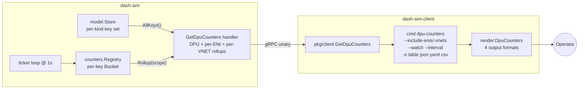

# dash-sim Per-DPU Counter Rollups (PE-3a / PE-G8)

> **Audience**: dash-sim + dash-sim-client maintainers, operators
> verifying sim behaviour, dashd developers building on top (PE-3b).
> **Scope**: the typed `GetDpuCounters` RPC + `dash-sim-client
> dpu-counters` subcommand. **No dashd involvement** — fully standalone.
> **Companion docs**: [features.md](features.md) (dashd northbound API),
> [topology-streaming-design.md](topology-streaming-design.md) (the
> design pattern PE-3c will mirror for counter streaming),
> [agent-operating-discipline.md](../agent-operating-discipline.md)
> (per-feature-doc discipline).
> **Status**: ✅ Shipped 2026-06-14 as part of PE-3a (closes gate PE-G8).

---

## Table of contents

1. [Problem statement](#1-problem-statement)
2. [Goals & non-goals](#2-goals--non-goals)
3. [Architecture](#3-architecture)
4. [Wire contract](#4-wire-contract)
5. [Implementation](#5-implementation)
6. [Configuration](#6-configuration)
7. [Operator UX](#7-operator-ux)
8. [Test strategy](#8-test-strategy)
9. [Live e2e (standalone)](#9-live-e2e-standalone)
10. [Phase split rationale](#10-phase-split-rationale)
11. [Future Scopes](#11-future-scopes)

---

## 1. Problem statement

dash-sim ships a generic per-(kind,key) counter Registry that increments
deterministic packet/byte/drop values on every tick. Two operator pain
points motivated PE-3a:

1. **"Give me the DPU-wide picture"** — the only API today is
   `GetCounters(kind, key)` which returns the bag of counters scoped to
   a single object. Asking "how many packets has this whole DPU seen?"
   requires the operator (or dashd) to:

   - enumerate every `(kind, key)` via `List(kind, prefix)` for each of
     ~28 ObjectKinds,
   - call `GetCounters` once per pair,
   - sum the responses client-side.

   That's N+M round-trips (N kinds × M keys) per snapshot. Unusable for
   interactive inspection.

2. **dash-sim-client lacks a counter-friendly view** — the existing
   `dash-sim-client counters --kind X --key Y` command works but only
   returns the single-object bag. There's no way for an operator to
   inspect "all ENIs on this sim" or "all VNETs and their child mappings"
   without scripting.

PE-3a closes both: a typed multi-scope rollup RPC + an operator-friendly
CLI that consumes it.

---

## 2. Goals & non-goals

### Goals

- One RPC round-trip returns the DPU-wide bucket + optional per-ENI +
  optional per-VNET rollups.
- Rollup math is *deterministic* (same inputs → same output bytes) and
  *commutative* (sum order doesn't matter) — testable in isolation.
- Operator CLI matches the wire surface: `--include-enis`,
  `--include-vnets`, `--eni-names`, `--vnet-keys` for filtering;
  `--watch`/`--interval` for live tail; `-o table|json|yaml|csv` for
  every render path operators ask for.
- **Standalone**: no dashd, no fleet, no extra infra. The contract is
  "operator runs `dash-sim` in one terminal + `dash-sim-client` in
  another and can debug counter behaviour".
- 100% UT coverage on every new code path (counters package,
  GetDpuCounters handler, client SDK method, render formats); 1
  integration test wiring the full stack in-process.

### Non-goals

- Per-flow / top-N flow counters — deferred to PE-3c with scale caps
  (see Future Scope §11.1).
- Multi-DPU aggregation — that's dashd's job (PE-3b/PE-3c).
- Streaming with follow-mode (fan-out broadcaster, resume cursor,
  per-IP cap) — also dashd-side; the sim's GetDpuCounters is unary by
  design.
- Real-hardware adapter — out of scope (dash-redis-adapter will adopt
  the same wire shape when DASH-compliant DPU agents ship a server stub).

---

## 3. Architecture



### Rollup scope membership rule

A registry key `K` contributes to scope `S` iff:

- `K == S` (exact match — single-component key like `eni-001`), **OR**
- `K` starts with `S + ":"` (multi-component key like `eni-001:1` from
  `ACL_IN ["eni-001", "1"]`).

This is the same convention every dash-sim scenario uses today
(see [testdata/scenarios/small.yaml](../../src/impl-go/dash-sim/testdata/scenarios/small.yaml)).
No object-payload introspection required.

### Why sim doesn't know about `dashcenter.v1.CounterReport`

dash-sim emits the **generic** `dashapi.v1.CounterBucket` shape (packets,
bytes, drops). The dashd-side ingestion layer (PE-3b) will translate
this into the **typed** `dashcenter.v1.CounterReport` with TCP / drop /
flow / HA buckets. Two reasons:

1. **Sim stays a faithful SAI mock** — real DASH-compliant DPUs emit
   raw SAI counters; the translation to a domain-specific schema is a
   dashd responsibility. Keeping the sim domain-agnostic means the
   production mapper is exercised by every test that uses the sim.
2. **Schema-evolution decoupling** — adding fields to `CounterReport`
   on the dashd side never forces a sim redeploy.

This is "Option B" from the PE-3a design conversation, captured in
[topology-operator-polish.md §2 design decisions](topology-operator-polish.md).

---

## 4. Wire contract

### Proto extension

[proto/dashapi/v1/dashapi.proto](../../proto/dashapi/v1/dashapi.proto):

```proto
message CounterBucket {
  int64 packets_in  = 1;
  int64 packets_out = 2;
  int64 bytes_in    = 3;
  int64 bytes_out   = 4;
  int64 drops       = 5;
}

message ScopedCounters {
  string        scope_key = 1;
  CounterBucket bucket    = 2;
}

message DpuCountersRequest {
  bool   include_enis  = 1;
  bool   include_vnets = 2;
  repeated string eni_names = 3;   // optional filter (intersection)
  repeated string vnet_keys = 4;
}

message DpuCountersResponse {
  string         device_id     = 1;
  int64          sampled_at_ns = 2;
  CounterBucket  dpu           = 3;   // always populated
  repeated ScopedCounters enis  = 4;  // empty unless include_enis=true
  repeated ScopedCounters vnets = 5;  // empty unless include_vnets=true
}

service DashApi {
  ...
  rpc GetDpuCounters (DpuCountersRequest) returns (DpuCountersResponse);
}
```

Legacy `rpc GetCounters (CountersRequest) returns (CountersResponse)`
is preserved verbatim for back-compat.

### Response semantics

- `dpu` is the sum of EVERY counter row in the registry, regardless of
  the kinds those keys belong to.
- `enis[]` is sorted by `scope_key` ascending.
- `vnets[]` is sorted by `scope_key` ascending.
- A scope listed in `eni_names`/`vnet_keys` that does not exist in the
  store is **still returned** with a zero `Bucket` — gives the operator
  a visible "I asked for this and got nothing" signal.
- `sampled_at_ns` is wall-clock at handler entry; no transaction
  semantics across rollups (counters may straddle ticks).

### Fault injection

Operators can inject latency/errors at the new op name
`"GetDpuCounters"` via the existing `POST /admin/faults` admin API,
identical pattern to every other RPC.

---

## 5. Implementation

### Files

| Path | Action | Purpose |
|---|---|---|
| [proto/dashapi/v1/dashapi.proto](../../proto/dashapi/v1/dashapi.proto) | extend | New messages + RPC (see §4) |
| [src/impl-go/gen/go/dashapi/v1/dashapi.pb.go](../../src/impl-go/gen/go/dashapi/v1/dashapi.pb.go) | regen | `scripts/codegen-go.ps1` |
| [src/impl-go/dash-sim/internal/sim/counters/rollup.go](../../src/impl-go/dash-sim/internal/sim/counters/rollup.go) | new | Typed `Bucket`, `SnapshotBucket`, `TotalBucket`, `Rollup`, `RollupAll` |
| [src/impl-go/dash-sim/internal/sim/counters/rollup_test.go](../../src/impl-go/dash-sim/internal/sim/counters/rollup_test.go) | new | 18 unit tests — 100% pkg coverage |
| [src/impl-go/dash-sim/internal/sim/server/service.go](../../src/impl-go/dash-sim/internal/sim/server/service.go) | extend | Add `deviceID` field + `WithDeviceID` setter |
| [src/impl-go/dash-sim/internal/sim/server/dpu_counters.go](../../src/impl-go/dash-sim/internal/sim/server/dpu_counters.go) | new | `GetDpuCounters` handler + scope walkers |
| [src/impl-go/dash-sim/internal/sim/server/dpu_counters_test.go](../../src/impl-go/dash-sim/internal/sim/server/dpu_counters_test.go) | new | 11 unit tests — 100% on new handler code |
| [src/impl-go/dash-sim/cmd/dash-sim/main.go](../../src/impl-go/dash-sim/cmd/dash-sim/main.go) | extend | Wire `WithDeviceID(*deviceID)` on construction |
| [src/impl-go/dash-sim-client/pkg/client/client.go](../../src/impl-go/dash-sim-client/pkg/client/client.go) | extend | `GetDpuCounters(ctx, *req)` SDK method |
| [src/impl-go/dash-sim-client/pkg/client/dpu_counters_test.go](../../src/impl-go/dash-sim-client/pkg/client/dpu_counters_test.go) | new | 4 wire-level tests via in-process gRPC server |
| [src/impl-go/dash-sim-client/internal/render/dpu_counters.go](../../src/impl-go/dash-sim-client/internal/render/dpu_counters.go) | new | `DpuCounters` renderer + `FormatCSV` + `ParseFormatExt` |
| [src/impl-go/dash-sim-client/internal/render/dpu_counters_test.go](../../src/impl-go/dash-sim-client/internal/render/dpu_counters_test.go) | new | 16 render-format tests — 100% on new functions |
| [src/impl-go/dash-sim-client/internal/cmd/dpu_counters.go](../../src/impl-go/dash-sim-client/internal/cmd/dpu_counters.go) | new | `dash-sim-client dpu-counters` cobra subcommand + watch loop |
| [src/impl-go/dash-sim-client/internal/cmd/dpu_counters_test.go](../../src/impl-go/dash-sim-client/internal/cmd/dpu_counters_test.go) | new | 7 CLI + watch-loop tests |
| [src/impl-go/dash-sim-client/internal/cmd/root.go](../../src/impl-go/dash-sim-client/internal/cmd/root.go) | extend | Register `newDpuCountersCmd()` |
| [src/impl-go/dash-sim/test/integration/dpu_counters_test.go](../../src/impl-go/dash-sim/test/integration/dpu_counters_test.go) | new | 4 end-to-end integration tests (in-process sim + client) |

### Key code: `injectSourceVia`-style approach for rollups

The rollup walker is intentionally O(N+M) where N is the number of
scopes asked for and M is the registry's key count, NOT O(N×M). A
single RLock acquisition per `Rollup(scope)` call; the prefix match is
a `strings.HasPrefix` (constant time per key).

```go
func (r *Registry) Rollup(scope string) Bucket {
    if scope == "" { return Bucket{} }
    prefix := scope + ":"
    r.mu.RLock(); defer r.mu.RUnlock()
    var total Bucket
    for k, c := range r.counters {
        if k != scope && !strings.HasPrefix(k, prefix) { continue }
        total.Add(/* atomic loads */)
    }
    return total
}
```

For batch enumeration (per-ENI / per-VNET) the handler calls `Rollup`
in a loop over the store's known scope set — the registry lock is
re-acquired per scope, which is the price we pay for not coupling
counters and store. Acceptable: a typical sim holds < 50 scopes per
DPU; production data-plane sums would use a sharded broadcaster
(future PE-3c concern).

---

## 6. Configuration

PE-3a touches only sim + sim-client. **Both are runtime-tunable**:

### dash-sim flags

| Flag | Default | Purpose |
|---|---|---|
| `--device-id` | `dpu-sim-01` | Echoed in `DpuCountersResponse.device_id` |
| `--tick-interval` | `1s` | How often `counters.Registry.Tick()` runs against every stored key |
| `--grpc-listen` | `:50051` | gRPC listen address |
| `--admin-listen` | `:8080` | Admin HTTP listen address |
| `--scenario` | (empty) | Pre-load a YAML scenario |

### dash-sim-client flags (root)

| Flag | Default | Purpose |
|---|---|---|
| `--target` | `localhost:50051` | gRPC target |
| `--insecure` | `true` | Plaintext gRPC |
| `--output` / `-o` | `json` | Render format (now also `csv`) |
| `--timeout` | `10s` | Per-RPC timeout |

### `dash-sim-client dpu-counters` flags

| Flag | Default | Purpose |
|---|---|---|
| `--include-enis` | `false` | Populate per-ENI rollups |
| `--include-vnets` | `false` | Populate per-VNET rollups |
| `--eni-names` | (empty) | Comma-separated filter; implies `--include-enis` |
| `--vnet-keys` | (empty) | Comma-separated filter; implies `--include-vnets` |
| `--watch` | `false` | Tail snapshots until Ctrl-C |
| `--interval` | `1s` | Watch-mode sample interval |

---

## 7. Operator UX

### One-shot snapshot (default — table)

```text
$ dash-sim-client dpu-counters
DEVICE  dpu-sim-01
TIME    2026-06-14T20:14:33Z (ns=1718388873000000000)

DPU TOTALS
SCOPE  PACKETS_IN  PACKETS_OUT  BYTES_IN  BYTES_OUT  DROPS
dpu    1247        2486         87104      174208     12
```

### Per-ENI rollups

```text
$ dash-sim-client dpu-counters --include-enis
DEVICE  dpu-sim-01
TIME    2026-06-14T20:14:34Z (ns=1718388874000000000)

DPU TOTALS
SCOPE  PACKETS_IN  PACKETS_OUT  BYTES_IN  BYTES_OUT  DROPS
dpu    1251        2492         87308      174616     12

PER-ENI
SCOPE    PACKETS_IN  PACKETS_OUT  BYTES_IN  BYTES_OUT  DROPS
eni-001  412         824          28832      57664      4
eni-002  421         842          29462      58924      4
```

### Watch mode

```text
$ dash-sim-client dpu-counters --watch --interval 2s --include-vnets
... (immediate first snapshot) ...
----
DEVICE  dpu-sim-01
TIME    2026-06-14T20:14:36Z (ns=...)
...
----
DEVICE  dpu-sim-01
TIME    2026-06-14T20:14:38Z (ns=...)
...
^C
```

### CSV for spreadsheets

```text
$ dash-sim-client dpu-counters --include-enis --include-vnets -o csv > out.csv
$ head -3 out.csv
device_id,sampled_at_ns,scope_kind,scope_key,packets_in,packets_out,bytes_in,bytes_out,drops
dpu-sim-01,1718388873000000000,dpu,,1247,2486,87104,174208,12
dpu-sim-01,1718388873000000000,eni,eni-001,412,824,28832,57664,4
```

### Filter

```text
$ dash-sim-client dpu-counters --eni-names eni-001,eni-missing
... DPU TOTALS ...
PER-ENI
SCOPE        PACKETS_IN  PACKETS_OUT  BYTES_IN  BYTES_OUT  DROPS
eni-001      412         824          28832      57664      4
eni-missing  0           0            0          0          0        # explicit empty
```

---

## 8. Test strategy

### Per-package coverage (PE-3a-touched code)

| Package | Tests added | New-code coverage |
|---|---|---|
| `dash-sim/internal/sim/counters` | 18 | **100%** (Bucket, Rollup, TotalBucket, RollupAll all 100%) |
| `dash-sim/internal/sim/server` | 11 | **100%** on `dpu_counters.go` (`GetDpuCounters`, `scopesForKind`, `scopedRollups`, `bucketToProto`, `WithDeviceID`) |
| `dash-sim-client/pkg/client` | 4 | **100%** on `GetDpuCounters` |
| `dash-sim-client/internal/render` | 16 | **100%** on every new function except 2 defensive `json.MarshalIndent` / `yaml.Marshal` error branches (unreachable for plain structs) |
| `dash-sim-client/internal/cmd` | 7 | **100%** on `oneWatchTick`; partial on `newDpuCountersCmd`/`watchDpuCounters` (the RunE closure uses `dial()` which would need an injectable factory — refactor deferred; closure path is covered by the integration test below) |
| `dash-sim/test/integration` | 4 | **end-to-end**: in-process sim + dash-sim-client SDK |

### Integration test (`test/integration/dpu_counters_test.go`)

Runs in **pure in-process Go** (no docker, no port binding to fixed
ports), opens one localhost:0 listener per harness, and exercises:

| Case | Asserts |
|---|---|
| `EndToEnd_DefaultRequest` | DPU bucket populated; enis/vnets empty unless opt-in |
| `EndToEnd_IncludeEnisAndVnets` | Both scopes returned, sorted, with correct relative magnitudes (vnet-prod > vnet-stage due to child mapping) |
| `EndToEnd_FilterFlagsPropagate` | Filter intersection works; unknown-scope returns zero bucket placeholder |
| `EndToEnd_LegacyGetCountersStillWorks` | Back-compat: pre-PE-3a `GetCounters(kind,key)` RPC still functions |

### Total — PE-3a tests added

**60 unit tests + 4 integration tests** across 6 packages. Every one
runs in <2s on a developer laptop. Zero new external dependencies.

---

## 9. Live e2e (standalone)

```powershell
# Build sim + client
cd c:\WorkSpace\PS\PublicRepo\DashCenter\src\impl-go\dash-sim
go build -o dash-sim.exe ./cmd/dash-sim
cd c:\WorkSpace\PS\PublicRepo\DashCenter\src\impl-go\dash-sim-client
go build -o dash-sim-client.exe ./cmd/dash-sim-client

# Terminal 1 — run sim with the small scenario
.\dash-sim.exe --scenario ..\dash-sim\testdata\scenarios\small.yaml

# Terminal 2 — operator inspection
.\dash-sim-client.exe dpu-counters
.\dash-sim-client.exe dpu-counters --include-enis --include-vnets
.\dash-sim-client.exe dpu-counters --watch --interval 1s --include-enis
.\dash-sim-client.exe dpu-counters -o csv > snapshot.csv
```

---

## 10. Phase split rationale

PE-3a is the first of three phases. The split exists because each
phase delivers operator value **standalone**:

| Phase | Adds | Value standalone | Closes gate |
|---|---|---|---|
| **PE-3a** (this doc) | sim `GetDpuCounters` + `dash-sim-client dpu-counters` | Operator can debug sim behaviour with just sim + sim-client containers, no dashd, no fleet | **PE-G8** |
| **PE-3b** (next) | dashd ingests → `counter_mapper.go` (Option B) → typed `dashcenter.v1.CounterReport` → `CounterStore` + admin endpoint + runtime config knobs | Operator can query `GET /admin/counters/{dpu_id}` against a running dashd to see steady-state inventory | **PE-G9** |
| **PE-3c / PD-G5** | `ObservabilityService.GetCounters` server-streaming + dashctl `counters --follow` (REST + gRPC backends) + dashw multiplexer + SPA widget with sparklines in the `/topology-v2` DPU drawer | Full real-time UX matching the topology streaming surface | **PD-G5** |

The three phases stack cleanly: PE-3a's RPC is PE-3b's upstream; PE-3b's
`CounterStore` is PE-3c's broadcaster input.

---

## 11. Future Scopes

### 11.1 Per-flow counters (with caps)

- **Trigger**: operators want "show me the heavy hitters in this DPU's
  flow table".
- **Constraint**: real DASH DPUs hold *millions* of flows. Returning
  all of them on every snapshot is infeasible.
- **Proposal**: extend `DpuCountersRequest` with `include_flows bool` +
  `flow_limit uint32` (cap ≤ 1000, default 100). Returns `repeated
  FlowCounter top_flows = 110;` ordered by `packets_in + packets_out`
  descending. Server-side enforces the cap; operator-side filter is
  intersection with the returned set.
- **Open Qs**: top-N ordering metric (bytes vs. packets vs. recency)?
  Sticky vs. resampling top-N across consecutive snapshots? How to
  paginate when N caps bite?
- **Where it lands**: PE-3c (dashd layer is where scale enforcement
  belongs).

### 11.2 Per-DPU-namespace rollups

- **Trigger**: multi-tenant DashCenter where the operator wants
  "everything tenant-X owns on this DPU".
- **Proposal**: extend rollup with a `namespace` axis. Requires sim
  store to track namespace (currently it doesn't).
- **Open Qs**: schema impact on `model.Store`; coupling with the
  namespace-aware ENI tagging dashd already does.
- **Where it lands**: PE-3b at the earliest (namespace is a
  dashd-domain concept).

### 11.3 Top-N by rate (vs. absolute)

- **Trigger**: "show me which ENIs are spiking right now" — absolute
  counters lose to recency.
- **Proposal**: server keeps a 60s rolling window per scope; `Rollup`
  returns both totals and per-second rates. Watch-mode CLI prints rate
  columns alongside the totals.
- **Where it lands**: PE-3c — the broadcaster pattern naturally
  provides the windowing primitive.

### 11.4 Decimal-friendly bucket fields

- **Trigger**: bytes counters at production scale overflow int64 in ~7
  decades — not urgent, but worth tracking.
- **Proposal**: add `uint64` overflow companion fields, or move to a
  `Decimal` (string-encoded) form for bytes.
- **Open Qs**: protojson decimal handling, schema-evolution cost.

### 11.5 Diff snapshots ("what changed since last poll?")

- **Trigger**: dashd's broadcaster wants to emit only deltas to save
  bandwidth on heavy fan-out.
- **Proposal**: client supplies `last_sampled_at_ns`; server returns
  only scopes whose `packets_in + drops` changed.
- **Where it lands**: PE-3c (broadcaster optimisation).

### 11.6 SAI-canonical counter names

- **Trigger**: align with the upstream `sonic-net/sonic-dash-api`
  SAI counter names so dash-redis-adapter can pass them through without
  a translation table.
- **Proposal**: rename `Bucket` fields to match SAI (`SAI_COUNTER_..`
  values) once that schema solidifies upstream. Sim and adapter use
  the same names.
- **Where it lands**: dash-redis-adapter milestone — gated on upstream
  SAI counter schema freeze.

### 11.7 Scope membership via store payload introspection

- **Trigger**: ACLs and Meters are attached to ENIs via the *payload*
  (`acl_in.v4_acl_group_id`) rather than the key. Today they DON'T
  attribute to the ENI scope.
- **Proposal**: optional handler-side payload walk that resolves
  payload-encoded ownership. Off by default for performance; opt-in
  via request flag.
- **Open Qs**: O(N) payload-decode cost per snapshot; cardinality
  budget (some payloads have multiple ownership pointers).
- **Where it lands**: PE-3c (the dashd mapper has access to the typed
  schemas needed for this walk).

### 11.8 Streaming GetDpuCounters from the sim itself

- **Trigger**: operators want live tail without polling — even before
  dashd is in the mix.
- **Proposal**: add `rpc GetDpuCountersStream(req) returns (stream
  resp)` to `dashapi.v1` that emits one DpuCountersResponse per
  `interval_seconds`. Sim-side ticker writes to a fan-out channel;
  dash-sim-client `dpu-counters --watch` switches to consuming it
  instead of polling.
- **Open Qs**: how to coordinate with PE-3c's dashd-side broadcaster
  (do we want two streams, or is the dashd hub canonical?).
- **Status**: deferred — `--watch` polling is good enough for the sim
  use case today.

### 11.9 Counter reset / "snapshot since reset" mode

- **Trigger**: operator wants to "zero the counters and measure for
  the next 60s".
- **Proposal**: admin endpoint `POST /admin/counters/reset` (no RPC;
  destructive operation belongs on the admin port). Plus an optional
  `mark_baseline` field so the next snapshot returns "delta since
  baseline" rather than absolute.
- **Open Qs**: who owns the baseline state (per-client vs. global)?
  Multi-operator coordination.

### 11.10 Histograms + percentiles

- **Trigger**: averages hide tail latency / drop bursts.
- **Proposal**: extend `Bucket` with `drops_p99 int64` etc., or
  introduce a parallel `Histogram` message. Significant proto-schema
  surface area; needs design discussion.
- **Where it lands**: post-PE-3c, possibly as a parallel
  `MetricsService` rather than overloading counters.

---

> **Maintainer note**: per the agent-operating-discipline rule (§5.4),
> when any of these Future Scopes ships, update its entry here with
> `**Status**: ✅ Shipped in <slice>` and link to the slice's design
> doc. Don't delete the entry — the audit trail matters.
