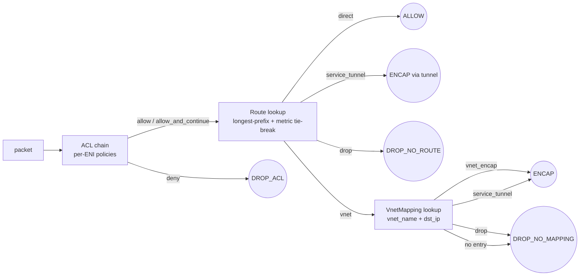

# dashd Features — REST API Reference & Usage Guide

> **Audience**: operators driving dashd from `curl`, scripts, or a web
> console; integrators writing their own client.
> **Scope**: the **northbound REST surface** (`:8443` by default) and
> the **admin surface** (`:7443`). gRPC is a sibling surface
> (`:9443`) speaking the same protobuf request/response messages; see
> [proto/dashcenter/v1/](../../proto/dashcenter/v1) for the canonical
> definitions.
> **Status as of 2026-06-12**: Phase 2 (PD — security & audit ✅) and
> Phase 2½ (PE-1 — diagnostics ✅) shipped. PE-2 / PE-3 / PE-4 / PD-G5
> (counters polling) are still in flight; this doc only covers landed
> RPCs.

---

## Table of contents

1. [Overview](#1-overview)
2. [Authentication & audit](#2-authentication--audit)
3. [Error envelope & status codes](#3-error-envelope--status-codes)
4. [Inventory](#4-inventory)
5. [Object CRUD (specs)](#5-object-crud-specs)
6. [Reconcile, Simulate, ApplyBatch](#6-reconcile-simulate-applybatch)
7. [HA orchestration](#7-ha-orchestration)
8. [Migrations](#8-migrations)
9. [Diagnostics (PE-1)](#9-diagnostics-pe-1)
10. [Cluster topology (PE-G6)](#10-cluster-topology-pe-g2)
11. [Admin port](#11-admin-port)
12. [Quick reference index](#12-quick-reference-index)

---

## 1. Overview

| Surface | Default address | Purpose |
|---|---|---|
| REST | `:8443` | Northbound CRUD + diagnostics + HA + migrations |
| gRPC | `:9443` | Same RPCs as REST, plus server-streaming RPCs |
| Admin | `:7443` | Leader probe + audit tail + Prometheus metrics |

### Request shape

- **Content-Type**: `application/json` for every POST/PUT body.
- **Path variables**: `{ns}` is the namespace (use `default` if you
  don't run multi-tenant); `{kind}` is the plural URL form
  (`vnets`, `enis`, `vnet-mappings`, `acl-policies`, `route-policies`,
  `ha-sets`, `service-tunnels`).
- **Body schema**: every body is the **JSON encoding of the proto
  message** named in the route description; field names use the
  proto `lower_snake_case`. The proto files are the source of truth:
  [`proto/dashcenter/v1/types.proto`](../../proto/dashcenter/v1/types.proto),
  [`proto/dashcenter/v1/controlplane.proto`](../../proto/dashcenter/v1/controlplane.proto),
  [`proto/dashcenter/v1/diagnostics.proto`](../../proto/dashcenter/v1/diagnostics.proto),
  [`proto/dashcenter/v1/ha.proto`](../../proto/dashcenter/v1/ha.proto),
  [`proto/dashcenter/v1/migration.proto`](../../proto/dashcenter/v1/migration.proto).

### Response shape

- Successful 2xx: the response proto message, JSON-encoded. Top-level
  shape varies per endpoint (see each section).
- List responses use `{"items": [...]}` so future fields like
  `next_page_token` can land without breaking clients.
- Errors return a uniform JSON envelope (see §3).

### Default-namespace shortcuts

Legacy clients can use the un-namespaced aliases for `vnets` and
`enis`:

- `PUT /v1/vnets/{name}` ≡ `PUT /v1/default/vnets/{name}`
- `GET /v1/enis` ≡ `GET /v1/default/enis`
- `DELETE /v1/{kind}/{name}` ≡ `DELETE /v1/default/{kind}/{name}`

All examples in this doc prefer the explicit `/v1/{ns}/…` form.

---

## 2. Authentication & audit

### Modes (`auth.mode` in `dashd.yaml`)

| Mode | How to authenticate | Default? |
|---|---|---|
| `none` | No credentials required (dev/lab only) | ✅ |
| `token` | `Authorization: Bearer <token>` per request | — |
| `mtls` | Client-cert authentication; `CommonName` → `Subject` | — |

Tokens and CN→role bindings are configured under `auth.tokens:` in
`dashd.yaml`. Roles drive the RBAC table in
[`auth.DefaultRoleMap`](../../src/impl-go/dashd/internal/auth/roles.go):

| Role | Permissions |
|---|---|
| `admin` | All reads + all writes + diagnostics + HA + migrations |
| `operator` | All reads + most writes; cannot delete inventory |
| `viewer` | Reads + diagnostics only |

### Audit log

Every mutating RPC plus every **deny** (401/403) emits one JSONL row
to `<state_dir>/audit.jsonl`. The entry shape is:

```json
{
  "ts":        "2026-06-12T02:45:46.108Z",
  "actor":     "alice",                  // or "cn:<CN>" or "bearer:<8-char>…" or "anonymous"
  "role":      "admin",                  // empty on deny rows (no Subject yet)
  "method":    "/REST/v1/default/vnets/PUT",
  "namespace": "default",
  "kind":      "vnet",
  "name":      "bank-prod-web",
  "ok":        true,
  "code":      "OK",                     // OK | Unauthenticated | PermissionDenied | InvalidArgument | …
  "error":     ""
}
```

Tail live with the admin endpoint (§10) or `dashctl audit tail -f`.

---

## 3. Error envelope & status codes

All non-2xx responses share this envelope:

```json
{
  "error": "human-readable description",
  "code":  "PermissionDenied"
}
```

| HTTP | Proto code | When |
|---|---|---|
| 400 | InvalidArgument | malformed body, missing required field |
| 401 | Unauthenticated | missing / unknown token |
| 403 | PermissionDenied | known principal lacks role for method |
| 404 | NotFound | object / DPU id / session id does not exist |
| 409 | Conflict | resource version conflict on PUT |
| 412 | FailedPrecondition | not leader, store dirty, etc. |
| 429 | ResourceExhausted | reconciler inbox full, rate limit |
| 500 | Internal | unexpected (logged with stack) |
| 503 | Unavailable | subsystem not configured (e.g. diagnostics nil) |

Streaming endpoints (`GET /v1/ha/events`, `GET /v1/migrations/.../stream`)
use **Server-Sent Events** (`text/event-stream`); each event is a JSON
line preceded by `data:` per the SSE spec.

---

## 4. Inventory

The inventory tells dashd which DPUs exist. It can be seeded from a
YAML file at startup OR replaced wholesale via REST.

### `PUT /v1/inventory` — replace the inventory

**Body**: `dashapi.v1.InventoryConfig`

```json
{
  "dpus": [
    {"id":"dpu-sim-01","endpoint":"dash-sim-01:50051","labels":{"rack":"a1","tier":"gold"}},
    {"id":"dpu-sim-02","endpoint":"dash-sim-02:50051","labels":{"rack":"a1","tier":"gold"}}
  ]
}
```

**Response**: `{"applied": N}` where N is the number of DPUs accepted.

### `GET /v1/inventory` — read the inventory

```bash
curl -s http://127.0.0.1:8443/v1/inventory | jq .
```

Returns the `InventoryConfig` exactly as installed.

### `POST /v1/inventory/{id}/register` — advertise capacity + capabilities

Used by a DPU agent to announce itself. Body: `service.DpuRegistration`:

```json
{
  "capacity": {"max_enis": 1000, "max_acl_rules": 50000, "max_routes": 100000},
  "capabilities": {"sai_pipeline_version": "v3.1", "supports_vxlan": true}
}
```

**Response**: `{"id":"dpu-sim-01","accepted":true,"version":42}`

### Cordon / Uncordon (PC-1)

```bash
curl -s -X POST http://127.0.0.1:8443/v1/inventory/dpu-sim-08/cordon \
     -H 'Content-Type: application/json' \
     -d '{"reason":"firmware-upgrade"}'

curl -s    http://127.0.0.1:8443/v1/inventory/cordoned
curl -s -X POST http://127.0.0.1:8443/v1/inventory/dpu-sim-08/uncordon \
     -H 'Content-Type: application/json' -d '{"reason":"upgrade-done"}'
```

The reason is required and gets persisted in the operations audit
ring.

### `POST /v1/inventory/{id}/drain` (PC-G7)

Cordons the DPU then rehomes every ENI to the least-loaded uncordoned
peer.

```json
{"reason":"appliance-decommission","parallelism":4}
```

**Response**: `service.DrainResult` envelope. Status is **200** when
every ENI migrated; **207 Multi-Status** when some failed (the source
remains cordoned for retry).

---

## 5. Object CRUD (specs)

All seven spec kinds share the same five operations: `PUT` (upsert),
`GET` (single), `GET` (list), `DELETE`, plus they participate in
`POST /v1/apply-batch` (§6) and `POST /v1/simulate` (§6).

### Kind ↔ URL table

| URL plural | Proto message | Generic GET/LIST/DELETE | Typed PUT |
|---|---|---|---|
| `vnets` | `VnetSpec` | `/v1/{ns}/vnets[/{name}]` | `PUT /v1/{ns}/vnets/{name}` |
| `enis` | `EniSpec` | `/v1/{ns}/enis[/{name}]` | `PUT /v1/{ns}/enis/{name}` |
| `vnet-mappings` | `VnetMappingSpec` | `/v1/{ns}/vnet-mappings[/{name}]` | `PUT /v1/{ns}/vnet-mappings/{name}` |
| `acl-policies` | `AclPolicySpec` | `/v1/{ns}/acl-policies[/{name}]` | `PUT /v1/{ns}/acl-policies/{name}` |
| `route-policies` | `RoutePolicySpec` | `/v1/{ns}/route-policies[/{name}]` | `PUT /v1/{ns}/route-policies/{name}` |
| `ha-sets` | `HaSetSpec` | `/v1/{ns}/ha-sets[/{name}]` | `PUT /v1/{ns}/ha-sets/{name}` |
| `service-tunnels` | `ServiceTunnelSpec` | `/v1/{ns}/service-tunnels[/{name}]` | `PUT /v1/{ns}/service-tunnels/{name}` |

### `PUT` — upsert a spec

**Body**: the proto spec for that kind. The server sets `spec.name`
from the URL if the body omits it.

```bash
curl -s -X PUT http://127.0.0.1:8443/v1/default/vnets/bank-prod-web \
     -H 'Content-Type: application/json' \
     -d '{"vni":100,"address_space":["10.0.0.0/16"],"gw_mac":"00:00:00:00:01:00"}'
```

**Response**: `service.PutResult` envelope:

```json
{
  "name":      "bank-prod-web",
  "namespace": "default",
  "version":   42,             // monotonically increasing per (ns,kind,name)
  "etag":      "v42-7c3f…",    // for optimistic concurrency on the next PUT
  "applied_at":"2026-06-12T02:45:46.108Z"
}
```

### `GET` single

```bash
curl -s http://127.0.0.1:8443/v1/default/vnets/bank-prod-web | jq .
```

Returns the spec proto plus a `_meta` block with `version`, `etag`,
`created_at`, `updated_at`.

### `GET` list

```bash
curl -s http://127.0.0.1:8443/v1/default/vnets | jq '.items[].name'
```

Response:

```json
{
  "items": [
    {"name":"bank-prod-web", "...": "..."},
    {"name":"gaming-lobby",  "...": "..."}
  ]
}
```

Optional query params: `?label=tier=gold&label=zone=us-west-2a`
(Kubernetes-style equality selectors, ANDed).

### `DELETE`

```bash
curl -s -X DELETE http://127.0.0.1:8443/v1/default/vnets/bank-prod-web
```

**Response**: 204 No Content on success.
**Status**: 412 if the object is referenced by another spec (e.g.
deleting a vnet with live ENIs) — the response body names the
referrers.

---

## 6. Reconcile, Simulate, ApplyBatch

### `POST /v1/reconcile` — force a reconciler tick

```bash
curl -s -X POST http://127.0.0.1:8443/v1/reconcile -d '{}' | jq .
```

**Body** (all fields optional):

```json
{
  "dpu_ids":   ["dpu-sim-08"],   // limit scope
  "namespaces":["default"],
  "kinds":     ["acl_policy"]
}
```

**Response**: `service.ReconcileResult`: `{"requested":12,"queued":12}`.

### `POST /v1/simulate` (PB-2) — dry-run admission

Always returns 200; the per-op verdict is in the body. Use this
before staging a multi-step change.

```json
{
  "ops": [
    {"action":"put","kind":"vnet","name":"new-tenant","namespace":"default",
     "spec": {"vni":777,"address_space":["10.99.0.0/16"]}},
    {"action":"delete","kind":"eni","name":"eni-legacy-01","namespace":"default"}
  ]
}
```

**Response**:

```json
{
  "results": [
    {"would_succeed":true,  "reason":""},
    {"would_succeed":false, "reason":"412 FailedPrecondition: eni in active vnet-mapping"}
  ]
}
```

### `POST /v1/apply-batch` (PC-8) — atomic multi-spec write

Same body shape as `simulate`. Commits **all** ops atomically; on any
failure the whole batch is rolled back (so no partial visible state),
and the response carries per-op statuses.

```bash
curl -s -X POST http://127.0.0.1:8443/v1/apply-batch \
     -H 'Content-Type: application/json' \
     -d @manifest/05-acl-policies.json | jq .
```

**Status**: **200** on clean commit; **207 Multi-Status** on partial
rollback (the response carries `committed:false` per op).

---

## 7. HA orchestration

HaSet spec is created via §5 (`PUT /v1/{ns}/ha-sets/{name}`). These
endpoints operate on existing HaSets.

| Endpoint | Purpose |
|---|---|
| `GET /v1/ha` | List all HaSets across namespaces |
| `GET /v1/ha/{ns}/{name}` | Read one HaSet status |
| `POST /v1/ha/{ns}/{name}/switchover` | Operator-initiated planned switch |
| `POST /v1/ha/{ns}/{name}/failover` | Operator-initiated emergency promote |
| `GET /v1/ha/events` | SSE stream of HaEvent envelopes |
| `GET /v1/ha/flow-sync-stats` | Per-set flow-sync counters |

### Switchover / Failover request shape

```json
{
  "to_endpoint":   "dpu-sim-02",       // optional; defaults to best peer
  "drain_seconds": 30,                  // graceful drain budget (switchover only)
  "force":         false                // failover only — skip pre-check
}
```

**Response**: `service.HaOpAck`:

```json
{"job_id":"ha-12387","accepted":true,"event_url":"/v1/ha/events?job_id=ha-12387"}
```

### `GET /v1/ha/events` — Server-Sent Events stream

```bash
curl -N http://127.0.0.1:8443/v1/ha/events
```

Each event line:

```
event: ha_event
data: {"job_id":"ha-12387","phase":"DRAINING","peer":"dpu-sim-02","ts":"..."}
```

Phases: `PLANNED` → `DRAINING` → `PROMOTING` → `SYNCED` → `READY` (or
`FAILED` / `ROLLED_BACK`).

---

## 8. Migrations

ENI live-migration workflow. Sessions are stateful; you create a
**Plan**, then start a **Session** that walks the plan through 10
phases.

| Endpoint | Purpose |
|---|---|
| `POST /v1/migrations/plans` | Create a Plan envelope |
| `POST /v1/migrations/plans/validate` | Dry-run plan validation (no state change) |
| `POST /v1/migrations/sessions` | Start a Session from a Plan |
| `GET /v1/migrations/sessions` | List active sessions |
| `GET /v1/migrations/sessions/{id}` | Read one session |
| `POST /v1/migrations/sessions/{id}/advance` | Move to the next phase |
| `POST /v1/migrations/sessions/{id}/rollback` | Roll back to a checkpoint |
| `POST /v1/migrations/sessions/{id}/commit` | Finalize a completed session |
| `POST /v1/migrations/sessions/{id}/abort` | Force-terminate (with cleanup) |
| `GET /v1/migrations/sessions/{id}/stream` | SSE stream of phase events |

### Plan body

```json
{
  "name":     "evac-appliance-3",
  "namespace":"default",
  "moves": [
    {"eni":"eni-prod-04","from":"dpu-sim-05","to":"dpu-sim-09"},
    {"eni":"eni-prod-05","from":"dpu-sim-06","to":"dpu-sim-10"}
  ],
  "policy": {"parallelism":2, "phase_timeout_seconds":120}
}
```

### Session lifecycle

```bash
PLAN=$(curl -s -X POST http://127.0.0.1:8443/v1/migrations/plans -d @plan.json | jq -r .id)
SESS=$(curl -s -X POST http://127.0.0.1:8443/v1/migrations/sessions \
            -d "{\"plan_id\":\"$PLAN\"}" | jq -r .id)
curl -N http://127.0.0.1:8443/v1/migrations/sessions/$SESS/stream
```

Phases (10): `INIT` → `RESERVE_DST` → `PROGRAM_DST` → `BLACKHOLE_SRC`
→ `SYNC_FLOWS` → `PROMOTE_DST` → `VERIFY` → `RELEASE_SRC` → `CLEANUP`
→ `DONE`.

`rollback` is valid through `VERIFY`; after `PROMOTE_DST` rollback
becomes a destructive operation and requires `"force":true`.

---

## 9. Diagnostics (PE-1)

Five RPCs, all read-only, all sub-ms — they are pure functions over
the **committed** policy cache (no DPU round-trip). All paths under
`POST /v1/diagnostics/`.

> **Determinism note** (from the proto header): if a Stage is pending
> under `pending:<txn_id>`, diagnostics still use the **committed**
> view. To diagnose a staged policy, run `ControlPlane.SimulateApply`
> (§6) first.

### 9.1 `POST /v1/diagnostics/trace-flow`

**"What does the pipeline do with this packet?"**

**Body** (`dashcenter.v1.TraceFlowRequest`):

```json
{
  "dpu_id":"dpu-sim-01",
  "flow": {
    "direction": 1,                  // 1=INBOUND, 2=OUTBOUND
    "eni_name":  "eni-bank-web-04",
    "src_ip":    "203.0.113.10",
    "dst_ip":    "192.168.11.4",
    "src_port":  0,
    "dst_port":  443,
    "protocol":  "tcp",              // "tcp"|"udp"|"icmp" or numeric
    "vni":       ""
  },
  "verdict_only": false              // true = skip the trace[] narration
}
```

**Response** (`FlowTraceResult`):

```json
{
  "verdict": 3,                      // see verdict enum below
  "fast_path_hit": false,
  "trace": [
    "INPUT: dir=INBOUND eni=eni-bank-web-04 src=203.0.113.10:0 dst=192.168.11.4:443 proto=tcp",
    "ACL inbound: 1 candidate policies",
    "ACL ALLOW: policy=acl-bank-web-inbound priority=100 reason=all fields matched",
    "ROUTE: best match policy=rp-bank-web-default prefix=192.168.11.0/24 next_hop=vnet/bank-prod-web",
    "VNET_MAPPING: 192.168.11.4 → underlay=10.0.1.14 mac=aa:bb:cc:01:00:04 action=vnet_encap"
  ],
  "matched_acl_rule":     {"policy_name":"acl-bank-web-inbound","priority":100,"action":"allow"},
  "matched_route":        {"policy_name":"rp-bank-web-default","prefix":"192.168.11.0/24","next_hop_type":"vnet","next_hop_target":"bank-prod-web"},
  "matched_vnet_mapping": {"vnet_name":"bank-prod-web","ip_address":"192.168.11.4","action":"vnet_encap"},
  "computed_at": "2026-06-12T02:45:46.108Z"
}
```

**Verdict enum**:

| Int | Name | Meaning |
|---|---|---|
| 0 | `VERDICT_UNSPECIFIED` | shouldn't happen |
| 1 | `VERDICT_ALLOW` | direct next-hop, no encap |
| 2 | `VERDICT_DENY` | reserved (rare) |
| 3 | `VERDICT_ENCAP` | forward with overlay encap (vnet/service_tunnel) |
| 4 | `VERDICT_DROP_NO_ROUTE` | no route matched the dst |
| 5 | `VERDICT_DROP_NO_MAPPING` | route hit but vnet-mapping missing |
| 6 | `VERDICT_DROP_ACL` | ACL `deny` won |
| 7 | `VERDICT_DROP_METER` | reserved |
| 8 | `VERDICT_DROP_INVALID` | malformed flow descriptor |

### 9.2 `POST /v1/diagnostics/explain-match`

**"Why was this row picked — and what did the others say?"**

**Body**: `MatchRequest`:

```json
{
  "dpu_id":  "dpu-sim-01",
  "subject": 1,                  // 1=ACL, 2=ROUTE, 3=VNET_MAPPING
  "flow":    { "...": "same FlowDescriptor as trace-flow" }
}
```

**Response** (`MatchExplanation`):

```json
{
  "candidates": [
    {"candidate_id":"route/rp-spark-compute/0.0.0.0/0",
     "matched":true,
     "priority":0,
     "reason":"0.0.0.0/0 ⊇ 10.200.5.5 (len=0, metric=1000, next_hop=drop/)"},
    {"candidate_id":"route/rp-spark-compute/192.168.51.0/24",
     "matched":false,
     "priority":24,
     "reason":"192.168.51.0/24 ⊅ 10.200.5.5"}
  ],
  "selected_candidate_id":"route/rp-spark-compute/0.0.0.0/0",
  "computed_at":"2026-06-12T02:45:46.108Z"
}
```

`⊇` = "contains"; `⊅` = "does not contain". The list is ordered by
evaluation order (highest priority first for ACLs; longest prefix
first for routes).

### 9.3 `POST /v1/diagnostics/explain-drift`

**"Why is this object marked drifted, and how do I fix it?"**

**Body**: `DriftExplainRequest`:

```json
{
  "target": {"namespace":"default","name":"eni-prod-01","kind":"eni"},
  "dpu_id": "dpu-sim-01"
}
```

**Response** (`DriftExplanation`):

```json
{
  "target": {"namespace":"default","name":"eni-prod-01","kind":"eni"},
  "dpu_id": "dpu-sim-01",
  "field_diffs": [
    {"field":"presence",
     "declared":"present",
     "observed":"(see /admin/drift for live add/update/remove vs DPU)"}
  ],
  "suggested":  1,
  "rationale":  "eni/eni-prod-01 exists in declared state. To resolve drift, RECONCILE will push declared → DPU \"dpu-sim-01\". Use IMPORT_OBSERVED only when the DPU is authoritative (rare; manual confirmation recommended)."
}
```

Today dash-sim does not report structured drift back to dashd — the
engine emits a single placeholder `presence` row plus a remediation
hint. Once PE/PF lands full field-level diff, `field_diffs[]` will
carry rows like `{"field":"admin_state","declared":"up","observed":"down"}`.
`suggested` is one of:

- `1` — `REMEDIATION_RECONCILE` (push declared → DPU; safe default)
- `2` — `REMEDIATION_IMPORT_OBSERVED` (adopt observed as new declared)
- `3` — `REMEDIATION_MANUAL` (operator must intervene)

Use `1` for routine drift; `2` when the DPU is the source of truth
(rare); `3` when the diff spans semantically incompatible fields.

### 9.4 `POST /v1/diagnostics/acl-hit-stats`

**"List ACL rules with hit counters; optionally only the dead ones."**

This is the only diagnostic that streams over gRPC. The REST surface
**aggregates the stream into a single JSON array** so curl + jq users
get a finite response.

**Body** (`AclStatsRequest`):

```json
{
  "dpu_ids":      ["dpu-sim-01","dpu-sim-02"],   // empty = all
  "namespaces":   ["default"],                    // empty = all
  "policy_names": [],                             // empty = all
  "zero_hits_only": true                          // dead-rule audit
}
```

**Response** (`{"items":[AclStatsPerDpu...]}`):

```json
{
  "items": [
    {
      "dpu_id":      "dpu-sim-01",
      "namespace":   "default",
      "policy_name": "acl-bank-web-inbound",
      "stage":       "inbound",
      "rules": [
        {"priority":100, "action":"allow"},
        {"priority":150, "action":"deny"}
      ],
      "sampled_at":  {"seconds": 1781214132, "nanos": 930106859}
    }
  ]
}
```

> **proto JSON note**: zero-valued ints (`hits`, `bytes`) and unset
> timestamps (`last_hit_at`) are **omitted** from the response —
> standard protojson behaviour. A missing `hits` field means `hits == 0`.

> Counters are currently fed by `NilHitStats` (zeros across the
> board); PD-G5 will swap in the live counter store fed by
> `dispatch.SnapshotCounters` once PE-3 lands the sim side.

### 9.5 `POST /v1/diagnostics/trigger-resimulation`

**"Force these DPUs/ENIs to re-evaluate active flows against the
current policy."**

Equivalent to setting `EniSpec.resimulate_flows` but invocable
standalone — useful after a policy change that must take effect for
already-established slow-path flows.

**Body** (`ResimRequest`):

```json
{
  "dpu_ids":   ["dpu-sim-05"],
  "eni_names": ["eni-prod-04","eni-prod-05"],
  "namespace": "default",
  "drop_all_flows": false           // true = drop everything; false = only divergent
}
```

At least one of `dpu_ids` / `eni_names` MUST be non-empty; an empty
request returns 400 `InvalidArgument`.

**Response** (`Ack`):

```json
{"txn_id":"resim-default"}
```

The `txn_id` correlates to the audit log row and (once PE-3 lands)
to the sim-side phase-1 resimulation hook.

### Pipeline reference

Every `trace-flow` walks this state machine:



---

## 10. Cluster topology (PE-G6 / PE-G7)

**Read-only fleet topology**: returns who runs the controller cluster
(self-published via etcd lease), the DPU inventory grouped by appliance
+ zone, and per-namespace object counts — all in one call. Both RPCs
are safe to call against any node; the data is local to each dashd
(no per-request fan-out).

Full design rationale: [cluster-topology-design.md](cluster-topology-design.md) (v1 / PE-G6).
Production hardening + dashw multiplexer + `/topology-v2` SPA:
[topology-streaming-design.md](topology-streaming-design.md) (v2 / PE-G7).

### 10.1 `GET /v1/cluster/topology`

**Query param**: `?include_enis=true` (default `false` — ENI counts
only, no names; keeps the payload small for monitoring clients).

**Response** (`dashcenter.v1.TopologyResponse`):

```json
{
  "computed_at": "2026-06-12T...",
  "cluster": {
    "healthy": true,
    "leader_id": "dashd-2",
    "node_count": 3,
    "nodes": [
      {"node_id":"dashd-1","rest_addr":":8443","grpc_addr":":9443","admin_addr":":7443","version":"0.2.0-phase1b","started_at":"..."},
      {"node_id":"dashd-2","is_leader":true, ...},
      {"node_id":"dashd-3", ...}
    ]
  },
  "appliances": [
    {"id":"appliance-1","zone":"us-west-2a","tier":"gold",
     "dpus":[{"id":"dpu-sim-01","state":"DPU_STATE_UP","eni_count":4}, ...]},
    ...
  ],
  "zones": [{"zone":"us-west-2a","appliance_count":2,"dpu_count":4,"eni_count":16}, ...],
  "summary": {"total_nodes":3,"total_appliances":5,"total_dpus":10,"total_enis":41,"healthy_dpus":10},
  "objects": {
    "default": {"vnets":14,"enis":41,"vnet_mappings":40,"acl_policies":18,"route_policies":17,"ha_sets":4,"service_tunnels":6},
    "edge":    {"vnets":2, ...},
    "staging": {"vnets":1, ...}
  }
}
```

**Determinism**: every list is sorted by stable key, so two back-to-back
calls on identical inputs return byte-identical bodies (operators can
compute diffs reliably).

### 10.2 `GET /v1/cluster/topology/watch`

**Server-Sent Events stream**. First line is `event: snapshot` with the
full `TopologyResponse`; subsequent events are typed deltas:

| `event:` | When |
|---|---|
| `snapshot` | always first; full TopologyResponse |
| `peer_added` / `peer_removed` / `peer_updated` | dashd joined/left the etcd peer registry |
| `leader_changed` | controller election handoff |
| `dpu_added` / `dpu_removed` / `dpu_state` | inventory change |
| `keepalive` | (PE-G7) 30s heartbeat from the single global ticker |
| `dropped` | (PE-G7) `Notice{dropped_count}` — slow subscriber missed N events |
| `rate_limited` | (PE-G7) `Notice{suppressed_count}` — broadcaster shed events under churn |
| `resync` | (PE-G7) cursor was stale; client should reapply the next `snapshot` and reset state |

Each line: `id: <event_id>\nevent: <kind>\ndata: <protojson>\n\n`. The
`id:` cursor is monotonic per broadcaster instance; clients reconnect
with `Last-Event-ID: <N>` header (EventSource auto-sends this) or
`?last_event_id=<N>` query param. The broadcaster replays from the
ring; if the cursor is older than the ring's oldest entry it emits a
`resync` Notice + fresh snapshot so the client cleanly re-derives.
Keep-alive comments (`:keepalive\n\n`) every 30s prevent reverse-proxy
timeouts.

**Provenance** (PE-G7.1): when frames are served through dashw (the BFF),
every JSON body carries two extra fields stamped by the multiplexer:
`source` (the upstream dashd identity, e.g., `dashd-1:9443`) and
`via` (this dashw replica's identity — OS hostname or `--node-id`
override). These let operators reading a stream sample identify the
exact path the event travelled, including from `KEEPALIVE` frames.
Full spec: [sse-event-provenance.md](sse-event-provenance.md).

**Caps + rate limit** (PE-G7): the broadcaster caps subscribers globally
(`MaxSubscribers=64`) and per-subject (`MaxSubscribersPerSubject=4`).
A breach returns HTTP 429 + `Retry-After` (REST) or `ResourceExhausted`
(gRPC). The publish path is rate-limited to 100 ev/s + burst 200; a
leaky-bucket overflow yields a `rate_limited` Notice on every active
subscription.

> **Operator console clients SHOULD NOT call this endpoint directly.**
> The dashw BFF (`/api/console/topology-v2/stream`) multiplexes N
> browser tabs onto one upstream stream and adds per-IP caps,
> snapshot dedup, and survivable reconnect. See
> [topology-streaming-design.md §3](topology-streaming-design.md#3-three-tier-architecture).

### 10.3 `GET /admin/topology` (admin port :7443, unauthenticated)

Same envelope as 10.1, exposed on the admin port for operator scripts
that already trust the management network. No auth required.

### gRPC equivalents

- `rpc GetTopology(GetTopologyRequest) returns (TopologyResponse)`
- `rpc WatchTopology(WatchTopologyRequest) returns (stream TopologyEvent)`

Both `viewer+` (read-only). Wired into the same auth + audit chain as
the other services — PE-G6 inherits PD-G1/G2/G3/G4 unchanged.

---

## 11. Admin port

The admin surface (`:7443` by default) is **unauthenticated**, intended
to be exposed only on the management network or via a sidecar.

| Endpoint | Purpose |
|---|---|
| `GET /admin/leader` | `{"leader":true,"leader_id":"dashd-2","term":42}` — used by load balancers |
| `GET /admin/topology` | Full fleet topology (see [§10](#10-cluster-topology-pe-g2)) — no auth required on admin port |
| `GET /admin/audit/tail` | One-shot tail of `audit.jsonl` (last N rows) |
| `GET /admin/audit/stream` | SSE stream that follows `audit.jsonl` like `tail -f` |
| `GET /admin/metrics` | Prometheus exposition (Phase 2 PD-G2) |
| `GET /admin/healthz` | Liveness probe (always 200 if process is up) |
| `GET /admin/readyz` | Readiness probe (200 only when leader + store loaded) |

### Audit tail example

```bash
curl -s 'http://127.0.0.1:7443/admin/audit/tail?n=20' | jq .
curl -N 'http://127.0.0.1:7443/admin/audit/stream'    # SSE follow
```

---

## 12. Quick reference index

| Path | Method | Section |
|---|---|---|
| `/v1/inventory` | PUT/GET | §4 |
| `/v1/inventory/{id}/register` | POST | §4 |
| `/v1/inventory/{id}/cordon` `…/uncordon` `…/drain` | POST | §4 |
| `/v1/inventory/cordoned` | GET | §4 |
| `/v1/{ns}/{vnets\|enis\|vnet-mappings\|acl-policies\|route-policies\|ha-sets\|service-tunnels}/{name}` | PUT/GET/DELETE | §5 |
| `/v1/{ns}/{kind}` | GET (list) | §5 |
| `/v1/reconcile` | POST | §6 |
| `/v1/simulate` | POST | §6 |
| `/v1/apply-batch` | POST | §6 |
| `/v1/ha` `…/{ns}/{name}` `…/switchover` `…/failover` | GET/POST | §7 |
| `/v1/ha/events` | GET (SSE) | §7 |
| `/v1/ha/flow-sync-stats` | GET | §7 |
| `/v1/migrations/plans[/validate]` | POST | §8 |
| `/v1/migrations/sessions[/{id}[/advance\|rollback\|commit\|abort\|stream]]` | POST/GET | §8 |
| `/v1/diagnostics/trace-flow` | POST | §9.1 |
| `/v1/diagnostics/explain-match` | POST | §9.2 |
| `/v1/diagnostics/explain-drift` | POST | §9.3 |
| `/v1/diagnostics/acl-hit-stats` | POST | §9.4 |
| `/v1/diagnostics/trigger-resimulation` | POST | §9.5 |
| `/v1/cluster/topology` | GET | §10.1 |
| `/v1/cluster/topology/watch` | GET (SSE) | §10.2 |
| `/admin/leader` `/admin/topology` `/admin/audit/{tail,stream}` `/admin/metrics` `/admin/healthz` `/admin/readyz` | GET | §11 |

---

**See also**
- [docs/dashd-features/](.) (this folder) — additional dashd feature notes as they land
- [cluster-topology-design.md](cluster-topology-design.md) — PE-G6 design spec (problem / solution / architecture / acceptance criteria)
- [topology-streaming-design.md](topology-streaming-design.md) — PE-G7 production hardening (D1-D7 defects, dashw multiplexer, `/topology-v2` SPA, Future Scopes ×14)
- [sse-event-provenance.md](sse-event-provenance.md) — PE-G7.1 SSE `source` + `via` stamping (operator-visible source identification)
- [topology-operator-polish.md](topology-operator-polish.md) — PE-G7.1 operator polish (`dashctl topology --follow` + leader observer + `/topology-v2` cordon button)
- [proto/dashcenter/v1/](../../proto/dashcenter/v1) — proto sources of truth
- [docs/CLI_GUIDE.md](../CLI_GUIDE.md) — `dashctl` equivalents
- [deploy/test-setup/05-full-console/manual-handson.md](../../deploy/test-setup/05-full-console/manual-handson.md) — Lab 12.6 live captures of every diagnostic
- [deploy/test-setup/06-fleet-ui-diagnostics/manual-handson.md](../../deploy/test-setup/06-fleet-ui-diagnostics/manual-handson.md) — Diagnostics deep-dive lab
