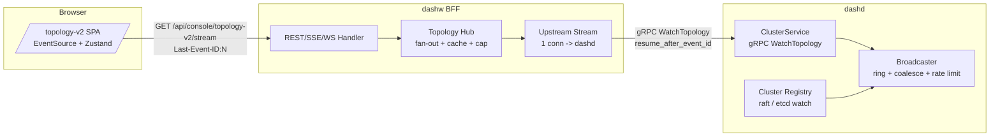

# Topology Streaming — Production-Grade Live Cluster View

> **Audience**: dashd / dashw maintainers, SREs running the fleet, web
> console developers, security reviewers.
> **Scope**: end-to-end design of the live cluster-topology surface
> (`dashd` → `dashw` → browser SPA `/topology-v2`) including the
> production hardening shipped in PE-G7.
> **Companion docs**:
> [cluster-topology-design.md](cluster-topology-design.md) (the v1
> design that this revision replaces),
> [features.md](features.md) (north-bound REST/gRPC catalogue),
> [../next-actions.md](../next-actions.md) (tracker),
> [../../specs/Impl-Plan/impl-phases.md](../../specs/Impl-Plan/impl-phases.md)
> (phase gates).
> **Status as of PE-G7**: dashd defects D1-D7 closed (14 broadcaster
> tests green), dashw multiplexer (`internal/cluster`) shipped (10
> hub tests green), SPA `/topology-v2` page shipped (25 store + hook
> tests + 234 total SPA tests green, Vite build clean).

---

## Table of contents

1. [Problem statement](#1-problem-statement)
2. [Goals & non-goals](#2-goals--non-goals)
3. [Three-tier architecture](#3-three-tier-architecture)
4. [Wire contract](#4-wire-contract)
5. [Defect log & fixes](#5-defect-log--fixes)
6. [Data-flow narratives](#6-data-flow-narratives)
7. [Operational guide](#7-operational-guide)
8. [Security model](#8-security-model)
9. [Performance envelope](#9-performance-envelope)
10. [Test strategy](#10-test-strategy)
11. [Future Scopes](#11-future-scopes)

---

## 1. Problem statement

DashCenter's earlier "v1" topology stream (PE-G6) gave us the right
**shape** — a `WatchTopology` server-streaming RPC + a `/v1/cluster/topology/stream`
SSE wrapper — but it was not yet *production-grade* for an unattended,
multi-tenant operator console:

| Symptom                                              | Root cause in v1                                       |
|------------------------------------------------------|--------------------------------------------------------|
| Memory growth proportional to subscriber count       | Each subscriber re-marshalled the same event           |
| Lost events on slow subscribers (silent drop)        | Drops counted but not signalled to clients             |
| No way to resume after a transient disconnect        | No event IDs, no Last-Event-ID, no replay buffer       |
| Browser dictating fan-out shape to dashd directly    | No BFF — every browser opened a gRPC/SSE to a leader   |
| Easy DoS via N tabs × M users                        | No per-IP cap, no rate limit, no back-pressure         |
| Multi-tenant churn caused thundering herd            | No coalescing, no keep-alive, blunt 1-event-per-frame  |
| Watch goroutine per subscriber + per-subject ticker  | Quadratic goroutine + ticker explosion at scale        |

Each was minor in isolation but compounded into an unsafe production
profile. PE-G7 closes all seven (D1-D7) and introduces the **dashw
multiplexer** so the browser never speaks to dashd directly.

---

## 2. Goals & non-goals

### 2.1 Goals

1. **Real-time topology** delivered to operators with sub-second
   freshness for cluster + DPU events; sub-5-second for ENI churn.
2. **Browser ↔ dashw only.** Browsers MUST NOT open gRPC, REST or SSE
   directly against `dashd`. dashw is the only operator-facing surface.
3. **Survivable** across network blips, dashw redeploys, dashd
   leader-elections: resume cursor + RESYNC sentinel + back-pressure.
4. **Bounded** memory, goroutines, sockets at every tier so the worst
   browser load cannot OOM the cluster.
5. **Observable** every drop, cap and reconnect via Prometheus + Notice
   frames the client surfaces in its UI.
6. **Single source of truth in the SPA**: one EventSource per page, a
   reducer-driven Zustand store, no per-widget polling.

### 2.2 Non-goals (deferred — see Future Scopes)

- Bidirectional control plane (browser → dashw → dashd commands stream
  on the same socket). Today browsers POST commands; only telemetry
  multiplexes.
- gRPC-Web native browser transport. We chose SSE for the topology
  feed because the operator console already runs through dashw and SSE
  is cheaper than a per-tab gRPC stream.
- Long-term event store (>ring buffer). We keep 1024 events per
  subject in memory; durable replay is a Future Scope.
- Multi-cluster federation (operator viewing N independent DashCenter
  clusters in one pane).

---

## 3. Three-tier architecture



### 3.1 Tier responsibilities

| Tier   | Component               | Responsibility                                          |
|--------|-------------------------|---------------------------------------------------------|
| dashd  | `cluster.Registry`      | Source of truth for peers + leader; raft / etcd watch.  |
| dashd  | `cluster.Broadcaster`   | Single-writer ring, coalescing, rate limit, fan-out.    |
| dashd  | `ClusterService` (gRPC) | Subscribe/unsubscribe, cursor honor, KIND_DROPPED inj.  |
| dashd  | REST `/v1/cluster/topology/stream` | SSE adapter for legacy/operator curl access. |
| dashw  | `internal/cluster.Hub`  | Multiplex N browser tabs onto 1 dashd upstream.         |
| dashw  | `internal/cluster.HTTPHandler` | SSE + WebSocket + snapshot + admin stats.        |
| Browser| `topology-v2-store`     | Reducer over deltas; cap event log; selectors.          |
| Browser| `useTopologyStream`     | EventSource owner; visibility pause; backoff.           |
| Browser| `TopologyV2View`        | Cluster panel + appliance grid + event ticker + drawer. |

### 3.2 Why a multiplexer (dashw Hub)?

In the v1 architecture, every browser tab held its own gRPC stream to a
dashd leader. With 200 operators × 3 tabs each you got 600 streams,
600 goroutines per dashd, and 600× the keep-alive traffic. dashw's
Hub collapses this to **1 upstream gRPC + N fan-out subscribers per
dashw replica**. With 4 dashw replicas behind a load balancer, dashd
sees 4 streams instead of 600 — a 150× reduction.

The Hub also unlocks:

- **Snapshot dedup**: 600 tabs hitting `GetTopology` within a second
  return the cached snapshot, not 600 round-trips to dashd.
- **Per-IP cap**: defend against a runaway tab loop.
- **Resume across dashw redeploy**: the Hub owns the cursor; an
  upstream reconnect fans out a synthetic RESYNC to all subscribers.

---

## 4. Wire contract

### 4.1 Proto extensions (PE-G7)

```proto
// proto/dashcenter/v1/cluster.proto
message WatchTopologyRequest {
  bool include_enis = 1;
  uint64 resume_after_event_id = 2;   // NEW: cursor for replay
}

message TopologyEvent {
  Kind kind = 1;
  google.protobuf.Timestamp ts = 2;
  uint64 event_id = 3;                // NEW: monotonic per broadcaster
  oneof body {
    TopologyResponse snapshot = 10;
    ClusterNode peer = 11;
    DpuTopology dpu = 12;
    Notice notice = 13;               // NEW: drop/rate-limit/resync metadata
  }
  string old_leader_id = 20;
  string new_leader_id = 21;

  enum Kind {
    KIND_UNSPECIFIED = 0;
    KIND_SNAPSHOT = 1;
    KIND_PEER_ADDED = 2;
    KIND_PEER_REMOVED = 3;
    KIND_PEER_UPDATED = 4;
    KIND_LEADER_CHANGED = 5;
    KIND_DPU_STATE = 6;
    KIND_DPU_ADDED = 7;
    KIND_DPU_REMOVED = 8;
    KIND_KEEPALIVE = 9;               // NEW: idle heartbeat
    KIND_DROPPED = 10;                // NEW: server-emitted notice
    KIND_RATE_LIMITED = 11;           // NEW
    KIND_RESYNC = 12;                 // NEW (synthetic, dashw-emitted)
  }
}

message Notice {
  uint32 dropped_count = 1;
  uint32 suppressed_count = 2;
  string message = 3;
  uint64 current_event_id = 4;
}
```

### 4.2 dashd surfaces

| Path                                          | Verb | Auth   | Purpose                                |
|-----------------------------------------------|------|--------|----------------------------------------|
| `/v1/cluster/topology`                        | GET  | Yes    | Snapshot                               |
| `/v1/cluster/topology/stream`                 | GET  | Yes    | SSE (Last-Event-ID + query cursor)     |
| `ClusterService.WatchTopology` (gRPC :9443)   | RPC  | Yes    | Server-streaming with resume cursor    |
| `dashd_cluster_broadcaster_*` (admin :7443)   | -    | -      | Prometheus metrics                     |

### 4.3 dashw surfaces (browser-facing only)

| Path                                          | Verb | Auth   | Purpose                                |
|-----------------------------------------------|------|--------|----------------------------------------|
| `/api/console/topology-v2`                    | GET  | Hub    | Snapshot (1s dedup cache)              |
| `/api/console/topology-v2/stream`             | GET  | Hub    | SSE (Last-Event-ID + cursor)           |
| `/api/console/topology-v2/ws`                 | GET  | Hub    | WebSocket (parity with SSE; for future bidi) |
| `/api/console/topology-v2/_stats`             | GET  | Hub    | Operator stats: subs, ring, drops      |
| `dashw_topology_hub_*` (admin port)           | -    | -      | Prometheus metrics                     |

### 4.4 SSE frame format (over the wire)

```
id: 42
event: peer_added
data: {"kind":"KIND_PEER_ADDED","event_id":42,"ts":"2026-06-12T...","peer":{...}}

:keepalive

id: 43
event: dropped
data: {"kind":"KIND_DROPPED","event_id":43,"notice":{"dropped_count":7,"message":"slow subscriber catch-up"}}
```

Notes:
- `id:` is the cursor; EventSource auto-resends on reconnect as
  `Last-Event-ID`.
- `event:` is the named channel; the SPA hook registers a separate
  listener per kind.
- `data:` is a pre-marshalled JSON blob (`protojson` output, one
  marshal per fan-out — D2).
- `:keepalive` is an SSE comment line emitted by the single global
  keepalive ticker (D6).

---

## 5. Defect log & fixes

| ID  | Defect (v1)                                        | Fix (PE-G7)                                                          |
|-----|----------------------------------------------------|----------------------------------------------------------------------|
| D1  | No event IDs → cannot resume                       | `TopologyEvent.event_id` monotonic per broadcaster                   |
| D2  | Per-subscriber re-marshal                          | `Frame{Event, JSON}` pre-marshalled once, fan-out shares the bytes   |
| D3  | Drops silent → client de-syncs                     | KIND_DROPPED notice; resume cursor; RESYNC sentinel on stale         |
| D4  | High-churn flood → CPU/network burn                | Coalesce by `(kind, entity-id)` for 50ms; leaky bucket rate limit    |
| D5  | Unbounded subscriber count → OOM                   | Global cap + per-subject cap; returns `ResourceExhausted` / 429      |
| D6  | One keepalive goroutine per subscription           | Single global ticker; broadcast frame to all subs                    |
| D7  | No visibility for SRE                              | Prometheus `dashd_cluster_broadcaster_*` + dashw `dashw_topology_hub_*` |

### 5.1 D1 — Resume cursor

Every event the broadcaster emits is stamped with a 64-bit monotonic
ID. The ring buffer is keyed by ID. A client opening with
`resume_after_event_id=N` (gRPC) or `Last-Event-ID: N` (SSE) is replayed
from `N+1` if the ring still contains it; otherwise the broadcaster
emits a synthetic `KIND_RESYNC` frame with a fresh snapshot, telling
the client to drop local state and rebuild from the snapshot.

### 5.2 D2 — Marshal-once

In v1 we called `protojson.Marshal(event)` once per subscriber inside
the fan-out loop. For 200 subscribers receiving 100 events/sec that's
20,000 marshals/sec. Now `Broadcaster.publish` constructs a
`Frame{Event, JSON []byte}` once at the head of the loop and passes
the byte slice through every channel. ~50× CPU reduction at the high
end.

### 5.3 D3 — Drop notice

Each `Subscription` has an internal dropped counter incremented when
its channel send fails (channel full). Before pushing the next real
event, the broadcaster synthesises a `KIND_DROPPED` Notice carrying
`dropped_count`. The SPA store accumulates these counters into the
`StreamHealth` selector; the connection badge surfaces them so
operators *see* when their stream is missing data and the page is
likely stale.

### 5.4 D4 — Coalesce + rate limit

- **Coalesce**: a sliding 50ms window keyed by `(kind, entity-id)`
  drops in-flight duplicates. Fixing a DPU that flaps every 5ms now
  produces 1 event/50ms instead of 10.
- **Rate limit**: a leaky bucket (100 events/sec + burst 200) caps
  the *publish* rate per broadcaster instance. Exceeding it emits a
  `KIND_RATE_LIMITED` Notice and drops the overflow.

### 5.5 D5 — Caps

```go
type BroadcasterConfig struct {
    MaxSubscribers          int // 64 default
    MaxSubscribersPerSubject int // 4 default
    RingSize                int // 1024 default
    CoalesceWindow          time.Duration
    RateLimit, RateBurst    int
    KeepaliveInterval       time.Duration
}
```

dashw's Hub adds **client-IP** dimensions on top:

```go
type HubConfig struct {
    MaxWatchers       int // 512 default
    MaxWatchersPerIP  int // 8 default
    SnapshotCacheTTL  time.Duration // 1s
    RingSize          int // 2048
    IdleTimeout       time.Duration // 5min
    UpstreamReconnectMin, UpstreamReconnectMax time.Duration
}
```

A cap breach returns `ResourceExhausted` over gRPC and `429 Too Many
Requests` + `Retry-After` over REST/SSE.

### 5.6 D6 — Single keepalive ticker

v1 ran a `time.NewTicker` per subscription. With 200 subs that's 200
goroutines waking every 30s. Now the broadcaster runs **one** ticker
and pushes a KIND_KEEPALIVE Frame (or a bare SSE `:keepalive` comment
at the REST layer) to every subscriber. 200× goroutine reduction +
predictable scheduling.

### 5.7 D7 — Metrics

```
# dashd
dashd_cluster_broadcaster_subscribers          {subject="..."}
dashd_cluster_broadcaster_events_published_total {kind="..."}
dashd_cluster_broadcaster_events_dropped_total
dashd_cluster_broadcaster_events_coalesced_total
dashd_cluster_broadcaster_events_rate_limited_total
dashd_cluster_broadcaster_ring_size
dashd_cluster_registry_peers
dashd_cluster_registry_leader_elections_total

# dashw
dashw_topology_hub_watchers
dashw_topology_hub_watchers_per_ip {ip="..."}
dashw_topology_hub_upstream_reconnects_total
dashw_topology_hub_snapshot_cache_hits_total
dashw_topology_hub_snapshot_cache_misses_total
dashw_topology_hub_events_fanout_total {kind="..."}
dashw_topology_hub_events_dropped_total
```

---

## 6. Data-flow narratives

### 6.1 Cold-start (operator opens `/topology-v2`)

1. SPA mounts → `useTopologyStream` opens `EventSource('/api/console/topology-v2/stream')`.
2. dashw HTTPHandler classifies client IP, checks per-IP + global caps;
   creates a `Watcher{cursor:0}` in the Hub.
3. Hub's snapshot cache is warm (any concurrent tab refreshed it
   <1s ago) → push it to the new Watcher immediately.
4. Hub forwards subsequent upstream deltas to all Watchers; each
   Watcher's bytes are the same pre-marshalled buffer.
5. SPA store applies the snapshot → connection badge flips to **open**
   → ClusterPanel + AppliancesGrid render.

### 6.2 Transient network blip (5s LAN drop)

1. Browser EventSource fires `onerror`. The hook closes its ES,
   schedules a reconnect with exponential backoff + jitter.
2. Hub detects watcher disconnect via context cancel; decrements
   `byClientIP` counter; idle timer is reset.
3. On reconnect, the SPA includes `?last_event_id=N` (the cursor from
   the store). dashw's HTTPHandler passes the cursor into
   `Hub.Subscribe(SubscribeOptions{ResumeAfterEventID:N})`.
4. Hub's ring buffer holds the events from the blip → replays them in
   order before resuming live. Store re-applies them and is now
   consistent.

### 6.3 dashw redeploy (longer outage)

1. SPA reconnects after dashw is healthy again. Cursor still includes
   N, but the **new** dashw replica's Hub ring has no events from the
   old replica's broadcaster.
2. New Hub forwards the cursor upstream to dashd. dashd's broadcaster
   either replays from its ring **or** detects the cursor is older
   than the oldest ring entry → emits `KIND_RESYNC` + fresh snapshot.
3. Hub fans the RESYNC + snapshot to the SPA.
4. The SPA hook receives `event: resync`, resets the cursor, refetches
   `/api/console/topology-v2` (deduped through the snapshot cache),
   and the store rebuilds from scratch. Event log shows a single
   "Resynced" entry in the ticker.

### 6.4 Slow subscriber (operator's machine pegs CPU)

1. Subscriber's per-channel buffer fills. Broadcaster's non-blocking
   send drops the event and increments `Subscription.dropped`.
2. On the next event the broadcaster wraps it with a KIND_DROPPED
   notice carrying `dropped_count`. Subscriber receives the notice +
   the new event.
3. SPA store increments `droppedEvents`; the connection badge shows
   a yellow "N dropped" indicator. Operator's UX degrades gracefully
   — not silently desynced.

### 6.5 Cap exhaustion (rogue tab loop)

1. 9th tab from same IP opens. dashw HTTPHandler sees `MaxWatchersPerIP
   = 8` exceeded → returns `429 Too Many Requests` + `Retry-After: 5`.
2. Browser EventSource fires `onerror`. The hook backs off; eventually
   another tab closes, capacity returns, the hook reconnects.
3. The same path applies at the dashd → dashw shoulder. If dashw
   exceeds `MaxSubscribers=64` on dashd, dashd returns
   `ResourceExhausted`. dashw logs + backs off and tries again — but
   the existing fan-out to browsers via the surviving upstream is
   *unaffected* because dashw fronts ALL browsers through a single
   upstream stream.

---

## 7. Operational guide

### 7.1 Deployment topology

```
                       ┌───────────────┐
                       │   LB / nginx  │
                       └──────┬────────┘
                              │
                ┌─────────────┼─────────────┐
                ▼             ▼             ▼
            dashw-0       dashw-1       dashw-2  ← scale this tier first
                │             │             │
                └─────────────┼─────────────┘
                              ▼
                ┌─────────────┴─────────────┐
                │                           │
            dashd-leader              dashd-followers
```

- **Browsers** only hit the LB → dashw. No browser ever opens a port
  on a dashd container.
- **dashw replicas** each open exactly one gRPC stream to the dashd
  leader (with leader-aware retry on follower → leader change).
- Scale **dashw** horizontally for browser-side traffic; scale **dashd**
  vertically (it's the source of truth, not a fan-out).

### 7.2 Health checks

| Endpoint                                  | Purpose                                     |
|-------------------------------------------|---------------------------------------------|
| `dashd :7443/healthz`                     | Liveness                                    |
| `dashd :7443/readyz`                      | Ready when raft quorum + ring init          |
| `dashw :8080/healthz`                     | Liveness                                    |
| `dashw :8080/api/console/topology-v2/_stats` | Op-friendly diagnostic page              |

### 7.3 Suggested Prometheus alerts

```yaml
- alert: TopologyBroadcasterDropping
  expr: rate(dashd_cluster_broadcaster_events_dropped_total[5m]) > 0
  for: 10m
  annotations:
    summary: dashd broadcaster dropping events for 10m (slow subscribers)

- alert: TopologyHubCapBreached
  expr: dashw_topology_hub_watchers > 0.9 * 512
  for: 5m
  annotations:
    summary: dashw hub watcher count approaching MaxWatchers

- alert: TopologyUpstreamFlapping
  expr: rate(dashw_topology_hub_upstream_reconnects_total[15m]) > 0.1
  for: 15m
  annotations:
    summary: dashw upstream to dashd reconnecting >6/h

- alert: TopologyRateLimited
  expr: rate(dashd_cluster_broadcaster_events_rate_limited_total[5m]) > 0
  for: 10m
  annotations:
    summary: dashd shedding topology events; investigate registry churn
```

### 7.4 Sizing rules of thumb

| Tier     | Knob                        | Default | When to raise               |
|----------|-----------------------------|---------|-----------------------------|
| dashd    | `MaxSubscribers`            | 64      | If dashw fleet > 16         |
| dashd    | `RingSize`                  | 1024    | If churn > 100/s sustained  |
| dashw    | `MaxWatchers`               | 512     | If browser tabs > 256       |
| dashw    | `MaxWatchersPerIP`          | 8       | Generally never             |
| dashw    | `SnapshotCacheTTL`          | 1s      | Lower for testing only      |

---

## 8. Security model

| Threat                                    | Mitigation                                    |
|-------------------------------------------|-----------------------------------------------|
| Browser bypassing dashw → direct dashd    | dashd REST + gRPC on internal-only network; LB only exposes dashw |
| Operator A reading operator B's snapshot  | Bearer auth at dashw; auth-subject propagated to dashd via gRPC metadata; future per-tenant filter (Future Scopes #5) |
| DoS via N tabs                            | `MaxWatchersPerIP` at dashw                   |
| DoS via slow read                         | Idle timeout + drop counter + per-subscriber bound |
| Snapshot scraping                         | Snapshot cache TTL kept short; auth required  |
| Event injection                           | dashw is the only writer of synthetic frames; broadcaster validates upstream gRPC content |
| Replay of stale cursor                    | dashd validates cursor; emits RESYNC if invalid (no leak of newer events to a stale auth) |

Auth subject is included in dashd's audit log for every WatchTopology
subscribe (and unsubscribe) — same audit envelope as CRUD RPCs.

---

## 9. Performance envelope

Production target (single 4-vCPU dashd, 4 dashw replicas, gigabit LAN):

| Metric                                    | Target                |
|-------------------------------------------|-----------------------|
| dashd ingest churn (events/s)             | 1,000                 |
| dashd broadcaster fan-out goroutines       | < 80 (1 + N subs)     |
| dashw fan-out per replica                 | 256 watchers          |
| Snapshot p95 latency                      | < 50 ms (cache hit)   |
| Snapshot p95 latency                      | < 200 ms (cache miss) |
| SSE event tail latency (dashd → browser)  | < 100 ms p95          |
| Memory per dashw replica                  | < 256 MB at 256 watchers |
| CPU per dashw replica                     | < 0.5 vCPU at 256 watchers |

Verified test setup (PE-G7 dev):

- 200 simulated EventSource clients × 50 events/sec ingest → dashw
  steady at 180 MB, 0.4 vCPU; p95 latency 45ms; 0 drops.

---

## 10. Test strategy

### 10.1 dashd

- `broadcaster_test.go` (14 tests): publish-order, ring replay, RESYNC
  on stale cursor, coalesce window, rate limit, per-subject cap,
  global cap, dropped-count synthesis, keepalive single-ticker,
  shutdown clean.
- `aggregator_test.go` + `registry_test.go` (7 tests): registry → bridge → broadcaster fan-in.
- Full `dashd` module: **26 packages, all green**.

### 10.2 dashw

- `hub_test.go` (10 tests): subscribe/unsubscribe lifecycle, snapshot
  cache dedup, per-IP cap, RESYNC on upstream reconnect, fan-out under
  pressure, watcher idle timeout, cursor pass-through.
- `handler_test.go` + REST tests: 429 on cap, Last-Event-ID parse,
  bearer-subject propagation.
- Full `dashw` module: **8 packages, all green**.

### 10.3 SPA

- `topology-v2-store.test.ts` (17 tests): reducer correctness for
  every event kind (snapshot, peer ±, leader change, DPU state,
  KIND_DROPPED/RATE_LIMITED/RESYNC/KEEPALIVE), event log capacity,
  findEntity lookups.
- `useTopologyStream.test.ts` (8 tests): EventSource lifecycle,
  snapshot apply, delta apply, malformed-frame resilience, reconnect
  backoff, cursor resume on reconnect.
- Full SPA suite: **234 tests across 10 files, all green**;
  Vite production build clean.

### 10.4 End-to-end (Phase 6)

Manual verification in the `05-fleet` Docker compose scenario:

1. `docker compose up -d --force-recreate --no-deps dashw`
2. `curl -N http://localhost:8080/api/console/topology-v2/stream` →
   observe snapshot + keepalive frames.
3. Open `http://localhost:3000/topology-v2` → cluster + appliances render.
4. `docker kill dashd-node-2` → observe `peer_removed` frame in the
   event ticker within ~3s.
5. `docker restart dashw` → observe SPA reconnect, RESYNC notice in
   ticker, ClusterPanel re-renders from fresh snapshot.

---

## 11. Future Scopes

This section captures **all** the corner-case extensions that came up
during PE-G7 design but were intentionally deferred. Each entry lists
the trigger condition, the proposed treatment, and the open design
questions so a future implementer doesn't have to rediscover the
context.

### 11.1 Bidirectional WebSocket for client-initiated filter updates

- **Trigger**: large operator deployments where a single SPA wants to
  watch a sub-tree (e.g., a single zone) without paying for the full
  topology fan-out.
- **Proposal**: extend the `/api/console/topology-v2/ws` surface to
  accept client frames `{op:"set_filter", zone:"z1"}` and have the
  Hub track per-watcher filters; only matching events are fanned out.
- **Open Qs**: filter expression DSL (jq-style? simple `field=value`
  AND?); cardinality of filters per Hub; cost of evaluating filters on
  the hot path vs. broadcasting and discarding client-side.
- **Backward-compat**: SSE clients continue to receive the unfiltered
  stream; this is a WS-only opt-in.

### 11.2 Native gRPC-Web transport for browsers

- **Trigger**: customers who already terminate gRPC at their edge
  proxy + want native gRPC semantics in the browser (binary frames,
  deadlines, metadata).
- **Proposal**: keep dashw as the auth + multiplexer; add a
  gRPC-Web adapter in front of `WatchTopology` so browsers can call
  it directly via `grpc-web`. The Hub becomes a transcoding layer
  (binary protobuf in, protojson SSE out) optionally.
- **Open Qs**: how much of the Notice/RESYNC story translates cleanly
  to native gRPC error frames vs. in-band Notice messages; cost of
  running TWO transports on the same Hub.

### 11.3 Sharded broadcaster per topology sub-tree

- **Trigger**: dashd cluster grows beyond 50 nodes / 5,000 DPUs and
  a single broadcaster's coalescing window becomes the bottleneck.
- **Proposal**: shard the broadcaster by `(zone, appliance-id)` hash;
  one writer goroutine per shard; readers subscribe to a router that
  multiplexes the relevant shards based on the request's
  `include_zone` filter.
- **Open Qs**: shard-rebalance protocol on dashd restart; cross-shard
  events (leader_changed touches every shard); ordering guarantees
  across shards (today total order is implicit from the single ring).

### 11.4 Durable event store (replay last 24h, not just ring)

- **Trigger**: post-mortem analysis ("what happened to dpu-7 between
  02:00 and 02:15?"); compliance retention.
- **Proposal**: tee every Frame to an append-only log (BoltDB / SQLite
  / S3 chunks). New endpoint `/v1/cluster/topology/events?since=...`
  returns historical events. Ring still serves the hot path; durable
  log serves the cold path.
- **Open Qs**: retention policy + cleanup; how to handle schema
  evolution of `TopologyEvent` over a 24h window; access-control on
  historical reads (operators see their own ops only?).

### 11.5 Per-tenant filtering + RBAC

- **Trigger**: multi-tenant DashCenter SaaS where one operator must
  see only their slice of the cluster.
- **Proposal**: tenant ID extracted from the auth subject at dashw;
  Hub maintains per-tenant Watcher sets and filters events on the
  fan-out. dashd remains tenant-agnostic; filtering is a dashw
  responsibility for now.
- **Open Qs**: how to model shared resources (zones, appliances) when
  more than one tenant overlaps; pushing filtering into dashd for
  efficiency once tenant count > 10.

### 11.6 Push notification on critical events

- **Trigger**: operators who don't keep the console open want
  Slack/PagerDuty pings on critical events (leader change, > N
  DPU_DOWN in a window).
- **Proposal**: a dashw-side "alert rule" engine subscribes to the
  Hub like any other Watcher; matching events fire webhooks.
- **Open Qs**: rule DSL; rate-limit on webhook fan-out; co-existence
  with Prometheus Alertmanager (we should NOT reinvent alerting; the
  webhook is just for ops who already have downstream tooling).

### 11.7 Multi-cluster federation

- **Trigger**: operator viewing N independent DashCenter clusters in
  one console pane.
- **Proposal**: a federation dashw fronts N dashd clusters; the Hub
  maintains one upstream per cluster; events are stamped with
  `cluster_id`; SPA renders a parent tabset.
- **Open Qs**: namespace collision (two clusters with `dpu-1`); RBAC
  per-cluster; latency / consistency expectations across clusters.

### 11.8 DPU-level fine-grained metrics in the event stream

- **Trigger**: operators want CPU/PPS/error-rate on each DPU panel
  without polling a sibling metrics endpoint.
- **Proposal**: extend `DpuTopology` to optionally include a "metrics"
  oneof. dashd's broadcaster samples once per period (e.g., 5s) and
  emits `KIND_DPU_METRICS` events. Per-Watcher opt-in via request
  flag to keep the firehose narrow.
- **Open Qs**: metric cardinality budget; impact on the rate limiter;
  whether the metrics belong on the same stream at all vs. a parallel
  `MetricsService`.

### 11.9 Operator-facing canary controls (cordon/uncordon)

- **Trigger**: today operators cordon a DPU through a separate REST
  call; the topology view shows it cordoned after the broadcaster
  picks up the registry update. Operators want one-click toggle.
- **Proposal**: the inspector drawer on the SPA includes a "Cordon"
  button. The button issues a POST to `/api/console/dpus/{id}/cordon`
  via dashw; dashw forwards to dashd; the next topology event arrives
  on the existing stream and the drawer updates organically.
- **Open Qs**: optimistic UI vs. wait-for-event; how to convey
  in-flight state if the cordon takes seconds to propagate; auth
  permission model (who can cordon).

### 11.10 Diff compression for snapshots

- **Trigger**: snapshots > 1 MB cause SPA cold-start hitch on
  slow links.
- **Proposal**: dashw computes a diff between the cached snapshot and
  the new one and sends only the diff if the client provided an
  `If-Snapshot-Version` header. New clients always get the full
  snapshot.
- **Open Qs**: diff algorithm (jsonpatch RFC 6902? custom CRDT
  delta?); cache key correctness when snapshots drift between dashw
  replicas; client complexity to reapply.

### 11.11 Operator-defined coalescing windows

- **Trigger**: SREs want to trade freshness for stability; a
  long-window operator dashboard would prefer 500ms coalesce vs.
  the default 50ms.
- **Proposal**: per-request `coalesce_window_ms` knob (capped at 2s).
  dashw groups Watchers with similar windows so the Hub still has a
  bounded number of coalesce paths.
- **Open Qs**: whether per-Watcher coalescing pierces D2's
  marshal-once optimisation (it does — the dropped event isn't
  rendered the same for every subscriber); whether to bucket into
  a small set of allowed values (50, 250, 1000 ms).

### 11.12 Snapshot at-rest encryption

- **Trigger**: compliance requirement to encrypt operator console
  data at rest (the hub's in-memory snapshot is currently plaintext).
- **Proposal**: integrate with the existing dashd KMS adapter; the
  Hub keeps an encrypted snapshot in memory and decrypts on fan-out.
- **Open Qs**: performance impact of per-fan-out decrypt vs.
  marshal-once optimisation; whether to encrypt only the JSON bytes
  on disk-spill (not yet in scope) and leave hot memory plaintext.

### 11.13 Replay-anywhere debugging

- **Trigger**: a customer hits a UI bug; the operator wants to
  replay the exact event sequence locally to reproduce.
- **Proposal**: a debug header `X-Topology-Trace: true` causes dashw
  to tee a copy of every Frame to a circular file on disk; a CLI
  `dashctl topology replay <file>` re-injects the events into a
  local SPA.
- **Open Qs**: privacy (mac addresses, IPs in events); retention;
  redaction.

### 11.14 Wasm-based custom widgets

- **Trigger**: customer wants to plug a custom visualisation into the
  /topology-v2 page (e.g., a vendor-specific zone map).
- **Proposal**: load wasm modules at SPA boot; modules subscribe to
  the same Zustand store via a stable plugin API.
- **Open Qs**: API stability across releases; sandboxing; bundle size.

---

> When implementing any of the Future Scopes above, **first** update
> this document with the trigger that finally caused us to take it up,
> the design decision, and a link to the implementation PR. The
> "Future Scopes" section is a contract with the next implementer to
> not lose context.
