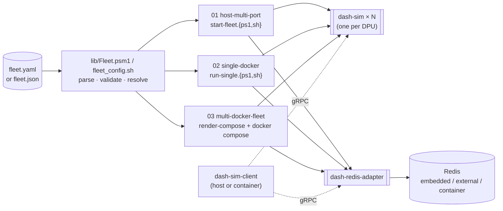
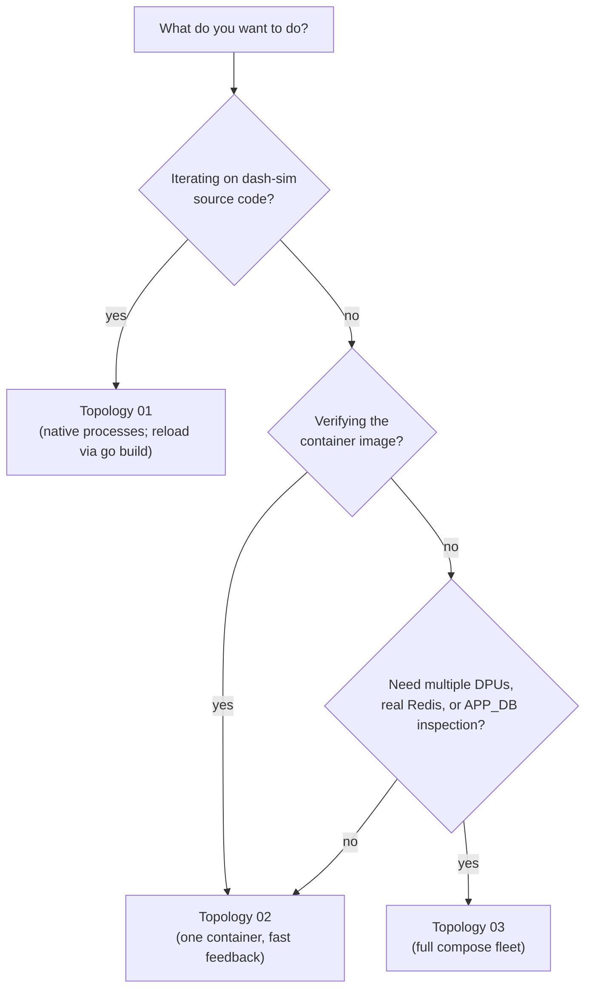

# 09 — Multi-DPU test infrastructure

So far, page [08 — Docker Compose](08-docker-compose.md) gave you one
simulator and one adapter in a single compose file — perfect for a smoke
test, but every real DASH problem involves **many DPUs talking to each
other** or **the same control plane managing a fleet of them**.

This page introduces the **test-setup** subsystem under
[deploy/test-setup/](../../deploy/test-setup/) that lets you stand up *N*
independent DPUs (one process or container per DPU), plus the Redis
APP_DB adapter, from **one config file** — and gives you three different
runtime topologies depending on how much isolation you want.

By the end of this page you'll know:

- The one config file that drives everything (`fleet.yaml` / `fleet.json`).
- The three topologies and when to pick each.
- Where to find the **hands-on, step-by-step walkthroughs** for every topology.
- How the same `dash-sim-client` CLI works against all three identically.

> **Time budget**: 15 minutes for this page. The hands-on guides it
> links to each take 30–60 minutes to work through end-to-end.

---

## Why a separate "test-setup"?

| Question | Answer |
|---|---|
| Why not just `docker compose up --scale dash-sim=10`? | Compose's `--scale` can't give each replica a unique `--device-id` or its own host port. Multi-DPU testing needs both. |
| Why a config file instead of script flags? | A single source of truth shared across native processes, single-container, and full-compose topologies — so the same port plan and DPU list works everywhere. |
| Why three topologies? | Different fidelity needs: native procs (fast dev loop), one container (image validation), full compose fleet (CI / integration / demos with real Redis). |

---

## The one config file

User-editable inputs live in
[`deploy/test-setup/fleet.yaml`](../../deploy/test-setup/) or
[`deploy/test-setup/fleet.json`](../../deploy/test-setup/) — both forms
are accepted, auto-detected by extension. Reference defaults:
[`fleet.example.yaml`](../../deploy/test-setup/fleet.example.yaml) /
[`fleet.example.json`](../../deploy/test-setup/fleet.example.json).
Schema for editor linting:
[`fleet.schema.json`](../../deploy/test-setup/fleet.schema.json).

The whole file is small:

```yaml
apiVersion: dashcenter.io/test-setup/v1
kind: FleetConfig

defaults:
  scenario:     scenarios/dpu-base.yaml      # paths are POSIX, relative to this file
  imageTag:     dev
  bindHost:     127.0.0.1                    # 0.0.0.0 to expose on LAN
  network:      dashcenter-fleet
  tickInterval: 1s

dpus:
  - { deviceId: dpu-sim-01, grpcPort: 50051, adminPort: 8081 }
  - { deviceId: dpu-sim-02, grpcPort: 50052, adminPort: 8082 }
  - { deviceId: dpu-sim-03, grpcPort: 50053, adminPort: 8083 }

adapter:
  enabled:  true
  grpcPort: 52051
  redis:
    mode:     embedded                       # embedded | external | container
    hostPort: 6379
    address:  localhost:6379
```

Want 10 DPUs on a different port range? Just add list entries — every
script picks the change up automatically.

### What the tooling does with it

Every start script runs the same loader (PowerShell `Fleet.psm1` or bash
`fleet_config.sh`) which:

1. Resolves the config file (precedence: `-Config` flag → `$DASHCENTER_FLEET_CONFIG` → `fleet.yaml` → `fleet.json` → `fleet.example.yaml`).
2. Validates: non-empty DPUs, unique `deviceId`, unique host ports across DPUs + adapter + redis, ports ≥ 1024 (unless `--allow-privileged`), redis-mode/companion-field consistency, scenario files exist.
3. Errors point at the exact field (`dpus[1].grpcPort: 50051 conflicts with dpus[0].grpcPort`) — no cryptic "port already in use" from docker.

---

## How the pieces fit together



---

## The three topologies

| # | Topology | What runs | When to use |
|---|---|---|---|
| 01 | [Host, multi-port](../../deploy/test-setup/01-host-multi-port/README.md) | N `dash-sim.exe` + 1 `dash-redis-adapter.exe` as native host processes; embedded miniredis | Fastest dev loop — you just ran `go build`. |
| 02 | [Single docker](../../deploy/test-setup/02-single-docker/README.md) | 1 `dash-sim` container + 1 adapter container on an isolated network | Validating the container image before promoting it. |
| 03 | [Multi-docker fleet](../../deploy/test-setup/03-multi-docker-fleet/README.md) | N `dash-sim` containers + adapter + real `redis` container via auto-rendered compose | Multi-DPU integration tests, CI, demo days, inspecting the SONiC APP_DB wire format directly. |

All three honour the **same port plan** from `fleet.yaml`, so a single
set of `dash-sim-client --target` commands works against whichever fleet
is currently up.

### Hands-on guides (highly recommended)

Each topology has a **step-by-step walkthrough** with every command,
expected log, smoke test, clean stop, and rescue cleanup. Start with the
one that matches how you plan to use it most:

- [`01-host-multi-port/manual-handson.md`](../../deploy/test-setup/01-host-multi-port/manual-handson.md) — 20 steps, native processes.
- [`02-single-docker/manual-handson.md`](../../deploy/test-setup/02-single-docker/manual-handson.md) — 17 steps, single container.
- [`03-multi-docker-fleet/manual-handson.md`](../../deploy/test-setup/03-multi-docker-fleet/manual-handson.md) — 22 steps, full compose fleet (includes inspecting the SONiC APP_DB wire format directly in Redis).

The CLI walkthrough that's already in
[`cli-walkthrough.md`](../../deploy/test-setup/cli-walkthrough.md) works
unchanged against every topology — same `dash-sim-client --target …`
commands, different fleet underneath.

---

## Cross-platform support

| Environment | Use these scripts |
|---|---|
| Windows + PowerShell 7+ | `*.ps1` |
| Windows PowerShell 5.1 | `*.ps1` (JSON config only without `PowerShell-Yaml`) |
| WSL (any distro) | `*.sh` |
| Linux / macOS native | `*.sh` |
| Git-Bash / MSYS on Windows | `*.sh` |

JSON config + PowerShell or JSON + bash with `jq` is the **zero-dep**
path. YAML requires `PowerShell-Yaml` on PS 5.1 or `yq` on bash, with
clean install hints printed if missing.

`.gitattributes` in [deploy/test-setup/](../../deploy/test-setup/)
pins `*.sh` to LF and `*.ps1` to CRLF so WSL never trips on `\r`.

---

## Picking your first topology — a decision tree



---

## A representative session

Drop into this once you've followed any one hands-on guide. These same
commands work against any of the three topologies:

```powershell
$c    = "..\..\src\impl-go\bin\dash-sim-client.exe"
$sim1 = "127.0.0.1:50051"
$sim2 = "127.0.0.1:50052"
$ada  = "127.0.0.1:52051"

# Ping the fleet.
$sim1, $sim2, $ada | ForEach-Object {
  Write-Host -NoNewline "$_ -> "
  & $c --target $_ ping
}

# Write a VNet to dpu-sim-02 only — every DPU is its own store.
& $c --target $sim2 apply --kind vnet --key vnet-test --value '{"vni":9001}'
& $c --target $sim2 list  --kind vnet -o table   # has vnet-test
& $c --target $sim1 list  --kind vnet -o table   # does NOT

# Push to the adapter (same CLI, different backend).
& $c --target $ada apply --kind vnet --key vnet-redis --value '{"vni":7777}'
& $c --target $ada list  --kind vnet -o table
```

The point of the whole setup: **the CLI is backend-agnostic, and your
test infrastructure scales from one host process to a full multi-DPU
compose fleet without changing any command you type.**

---

## What changed since page 08?

| Aspect | Page 08 (`deploy/compose/docker-compose.yml`) | This page (`deploy/test-setup/`) |
|---|---|---|
| Source of truth | The compose file itself | `fleet.{yaml,json}` |
| DPU count | 1 (or compose `--scale`, but no unique device IDs) | N independent DPUs, each with its own `--device-id` and host ports |
| Topologies | Container only | Native procs, single container, compose fleet |
| Port plan | Hardcoded in compose | Configured per DPU |
| Hands-on guidance | This tutorial page | Topology-specific `manual-handson.md` files |
| Redis | Always a container | embedded / external / container (configurable) |

[`deploy/compose/docker-compose.yml`](../../deploy/compose/docker-compose.yml)
is **deliberately left as the minimal single-DPU demo** — it's the
shortest possible "compose works" story and the entry point page 08
covers. The test-setup tree is where you go once you need more.

---

## Troubleshooting (quick)

For the full per-topology matrices see each `manual-handson.md`. The two
most common issues you'll hit:

| Symptom | Fix |
|---|---|
| `fleet config invalid: port 50051 ...` | Validator caught a duplicate port. Edit `fleet.yaml` so every port across DPUs + adapter is unique. |
| `bad interpreter: /usr/bin/env\r` in WSL | Bash script got CRLF line endings. `git checkout -- deploy/test-setup` after `.gitattributes` is in place. |

---

## Where to go next

- → [`deploy/test-setup/README.md`](../../deploy/test-setup/README.md) — full reference for the test-setup subsystem.
- → [`deploy/test-setup/cli-walkthrough.md`](../../deploy/test-setup/cli-walkthrough.md) — operator drill that works against any topology.
- → [docs/CLI_GUIDE.md](../CLI_GUIDE.md) — canonical CLI reference.
- → [modules/dash-sim.md](modules/dash-sim.md) — pipeline internals (useful when interpreting `simulate --trace` output).
