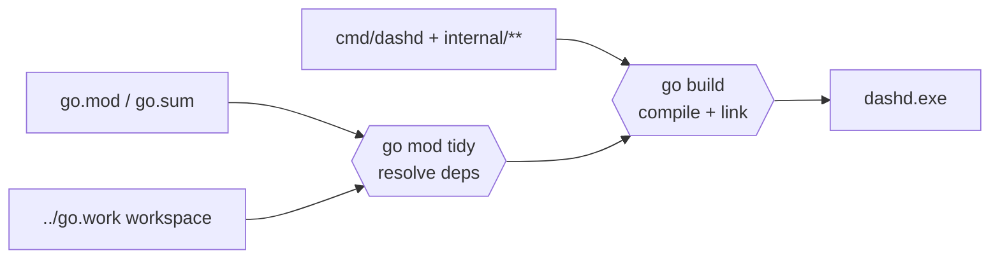

# 10 — dashd: Build From Source

> **You'll be able to**: build the `dashd.exe` (or `dashd`) binary on
> Windows and Linux, run a vet pass, and print the version banner. This
> is the prerequisite for every dashd page that follows.

> **Came from**: [09 — Multi-DPU test infra](09-multi-dpu-test-infra.md).
> Up to now you've been running the `dash-sim` simulator standalone.
> Pages 10-15 introduce **dashd**, the control plane that *drives* a
> fleet of simulators.
>
> **Next**: [11 — dashd unit tests](11-dashd-unit-tests.md).

---

## You'll need

| From earlier pages | Why |
|---|---|
| [03 — Build setup](03-build-setup.md) — Go 1.22+ on PATH | dashd is a Go binary |
| [02 — Modules](02-modules.md) — workspace layout | dashd lives under `src/impl-go/dashd/` |
| **Nothing else** — no Docker, no protoc, no Redis. dashd Phase 1 is fully self-contained. |

> **Tip.** If `go version` does not print anything, jump back to
> [03 — Build setup](03-build-setup.md) before continuing.

---

## 1. Where dashd lives

```
src/impl-go/dashd/
├── cmd/dashd/main.go                 ← the program entry point
├── configs/
│   └── dashd.example.yaml            ← reference config (you'll copy this)
├── internal/
│   ├── server/rest/                  ← REST handler   (port 8443)
│   ├── server/grpc/                  ← gRPC handler   (port 9443)
│   ├── server/admin/                 ← admin HTTP     (port 7443)
│   ├── service/                      ← control-plane business logic
│   ├── store/file/                   ← file-backed JSON store
│   ├── subscribe/                    ← gRPC pump to each DPU
│   ├── dispatch/                     ← per-DPU outbound queue
│   ├── reconciler/                   ← periodic desired↔observed sweep
│   └── ...
├── Dockerfile
└── Makefile
```

The three numbers to remember: **8443** (REST), **9443** (gRPC), **7443** (admin).

---

## 2. The 90-second path

### 2.1 Windows (pwsh)

```powershell
# One-shot PATH for the Go SDK
$env:PATH   = "$env:USERPROFILE\go-sdk\go\bin;$env:USERPROFILE\go\bin;$env:PATH"
$env:GOPATH = "$env:USERPROFILE\go"

cd C:\WorkSpace\PS\PublicRepo\DashCenter\src\impl-go\dashd
go mod tidy
go build -o dashd.exe ./cmd/dashd
.\dashd.exe --version
```

Expected:

```
dashd 0.1.0-phase1
```

### 2.2 Linux / macOS / WSL

```bash
export PATH=/usr/local/go/bin:$HOME/go/bin:$PATH

cd ~/work/DashCenter/src/impl-go/dashd
go mod tidy
go build -o dashd ./cmd/dashd
./dashd --version
```

Expected:

```
dashd 0.1.0-phase1
```

That's it. `dashd.exe` (or `dashd`) is a single static binary; you can
copy it anywhere.

---

## 3. What the build actually did, technically



1. `go mod tidy` walks every import in dashd's tree and pins versions
   in `go.mod` + `go.sum`. Idempotent — you only need to re-run it
   after editing `go.mod` or pulling new code.
2. `go build -o dashd.exe ./cmd/dashd` compiles every package reachable
   from `main.go`, links statically, and writes a single binary. No
   CGO, no shared libraries.

The output binary embeds:

- a static version string (see `cmd/dashd/main.go`),
- a complete in-process HTTP+gRPC server stack,
- a file-backed JSON store (no external DB needed for Phase 1),
- a goroutine-based reconciler and dispatcher.

That's why you see no `protoc`, no Docker, no Redis in the prerequisites.
Phase 1 dashd has **zero external runtime dependencies** beyond the
filesystem it writes its state to.

---

## 4. Build variants (try one)

### 4.1 Compile-check the whole tree without producing a binary

```powershell
cd C:\WorkSpace\PS\PublicRepo\DashCenter\src\impl-go\dashd
go build ./...
```

Silent success means every package compiles. Any failure prints
`file.go:line: …`. This is the fastest pre-commit check.

### 4.2 Strip + trim for a release binary

```powershell
go build -trimpath -ldflags="-s -w" -o dashd-release.exe ./cmd/dashd
Get-Item dashd.exe, dashd-release.exe | Select-Object Name, Length
```

Expected: `dashd-release.exe` ≈ 10-15 MB vs. `dashd.exe` ≈ 18-25 MB.
This is what the [`Dockerfile`](../../src/impl-go/dashd/Dockerfile) does for
the distroless image.

### 4.3 Cross-compile from Linux for Windows

```bash
GOOS=windows GOARCH=amd64 go build -o dashd.exe ./cmd/dashd
```

### 4.4 Static vet pass

```powershell
go vet ./...
```

`go vet` runs a battery of correctness lints (unreachable code, printf
arg-mismatch, suspicious goroutine leaks). Zero output = pass.

### 4.5 With the Makefile (if `choco install make` is on your machine)

```powershell
cd C:\WorkSpace\PS\PublicRepo\DashCenter\src\impl-go\dashd
make build
make vet
```

The Makefile is the recommended path because it stamps the binary with
the current git commit and a UTC build date via `-ldflags`. The output
of `dashd --version` then includes the commit short-SHA.

---

## 5. Verify what you built

```powershell
.\dashd.exe --help
```

Expected (excerpt — flags may evolve):

```
dashd is the DashCenter control plane.

Usage:
  dashd [flags]

Flags:
      --config string   path to YAML config (default "configs/dashd.example.yaml")
  -h, --help            help for dashd
      --version         print version and exit
```

```powershell
.\dashd.exe --version
# dashd 0.1.0-phase1
```

Both must succeed before you proceed to page 11.

---

## 6. Try this

1. **Tag your build with a custom version.** Add
   `-ldflags "-X main.version=my-experiment"` to `go build`, then run
   `--version`. Confirm your tag prints.
2. **Find the binary size delta.** Compare a `go build` vs.
   `go build -trimpath -ldflags='-s -w'`. Both work; which is smaller,
   and by how much?
3. **Reproducible builds.** Run `go build -trimpath` twice and diff the
   two binaries with `Get-FileHash` (pwsh) / `sha256sum` (bash). Are
   they identical? If not, what's the cause? *(Hint: the build date
   ldflag in the Makefile.)*
4. **Look up `main()`.** Open [`src/impl-go/dashd/cmd/dashd/main.go`](../../src/impl-go/dashd/cmd/dashd/main.go).
   Count how many goroutines `main` launches before blocking on the
   signal handler. That number is your mental model of dashd's runtime
   shape.

---

## 7. Troubleshooting

| Symptom | Likely cause | Fix |
|---|---|---|
| `go: command not found` | Go SDK not on PATH | Re-run the PATH line in §2 or revisit [03 — Build setup](03-build-setup.md) |
| `cannot find module providing package …` | Workspace member missing | `cd src/impl-go && go work sync` |
| `unknown flag: --version` | Old commit | Pull `main` and rebuild |
| Build is **really slow** on first run | Module cache cold | One-time only; the cache lives at `$env:USERPROFILE\go\pkg\mod` |
| Antivirus quarantines `dashd.exe` on Windows | False positive (common for new Go binaries) | Whitelist your build directory in Defender; this is benign |
| `permission denied` writing to `bin/` (Linux) | Wrong owner from prior `sudo` build | `sudo chown -R $USER bin/` |

---

## 8. Stable exit codes from this page

| Code | Meaning |
|---|---|
| 0 | Build succeeded |
| 1 | Compile failure |
| 2 | `go build` invoked with bad flags |

---

## Next

→ [11 — dashd unit tests](11-dashd-unit-tests.md). You now have a
binary; the next page runs the unit suite that proves it works.

---

> **Deep-dive reference**: the canonical Windows recipe is
> [docs/windows/DASHD-BUILD_AND_RUN_UNIT_TEST.md](../windows/DASHD-BUILD_AND_RUN_UNIT_TEST.md).
> This tutorial page is the on-ramp; the windows doc is the appendix.
