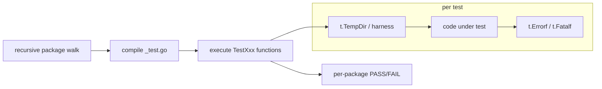

# 11 — dashd: Unit Tests & Coverage

> **You'll be able to**: run dashd's full unit suite, read the
> per-package coverage report, run a single test by name, and recognize
> the test layout so you can add new tests confidently.

> **Came from**: [10 — dashd build](10-dashd-build.md). You now have a
> built `dashd` binary; this page proves the code is healthy and shows
> you the bar new code must clear.
>
> **Next**: [12 — dashd integration tests](12-dashd-integration-tests.md).

---

## You'll need

| From earlier pages | Why |
|---|---|
| Page 10 completed (binary builds) | Tests share the same module |
| Go 1.22+ on PATH | `go test` driver |
| **Optional**: a C toolchain (MinGW / GCC) for `-race` | Race detector requires CGO |

Nothing on the wire — these are pure unit tests; they spin up no
sockets except in-process loopbacks.

---

## 1. The 60-second path

### 1.1 Windows (pwsh)

```powershell
$env:PATH   = "$env:USERPROFILE\go-sdk\go\bin;$env:USERPROFILE\go\bin;$env:PATH"
cd C:\WorkSpace\PS\PublicRepo\DashCenter\src\impl-go\dashd
go test -count=1 ./...
```

Expected (truncated — package names match your tree):

```
?   .../dashd/cmd/dashd             [no test files]
?   .../dashd/internal/store         [no test files]
ok  .../dashd/internal/config        1.9s
ok  .../dashd/internal/dispatch      2.9s
ok  .../dashd/internal/inventory     3.1s
ok  .../dashd/internal/model         1.5s
ok  .../dashd/internal/placement     2.4s
ok  .../dashd/internal/reconciler    3.3s
ok  .../dashd/internal/server/admin  2.7s
ok  .../dashd/internal/server/rest   2.5s
ok  .../dashd/internal/server/grpc   3.1s
ok  .../dashd/internal/store/file    1.7s
ok  .../dashd/internal/subscribe     1.5s
ok  .../dashd/internal/service       2.0s
```

`?` means "this package has no `_test.go` files yet" — not a failure.
`ok` means every test in that package passed.

### 1.2 Linux / WSL

```bash
export PATH=/usr/local/go/bin:$HOME/go/bin:$PATH
cd ~/work/DashCenter/src/impl-go/dashd
go test -count=1 ./...
```

The output is identical except for forward slashes.

---

## 2. What `go test ./...` actually does



- `./...` is Go's "recursive package selector"; it walks every
  subdirectory and picks up packages that declare `package x_test`
  alongside their `package x` source.
- `-count=1` disables Go's per-test-result cache so every run truly
  recompiles + re-executes (recommended in CI and any time you've
  changed configuration).
- Tests use Go's built-in `testing` package; no external test runner.
- Each test is isolated by `t.TempDir()` and `httptest.NewServer` for
  HTTP, `bufconn` for gRPC — no shared state, no real ports.

---

## 3. Useful variants

### 3.1 Verbose — see every test name

```powershell
go test -count=1 -v ./...
```

The output adds `=== RUN  TestPutVnetRoundTrip` and `--- PASS`/`FAIL`
lines so you can see exactly which test produced which line.

### 3.2 Coverage (per-package)

```powershell
go test -count=1 -cover ./...
```

Expected last lines (numbers approximate; they grow as the codebase
matures):

```
ok  .../dashd/internal/config        1.9s  coverage: 91.2% of statements
ok  .../dashd/internal/dispatch      2.9s  coverage: 86.7% of statements
ok  .../dashd/internal/inventory     3.1s  coverage: 94.5% of statements
ok  .../dashd/internal/model         1.5s  coverage: 92.0% of statements
ok  .../dashd/internal/placement     2.4s  coverage: 88.4% of statements
ok  .../dashd/internal/reconciler    3.3s  coverage: 85.9% of statements
ok  .../dashd/internal/server/admin  2.7s  coverage: 90.3% of statements
ok  .../dashd/internal/server/rest   2.5s  coverage: 93.1% of statements
ok  .../dashd/internal/server/grpc   3.1s  coverage: 88.7% of statements
ok  .../dashd/internal/store/file    1.7s  coverage: 96.0% of statements
ok  .../dashd/internal/subscribe     1.5s  coverage: 84.6% of statements
ok  .../dashd/internal/service       2.0s  coverage: 89.5% of statements
```

### 3.3 Aggregate coverage (one number)

```powershell
go test -count=1 -coverprofile cov.out -covermode count ./...
go tool cover -func cov.out | Select-Object -Last 1
# total:                                                                         (statements)                     ~88-90%
Remove-Item cov.out
```

The aggregate floor for dashd Phase 1 is **≥ 85%**. If a PR drops below
that, CI fails. Use this command before opening a PR.

### 3.4 HTML coverage browser

```powershell
go test -count=1 -coverprofile cov.out ./...
go tool cover -html=cov.out -o cov.html
Start-Process cov.html        # opens default browser
```

Red lines = untested code paths; green = covered. The most useful tool
when you're hunting "where do I add a test for this?".

### 3.5 Run a single test by name

```powershell
go test -v -run TestPutGetVnet ./internal/server/rest/
```

`-run` is a regex anchored to the start of the test name. `TestPut`
matches `TestPutGetVnet`, `TestPutAclPolicy`, `TestPutRoutePolicy`, etc.

### 3.6 Race detector (CGO required)

```powershell
$env:CGO_ENABLED = "1"
go test -race -count=1 ./internal/dispatch/
```

The race detector instruments memory accesses; it slows tests ~5× but
catches data races. Run it on the goroutine-heavy packages
(`dispatch`, `subscribe`, `reconciler`) before publishing a PR that
touches them.

### 3.7 With the Makefile

```powershell
cd C:\WorkSpace\PS\PublicRepo\DashCenter\src\impl-go\dashd
make test           # = go test -count=1 ./...
make test-cover     # = -count=1 -cover ./...
```

Same output, three fewer characters to remember.

---

## 4. Package-by-package guide

The test count by package, for orientation:

| Package | What it covers | Approx test count |
|---|---|---|
| `internal/config` | YAML parse + defaults + env override | 9 |
| `internal/store/file` | Atomic JSON file writes, CAS semantics | 18 |
| `internal/inventory` | Static inventory loader, prober state | 24 |
| `internal/model` | In-memory observed-state cache | 14 |
| `internal/placement` | Per-DPU spec assignment | 26 |
| `internal/subscribe` | gRPC pump, retry, backoff | 6 |
| `internal/dispatch` | Per-DPU outbound queue, ApplyBatch shape | 8 |
| `internal/reconciler` | Periodic tick, diff computation | 6 |
| `internal/server/rest` | HTTP handlers, error mapping | 6 |
| `internal/server/grpc` | gRPC handlers, status code mapping | varies |
| `internal/server/admin` | `/admin/health`, `/admin/inventory`, `/admin/drift` | 7 |
| `internal/service` | Control-plane business logic | varies |

> **Tip.** If you're new to the codebase, read tests **before** reading
> the package itself. The test names are usually the cleanest available
> spec of what the package guarantees.

---

## 5. Try this

1. **Read one test.** Open
   [`src/impl-go/dashd/internal/store/file/store_test.go`](../../src/impl-go/dashd/internal/store/file/store_test.go),
   pick a `TestPut*` function, and follow it line-by-line. Identify
   the *temp dir setup*, the *act* (the `store.Put` call), and the
   *assert* (the round-trip read).
2. **Find an uncovered line.** Generate `cov.html` (§3.4) and click
   into `internal/server/rest/`. Find a red line. Read the surrounding
   handler. Could you write a test that turns it green? *(You don't
   have to — just exercise the muscle.)*
3. **Break a test on purpose.** Open a `*_test.go`, change one
   `expected` value, save, re-run. Watch the error message. Revert.
   This is the fastest way to learn what a failure looks like in your
   terminal before you ever cause one for real.
4. **Time the suite.** Run `go test -count=1 ./... | Measure-Command`.
   Aim is ≤ 30s on a commodity laptop. If yours takes longer, your
   antivirus is probably scanning `go test` outputs — exclude the
   build cache.

---

## 6. Troubleshooting

| Symptom | Likely cause | Fix |
|---|---|---|
| `cannot find package "github.com/…"` | Workspace not synced | `cd src/impl-go && go work sync && go mod tidy` (in dashd/) |
| `go: -race requires cgo` | No C compiler on PATH | Install MinGW (Windows) or run `-race` on Linux/macOS only |
| Tests pass locally, fail in CI | Time-zone or temp-dir assumption | Re-read the failing test; assert on UTC or `t.TempDir()` paths |
| `permission denied` in `t.TempDir()` (Windows) | Antivirus | Exclude `%TEMP%\go-build*` from real-time scanning |
| Random `port already in use` | A previous run left a listener; test should use `:0` | If you wrote the test, switch to `httptest.NewServer` |
| Coverage suddenly drops on a PR | A new untested path landed | Run `go tool cover -html=cov.out` and add the missing test |

---

## 7. The bar for new code

Before opening a PR that touches dashd:

| Check | Command |
|---|---|
| Compile | `go build ./...` |
| Vet | `go vet ./...` |
| Unit tests | `go test -count=1 ./...` |
| Coverage on touched packages | `go test -cover ./your/pkg/` ≥ existing |
| Aggregate coverage | ≥ 85% — see §3.3 |
| Race detector on goroutine-heavy paths | `go test -race ./internal/dispatch/` |

PRs that fail any of those are auto-blocked.

---

## 8. Stable exit codes from `go test`

| Code | Meaning |
|---|---|
| 0 | All tests passed |
| 1 | At least one test failed |
| 2 | Bad test invocation (typo, unknown package) |

---

## Next

→ [12 — dashd integration tests](12-dashd-integration-tests.md). Unit
tests prove each package in isolation; integration tests prove dashd
and dash-sim cooperate end-to-end.

---

> **Deep-dive reference**: the canonical Windows recipe is
> [docs/windows/DASHD-BUILD_AND_RUN_UNIT_TEST.md](../windows/DASHD-BUILD_AND_RUN_UNIT_TEST.md)
> §6–§7.
