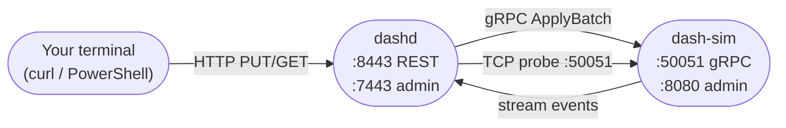

# 12 — dashd: Integration Tests (End-to-End by Hand)

> **You'll be able to**: spin up one `dash-sim` and one `dashd` from
> source, drive them over REST, observe convergence, then optionally
> scale to 2 DPUs to see placement in action — all without Docker.

> **Came from**: [11 — dashd unit tests](11-dashd-unit-tests.md). Units
> prove a single package; integration proves dashd + dash-sim
> *cooperate*.
>
> **Next**: [13 — dashd single-node experiment](13-dashd-single-node.md).

---

## You'll need

| From earlier pages | Why |
|---|---|
| Page 10 — built `dashd.exe` | We'll run it |
| Page 04 — built `dash-sim.exe` (or just `go run`) | dashd needs at least one DPU to dispatch to |
| `curl.exe` (bundled with Windows 10+) | Talk to dashd over REST |

No Docker, no compose, no namespaces — just two processes and your
shell.

---

## 1. Mental model



**The integration loop**:

1. You PUT a vnet to dashd over REST.
2. dashd persists it to its file store.
3. The reconciler computes a per-DPU diff.
4. The dispatcher fans out to each affected DPU over gRPC.
5. dash-sim updates its in-memory observed state.
6. You verify either via dashd's `/admin/drift` (should be empty) or
   dash-sim's `/admin/dump` (should contain the vnet).

Every command below maps to one of those arrows.

---

## 2. The 3-terminal walkthrough (1 dashd + 1 sim)

You will need **three terminal windows**. Keep them all open for the
whole experiment.

### Terminal 1 — dash-sim

```powershell
$env:PATH = "$env:USERPROFILE\go-sdk\go\bin;$env:USERPROFILE\go\bin;$env:PATH"
cd C:\WorkSpace\PS\PublicRepo\DashCenter\src\impl-go\dash-sim
go run ./cmd/dash-sim
```

Expected (last line first):

```
level=INFO msg="dash-sim listening" grpc=:50051 admin=:8080
```

Leave it running.

### Terminal 2 — dashd

```powershell
$env:PATH = "$env:USERPROFILE\go-sdk\go\bin;$env:USERPROFILE\go\bin;$env:PATH"
cd C:\WorkSpace\PS\PublicRepo\DashCenter\src\impl-go\dashd
go run ./cmd/dashd --config configs\dashd.example.yaml
```

Expected last lines:

```
level=INFO msg="rest: listening"   addr=:8443
level=INFO msg="grpc: listening"   addr=:9443
level=INFO msg="admin: listening"  addr=:7443
level=INFO msg="dashd ready" rest=:8443 grpc=:9443 admin=:7443
```

Leave it running too.

### Terminal 3 — your operator shell

```powershell
# Sanity: dashd up?
curl.exe -s http://localhost:7443/admin/health
# {"status":"ok","leader":true,"dpus":[]}    ← no DPU registered yet
```

---

## 3. Register the DPU, push specs, watch them converge

All in **Terminal 3**, copy-paste in order:

### 3.1 Register dash-sim as `dpu-0`

```powershell
curl.exe -s -X PUT http://localhost:8443/v1/inventory `
  -H "Content-Type: application/json" `
  -d "{\"dpus\":[{\"id\":\"dpu-0\",\"endpoint\":\"localhost:50051\"}]}"
```

Expected:

```
{"accepted":true,"generation":1}
```

What happened: dashd persisted the inventory to
`<state_dir>/inventory.json`, then the prober TCP-dialed
`localhost:50051` and flipped `dpu-0` to `DPU_STATE_UP`. Confirm:

```powershell
Start-Sleep 5
curl.exe -s http://localhost:7443/admin/inventory
# {"dpus":[{"id":"dpu-0","endpoint":"localhost:50051","state":"DPU_STATE_UP","last_seen":"..."}]}
```

### 3.2 Create a vnet

```powershell
curl.exe -s -X PUT http://localhost:8443/v1/default/vnets/vnet-1 `
  -H "Content-Type: application/json" `
  -d "{\"name\":\"vnet-1\",\"vni\":100}"
```

Expected:

```
{"accepted":true,"generation":1}
```

Two things happened inside dashd:

1. The REST handler called `service.ControlPlane.PutVnet`, which wrote
   `<state_dir>/default/vnet/vnet-1.json`.
2. The reconciler picked up the diff and the dispatcher fan-out a gRPC
   `ApplyBatch` to `dpu-0`.

### 3.3 Create an ENI on the vnet

```powershell
curl.exe -s -X PUT http://localhost:8443/v1/default/enis/eni-1 `
  -H "Content-Type: application/json" `
  -d "{\"name\":\"eni-1\",\"vnet_name\":\"vnet-1\",\"mac_address\":\"aa:bb:cc:dd:ee:01\",\"underlay_ip\":\"10.1.1.1\"}"
```

Expected:

```
{"accepted":true,"generation":1}
```

### 3.4 Force an immediate reconcile

The reconciler runs every 15s by default (see
`configs\dashd.example.yaml`). To not wait:

```powershell
curl.exe -s -X POST http://localhost:8443/v1/reconcile
# {"accepted":true}
```

### 3.5 Verify drift is empty (the dashd side)

```powershell
curl.exe -s "http://localhost:7443/admin/drift?dpu=dpu-0"
# {"dpu":"dpu-0","missing":[],"extra":[],"divergent":[]}
```

Empty arrays = dashd's desired state matches what `dpu-0` has reported
back as observed.

### 3.6 Verify the sim received the spec (the dash-sim side)

```powershell
curl.exe -s http://localhost:8080/admin/dump | ConvertFrom-Json | Format-List
```

Expected (excerpt):

```
vnets    : {@{name=vnet-1; vni=100}}
enis     : {@{name=eni-1; vnet_name=vnet-1; mac_address=aa:bb:cc:dd:ee:01; underlay_ip=10.1.1.1}}
```

🎉 **You've just driven a full end-to-end loop**: operator → REST →
dashd → file store → reconciler → dispatcher → gRPC → dash-sim →
observed state.

---

## 4. Tear it back down without restarting

### 4.1 Delete the ENI

```powershell
curl.exe -s -X DELETE http://localhost:8443/v1/default/enis/eni-1
# {"deleted":true}
```

### 4.2 Verify deletion propagates

```powershell
curl.exe -s -X POST http://localhost:8443/v1/reconcile
Start-Sleep 2
curl.exe -s http://localhost:8080/admin/dump | ConvertFrom-Json | Select-Object -ExpandProperty enis
# (empty)
```

The same dispatch pipeline carries a delete just like a create.

---

## 5. Scale up: a second dash-sim (terminals 4 & 5)

### Terminal 4 — second sim on port 50052

```powershell
$env:PATH = "$env:USERPROFILE\go-sdk\go\bin;$env:USERPROFILE\go\bin;$env:PATH"
cd C:\WorkSpace\PS\PublicRepo\DashCenter\src\impl-go\dash-sim
go run ./cmd/dash-sim --grpc-listen :50052 --admin-listen :8082 --device-id dpu-sim-02
```

Expected:

```
level=INFO msg="dash-sim listening" grpc=:50052 admin=:8082
```

### Terminal 3 — re-register inventory with two DPUs

```powershell
curl.exe -s -X PUT http://localhost:8443/v1/inventory `
  -H "Content-Type: application/json" `
  -d "{\"dpus\":[{\"id\":\"dpu-0\",\"endpoint\":\"localhost:50051\"},{\"id\":\"dpu-sim-02\",\"endpoint\":\"localhost:50052\"}]}"
```

```powershell
Start-Sleep 5
curl.exe -s http://localhost:7443/admin/inventory
# Expect both DPUs with state=DPU_STATE_UP
```

### 5.1 Push two ENIs, one per DPU

```powershell
# eni pinned to dpu-0
curl.exe -s -X PUT http://localhost:8443/v1/default/enis/eni-a `
  -H "Content-Type: application/json" `
  -d "{\"name\":\"eni-a\",\"vnet_name\":\"vnet-1\",\"mac_address\":\"aa:bb:cc:dd:ee:01\",\"underlay_ip\":\"10.1.1.1\",\"placement_hint_dpu_ids\":[\"dpu-0\"]}"

# eni pinned to dpu-sim-02
curl.exe -s -X PUT http://localhost:8443/v1/default/enis/eni-b `
  -H "Content-Type: application/json" `
  -d "{\"name\":\"eni-b\",\"vnet_name\":\"vnet-1\",\"mac_address\":\"aa:bb:cc:dd:ee:02\",\"underlay_ip\":\"10.1.1.2\",\"placement_hint_dpu_ids\":[\"dpu-sim-02\"]}"

curl.exe -s -X POST http://localhost:8443/v1/reconcile
Start-Sleep 3
```

### 5.2 Confirm each sim got only the spec(s) targeted at it

```powershell
"---dpu-0---"
curl.exe -s http://localhost:8080/admin/dump | ConvertFrom-Json | Select-Object -ExpandProperty enis | Format-Table name

"---dpu-sim-02---"
curl.exe -s http://localhost:8082/admin/dump | ConvertFrom-Json | Select-Object -ExpandProperty enis | Format-Table name
```

Expected:

```
---dpu-0---
name
----
eni-a

---dpu-sim-02---
name
----
eni-b
```

That's **placement** working: the same dashd, the same dispatcher, but
each DPU only saw the ENI hinted at it. This is why we say
dashd "fans out", not "broadcasts".

---

## 6. The built-in Go integration test suite (no terminals required)

Everything you just did by hand is also automated under
`src/impl-go/dashctl/test/integration/` and runs with a single command:

```powershell
cd C:\WorkSpace\PS\PublicRepo\DashCenter\src\impl-go\dashctl
make test-integration
```

Or without `make`:

```powershell
go test -tags=integration -count=1 -timeout 600s ./test/integration/...
```

The harness:

1. Builds `dashctl.exe` once,
2. Spawns a private dashd + dash-sim per test on dynamic ports
   (so they never collide with the processes you have running),
3. Runs every Phase-1 verb,
4. Tears down with Windows-safe `taskkill /T /F`.

Expected last lines (13 scenarios, ~165s):

```
--- PASS: TestIntegration_VersionClient                  (0.21s)
--- PASS: TestIntegration_Version_ServerUnreachable      (0.05s)
--- PASS: TestIntegration_Explain_Offline                (0.04s)
--- PASS: TestIntegration_DpuList                        (8.30s)
--- PASS: TestIntegration_GetVnet_Empty                  (7.20s)
--- PASS: TestIntegration_Apply_RoundTrip               (12.10s)
--- PASS: TestIntegration_Get_OutputFormats             (14.60s)
--- PASS: TestIntegration_Describe                       (8.50s)
--- PASS: TestIntegration_Reconcile                      (8.10s)
--- PASS: TestIntegration_DpuDrift_Converges            (25.40s)
--- PASS: TestIntegration_Delete_IdempotentAfter         (9.30s)
--- PASS: TestIntegration_Get_LabelSelector             (10.20s)
--- PASS: TestIntegration_Replace_CAS_Mismatch          (12.40s)
PASS
ok      ...dashctl/test/integration      164.760s
```

> **Why the suite lives under dashctl, not dashd**: it tests the
> integration *across* dashd + dash-sim from the operator's vantage
> point. Owning it from dashctl means dashd is allowed to refactor
> internal layout without breaking the suite.

---

## 7. Try this

1. **Trace one apply.** Add `--log-level=debug` to dashd in Terminal 2
   (or set `log.level: debug` in `dashd.yaml`), repeat §3.2, and
   identify these four log lines in order:
   `rest: PUT vnet`, `store: wrote`, `reconciler: diff`,
   `dispatch: ApplyBatch`.
2. **Cause a drift.** Stop dash-sim (Ctrl-C in Terminal 1), push a
   new ENI from Terminal 3, then check `/admin/drift` — it should
   show `missing: ["eni-…"]`. Restart dash-sim and re-poll — it
   should clean up.
3. **CAS in action.** Push the same `vnet-1` twice with no metadata
   change. Look at the response — does generation go to 2? Now push it
   with `"expected_generation": 99` — what happens? *(Hint: 409.)*
4. **Try the Go integration suite with `DASHCTL_IT_LOG_DIR` set** to
   `C:\Temp\dashctl-it-logs`. Inspect the harness logs after a run —
   you'll see verbatim stdout/stderr from each spawned dashd and sim.

---

## 8. Troubleshooting

| Symptom | Likely cause | Fix |
|---|---|---|
| `bind: Only one usage of each socket address` on dashd start | Port 8443/9443/7443 still held by an earlier run | `Get-NetTCPConnection -LocalPort 8443 -State Listen \| ForEach-Object { Stop-Process -Id $_.OwningProcess -Force }` |
| `dpu-0` stuck in `REGISTERING` | dash-sim not listening on the registered port | Confirm sim is running (Terminal 1) and the port matches |
| `/admin/drift` always shows `missing` | dash-sim restarted; its observed state is empty until next reconcile | `curl -X POST http://localhost:8443/v1/reconcile` |
| `404` on `/v1/default/vnets/vnet-1` | Wrong namespace or wrong plural | URL pattern is `/v1/<namespace>/<plural>/<name>`; defaults to `default` |
| Go integration suite hangs | A previous run's `dashd.exe` is still holding 8443 | `Get-Process dashd, dash-sim \| Stop-Process -Force` |
| Integration suite passes on Linux, fails on Windows | Likely a path-separator bug in a new test | Use `filepath.Join`, not `"a/b"`, in test code |

---

## 9. What you proved

| Layer | Proven by |
|---|---|
| REST API accepts and persists specs | §3.1–3.3 |
| Reconciler computes diffs and triggers dispatch | §3.4 |
| Dispatcher fans out to the right DPU(s) only | §5 |
| Sim updates observed state on receipt | §3.6, §5.2 |
| Drift report correctly converges to empty | §3.5 |
| Deletes propagate identically to creates | §4 |
| All of the above runs hands-free in CI | §6 |

---

## Next

→ [13 — dashd single-node experiment](13-dashd-single-node.md). That
page is the structured, didactic version of what you just did
freehand, with a config-file deep-dive and a guided tour of every
admin endpoint.

---

> **Deep-dive reference**:
> [docs/windows/DASHD-INTEGRATION-TEST.md](../windows/DASHD-INTEGRATION-TEST.md)
> for the canonical hand-test cookbook, and
> [docs/DASHCTL_INTEGRATION_TEST.md](../DASHCTL_INTEGRATION_TEST.md) for
> the Go-suite contract.
