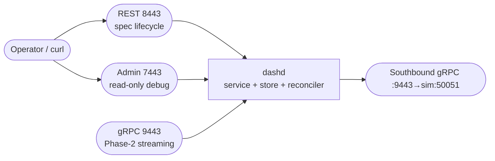

# 13 — dashd: Single-Node Experiment (Config, Endpoints, On-Disk Store)

> **You'll be able to**: configure dashd from a YAML file, understand
> every dashd listener, inspect the file-backed store, and read every
> admin endpoint with confidence. This page is your reference for "what
> is dashd actually doing right now?".

> **Came from**: [12 — integration tests](12-dashd-integration-tests.md).
> You've seen dashd cooperate with a sim. Now we slow down and walk
> dashd by itself, piece by piece.
>
> **Next**: [14 — dashd in Docker, single-DPU e2e](14-dashd-docker-e2e.md).

---

## You'll need

| From earlier pages | Why |
|---|---|
| Page 10 — built `dashd.exe` | We'll launch it |
| `curl.exe` | REST + admin probing |
| **Optional**: `jq` (Linux) or PowerShell's `ConvertFrom-Json` | Prettier JSON |

This page deliberately uses **no** dash-sim. We want to see dashd alone
so you can recognise the parts. Pages 14+ add the DPU back.

---

## 1. The minimal config

Open
[`src/impl-go/dashd/configs/dashd.example.yaml`](../../src/impl-go/dashd/configs/dashd.example.yaml).
It looks roughly like this (yours may evolve; the four blocks are
stable):

```yaml
listen:
  rest_addr:  ":8443"
  grpc_addr:  ":9443"
  admin_addr: ":7443"

storage:
  backend: file
  file:
    state_dir: ./var/dashd

inventory:
  source: api               # or "file"
  # file: /etc/dashd/inventory.yaml

reconcile:
  tick_interval:        15s
  per_dpu_inbox_size:   1
  apply_rate_limit:     100
  error_budget_per_min: 10

log:
  level:  info
  format: json
```

Each block in one sentence:

| Block | What it controls |
|---|---|
| `listen` | The three sockets dashd opens (REST/gRPC/admin) |
| `storage` | Where dashd persists state (Phase 1: a directory of JSON files) |
| `inventory` | Where the DPU list comes from (`api` = `PUT /v1/inventory`; `file` = YAML on disk) |
| `reconcile` | Cadence + flow-control for the diff sweep |
| `log` | Verbosity + format |

> **Tip.** Copy the example file before editing it:
> `Copy-Item configs\dashd.example.yaml configs\my-dashd.yaml`.
> That way you can always `git checkout` the reference back.

---

## 2. Launch dashd and read its banner

```powershell
$env:PATH = "$env:USERPROFILE\go-sdk\go\bin;$env:USERPROFILE\go\bin;$env:PATH"
cd C:\WorkSpace\PS\PublicRepo\DashCenter\src\impl-go\dashd
.\dashd.exe --config configs\dashd.example.yaml
```

Expected (JSON because `log.format: json`):

```json
{"time":"...","level":"INFO","msg":"dashd starting","version":"0.1.0-phase1"}
{"time":"...","level":"INFO","msg":"store: file backend ready","dir":"./var/dashd"}
{"time":"...","level":"INFO","msg":"admin: listening","addr":":7443"}
{"time":"...","level":"INFO","msg":"rest: listening","addr":":8443"}
{"time":"...","level":"INFO","msg":"grpc: listening","addr":":9443"}
{"time":"...","level":"INFO","msg":"reconciler: started","tick":15000000000}
{"time":"...","level":"INFO","msg":"dashd ready","rest":":8443","grpc":":9443","admin":":7443"}
```

What just happened, in the order it logged:

1. **Process start** — the version is the same as `dashd.exe --version`.
2. **Store init** — dashd created `./var/dashd/` (relative to where you
   ran it) and acquired a lock file there. Re-launching with the same
   `state_dir` will pick up everything from before.
3. **Listeners** — three sockets, three goroutines. None of them is
   busy yet.
4. **Reconciler tick** — the periodic sweep is now armed.

> **Want plain-text logs?** Set `log.format: text` in the YAML, or
> override via `--log-format text`. JSON is the prod default; text is
> friendlier for first-look exploration.

Leave dashd running. Open a **second terminal** for everything below.

---

## 3. The three listeners, mapped



| Listener | Audience | Mutates state? | Auth in Phase 1 |
|---|---|---|---|
| **REST :8443** | operator (you, dashctl) | yes | optional bearer |
| **gRPC :9443** | operator (Phase 2) | yes (Phase 2) | optional bearer / mTLS |
| **Admin :7443** | SRE / debug | no — strictly read-only | none |
| **Southbound (outbound) :50051** | dash-sim | dashd → sim only | none |

**Why three?** Separation of concern: admin is always-on, never
auth-walled (so you can still debug a broken cluster), and physically
distinct so you can firewall it off in prod. The southbound is
outbound from dashd's perspective — dashd dials each DPU; DPUs do not
dial dashd.

---

## 4. Drive the REST listener (spec lifecycle)

All commands from your second terminal. Default namespace is `default`.

### 4.1 Register a (fake) DPU just so the placement layer wakes up

```powershell
curl.exe -s -X PUT http://localhost:8443/v1/inventory `
  -H "Content-Type: application/json" `
  -d "{\"dpus\":[{\"id\":\"dpu-virtual\",\"endpoint\":\"localhost:65535\"}]}"
# {"accepted":true,"generation":1}
```

`localhost:65535` does not exist — dashd's prober will report
`UNREACHABLE`, which is exactly what we want for this experiment.

### 4.2 Create a vnet

```powershell
curl.exe -s -X PUT http://localhost:8443/v1/default/vnets/vnet-a `
  -H "Content-Type: application/json" `
  -d "{\"name\":\"vnet-a\",\"vni\":100}"
# {"accepted":true,"generation":1}
```

### 4.3 Read it back

```powershell
curl.exe -s http://localhost:8443/v1/default/vnets/vnet-a
# {"kind":"vnet","name":"vnet-a","namespace":"default","generation":1,"spec":{"name":"vnet-a","vni":100}}
```

### 4.4 List

```powershell
curl.exe -s http://localhost:8443/v1/default/vnets
# {"items":[{"kind":"vnet","name":"vnet-a","namespace":"default","generation":1,"spec":{...}}]}
```

### 4.5 CAS — re-PUT with an `expected_generation` mismatch

```powershell
curl.exe -s -X PUT http://localhost:8443/v1/default/vnets/vnet-a `
  -H "Content-Type: application/json" `
  -d "{\"name\":\"vnet-a\",\"vni\":100,\"expected_generation\":99}" -w "`nHTTP=%{http_code}`n"
```

Expected:

```
{"error":"generation mismatch"}
HTTP=409
```

That's optimistic concurrency working. Update without the guard and
the gen bumps to 2.

### 4.6 Delete

```powershell
curl.exe -s -X DELETE http://localhost:8443/v1/default/vnets/vnet-a
# {"deleted":true}
```

---

## 5. Drive the admin listener (read-only inspection)

| Endpoint | Returns |
|---|---|
| `GET /admin/health` | dashd liveness + leader flag + DPU summary |
| `GET /admin/inventory` | every DPU + state + last_seen |
| `GET /admin/drift?dpu=ID` | `{missing, extra, divergent}` per DPU |
| `GET /admin/dump` (in some builds) | full in-memory model snapshot |
| `GET /admin/metrics` (when enabled) | Prometheus-style counters |

### 5.1 Health

```powershell
curl.exe -s http://localhost:7443/admin/health | ConvertFrom-Json | Format-List
# status    : ok
# leader    : True
# dpus      : {@{id=dpu-virtual; state=DPU_STATE_UNREACHABLE; ...}}
```

### 5.2 Inventory

```powershell
curl.exe -s http://localhost:7443/admin/inventory | ConvertFrom-Json | Select-Object -ExpandProperty dpus | Format-Table
# id          endpoint           state                     last_seen
# --          --------           -----                     ---------
# dpu-virtual localhost:65535    DPU_STATE_UNREACHABLE     (never)
```

### 5.3 Drift

```powershell
curl.exe -s "http://localhost:7443/admin/drift?dpu=dpu-virtual"
# {"dpu":"dpu-virtual","missing":[],"extra":[],"divergent":[]}
```

Empty because we've deleted the vnet. Re-create it and you'll see
`missing` populated until you point dashd at a *real* DPU (page 14).

---

## 6. Inspect the on-disk store

`storage.file.state_dir` from your YAML is where everything lives. By
default that's `./var/dashd/` relative to your launch directory.

```powershell
Get-ChildItem .\var\dashd -Recurse | Select-Object FullName
```

Expected (depends on what you've created):

```
…\var\dashd\.lock
…\var\dashd\inventory.json
…\var\dashd\default\vnet\vnet-a.json
```

| File / dir | Owner |
|---|---|
| `.lock` | Per-process lock (single-writer guard) |
| `inventory.json` | The current registered DPU list |
| `<ns>/<kind>/<name>.json` | One file per spec, lowercase kind, raw JSON body |

### 6.1 Peek at one spec file

```powershell
Get-Content .\var\dashd\default\vnet\vnet-a.json
# {"generation":1,"spec":{"name":"vnet-a","vni":100}}
```

The on-disk shape is intentionally trivial so you can `cat` your way
through any incident. Writes are atomic (write-temp-then-rename).

### 6.2 Delete a file out from under dashd (don't do this in prod)

```powershell
Remove-Item .\var\dashd\default\vnet\vnet-a.json
curl.exe -s http://localhost:8443/v1/default/vnets/vnet-a -w "`nHTTP=%{http_code}`n"
# (nothing)
# HTTP=404
```

dashd reads through to the disk on every GET (Phase 1 — no cache),
so removing the file removes the spec. Future phases will add an
in-memory cache; for now, the disk is the source of truth.

---

## 7. Try this

1. **Find your `state_dir`.** Without grepping the YAML, find it from a
   running dashd: `Get-ChildItem .\var\dashd -Recurse`. What if you
   change the config and restart? Old state survives if `state_dir` is
   the same; otherwise dashd starts blank.
2. **Switch storage to a different folder.** Edit `state_dir:
   C:\Temp\dashd-state`, restart, push a vnet, observe the file lands
   in the new dir. Confirm the OLD `./var/dashd/` is untouched.
3. **Wholesale clean reset.** Stop dashd, delete `state_dir`, restart.
   Dashd starts empty, inventory is `[]`, list returns `{"items":[]}`.
4. **Reconcile cadence.** Lower `reconcile.tick_interval` to `2s`,
   restart, watch how often `reconciler: started` and downstream logs
   fire.
5. **Log a debug session.** Set `log.level: debug`, repeat §4.2, and
   identify the four-line pipeline:
   `rest: PUT … → service.PutVnet → store.Put → reconciler: diff`.

---

## 8. Troubleshooting

| Symptom | Likely cause | Fix |
|---|---|---|
| dashd fails fast with `bind: address already in use` | Old dashd or sibling listener on 8443/9443/7443 | `Get-Process dashd \| Stop-Process -Force`; or change the port in YAML |
| `PUT` returns `500 internal` with no detail in older builds | Stale tree without the B2 fix | Pull `main` and rebuild |
| `state_dir` "permission denied" | Path under `Program Files` or another restricted root | Move to `%LOCALAPPDATA%\dashd-state` |
| Reconciler never fires | Tick > test patience | `curl -X POST :8443/v1/reconcile` to force a tick |
| `dpu-virtual` state stays `REGISTERING` instead of `UNREACHABLE` | Prober disabled in config | Default config has `prober: enabled: true`; check yours |
| Hot-reload doesn't pick up YAML changes | Phase 1 has no hot-reload | Stop + start dashd; config is read at boot only |

---

## 9. Endpoint cheat-sheet

```text
# REST (8443)
GET    /v1/<ns>/<plural>            # list
GET    /v1/<ns>/<plural>/<name>     # get one
PUT    /v1/<ns>/<plural>/<name>     # create/update
DELETE /v1/<ns>/<plural>/<name>     # delete
POST   /v1/reconcile                # force a tick

# REST plurals
vnets · enis · vnet-mappings · acl-policies · route-policies · ha-sets · service-tunnels

# Admin (7443) — read-only
GET /admin/health
GET /admin/inventory
GET /admin/drift?dpu=<id>
GET /admin/dump
```

---

## 10. Stable exit codes

| Code | Meaning |
|---|---|
| 0 | Clean shutdown (Ctrl-C / SIGTERM) |
| 1 | Bad config (YAML parse, missing field) |
| 2 | Port bind failure |
| 64 | Store init failure (lock contention, disk full) |
| 130 | SIGINT |

---

## Next

→ [14 — dashd in Docker, single-DPU e2e](14-dashd-docker-e2e.md). Now
that you understand dashd standalone, we move the same setup into
Docker and let the supplied `e2e.ps1` script prove convergence in one
shot.

---

> **Deep-dive reference**: this page distils
> [docs/windows/DASHD-BUILD_AND_RUN_UNIT_TEST.md](../windows/DASHD-BUILD_AND_RUN_UNIT_TEST.md)
> §8–§12 and the hand-written cookbook
> [docs/windows/DASHD-INTEGRATION-TEST.md](../windows/DASHD-INTEGRATION-TEST.md).
