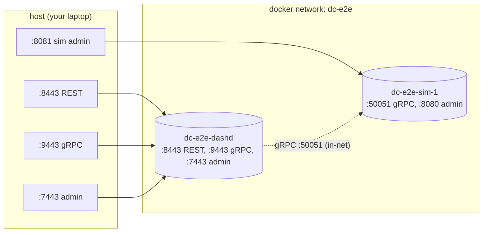

# 14 — dashd in Docker: Single-DPU End-to-End

> **You'll be able to**: bring up `deploy/dashd-e2e/` (one dashd + one
> dash-sim under Docker Compose), run the supplied 8-step verifier, and
> drive the same fleet with `curl` — all without compiling anything on
> your host.

> **Came from**: [13 — single-node experiment](13-dashd-single-node.md).
> You drove dashd from the host. Now we put dashd and a sim into
> containers so you see the prod-shaped wiring.
>
> **Next**: [15 — dashd fleet (5 DPUs)](15-dashd-fleet.md).

---

## You'll need

| From earlier pages | Why |
|---|---|
| Docker Desktop with `docker compose v2` | Brings up the stack |
| `curl.exe` | Talk to the exposed ports |
| Page 13 mental model | You'll recognize the listeners by name |

You **do not** need Go on PATH for this page. The compose builds the
images from source inside Docker, so the host stays clean.

---

## 1. Topology



Two containers + one bridge network. The southbound `dashd → sim`
gRPC stays **internal** to the bridge — there's no host port for it,
which mirrors real-world deployments.

---

## 2. The 90-second path

```powershell
cd C:\WorkSpace\PS\PublicRepo\DashCenter

# 1) Build images and bring everything up
docker compose -f deploy/dashd-e2e/docker-compose.yml up -d --build
```

Expected last lines (truncated):

```
[+] Building 2/2
 ✔ dashd        Built
 ✔ dash-sim-1   Built
[+] Running 3/3
 ✔ Network dashd-e2e_dc-e2e       Created
 ✔ Container dc-e2e-sim-1         Started
 ✔ Container dc-e2e-dashd         Started
```

Wait ~8 seconds for the sim prober to flip:

```powershell
Start-Sleep 8
docker ps --filter "name=dc-e2e-" --format "table {{.Names}}\t{{.Status}}"
```

Expected:

```
NAMES            STATUS
dc-e2e-dashd     Up 8 seconds
dc-e2e-sim-1     Up 9 seconds
```

Both up = the fleet is live.

---

## 3. Run the supplied 8-step verifier

The compose folder ships a deterministic, idempotent verifier. Run it:

```powershell
pwsh -File deploy\dashd-e2e\e2e.ps1
```

(or `./deploy/dashd-e2e/e2e.sh` on Linux / Git Bash / WSL).

Expected (verbatim, ~10s wall time):

```
[1/8] dashd health
      OK    dashd /admin/health responded
[2/8] DPU is UP (poll up to 30s)
      OK    dpu-sim-01 state=DPU_STATE_UP (after 5s)
[3/8] PUT /v1/default/vnets/vnet-e2e
      OK    vnet accepted ({"accepted":true,"generation":1})
[4/8] PUT /v1/default/enis/eni-e2e
      OK    eni accepted ({"accepted":true,"generation":1})
[5/8] Triggering immediate reconcile
      OK    reconcile dispatched
[6/8] Verifying vnet 'vnet-e2e' on the sim (poll up to 30s)
      OK    vnet 'vnet-e2e' present on sim (after 1s)
[7/8] Verifying eni 'eni-e2e' on the sim (poll up to 30s)
      OK    eni 'eni-e2e' present on sim (after 0s)
[8/8] Drift report should be empty
      OK    drift report is clean

PASS: end-to-end converged. dashd successfully pushed vnet+eni to dash-sim-01.
```

If you see `PASS`, every layer of the system is working: REST →
service → store → reconciler → dispatcher → gRPC → sim → observed
state. **This script is your "is the system alive?" command for every
future PR.**

---

## 4. Drive the fleet by hand (mirrors page 13, but in Docker)

In a second terminal:

```powershell
# REST list (empty namespace, just to prove the listener is up)
curl.exe -s http://localhost:8443/v1/default/vnets
# {"items":[{"kind":"vnet","name":"vnet-e2e",...}]}
# (the e2e.ps1 left vnet-e2e behind — that's the expected state)

# Admin health
curl.exe -s http://localhost:7443/admin/health | ConvertFrom-Json | Format-List
# status : ok
# leader : True
# dpus   : {@{id=dpu-sim-01; state=DPU_STATE_UP; ...}}

# Push another vnet
curl.exe -s -X PUT http://localhost:8443/v1/default/vnets/vnet-mine `
  -H "Content-Type: application/json" `
  -d "{\"name\":\"vnet-mine\",\"vni\":777}"
# {"accepted":true,"generation":1}

curl.exe -s -X POST http://localhost:8443/v1/reconcile
Start-Sleep 2

# Inspect from the sim's side
curl.exe -s http://localhost:8081/admin/dump | ConvertFrom-Json | Select-Object -ExpandProperty vnets | Format-Table
# name      vni
# ----      ---
# vnet-e2e  1001
# vnet-mine 777
```

The sim's `/admin/dump` confirms dashd dispatched the new vnet.

---

## 5. What's inside the compose file (read along)

Open
[`deploy/dashd-e2e/docker-compose.yml`](../../deploy/dashd-e2e/docker-compose.yml).
Skim it; the four shapes that matter:

| Shape | What it does | Why |
|---|---|---|
| `services.dash-sim-1` builds from `src/impl-go/dash-sim/Dockerfile` | One containerised sim | The DPU side |
| `services.dashd` depends on `dash-sim-1` | Brings dashd up after the sim | dashd's prober starts immediately, so the sim needs to be ready |
| `services.dashd` ports `8443/9443/7443` published, sim ports just `8081` | Operator sees dashd directly; sim admin only for debugging | Mirrors prod — the operator never talks to the sim |
| `networks: dc-e2e` is the only network | Both containers share a bridge so dashd can resolve `dash-sim-1:50051` | Docker DNS gives us name-based resolution |

The `configs/dashd.yaml` mounted into dashd points its
`inventory.source: file` at the in-mount `inventory.yaml` with one DPU
(`dpu-sim-01` → `dash-sim-1:50051`). That's why dashd discovers exactly
one DPU at boot.

---

## 6. View the dashd logs

```powershell
docker logs -f dc-e2e-dashd
```

Look for these in order during the 8-step verifier run:

```
{"msg":"dashd starting"}
{"msg":"subscribe: pump started","dpu":"dpu-sim-01"}
{"msg":"prober: DPU is UP","dpu":"dpu-sim-01"}     ← step [2/8]
{"msg":"rest: PUT","kind":"vnet","name":"vnet-e2e"}  ← step [3/8]
{"msg":"store: wrote","kind":"vnet","name":"vnet-e2e"}
{"msg":"dispatch: reconcile","dpu":"dpu-sim-01","add":1}  ← step [5/8]
{"msg":"dispatch: reconcile complete","dpu":"dpu-sim-01"}
```

The `add: N` field is your single best signal that the dispatcher
actually shipped something — that's the gRPC call to the sim.

Ctrl-C stops the log follow; containers keep running.

---

## 7. Try this

1. **Re-run `e2e.ps1` twice in a row.** What changes on the second
   pass? Generations bump from 1 to 2 — find the lines and explain
   why.
2. **Stop the sim mid-flight.** `docker stop dc-e2e-sim-1`, then
   `curl /admin/drift?dpu=dpu-sim-01`. What does drift say? Now
   `docker start dc-e2e-sim-1`, wait 10s, force reconcile, recheck
   drift. Converged?
3. **Read the sim's observed state.** Compare `curl :8081/admin/dump`
   immediately after a `PUT`, before forcing reconcile. Is the spec
   there yet? When does it appear?
4. **Run `e2e.ps1` against a stale volume.** Wipe state
   (`docker compose down -v && docker compose up -d --build`) and
   verify the verifier still passes from a blank slate.

---

## 8. Tear down

```powershell
# Stop, keep state
docker compose -f deploy/dashd-e2e/docker-compose.yml down

# Stop AND wipe state
docker compose -f deploy/dashd-e2e/docker-compose.yml down -v
```

`down` removes the containers and the network. `down -v` also removes
any named volumes (the dashd state directory). Next `up -d --build`
starts from a clean slate.

---

## 9. Troubleshooting

| Symptom | Likely cause | Fix |
|---|---|---|
| `bind: 0.0.0.0:8443: Only one usage of each socket address` | A host process or sibling compose is holding the port | `docker compose -f deploy/dashd-fleet/docker-compose.yml down -v` (kills sibling); `Get-Process dashd \| Stop-Process` for host leftovers |
| `e2e.ps1` step [2/8] times out | sim never reported UP | `docker logs dc-e2e-sim-1` — usually a port bind failure inside the container |
| `[6/8]` or `[7/8]` times out | dashd dispatched but sim hasn't applied | Increase the script's poll timeout, or check `docker logs dc-e2e-dashd` for `dispatch: reconcile complete` |
| `docker compose up -d --build` is **slow** the first time | Building Go inside the image | One-time cost; subsequent ups reuse the cached layer |
| `e2e.ps1` exits with `RUNTIME WARNING: failed to determine container name` | Containers aren't running yet | `docker compose ... up -d` first; `e2e.ps1` waits but only briefly |

---

## 10. What you proved

| Layer | Proven by |
|---|---|
| Dashd starts under Docker | §2 banner + `docker ps` |
| Compose-managed network is reachable | §3 step [1/8] |
| Prober flips DPU state to UP via in-net TCP probe | §3 step [2/8] |
| REST `PUT` → store → reconciler → dispatcher → sim | §3 steps [3/8]–[7/8] |
| Drift converges | §3 step [8/8] |
| Same flow drives a custom spec | §4 |
| Whole system tears down + comes back clean | §8 |

---

## Next

→ [15 — dashd fleet (5 DPUs)](15-dashd-fleet.md). Same compose pattern,
but five sims behind one dashd, so you see the dispatcher fan out and
the placement engine pick targets.

---

> **Deep-dive reference**: the compose folder's own
> [`deploy/dashd-e2e/README.md`](../../deploy/dashd-e2e/README.md) is the
> canonical source-of-truth; this page is the on-ramp.
