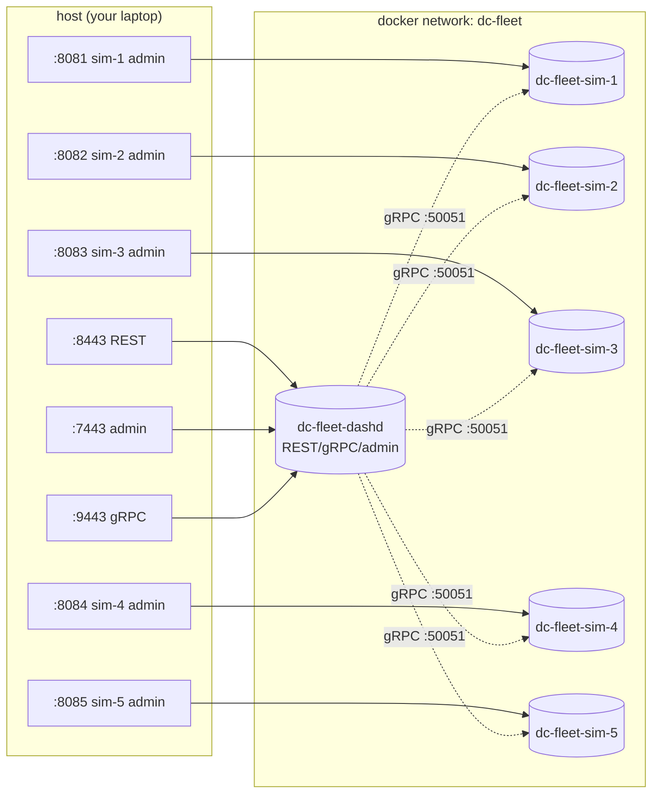

# 15 — dashd Fleet: 5 DPUs Behind One dashd

> **You'll be able to**: bring up `deploy/dashd-fleet/` (one dashd + 5
> sims), push a vnet, watch it fan out to every sim, and use the
> per-sim admin endpoint to confirm receipt. This is the
> infrastructure-prod-shaped deployment, just simulated.

> **Came from**: [14 — dashd Docker e2e](14-dashd-docker-e2e.md). You
> ran one DPU; now we run five.
>
> **Next**: [16 — dashctl quickstart](16-dashctl-quickstart.md).

---

## You'll need

| From earlier pages | Why |
|---|---|
| Docker Desktop with `docker compose v2` | Brings up six containers |
| `curl.exe` | Talk to the exposed ports |
| **Optional**: `jq` (or `ConvertFrom-Json`) | Pretty-print the JSON |

Free ports: `8443 9443 7443 8081 8082 8083 8084 8085`. Verify:

```powershell
@(8443,9443,7443,8081,8082,8083,8084,8085) | ForEach-Object {
  $p = Get-NetTCPConnection -LocalPort $_ -State Listen -ErrorAction SilentlyContinue
  "{0}: {1}" -f $_, ($(if ($p) { 'IN USE — free it first' } else { 'free' }))
}
```

---

## 1. Topology



- **Six containers** on one bridge network.
- The southbound `dashd → sim` gRPC stays in-network only — no host
  port binding for it.
- Each sim has its admin port exposed for debugging only.

---

## 2. The 90-second bring-up

```powershell
cd C:\WorkSpace\PS\PublicRepo\DashCenter

docker compose -f deploy/dashd-fleet/docker-compose.yml up -d --build
```

Expected (truncated):

```
[+] Running 7/7
 ✔ Network dashd-fleet_dc-fleet  Created
 ✔ Container dc-fleet-sim-1      Started
 ✔ Container dc-fleet-sim-2      Started
 ✔ Container dc-fleet-sim-3      Started
 ✔ Container dc-fleet-sim-4      Started
 ✔ Container dc-fleet-sim-5      Started
 ✔ Container dc-fleet-dashd      Started
```

Wait for the prober:

```powershell
Start-Sleep 10
curl.exe -s http://localhost:7443/admin/inventory | ConvertFrom-Json |
  Select-Object -ExpandProperty dpus | Format-Table id, state
```

Expected:

```
id          state
--          -----
dpu-sim-01  DPU_STATE_UP
dpu-sim-02  DPU_STATE_UP
dpu-sim-03  DPU_STATE_UP
dpu-sim-04  DPU_STATE_UP
dpu-sim-05  DPU_STATE_UP
```

Five UPs in under 10s = the fleet is live and dashd has talked to
every sim.

---

## 3. Push a vnet and see it fan out

The compose folder ships a single-vnet push script:

```powershell
pwsh -File deploy\dashd-fleet\push-vnet.ps1
```

Expected:

```
[1/4] PUT /v1/default/vnets/vnet-fleet
      OK    accepted ({"accepted":true,"generation":1})
[2/4] POST /v1/reconcile
      OK    dispatched
[3/4] Verify each sim received vnet-fleet
      OK    sim-1 has vnet-fleet
      OK    sim-2 has vnet-fleet
      OK    sim-3 has vnet-fleet
      OK    sim-4 has vnet-fleet
      OK    sim-5 has vnet-fleet
[4/4] Drift report on each sim
      OK    dpu-sim-01 drift is clean
      OK    dpu-sim-02 drift is clean
      OK    dpu-sim-03 drift is clean
      OK    dpu-sim-04 drift is clean
      OK    dpu-sim-05 drift is clean

PASS: vnet-fleet present on all 5 sims.
```

**What just happened (technically):**

1. `PUT /v1/default/vnets/vnet-fleet` → dashd persisted the spec.
2. `POST /v1/reconcile` → dashd computed a diff for each DPU. The vnet
   is namespace-level (no `placement_hint_dpu_ids`), so it applies to
   every DPU.
3. Dispatcher fanned out 5 `ApplyBatch` gRPC calls in parallel.
4. Each sim updated its observed state in-memory.
5. The script polled each sim's `/admin/dump` to confirm.
6. Final drift check from dashd's side reads `missing: []` for every
   DPU.

---

## 4. Drive it by hand

```powershell
# Push another vnet
curl.exe -s -X PUT http://localhost:8443/v1/default/vnets/vnet-hello `
  -H "Content-Type: application/json" `
  -d "{\"name\":\"vnet-hello\",\"vni\":2025}"
# {"accepted":true,"generation":1}

curl.exe -s -X POST http://localhost:8443/v1/reconcile
Start-Sleep 3

# Verify on every sim by direct admin call
foreach ($p in 8081..8085) {
  $names = (curl.exe -s "http://localhost:$p/admin/dump" | ConvertFrom-Json).vnets.name -join ","
  "sim on :$p → $names"
}
```

Expected:

```
sim on :8081 → vnet-fleet,vnet-hello
sim on :8082 → vnet-fleet,vnet-hello
sim on :8083 → vnet-fleet,vnet-hello
sim on :8084 → vnet-fleet,vnet-hello
sim on :8085 → vnet-fleet,vnet-hello
```

---

## 5. Try targeted placement (one ENI per DPU)

ENIs accept `placement_hint_dpu_ids` to pin them to specific DPUs.
Let's create 5 ENIs, one per sim, all in `vnet-fleet`:

```powershell
$enis = @(
  @{name="eni-1"; dpu="dpu-sim-01"; mac="aa:bb:cc:00:00:01"; ip="10.0.5.11"},
  @{name="eni-2"; dpu="dpu-sim-02"; mac="aa:bb:cc:00:00:02"; ip="10.0.5.12"},
  @{name="eni-3"; dpu="dpu-sim-03"; mac="aa:bb:cc:00:00:03"; ip="10.0.5.13"},
  @{name="eni-4"; dpu="dpu-sim-04"; mac="aa:bb:cc:00:00:04"; ip="10.0.5.14"},
  @{name="eni-5"; dpu="dpu-sim-05"; mac="aa:bb:cc:00:00:05"; ip="10.0.5.15"}
)

foreach ($e in $enis) {
  $body = @{name=$e.name;vnet_name="vnet-fleet";mac_address=$e.mac;underlay_ip=$e.ip;placement_hint_dpu_ids=@($e.dpu)} | ConvertTo-Json -Compress
  curl.exe -s -X PUT "http://localhost:8443/v1/default/enis/$($e.name)" -H "Content-Type: application/json" -d $body | Out-Null
  "PUT $($e.name) → $($e.dpu)"
}

curl.exe -s -X POST http://localhost:8443/v1/reconcile
Start-Sleep 4

# Confirm each sim only got its ENI
foreach ($p in 8081..8085) {
  $names = (curl.exe -s "http://localhost:$p/admin/dump" | ConvertFrom-Json).enis.name -join ","
  "sim on :$p → $names"
}
```

Expected:

```
PUT eni-1 → dpu-sim-01
PUT eni-2 → dpu-sim-02
PUT eni-3 → dpu-sim-03
PUT eni-4 → dpu-sim-04
PUT eni-5 → dpu-sim-05
sim on :8081 → eni-1
sim on :8082 → eni-2
sim on :8083 → eni-3
sim on :8084 → eni-4
sim on :8085 → eni-5
```

That's **placement working**: each sim received exactly the ENI hinted
at it. Vnets are still everywhere (they're namespace-scoped); ENIs
went to one place each.

---

## 6. Read the dispatch logs for proof

```powershell
docker logs --tail 40 dc-fleet-dashd 2>&1 | Select-String "dispatch:"
```

Expected (one line per sim, per reconcile batch):

```
{"msg":"dispatch: reconcile","dpu":"dpu-sim-01","add":1,"update":0,"remove":0}
{"msg":"dispatch: reconcile complete","dpu":"dpu-sim-01"}
{"msg":"dispatch: reconcile","dpu":"dpu-sim-02","add":1,"update":0,"remove":0}
{"msg":"dispatch: reconcile complete","dpu":"dpu-sim-02"}
... (one block per sim)
```

The `add: 1` is the new ENI. If you'd added something namespace-scoped
(like a vnet), every sim would see `add: 1`. The asymmetry is dashd's
placement engine doing its job.

---

## 7. Try this

1. **Kill a sim mid-flight.** `docker stop dc-fleet-sim-3`. Force a
   reconcile. Read `curl /admin/drift?dpu=dpu-sim-03`. What's
   different from the others? `docker start dc-fleet-sim-3`, wait,
   re-reconcile — does drift go to empty?
2. **Add a 6th sim by hand.** `docker run -d --network
   dashd-fleet_dc-fleet --name dc-fleet-sim-6 dashcenter/dash-sim:dev
   --grpc-listen :50051 --admin-listen :8080 --device-id dpu-sim-06`.
   Then PUT a new inventory that includes it. Does dashd notice?
3. **Compare reconcile tick vs. forced reconcile.** Wait 15s without
   touching anything — you should see one `reconcile complete` per sim
   per cycle. Now `curl -X POST /v1/reconcile` and observe the same
   logs appear immediately.
4. **Delete a vnet.** `curl -X DELETE
   http://localhost:8443/v1/default/vnets/vnet-hello`, then look at
   the dispatch logs — `remove: 1` on every sim.

---

## 8. Tear down

```powershell
docker compose -f deploy/dashd-fleet/docker-compose.yml down       # keep state
docker compose -f deploy/dashd-fleet/docker-compose.yml down -v    # wipe state
```

---

## 9. Troubleshooting

| Symptom | Likely cause | Fix |
|---|---|---|
| `bind: ports are not available` for `:8443` or `:8081..8085` | A sibling compose stack is still up | `docker compose -f deploy/dashd-e2e/docker-compose.yml down -v`; for dashctl-fleet too |
| Some sims show `DPU_STATE_UNREACHABLE` after `up` | Sim container crashed at boot | `docker logs dc-fleet-sim-N`; usually a config error in your local copy |
| `push-vnet.ps1` reports "vnet not on sim-N" | Reconcile race; sim hadn't fully booted | Re-run; or `Start-Sleep 5` between `up` and the script |
| `dispatch: reconcile` log lines are missing for one DPU | That DPU never registered UP | Verify in `/admin/inventory` |
| `down -v` leaves the network | Another container is using it | `docker network rm dashd-fleet_dc-fleet` manually after stopping containers |

---

## 10. What you proved

| Layer | Proven by |
|---|---|
| Multi-DPU bring-up via one compose call | §2 |
| dashd prober flips 5 DPUs UP within 10s | §2 inventory check |
| Vnet (namespace-scoped) fans out to every DPU | §3, §4 |
| ENI (placement-scoped) reaches only the hinted DPU | §5 |
| Dispatch logs faithfully report per-DPU `add/update/remove` | §6 |
| System tears down + comes back clean | §8 |

---

## Next

→ [16 — dashctl quickstart](16-dashctl-quickstart.md). You've been
driving dashd with raw `curl`. Now we meet `dashctl`, the operator
CLI that wraps every endpoint with namespaces, output formats, label
selectors, contexts, and a manifest-driven `apply`.

---

> **Deep-dive reference**: this page distils the compose folder's
> [`deploy/dashd-fleet/README.md`](../../deploy/dashd-fleet/README.md).
