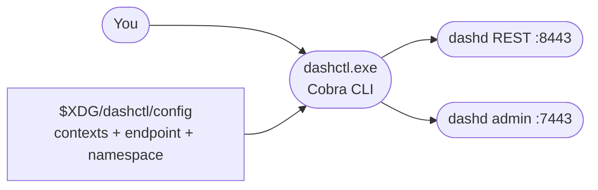

# 16 — dashctl Quickstart: the Operator CLI

> **You'll be able to**: build the `dashctl.exe` binary, configure a
> context, apply manifests, read every spec kind with multiple output
> formats, diff, replace with CAS, describe, and run the same commands
> inside a container. This is the operator's day-job tool.

> **Came from**: [15 — dashd fleet](15-dashd-fleet.md). You drove
> dashd with `curl`. Time to upgrade to the kubectl-style CLI.
>
> **Next**: [17 — full-fleet experiments](17-full-fleet-experiments.md).

---

## You'll need

| From earlier pages | Why |
|---|---|
| Go 1.22+ on PATH | Build `dashctl.exe` from source |
| Docker Desktop | Recommended: a running fleet from page 15 |
| `curl.exe` (host) | Cross-check that dashctl's output matches the REST surface |

> **If page 15's `deploy/dashd-fleet` is up, dashctl will talk to it**
> on `localhost:8443` (REST) and `localhost:7443` (admin). If you'd
> rather use the slightly heavier `deploy/dashctl-fleet` (same 5-DPU
> fleet plus the dashctl container itself), substitute that compose
> file in §3.

---

## 1. Mental model



Every dashctl command:

1. Reads its config (`%APPDATA%\dashctl\config` on Windows;
   `$XDG_CONFIG_HOME/dashctl/config` on Linux/macOS).
2. Resolves a *context* (endpoint, namespace, auth) — defaults are
   fine; you can override with `--context` or `--endpoint`.
3. Calls a method on the `pkg/client.Client` interface — Phase 1 is
   the REST backend; Phase 2 will add gRPC.
4. Renders the result via `internal/render` in the format you asked
   for (`-o table | yaml | json | name | wide | jsonpath | template`).
5. Exits with a [stable exit code](#10-stable-exit-codes).

---

## 2. Build dashctl

### 2.1 With `make` (recommended)

```powershell
$env:PATH = "$env:USERPROFILE\go-sdk\go\bin;$env:USERPROFILE\go\bin;$env:PATH"
cd C:\WorkSpace\PS\PublicRepo\DashCenter\src\impl-go\dashctl
make build
.\bin\dashctl.exe version --client
```

Expected:

```
go build -trimpath -ldflags "-s -w -X main.version=0.1.0-dev -X main.commit=<sha> -X main.buildDate=<UTC>" -o bin/dashctl.exe ./cmd/dashctl
built bin/dashctl.exe (0.1.0-dev <sha>)
---
Client: dashctl 0.1.0-dev (commit <sha>, built <UTC>)
```

### 2.2 With plain `go build`

```powershell
go build -trimpath -ldflags "-s -w" -o bin\dashctl.exe .\cmd\dashctl
.\bin\dashctl.exe version --client
# Client: dashctl 0.1.0-dev (commit none, built unknown)
```

(version/commit/build-date are ldflag stamps; without them they're
blank — harmless.)

### 2.3 Run the unit suite (one-time sanity)

```powershell
make test                # 8 packages, ~30s
make test-cover          # same, with per-package coverage (87.9% aggregate)
```

---

## 3. Bring a fleet up if you don't already have one

If pages 14 or 15 already left a fleet up, **skip this step**.

```powershell
cd C:\WorkSpace\PS\PublicRepo\DashCenter
docker compose -f deploy/dashd-fleet/docker-compose.yml up -d --build
Start-Sleep 10
curl.exe -s http://localhost:7443/admin/health
# {"status":"ok","leader":true,"dpus":[...5 entries, all DPU_STATE_UP...]}
```

---

## 4. Set up your shell once per session

```powershell
$env:Path = "C:\Users\rashmirout\go-sdk\go\bin;C:\Users\rashmirout\go\bin;$env:Path"
$env:DASHCTL_ENDPOINT       = "http://localhost:8443"
$env:DASHCTL_ADMIN_ENDPOINT = "http://localhost:7443"
$bin = "C:\WorkSpace\PS\PublicRepo\DashCenter\src\impl-go\dashctl\bin\dashctl.exe"
```

(Adjust the paths to your machine. Everything below uses `$bin`.)

Now `dashctl version`:

```powershell
PS> & $bin version
Client: dashctl 0.1.0-dev (commit <sha>, built <UTC>)
Server: dashd  dashd (transport=rest endpoint=http://localhost:8443) leader=true
```

The `Server:` line confirms dashd is reachable. If it says
`unavailable`, fix that before continuing — most likely page 15's
fleet isn't running.

---

## 5. The first 15 verbs you'll actually use

Everything below is **read-only** until §6, so you can run them in any
order, repeatedly, without changing state.

### 5.1 Inventory

```powershell
PS> & $bin dpu list -o table
ID           ENDPOINT   STATE          LAST_SEEN
dpu-sim-01              DPU_STATE_UP   ...
dpu-sim-02              DPU_STATE_UP   ...
dpu-sim-03              DPU_STATE_UP   ...
dpu-sim-04              DPU_STATE_UP   ...
dpu-sim-05              DPU_STATE_UP   ...

PS> & $bin dpu list -o name
dpu/dpu-sim-01
dpu/dpu-sim-02
dpu/dpu-sim-03
dpu/dpu-sim-04
dpu/dpu-sim-05

PS> & $bin inventory get -o table
# (same data, this time read through the REST surface instead of admin)
```

### 5.2 Get any spec kind

```powershell
PS> & $bin -n default get vnet -o table
NAMESPACE   NAME          VNI    GENERATION   LABELS
default     vnet-fleet    1001   1
default     vnet-hello    2025   1

PS> & $bin -n default get eni -o wide
NAMESPACE   NAME    VNET         MAC                 UNDERLAY    ADMIN   PLACED-ON    GEN
default     eni-1   vnet-fleet   aa:bb:cc:00:00:01   10.0.5.11   up      dpu-sim-01   1
default     eni-2   vnet-fleet   aa:bb:cc:00:00:02   10.0.5.12   up      dpu-sim-02   1
...
```

The kinds dashctl understands today (Phase 1): `vnet`, `eni`,
`vnetmapping`, `aclpolicy`, `routepolicy`, `haset`, `servicetunnel`,
plus aliases like `vnet-mapping`, `acl`, `route`.

### 5.3 Format zoo

```powershell
PS> & $bin get vnet vnet-fleet -o json
{"apiVersion":"dashcenter.v1","kind":"Vnet","metadata":{"namespace":"default","name":"vnet-fleet","generation":1},"spec":{"vni":1001}}

PS> & $bin get vnet vnet-fleet -o yaml
apiVersion: dashcenter.v1
kind: Vnet
metadata:
  namespace: default
  name: vnet-fleet
  generation: 1
spec:
  vni: 1001

PS> & $bin get vnet vnet-fleet -o "jsonpath={.spec.vni}"
1001

PS> & $bin get vnet vnet-fleet -o "template={{ .spec.vni }}`n"
1001

PS> & $bin get vnet -o name
vnet/vnet-fleet
vnet/vnet-hello
```

`-o name` is the killer feature for scripting: pipe it into `xargs`
or a `foreach` to operate on each object.

### 5.4 Label selectors

```powershell
PS> & $bin -n default get eni -l tier=app -o name
# (whatever matches; selectors are client-side in Phase 1)
```

### 5.5 Describe

```powershell
PS> & $bin -n default describe vnet vnet-fleet
Name:        vnet-fleet
Namespace:   default
Kind:        Vnet
Generation:  1
Spec:
  vni: 1001
```

### 5.6 Explain (offline; no server dial)

```powershell
PS> & $bin explain vnet
KIND:     Vnet
VERSION:  dashcenter.v1
FIELDS:
  namespace     <string>
    Tenant namespace (defaults to 'default').
  name          <string>
    VNet name. Required and unique within a namespace.
  vni           <uint32>
    L2/L3 VNet identifier.
  ...
```

Use `explain` whenever you're about to author a manifest and aren't
sure of the field names.

---

## 6. Mutate: apply / replace / delete (CAS-aware)

### 6.1 Apply a manifest file or directory

```powershell
PS> @"
apiVersion: dashcenter.v1
kind: Vnet
metadata: { name: vnet-tutorial, namespace: default }
spec: { vni: 1234 }
"@ | Set-Content C:\Temp\vnet-tutorial.yaml -Encoding ascii

PS> & $bin -n default apply -f C:\Temp\vnet-tutorial.yaml
vnet/vnet-tutorial apply in namespace default (generation 1)
```

Apply accepts a single file, a directory (walked in lexicographic
order), or `-` (stdin). Multi-document YAML separated by `---` is
honoured.

### 6.2 Replace with CAS (optimistic concurrency)

```powershell
PS> @"
apiVersion: dashcenter.v1
kind: Vnet
metadata: { name: vnet-tutorial, generation: 1 }
spec: { vni: 9999 }
"@ | Set-Content C:\Temp\vnet-tutorial.yaml -Encoding ascii

PS> & $bin replace -f C:\Temp\vnet-tutorial.yaml
vnet/vnet-tutorial apply in namespace default (generation 2)
```

Now re-run with the same file (still says `generation: 1`):

```powershell
PS> & $bin replace -f C:\Temp\vnet-tutorial.yaml
vnet/vnet-tutorial FAILED apply in namespace default: generation mismatch
Error: generation mismatch
Code: FAILED_PRECONDITION
Hint: re-fetch and retry with the latest generation
PS> $LASTEXITCODE
4
```

Exit code **4 = FAILED_PRECONDITION** is the kubectl-style guard:
"someone else changed this between your read and your write".

### 6.3 Diff

```powershell
PS> @"
apiVersion: dashcenter.v1
kind: Vnet
metadata: { name: vnet-tutorial }
spec: { vni: 1234 }
"@ | Set-Content C:\Temp\d.yaml -Encoding ascii

PS> & $bin diff -f C:\Temp\d.yaml
vnet/vnet-tutorial  vni: 9999 → 1234

1 spec(s) would change.
```

Same file but unchanged content:

```powershell
PS> & $bin -n default get vnet vnet-tutorial -o yaml | Set-Content C:\Temp\d.yaml -Encoding ascii
PS> & $bin diff -f C:\Temp\d.yaml
no changes
```

### 6.4 Delete (idempotent)

```powershell
PS> & $bin -n default delete vnet vnet-tutorial
vnet/vnet-tutorial deleted

PS> & $bin -n default delete vnet vnet-tutorial
Error: not found
Code: NOT_FOUND
PS> $LASTEXITCODE
3

PS> & $bin -n default delete vnet vnet-tutorial --ignore-not-found
vnet/vnet-tutorial deleted
PS> $LASTEXITCODE
0
```

---

## 7. Contexts (kubectl-style)

If you switch between several dashd instances (local fleet vs.
container fleet vs. staging), use contexts.

```powershell
PS> & $bin config set-context local --endpoint http://localhost:8443 --namespace default
Context "local" saved.

PS> & $bin config get-contexts
* local

PS> & $bin config view
apiVersion: dashctl/v1
contexts:
  local:
    endpoint: http://localhost:8443
    namespace: default
    ...
current-context: local
kind: Config
preferences: {}

PS> & $bin --context local get vnet -o name
```

Config file lives at `%APPDATA%\dashctl\config` (Windows) or
`$XDG_CONFIG_HOME/dashctl/config` (POSIX).

---

## 8. Run dashctl from inside a container

If you used `deploy/dashctl-fleet/docker-compose.yml` (or substitute
in the compose file from page 17), the `dashctl` service is
profile-gated and only spins up on `compose run`:

```powershell
PS> docker compose -f deploy/dashctl-fleet/docker-compose.yml run --rm dashctl version
Client: dashctl 0.1.0-dev (commit none, built unknown)
Server: dashd  dashd (transport=rest endpoint=http://dashd:8443) leader=true

PS> docker compose -f deploy/dashctl-fleet/docker-compose.yml run --rm dashctl get vnet -o table
NAMESPACE   NAME          VNI    GENERATION   LABELS
default     vnet-fleet    1001   1
default     vnet-hello    2025   1
```

The container reaches dashd via `dashd:8443` (in-network DNS). The
compose file pre-sets `DASHCTL_INSECURE: "true"` so plaintext HTTP
to a non-localhost target works without a flag.

---

## 9. Try this

1. **Walk a directory.** Author 3 vnet YAMLs in `C:\Temp\vnets\`, then
   `apply -f C:\Temp\vnets\`. Confirm dashctl walks them in
   lexicographic order.
2. **CAS race.** In one terminal, `replace -f` a vnet to gen 5. In
   another, `replace -f` the same vnet still saying `generation: 4`.
   Watch exit 4 (FAILED_PRECONDITION).
3. **Build the binary on Linux from Windows.** `go env -w GOOS=linux
   GOARCH=amd64 && make build`, then `file bin/dashctl` on a Linux
   box. Should be ELF.
4. **Bash completion.** `dashctl completion bash > dashctl.bash` and
   source it in a Git Bash shell. `dashctl get <TAB>` now completes
   kinds.
5. **Custom output template.** `dashctl get vnet -o "template={{
   range .items }}{{ .metadata.name }}={{ .spec.vni }}`n{{ end }}"`.
   Use this when scripting a vni inventory.

---

## 10. Stable exit codes

| Code | Meaning | Example |
|---|---|---|
| 0 | success | most happy paths |
| 1 | generic CLI error | bad flag, parse failure |
| 2 | usage error | Cobra surfaced this |
| 3 | not-found | `delete vnet missing` |
| 4 | conflict / generation mismatch | `replace` stale |
| 5 | validation error | bad spec body |
| 6 | permission denied | bad token, role boundary (Phase 2) |
| 7 | unavailable | `UNAVAILABLE` / 503 |
| 8 | timeout | `DEADLINE_EXCEEDED` |
| 9 | unimplemented | `dashctl ha switchover` (Phase 2 stub) |
| 10 | internal | unclassified 5xx |
| 130 | cancelled by signal | Ctrl-C |

`dashctl version` is documented to always return 0, even when the
server section reads `unavailable`. Every other verb returns 7 on a
dead server.

---

## 11. Troubleshooting

| Symptom | Likely cause | Fix |
|---|---|---|
| `Server: unavailable …` | dashd not reachable | Confirm `curl http://localhost:7443/admin/health`; bring fleet up via page 15 |
| `not found` on a spec you applied | Wrong namespace | Pass `-n default`; check `dashctl config view` |
| `plaintext HTTP refused` from inside container | `DASHCTL_INSECURE` not set | Use `deploy/dashctl-fleet` compose (it sets the env), or `-e DASHCTL_INSECURE=true` |
| `apply` returns generation: 2 immediately for new specs | Re-applied a previously-applied spec | This is correct — dashd bumps gen on every PUT body even if content equal |
| `config view` shows PascalCase keys | Stale dashctl binary (pre-B3 fix) | Rebuild with `make build` |
| `diff` shows spurious `<nil>` rows | Stale dashctl binary (pre-B4 fix) | Rebuild with `make build` |

---

## Next

→ [17 — full-fleet experiments](17-full-fleet-experiments.md). Two
end-to-end experiments: (1) the canonical 36-step walkthrough; (2) a
playground where you create a brand-new ENI on a specific DPU and
attach a custom ACL to it. Both use the same fleet you just brought
up.

---

> **Deep-dive reference**: [docs/MANUAL-HANDSON.md](../MANUAL-HANDSON.md)
> is the canonical 800-line operator manual. This tutorial page is the
> onramp; that doc is the reference.
