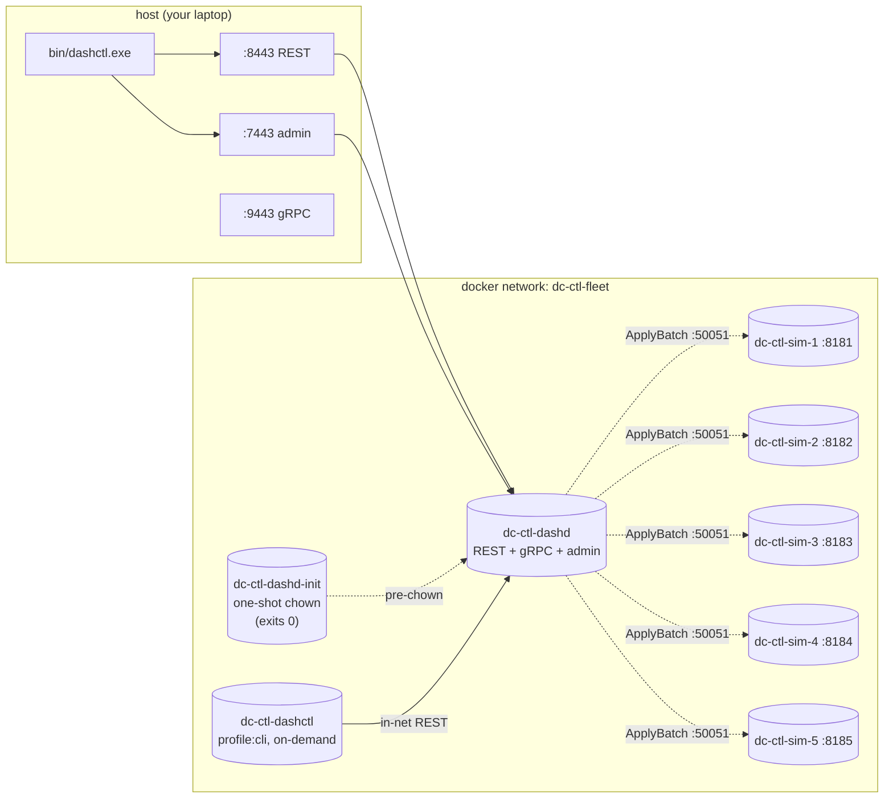

# 17 — Full-Fleet Experiments

> **You'll be able to**: drive two complete, hands-on experiments
> against a live `deploy/dashctl-fleet/` — first the canonical 36-step
> walkthrough that exercises every Phase-1 verb, then a playground that
> creates a brand-new ENI on a chosen DPU and binds a custom ACL to it.
> This is the capstone page: by the end you will have touched every
> component in the system, on the wire, with real outputs.

> **Came from**: [16 — dashctl quickstart](16-dashctl-quickstart.md).
> You know how to build dashctl and drive single verbs. Now we glue
> them into two cohesive experiments.

---

## You'll need

| From earlier pages | Why |
|---|---|
| Page 10 — built `dashd.exe` (for reading source if you want) | Optional |
| Page 16 — built `dashctl.exe` | The hero tool |
| Docker Desktop | The fleet |
| 12–15 minutes of uninterrupted time | Each experiment is ~5 minutes |

---

## 1. The flagship fleet: `deploy/dashctl-fleet/`



| Container | Role | Lifecycle |
|---|---|---|
| `dc-ctl-sim-1..5` | DPU simulators | long-running |
| `dc-ctl-dashd-init` | Pre-chowns the dashd state volume to UID 65532 | one-shot, exits 0 |
| `dc-ctl-dashd` | Control plane | long-running |
| `dc-ctl-dashctl` | Operator CLI in a container | created only on `compose run` |

Bring it up:

```powershell
cd C:\WorkSpace\PS\PublicRepo\DashCenter
docker compose -f deploy/dashctl-fleet/docker-compose.yml up -d --build
Start-Sleep 10
docker ps --filter "name=dc-ctl-" --format "table {{.Names}}\t{{.Status}}"
```

Expected:

```
NAMES          STATUS
dc-ctl-dashd   Up 10 seconds
dc-ctl-sim-1   Up 11 seconds
dc-ctl-sim-2   Up 11 seconds
dc-ctl-sim-3   Up 11 seconds
dc-ctl-sim-4   Up 11 seconds
dc-ctl-sim-5   Up 11 seconds
```

(The init container disappears from `docker ps` once it exits 0; use
`docker ps -a --filter "name=dc-ctl-dashd-init"` to see its
`Exited (0)` row.)

Set your shell:

```powershell
$env:Path = "C:\Users\rashmirout\go-sdk\go\bin;C:\Users\rashmirout\go\bin;$env:Path"
$env:DASHCTL_ENDPOINT       = "http://localhost:8443"
$env:DASHCTL_ADMIN_ENDPOINT = "http://localhost:7443"
$bin = "C:\WorkSpace\PS\PublicRepo\DashCenter\src\impl-go\dashctl\bin\dashctl.exe"
```

---

# Experiment 1 — The Canonical 36-Step Walkthrough

> **What this proves**: every Phase-1 verb works end-to-end against a
> live fleet. Run it once on a new machine, once after every major PR,
> once before releasing a tag. It is the gold-standard "is dashctl
> healthy?" workflow.

The verbatim 36-step capture (with every command, every output,
every troubleshooting hint) lives in
[docs/explore-with-docker/manual-handson.md](../explore-with-docker/manual-handson.md)
§7 — that's the canonical reference. Here is the **structured
overview** so you know what you're stepping through:

| Step group | Verbs exercised | What you'll see |
|---|---|---|
| 1–2 | `version`, `version --client` | client+server banner, then client-only |
| 3–6 | `dpu list -o {table,json,name}`, `inventory get -o table` | 5 DPUs UP, four output formats |
| 7 | `apply -f manifests/` | 2 vnets + 5 ENIs accepted, gen=1 |
| 8–12 | `get vnet -o table`, `get vnet -o yaml`, `get eni -o wide`, label selectors, `describe eni eni-app-01` | all the read variants |
| 13–15 | `reconcile`, `dpu drift --dpu …`, `dpu describe …` | drift converges to 0 on every DPU |
| 16–17 | `get -o jsonpath`, `get -o template` | scripting-friendly outputs |
| 18–20 | `delete eni eni-db-03`, verify, idempotent re-delete | exit codes 0 / 3 / 0 |
| 21–22 | `replace -f` (happy + CAS-failed) | exit 4 on stale generation |
| 23 | `vnet put` / `vnet list` / `vnet describe` / `vnet delete` | typed-kind subgroup |
| 24–25 | `config set-context fleet ...`, `config view/get-contexts/current-context/rename/delete` | full context lifecycle |
| 26–27 | `diff -f` (no-change) + `diff -f` (vni change) | "no changes" and "1 spec(s) would change" |
| 28 | `apply --dry-run client` | would-mutate report without mutating |
| 29 | `explain vnet` | offline field reference |
| 30 | `completion bash/powershell/zsh/fish` | shell completion script |
| 31–32 | `ha switchover`, `migration plan`, `trace flow`, `events --watch` | Phase-2 stubs returning `UNIMPLEMENTED` exit 9 |
| 33 | fleet-wide drift sweep | `0 drift items.` on all 5 DPUs |
| 34–36 | `apply --help`, unreachable-server, `-n default` namespace override | edge cases |

**To run it**: follow the steps in
[docs/explore-with-docker/manual-handson.md](../explore-with-docker/manual-handson.md)
top-to-bottom — each block is copy-paste ready and the expected output
is captured verbatim from a live run on 2026-06-09.

A skeleton you can paste **right now** to flex steps 1–7:

```powershell
& $bin version
& $bin dpu list -o table
& $bin -n default apply -f C:\WorkSpace\PS\PublicRepo\DashCenter\docs\explore-with-docker\manifests
& $bin -n default get vnet -o table
& $bin -n default get eni -o wide
& $bin reconcile
Start-Sleep 6
foreach ($d in @("dpu-sim-01","dpu-sim-02","dpu-sim-03","dpu-sim-04","dpu-sim-05")) {
  Write-Host "  $d :" -NoNewline; & $bin dpu drift --dpu $d
}
```

You should see 16 specs applied (2 vnets + 5 ENIs + 4 mappings +
3 ACLs + 2 routes) and `0 drift items.` on every DPU.

---

# Experiment 2 — Provision Every Spec Kind, Then Play With a Custom ENI

> **What this proves**: dashd handles every Phase-1 spec kind
> correctly, the placement engine targets the right DPU, and a brand
> new ENI + ACL combo lands on **only** the hinted DPU.

The verbatim version (~700 lines, with every command + verbatim
output) lives in
[docs/explore-with-docker/manual-handson.md](../explore-with-docker/manual-handson.md)
§"Experiment 2". Here is the **structured walkthrough** with the key
moments called out.

## E2.A — Apply the full Phase-1 policy set

The repo ships a complete manifest set at
[docs/explore-with-docker/manifests/](../explore-with-docker/manifests/).
Five files, applied in lexicographic order:

| File | What it creates |
|---|---|
| `00-vnets.yaml` | 2 VNets (`vnet-app`, `vnet-db`) |
| `10-enis.yaml` | 5 ENIs, one per simulated DPU |
| `20-vnet-mappings.yaml` | 4 overlay→underlay rewrites |
| `30-acl-policies.yaml` | 3 ACL policies (app-in, app-out, db-in) |
| `40-route-policies.yaml` | 2 route policies, one per tier |

```powershell
& $bin -n default apply -f C:\WorkSpace\PS\PublicRepo\DashCenter\docs\explore-with-docker\manifests
```

Expected (16 acceptance lines):

```
vnet/vnet-app apply in namespace default (generation 1)
vnet/vnet-db apply in namespace default (generation 1)
eni/eni-app-01 apply in namespace default (generation 1)
... (5 ENIs total) ...
vnetmapping/map-app-10 apply in namespace default (generation 1)
... (4 mappings) ...
aclpolicy/acl-app-in apply in namespace default (generation 1)
... (3 ACLs) ...
routepolicy/routes-app apply in namespace default (generation 1)
routepolicy/routes-db apply in namespace default (generation 1)
```

```powershell
& $bin reconcile; Start-Sleep 6
foreach ($d in @("dpu-sim-01","dpu-sim-02","dpu-sim-03","dpu-sim-04","dpu-sim-05")) {
  Write-Host "  $d :" -NoNewline; & $bin dpu drift --dpu $d
}
# 5x "0 drift items."
```

**Sanity counts:**

```powershell
foreach ($k in "vnet","eni","vnetmapping","aclpolicy","routepolicy") {
  $n = (& $bin -n default get $k -o name | Measure-Object).Count
  "  {0,-12} = {1}" -f $k, $n
}
#   vnet         = 2
#   eni          = 5
#   vnetmapping  = 4
#   aclpolicy    = 3
#   routepolicy  = 2
```

## E2.B — Inspect each kind

Run these and read the columns; each `-o wide` reveals an extra
column relevant to that kind:

```powershell
& $bin -n default get vnet -o table
& $bin -n default get eni -o wide               # adds PLACED-ON
& $bin -n default get vnetmapping -o table      # overlay→underlay pairs
& $bin -n default get aclpolicy -o table        # ENIs, RULES count
& $bin -n default get routepolicy -o table      # ENIs, ROUTES count
```

For a detailed semantic explanation of every column (and the
**important VnetMapping naming surprise** — names get rewritten to
`<vnet>-<overlay-ip>`), read sections E2.5.3 and E2.5.4 of the
canonical manual.

**Proof the store is durable:**

```powershell
docker run --rm -v dashd-state-ctl-fleet:/data alpine find /data -type f
# /data/default/vnet/vnet-app.json
# /data/default/eni/eni-app-01.json
# /data/default/vnet_mapping/vnet-app-10.10.0.10.json
# /data/default/acl_policy/acl-app-in.json
# /data/default/route_policy/routes-app.json
# ... (16 files total)
```

## E2.C — The playground: a new ENI + a new ACL bound only to it

This is the "feel the system respond" exercise. We will:

1. Create `eni-app-99`, **pinned to `dpu-sim-04`**, in `vnet-app`.
2. Create `acl-eni99-in` bound **only** to `eni-app-99`.
3. Verify the dispatcher delivered both **only** to `dpu-sim-04`.
4. Clean up just the experimental objects.

```powershell
# 1) author the two manifests
@"
apiVersion: dashcenter.v1
kind: Eni
metadata:
  name: eni-app-99
  namespace: default
  labels: { tier: app, owner: explore }
spec:
  vnet_name: vnet-app
  mac_address: "00:11:22:00:00:99"
  underlay_ip: "10.0.5.99"
  admin_state: "up"
  placement_hint_dpu_ids: ["dpu-sim-04"]
"@ | Set-Content C:\Temp\new-eni.yaml -Encoding ascii

@"
apiVersion: dashcenter.v1
kind: AclPolicy
metadata:
  name: acl-eni99-in
  namespace: default
  labels: { tier: app, owner: explore }
spec:
  stage: "inbound"
  eni_names: ["eni-app-99"]
  rules:
    - priority: 100
      action: "allow"
      src_prefixes: ["10.10.0.0/16"]
      dst_ports:    ["8080"]
      protocols:    ["tcp"]
    - priority: 200
      action: "deny"
      src_prefixes: ["0.0.0.0/0"]
"@ | Set-Content C:\Temp\new-acl.yaml -Encoding ascii

# 2) apply both
& $bin -n default apply -f C:\Temp\new-eni.yaml
& $bin -n default apply -f C:\Temp\new-acl.yaml
```

```powershell
# 3) verify dashctl shows them where we expect
& $bin -n default get eni -o wide       # last row: eni-app-99 on dpu-sim-04
& $bin -n default get acl -l owner=explore -o table
# NAMESPACE   NAME           STAGE     ENIs         RULES   GEN
# default     acl-eni99-in   inbound   eni-app-99   2       1
```

```powershell
# 4) reconcile and prove only dpu-sim-04 got the new objects
& $bin reconcile; Start-Sleep 6
docker logs --tail 6 dc-ctl-dashd 2>&1 | Select-String "dispatch: reconcile"
# Expect lines for dpu-sim-04 with add: N (4, then 3) — and nothing for the others
```

```powershell
# 5) clean up just the experimental objects (canonical fleet untouched)
& $bin -n default delete aclpolicy acl-eni99-in
& $bin -n default delete eni eni-app-99
```

That's it: you've created, attached, verified the wire-level fan-out
target was correct, and reversed it cleanly. The same pattern works
for any spec kind dashd ships.

## E2.D — Repeat from inside a container

Every command above can be issued from a containerised dashctl, which
is useful for CI pipelines:

```powershell
docker compose -f deploy/dashctl-fleet/docker-compose.yml run --rm dashctl version
docker compose -f deploy/dashctl-fleet/docker-compose.yml run --rm dashctl get vnet -o table
docker compose -f deploy/dashctl-fleet/docker-compose.yml run --rm dashctl get eni -o wide
docker compose -f deploy/dashctl-fleet/docker-compose.yml run --rm `
  -v "${PWD}/docs/explore-with-docker/manifests:/work:ro" `
  --entrypoint /usr/local/bin/dashctl `
  dashctl -n default apply -f /work
```

The container reaches dashd via `dashd:8443`; the compose file's
`DASHCTL_INSECURE: "true"` env makes plaintext HTTP to a non-localhost
target succeed without a flag.

---

## 2. Tear it all down

```powershell
# Stop the containers but KEEP the named state volume (next 'up' restores all 16 specs)
docker compose -f deploy/dashctl-fleet/docker-compose.yml down

# OR also wipe the volume for a true clean slate
docker compose -f deploy/dashctl-fleet/docker-compose.yml down -v
```

---

## 3. Try this

1. **Read the dispatcher log under load.** Apply the full manifest
   set twice in a row; watch `add: N` vs `update: N` vs `remove: N`
   per DPU.
2. **Move an ENI between DPUs.** Re-apply `eni-app-99` with
   `placement_hint_dpu_ids: ["dpu-sim-02"]`. Force reconcile. Look
   at the dispatcher logs — dashd should `remove: 1` on dpu-sim-04
   AND `add: 1` on dpu-sim-02 in the same tick.
3. **CAS on a real ACL.** Get `acl-app-in` with `-o yaml`, save the
   generation, tweak a rule, set `metadata.generation: <saved>` in
   the file, `replace -f`. Now repeat the replace without bumping —
   exit 4.
4. **Build a Kubernetes-shaped manifest.** Use the field reference
   in `dashctl explain` to author one new `RoutePolicy` adding a
   `10.30.0.0/16` route pointing to a new VNet, and apply it
   together with the new VNet in a single multi-doc YAML.
5. **Probe the southbound.** From the host, `Test-NetConnection
   localhost -Port 50051` should fail (the southbound is not exposed
   to the host); but `docker exec dc-ctl-dashd nc -zv dash-sim-1
   50051` succeeds. That's the bridge network isolation in action.

---

## 4. Troubleshooting

| Symptom | Likely cause | Fix |
|---|---|---|
| First `apply` returns `internal` 500 | Volume root-ownership; init container missing | Verify `docker ps -a` shows `dc-ctl-dashd-init Exited (0)`. If not, your compose file is missing the init container row — see [Experiment 2 §E2.9](../explore-with-docker/manual-handson.md) |
| `get vnetmapping` shows synthesized names | **By design** — store key is `<vnet>-<overlayip>`, not `metadata.name` | None; read E2.5.3 of the canonical manual |
| `dpu drift` returns >0 immediately after `apply` | Reconcile hasn't run yet | `& $bin reconcile; Start-Sleep 6` |
| Container `dashctl` says `plaintext HTTP refused` | Compose env not picked up | Use `deploy/dashctl-fleet/` compose (it sets the env); or pass `-e DASHCTL_INSECURE=true` |
| `delete eni X` returns NOT_FOUND despite seeing it in `get` | Wrong namespace context | Pass `-n default`; check `dashctl config view` |

---

## 5. What you proved (across both experiments)

| Layer | Proven by |
|---|---|
| dashctl Phase 1 — every verb works end-to-end | Experiment 1 (36 steps) |
| Every Phase-1 spec kind is acceptably modelled | Experiment 2 §E2.A counts |
| Placement engine targets the correct DPU | Experiment 2 §E2.C dispatcher logs |
| File-backed store is durable across `docker compose down` | `find /data -type f` survives restart |
| Container-side and host-side dashctl produce identical answers | Experiment 2 §E2.D |
| The same fleet supports two completely different operator workflows | This page |

---

## Next

This is the last page. From here:

- For **Phase 2** (gRPC backend, streaming verbs, HA + migration +
  diagnostics), see
  [specs/Impl-Plan/dashctl-impl-phases.md](../../specs/Impl-Plan/dashctl-impl-phases.md).
- For **deeper architecture** of dashd, see
  [specs/HLD/dashd-hld.md](../../specs/HLD/dashd-hld.md) and
  [specs/LLD/dashd-lld.md](../../specs/LLD/dashd-lld.md).
- For **deeper architecture** of dashctl, see
  [specs/HLD/dashctl-hld.md](../../specs/HLD/dashctl-hld.md) and
  [specs/LLD/dashctl-lld.md](../../specs/LLD/dashctl-lld.md).
- For **becoming a tutorial author**, see
  [CONTRIBUTING-TO-TUTORIAL.md](CONTRIBUTING-TO-TUTORIAL.md).

---

> **Deep-dive reference**:
> [docs/explore-with-docker/manual-handson.md](../explore-with-docker/manual-handson.md)
> is the canonical 2,278-line operator manual containing both
> experiments verbatim. This tutorial page is the structured onramp;
> that doc is the line-by-line reference you scroll while typing.
