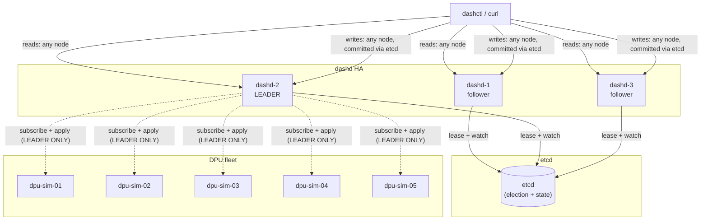

# 18 — HA fleet + ENI live migration: hands-on

> **Prereqs**: page [15 — dashd fleet: 5 DPUs](15-dashd-fleet.md) (you know what a fleet looks like) and [16 — dashctl quickstart](16-dashctl-quickstart.md) (you can drive dashd from the CLI). This page assumes neither dashd HA nor the migration RPCs are new to you in concept — page [13 — single-node dashd](13-dashd-single-node.md) introduces the daemon, and [`specs/HLD/high_level_system_design.md`](../../specs/HLD/high_level_system_design.md) explains the why of leader election.
>
> **What you'll do**: bring up a **3-controller / 5-DPU HA fleet** in Docker, apply a 103-object reference configuration, watch a planned HA switchover stream over SSE, simulate an unplanned failover, drive a 10-phase ENI live migration, then **kill the dashd leader mid-migration** and watch a follower resume it from etcd — the headline operational property of dashd in production.
>
> **Time**: ~45 minutes the first run; ~15 minutes after the images are cached.

---

## Why this page exists

Earlier tutorial pages (08–15) build up the *single dashd / single etcd* mental model. Production deployments run **N dashd controllers behind a shared etcd**, electing exactly one leader at a time, with followers serving read traffic. This is the picture:



Only the leader runs the reconciler, dispatch workers, and subscribe pumps; followers serve linearizable reads from the same etcd. When the leader dies, its lease expires (default 8 seconds in this fleet) and one of the followers wins the next campaign.

**ENI live migration** is the most write-heavy operation dashd performs: a 10-phase state machine moves an ENI from one DPU to another while the session itself is persisted to etcd, so a controller restart mid-migration is non-fatal.

Both behaviours have unit + integration tests, but the fastest way to *internalise* them is to drive a real fleet by hand. That's what this page does.

---

## Step 0 · Prerequisites

| Tool | Version | Check |
|---|---|---|
| Docker Engine | ≥ 24 | `docker version` |
| Docker Compose v2 | bundled | `docker compose version` |
| `dashctl` host binary (optional but recommended) | latest | `dashctl version` |
| Free disk | ~2 GB | first build pulls etcd + golang + distroless |
| Free host ports | `127.0.0.1`: `12379`, `27443/27453/27463`, `28443/28453/28463`, `29443/29453/29463` | `Get-NetTCPConnection -LocalPort 28443` / `lsof -i:28443` |

> **Always use `127.0.0.1`, never `localhost`.** On Windows `localhost` resolves to `::1` first and dashd binds IPv4-only — the IPv6 stall would make every probe look broken. The shipped scripts already do this; only the inline commands in this page need your attention.

If you don't have a host `dashctl`, build one (takes ~10s on a warm cache):
```bash
cd <repo>/src/impl-go
go build -o ../../deploy/test-setup/04-ha-fleet/dashctl.exe ./dashctl/cmd/dashctl
```

The reference fleet lives at [`deploy/test-setup/04-ha-fleet/`](../../deploy/test-setup/04-ha-fleet/README.md). Every command on this page assumes `cd deploy/test-setup/04-ha-fleet` unless noted.

---

## Step 1 · Bring the fleet up

```powershell
pwsh ./start-fleet.ps1                 # Windows
./start-fleet.sh                        # Linux / macOS / WSL
```

The script:
1. builds `dashd`, `dashctl`, `dash-sim` images (one-time, ~3 min cold);
2. brings up `etcd` (waits for healthcheck) + 5 dash-sim DPUs + 3 dashd controllers;
3. polls all three admin endpoints until exactly one reports `leader=true`.

Expected tail:
```
==> Waiting for a dashd leader to be elected (max 60 s)
==> Leader: dashd-2
```

The reported leader will be `dashd-1`, `dashd-2`, or `dashd-3` — whichever wins the race. **It is not always the same node.** All subsequent commands discover the leader dynamically, so this never matters operationally.

---

## Step 2 · Inspect leader election

Confirm exactly one leader via the admin endpoints:
```bash
for p in 27443 27453 27463; do
  echo "127.0.0.1:$p" && curl -s http://127.0.0.1:$p/admin/leader && echo
done
# 127.0.0.1:27443
# {"leader":false,"leader_id":""}
# 127.0.0.1:27453
# {"leader":true,"leader_id":"dashd-2"}
# 127.0.0.1:27463
# {"leader":false,"leader_id":""}
```

Now peek at etcd to see how the election really works:
```bash
docker exec dc-ha-etcd etcdctl --endpoints http://127.0.0.1:2379 \
  get /dashd/fleet/leader/ --prefix
```

You'll see **three keys** — one per dashd campaigning candidate — each carrying its own etcd lease ID. The candidate with the lowest `mod_revision` wins. When the winner's lease expires (it stops renewing on death), the etcd `concurrency` library promotes the next candidate atomically.

```
/dashd/fleet/leader/402f9eb3badd830d
dashd-3
/dashd/fleet/leader/402f9eb3badd8318
dashd-1
/dashd/fleet/leader/402f9eb3badd833a
dashd-2
```

The first key's value (`dashd-3` above) is the current leader. The other two candidates are blocked in `AwaitLeadership` waiting their turn.

> **Why 3 candidate keys?** Each dashd holds an `etcd concurrency.Session` and an `Election.Campaign(ctx, value)` call. Each Campaign writes its own (lease-id, value) pair under the election prefix; etcd's Election abstraction guarantees exactly one of them is the "leader" at any moment based on revision ordering. Cleanly resigning (`Election.Resign`) deletes the key and promotes the next.

---

## Step 3 · Apply the 103-object reference configuration

The fleet ships with a pre-baked manifest set under [`./manifest/`](../../deploy/test-setup/04-ha-fleet/manifest/):

| File | Kind | Count |
|---|---|---|
| `00-vnets.yaml` | `Vnet` | 12 |
| `01-service-tunnels.yaml` | `ServiceTunnel` | 4 |
| `02-enis.yaml` | `Eni` | 30 |
| `03-vnet-mappings.yaml` | `VnetMapping` | 30 |
| `04-route-policies.yaml` | `RoutePolicy` | 12 |
| `05-acl-policies.yaml` | `AclPolicy` | 12 (~120 rules) |
| `06-ha-sets.yaml` | `HaSet` | 3 |

Apply the whole tree in one go:
```bash
./dashctl.exe --endpoint http://127.0.0.1:28443 apply -R -f ./manifest
```

Expected: 91 `apply` lines, then control returns. (12 of the 91 line outputs are for HA-internal `vdpu`/`vnetmapping` objects produced as side effects.)

Verify the counts (use `-o name` so each object is one line):
```bash
for k in vnet eni vnetmapping routepolicy aclpolicy servicetunnel haset; do
  echo "$k: $(./dashctl.exe --endpoint http://127.0.0.1:28443 get $k -o name | grep -c /)"
done
# vnet: 12 · eni: 30 · vnetmapping: 30 · routepolicy: 12 · aclpolicy: 12 · servicetunnel: 4 · haset: 3
```

And confirm dashd persisted everything to etcd:
```bash
docker exec dc-ha-etcd etcdctl --endpoints http://127.0.0.1:2379 \
  get /dashd/fleet/state/ --prefix --keys-only | grep -c .
# 103
```

**Read fan-out test** — every dashd serves identical reads from etcd:
```bash
for p in 28443 28453 28463; do
  echo "=== dashd at $p ==="
  ./dashctl.exe --endpoint http://127.0.0.1:$p get vnet -o name | sort
done
```
All three blocks are byte-identical.

---

## Step 4 · HA switchover (planned)

`ha-bank-prod` was seeded with `[dpu-sim-01, dpu-sim-02]` in `active_standby` mode. The HA orchestrator (PC-G1..G3) auto-promotes the first member, so `dpu-sim-01` is currently active.

Trigger a controlled switchover and stream the SSE events:
```bash
curl -N -X POST http://127.0.0.1:28443/v1/ha/default/ha-bank-prod/switchover \
     -H 'Content-Type: application/json' -d '{}'
```

You'll see 4 events in order:
```
data: {"dpu_id":"dpu-sim-01","role":"HA_SCOPE_ROLE_SWITCHING_TO_STANDBY","reason":"drain started",...}
data: {"dpu_id":"dpu-sim-02","role":"HA_SCOPE_ROLE_SWITCHING_TO_ACTIVE","reason":"promotion staged",...}
data: {"dpu_id":"dpu-sim-01","role":"HA_SCOPE_ROLE_STANDBY","reason":"switchover complete",...}
data: {"dpu_id":"dpu-sim-02","role":"HA_SCOPE_ROLE_ACTIVE","reason":"switchover complete","is_role_holder":true,...}
```

What you just observed:
1. Old active was instructed to **drain first** (the `SWITCHING_TO_STANDBY` intermediate state).
2. New active was **staged** (`SWITCHING_TO_ACTIVE`) before traffic was switched.
3. Both transitions are atomic from the orchestrator's view (each is a single etcd write).
4. The `is_role_holder=true` flag tells you which DPU now owns the VIP (`10.0.0.100` for this HA set).

Confirm the final state:
```bash
curl -s http://127.0.0.1:28443/v1/ha/default/ha-bank-prod | jq .
```

---

## Step 5 · HA failover (unplanned)

The contract: failover **does not contact the dead DPU** (otherwise it wouldn't be useful when the DPU is unreachable). To prove it, use the `ha-retail-prod` set:

```bash
curl -N -X POST http://127.0.0.1:28443/v1/ha/default/ha-retail-prod/failover \
     -H 'Content-Type: application/json' -d '{"failed_dpu_id":"dpu-sim-03"}'
```

First event shows `dpu-sim-03` already in `HA_SCOPE_ROLE_DEAD` — no `SWITCHING_TO_STANDBY` intermediate, because the orchestrator never spoke to it. Then `dpu-sim-04` walks `SWITCHING_TO_ACTIVE → ACTIVE`.

The dashd-internal counter for `DrainOldActive` calls (visible in [`internal/ha/orchestrator/`](../../src/impl-go/dashd/internal/ha/orchestrator/) test code) stays at 0 for failover, exactly 1 for switchover — that's the test gate from PC-G2.

Subscribe to **all** HA events on the fleet (across all sets, all namespaces) in another terminal — Ctrl-C to exit:
```bash
curl -N http://127.0.0.1:28443/v1/ha/events
```

---

## Step 6 · ENI live migration walkthrough

Migration moves an ENI from a source DPU to a destination DPU through a 10-phase state machine, persisting the session in etcd at every step. Start a migration of `eni-bank-web-04` from `dpu-sim-02` (current home) to `dpu-sim-05` (a less-loaded DPU):

```bash
# 6.1 Create + start the session
curl -s -X POST http://127.0.0.1:28443/v1/migrations/sessions \
     -H 'Content-Type: application/json' \
     -d '{"plan":{"eni_name":"eni-bank-web-04","namespace":"default",
                  "source_dpu_id":"dpu-sim-02","destination_dpu_id":"dpu-sim-05",
                  "strategy":"NEW_FLOWS_FIRST_DRAIN"}}' | jq .
# {"session": {"id":"...", "phase":1, "generation":1, ...}}
```

Note the `id` — call it `$SID`:
```bash
SID=<paste id here>
```

Walk through all 9 phase transitions to COMPLETED:
```bash
for next in 2 3 4 5 6 7 8 9 10; do
  curl -s -X POST http://127.0.0.1:28443/v1/migrations/sessions/$SID/advance \
       -H 'Content-Type: application/json' \
       -d "{\"next_phase\":$next,\"expected_generation\":$((next-1))}" | jq -r '.session.phase'
done
# 2
# 3
# ...
# 10
```

What you just exercised:
- **Phase 6 (CUTOVER)** is the only phase that mutates the live `eni-bank-web-04` placement; the others are pure session state changes.
- Every advance is **optimistic-concurrency-gated** via `expected_generation`. If a parallel operator/test advances the same session, your `advance` returns `FailedPrecondition`.
- The session is now in `phase=10 (COMPLETED)`, marked as terminal.

Confirm via `get`:
```bash
curl -s http://127.0.0.1:28443/v1/migrations/sessions/$SID | jq '{phase: .session.phase, gen: .session.generation, status: .session.status}'
```

And confirm the ENI actually moved:
```bash
./dashctl.exe --endpoint http://127.0.0.1:28443 get eni eni-bank-web-04 -o yaml | grep placement_hint_dpu_ids
# placement_hint_dpu_ids: [dpu-sim-05]
```

> **Rollback** (PC-G5) — to undo before COMMIT (phase 8), `POST .../sessions/$SID/rollback` with `{"reason":"..."}`. The session walks `phase → 11 (ROLLBACK) → 12 (ABORTED)` and the orchestrator's `UndoCutover` restores the pre-cutover placement. Rollback after COMMIT returns `412 Failed Precondition`.

---

## Step 7 · The headline test — kill dashd leader mid-migration

This is where PC-G6 earns its keep: a migration in flight survives the loss of the dashd that started it.

```bash
# 7.1 Start a NEW migration but stop at phase 4 (SYNC) — not yet at CUTOVER.
RESP=$(curl -s -X POST http://127.0.0.1:28443/v1/migrations/sessions \
       -H 'Content-Type: application/json' \
       -d '{"plan":{"eni_name":"eni-retail-web-01","namespace":"default",
                    "source_dpu_id":"dpu-sim-03","destination_dpu_id":"dpu-sim-04",
                    "strategy":"NEW_FLOWS_FIRST_DRAIN"}}')
SID2=$(echo "$RESP" | jq -r '.session.id')

# Walk to phase 4 only.
for next in 2 3 4; do
  curl -s -X POST http://127.0.0.1:28443/v1/migrations/sessions/$SID2/advance \
       -H 'Content-Type: application/json' \
       -d "{\"next_phase\":$next,\"expected_generation\":$((next-1))}" > /dev/null
done

# 7.2 Confirm phase 4.
curl -s http://127.0.0.1:28443/v1/migrations/sessions/$SID2 | jq '.session.phase'
# 4

# 7.3 Find the current leader, kill it.
for p in 27443 27453 27463; do curl -s http://127.0.0.1:$p/admin/leader; echo; done
# {"leader":true,"leader_id":"dashd-X"}  ← note X
docker stop dc-ha-dashd-X
sleep 12

# 7.4 New leader has taken over (one of the surviving dashd nodes).
for p in 27443 27453 27463; do curl -s http://127.0.0.1:$p/admin/leader; echo; done

# 7.5 Re-query the session via the new leader — phase=4 preserved.
NEW_REST=<the REST port of the new leader; 28443/28453/28463>
curl -s http://127.0.0.1:$NEW_REST/v1/migrations/sessions/$SID2 | jq '.session.phase'
# 4

# 7.6 Resume advancing from where we left off.
for next in 5 6 7 8 9 10; do
  curl -s -X POST http://127.0.0.1:$NEW_REST/v1/migrations/sessions/$SID2/advance \
       -H 'Content-Type: application/json' \
       -d "{\"next_phase\":$next,\"expected_generation\":$((next-1))}" | jq -r '.session.phase'
done
# 5
# 6
# ...
# 10

# 7.7 Restart the killed dashd — it rejoins as a follower (does NOT steal leadership back).
docker start dc-ha-dashd-X
sleep 5
for p in 27443 27453 27463; do curl -s http://127.0.0.1:$p/admin/leader; echo; done
```

What you just proved:
- **Durability**: The migration session, including `phase`, `generation`, and the captured pre-cutover snapshot, lived through controller loss because it's persisted to etcd from the moment of creation.
- **Liveness**: Lease expiry triggers re-election in ≤ lease_ttl + slack (≈ 12s with our 8s TTL).
- **Safety**: The new leader picks up the session **at the same generation**, so any in-flight retry from a confused client still fails with `FailedPrecondition` — no double-cutover possible.
- **Stable leadership**: The recovered node rejoins as a follower; it does **not** preempt the new leader. (etcd's `Election.Campaign` joins the back of the queue.)

---

## Step 8 · Clean up

```bash
./stop-fleet.sh                 # down + remove volumes
# or
./stop-fleet.sh --keep-volumes  # leave etcd state for the next start
```

For a complete reset (also drop the local images):
```bash
docker compose down -v --rmi local
```

---

## What you've internalised

| Concept | Where it came from in this session |
|---|---|
| **Leader election** is *atomic, lease-based*, and *each candidate writes its own row* | Step 2: 3 candidate keys under `/dashd/fleet/leader/`, lowest revision wins |
| **Followers are not stand-ins** — they serve identical reads from etcd | Step 3: byte-identical `get vnet` from all 3 nodes |
| **HA switchover drains first**; **HA failover doesn't** | Steps 4 and 5: 4 SSE events vs 3 |
| **Migration is durable** — every state change is an etcd write | Step 7: phase=4 survived `docker stop dashd-X` |
| **Migration is safe** — generations are CAS-checked | Step 6: every advance carries `expected_generation` |
| **Failover is bounded** by `lease_ttl + slack` | Step 7: ~12s with our 8s TTL |
| **Recovery does not preempt** the current leader | Step 7.7: restarted node came back as follower |

---

## Where to go next

- **Operator reference for the 04-ha-fleet topology** → [deploy/test-setup/04-ha-fleet/README.md](../../deploy/test-setup/04-ha-fleet/README.md)
- **HA orchestrator internals** → [`src/impl-go/dashd/internal/ha/orchestrator/`](../../src/impl-go/dashd/internal/ha/orchestrator/)
- **Migration state machine** → [`src/impl-go/dashd/internal/migration/migration.go`](../../src/impl-go/dashd/internal/migration/migration.go)
- **Leader election internals** → [`src/impl-go/dashd/internal/ha/leader/etcd.go`](../../src/impl-go/dashd/internal/ha/leader/etcd.go) (PA-3)
- **Why etcd vs raft-in-dashd?** → [`specs/HLD/high_level_system_design_controllerless.md`](../../specs/HLD/high_level_system_design_controllerless.md) explains the PF alternative (controllerless mode, planned post-2.0)
