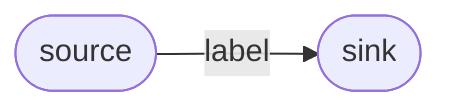

# Contributing to the DashCenter Tutorial

> This page is for **tutorial authors** — anyone adding or editing a
> page under `docs/tutorial/`. It captures the template, the quality
> bar, and the review checklist so the curriculum stays consistent as
> it grows.

If you came here looking to read a tutorial, go back to
[README.md](README.md).

---

## 1. Why we have a tutorial

The tutorial is the **only on-ramp** that promises:

- a reader with no prior context can land on page 00 and reach page 17,
- every command in between will run on a stock laptop,
- every output shown matches what the reader sees on their screen,
- every page leaves the reader with a self-test they can perform.

If a page breaks any of those promises, it's worse than no page.

---

## 2. The page template

Every new page MUST follow this shape (this is the same shape
pages 03-09 already use; pages 10-17 are the reference):

```markdown
# nn — <Title>

> **You'll be able to**: one-sentence outcome statement.

> **Came from**: [nn-1 — previous](nn-1-previous.md).
>
> **Next**: [nn+1 — next](nn+1-next.md).

---

## You'll need

| From earlier pages | Why |
|---|---|

## 1. <The mental model>

```mermaid
flowchart LR
  …
```

## 2. The N-second path
<copy-paste commands, with verbatim expected output>

## 3. What you just did, technically
<the wire-level explanation; the ASCII diagram of arrows>

## N. Try this
1. <self-directed exercise with hint, not solution>
2. …

## N+1. Troubleshooting
| Symptom | Likely cause | Fix |
|---|---|---|

## Next
→ [nn+1 — next](nn+1-next.md).

---

> **Deep-dive reference**: <link to the authoritative spec or recipe>
```

Why these sections, in this order:

| Section | Why it's required |
|---|---|
| One-sentence outcome | Sets expectation; reader can bounce in <10s if not the right page |
| Came-from / Next | Linear navigability; reader doesn't have to come back to the index |
| You'll need | Prevents the "I tried the recipe and step 2 failed" mid-page surprise |
| Mental model | Reader must know **what** they're building before they type |
| N-second path | The "happy path" that almost every reader follows |
| Technically | Closes the gap between "I typed it" and "I understand it" |
| Try this | Self-test; turns reading into doing |
| Troubleshooting | The reader's first-line support |
| Next | Conveyor belt to the next page |

---

## 3. Quality bar

Every PR that touches the tutorial is checked against this list:

| # | Check |
|---|---|
| 1 | **Every command runs verbatim** — author has run it on a fresh machine; output captured literally; no `<placeholder>` snippets |
| 2 | **Mermaid OR ASCII diagram** in §1 for the conceptual model, and (when relevant) in §3 for the wire flow |
| 3 | **§3 "What you just did, technically"** subsection after every 5-minute path — closes the gap from "I typed it" → "I understand it" |
| 4 | **Both Windows pwsh AND Linux bash** blocks for every command, side-by-side or under separate H3s |
| 5 | **Troubleshooting table** with at least: port already in use, build cache stale, container OOM, namespace mix-up — whichever apply |
| 6 | **Exit-code statement** for every CLI verb shown (so contributors learn the stable exit-code contract early) |
| 7 | **Cross-link forward and back** — every page ends with "Next: nn+1" and starts with "Came from: nn-1" (except page 00 and page 17) |
| 8 | **No outbound HTTP fetches in examples** unless explicitly building from a public image (keeps the tutorial reproducible in air-gapped CI labs) |
| 9 | **No emojis in headings**; emojis allowed only in persona bullets (📁🚢🔧🖥️🏛️🧑‍🔧) — preserves grep/find usability |
| 10 | **No marketing language**; no "easy", "simply", "just", "obviously". The reader does not feel it's easy until *after* they've finished |
| 11 | **One canonical path per page**; the alternative paths go in `## 4. Build variants` or similar — not interleaved |
| 12 | **Pages stay under ~500 lines** of text (excluding code blocks). If you can't fit a topic in 500 lines, it's two pages |

---

## 4. The numbering rules

| Rule | Why |
|---|---|
| **Numbers never get reused.** Page 04 is "Build" forever. If you add a page about cross-compilation, it becomes a sub-page (`04-cross-compile.md`) or a new number (18, 19, …) | Prevents broken external links |
| **Two-digit prefix, dash, lowercase-kebab title.** `nn-title.md` | Filesystem sort matches reading order |
| **Group with a section heading in `README.md`** ("Part I", "Part II", "Part III"). Don't try to encode the group in the filename | Lets us reshuffle groups without renaming files |

If you need a number that doesn't yet exist (say, page 18 for
"Phase 2 streaming verbs"), open a placeholder issue first so we can
agree on the number before the PR.

---

## 5. The link rules

| Where | Format | Example |
|---|---|---|
| **Same-folder page** | relative, full filename | `[03 — Build setup](03-build-setup.md)` |
| **Sibling folder under `docs/`** | one `../` | `[CLI guide](../CLI_GUIDE.md)` |
| **Two levels up (repo root)** | two `../../` | `[deploy/dashctl-fleet/](../../deploy/dashctl-fleet/)` |
| **Inline code path** | inline code, **and** a link | `` `cmd/dashd/main.go` `` → [`src/impl-go/dashd/cmd/dashd/main.go`](../../src/impl-go/dashd/cmd/dashd/main.go) |
| **CLI verb** | inline code, no link | `` `dashctl get vnet` `` |

Test every link with a Markdown linter before merging. Broken links
are the single most common reviewer rejection reason.

---

## 6. The voice & tone rules

| Do | Don't |
|---|---|
| "Run this command. Expected output below." | "Now go ahead and just run this command and you should see the expected output." |
| "Press Ctrl-C." | "Hit Ctrl-C." |
| "What you just did, technically:" | "What happened under the hood:" |
| "The dispatcher fanned out 5 gRPC calls." | "The dispatcher cleverly fanned out 5 gRPC calls." |
| Present tense; second person ("you") | Past tense; first person plural ("we") |
| Numbered steps for sequenced actions | Bullet lists for sequenced actions |
| Tables for parallel facts | Prose for parallel facts |
| "≤ 250 ms p99" | "really fast" |

---

## 7. The "did the page actually work?" checklist

Before you open the PR:

```text
[ ] I ran every command on a fresh terminal in order, in one sitting.
[ ] I copy-pasted the output back into the page; no editing of "obvious" lines.
[ ] I tested both Windows pwsh and Linux bash variants (or noted "Windows-only").
[ ] I tested with a fresh checkout (no stale build cache).
[ ] I tested the "Try this" exercises — they actually work.
[ ] Markdown lint passes (no broken links, no unmatched code-fence).
[ ] Page renders cleanly in GitHub preview (mermaid included).
[ ] If I added a new number, I updated docs/tutorial/README.md AND docs/tutorial/00-how-to.md AND any sibling persona path.
```

---

## 8. Cookbook: common authoring tasks

### 8.1 Adding a new page

1. Pick the next number (or a placeholder issue number from §4).
2. Copy the template in §2 into `nn-title.md`.
3. Fill in the sections in order; don't skip §3 "Technically".
4. Verbatim outputs go in fenced code blocks; tag the language for
   syntax highlighting (`powershell`, `bash`, `text`, `json`, …).
5. Update the index in [`README.md`](README.md) and the persona paths
   in [`00-how-to.md`](00-how-to.md).
6. Open the PR with the page filename in the title.

### 8.2 Adding a Mermaid diagram



Keep nodes round-bracketed for *processes*, square-bracketed for
*data*. Use dotted edges (`-.->`) for network calls, solid edges
(`-->`) for in-process flow. Don't colour nodes — colours don't survive
all viewers.

### 8.3 Capturing verbatim output

```powershell
# Run the command in a fresh terminal, then:
& $bin dpu list -o table > out.txt
notepad out.txt   # copy contents into the .md
```

If the output has secrets (tokens, paths with your username), replace
the secret with `<placeholder>` and call it out in a footnote.

### 8.4 Adding a new persona

Edit `00-how-to.md` § "Three personas" (now N personas). Each persona
is a 4-6-step list of existing tutorial pages in reading order. Don't
invent new pages for a persona — re-use what's there.

---

## 9. When NOT to add a tutorial page

| Want to | Where it goes instead |
|---|---|
| Document one CLI flag in detail | [`docs/CLI_GUIDE.md`](../CLI_GUIDE.md) |
| Capture a verbatim copy-paste session | [`docs/MANUAL-HANDSON.md`](../MANUAL-HANDSON.md) or [`docs/explore-with-docker/manual-handson.md`](../explore-with-docker/manual-handson.md) |
| Spec a new behaviour | [`specs/HLD/`](../../specs/HLD/) + [`specs/LLD/`](../../specs/LLD/) |
| Add a one-off OS-specific recipe | [`docs/windows/`](../windows/) or `docs/linux/` |
| Add a one-time bug-fix postmortem | issue tracker, not the tutorial |

The tutorial is **stable** content — pages should not need editing
every time a verb gets a flag. If a page becomes brittle, refactor
the brittle parts into a deep-dive ref and have the tutorial page
link to it (see how page 10 links to
`docs/windows/DASHD-BUILD_AND_RUN_UNIT_TEST.md` as its appendix).

---

## 10. Reviewing a tutorial PR

Reviewer checklist:

```text
[ ] Page outcome is concrete and verifiable.
[ ] Each command runs as shown on a clean machine.
[ ] Output blocks are real captures, not invented.
[ ] Diagrams render and add information not in the text.
[ ] Troubleshooting table covers the obvious failure modes.
[ ] Page is ≤ ~500 lines of text.
[ ] No marketing language; tone is present-tense, second-person.
[ ] Cross-links to siblings and references are correct.
[ ] README.md and 00-how-to.md are updated for any new number.
[ ] Persona paths in 00-how-to.md updated if applicable.
```

If three or more boxes fail, request changes; don't try to fix it in
review comments.

---

## 11. Versioning the tutorial

When dashctl Phase 2 (or dashd PA) ships, we'll add a `Part III` to
README.md (pages 18+). The numbering rules in §4 make this safe — no
existing page renames, no broken external links, just new content
appearing at the end.

If a page becomes obsolete (e.g., a deprecated feature), don't delete
it. Instead:

1. Add a banner at the top: `> **DEPRECATED**: see [nn — new page](nn-new-page.md).`
2. Strike-through the body if it's misleading.
3. Move the file to `docs/tutorial/archive/` after one release cycle.

This keeps every external link the tutorial has ever shipped with
working.

---

> **Thank you** for contributing to the tutorial. The bar is high
> because it's the first thing every new contributor reads. A tutorial
> that "just works" is the single best welcome-mat a project can have.
