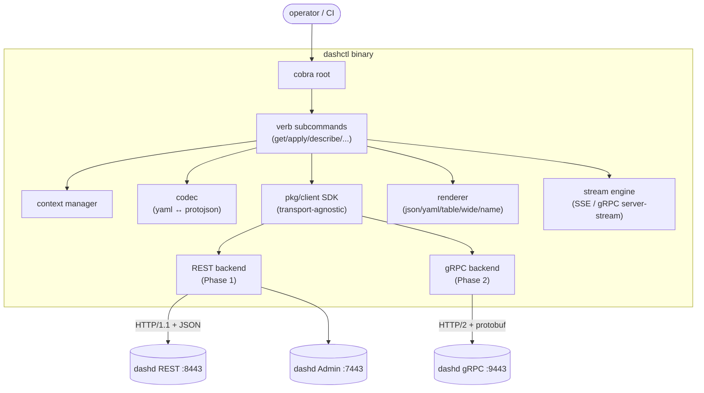
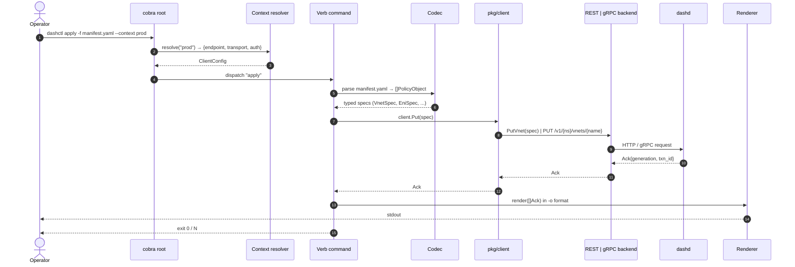
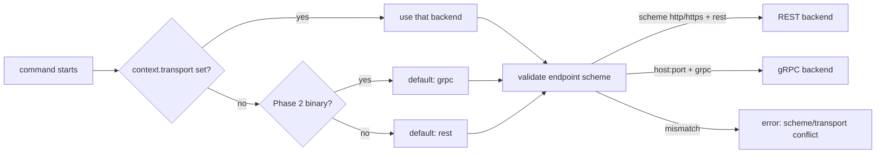

# High-Level Design (HLD) — `dashctl` (DashCenter Operator CLI)

> **Document scope.** This HLD specifies `dashctl`, the operator-facing
> command-line interface for DashCenter. It is the kubectl-equivalent for
> dashd: the primary tool operators, SREs, and CI pipelines use to declare
> intent into a DashCenter cluster and observe convergence.
>
> **Companion LLD.** Module-by-module interfaces, command graphs, data
> models, error taxonomy, and test plan are in
> [`specs/LLD/dashctl-lld.md`](../LLD/dashctl-lld.md).
>
> **Implementation plan.** Two-phase delivery (REST first, gRPC second) is
> tracked in [`specs/Impl-Plan/dashctl-impl-phases.md`](../Impl-Plan/dashctl-impl-phases.md).
>
> **Status.** Supersedes the early draft at [`specs/LLD/dashctl.md`](../LLD/dashctl.md),
> which remains for historical reference only.

---

## Table of contents

1. [Executive summary](#1-executive-summary)
2. [Goals & non-goals](#2-goals--non-goals)
3. [System context](#3-system-context)
4. [Design principles](#4-design-principles)
5. [Architecture overview](#5-architecture-overview)
6. [Transport strategy: REST then gRPC](#6-transport-strategy-rest-then-grpc)
7. [Command taxonomy](#7-command-taxonomy)
8. [Resource model & manifest schema](#8-resource-model--manifest-schema)
9. [Configuration & contexts](#9-configuration--contexts)
10. [Output, rendering, and `-o` formats](#10-output-rendering-and--o-formats)
11. [Streaming & long-running operations](#11-streaming--long-running-operations)
12. [Authentication & authorization](#12-authentication--authorization)
13. [Error model](#13-error-model)
14. [Observability of the CLI itself](#14-observability-of-the-cli-itself)
15. [Versioning & compatibility](#15-versioning--compatibility)
16. [Deployment, distribution, and packaging](#16-deployment-distribution-and-packaging)
17. [Out of scope](#17-out-of-scope)

---

## 1. Executive summary

`dashctl` is the **operator's primary interface** to a DashCenter cluster.
It is to `dashd` exactly what `kubectl` is to `kube-apiserver`: a single
statically-linked Go binary that:

- speaks the `dashcenter.v1` API (REST in Phase 1, gRPC in Phase 2),
- exposes a **declarative, kind-shaped command surface** (`dashctl apply -f`,
  `dashctl get`, `dashctl describe`, `dashctl delete`),
- supports **multiple cluster contexts** via a kubeconfig-equivalent file,
- renders results in **`json` / `yaml` / `table` / `wide` / `name`** formats
  with stable column layouts,
- streams long-running operations (`dashctl drift watch`, `dashctl dpu status`,
  `dashctl events`, `dashctl migration stream`) with proper signal handling
  and reconnect semantics,
- is **scriptable** (exit codes, `--quiet`, machine-readable output) and
  **interactive** (color-aware tables, progress bars for streams).

The CLI carries no business logic. It is a thin, well-engineered transport
client over the same `dashcenter.v1` service surface that the Web Console
and 3rd-party SDKs consume.

---

## 2. Goals & non-goals

### Goals

| Goal | Why |
|---|---|
| **Declarative, kubectl-grade UX** | Operators arriving from k8s should be productive in minutes. |
| **Two transports, one binary** | REST in Phase 1 unlocks dashd today; gRPC in Phase 2 adds native streaming, exact-once semantics, and uniform schema validation. |
| **Strict schema fidelity** | Every payload is the `dashcenter.v1` protobuf message; no client-side reinterpretation. |
| **Per-cluster contexts** | Production multi-cluster operators need `dashctl --context prod-west` without rebuilds. |
| **Predictable exit codes & output** | First-class CI/CD consumer. |
| **Zero hidden state** | All inputs are flags, env vars, or files. No interactive prompts that block automation. |
| **Helpful when offline** | `dashctl explain`, `dashctl version`, `dashctl config view` work without dialing dashd. |
| **Bidirectional parity with dashd** | Every dashd RPC has a corresponding dashctl command surface (with explicit `Unimplemented` mapping for stub RPCs). |

### Non-goals (explicit)

- **dashctl is not a control plane.** It never holds state, runs reconcilers,
  or talks `dashapi.v1` directly to DPU agents. Single-DPU debugging uses
  the separate [`dash-sim-client`](../LLD/dash-sim-client.md).
- **dashctl is not a stateful workflow engine.** Long-running orchestrations
  (ENI live migration, HA switchover, drain) live in dashd as persisted
  sessions; `dashctl` only issues the RPCs and streams progress.
- **dashctl does not embed cluster bootstrap.** Cluster bring-up (etcd, dashd
  HA election, initial inventory) is delivered separately.
- **dashctl is not a GitOps engine.** It is the imperative + declarative
  driver; a GitOps wrapper (e.g., a controller that reconciles a Git repo
  against `dashctl apply -f`) is a downstream concern.

---

## 3. System context

```
                ┌──────────────────────────────────────────────────────┐
                │            Operator / CI / Web Console               │
                └─────────────┬─────────────────────────┬──────────────┘
                              │                         │
                       dashctl CLI              browser SPA / SDKs
                              │                         │
       Phase 1: REST :8443    │                         │ REST/gRPC
       Phase 2: gRPC :9443    │                         │
                              ▼                         ▼
                ┌──────────────────────────────────────────────────────┐
                │                        dashd                         │
                │  REST :8443  gRPC :9443   Admin :7443                │
                │                                                      │
                │  ControlPlane · Observability · Operations ·         │
                │  Diagnostics · HaService · MigrationService          │
                └────────────────────┬─────────────────────────────────┘
                                     │ dashapi.v1 (south)
                                     ▼
                              fleet of DPU agents
```

dashctl shares the **same northbound surface** as the Web Console and
3rd-party SDKs. There is no privileged backdoor: anything dashctl can do,
any client can do via the published `dashcenter.v1` API.

---

## 4. Design principles

| Principle | Implication |
|---|---|
| **Protocol-first, no client-side business logic** | dashctl marshals user input into a `dashcenter.v1` request and renders the response. It never recomputes drift, capacity, or placement — those are dashd's job. |
| **Two transports, one shape** | The `pkg/client` SDK exposes a single Go interface; REST and gRPC backends are plug-in implementations of that interface. Subcommand code never knows which is in use. |
| **One binary, every platform** | Static `CGO_ENABLED=0` Go build for `linux/amd64`, `linux/arm64`, `darwin/amd64`, `darwin/arm64`, `windows/amd64`. |
| **Stable output contracts** | `-o json` / `-o yaml` are part of the public API — versioned, documented, machine-parseable. Column layouts in `-o table` change only at major versions. |
| **Streaming is first-class** | `dashctl events`, `dashctl dpu status`, `dashctl drift --watch`, `dashctl migration stream` use native streaming with Ctrl-C → graceful cancel + final summary line. |
| **Idempotent declarative ops** | `dashctl apply -f` is the primary path; it computes the right Put per kind, supplies `expected_generation` from the manifest if present, and prints exactly what changed. |
| **Predictable failure** | Exit codes are stable and documented; errors include a machine-readable code, a human reason, and (when applicable) the dashd `txn_id` for cross-correlation. |
| **No telemetry by default** | dashctl does not phone home. Optional structured-log emission to a local file via `--log-level / --log-file`. |
| **Cobra-shaped, kubectl-shaped** | Verb-noun command tree; persistent global flags; per-command help; shell completion (bash/zsh/fish/pwsh). |

---

## 5. Architecture overview

### 5.1 Block diagram



### 5.2 Layered responsibilities

```
┌──────────────────────────────────────────────────────┐
│   internal/cmd/                — Cobra commands      │  ← user-facing
├──────────────────────────────────────────────────────┤
│   internal/cli/                — flag/arg parsing,   │
│                                  manifest loader,    │
│                                  context resolver    │
├──────────────────────────────────────────────────────┤
│   internal/render/             — output formatters   │
│   internal/stream/             — long-run handling   │
├──────────────────────────────────────────────────────┤
│   pkg/client/                  — transport-agnostic  │
│                                  Client interface    │
├──────────────────────────────────────────────────────┤
│   pkg/client/rest              — Phase 1 backend     │
│   pkg/client/grpc              — Phase 2 backend     │
└──────────────────────────────────────────────────────┘
```

Only `pkg/client` types appear in command signatures. Backend selection
happens **once at startup** based on the active context's `transport:`
field (default: `rest` in Phase 1, `grpc` in Phase 2).

### 5.3 Request lifecycle



---

## 6. Transport strategy: REST then gRPC

This is the **defining sequencing decision** of dashctl.

### Phase 1 — REST backend (immediate value)

| Why | What it unlocks |
|---|---|
| dashd's REST listener `:8443` is feature-complete today (P1B-G7 ✅). | Operators can drive dashd as soon as dashctl Phase 1 ships. |
| HTTP/1.1 + JSON is universally consumable; no codegen dependency on the client side. | The same backend code can power Python/Rust/Node SDKs trivially later. |
| Aligns with the existing operator muscle memory (curl-style URLs). | Lower onboarding cost. |
| No protoc / proto stubs in the dashctl build chain. | Faster CI, simpler vendoring. |

**Limitations accepted in Phase 1**:
- No native streaming. `dashctl events`, `dashctl dpu status`, `dashctl drift --watch` use **HTTP long-poll** (request every N seconds, dedup) or **SSE** (`text/event-stream`) where the dashd endpoint supports it. Migration/HA streams are deferred to Phase 2.
- Each request is one HTTP round-trip; no transactional `ApplyBatch`.

### Phase 2 — gRPC backend (full fidelity)

| Why | What it unlocks |
|---|---|
| Native bidirectional streaming for `WatchEvents`, `GetDpuStatus`, `StreamMigrationSession`, `WatchHaEvents`, `DrainDpu`, `GetCounters`, `GetAclHitStats`. | Real-time `dashctl events`, `migration stream`, `drain`. |
| `ApplyBatch` is a client-streaming RPC — REST cannot model it cleanly. | Atomic multi-spec transactions. |
| `dashcenter.v1` proto is the canonical schema; gRPC eliminates JSON encoding mismatches. | Lower bug surface, exact-once validation. |
| Phase 2 dashd milestones (PC ops, PE diagnostics) ship gRPC-only RPCs. | Required parity. |

**Both transports coexist after Phase 2.** Users pick per context:

```yaml
contexts:
  prod-west:
    endpoint: dashd.prod-west.example.com:9443
    transport: grpc        # Phase 2 default
  dev-local:
    endpoint: http://localhost:8443
    transport: rest        # Phase 1 backend still supported
```

### Transport selection logic



### RPC coverage matrix (high level)

| dashd RPC group | Phase 1 (REST) | Phase 2 (gRPC) |
|---|---|---|
| Inventory (`PutInventory`, `Get`) | ✅ | ✅ |
| Per-kind Put/Get/Delete/List (Vnet, Eni, …) | ✅ | ✅ |
| `Reconcile` | ✅ | ✅ |
| `Get` / `List` (server-stream List in Phase 2) | ✅ (paged JSON) | ✅ native stream |
| `ApplyBatch` (client-stream) | ⬜ Phase 2 only | ✅ |
| `SimulateApply` | ✅ | ✅ |
| `WatchEvents`, `GetDpuStatus`, `GetCounters`, `GetAuditLog`, `GetFlowList` | ⬜ SSE where available; otherwise Phase 2 | ✅ |
| `GetDrift`, `GetFlowStats` (unary) | ✅ | ✅ |
| Admin (`/admin/health`, `/admin/eni-placement`) | ✅ | n/a (admin is REST-only on dashd) |
| `OperationsService` (cordon, drain) | ⬜ Phase 2 | ✅ (once dashd Phase 2 PC ships) |
| `MigrationService` | ⬜ Phase 2 | ✅ |
| `HaService` | ⬜ Phase 2 | ✅ |
| `DiagnosticsService` (TraceFlow, ExplainMatch) | ⬜ Phase 2 | ✅ |

✅ = available, ⬜ = deferred.

---

## 7. Command taxonomy

### 7.1 Top-level verbs (kubectl-shaped)

```
dashctl
├── apply          declarative: apply -f <file|dir> [--recursive] [--dry-run]
├── get            read: get <kind> [name] [-o] [-l selector]
├── describe       human-readable detail: describe <kind> <name>
├── delete         delete <kind> <name> [--cascade] [--ignore-not-found]
├── edit           open spec in $EDITOR, then apply on save
├── replace        replace -f file (CAS via expected_generation)
├── label / annotate   metadata manipulation
├── explain        offline: schema reference for a kind / field
├── diff           manifest vs cluster — preview what apply would change
├── events         stream PolicyEvent feed
├── logs           stream dashd audit log entries (subset of events)
├── version        client + server versions
├── config         context management (current-context, use-context, view, set)
├── debug          raw-protocol escape hatches (hidden; see dashctl-debug.md)
├── completion     shell completion (bash/zsh/fish/pwsh)
└── help           per-command help
```

### 7.2 Resource-shaped subcommands (typed convenience)

```
dashctl vnet            put | get | list | delete | edit | describe
dashctl eni             put | get | list | delete | edit | describe
dashctl vnet-mapping    put | get | list | delete
dashctl acl-policy      put | get | list | delete | edit
dashctl route-policy    put | get | list | delete | edit
dashctl ha-set          put | get | list | delete
dashctl service-tunnel  put | get | list | delete       # Phase 2 (capability-gated)
dashctl inventory       put | get | list
```

### 7.4 Debug / escape hatches (hidden)

```
dashctl debug
├── put-raw        bypass envelope codec; send raw JSON to dashd ControlPlane
├── get-raw        dump raw protojson stored in dashd (no envelope wrapping)
├── curl           print equivalent curl / grpcurl command (offline, no RPC)
├── admin          raw GET to dashd admin :7443
├── grpc-stream    open a named gRPC server-stream RPC; dump NDJSON (Phase 2)
└── parity         compare REST vs gRPC Get; diff on mismatch (Phase 2)
```

The `debug` group is **hidden from `dashctl --help`** but accessible via
`dashctl debug --help`. It provides raw-protocol escape hatches for
operators and maintainers who need to step outside the typed CLI. Full
spec is in [`specs/LLD/dashctl-debug.md`](../LLD/dashctl-debug.md).

Key invariants:
- **No business logic** — calls dashd northbound APIs only; never talks
  `dashapi.v1` southbound to DPU agents (use `dash-sim-client` for that).
- **No hidden writes** — only `put-raw` mutates; everything else is
  read-only or offline.
- **Same exit codes** as all other dashctl commands.

These are **thin wrappers around the generic verbs** — same SDK call,
better discoverability. Inspired by `kubectl get pods` vs `kubectl get pod`.

### 7.3 Cluster operations

```
dashctl dpu list                           # snapshot
dashctl dpu status [--dpu ID] [--watch]    # stream (Phase 2)
dashctl dpu drift   [--dpu ID]             # snapshot of declared-vs-observed
dashctl dpu cordon  <id>                   # Phase 2 (dashd PC)
dashctl dpu uncordon <id>                  # Phase 2
dashctl dpu drain   <id> [--parallel N]    # Phase 2 stream

dashctl reconcile [--dpu ID ...]           # force reconcile

dashctl ha switchover <ha-set> --to <dpu>  # Phase 2
dashctl ha failover   <ha-set> --to <dpu>  # Phase 2
dashctl ha events     [--watch]            # Phase 2 stream

dashctl migration plan create -f plan.yaml          # Phase 2
dashctl migration start    <plan-id>                # Phase 2
dashctl migration advance  <session-id>             # Phase 2
dashctl migration stream   <session-id>             # Phase 2 stream
dashctl migration rollback <session-id>             # Phase 2
dashctl migration bundle export|import              # Phase 2 byte-stream

dashctl trace flow --src ... --dst ...              # Phase 2 (Diagnostics)
dashctl trace explain --acl-rule ...                # Phase 2
dashctl drift                                       # alias for `dpu drift --all`
```

A full command graph and per-command flag table is in
[`dashctl-lld.md § 5`](../LLD/dashctl-lld.md#5-command-graph--per-command-specs).

---

## 8. Resource model & manifest schema

`dashctl apply -f` accepts:

- **Single YAML/JSON document** with one spec.
- **Multi-document YAML stream** (`---` separated).
- **Directory** (`apply -f ./manifests/` walks `.yaml`/`.yml`/`.json` files).
- **stdin** (`apply -f -`).

Manifest envelope:

```yaml
apiVersion: dashcenter.v1
kind: Eni
metadata:
  namespace: team-a
  name: eni-prod-001
  generation: 7              # optional; if present, sent as expected_generation (CAS)
  labels:
    team: prod-net
    tier: prod
spec:                        # exact dashcenter.v1.EniSpec shape
  vnetName: vnet-prod
  macAddress: "00:11:22:33:44:55"
  underlayIp: "10.0.5.7"
  adminState: "up"
  placementHintDpuIds: ["dpu-r1-r5", "dpu-r1-r6"]
```

**Why an envelope instead of raw spec?** Three reasons:
1. Allows `dashctl apply -f` to multiplex many kinds in one stream
   without inferring kind from field shape (fragile).
2. Carries `metadata.generation` for optimistic concurrency (CAS).
3. Aligns with kubectl mental model; trivially convertible to/from
   `dashcenter.v1.PolicyObject`.

Conversion: envelope → `dashcenter.v1.<Kind>Spec` via codec table
(see [LLD § 7](../LLD/dashctl-lld.md#7-codec--manifest-schema)).

---

## 9. Configuration & contexts

### 9.1 Config file location

| OS | Path |
|---|---|
| Linux/macOS | `$XDG_CONFIG_HOME/dashctl/config` (default `~/.config/dashctl/config`) |
| Windows | `%APPDATA%\dashctl\config` |

Override with `--config <path>` or `$DASHCTL_CONFIG`.

### 9.2 Config schema

```yaml
apiVersion: dashctl/v1
kind: Config
current-context: prod-west
contexts:
  prod-west:
    endpoint: https://dashd-prod-west.example.com:8443      # Phase 1 (REST)
    transport: rest
    namespace: default
    auth:
      mode: token
      token-env: DASHCTL_TOKEN_PROD
    tls:
      ca-file: /etc/dashctl/prod-ca.pem
      insecure-skip-verify: false
    timeout: 30s
  dev-local:
    endpoint: localhost:9443                                  # Phase 2 (gRPC)
    transport: grpc
    namespace: dev
    auth:
      mode: none
    tls:
      insecure: true                                          # plaintext gRPC
preferences:
  output: table          # default -o for this user
  color: auto            # auto | always | never
  page-size: 100         # default list pagination
```

### 9.3 Precedence (highest wins)

1. Per-invocation flags (`--endpoint`, `--namespace`, `-o`, …)
2. Environment variables (`DASHCTL_ENDPOINT`, `DASHCTL_NAMESPACE`, `DASHCTL_TOKEN`, …)
3. Active context in config file
4. Built-in defaults

### 9.4 Context management commands

```
dashctl config view                              # print resolved config
dashctl config get-contexts
dashctl config current-context
dashctl config use-context <name>
dashctl config set-context <name> --endpoint=... --transport=...
dashctl config delete-context <name>
dashctl config rename-context <old> <new>
```

---

## 10. Output, rendering, and `-o` formats

| `-o` | Audience | Stability | Notes |
|---|---|---|---|
| `table` (default for terminals) | human | columns may add at minor versions | concise, color-aware, multi-row |
| `wide` | human | columns may add | adds dpu, labels, generation |
| `name` | scripts | append-only | `<kind>/<name>` per line |
| `json` | scripts / SDKs | **stable contract** | protojson with `UseProtoNames: true`, indented |
| `yaml` | scripts / GitOps | **stable contract** | JSON round-tripped through `yaml.v3` |
| `jsonpath=...` | scripts | stable | kubectl-compatible expressions on the JSON tree |
| `template=...` | scripts | stable | Go `text/template` evaluated against the JSON tree |

Detection: if stdout is a TTY and no `-o` was set, default to `table`;
otherwise default to `json`. Force with `--output=...`.

---

## 11. Streaming & long-running operations

Long-lived commands have a consistent contract:

| Behaviour | All streaming commands |
|---|---|
| Initial state | Server emits a snapshot (where supported), then deltas. |
| Cancellation | Ctrl-C → graceful `context.Cancel` → server stream closes → final summary line. |
| Reconnect | Transient disconnects: silent reconnect with exponential backoff (1s → 30s, jittered) and a one-line stderr notice. Permanent errors exit non-zero with the gRPC/HTTP code. |
| Filtering | Server-side filters preferred (`--dpu`, `--namespace`, `--kind`); client-side fallback only for fields the API does not filter on. |
| Output | One row per event in `table`; one JSON object per line in `json` (NDJSON). |
| Timeout | `--timeout` caps total command duration. `0` means forever (the default for `--watch`). |

### Phase 1 streaming options on REST

- **Server-Sent Events (SSE)** where dashd offers it (`GET …?watch=true`,
  content-type `text/event-stream`).
- **Long-poll** fallback (`GET …?since=<gen>`) for endpoints that do not
  yet support SSE.
- **No client-streaming** RPCs (i.e., no `ApplyBatch`) — those wait for
  Phase 2.

### Phase 2 streaming on gRPC

Native server-streaming and client-streaming, including:
- `WatchEvents`, `GetDpuStatus`, `GetCounters`, `GetFlowList`, `GetAuditLog`
- `WatchHaEvents`, `StreamMigrationSession`, `DrainDpu`
- `ApplyBatch` (client-streaming)
- `ExportMigrationBundle` / `ImportMigrationBundle` (byte streams)

---

## 12. Authentication & authorization

| Mode | When | How |
|---|---|---|
| `none` | dev/local | plaintext, no creds |
| `token` | most prod (Phase 2 PD) | `Authorization: Bearer <token>` (REST) / metadata (gRPC) |
| `mTLS` | high-security prod | client cert + key from context; CA from context |
| `oidc` | future | device-flow login: `dashctl login --issuer ...` (post-Phase 2) |

Server-side enforcement (RBAC roles: `viewer`, `operator`, `admin`) is
performed entirely by dashd ([dashd Phase 2 PD-G3](../Impl-Plan/impl-phases.md)).
dashctl only carries credentials and surfaces `PERMISSION_DENIED` cleanly.

---

## 13. Error model

Every command exits with a documented code:

| Code | Meaning |
|---|---|
| `0` | success |
| `1` | generic CLI error (bad flags, parse failure, render failure) |
| `2` | usage error (handled by Cobra) |
| `3` | not-found (kind/name) — analogous to `kubectl`'s `NotFound` |
| `4` | conflict (generation mismatch, already-exists where exclusive) |
| `5` | validation error (server returned `InvalidArgument`) |
| `6` | permission denied (`PERMISSION_DENIED` / 403) |
| `7` | unavailable (`UNAVAILABLE` / 503; dashd not leader, network) |
| `8` | timeout (`DEADLINE_EXCEEDED`) |
| `9` | unimplemented (RPC not yet supported on this transport / phase) |
| `10` | internal (`INTERNAL` / 500) |
| `>=11` | reserved |

Stderr error format (stable):
```
Error: <human reason>
Code: <NOT_FOUND|FAILED_PRECONDITION|...>          (server code; absent for client errors)
TxnId: <txn-id>                                    (when present in server Ack)
Hint: <next-step suggestion>                       (optional)
```

---

## 14. Observability of the CLI itself

- **`--log-level debug|info|warn|error`** controls slog output to stderr (default: warn).
- **`--log-file <path>`** redirects logs to a file (NDJSON).
- **`-v / --verbose`** is shorthand for `--log-level=debug` + per-RPC request/response summaries on stderr (no payloads by default; `--log-payloads` to include).
- **Metrics**: none by default. Optional `--profile cpu|mem` writes a pprof profile for long-running streams.

---

## 15. Versioning & compatibility

- `dashctl version` reports both **client** and **server** versions (it dials dashd's `/admin/health` or a versioning RPC).
- **N-1 server compatibility**: dashctl `vX.Y` must be compatible with dashd `vX.{Y-1, Y, Y+1}`. Newer RPCs degrade to `Unimplemented` with a friendly message.
- **Semver** on the dashctl binary; breaking output/flag changes only at major bumps.
- **Manifest schema** is versioned by `apiVersion: dashcenter.v1`; future `dashcenter.v2` would be a parallel kind set with explicit conversion notes.

---

## 16. Deployment, distribution, and packaging

| Channel | Form |
|---|---|
| **GitHub Releases** | static binaries (linux/amd64, linux/arm64, darwin/amd64, darwin/arm64, windows/amd64); SHA256 + sigstore-cosign attestations |
| **Container image** | distroless multi-arch image at `ghcr.io/<org>/dashctl:<version>` |
| **Homebrew** | `brew install dashctl` (post-Phase 2) |
| **Krew-style plugin model** | out of scope for v1 |
| **CI install** | one-liner `curl -sSL https://.../install.sh \| sh` (post-Phase 2) |

Build is reproducible: `CGO_ENABLED=0 go build -trimpath -ldflags="-s -w -X main.version=..."`.

---

## 17. Out of scope

- Cluster lifecycle (etcd bring-up, dashd HA election, bootstrap).
- Web Console functionality.
- Direct DPU debugging (use `dash-sim-client`). Note: `dashctl debug`
  is an escape hatch for dashd's **northbound** APIs; it does NOT talk
  `dashapi.v1` southbound to DPU agents. Single-DPU southbound debugging
  remains the job of `dash-sim-client`.
- Saga/transaction recovery UI (dashd internal concern).
- Schema reflection (`dashctl explain` uses an embedded proto descriptor; no live reflection in v1).

---

> **End of HLD.** For the implementable detail — module layout, types,
> command-by-command specs, codec algorithm, error mapping tables,
> streaming engine state machine, test plan — see
> [`specs/LLD/dashctl-lld.md`](../LLD/dashctl-lld.md).
