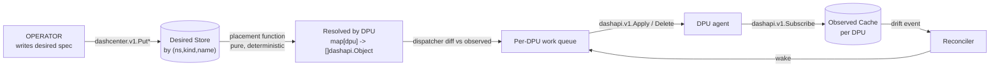
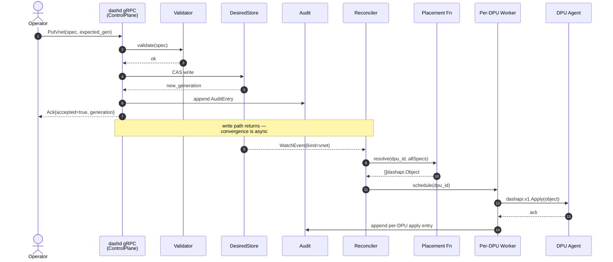
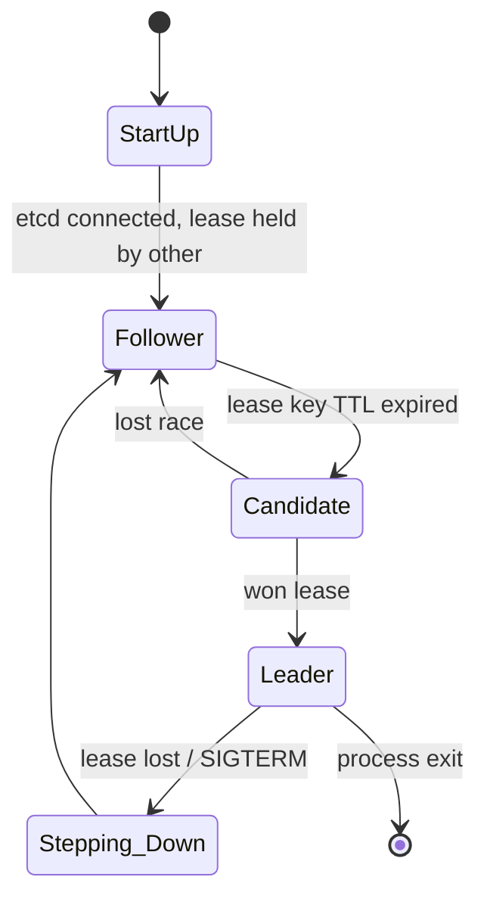
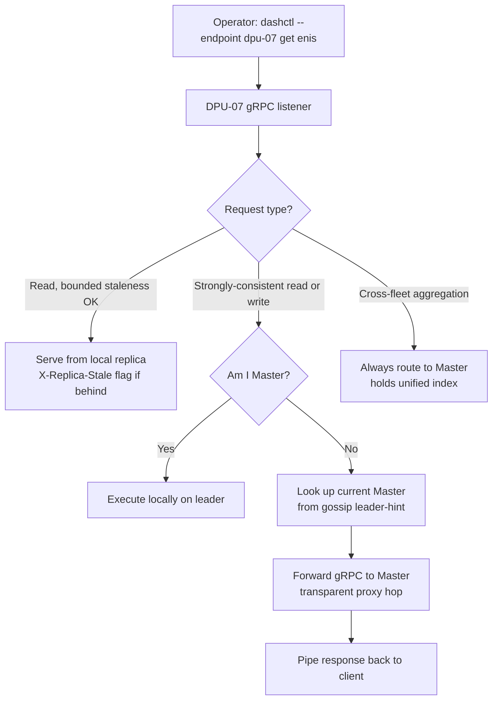

# High-Level Design (HLD) Specification: `dashd` — DashCenter Core Daemon

> **Document scope.** This HLD specifies the architecture of **`dashd`**, the
> central control-plane process of DASHCenter. The two existing system-level
> HLDs ([centralized](high_level_system_design.md) and
> [controllerless](high_level_system_design_controllerless.md)) describe the
> *deployment topology*; this document describes the *daemon itself* — its
> functional scope, modules, programming model, user interfaces, and how the
> same binary serves both deployment topologies.
>
> **Companion LLD.** Detailed module-by-module interfaces, state machines,
> sequence diagrams, and data structures are in
> [`specs/LLD/dashd-lld.md`](../LLD/dashd-lld.md).

---

## Table of Contents

1. [Executive Summary](#1-executive-summary)
2. [Design Goals & Principles](#2-design-goals--principles)
3. [System Context & Positioning](#3-system-context--positioning)
4. [Dual-Mode Architecture Overview](#4-dual-mode-architecture-overview)
5. [Top-Level Block Diagrams](#5-top-level-block-diagrams)
6. [Module Catalog](#6-module-catalog)
7. [User Interfaces & Programming Model](#7-user-interfaces--programming-model)
8. [Data Flow Summary](#8-data-flow-summary)
9. [Controller Mode Deep Dive](#9-controller-mode-deep-dive)
10. [Controllerless Mode Deep Dive](#10-controllerless-mode-deep-dive)
11. [HA & Fault Tolerance](#11-ha--fault-tolerance)
12. [Security Model](#12-security-model)
13. [Observability Model](#13-observability-model)
14. [Deployment Topologies](#14-deployment-topologies)
15. [Open Items & Future Work](#15-open-items--future-work)

---

## 1. Executive Summary

**`dashd`** is the heart of DASHCenter — the single Go process that turns
operator intent into hardware configuration on a fleet of DASH DPUs. It owns:

* the **northbound API** (`dashcenter.v1`) that operators, `dashctl`, the
  Web Console, and 3rd-party SDKs speak to;
* the **southbound client** (`dashapi.v1`) used to apply configuration to
  every DPU;
* the **desired-state store**, the **per-DPU observed-state cache**, and
  the **reconciliation engine** that converges the two;
* in HA deployments, **leader election** and **state replication**.

`dashd` is **deployment-topology agnostic**. The identical binary runs in
two complementary modes:

| Mode | Where it runs | Who is leader |
|---|---|---|
| **Controller** | Dedicated x86 host(s) outside the DPU fleet | One elected `dashd` (etcd lease) |
| **Controllerless** | Embedded on every DPU in the fleet | Self-elected via gossip + Raft |

The **API surface seen by operators is identical** in both modes; only the
internal transport routing layer changes. This dual-mode design is the
defining architectural decision of `dashd` and is the reason every module
below is required to be transport-independent.

---

## 2. Design Goals & Principles

| Goal | Implication |
|---|---|
| **Single binary, two modes** | `dashd` builds and ships as one Go binary. Mode is selected at startup by config (`mode: controller` vs `mode: controllerless`). All shared modules are mode-agnostic; mode-specific modules are pluggable. |
| **Protocol-first** | Every interaction is a typed protobuf RPC. No private file format, no Redis-tapping, no SSH. Northbound = `dashcenter.v1`; southbound = `dashapi.v1`. |
| **Declarative reconciliation** | Operators *declare* desired state; `dashd` *reconciles* it onto DPUs. No imperative "apply this rule now and tell me when done" — write returns when the spec is persisted, convergence is asynchronous, observable, and idempotent. |
| **Modular & extensible** | Functionality is broken into ~20 internal modules with narrow interfaces. New `dashcenter.v1` services, new placement rules, new storage backends, new auth providers, and new replication transports plug in without touching the reconciliation core. |
| **Mode-agnostic core** | The reconciler, placement function, dispatcher, and Subscribe pump have **no awareness** of controller vs controllerless. They consume `DesiredStore` and `Inventory` interfaces. The mode supplies the implementation. |
| **No silent optimism** | Every write is staged → validated → dispatched → acknowledged. Failures are surfaced via status and audit, never swallowed. |
| **Resilient to partial failure** | One DPU's misbehavior cannot stall the fleet. Per-DPU isolation in workers, error budgets, quarantine, and back-pressure are first-class. |
| **Observable** | Structured logs, Prometheus metrics, OTel tracing, and an audit log are baseline — not afterthoughts. |
| **Safe upgrades** | Schema evolution via additive enums, optimistic concurrency on every mutation, capability negotiation with DPUs. |

---

## 3. System Context & Positioning

```
              ┌──────────────────────────────────────────────────────┐
              │                  OPERATOR / CLIENTS                  │
              │  dashctl CLI │ Web Console │ Terraform │ SDKs │ CI   │
              └────────────────────┬─────────────────────────────────┘
                                   │  dashcenter.v1
                                   │  (gRPC + REST + JSON-over-HTTPS)
                                   ▼
              ┌──────────────────────────────────────────────────────┐
              │                       dashd                          │
              │                                                      │
              │   - desired-state store      (etcd | file)           │
              │   - per-DPU observed cache   (Subscribe-driven)      │
              │   - placement function       (pure, deterministic)   │
              │   - per-DPU worker pool      (1 goroutine per DPU)   │
              │   - reconciliation engine    (event + tick driven)   │
              │   - mode plug-in:                                    │
              │       · controller   → etcd lease HA                 │
              │       · controllerless → gossip + Raft + proxy       │
              └────────────────────┬─────────────────────────────────┘
                                   │  dashapi.v1   (per-DPU gRPC)
              ┌────────────────────┼─────────────────────────────────┐
              │                    │                                 │
              ▼                    ▼                                 ▼
       ┌─────────────┐      ┌─────────────┐                   ┌─────────────┐
       │  dash-sim   │      │ dash-redis- │      ...          │  real DPU   │
       │  (CI / dev) │      │  adapter    │                   │   agent     │
       └─────────────┘      └─────────────┘                   └─────────────┘
```

* **Upstream of `dashd`**: any client that speaks `dashcenter.v1`. The
  primary first-party clients are `dashctl` and the Web Console; the API
  is also a public SDK surface for Terraform providers, GitOps engines,
  and automation scripts.
* **Downstream of `dashd`**: any process that exposes `dashapi.v1`. In
  development this is `dash-sim`; in production this is the on-DPU agent
  (vendor-supplied or `dash-redis-adapter`).
* **`dashd` is not a dataplane**. It never sees a packet. It never calls
  SAI. It exclusively translates `dashcenter.v1` intent into per-DPU
  `dashapi.v1.Object` lifecycles.

---

## 4. Dual-Mode Architecture Overview

`dashd` ships as one binary but has two runtime personalities. The choice
between them is purely a **deployment decision**, not a code change.

### 4.1 Controller mode

A small set of `dashd` instances (typically 1 dev, 3 prod) runs **outside**
the DPU fleet on dedicated hosts (or VMs / pods). One instance is the
**elected leader** (etcd lease); the rest are warm standbys serving
read-only API traffic. The leader owns:

* desired-state persistence (in etcd or file);
* the per-DPU Subscribe pumps (one long-lived stream per DPU);
* the per-DPU worker pool that issues `Apply` / `Delete`;
* fleet-wide aggregation, cross-DPU operations (HA, migration).

This is the model assumed by the original
[centralized HLD](high_level_system_design.md). It is best suited for:

* large fleets (≥ 20 DPUs);
* brownfield deployments where controller hardware exists;
* deployments that already run etcd for other purposes.

### 4.2 Controllerless mode

The identical `dashd` binary runs **on every DPU**. The fleet self-organizes
via two complementary overlays:

* **SWIM gossip** for liveness and soft state (who is alive, role hints,
  versions, load).
* **Raft consensus** for hard state (the authoritative replicated log of
  configuration writes).

One node is elected **Master** (Raft leader). 1–2 nodes become
**Secondary** (synchronous followers, election-eligible). Remaining nodes
are **Backup** (asynchronous followers, also election-eligible). Optional
**Voter-only** witnesses break even-N ties.

The operator can address **any** node; non-leader nodes proxy writes
transparently to the Master. There is **no external controller host**.

This is the model defined in the
[controllerless HLD](high_level_system_design_controllerless.md). It is best
suited for:

* small-to-mid fleets (3 – 20 DPUs);
* greenfield edge / branch deployments;
* environments where shipping additional controller infrastructure is
  undesirable.

### 4.3 What is shared, what is mode-specific

```
┌──────────────────────────────────────────────────────────────────────┐
│                         SHARED MODULES                               │
│  (identical code in both modes, no awareness of topology)            │
│                                                                      │
│    config · store · inventory · model · placement · subscribe ·      │
│    dispatch · reconciler · server/grpc · server/rest · server/admin  │
│    auth · audit · namespace · migration · operations ·               │
│    observability · diagnostics                                       │
└─────────────────────────────────┬────────────────────────────────────┘
                                  │
                ┌─────────────────┼─────────────────┐
                │                                   │
                ▼                                   ▼
   ┌──────────────────────────┐         ┌──────────────────────────┐
   │  CONTROLLER MODE         │         │  CONTROLLERLESS MODE     │
   │  PLUG-IN MODULES         │         │  PLUG-IN MODULES         │
   │                          │         │                          │
   │   ha/etcd_lease          │         │   gossip (SWIM)          │
   │   store/etcd_backend     │         │   raft (consensus log)   │
   │                          │         │   proxy (request routing)│
   │                          │         │   ha/raft_leadership     │
   └──────────────────────────┘         └──────────────────────────┘
```

The mode is selected by a single config field. The reconciler, placement
function, Subscribe pump, dispatcher, gRPC servers, and audit log are
**byte-identical** between modes — this is enforced by interface
discipline in [§ 4 of the LLD](../LLD/dashd-lld.md).

---

## 5. Top-Level Block Diagrams

### 5.1 Controller mode

```
                       ┌─────────────────────────────────────────┐
                       │   Operator clients (dashctl, Console)   │
                       └────────────────────┬────────────────────┘
                                            │ dashcenter.v1 (gRPC + REST)
                       ┌────────────────────┼────────────────────┐
                       │                    │                    │
              ┌────────▼────────┐  ┌────────▼────────┐  ┌────────▼────────┐
              │ dashd (LEADER)  │  │ dashd (FOLLOWER)│  │ dashd (FOLLOWER)│
              │  - all writes   │  │  - RO reads     │  │  - RO reads     │
              │  - reconciler   │  │  - audit reads  │  │  - audit reads  │
              │  - Subscribe    │  │  - status       │  │  - status       │
              │    pumps        │  │                 │  │                 │
              └────────┬────────┘  └────────┬────────┘  └────────┬────────┘
                       │                    │                    │
                       └──────────┬─────────┴─────────┬──────────┘
                                  │ etcd v3 (lease + KV)
                                  ▼
                       ┌─────────────────────────┐
                       │     etcd cluster        │
                       │   (3 or 5 nodes)        │
                       └─────────────────────────┘
                                  │
       Leader only ─►  dashapi.v1 (per-DPU gRPC, long-lived Subscribe)
                                  │
              ┌───────────────────┼───────────────────┐
              │                   │                   │
        ┌─────▼─────┐       ┌─────▼─────┐       ┌─────▼─────┐
        │  DPU 1    │       │  DPU 2    │       │  DPU N    │
        │ (agent)   │       │ (agent)   │       │ (agent)   │
        └───────────┘       └───────────┘       └───────────┘
```

### 5.2 Controllerless mode

```
                          ┌──────────────────────────────┐
                          │ Operator clients             │
                          │ (may target ANY node)        │
                          └──────────────┬───────────────┘
                                         │ dashcenter.v1
                  ┌──────────────────────┼──────────────────────┐
                  │                      │                      │
       ┌──────────▼─────────┐  ┌─────────▼─────────┐  ┌─────────▼─────────┐
       │ DPU 1 = dashd      │  │ DPU 2 = dashd     │  │ DPU 3 = dashd     │
       │       [MASTER]     │  │     [SECONDARY]   │  │     [BACKUP]      │
       │                    │  │                   │  │                   │
       │ - owns writes      │  │ - sync replica    │  │ - async replica   │
       │ - reconciler       │  │ - vote-eligible   │  │ - vote-eligible   │
       │ - Subscribe pumps  │  │ - proxy to MASTER │  │ - proxy to MASTER │
       │ - local probe agent│  │ - local probe     │  │ - local probe     │
       └────────┬─────┬─────┘  └────────┬────┬─────┘  └────────┬────┬─────┘
                │     │                 │    │                 │    │
                │     │   ╔═════════════╧════╧═════════════════╧════╧═══╗
                │     │   ║  SWIM gossip (UDP)  +  Raft (gRPC/TCP)      ║
                │     │   ╚══════════════════════════════════════════════╝
                │     │
   dashapi.v1 (loopback or local agent)  ◄── each node also runs its own
                │     │                       on-DPU agent which dashd talks
                ▼     ▼                       to via dashapi.v1
            DPU dataplane (DASH-SAI / P4)
```

---

## 6. Module Catalog

`dashd` is organized as ~20 internal modules under `src/impl-go/dashd/internal/`.
Each is a single-purpose Go package with a narrow public interface. The
detailed module specs (interfaces, state diagrams, sequence diagrams) live
in [`specs/LLD/dashd-lld.md`](../LLD/dashd-lld.md) §§ 6–27.

| # | Module | Responsibility | Mode |
|---|---|---|---|
| 1 | `config` | Load YAML config + flag overrides; validate; expose immutable `Config` struct. | Shared |
| 2 | `store` | `DesiredStore` interface + `FileStore` and `EtcdStore` implementations. Persists `dashcenter.v1` specs. | Shared |
| 3 | `inventory` | DPU registry, identity, capabilities, capacity, lifecycle state machine (8 states). | Shared |
| 4 | `model` | In-memory canonical model of declared + observed state, keyed by `(namespace, kind, name)`. | Shared |
| 5 | `placement` | **Pure function** `(allSpecs, inventory) → map[dpu][]Object`. The translator from `dashcenter.v1` to `dashapi.v1`. | Shared |
| 6 | `subscribe` | One long-lived `dashapi.v1.Subscribe` stream per DPU; populates `ObservedCache`; reconnects with snapshot. | Shared |
| 7 | `dispatch` | One goroutine per DPU; issues `Apply` / `Delete`; rate-limits; back-pressures. | Shared |
| 8 | `reconciler` | Event + tick driven loop; computes drift; wakes per-DPU workers. | Shared |
| 9 | `server/grpc` | Hosts all 6 `dashcenter.v1` services (ControlPlane, Observability, Diagnostics, Operations, Migration, HA). | Shared |
| 10 | `server/rest` | gRPC-Gateway REST surface; HTTP↔RPC mapping. | Shared |
| 11 | `server/admin` | Operator-debug HTTP endpoints (`/admin/*`). | Shared |
| 12 | `namespace` | Multi-tenant isolation; cross-namespace reference rejection. | Shared |
| 13 | `auth` | RBAC: viewer / operator / admin; token+OIDC plug-in. | Shared |
| 14 | `audit` | Append-only audit log; one entry per mutation. | Shared |
| 15 | `migration` | ENI live-migration orchestrator — 10-phase state machine, 4 strategies. | Shared |
| 16 | `operations` | Cordon / drain / uncordon workflow; phase-aware progress streams. | Shared |
| 17 | `observability` | Prometheus metrics registry; OTel tracing setup; structured slog. | Shared |
| 18 | `diagnostics` | TraceFlow, ExplainMatch, ACL hit stats, ExplainDrift. | Shared |
| 19 | `ha/etcd_lease` | Etcd-lease leader election. | **Controller** |
| 20 | `gossip` | SWIM-style UDP membership + soft state. | **Controllerless** |
| 21 | `raft` | Hashicorp-raft or etcd-raft state machine; replicates Store writes. | **Controllerless** |
| 22 | `proxy` | "Login-anywhere" request routing: local-read, forward-to-leader, fan-out. | **Controllerless** |
| 23 | `ha/raft_leadership` | Raft-based leadership signal; maps onto the same `Leader` interface used by controller mode. | **Controllerless** |

---

## 7. User Interfaces & Programming Model

### 7.1 API surfaces

`dashd` exposes three surfaces:

| Surface | Audience | Transport | Reference |
|---|---|---|---|
| **`dashcenter.v1` gRPC** | First-class SDKs (Go, Rust, Python), `dashctl`, programmatic clients | gRPC over HTTPS:9443 (mTLS in prod) | [`proto/dashcenter/v1/`](../../proto/dashcenter/v1/) |
| **`dashcenter.v1` REST** | Browsers, curl, scripts, GitOps engines that prefer JSON | HTTPS:8443 (gRPC-Gateway proxy) | derived 1:1 from gRPC |
| **Admin HTTP** | Operators debugging the daemon itself | HTTPS:7443 | `/admin/health`, `/admin/leader`, `/admin/inventory`, `/admin/drift`, `/admin/reconcile` |

The gRPC and REST surfaces are **isomorphic** — the REST API is generated
from the same proto via gRPC-Gateway, so adding a new RPC automatically
adds a new HTTP endpoint.

### 7.2 The six northbound services

The northbound API is split into six services, each addressing one
operational concern:

| Service | RPCs | Purpose |
|---|---|---|
| **`ControlPlane`** | `PutInventory`, `RegisterDpu`, `PutVnet`, `PutEni`, `PutVnetMapping`, `PutAclPolicy`, `PutRoutePolicy`, `PutHaSet`, `PutServiceTunnel`, `Delete`, `Get`, `List`, `ApplyBatch` (streaming, transactional), `SimulateApply` (dry-run), `Reconcile` | All mutating writes to fleet configuration. |
| **`ObservabilityService`** | `GetDpuStatus`, `GetFlowList`, `GetCounters`, `WatchEvents`, `GetAuditLog`, `GetFlowStats`, `GetDrift` | Read-only telemetry, status, and event streams. |
| **`DiagnosticsService`** | `TraceFlow`, `ExplainMatch`, `GetAclHitStats`, `ExplainDrift`, `TriggerResimulation` | Per-packet trace, rule-attribution, drift diagnosis. |
| **`OperationsService`** | `CordonDpu`, `UncordonDpu`, `DrainDpu`, `EniMigrationLink` | Maintenance lifecycle (cordon / drain). |
| **`MigrationService`** | `CreateMigrationPlan`, `ValidateMigrationPlan`, `StartMigrationSession`, `AdvanceMigrationPhase`, `RollbackMigration`, `AbortMigration`, `CommitMigration`, `StreamMigrationSession`, `ExportMigrationBundle`, `ImportMigrationBundle` (+2 more) | ENI live migration (10 phases, 4 strategies). |
| **`HaService`** | `GetHaSetState`, `GetHaScopeState`, `TriggerSwitchover`, `TriggerFailover`, `WatchHaEvents`, `GetFlowSyncStats` | DPU-level HA orchestration. |

See [`proto/dashcenter/v1/README.md`](../../proto/dashcenter/v1/README.md)
for the full gap-to-RPC coverage map.

### 7.3 The desired→resolved→observed programming model

`dashd` exposes a **declarative** programming model with three coordinate
spaces:



The operator's mental model is **always**: "I declare what I want; `dashd`
makes it true." There is no imperative API — no "apply this rule on DPU 5
right now." Even surgical operations (migration phase advance, HA
switchover) are modeled as state transitions on persisted resources, not
fire-and-forget RPCs.

### 7.4 `dashctl` and the Web Console

* **`dashctl`** is a Go CLI that wraps the `dashcenter.v1` gRPC client.
  It is the primary operator UX. See [`docs/CLI_GUIDE.md`](../../docs/CLI_GUIDE.md).
* **DashCenter Web Console** is a browser SPA that consumes the
  `dashcenter.v1` REST surface and the streaming Watch/Stream RPCs over
  WebSocket / SSE. In controllerless mode the Console connects to any
  node; the proxy module forwards subscriptions to the Master.

Both clients are **identical across modes** — they see one API, not two.

### 7.5 Extensibility surfaces

| Surface | Pluggable how |
|---|---|
| Storage backend | New types implement `store.DesiredStore`; selected by `storage.backend: <name>`. |
| Leader election | New types implement `ha.Leader`; controller uses etcd, controllerless uses Raft, but the consumer (reconciler) doesn't care. |
| Auth provider | New types implement `auth.Identifier`; built-in: token-in-header, OIDC. |
| Audit sink | New types implement `audit.Sink`; built-in: file, syslog, future Kafka. |
| Placement rule | Per-kind placement functions registered in `placement.Registry`; new kinds plug in without touching the reconciler. |

---

## 8. Data Flow Summary

### 8.1 Write path (operator → DPU)



* The HTTP/gRPC write returns **as soon as the spec is persisted and
  audited**. The 5-stage pipeline that follows (Receive → Validate →
  Stage → Dispatch → Commit) is described in detail in
  [LLD § 28](../LLD/dashd-lld.md#28-5-stage-write-pipeline).
* Operators monitor convergence via `ObservabilityService.GetDpuStatus`,
  `GetDrift`, or the `dashctl get dpus` command.

### 8.2 Read path

* **Default**: served from `dashd`'s in-memory model (which is fed by the
  `DesiredStore` for declared state and the `ObservedCache` for per-DPU
  state). Sub-millisecond.
* **Streaming**: `Watch*` and `Stream*` RPCs hold long-lived server streams
  with keepalives; clients must be prepared to re-subscribe.
* **Live bypass** (future): a `--live` flag on `dashctl get` will issue a
  synchronous `dashapi.v1.Get` to the relevant DPU and return the fresh
  hardware state.

### 8.3 Observe path (DPU → cache)

For every DPU in `Inventory`, the Subscribe pump goroutine holds an open
`dashapi.v1.Subscribe(snapshot_first=true)` stream. Every event mutates
`ObservedCache[dpu_id]`. On reconnect, the snapshot rebuilds the cache
from scratch — there is **no possibility of stale observed state** after
a transient disconnect.

---

## 9. Controller Mode Deep Dive

### 9.1 Leader election

* All `dashd` replicas connect to an etcd v3 cluster (3 or 5 nodes).
* On startup, each replica acquires a **named lease** on
  `/dashd/leader/<cluster-name>`. The first to acquire it becomes the
  leader; the rest watch the key.
* Lease TTL: default 15 s; renewed every 5 s.
* On lease loss (network partition, process crash, voluntary step-down),
  the followers race; one wins and becomes the new leader.

### 9.2 Leader vs follower responsibilities

| Concern | Leader | Follower |
|---|---|---|
| `ControlPlane.Put*` / `Delete` / `ApplyBatch` | Yes | **No** — returns `FAILED_PRECONDITION` with `leader_endpoint` in metadata |
| `Get` / `List` / `GetDpuStatus` / `WatchEvents` | Yes | Yes (read-only from etcd) |
| Reconciler goroutine | Running | Idle |
| Subscribe pumps | Running (one per DPU) | Idle |
| `MigrationService` mutating RPCs | Yes | No |
| `HaService.TriggerSwitchover` | Yes | No |
| `Diagnostics.TraceFlow` | Yes | Yes (read-only; goes via leader for cross-DPU traces) |

### 9.3 Failover sequence (controller mode)



* On `Stepping_Down`, the leader:
  1. closes the gRPC listener for mutating RPCs (returns
     `FAILED_PRECONDITION` to in-flight writes);
  2. drains in-flight `Apply` / `Delete` operations (bounded timeout);
  3. closes all `Subscribe` pumps;
  4. closes DPU clients.
* A new leader, on transitioning `Candidate → Leader`:
  1. opens a fresh `Inventory.Watch` on etcd;
  2. spins up Subscribe pumps for every DPU (this re-snapshots all
     observed state);
  3. opens the gRPC listener for writes.

End-to-end failover budget: **5–15 seconds** in steady state, dominated
by etcd lease TTL.

### 9.4 Per-DPU worker pool

* One goroutine per DPU. Cheap to scale — Go's runtime handles N=10 or
  N=10,000 the same way.
* Each worker owns a single `dashapi.DashApi` client and re-uses one
  gRPC connection.
* Wakes coalesce: the inbox channel has capacity 1.
* Apply throughput rate-limited per DPU: default 100 ops/s,
  token-bucket.

---

## 10. Controllerless Mode Deep Dive

### 10.1 Role assignment

In a cluster of *N* DPUs (recommended N ≥ 3, ideally 2*f*+1 for *f*
tolerated failures), roles are assigned dynamically by Raft + gossip:

| Role | Count | Source |
|---|---|---|
| **Master** | 1 | Raft leader of current term |
| **Secondary** | 1 – 2 | Most-up-to-date Raft followers (`matchIndex == leaderIndex`) |
| **Backup** | 0 .. N − 3 | Remaining followers |
| **Voter-only / Witness** | 0 – 1 | Optional, breaks even-N ties |

Every node — regardless of role — continues to run its own local probe
agent that ingests state from its own DASH-SAI pipeline.

### 10.2 The two overlay protocols

The fleet uses two protocols, by deliberate separation of concerns:

| Layer | Protocol | Transport | Purpose |
|---|---|---|---|
| Membership / liveness | SWIM gossip | UDP, lightweight | Who is alive; soft state (role hints, build version, load) |
| Configuration consensus | Raft (Hashicorp-raft or etcd-raft) | gRPC over TCP, mTLS | Leader election; replicated log of `Store` writes; linearizable consistency |

**Why split**: Gossip handles "who is alive" cheaply at any scale. Raft
handles "what is true" correctly. A node is **Master** if and only if it
is **both** the current Raft leader **and** marked alive in gossip.

### 10.3 Request routing — "login anywhere"



* The proxy hop is **server-side**, not an HTTP 307 redirect — the
  client URL never changes.
* Stale leader hints cause one extra hop, never a wrong answer: the
  contacted node forwards to the real leader.

### 10.4 Failover sequence (controllerless mode)

```
t0  DPU-01 MASTER, DPU-02 SECONDARY, DPU-03 BACKUP, DPU-04 BACKUP

t1  DPU-01 hardware fault. local agent + dashd both stop.

t2  Gossip suspicion fires on DPU-02/03/04 (~1 s).
    DPU-01 marked SUSPECT → FAULTY.

t3  Raft heartbeat stops; DPU-02 election timer fires first (most up-to-date).
    DPU-02 transitions Follower → Candidate, increments term, calls vote.

t4  DPU-03 and DPU-04 vote yes (gossip confirms DPU-01 is dead).
    DPU-02 wins quorum (3 of 4).

t5  DPU-02 Candidate → Leader; broadcasts AppendEntries.
    Gossip role hint: DPU-02 = MASTER.
    DPU-03 promoted BACKUP → SECONDARY.

t6  Any in-flight client request on DPU-03/04 is now transparently
    proxied to DPU-02 (new Master).

t7  When DPU-01 recovers it rejoins gossip, catches up Raft log,
    becomes a BACKUP (never preempts the current Master).
```

End-to-end failover budget: **< 2 seconds** (gossip detection ~1 s +
Raft election ~150–300 ms + cache promotion ~negligible since Secondary
was already hot).

### 10.5 Replication model

| Data class | Mechanism | Consistency |
|---|---|---|
| `dashcenter.v1` configuration specs | Raft replicated log, quorum commit | Strong (linearizable) |
| Per-DPU `ObservedCache` (own DPU) | Local, fed by local Subscribe pump | Local fact |
| Per-DPU `ObservedCache` (other DPUs) | Master holds the union; non-Master nodes pull on demand or via gossip rollups | Eventual |
| Audit log | Replicated via Raft if `audit.replicate: true`; else local-only | Strong / local |
| Membership soft state | Gossip | Eventual |

**Backup nodes** receive Raft log entries asynchronously. They are
eligible voters but are **not** counted in the synchronous write quorum,
keeping write latency bounded even with many backups.

---

## 11. HA & Fault Tolerance

| Failure | Controller mode | Controllerless mode |
|---|---|---|
| `dashd` leader crashes | Etcd lease TTL expires; new lease elected; **5–15 s** new-leader takeover | Raft election within **< 2 s**; promoted Secondary takes over |
| One DPU unreachable | Marked `OFFLINE`; Subscribe pump backs off (1, 2, 5, 10, 30 s); reconciler skips; writes targeting this DPU queue or fail per kind | Same; plus role can rebalance if this DPU was Master |
| Apply rejected by DPU | Retry with exponential backoff; surfaced in `DpuStatusReport.recent_errors`; never silently dropped | Same |
| Network partition (controller minority) | Minority `dashd` replicas hold no lease → become followers (read-only) | Minority side rejects writes; serves stale reads only (`X-Replica-Stale: true` header) |
| Network partition (majority) | Majority continues normal operation | Same |
| Storage backend down | Reads from in-memory cache; writes rejected with `Unavailable`; reconciler pauses | Raft log cannot commit; writes rejected; reads from local replica continue |
| Split-brain attempt | Etcd lease is a single key — impossible to hold by two replicas | Raft invariant: only one leader per term can be elected |
| Total cluster restart | Followers wait for etcd quorum to come up | All nodes start as Followers; first to time out becomes Candidate; election proceeds once quorum is up |
| Rolling upgrade | Drain old leader → voluntary step-down → new leader elected | Drain triggers voluntary Raft step-down; cluster auto-elects within seconds |

---

## 12. Security Model

| Concern | Mechanism |
|---|---|
| Transport encryption (northbound) | TLS on `:8443` (REST) and `:9443` (gRPC); operator-supplied cert or auto-generated dev cert. |
| Client authentication (northbound) | mTLS preferred in production; bearer-token-in-header for dev / scripts; OIDC / AAD federation as a plug-in. |
| Transport encryption (southbound) | mTLS on every `dashapi.v1` channel; per-DPU CA pool from `Inventory`. |
| Transport encryption (Raft, controllerless) | mTLS on all Raft RPCs. |
| Transport encryption (gossip, controllerless) | Optional symmetric AEAD; future work for full mTLS over UDP. |
| Authorization | RBAC: roles `viewer` (read-only RPCs), `operator` (`Put*` / `Delete`), `admin` (everything incl. `Cordon`, `Failover`). Mapped from identity claim. |
| Multi-tenancy | Every spec carries `namespace`. Cross-namespace references are rejected at validation time. RBAC tokens scope to one or more namespaces. |
| Audit | Every mutating RPC emits exactly one `AuditEntry`; surfaced via `ObservabilityService.GetAuditLog`. Append-only file; optional Raft-replicated in controllerless mode. |
| Secrets | TLS keys, etcd credentials, OIDC client secrets via env vars or mounted files; never in YAML config. |

---

## 13. Observability Model

`dashd` ships with three telemetry channels:

| Channel | Format | Examples |
|---|---|---|
| **Structured logs** | JSON via `log/slog` to stdout | `level=info msg="apply ok" dpu=dpu-0 kind=vnet name=vnet-1` |
| **Prometheus metrics** | OpenMetrics on `/metrics:7443` | `dashd_apply_total{dpu,kind,accepted}`, `dashd_drift_objects{dpu,kind,op}`, `dashd_subscribe_disconnects_total{dpu}`, `dashd_dpu_health{dpu,state}`, `dashd_reconcile_runs_total{result}`, `dashd_leader{node}`, `dashd_raft_term` (controllerless) |
| **OpenTelemetry traces** | OTLP/gRPC to collector | Parent span per `Put*` RPC → child spans per `Apply` per DPU; cross-cuts with `MigrationService` phase advances and `HaService` switchovers |

Plus the dedicated audit log (see § 12) and the streaming
`ObservabilityService.WatchEvents` API which provides a real-time event
bus to UIs and automation.

---

## 14. Deployment Topologies

| Topology | Use case | Footprint |
|---|---|---|
| **Single-node dev** | Local development with `dash-sim`; CI; demos | 1 `dashd` process + 1 `dash-sim` |
| **HA controller pair** | Brownfield production with existing controller hardware | 2 or 3 `dashd` replicas + 3- or 5-node etcd + N DPUs |
| **HA controller fleet** | Large fleets (≥ 20 DPUs) | 3 `dashd` replicas (etcd HA) + N DPUs |
| **Controllerless small cluster** | Edge / branch sites; greenfield | 3 DPUs each running `dashd` (gossip + Raft) |
| **Controllerless medium cluster** | Self-contained DPU pods | 5 – 9 DPUs each running `dashd` |

A given DASHCenter deployment chooses **one** topology. There is no
supported topology where some DPUs run controllerless `dashd` while a
separate controller-mode `dashd` also manages the same fleet — that
would be two control planes fighting over the same DPUs.

---

## 15. Open Items & Future Work

| # | Item | Notes |
|---|---|---|
| 1 | **Cluster bootstrap (controllerless)** | First-boot ceremony: static seed list vs mDNS discovery vs operator-driven `dashctl cluster init`. Default plan: static seed list in `dashd.yaml`, with `dashctl cluster bootstrap` as the friendly path. |
| 2 | **Cross-cluster federation** | Multi-rack / multi-site DASHCenter peering via read-only replication. Out of scope for v1; tracked for v2. |
| 3 | **Resource budgeting on DPUs** | Formal CPU / memory limits on `dashd` when colocated with the dataplane, so it cannot starve the fast path. Likely cgroups + a `--max-memory` flag. |
| 4 | **Encrypted gossip** | mTLS or symmetric AEAD for the SWIM UDP channel. |
| 5 | **Operator UX for cluster state** | `dashctl cluster status` and a Console panel showing per-node Role / Raft term / Lag. |
| 6 | **Pluggable placement strategies** | Today, placement is one function per kind. A future "placement strategy" plug-in could support multi-region or affinity-based placement. |
| 7 | **Drift policy** | When a human manually `Apply`s on a DPU, do we re-converge automatically (default: yes) or honor a `dashcenter.io/drift-allowed=true` label? |
| 8 | **Schema negotiation** | `dashd` should query the DPU's `dashapi.v1` reflection on first connect and reject writes whose `kind` the DPU does not advertise. |
| 9 | **Web Console MVP** | Outside dashd; tracked in a sibling spec. |
| 10 | **WASM-based policy hooks** | Optional pre-Apply validators uploaded by operators (e.g. "reject ENIs in vnet X that lack tag Y"). |

---

> **End of HLD.** For module-by-module interfaces, state machines, sequence
> diagrams, and implementation-grade detail, see
> [`specs/LLD/dashd-lld.md`](../LLD/dashd-lld.md).