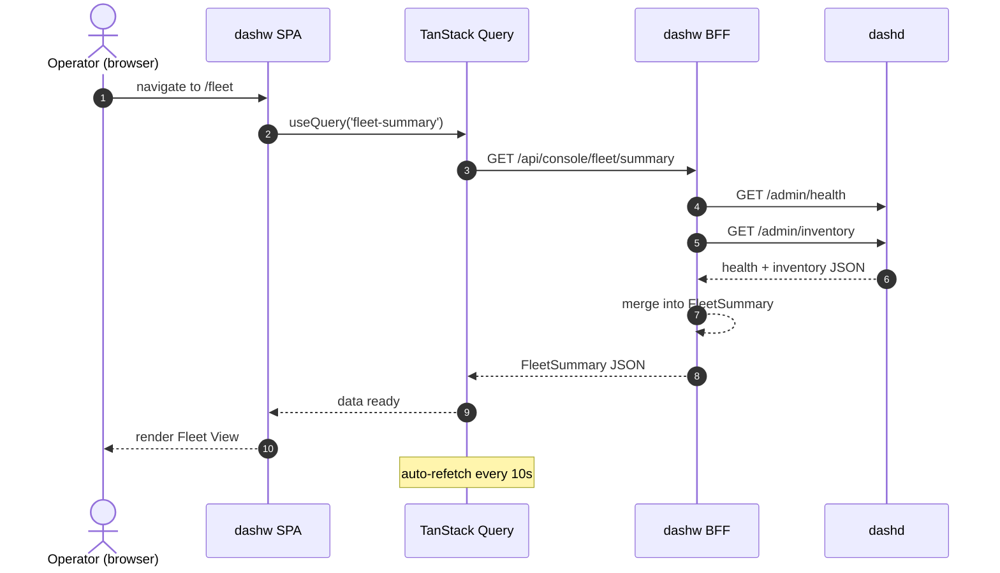
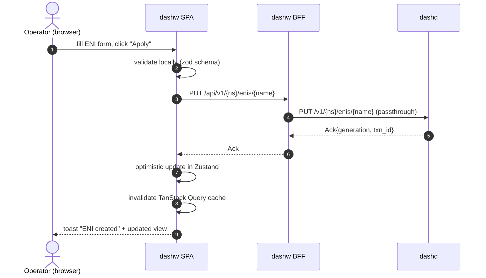
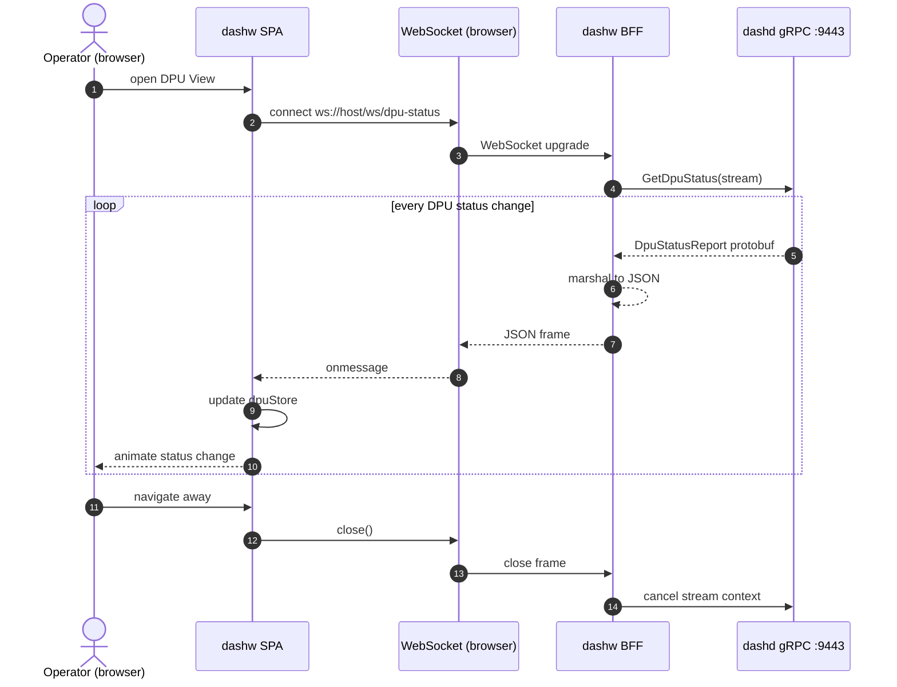

# High-Level Design (HLD) — DashCenter Web Console (`dashw`)

> **Document scope.** This HLD specifies `dashw`, the browser-based
> visualization and management console for DashCenter. It is the
> graphical counterpart to `dashctl`: a single-page application (SPA)
> served by a Go backend-for-frontend (BFF) that provides operators,
> SREs, and network architects with real-time fleet visibility,
> topology visualization, policy management, flow tracing, and
> administrative operations — all through a modern, interactive UI.
>
> **Companion LLD.** Module-by-module interfaces, component hierarchy,
> API contracts, WebSocket protocols, state management, and test plan
> are in [`specs/LLD/dashw-web-lld.md`](../LLD/dashw-web-lld.md).
>
> **Implementation plan.** Three-phase delivery (REST-only → gRPC
> streaming → diagnostics/advanced) is tracked in
> [`specs/Impl-Plan/dashw-web-impl-plan.md`](../Impl-Plan/dashw-web-impl-plan.md).

---

## Table of contents

1. [Executive summary](#1-executive-summary)
2. [Goals & non-goals](#2-goals--non-goals)
3. [System context](#3-system-context)
4. [Design principles](#4-design-principles)
5. [Architecture overview](#5-architecture-overview)
6. [View catalog](#6-view-catalog)
7. [Data freshness model](#7-data-freshness-model)
8. [Real-time strategy: REST polling → WebSocket → gRPC streams](#8-real-time-strategy-rest-polling--websocket--grpc-streams)
9. [Visual design language](#9-visual-design-language)
10. [Authentication & authorization](#10-authentication--authorization)
11. [Error handling & resilience](#11-error-handling--resilience)
12. [Deployment model](#12-deployment-model)
13. [Performance budgets](#13-performance-budgets)
14. [Observability](#14-observability)
15. [Versioning & compatibility](#15-versioning--compatibility)
16. [Out of scope](#16-out-of-scope)

---

## 1. Executive summary

`dashw` is the **operator's visual interface** to a DashCenter cluster.
It is to `dashd` what a cloud portal is to an API: a real-time,
interactive single-page application that:

- **visualizes the entire DPU fleet** — health, capacity, ENI placement,
  packet statistics — in an interactive topology graph,
- provides **13 purpose-built views** (Dashboard, Fleet, DPU, Vnet,
  Routing, Tunnel, Policy, Flow Trace, Audit Log, Health, Admin Ops,
  Command View, Debug) covering every operator workflow,
- streams **real-time data** via WebSocket bridges to dashd's gRPC
  server-streaming RPCs (DPU status, flow tables, events, counters,
  audit log, drain progress, migration sessions),
- offers **full CRUD admin operations** — create ENIs, associate Vnets,
  set ACL/route policies, apply configurations, trigger reconciliation —
  through guided, form-based UIs,
- exposes **every `dashctl` command** in a visual Command View with
  description, parameter construction UI, and one-click execution,
- renders **animated flow trace visualizations** showing packet
  transposition through the policy pipeline (ACL → route → mapping →
  tunnel encap/decap),
- is served as a **single Go binary** — the BFF embeds the SPA assets
  via `go:embed`, proxies dashd APIs, bridges gRPC streams to
  WebSockets, and requires **zero external dependencies** (no database,
  no Redis, no separate web server).

The console carries no control-plane logic. dashd is the single source
of truth. The BFF is a stateless proxy/aggregator; the SPA is a
rendering layer.

---

## 2. Goals & non-goals

### Goals

| Goal | Why |
|---|---|
| **Complete fleet visibility in one screen** | Operators should see every DPU, its health, capacity, and ENI distribution at a glance. |
| **Real-time streaming for operational awareness** | DPU status changes, flow table updates, policy events, and audit entries must appear within seconds, not on manual refresh. |
| **Production-grade admin operations** | Create/update/delete every DashCenter resource (Vnet, ENI, VnetMapping, AclPolicy, RoutePolicy, HaSet, ServiceTunnel) through guided forms with validation. |
| **Interactive flow tracing** | Operators can simulate outbound/inbound flows and watch animated packet transposition through the policy pipeline. |
| **`dashctl` command parity** | Every CLI command is discoverable, parameterizable, and executable from the browser — lowering the barrier for operators unfamiliar with CLI. |
| **Single-binary deployment** | `docker run dashw` and open `http://localhost:8080`. No infra dependencies beyond dashd. |
| **Modern, accessible, performant UI** | Dark network theme, glass morphism cards, responsive layout, keyboard navigation, WCAG 2.1 AA compliance. |
| **Phased delivery aligned with dashd** | Phase A works against dashd REST today; Phase B adds real-time as dashd gRPC streams land; Phase C adds diagnostics. |

### Non-goals (explicit)

- **dashw is not a control plane.** It never holds state, runs
  reconcilers, or talks `dashapi.v1` directly to DPU agents.
- **dashw is not a GitOps engine.** It is an interactive console; GitOps
  reconciliation loops are a downstream concern.
- **dashw does not replace dashctl.** CLI remains the primary interface
  for CI/CD, scripting, and power users. dashw is the visual complement.
- **dashw does not provide multi-cluster federation.** Each console
  instance targets a single dashd cluster. Multi-cluster dashboards are
  post-v1.
- **dashw does not persist data.** No database, no session store. All
  state comes from dashd; client state lives in browser memory (Zustand).
- **dashw does not implement RBAC.** Authorization enforcement is
  dashd's responsibility. dashw carries credentials and surfaces
  permission errors clearly.

---

## 3. System context

```
                ┌──────────────────────────────────────────────────────────┐
                │              Operator's Browser                          │
                │  ┌────────────────────────────────────────────────────┐  │
                │  │            dashw SPA (React)                       │  │
                │  │  Dashboard · Fleet · DPU · Vnet · Routing ·       │  │
                │  │  Tunnel · Policy · FlowTrace · Audit · Health ·   │  │
                │  │  AdminOps · CommandView · Debug                    │  │
                │  └──────────────┬───────────────┬────────────────────┘  │
                └─────────────────┼───────────────┼────────────────────────┘
                           REST   │         WebSocket│
                                  │               │
                ┌─────────────────┼───────────────┼────────────────────────┐
                │            dashw BFF (Go)        │                        │
                │  ┌──────────────┴───────────────┴────────────────────┐  │
                │  │   go:embed SPA   │  REST proxy  │  WS↔gRPC bridge │  │
                │  │   :8080 serve    │  aggregation │  stream fan-out  │  │
                │  └──────────────┬───┴──────┬───────┴──────┬──────────┘  │
                └─────────────────┼──────────┼──────────────┼──────────────┘
                                  │          │              │
                    REST :8443    │          │ Admin :7443  │ gRPC :9443
                                  ▼          ▼              ▼
                ┌──────────────────────────────────────────────────────────┐
                │                         dashd                            │
                │  ControlPlane · Observability · Operations ·             │
                │  Diagnostics · HaService · MigrationService              │
                └────────────────────────┬─────────────────────────────────┘
                                         │ dashapi.v1 (south)
                                         ▼
                                  fleet of DPU agents
```

**Key relationships:**

| Component | Role | Statefulness |
|---|---|---|
| **SPA** | Renders views, manages client-side state (Zustand), makes REST calls and holds WebSocket connections to BFF | Ephemeral (browser memory only) |
| **BFF** | Serves SPA, proxies REST, aggregates multi-endpoint data, bridges gRPC streams → WebSocket | Stateless (no database, no sessions) |
| **dashd** | Source of truth for all fleet state, policy, and operational data | Stateful (etcd-backed) |
| **DPU agents** | Southbound; never contacted by dashw | n/a |

---

## 4. Design principles

| Principle | Implication |
|---|---|
| **dashd is the single source of truth** | The BFF never caches mutably. Reads are passthrough or short-TTL aggregations. Writes are proxied 1:1 to dashd. |
| **Stateless BFF, zero infra** | No database, no Redis, no message queue. The BFF is a Go binary with `go:embed`. Horizontal scaling (if needed) is trivially safe. |
| **Progressive enhancement** | Phase A works with REST-only polling; Phase B upgrades to real-time WebSockets; Phase C adds diagnostics. Each phase is independently valuable. |
| **Optimistic UI with server reconciliation** | Mutations show optimistic state immediately, then reconcile against dashd's response. Conflicts surface as toast notifications. |
| **Real-time by default** | Any data that can stream (DPU status, events, flows, counters) should stream. Polling is a fallback, not the primary strategy. |
| **Mobile-responsive but desktop-first** | Primary viewport is 1440px+. Responsive breakpoints at 1024px and 768px degrade gracefully (hide topology, stack panels). |
| **Accessible** | WCAG 2.1 AA: contrast ratios, keyboard navigation, screen-reader labels, focus management, `prefers-reduced-motion` support. |
| **Type-safe end-to-end** | TypeScript strict mode in the SPA; Go typed structs in the BFF; proto-generated types where possible. |
| **Component isolation** | Each view is a lazy-loaded route module. Shared state is in Zustand stores; shared UI is in a component library. No god components. |

---

## 5. Architecture overview

### 5.1 BFF (Go backend-for-frontend)

The BFF is a single Go binary located at `src/impl-go/console/`.

```
┌────────────────────────────────────────────────────────────────────┐
│                       dashw BFF (Go)                               │
│                                                                    │
│  ┌─────────────────────────────────────────────────────────────┐  │
│  │  HTTP Router (chi or stdlib mux)                            │  │
│  │                                                             │  │
│  │  GET  /                      → go:embed SPA index.html      │  │
│  │  GET  /assets/*              → go:embed SPA static assets   │  │
│  │                                                             │  │
│  │  ── REST Proxy Layer ──────────────────────────────────────  │  │
│  │  ALL  /api/v1/*              → reverse-proxy → dashd :8443  │  │
│  │  ALL  /api/admin/*           → reverse-proxy → dashd :7443  │  │
│  │  ALL  /api/sim/{id}/admin/*  → reverse-proxy → dash-sim     │  │
│  │                                                             │  │
│  │  ── Aggregation Layer ─────────────────────────────────────  │  │
│  │  GET  /api/console/fleet/summary      → fan-out + merge     │  │
│  │  GET  /api/console/dpu/{id}/detail    → fan-out + merge     │  │
│  │  GET  /api/console/topology           → compute graph       │  │
│  │  GET  /api/console/vnet/{name}/detail → fan-out + merge     │  │
│  │  GET  /api/console/stats/capacity     → aggregate capacity  │  │
│  │                                                             │  │
│  │  ── WebSocket Bridge Layer ────────────────────────────────  │  │
│  │  WS   /ws/dpu-status         → gRPC GetDpuStatus stream    │  │
│  │  WS   /ws/events             → gRPC WatchEvents stream     │  │
│  │  WS   /ws/flows/{dpuId}      → gRPC GetFlowList stream     │  │
│  │  WS   /ws/counters/{dpuId}   → gRPC GetCounters stream     │  │
│  │  WS   /ws/audit              → gRPC GetAuditLog stream     │  │
│  │  WS   /ws/drain/{dpuId}      → gRPC DrainDpu stream        │  │
│  │  WS   /ws/migration/{sessId} → gRPC StreamMigrationSession │  │
│  │  WS   /ws/ha-events          → gRPC WatchHaEvents stream   │  │
│  │  WS   /ws/acl-hits/{eniName} → gRPC GetAclHitStats stream  │  │
│  └─────────────────────────────────────────────────────────────┘  │
│                                                                    │
│  Config: DASHD_REST_ADDR, DASHD_GRPC_ADDR, DASHD_ADMIN_ADDR       │
│  Default: :8080                                                    │
└────────────────────────────────────────────────────────────────────┘
```

**Responsibilities:**

1. **Static asset serving** — `go:embed` the built SPA; serve `index.html`
   for all non-API paths (SPA client-side routing).
2. **REST proxying** — transparent reverse-proxy to dashd REST (`:8443`)
   and Admin (`:7443`). No transformation; headers and status codes pass
   through.
3. **Aggregation** — composite endpoints that fan out to multiple dashd
   APIs, merge results, and return a pre-computed view model (e.g., fleet
   summary = health + inventory + capacity).
4. **WebSocket ↔ gRPC bridging** — upgrade HTTP to WebSocket on the
   browser side; open a gRPC server-stream on the dashd side; pump
   messages bidirectionally as JSON frames.
5. **Health** — `GET /healthz` returns BFF health (dashd connectivity check).

### 5.2 SPA (React frontend)

The SPA is located at `src/impl-web/console/`.

```
┌────────────────────────────────────────────────────────────────────┐
│                     dashw SPA (React 18 + TypeScript)              │
│                                                                    │
│  ┌──────────────┐  ┌──────────────┐  ┌──────────────────────────┐ │
│  │  App Shell   │  │  Router      │  │  Global Stores (Zustand) │ │
│  │  (Layout,    │  │  (React      │  │  ┌─ fleetStore          │ │
│  │   Sidebar,   │  │   Router v6) │  │  ├─ dpuStore            │ │
│  │   TopBar,    │  │              │  │  ├─ vnetStore           │ │
│  │   Toasts)    │  │              │  │  ├─ policyStore         │ │
│  │              │  │              │  │  ├─ eventStore          │ │
│  └──────┬───────┘  └──────┬───────┘  │  ├─ wsConnectionStore  │ │
│         │                 │          │  └─ uiPrefsStore        │ │
│         ▼                 ▼          └──────────────────────────┘ │
│  ┌────────────────────────────────────────────────────────────┐   │
│  │                    View Modules (lazy-loaded)              │   │
│  │                                                            │   │
│  │  Dashboard · Fleet · DPU · Vnet · Routing · Tunnel ·      │   │
│  │  Policy · FlowTrace · AuditLog · Health · AdminOps ·      │   │
│  │  CommandView · Debug                                       │   │
│  └────────────────────────────────────────────────────────────┘   │
│                                                                    │
│  ┌────────────────────────────────────────────────────────────┐   │
│  │              Shared Component Library                      │   │
│  │  TopologyGraph (React Flow) · StatsCard · CapacityGauge · │   │
│  │  DataTable · PolicyTree · FlowAnimator · SparklineChart ·  │   │
│  │  StatusBadge · GlassCard · CommandBuilder · AceEditor      │   │
│  └────────────────────────────────────────────────────────────┘   │
│                                                                    │
│  ┌────────────────────────────────────────────────────────────┐   │
│  │              Data Layer                                    │   │
│  │  TanStack Query v5 (server state) · WebSocket hooks ·     │   │
│  │  API client (typed fetch wrappers) · Error boundary        │   │
│  └────────────────────────────────────────────────────────────┘   │
│                                                                    │
│  Stack: Vite 5 · TailwindCSS v4 · shadcn/ui · React Flow ·       │
│         Recharts · Framer Motion · D3.js (prefix trees)           │
└────────────────────────────────────────────────────────────────────┘
```

### 5.3 Request lifecycle — read path



### 5.4 Request lifecycle — write path



### 5.5 Request lifecycle — real-time stream (Phase B)



---

## 6. View catalog

### 6.1 Dashboard (home)

The landing page providing a fleet-wide executive summary.

| Panel | Data source | Refresh |
|---|---|---|
| Fleet health donut (healthy/degraded/offline) | `GET /admin/health` | Poll 10s |
| Total DPU count + ENI count + Vnet count | `GET /admin/inventory` + kind counts | Poll 15s |
| Capacity utilization gauges (ENIs, routes, ACLs, flows) | Aggregated `DpuCapacityUsage` | Poll 10s |
| Recent events timeline (last 20) | `WS /ws/events` (Phase B) or poll | Stream / Poll 5s |
| Alert banner (drifted DPUs, offline DPUs) | `GET /admin/health` | Poll 10s |
| Mini topology (top-level DPU nodes, health-colored) | `GET /api/console/topology` | Poll 30s |

### 6.2 Fleet View

Full fleet inventory with interactive topology graph.

| Panel | Description |
|---|---|
| **Topology graph** (React Flow) | DPU nodes (colored by health state), Vnet nodes, ENI nodes nested under DPUs. Interactive: zoom, pan, click-to-inspect. Edges show ENI-to-Vnet associations. |
| **Fleet data table** | Sortable, filterable table of all DPUs: ID, state, IP, capacity %, ENI count, last-seen. Click row → navigate to DPU View. |
| **Vnet summary cards** | Grid of glass cards showing each Vnet: name, VNI, ENI count, DPU spread. Click → Vnet View. |
| **Filters** | Sidebar filters: health state, namespace, labels. Applied to both graph and table. |

### 6.3 DPU View

Deep-dive into a single DPU.

| Panel | Description |
|---|---|
| **Header** | DPU ID, state badge (pulsing green/amber/red), underlay IP, last-seen. |
| **ENI pipes** | Visual representation of each ENI as a colored "pipe" with MAC address, Vnet association, admin state. Animated flow particles when live. |
| **Capacity gauges** | Four radial gauges: ENIs used/max, routes, ACL rules, flows. |
| **Packet stats** | Sparkline charts (Recharts) for packets/sec, bytes/sec, drops per ENI. Real-time via `WS /ws/counters/{dpuId}` (Phase B). |
| **Drift indicator** | Badge showing drift count; expand to see `DriftItem` list with kind, target, and mismatch detail. Source: `GET /admin/drift?dpu={id}`. |
| **Policy summary** | Accordion listing AclPolicies and RoutePolicies applied to this DPU's ENIs. |
| **Flow table** | Paginated, sortable table of active flows (`WS /ws/flows/{dpuId}` in Phase B, `GET /admin/observed?dpu={id}` in Phase A). Columns: src, dst, proto, port, direction, action, age, pkts, bytes. |

### 6.4 Vnet View

Vnet-centric perspective.

| Panel | Description |
|---|---|
| **Header** | Vnet name, VNI, namespace, GUID, labels. |
| **DPU + ENI topology** | Sub-graph showing all DPUs hosting ENIs in this Vnet, with ENI nodes and capacity annotations. |
| **ENI list** | Table of ENIs in this Vnet: name, MAC, underlay IP, DPU placement, admin state. |
| **Vnet mappings** | Table of VnetMappingSpecs: src IP → dst IP, MAC, action, params. |
| **Route policies** | Tree view of RoutePolicySpecs associated with this Vnet: prefix → next-hop type → target. |
| **Tunnel endpoints** | List of ServiceTunnelSpecs with local/remote underlay IPs and VNIs. |

### 6.5 Routing View

Route table visualization.

| Panel | Description |
|---|---|
| **Prefix tree** (D3.js) | Interactive radix/prefix tree visualization of all routes. Nodes sized by prefix length; colored by next-hop type (vnet=cyan, service_tunnel=amber, direct=green, drop=red). Click node → expand. |
| **Route table** | Flat table: prefix, next-hop type, target, ECMP members, Vnet association. Sortable, filterable. |
| **DPU + Vnet + ENI association** | For a selected route, show which DPUs, Vnets, and ENIs are affected. |

### 6.6 Tunnel View

Overlay/underlay tunnel visualization.

| Panel | Description |
|---|---|
| **Tunnel map** | Visual representation of ServiceTunnels: local ↔ remote underlay endpoints with VNI labels. Animated data flow particles. |
| **Tunnel table** | name, local underlay IP, remote underlay IP, VNI, status. |
| **Overlay/underlay toggle** | Switch between overlay (Vnet-level) and underlay (physical IP) views. |

### 6.7 Policy View

ACL and route policy editor.

| Panel | Description |
|---|---|
| **ACL policy list** | Table: policy name, ENI, rule count, namespace. Click → expand rules. |
| **ACL rule detail** | Expandable panel: priority, action (PERMIT/DENY), src/dst CIDR, protocol, port range. Color-coded by action. |
| **Route policy list** | Table: policy name, Vnet, route count, default action. Click → expand routes. |
| **Policy diff** | Side-by-side diff when editing: current vs proposed. Syntax-highlighted. |
| **Inline edit** | Edit rules directly in the table; changes tracked as pending. "Apply" button submits all pending changes as individual PUTs. |

### 6.8 Flow Trace View

Interactive packet trace simulation.

| Panel | Description |
|---|---|
| **Trace input form** | Source IP, dest IP, protocol, src port, dst port, direction, DPU, ENI. Pre-filled from DPU/ENI context if navigated from those views. |
| **Trace button** | "Simulate Flow" → calls `POST /v1/simulate` (Phase A) or `TraceFlow` RPC (Phase C). |
| **Animated pipeline** | SVG animation showing packet traversal: **ENI ingress → ACL evaluation → route lookup → Vnet mapping → tunnel encap/decap → egress**. Each stage highlights the matched rule, with verdict (PERMIT/DENY/DROP) and matched entity details. |
| **Result panel** | Structured result: verdict, matched ACL rule (priority, action, src/dst), matched route (prefix, next-hop), matched Vnet mapping, tunnel info. |
| **History** | Last 10 traces stored in session; click to replay animation. |

### 6.9 Audit Log View

Audit trail with real-time streaming.

| Panel | Description |
|---|---|
| **Live feed** | Real-time audit entries via `WS /ws/audit` (Phase B). Each entry: timestamp, actor, RPC, target (kind/ns/name), txn_id. |
| **Filters** | Filter by: time range, actor, RPC method, target kind, namespace. |
| **Detail drawer** | Click entry → side drawer with full audit detail, including request/response summary. |
| **Export** | "Export CSV/JSON" button for filtered results. |

### 6.10 dashd Health View

Operational health of the dashd cluster itself.

| Panel | Description |
|---|---|
| **Leader status** | Current leader node, election state, uptime. Source: `GET /admin/leader`. |
| **Cluster health** | Overall cluster health, per-node DPU state summary. Source: `GET /admin/health`. |
| **Connected DPUs** | Table of DPUs with connection state (connected/disconnected/unknown), last heartbeat. |
| **Reconciliation status** | Last reconcile time, pending reconcile count. |

### 6.11 Admin Operations View

Guided CRUD operations for all DashCenter resources.

| Panel | Description |
|---|---|
| **Resource type selector** | Dropdown: Vnet, ENI, VnetMapping, AclPolicy, RoutePolicy, HaSet, ServiceTunnel, Inventory. |
| **Create form** | Dynamic form generated from resource schema. Field-level validation (zod). Namespace selector, name input, spec fields with appropriate input types (text, IP input, MAC input, dropdown, multi-select). |
| **Edit mode** | Load existing resource → pre-fill form → edit → "Apply Changes". Shows diff preview before submission. |
| **Delete** | Confirmation dialog with resource name echo. |
| **Batch operations** | Upload YAML/JSON manifest (multi-doc). Parse, preview, and apply all resources. |
| **Reconcile** | "Force Reconcile" button → `POST /v1/reconcile` with optional DPU filter. |
| **Result** | Success/failure toast with txn_id, generation, and link to the resource view. |

### 6.12 Command View

Visual interface to every `dashctl` command.

| Panel | Description |
|---|---|
| **Command catalog** | Left sidebar listing all dashctl commands grouped by category (CRUD, DPU ops, HA, migration, diagnostics, debug). Search + filter. |
| **Command detail** | Selected command shows: description, synopsis, flags with types and defaults, examples. |
| **Parameter builder** | Interactive form to construct command arguments: flag inputs, file upload for `-f`, namespace selector, kind selector. Builds the full command string in real-time. |
| **Command preview** | Read-only code block showing the exact `dashctl ...` command that would be executed. Copy-to-clipboard button. |
| **Execute button** | Sends the equivalent REST/gRPC call through the BFF. Displays result in an output panel (formatted as table/JSON/YAML based on user preference). |
| **Output panel** | Syntax-highlighted output. For streaming commands, output appends in real-time. |

### 6.13 Debug View

Raw protocol escape hatch for advanced operators.

| Panel | Description |
|---|---|
| **Raw API caller** | Method selector (GET/PUT/POST/DELETE), URL input, JSON body editor (Monaco/Ace), headers editor. Send button. Response panel with status, headers, formatted body. |
| **dashd admin endpoints** | Quick-access buttons for all `/admin/*` endpoints. One-click to fetch and display results. |
| **dash-sim inspector** | Per-simulator panel: select sim by ID → `/admin/dump`, `/admin/kinds`, `/admin/faults`, `/admin/health`. |
| **WebSocket tester** | Connect to any `WS /ws/*` endpoint. Display raw JSON frames in a scrolling log. Send custom messages. |

---

## 7. Data freshness model

| Category | Mechanism | Interval | Examples |
|---|---|---|---|
| **Real-time (streaming)** | WebSocket ↔ gRPC stream | Continuous | DPU status, flows, events, audit, counters, drain, migration |
| **Near-real-time (fast poll)** | TanStack Query refetch | 5–10s | Drift, fleet summary, dashboard alerts |
| **Background (slow poll)** | TanStack Query refetch | 15–30s | ENI placement, Vnet/ENI catalog, dashd health, topology |
| **On-demand** | User action | Click/submit | Admin ops, flow trace, reconcile, command execution |
| **Static** | Embedded/cached | App load | Command catalog, schema definitions, help text |

### Staleness handling

- TanStack Query `staleTime`: 5s for fast-poll, 15s for slow-poll.
- `gcTime` (garbage collection): 5 minutes for all queries.
- Background refetch on window focus: enabled.
- Manual invalidation: after any mutation, related queries are invalidated.
- Stale indicators: subtle "last updated Xs ago" on each panel header.

---

## 8. Real-time strategy: REST polling → WebSocket → gRPC streams

### Phase A — REST polling only

All data comes from dashd REST `:8443` and Admin `:7443` endpoints via
the BFF proxy. TanStack Query manages polling intervals. No WebSocket,
no gRPC.

### Phase B — WebSocket ↔ gRPC bridge

The BFF opens gRPC server-streams to dashd `:9443` and bridges them to
WebSocket connections from the browser. The SPA connects via native
`WebSocket` API, wrapped in React hooks with auto-reconnect.

**WebSocket protocol:**

```
Browser → BFF:  WebSocket upgrade at /ws/{stream-name}
BFF → dashd:    gRPC server-stream RPC
dashd → BFF:    protobuf message
BFF → Browser:  JSON frame: { "type": "...", "data": {...}, "seq": N }
```

Frame envelope:
```json
{
  "type": "dpu_status" | "event" | "flow" | "counter" | "audit" | ...,
  "data": { /* proto-to-JSON */ },
  "seq": 42,
  "timestamp": "2026-06-10T12:00:00Z"
}
```

**Reconnection:** Exponential backoff (1s → 30s, jittered). On reconnect,
the stream restarts from the server's current state (no resumption token
in v1; full snapshot on reconnect).

### Phase C — Advanced diagnostics

Adds `TraceFlow`, `ExplainMatch`, `ExplainDrift`, `GetAclHitStats` streaming,
`TriggerResimulation`, and full HA/Migration stream UIs.

---

## 9. Visual design language

### 9.1 Theme: "Network Dark"

| Token | Value | Usage |
|---|---|---|
| `--bg-primary` | `#0A0E1A` | Page background |
| `--bg-surface` | `#111827` | Card/panel background |
| `--bg-elevated` | `#1F2937` | Hover states, elevated panels |
| `--border` | `#374151` | Card borders, dividers |
| `--text-primary` | `#F9FAFB` | Primary text |
| `--text-secondary` | `#9CA3AF` | Secondary/muted text |
| `--accent-cyan` | `#00D4FF` | Primary accent, links, active states |
| `--accent-green` | `#00FF88` | Success, healthy, permit |
| `--accent-amber` | `#FFB800` | Warning, degraded |
| `--accent-red` | `#FF3860` | Error, critical, deny/drop |
| `--accent-purple` | `#A855F7` | HA/migration, special operations |

### 9.2 Typography

| Role | Font | Weight | Size |
|---|---|---|---|
| UI text | Inter | 400/500/600 | 14px base |
| Headings | Inter | 700 | 18–32px |
| Code/IPs/MACs | JetBrains Mono | 400 | 13px |
| Metrics/numbers | JetBrains Mono | 500 | 14–24px |

### 9.3 Component patterns

| Pattern | Description |
|---|---|
| **Glass cards** | Semi-transparent cards with `backdrop-blur-xl`, subtle border glow on hover. Used for all stat panels and summaries. |
| **Pulsing status indicators** | Circular dots with CSS pulse animation. Green = healthy, amber = degraded (slow pulse), red = offline (fast pulse). |
| **Animated topology** | React Flow with custom node renderers. DPU nodes as hexagons, ENI nodes as rounded rectangles, Vnet nodes as circles. Animated edges on data flow. |
| **Sparkline charts** | Inline mini-charts (Recharts) in table cells and cards. Cyan stroke, no axes. 60-sample rolling window. |
| **Packet trace animation** | Framer Motion + SVG. Animated dot traversing the policy pipeline stages. Each stage highlights on entry, shows matched rule. |
| **Toast notifications** | Bottom-right stack. Auto-dismiss 5s (info), 10s (warning), persistent (error). Include txn_id for mutations. |
| **Data tables** | shadcn/ui DataTable with sorting, filtering, column visibility, pagination. Sticky headers. Row click → navigation or detail drawer. |
| **Command palette** | `Cmd+K` / `Ctrl+K` global search across resources, views, and commands. Fuzzy matching. |

### 9.4 Responsive breakpoints

| Breakpoint | Layout |
|---|---|
| ≥1440px | Full layout: sidebar + main + right panel |
| 1024–1439px | Sidebar collapses to icons; right panel overlays as drawer |
| 768–1023px | Top nav replaces sidebar; topology hidden; tables stack |
| <768px | Single column; limited functionality (view-only, no admin ops) |

---

## 10. Authentication & authorization

| Concern | Approach |
|---|---|
| **BFF → dashd auth** | BFF connects to dashd using configured credentials (token, mTLS). Configured via environment variables: `DASHD_AUTH_TOKEN`, `DASHD_TLS_CERT`, `DASHD_TLS_KEY`, `DASHD_TLS_CA`. |
| **Browser → BFF auth** | Phase A: none (localhost dev). Phase B+: optional token-based auth (`Authorization: Bearer` header, stored in `httpOnly` cookie after login). |
| **RBAC** | Enforced by dashd. BFF passes credentials through. SPA surfaces `403 Forbidden` as user-friendly "Permission Denied" toast with the denied operation name. |
| **Credential storage** | No credentials stored in BFF memory or disk. Tokens are per-request passthrough. |

---

## 11. Error handling & resilience

### 11.1 BFF error handling

| Scenario | Behavior |
|---|---|
| dashd REST unreachable | Return `502 Bad Gateway` with `{"error": "dashd unreachable", "detail": "..."}`. |
| dashd returns 4xx/5xx | Pass through status code and body unchanged. |
| gRPC stream disconnect | Log warning, attempt reconnect with backoff. WebSocket clients receive `{"type": "error", "data": {"code": "STREAM_INTERRUPTED", ...}}`. |
| BFF panic | `recover()` middleware catches panics, returns `500`, logs stack trace. |

### 11.2 SPA error handling

| Scenario | Behavior |
|---|---|
| API call fails | TanStack Query retry (3x with exponential backoff). If all fail, show inline error state with "Retry" button. |
| WebSocket disconnect | Auto-reconnect (1s → 30s backoff). Connection status indicator in header bar (green dot = connected, red = disconnected). |
| Render crash | React Error Boundary per view module. Crashed view shows error card with stack trace (dev) or "Something went wrong" + reload button (prod). |
| Validation error (4xx) | Field-level error highlighting in forms. Toast with server validation message. |
| Permission denied (403) | Disable the action button, show tooltip "Insufficient permissions". Toast on unexpected 403. |

---

## 12. Deployment model

### 12.1 Single-binary deployment

```bash
# Build
cd src/impl-web/console && npm run build     # produces dist/
cd src/impl-go/console  && go build -o dashw  # embeds dist/ via go:embed

# Run
./dashw --dashd-rest=http://localhost:8443 \
        --dashd-grpc=localhost:9443 \
        --dashd-admin=http://localhost:7443 \
        --listen=:8080
```

### 12.2 Docker Compose (development)

```yaml
services:
  console:
    build: src/impl-go/console
    ports: ["8080:8080"]
    environment:
      DASHD_REST_ADDR: http://dashd:8443
      DASHD_GRPC_ADDR: dashd:9443
      DASHD_ADMIN_ADDR: http://dashd:7443
    depends_on: [dashd]

  dashd:
    build: src/impl-go/dashd
    ports: ["8443:8443", "9443:9443", "7443:7443"]

  sim-1:
    build: src/impl-go/dash-sim
    environment: { DPU_ID: "dpu-sim-01" }
  sim-2:
    build: src/impl-go/dash-sim
    environment: { DPU_ID: "dpu-sim-02" }
  sim-3:
    build: src/impl-go/dash-sim
    environment: { DPU_ID: "dpu-sim-03" }
  sim-4:
    build: src/impl-go/dash-sim
    environment: { DPU_ID: "dpu-sim-04" }
  sim-5:
    build: src/impl-go/dash-sim
    environment: { DPU_ID: "dpu-sim-05" }
```

Access: `http://localhost:8080`

### 12.3 Container image

| Artifact | Description |
|---|---|
| `ghcr.io/<org>/dashw:<version>` | Distroless multi-arch image (linux/amd64, linux/arm64) |
| Build | Multi-stage: Node 20 (SPA build) → Go 1.22 (BFF build) → distroless (runtime) |
| Size target | < 50MB compressed |

---

## 13. Performance budgets

| Metric | Target | Measurement |
|---|---|---|
| **Initial load (LCP)** | < 2.0s on 4G | Lighthouse CI |
| **Time to interactive (TTI)** | < 3.0s on 4G | Lighthouse CI |
| **JS bundle (gzipped)** | < 500KB initial, < 200KB per lazy chunk | Vite bundle analyzer |
| **API response (proxy)** | < 50ms overhead over dashd latency | BFF request tracing |
| **WebSocket frame latency** | < 100ms from dashd gRPC to browser | End-to-end trace |
| **Memory (SPA)** | < 150MB with 100 DPUs, 1000 ENIs | Chrome DevTools |
| **Memory (BFF)** | < 100MB with 50 concurrent WebSocket connections | Go pprof |
| **Topology render** | < 500ms for 100 DPU + 500 ENI graph | React Flow profiling |
| **Table render** | < 200ms for 1000-row table with virtualization | React profiling |

---

## 14. Observability

| Layer | Mechanism |
|---|---|
| **BFF structured logging** | `slog` (Go stdlib) with JSON output. Log levels: debug, info, warn, error. Fields: request_id, method, path, status, latency, ws_connection_id. |
| **BFF health endpoint** | `GET /healthz` — checks dashd REST + gRPC connectivity. Returns `200 OK` or `503 Service Unavailable`. |
| **BFF metrics** | Optional Prometheus endpoint at `/metrics` (request count, latency histograms, WebSocket connection count, gRPC stream count). |
| **SPA error tracking** | Console errors + React Error Boundary reporting. Optional integration point for external error tracking (Sentry, Application Insights). |
| **SPA performance** | Web Vitals reporting (LCP, FID, CLS). Optional beacon to BFF `/api/console/telemetry`. |

---

## 15. Versioning & compatibility

- **SPA + BFF versioned together** as a single release artifact. No
  independent SPA deployment.
- **dashd compatibility:** dashw v1.x targets dashd v1.x. BFF gracefully
  degrades when dashd endpoints are unavailable (feature flags disable
  corresponding UI sections).
- **API versioning:** BFF aggregation endpoints are prefixed `/api/console/`
  and versioned implicitly with the dashw release. Proxy endpoints
  (`/api/v1/*`, `/api/admin/*`) pass through dashd's versioning.
- **SPA assets:** Content-hashed filenames for cache busting. `index.html`
  has `Cache-Control: no-cache`; assets have `Cache-Control: immutable`.

---

## 16. Out of scope

- Multi-cluster federation / cross-cluster views.
- User management / RBAC configuration UI (dashd concern).
- Persistent storage / dashw-specific database.
- Offline mode / service worker caching.
- Direct DPU agent communication (`dashapi.v1` southbound).
- Mobile-native app.
- E2E testing framework in v1 (unit + integration only; E2E added post-Phase C).
- Internationalization (i18n) in v1.
- Custom dashboard builder / widget framework.
- Plugin/extension system.

---

> **End of HLD.** For the implementable detail — BFF module layout,
> React component tree, API contracts, WebSocket frame schemas,
> Zustand store shapes, TanStack Query key hierarchy, routing table,
> form validation schemas, animation specifications, and test plan — see
> [`specs/LLD/dashw-web-lld.md`](../LLD/dashw-web-lld.md).