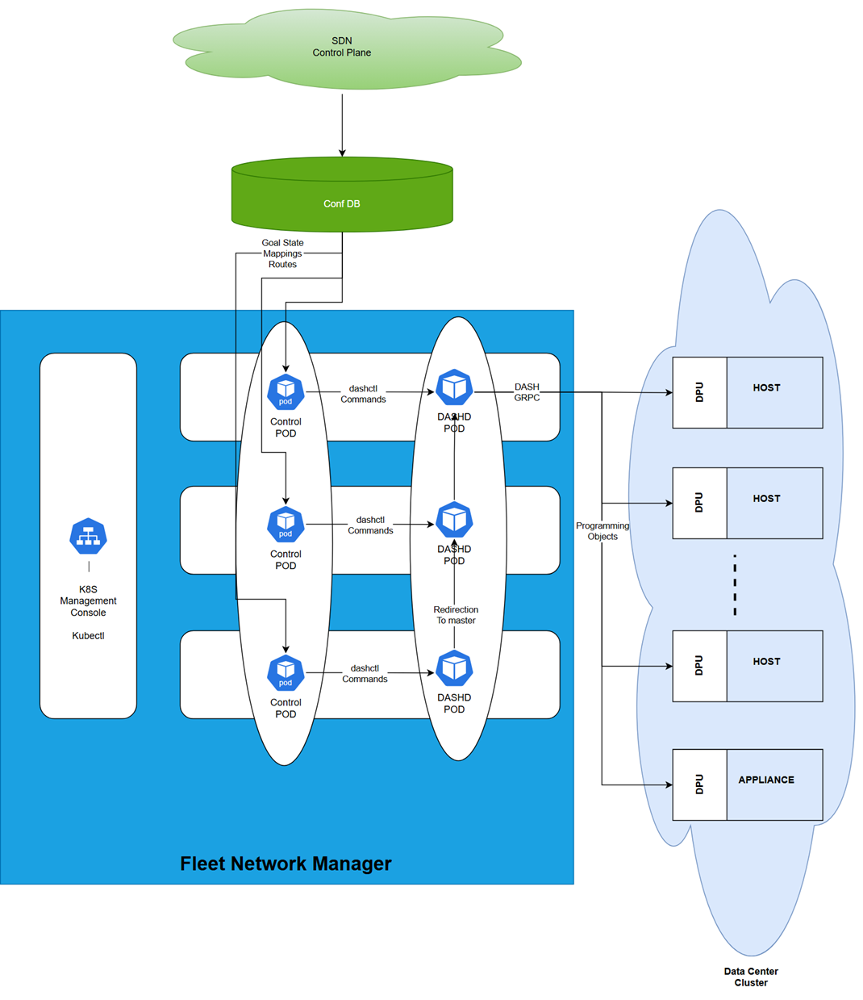
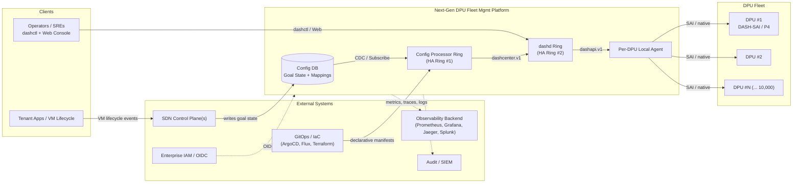
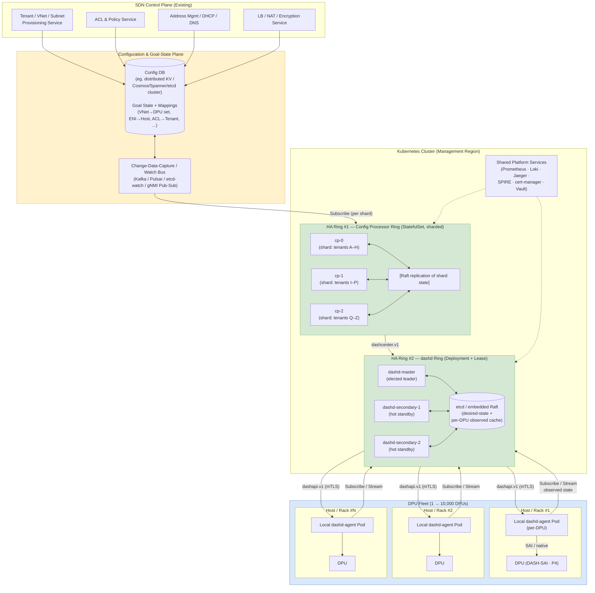
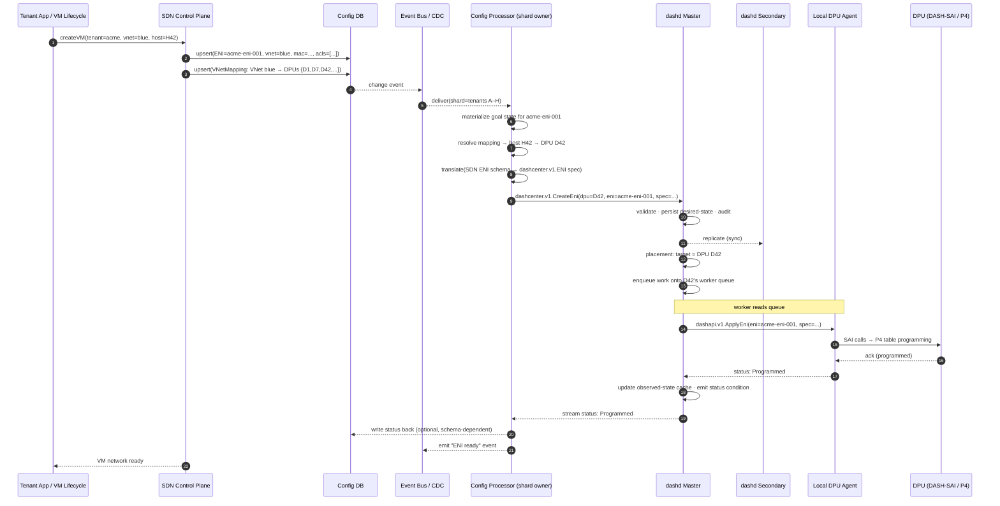
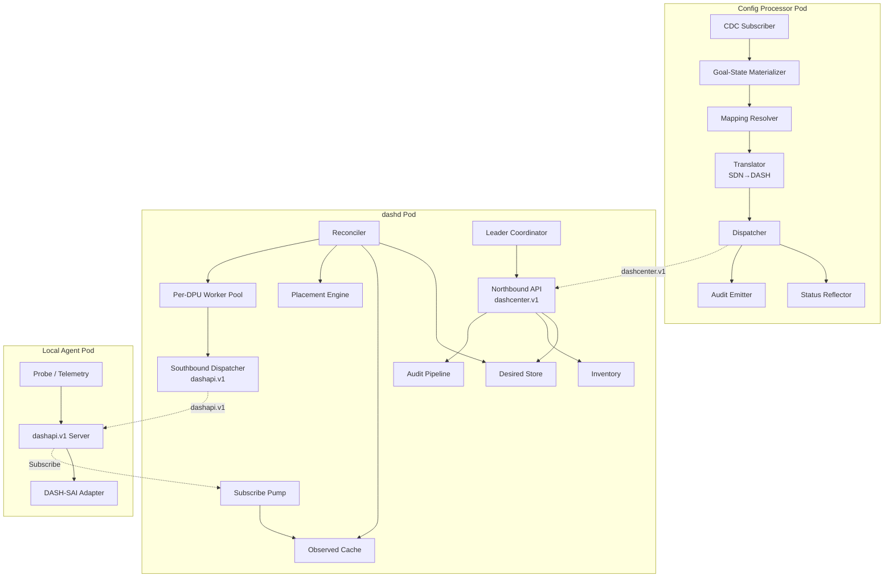
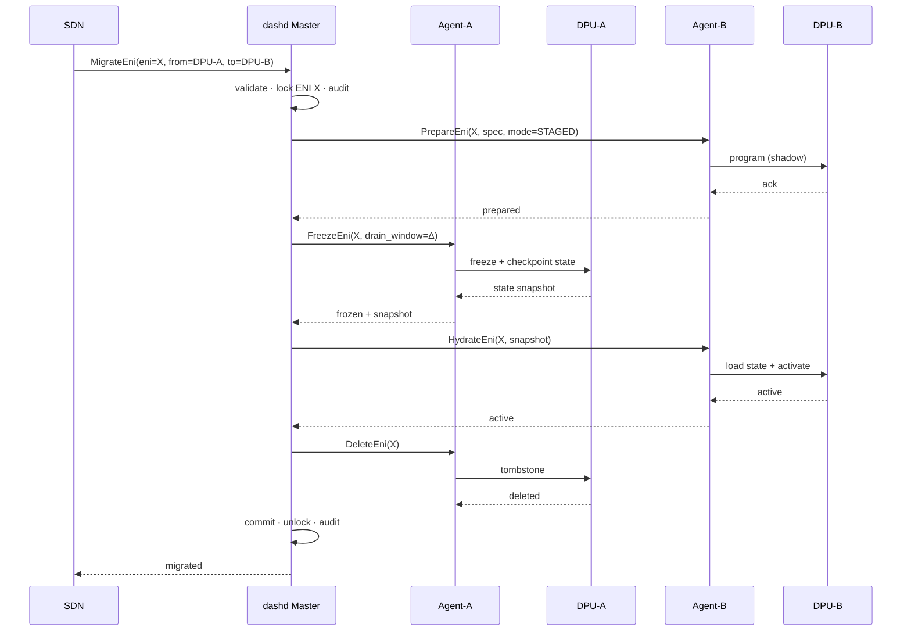

# Next-Gen DPU-Based Fleet Networking Management Platform

> **Architecture Specification — Industry-Grade Reference**
> **Codename:** *DASHCenter @ Cloud Scale*
> **Document Type:** High-Level Design (HLD) — Strategic & Architectural
> **Status:** v1.0 — Vision / North-Star Architecture
> **Audience:** Cloud architects, Network architects, Platform engineering leadership, SDN engineering, SRE/Operations leadership, Standards (OCP / OPI / DASH community) reviewers
> **Companion HLDs:** [Centralized Controller HLD](high_level_system_design.md) · [Controllerless HLD](high_level_system_design_controllerless.md) · [`dashd` Daemon HLD](dashd-hld.md) · [`dashctl` HLD](dashctl-hld.md) · [Core System Design](core_system_design.md)

---

## Table of Contents

1. [Executive Summary](#1-executive-summary)
2. [Industry Inflection — Why Now](#2-industry-inflection--why-now)
3. [Problem Statement](#3-problem-statement)
4. [Vision & Strategic Goals](#4-vision--strategic-goals)
5. [Solution Overview — The North-Star Architecture](#5-solution-overview--the-north-star-architecture)
6. [Architectural Principles](#6-architectural-principles)
7. [System Context & Stakeholders](#7-system-context--stakeholders)
8. [High-Level System Architecture](#8-high-level-system-architecture)
9. [The Two HA Rings — Detailed View](#9-the-two-ha-rings--detailed-view)
10. [End-to-End Provisioning Flow](#10-end-to-end-provisioning-flow)
11. [Component Architecture](#11-component-architecture)
12. [Data Model & Goal-State Semantics](#12-data-model--goal-state-semantics)
13. [Reconciliation Engine](#13-reconciliation-engine)
14. [High Availability, Consistency & Fault Tolerance](#14-high-availability-consistency--fault-tolerance)
15. [Scalability Model — From 10 to 10,000 DPUs](#15-scalability-model--from-10-to-10000-dpus)
16. [Multi-Tenancy & Tenant Isolation](#16-multi-tenancy--tenant-isolation)
17. [Security Model — Zero-Trust by Default](#17-security-model--zero-trust-by-default)
18. [Observability, SRE & Day-2 Operations](#18-observability-sre--day-2-operations)
19. [ENI Live-Mobility & Workload Migration](#19-eni-live-mobility--workload-migration)
20. [API Surface, SDKs & Ecosystem](#20-api-surface-sdks--ecosystem)
21. [Deployment Topologies](#21-deployment-topologies)
22. [Capacity Planning & Sizing](#22-capacity-planning--sizing)
23. [Failure Mode Analysis (FMA)](#23-failure-mode-analysis-fma)
24. [Industry Comparison & Differentiation](#24-industry-comparison--differentiation)
25. [Roadmap & Phasing](#25-roadmap--phasing)
26. [Risks, Assumptions & Open Items](#26-risks-assumptions--open-items)
27. [Glossary](#27-glossary)

---

## 1. Executive Summary

### 1.1 The One-Paragraph Pitch

The data-center networking industry is undergoing the largest architectural shift since the rise of merchant silicon: **stateful networking, security, and storage functions are migrating off the host CPU and into a programmable Data Processing Unit (DPU) at every rack slot.** A modern hyperscale or telco-edge cluster will ship with **tens of thousands of DPUs**, each running a P4 pipeline, each holding millions of flows, ACLs, NAT mappings, encryption SAs, and tenant-specific ENIs. **No existing control plane was designed to manage a fleet of this density at this rate of change.** The **Next-Gen DPU Fleet Networking Management Platform** — built on the open **DASH (Disaggregated API for SONiC Hosts)** standard and running natively on Kubernetes — closes that gap. It delivers a **declarative, goal-state-driven, horizontally scalable control plane** that programs **any DASH-compliant DPU from any vendor**, with **sub-second failover**, **fleet-wide observability**, and **the operational ergonomics of `kubectl`**. It is the **SDN of SDNs** — the orchestration layer that an SDN northbound has been missing.

### 1.2 The Business Case in 90 Seconds

| Dimension | Today (without this platform) | Tomorrow (with this platform) | Quantified Impact |
|---|---|---|---|
| **DPU programming velocity** | Vendor-proprietary controllers, one-off scripts, per-card SSH. | Declarative gRPC API, parallel reconciliation across the fleet. | **10×–100×** faster ENI/ACL/route programming at fleet scale. |
| **Vendor lock-in** | Each silicon vendor ships its own control stack. | Single DASH-compliant API across NVIDIA BlueField, AMD Pensando, Intel IPU, Marvell Octeon, custom ASICs. | **Zero re-platforming cost** when adding a new DPU SKU. |
| **Operational headcount** | Network ops scales linearly with fleet size. | Kubernetes-native ops; fleet scales without team scaling. | **3×–5×** operator productivity (kubectl-style UX, GitOps-ready). |
| **Mean Time To Repair (MTTR)** | Operators ssh-hop across DPUs, correlate manually. | Cross-fleet drop attribution, Merkle-tree state audit, virtual packet tracer. | **MTTR cut from hours to minutes.** |
| **Customer onboarding (multi-tenant cloud)** | New tenant = manual config plumbing on every DPU touched. | Declarative tenant manifest; reconciler does the rest. | **Tenant onboarding in seconds, not days.** |
| **Failure blast radius** | A controller outage stops all provisioning. | Two independent HA rings (Config Processor + dashd) with Raft consensus; sub-second leader failover; isolated per-DPU workers. | **No single point of failure.** |
| **Compliance & audit** | Per-DPU log scraping, no fleet-wide audit trail. | Every mutation = signed gRPC call recorded in tamper-evident audit log. | **SOC 2 / FedRAMP-ready out of the box.** |
| **Future-proofing** | Tightly coupled to today's switching hardware. | Standards-based (DASH, OPI, SONiC), cloud-native, ASIC-agnostic. | **10-year architecture, not a 3-year band-aid.** |

### 1.3 What This Platform Uniquely Provides

1. **A real "Kubernetes for DPUs."** Not a metaphor — an actual Kubernetes-resident, controller-pattern, watch-driven, leader-elected control plane whose CRDs are DASH objects (ENI, VNET, ACL, Route, NAT, Meter, Flow Policy).
2. **A pluggable northbound for *any* SDN controller.** Existing SDN controllers (cloud-internal SDN, OpenStack Neutron variants, telco BNG controllers, Kubernetes CNIs) write *intent* into a Config DB; this platform handles the *fan-out, sequencing, retry, drift-detection, and per-DPU specialization.*
3. **A unified southbound across *any* DASH-compliant DPU.** Vendors compete on silicon and price-per-watt; operators stop paying the integration tax.
4. **Two HA rings, by design.** The *Config Processor Ring* is the **intent ingestion plane**; the *`dashd` Ring* is the **fleet-state plane**. They scale, fail, and upgrade independently — a deliberate separation of concerns proven at hyperscale.
5. **Industry-grade Day-2 capabilities.** Live migration of ENIs across DPUs (used during host evacuation), zero-impact firmware/policy rollouts, cross-fleet diagnostics, fleet-wide policy simulation before commit.
6. **Open from top to bottom.** Built on open standards (DASH, gRPC, Kubernetes, OpenTelemetry, OCI) and shipped under Apache-2.0. There is no proprietary lock-in at any layer.

### 1.4 Strategic Outcome

This platform turns the DPU fleet from a **collection of cards that need babysitting** into a **single, declaratively-driven, self-healing networking computer.** It is the missing layer that lets cloud providers, telcos, sovereign clouds, and large enterprises **monetize the DPU revolution** rather than be slowed down by it.

> **Bottom line:** *If you ship DPUs in production, this is the platform that makes them operable at scale. Without it, the operational cost of DPUs eventually exceeds their performance benefit. With it, every new DPU is a force multiplier.*

---

## 2. Industry Inflection — Why Now

Three industry-wide shifts converge to make this platform not merely useful, but **inevitable**:

### 2.1 The DPU/IPU Wave Is Real and Permanent

Every hyperscaler and every Tier-1 OEM is shipping DPU/IPU silicon: NVIDIA BlueField-3 / BlueField-4, AMD Pensando Salina, Intel Mount Evans / IPU E2100, Marvell Octeon 10, AWS Nitro, Microsoft Azure Boost, Google Mount Carmel. Server SKUs increasingly bundle a DPU **as standard, not optional**. By the late 2020s the assumption is "every server has a DPU" — exactly as "every server has a TPM" became true in the 2010s.

### 2.2 DASH Standardization Removes Vendor Silos

The **DASH (Disaggregated API for SONiC Hosts)** project — under the **Open Compute Project (OCP)** and the **SONiC** umbrella — defines a vendor-neutral object model and gNMI/gRPC surface for programming DPU stateful pipelines (ENIs, VNETs, ACLs, routes, NAT, encryption, metering, flow tables). DASH is to the DPU what SAI was to the switch ASIC: the **interoperability layer that unlocks an ecosystem.**

### 2.3 The Existing SDN Stack Was Not Built for This

Legacy SDN controllers — written when "the network" meant a few hundred top-of-rack switches — break down when asked to program:

* **10,000+ stateful endpoints** that change at VM-lifecycle speed,
* **millions of flow-table entries** that mutate per connection,
* **multi-tenant ACL matrices** with per-ENI specificity,
* **stateful primitives** (NAT, encryption SAs, load-balancer state) on the dataplane itself,
* **live migration** of those states between DPUs as workloads move.

The cardinality (number of programmable endpoints) jumps 100×. The mutation rate (changes per second) jumps 1000×. The state per endpoint jumps 10,000×. **No single monolithic controller can absorb that.** A new architecture is required — and that is what this document specifies.

---

## 3. Problem Statement

### 3.1 Operational Problems Today

| # | Problem | Operational Cost |
|---|---|---|
| **P1** | No vendor-neutral fleet manager. Each silicon vendor ships its own controller; teams run 3–4 in parallel. | High licensing, redundant tooling, redundant training. |
| **P2** | Existing SDN northbounds are single-monolith; they scale vertically until they don't. | Outage during peak traffic = lost revenue. |
| **P3** | Per-DPU programming is imperative, error-prone, not idempotent. Re-running a script is dangerous. | Manual rollback procedures, high change-failure rate. |
| **P4** | No fleet-wide observability for stateful packet behavior — drops, mis-classifications, NAT exhaustion, flow-table evictions are debugged per-card. | MTTR measured in hours. |
| **P5** | ENI/workload mobility is fragile — moving a VM between hosts requires manual flow-table re-population on two DPUs with no atomicity. | Migration windows, customer-visible packet loss. |
| **P6** | No declarative, audit-grade record of "who told the fleet to do what, when, and what the fleet did about it." | Compliance/audit gaps; long blame-investigation cycles. |
| **P7** | Adding a new DPU SKU to the fleet requires writing new integration glue per controller. | Slows hardware refresh cycles. |
| **P8** | Upgrades of the control plane itself require maintenance windows. | Reduced agility, fewer deploys per week. |

### 3.2 Architectural Root Cause

Every one of P1–P8 traces back to a **single architectural fault**: today's stacks **conflate intent ingestion, intent translation, fleet state, and per-device programming into one monolith.** Once those four concerns are mashed together, you cannot scale, fail-over, upgrade, or audit any one of them independently.

### 3.3 The Architectural Mandate

> **Decouple intent ingestion (SDN northbound) from intent fan-out (Config Processor) from fleet state ownership (`dashd` ring) from device programming (per-DPU agents) — and let each scale, fail, and evolve on its own. Then put it all on Kubernetes so the platform itself is operated with the same primitives the rest of the cloud is operated with.**

That is exactly the architecture this document specifies.

---

## 4. Vision & Strategic Goals

### 4.1 Vision Statement

> **A single, open, cloud-native control plane that turns any fleet of DASH-compliant DPUs — at any scale, from any vendor mix — into a declaratively-managed, self-healing, multi-tenant networking computer.**

### 4.2 Strategic Goals

| # | Goal | Success Criterion |
|---|---|---|
| **G1** | **Declarative, intent-driven** | Operators / SDN controllers write *what they want*; the platform converges. Re-applying intent is always safe. |
| **G2** | **Vendor-neutral via DASH** | Same code path programs BlueField, Pensando, IPU E2100, Octeon — and the on-host `dash-sim` for CI/dev. |
| **G3** | **Cloud-native by construction** | Deployed as a Kubernetes-native application. CRDs, operators, HPA, NetworkPolicy, observability hooks. |
| **G4** | **Two-ring HA topology** | Config Processors and `dashd` form two independent HA rings. Either can lose a quorum without taking the other down. |
| **G5** | **Linear scale to 10,000 DPUs per region** | Tested to manage 10k DPUs from a single Kubernetes cluster; further fleet sizes via region federation. |
| **G6** | **Sub-second failover** | Leader loss in either ring: new leader serves within 1 s; in-flight reconciliation resumes within 5 s. |
| **G7** | **Zero-touch tenant onboarding** | A new tenant manifest applied → ENIs/VNETs/ACLs converge fleet-wide within seconds, with audit trail. |
| **G8** | **Industry-grade Day-2** | Live ENI mobility, drift detection, packet-tracer, Merkle-tree state audit, fleet rolling upgrades. |
| **G9** | **Observable & secure by default** | mTLS everywhere, signed audit log, OpenTelemetry traces/metrics/logs out of the box, RBAC + ABAC. |
| **G10** | **Open-source, no vendor lock-in** | Apache-2.0; protobufs vendored from upstream sonic-dash-api; no proprietary protocols on the wire. |

### 4.3 Non-Goals

* **Not a dataplane.** The platform never sees a customer packet. (Dataplane = the DPU itself.)
* **Not a replacement for SDN northbounds.** It is the *southbound fan-out engine* for an existing SDN.
* **Not a per-DPU agent.** That responsibility is shared between the on-DPU DASH agent and a thin local proxy.
* **Not a SaaS-only or appliance-only product.** Deployable on any Kubernetes (cloud, on-prem, edge).

---

## 5. Solution Overview — The North-Star Architecture



> *Figure 5-0 — North-star architecture: SDN northbound writes goal state into the Config DB; the Kubernetes-resident **Config Processor Ring** translates intent into `dashcenter.v1` calls against the **`dashd` Ring**, which programs every DASH-compliant DPU in the fleet via per-DPU local agents.*

### 5.1 The Five Layers

```
┌──────────────────────────────────────────────────────────────────────────────┐
│  LAYER 5 — CLIENT EXPERIENCE                                                 │
│  Operators · Tenants · SREs · Auditors                                       │
│  Tools: dashctl CLI · Web Console · Terraform · GitOps · Grafana · Jaeger    │
└──────────────────────────────────────────────────────────────────────────────┘
                                     │
                                     ▼
┌──────────────────────────────────────────────────────────────────────────────┐
│  LAYER 4 — NORTHBOUND INTENT                                                 │
│  Existing SDN Control Plane(s)  →  Config DB (Goal State + Mappings)         │
│  (Neutron, custom hyperscaler SDN, telco BNG controller, K8s CNI, etc.)      │
└──────────────────────────────────────────────────────────────────────────────┘
                                     │  (CDC / Subscribe)
                                     ▼
┌──────────────────────────────────────────────────────────────────────────────┐
│  LAYER 3 — INTENT PROCESSING  (HA RING #1 — Config Processors)               │
│  Kubernetes StatefulSet, Raft-replicated, sharded by tenant/VNET/DPU.        │
│  Translates SDN goal-state → per-DPU dashcenter.v1 RPCs.                     │
└──────────────────────────────────────────────────────────────────────────────┘
                                     │  dashcenter.v1 (gRPC)
                                     ▼
┌──────────────────────────────────────────────────────────────────────────────┐
│  LAYER 2 — FLEET CONTROL  (HA RING #2 — dashd ring)                          │
│  Kubernetes Deployment of `dashd` pods, leader-elected, per-DPU worker pool. │
│  Owns desired-state store, observed-state cache, placement, reconciliation.  │
└──────────────────────────────────────────────────────────────────────────────┘
                                     │  dashapi.v1 (gRPC) per DPU
                                     ▼
┌──────────────────────────────────────────────────────────────────────────────┐
│  LAYER 1 — DEVICE PLANE                                                      │
│  Local dashd-agent (DaemonSet / on-DPU pod) → DASH-SAI → P4 Pipeline → wire  │
└──────────────────────────────────────────────────────────────────────────────┘
```

### 5.2 Why Five Layers (and Not Fewer)

Each boundary in the diagram above corresponds to a **distinct rate of change, a distinct trust domain, and a distinct failure domain.** Conflating any two would create the exact monolith problem this architecture exists to solve.

* **L5 ↔ L4:** human/operator-rate vs. SDN-controller-rate
* **L4 ↔ L3:** SDN intent semantics vs. DASH object semantics
* **L3 ↔ L2:** fleet-blind translation vs. fleet-aware reconciliation
* **L2 ↔ L1:** logical (placement, ordering) vs. physical (ASIC programming)

### 5.3 The Two HA Rings — In One Sentence Each

* **Config Processor Ring (HA Ring #1):** *the elastic intent-translation layer that fans SDN goal-state out to the correct DPU's logical address space.*
* **`dashd` Ring (HA Ring #2):** *the fleet-state authority that owns desired/observed state for every DPU and converges them through a per-DPU worker pool.*

The two rings are **independent Kubernetes workloads** in the same cluster: they can be sized, scaled, upgraded, and failed-over independently.

---

## 6. Architectural Principles

| # | Principle | Implication |
|---|---|---|
| **AP-1** | **Declarative, not imperative.** | Every API call sets a *spec*. The platform reconciles. Idempotent by construction. |
| **AP-2** | **Goal-state, not edit-deltas.** | Inputs are full desired-state documents (or atomic diffs from one). Eliminates "lost update" classes of bugs. |
| **AP-3** | **One protocol everywhere — gRPC + Protobuf.** | No REST/JSON pipelines, no Redis-tapping, no SSH-screen-scraping. Strongly typed contracts at every boundary. |
| **AP-4** | **Standards-first.** | DASH (object model) + sonic-dash-api (wire format) + Kubernetes (runtime) + OpenTelemetry (observability). No proprietary primitives. |
| **AP-5** | **Separate intent ingestion, state ownership, device programming.** | Two HA rings + local agent — exactly because each scales/fails differently. |
| **AP-6** | **No silent optimism.** | Every write is *staged → validated → dispatched → acknowledged*. Failures are surfaced via status conditions and audit log. |
| **AP-7** | **Per-DPU isolation.** | One bad DPU never stalls the fleet. Worker pool, error budgets, quarantine, back-pressure are first-class. |
| **AP-8** | **Zero-trust by default.** | mTLS everywhere, SPIFFE-style identities, RBAC + ABAC, signed audit log, immutable Pod images. |
| **AP-9** | **Observable from day 0.** | Structured logs (JSON), Prometheus metrics, OTel tracing, signed audit log are baseline. |
| **AP-10** | **Mode-agnostic core.** | The reconciler does not know whether the cluster has 10 DPUs in a closet or 10,000 in a hyperscale region. |
| **AP-11** | **Capacity-aware placement.** | Every reconciliation decision is gated by per-DPU capacity budget (flow-table size, ENI count, ACL slots). |
| **AP-12** | **Pluggable everywhere it matters.** | DesiredStore, Inventory, AuthN provider, audit sink, telemetry exporter are interfaces, not classes. |

---

## 7. System Context & Stakeholders

### 7.1 Context Diagram



### 7.2 Stakeholder Map

| Stakeholder | Primary Concerns | How the Platform Addresses Them |
|---|---|---|
| **Cloud Operator / Hyperscaler** | Scale, multi-tenancy, MTTR, cost-per-DPU-managed. | Linear scale to 10k DPUs/cluster; declarative tenants; built-in fleet observability. |
| **Telco / Edge Operator** | Geographic distribution, low-touch sites, brownfield SDN. | Region federation; controllerless variant for unstaffed sites; SDN-northbound-agnostic. |
| **Sovereign / Govt Cloud** | Audit, compliance, no vendor lock-in, on-prem deploy. | Apache-2.0; signed audit log; runs on any Kubernetes; FedRAMP-shape security model. |
| **Large Enterprise** | Operational simplicity, talent availability. | kubectl-style UX; GitOps-ready; standard CRDs; SRE-friendly. |
| **Silicon Vendor** | Reach into operator deployments; minimize per-customer integration. | DASH conformance gets you fleet-day-one support. |
| **SDN Controller Vendor** | Stay in control of intent; outsource fan-out. | Northbound = Config DB write; platform owns everything south of it. |
| **Security / Compliance** | Audit, identity, blast-radius limits. | mTLS, SPIFFE, signed audit, RBAC/ABAC, per-tenant isolation. |
| **SRE / NOC** | Day-2 ops, incident response. | Cross-fleet drop attribution, packet tracer, Merkle audit, fleet rolling upgrades. |

---

## 8. High-Level System Architecture

### 8.1 The Canonical Architecture Diagram



### 8.2 What the Diagram Captures

1. **The SDN control plane is *external* to this platform** — by design. The platform integrates with whatever SDN the operator already runs by **subscribing to a Config DB**, not by replacing the SDN.
2. **The Config DB is the intent contract.** Whatever the SDN puts into it (goal state + mappings) is what the Config Processor Ring will translate. The schema of the Config DB is owned by the SDN; the *adapter* is owned by this platform.
3. **HA Ring #1 — Config Processors — is sharded by tenant / VNET / DPU-group**, with Raft replication *within each shard*. This gives the ring elastic horizontal scale.
4. **HA Ring #2 — `dashd` — is leader-elected** (Kubernetes `Lease` object or embedded Raft). The leader owns writes; followers serve consistent reads from a synchronously replicated store and are warmed for sub-second failover.
5. **The Local Agent runs on/near the DPU.** Depending on the platform, this is a Kubernetes DaemonSet on the host, a pod scheduled to the DPU's ARM cores, or a node-local sidecar. It bridges `dashapi.v1` (gRPC) to vendor DASH-SAI.
6. **Shared cluster services** (cert-manager, SPIRE for SPIFFE identity, Vault for secrets, Prometheus, Loki, Jaeger) are provided by the Kubernetes platform — the architecture takes a hard dependency on them.

---

## 9. The Two HA Rings — Detailed View

### 9.1 HA Ring #1 — Config Processor Ring

**Purpose.** Convert SDN goal-state (in the Config DB) into typed `dashcenter.v1` mutation RPCs. The Config Processor is the only component that understands *both* the SDN's intent schema and DASH's object model.

**Kubernetes shape:**

* `StatefulSet` with N replicas (sized by tenant cardinality / VNET cardinality).
* Pod identity = shard identity. Pod `cp-0` owns tenants A–H, `cp-1` owns I–P, etc.
* Each pod runs an embedded Raft replica (or talks to a tenant-sharded etcd) to preserve its own shard state (subscription bookmarks, in-flight translation jobs, error budgets).
* `HorizontalPodAutoscaler` resizes the ring based on a custom metric: *config-events-per-second per shard*.

**Internal modules (per Config Processor pod):**

| Module | Responsibility |
|---|---|
| **CDC Subscriber** | Subscribes to the Config DB change stream for its shard's keyspace; consumes ordered events. |
| **Goal-State Materializer** | Builds the current materialized view of the SDN's goal state for the shard. |
| **Mapping Resolver** | Resolves *which* DPU(s) own a given SDN object (VM → host → DPU, tenant → VNET → DPU set, etc.). Hot-cached. |
| **Translator** | Maps SDN-schema objects to DASH-schema objects (proto messages from `sonic-dash-api`). Pure, deterministic. |
| **Dispatcher** | Calls `dashcenter.v1` RPCs against the `dashd` Ring (always via the Ring's leader, with redirect handling). |
| **Status Reflector** | Streams reconciliation status from `dashd` back upward (so the SDN sees "applied" / "drifted" / "error"). |
| **Audit Emitter** | Emits a signed audit record per RPC issued. |

**Sharding strategy:**

* **Default:** consistent-hash on `tenant_id` (keeps tenant intent on one shard for ordering guarantees).
* **Optional:** secondary shard key = `vnet_id` for very large single-tenant deployments.
* **Rebalance:** triggered when a shard exceeds its event-rate budget; uses the standard StatefulSet rolling rebalance — no data loss because CDC bookmarks are durable.

**Failure semantics:**

* If pod `cp-2` dies, its shard's subscription is reassigned to a healthy peer (`cp-0` or `cp-1`) within one election interval; the new owner resumes from the last persisted CDC bookmark. **At-least-once delivery; idempotent translation guarantees correctness.**

### 9.2 HA Ring #2 — `dashd` Ring

**Purpose.** The single fleet-state authority. Owns desired state, observed state, placement decisions, per-DPU worker pools, leader election, and southbound dispatch. **This is the existing `dashd` daemon, deployed at fleet scale on Kubernetes.** Spec: [dashd-hld.md](dashd-hld.md).

**Kubernetes shape:**

* `Deployment` of 3 or 5 `dashd` pods (odd count for quorum).
* Leader election via Kubernetes `coordination.k8s.io/Lease` *or* embedded Raft (pluggable).
* Desired state persisted to a dedicated `etcd` (or replicated KV) — separate from the Kubernetes API server's etcd, sized for the fleet's mutation rate.
* `PodDisruptionBudget` ensures at most one pod is voluntarily evicted at a time.
* `PriorityClass` set to `system-cluster-critical` to survive node pressure.

**Internal modules (per `dashd` pod):**

| Module | Responsibility |
|---|---|
| **Northbound API** | Implements `dashcenter.v1` — accepts mutations and queries from Config Processors, `dashctl`, Web Console. |
| **Desired Store** | Authoritative spec for every DASH object on every DPU. Persisted; mutation = transaction. |
| **Inventory** | Authoritative registry of every DPU in the fleet (id, address, capabilities, health, capacity budgets). |
| **Placement Engine** | Pure function: given a desired object + inventory + capacity budgets → list of target DPU(s). |
| **Per-DPU Worker Pool** | One goroutine + bounded queue per DPU. Owns ordering, retry, back-pressure, quarantine. |
| **Subscribe Pump** | Long-lived `Subscribe` stream from every DPU's agent → observed-state cache. |
| **Reconciler** | Event-driven + periodic-tick. Diffs desired vs. observed; dispatches the smallest correcting RPCs. |
| **Southbound Dispatcher** | Issues `dashapi.v1` RPCs against the local agent, with mTLS and retry budgets. |
| **Status Reporter** | Per-object status (Pending / Programmed / Drifted / Error) streamed back northbound. |
| **Leader Coordinator** | Owns the lease (or Raft term); only the leader writes; followers warm caches. |
| **Audit Pipeline** | Tamper-evident, signed log of every desired-state mutation and every southbound dispatch. |

**Why this is a separate ring from Config Processors:**

* **Different state model.** Config Processors are stateless-ish (their state is "where am I in the CDC stream"); `dashd` is *highly* stateful (every spec, every observation).
* **Different scale axis.** Config Processors scale with intent-rate; `dashd` scales with fleet-size.
* **Different failure model.** Losing a Config Processor stalls translation; losing the `dashd` leader stalls programming. Decoupling means a slow translator does not pressure the fleet-state store, and a fleet-state recovery does not impact intent ingestion.

### 9.3 Why Two Rings (And Not Three, Not One)

| Ring count | Pros | Cons | Verdict |
|---|---|---|---|
| **One** | Simpler ops. | Conflates intent-rate scaling with fleet-size scaling; one outage kills both. | ❌ |
| **Two** *(this design)* | Independent scale + failure domains; clean ownership. | Slight extra ops surface. | ✅ |
| **Three+** *(e.g., split out Subscribe pump)* | Even finer isolation. | Over-decomposed; latency-on-the-wire dominates; team cognitive cost. | ❌ (premature) |

---

## 10. End-to-End Provisioning Flow

The canonical "happy path" that exercises every component:

### 10.1 Sequence Diagram — "Onboard a new tenant ENI"



### 10.2 What Each Step Guarantees

| Step | Guarantee |
|---|---|
| 4 (CDC) | At-least-once delivery; ordered per partition key. |
| 6–7 | Idempotent translation; safe to replay. |
| 8 | `dashcenter.v1` is strongly typed; schema-checked at compile time. |
| 9 | Validation rejects ill-formed specs *before* any DPU is touched. |
| 9 (replicate) | Spec is durable on quorum before ack — no lost intent on leader crash. |
| 11–14 | Per-DPU isolation: D42's queue is independent of D1's. A wedged D42 cannot stall D1. |
| 16 | Status is **observable**, not inferred — operators see real state, not assumed state. |

### 10.3 What Happens When Things Go Wrong

* **`dashd` master crashes between step 10 and step 11.** Lease expires (≤ 1 s); secondary becomes master; resumes the queue from durable spec. **No lost intent.**
* **Local agent unreachable for 30 s.** Per-DPU worker accumulates queue (bounded); back-pressure surfaces as `status=Pending`; alert fires; other DPUs unaffected.
* **DPU rejects spec (capacity exhausted).** Status = `Error: CapacityExceeded`; audit log records; reconciler does **not** retry blindly; SDN/operator sees error and decides.
* **Translation bug in Config Processor.** Audit log records the *exact* `dashcenter.v1` RPC issued; replay against a fixed translator is one command.

---

## 11. Component Architecture

### 11.1 Component Map



### 11.2 Component Inventory

#### Config Processor Ring components

| Component | Type | Critical Path? | Owner |
|---|---|---|---|
| CDC Subscriber | Long-lived stream consumer | Yes | Platform |
| Goal-State Materializer | In-memory rolling state | Yes | Platform |
| Mapping Resolver | Hot-cached function | Yes | Platform |
| Translator | Pure proto translator | Yes | Platform |
| Dispatcher | gRPC client | Yes | Platform |
| Status Reflector | Stream listener | No (best-effort) | Platform |
| Audit Emitter | Sink writer | Yes | Platform |

#### `dashd` Ring components

See full breakdown in [dashd-hld.md](dashd-hld.md). Net-new in this architecture:

| Net-New Concern | Notes |
|---|---|
| **Northbound multi-source admission** | The API must accept writes from Config Processors *and* from operators/Web Console/Terraform — same schema, different identity, identical authorization model. |
| **Fleet-scale `Inventory` source** | At 10,000 DPUs the static YAML approach is insufficient; the platform uses a Kubernetes CRD (`DpuNode`) + DPU bootstrap registration. |
| **Region federation** | Beyond 10k DPUs, multiple `dashd` rings federate via a thin upper-tier router. |

#### Local Agent

| Concern | Notes |
|---|---|
| **Placement** | Kubernetes `DaemonSet` scheduled to nodes labelled `dash.io/dpu-host=true`, or a pod scheduled directly to the DPU ARM cores when supported. |
| **Identity** | SPIFFE ID = `spiffe://dash.io/dpu/<dpu-id>`, issued by SPIRE at pod start. |
| **API surface** | `dashapi.v1` (gRPC over mTLS). |
| **Backend** | Pluggable: `dash-sim` for CI; vendor DASH-SAI binding (BlueField, Pensando, IPU…) in production. |
| **Health** | Liveness + readiness probes wired to a self-test against the local SAI binding. |

---

## 12. Data Model & Goal-State Semantics

### 12.1 The Two Schemas

* **Northbound schema (SDN → Config DB):** owned by the SDN. Whatever VNet/Subnet/Port/ACL/Policy/Route objects the SDN exposes.
* **Internal schema (dashcenter.v1):** owned by this platform. Mirrors DASH `sonic-dash-api` proto messages (ENI, VNET, ROUTE, ACL_GROUP, ACL_RULE, METER, NAT, PORT_MAP, FLOW_TABLE, ...).

The Config Processor's **Translator** is the *only* place these two schemas meet. Everything south of the Translator speaks DASH; everything north speaks the SDN's dialect.

### 12.2 Goal-State Semantics

* **Goal state = the full intended description of a tenant's network footprint** at a point in time, expressed in the SDN's schema and stored in the Config DB.
* **Mappings = the placement metadata** that tells the platform *which DPU(s)* must hold *which slice* of the goal state. Examples: `VNet blue → DPU set {D1, D7, D42}`, `ENI acme-001 → DPU D42`, `Tenant acme → quota {1000 ENIs, 1M flows}`.
* **Goal-state is the source of truth.** Observed state on a DPU never overrides goal state. If a DPU disagrees with the goal, the goal wins and the reconciler corrects the DPU.
* **Bookmarking.** Every Config Processor durably persists *which version of the goal state it last successfully translated and dispatched.* On restart it resumes from there. The Config DB MUST expose a monotonic version per object (LSN / Vector clock / Etag).

### 12.3 Object Lifecycle States

| State | Meaning |
|---|---|
| `Desired` | Spec written to `dashd`'s desired store; not yet dispatched. |
| `Dispatching` | Worker has issued the southbound RPC; awaiting agent ack. |
| `Programmed` | Agent confirmed the object is in DASH-SAI / hardware tables. |
| `Drifted` | Observed-state stream reports a divergence from the spec. Reconciler will correct. |
| `Error` | Terminal until operator/SDN action — capacity exceeded, validation failure, hardware reject. |
| `Quarantined` | The owning DPU is unhealthy; reconciler holds off retries. |
| `Tombstoned` | Spec deleted; awaiting agent ack of removal before forgetting. |

---

## 13. Reconciliation Engine

### 13.1 Reconciliation Loop

```
loop forever:
    wait_for_event_or_tick()                # event = mutation or observed-state delta
    for each dirty object o:
        d := desired_store.get(o)
        s := observed_cache.get(o, dpu)
        if d == nil and s != nil:
            dispatch(Delete, o, dpu)
        elif d != nil and s == nil:
            dispatch(Create, o, dpu)
        elif d != s:
            dispatch(Patch, o, dpu, diff(s, d))
        # else: in sync, no-op
```

### 13.2 Properties

* **Event-driven + periodic-tick belt-and-suspenders.** Events drive low-latency reconciliation; the periodic tick (configurable, default 30 s) catches missed events and corrects silent drift.
* **Per-DPU FIFO ordering.** Within a single DPU, dispatches are strictly ordered. Across DPUs they are independent.
* **Idempotent dispatch.** Every southbound RPC carries the full intended spec; replays are safe.
* **Bounded retry with exponential backoff + jitter.** Failures back off; consecutive failures move the DPU into `Quarantined` with operator alert.
* **No leader, no dispatch.** Followers reconcile internally but never issue southbound RPCs.

### 13.3 Drift Detection

Two complementary mechanisms:

1. **Observed-state Subscribe stream.** Agents push deltas to `dashd`; divergence is detected ~immediately.
2. **Periodic Merkle audit.** Every audit cycle, `dashd` and the agent each compute a Merkle root over their respective object trees and exchange roots. Mismatch → walk the tree → find divergent subtrees → reconcile. **Cheap, correct, scalable.** (Same primitive that the existing centralized HLD calls out as a "Signature Superpower" — formalized here as the fleet-wide audit mechanism.)

---

## 14. High Availability, Consistency & Fault Tolerance

### 14.1 Availability Targets

| Surface | Target |
|---|---|
| `dashcenter.v1` write path (intent ingestion) | **99.99%** (52 min/year) |
| `dashcenter.v1` read path | **99.995%** |
| Fleet-wide reconciliation freshness | **< 5 s p99** (intent committed → DPU programmed) at steady state |
| Leader failover time (HA Ring #2) | **< 1 s** for lease loss detection; **< 5 s** to resume in-flight reconciliation |
| Per-DPU isolation | **100%** — no single DPU's failure can stall another's reconciliation |

### 14.2 Consistency Model

| Plane | Model |
|---|---|
| **Desired state (HA Ring #2)** | Linearizable. Quorum write to `etcd`/Raft before ack. |
| **Observed state (HA Ring #2)** | Eventually consistent (Subscribe-stream driven). |
| **Goal-state ingestion (HA Ring #1)** | At-least-once from Config DB → idempotent translation → linearizable write into Ring #2. |
| **Cross-ring** | Eventual; bounded staleness measured + SLO'd. |
| **Cross-region (federation)** | Eventual; tenants pinned to a home region for write linearizability. |

### 14.3 Fault Tolerance Posture

| Failure | Detection | Recovery |
|---|---|---|
| `dashd` leader pod crash | Lease expiry (1 s) | Secondary auto-promotes; in-flight queues resumed from durable spec. |
| `dashd` quorum loss (e.g., AZ outage) | Raft quorum check | Read-only mode until quorum restored; alarms fired. |
| Config Processor pod crash | Kubernetes liveness probe | Pod restarted by StatefulSet; shard work resumed from CDC bookmark. |
| Config DB unavailable | Subscribe error | Config Processors back off; existing fleet state untouched (last-known goal applies). |
| DPU offline | Subscribe stream drop + heartbeat timeout | DPU `Quarantined`; dispatch suspended; alerts fired. |
| Network partition between Rings | gRPC error budget burn | Both rings continue serving reads; mutations buffered up to budget then rejected. |
| Bad spec (validation) | API validator | RPC rejected `InvalidArgument`; no fleet state changed; audit recorded. |
| Bad spec (semantically wrong but valid) | Reconciler error from agent | Object → `Error` state; surfaced to SDN; auto-retry suppressed. |
| Slow DPU agent | Worker queue depth metric | Per-DPU back-pressure; eventually `Quarantined` if SLO breached. |

### 14.4 Disaster Recovery

* **Config DB** is the SDN's responsibility; this platform assumes it is HA'd by the SDN.
* **`dashd` desired-state store** is backed up at a configurable cadence (default: every 5 min) to object storage; RPO ≤ 5 min, RTO ≤ 15 min for a full region rebuild.
* **DPU re-bootstrap** after total loss = `dashd` reapplies desired state to the DPU; convergence is automatic.

---

## 15. Scalability Model — From 10 to 10,000 DPUs

### 15.1 Scale Dimensions

| Dimension | Small (lab) | Medium (prod region) | Large (hyperscale region) | Mega (federated multi-region) |
|---|---|---|---|---|
| DPUs | 10–100 | 100–1,000 | 1,000–10,000 | 10,000–100,000 |
| Tenants | 10 | 1,000 | 100,000 | 1,000,000 |
| ENIs / DPU | 100 | 1,000 | 10,000 | 10,000 |
| `dashd` pods | 3 | 3 | 3–5 | 3 × N regions |
| Config Processor pods | 1 | 3–5 | 10–30 | 10–30 × N regions |
| Local Agents | = DPU count | = DPU count | = DPU count | = DPU count |
| Topology | single K8s namespace | single K8s cluster | single K8s cluster | **region-federated** |

### 15.2 Scale-Out Strategies

| Layer | Bottleneck | Strategy |
|---|---|---|
| Config Processor Ring | CDC consumption + translation CPU | Add shards (StatefulSet replicas) and re-hash. |
| `dashd` Ring (writes) | Single-leader bottleneck | **Vertical first** (more cores on master); then **partition the fleet** (multiple `dashd` rings, each owns a DPU subset) — federation pattern. |
| `dashd` Ring (reads) | API QPS | Add follower replicas; route reads to them (with bounded staleness). |
| Subscribe pump | Open streams = # DPUs | Multiplex via the agent's gRPC stream-keepalive; shard streams to follower pods. |
| Etcd / Raft store | Write IOPS | Dedicated NVMe; size partitions; periodic compaction; consider FoundationDB-class store at the very high end. |

### 15.3 Federation Pattern (>10k DPUs)

```
              ┌──────────────────────────┐
              │  Federation Router       │
              │  (region-aware dispatch) │
              └──────────┬───────────────┘
                         │
       ┌─────────────────┼─────────────────┐
       ▼                 ▼                 ▼
   ┌────────┐        ┌────────┐        ┌────────┐
   │Region A│        │Region B│        │Region C│
   │  K8s   │        │  K8s   │        │  K8s   │
   │  CP+DD │        │  CP+DD │        │  CP+DD │
   │  Fleet │        │  Fleet │        │  Fleet │
   └────────┘        └────────┘        └────────┘
```

Tenants are **pinned to a home region** for write linearizability. Cross-region reads are eventually consistent. Federation Router is a thin tier — it owns *routing*, not state.

---

## 16. Multi-Tenancy & Tenant Isolation

| Isolation Dimension | Mechanism |
|---|---|
| **Schema** | DASH `VNET` + `ENI` natively express per-tenant isolation; the platform never strips or aggregates across tenants. |
| **Identity** | Each tenant has an OIDC group; SDN writes carry tenant identity through the Config DB. |
| **Authorization** | `dashd` enforces RBAC + ABAC: tenant T cannot read/write objects of tenant T'. |
| **Capacity** | Per-tenant quota on a per-DPU basis (ENIs, ACL rules, flow-table fraction). Enforced at admission. |
| **Blast radius** | A misbehaving Config Processor shard impacts only its tenant slice; per-DPU worker isolation prevents lateral spread. |
| **Observability** | Tenant-scoped Grafana dashboards; tenant-scoped audit projections. |
| **Data residency** | Federation lets a tenant be pinned to a region — desired-state never leaves region. |

---

## 17. Security Model — Zero-Trust by Default

### 17.1 Principles

* **Assume the network is hostile** — even inside the K8s cluster.
* **Identity over IP** — every workload has a SPIFFE ID; firewalls are written against IDs, not CIDRs.
* **Authenticate every hop.** No anonymous gRPC. No shared secrets in env-vars.
* **Authorize every action.** Every `dashcenter.v1` and `dashapi.v1` call passes through an authorization filter.
* **Audit every mutation.** Tamper-evident, append-only, signed.

### 17.2 Controls

| Control | Mechanism |
|---|---|
| **Identity** | SPIRE / SPIFFE issues short-lived SVIDs to every pod. |
| **Transport** | mTLS on every gRPC channel — pod-to-pod inside K8s and `dashd` → DPU agent. |
| **Pod-to-pod authz** | Kubernetes `NetworkPolicy` + service-mesh `AuthorizationPolicy` (Istio/Linkerd/Cilium). |
| **API authz** | RBAC (role → verbs on object kinds) + ABAC (tenant scope, label selectors). |
| **Secrets** | Vault / external-secrets-operator. No plaintext secrets in K8s `Secret`s where avoidable. |
| **Image supply chain** | Signed images (cosign / sigstore); admission controller blocks unsigned. |
| **Audit** | Append-only, hash-chained log; every entry signed by the writer's SVID; mirrored to external SIEM. |
| **Compliance shape** | Aligned with FedRAMP Moderate, SOC 2 Type II, ISO 27001 control families. |

### 17.3 Threat Model Highlights

| Threat | Mitigation |
|---|---|
| Compromised SDN tries to escalate beyond its tenant | RBAC + ABAC at `dashcenter.v1`; per-tenant quota; audit. |
| Compromised `dashd` follower tries to issue southbound writes | Only leader holds lease; agents reject calls without leader assertion + valid SVID. |
| Compromised DPU agent reports false observed state | Reconciler treats observed state as a hint; periodic Merkle audit converges to truth; signed agent identity = revocable. |
| Replay attack on `dashapi.v1` | gRPC + mTLS; per-call monotonic version on every spec; agent rejects stale versions. |
| Operator credential leak | Short-lived OIDC tokens; mandatory MFA at the IdP; every command audited. |
| Insider attempt to silently mutate desired-state | All writes pass through `dashd`'s audited API path; direct etcd access requires break-glass + multi-party approval. |

---

## 18. Observability, SRE & Day-2 Operations

### 18.1 The Four Pillars

| Pillar | Implementation |
|---|---|
| **Metrics** | Prometheus exposition on every pod; SLO-aligned RED metrics (Rate, Errors, Duration) per RPC; per-DPU gauges (queue depth, dispatch latency, observed-state lag). |
| **Logs** | Structured JSON; shipped to Loki / Elastic / Splunk. Correlation IDs propagate from SDN → Config Processor → `dashd` → agent. |
| **Traces** | OpenTelemetry; spans cross all three layers; sampled adaptively. |
| **Audit** | Separate, signed, append-only log — *not* mixed with operational logs. |

### 18.2 Golden Signals

| Signal | Why it matters |
|---|---|
| `intent_ingestion_lag_seconds` | Time from Config DB write to `dashd` desired-store commit. |
| `reconciliation_lag_seconds` | Time from desired-store commit to `Programmed`. |
| `per_dpu_queue_depth` | Early indicator of agent slowness / DPU stress. |
| `subscribe_stream_age_seconds` | Per-DPU observed-state freshness. |
| `leader_failover_count` | Election churn; alert if > 1/hour. |
| `audit_chain_integrity` | Continuous verification; alert immediately on break. |
| `tenant_quota_utilization` | Per-tenant, per-DPU; feeds capacity planning. |

### 18.3 Day-2 Operations

| Operation | How |
|---|---|
| Add a DPU | Bootstrap → `DpuNode` CRD created → inventory picks it up → desired-state for placement targets is reconciled to it. **Zero-touch.** |
| Drain a DPU | `dashctl drain <dpu>` → cordon → live-migrate ENIs (see §19) → mark for removal. |
| Roll the `dashd` image | `kubectl rollout` with `PodDisruptionBudget`; leader gracefully steps down; no client-visible disruption. |
| Roll Config Processor image | Standard StatefulSet rolling; CDC bookmarks preserve continuity. |
| Quarantine a tenant | RBAC flip + admission webhook block; ongoing reconciliation suspended for that tenant. |
| Fleet-wide audit | `dashctl audit fleet --since=...` → walks Merkle roots, returns divergence report. |
| Disaster restore | Restore `dashd` snapshot from object storage → cluster comes up read-only → reconciliation resumes. |

---

## 19. ENI Live-Mobility & Workload Migration

A first-class Day-2 capability and a major differentiator. Spec details: [ENI-MIGRATION/dashcenter_eni_live_migration_design_spec.md](../ENI-MIGRATION/dashcenter_eni_live_migration_design_spec.md).

### 19.1 What It Solves

When a VM live-migrates from Host-A (DPU-A) to Host-B (DPU-B), the network state must follow **atomically** — flow tables, NAT mappings, encryption SAs, ACL counters, statistics. Doing this safely across two independent DPUs without packet loss requires a **distributed transaction across the control plane and both agents.**

### 19.2 How the Platform Does It



### 19.3 Guarantees

* **At-most-once activation** — at no instant is ENI X programmed-and-active on both DPUs.
* **Bounded drain window** — operator-configurable; Δ ≤ 100 ms typical.
* **Auditable** — every step recorded; failed migration → automatic rollback to source DPU.
* **Reconciler-safe** — desired-state is updated only on commit; reconciler will not "helpfully" reapply during the staged window.

---

## 20. API Surface, SDKs & Ecosystem

### 20.1 The Three Wire APIs

| API | Direction | Schema | Transport | Notes |
|---|---|---|---|---|
| `dashcenter.v1` | Operators / SDN → `dashd` | This platform's proto (mirrors DASH) | gRPC + REST/HTTPS | Idempotent CRUD + Watch + Status. |
| `dashapi.v1` | `dashd` → Local Agent | Upstream DASH sonic-dash-api | gRPC | Vendored from sonic-dash-api; pinned versions. |
| `dashcenter.events.v1` | `dashd` → subscribers | Status conditions + audit projections | gRPC streams | Used by Web Console, SIEM, dashboards. |

### 20.2 First-Party Clients

| Client | Purpose |
|---|---|
| **`dashctl` CLI** | Kubernetes-style declarative CLI: `dashctl apply -f eni.yaml`, `dashctl get vnet`, `dashctl describe dpu D42`, `dashctl logs -f --since=5m`. Spec: [dashctl-hld.md](dashctl-hld.md). |
| **DashCenter Web Console** | Browser SPA over the same API. Live fleet view, packet tracer UI, drift dashboard. |
| **Go SDK** | Generated from protos. |
| **Python SDK** | Generated from protos. |
| **Terraform Provider** | Declarative IaC over `dashcenter.v1`. |
| **Kubernetes CRDs (optional)** | `Eni`, `Vnet`, `AclGroup`, etc. as native CRDs for GitOps shops who prefer `kubectl apply`. |

### 20.3 Third-Party Integration Points

* **SDN northbound:** any SDN that can write to a Config DB.
* **GitOps:** ArgoCD / Flux apply CRDs → operator translates to `dashcenter.v1`.
* **Observability:** Prometheus scrape, OTel OTLP export, Loki push.
* **Audit / Compliance:** Splunk HEC, Elastic, S3 object lock.
* **Identity:** any OIDC IdP; SPIFFE federation across clusters.

---

## 21. Deployment Topologies

| Topology | When | Notes |
|---|---|---|
| **Single-K8s, single-region** | Default. Up to ~10k DPUs. | Most operators land here. |
| **Single-K8s, multi-region (stretched)** | Two adjacent AZs. | Etcd quorum across AZs; sub-region RTT < 5 ms. |
| **Federated (multi-K8s)** | >10k DPUs or strict data-residency. | Per-region `dashd` + Config Processors; thin Federation Router. |
| **Edge / branch** | Few DPUs per site; many sites. | Per-site lightweight K8s (k3s/microk8s); region-level aggregator; **falls back to controllerless variant** [(see HLD)](high_level_system_design_controllerless.md) when a site has no K8s footprint. |
| **Air-gapped / sovereign** | No outbound connectivity. | Self-contained K8s + mirrored container registry; signed audit exported on physical media. |

---

## 22. Capacity Planning & Sizing

### 22.1 Reference Sizing (per 1,000 DPUs, 10k ENIs/DPU, 100 mutations/s steady state)

| Component | Replicas | CPU req | Mem req | Persistent storage |
|---|---|---|---|---|
| `dashd` | 3 | 8 vCPU | 16 GiB | — (state in dedicated etcd) |
| Dedicated `etcd` (for `dashd`) | 3 (or 5) | 4 vCPU | 8 GiB | 200 GiB NVMe per replica |
| Config Processor | 3–5 | 4 vCPU | 8 GiB | 50 GiB SSD per replica (bookmarks + buffers) |
| Local agent | 1 per DPU | 0.5 vCPU | 512 MiB | — |
| Prometheus | per cluster norm | per cluster norm | per cluster norm | per cluster norm |
| Loki / Jaeger / SIEM forwarder | per cluster norm | — | — | — |

Numbers scale roughly linearly with DPU count, sub-linearly with ENI count (caches dominate), and linearly with mutation rate.

### 22.2 Bottleneck Heuristics

| Symptom | Likely bottleneck | Action |
|---|---|---|
| `intent_ingestion_lag_seconds` rising | Config Processor CPU / CDC pace | Add Config Processor shards. |
| `reconciliation_lag_seconds` rising fleet-wide | `dashd` master CPU / Raft IOPS | Vertical scale master / faster NVMe. |
| `reconciliation_lag_seconds` rising on subset of DPUs | Per-DPU worker queue | Investigate agent / DPU health. |
| `subscribe_stream_age_seconds` rising | Pump CPU | Multiplex / route streams to followers. |

---

## 23. Failure Mode Analysis (FMA)

| Failure mode | Detection | Auto-recovery? | Operator action | Customer impact |
|---|---|---|---|---|
| Single `dashd` pod crash | Liveness probe / lease | Yes (lease promotion) | None | None |
| `dashd` quorum loss | Raft no-quorum | No | Restore quorum; read-only until then | New intent stalled; in-flight reconciliation continues to read-only-safe limit |
| Single Config Processor crash | Kubernetes probe | Yes (StatefulSet restart) | None | None |
| All Config Processors down | Subscribe gaps | No | Restart; check Config DB connectivity | New SDN intent buffered in Config DB (no loss); fleet keeps last-known state |
| Config DB unavailable | CDC error | No | SDN team action | Same as above |
| Single DPU agent unreachable | Subscribe stream drop | Partial (quarantine) | Investigate host | One DPU's intent stuck; tenant subset impacted |
| Etcd disk full | Etcd alarms | No | Add disk / compact | Mutations blocked |
| Time skew (NTP drift) | Internal check | No | Fix NTP | Token / lease errors |
| Bad image rollout (`dashd`) | Readiness probe | Yes (`kubectl rollout undo`) | Trigger rollback | None if PodDisruptionBudget respected |
| Tenant cardinality explosion (DDoS via SDN) | Rate metrics | Partial (per-tenant quota) | Throttle / quarantine tenant | That tenant only |
| Silent state corruption on a DPU | Merkle audit | Yes (reconcile to spec) | Investigate root cause | None (corrected) |

---

## 24. Industry Comparison & Differentiation

| Capability | Vendor DPU controllers (per-SKU) | OpenStack Neutron (today) | K8s CNIs (Cilium / Calico / OVN-K) | **This Platform** |
|---|---|---|---|---|
| Vendor-neutral DPU programming | ❌ | ❌ | Partial (smart-NIC plugins) | ✅ (DASH) |
| Declarative goal-state | Partial | Partial | ✅ | ✅ |
| Built-in HA at fleet scale | Per-vendor | Partial | ✅ (K8s) | ✅ (two rings) |
| Fleet-wide observability | ❌ | Limited | Per-cluster | ✅ |
| Stateful primitives (ACL, NAT, flow, encryption) on DPU | ✅ (per vendor) | Limited | Limited | ✅ (DASH-native) |
| Live ENI mobility | Manual / vendor | Limited | ❌ | ✅ |
| Multi-tenant by construction | Partial | ✅ | ✅ | ✅ |
| Kubernetes-native | ❌ | ❌ | ✅ | ✅ |
| Open source / Apache-2.0 | ❌ | ✅ | ✅ | ✅ |
| Federated / region-aware | ❌ | Limited | Limited | ✅ |
| Audit-grade, signed, tamper-evident | ❌ | Limited | Limited | ✅ |
| Drift-detection (Merkle) | ❌ | ❌ | ❌ | ✅ |
| Packet-tracer / drop-attribution | ❌ | ❌ | Partial (Hubble) | ✅ |

> **The unique combination = "DASH-native + K8s-native + two-ring HA + drift-audit + live-mobility."** No existing product or open-source stack ships this combination. That is the moat.

---

## 25. Roadmap & Phasing

| Phase | Theme | Outcome |
|---|---|---|
| **Phase A — Foundation** *(done / in-flight)* | Schema parity with `sonic-dash-api`; behavioural DPU simulator; SONiC-compatible Redis backend; single-node `dashd` + `dashctl`. | Hardware-free reference implementation operators can pilot. |
| **Phase B — `dashd` Fleet Controller** *(in-flight)* | Multi-DPU `dashd`; placement engine; per-DPU worker pool; observed-state Subscribe pump. | Fleet of 10–100 simulated DPUs managed from one `dashd`. |
| **Phase C — Two-Ring on Kubernetes** | Config Processor pod + Helm chart; `dashd` Deployment + Lease HA; mTLS via cert-manager / SPIRE; Prometheus + Jaeger. | Production deploy pattern. |
| **Phase D — SDN Integration Adapters** | First-class CDC adapters for major SDNs (Neutron, OpenStack, OVN, custom Config DB shapes); pluggable Translator framework. | Brownfield SDN onboards in days, not months. |
| **Phase E — Day-2 Capabilities** | Live ENI migration; Merkle audit; packet tracer; drop attribution; rolling fleet upgrades. | Operators replace vendor-specific Day-2 tooling. |
| **Phase F — Federation & Hyperscale** | Federation Router; region pinning; cross-region read; air-gapped operation. | 100k DPUs across multiple regions. |
| **Phase G — Ecosystem** | Terraform provider; CRD layer for GitOps; SDK polish; conformance test suite for DPU agents. | Third-party silicon vendors self-certify on DASH and ship to operators with day-zero support. |

---

## 26. Risks, Assumptions & Open Items

### 26.1 Top Risks

| Risk | Mitigation |
|---|---|
| **DASH proto churn upstream** | Vendored protos; conformance tests; capability negotiation with agents. |
| **Vendor DASH-SAI bindings lag** | Maintain `dash-sim` parity; conformance test kit; contribute upstream bindings. |
| **Etcd write-throughput ceiling** | Dedicated etcd; partition fleet; evaluate FoundationDB-class store for mega-scale. |
| **Operator skill gap (DPU operations)** | kubectl-style UX + GitOps + thorough docs lower the curve. |
| **Multi-region consistency expectations** | Document the eventual model explicitly; provide region-pinning as the strong-consistency primitive. |
| **SDN northbound diversity** | First-class adapter framework; reference adapters; community-contributed adapters. |

### 26.2 Assumptions

* Kubernetes is available in every target environment (any conformant distribution).
* DPUs expose DASH-conformant `dashapi.v1` (directly or via the local agent's adapter shim).
* The SDN can write into a Config DB that supports change-data-capture (etcd-watch, Kafka via Debezium, gNMI Pub-Sub, …).
* Operators provide mTLS PKI (cert-manager / SPIRE) and an OIDC IdP.
* Time is reasonably synchronized (NTP) across the fleet.

### 26.3 Open Items

* Selection of canonical CDC transport for the Config DB adapter (Kafka vs. Pulsar vs. gNMI Pub-Sub — likely pluggable).
* Whether to ship CRDs as the **primary** northbound or keep them as an optional layer above `dashcenter.v1`.
* Standardized capacity-budget model across vendor DPUs (work upstream in DASH).
* Federation Router design — separate HLD to be authored when Phase F is approved.

---

## 27. Glossary

| Term | Definition |
|---|---|
| **ACL** | Access Control List — match/action policy table on the DPU. |
| **Agent (Local)** | On-host or on-DPU process exposing `dashapi.v1` and bridging to DASH-SAI. |
| **CDC** | Change Data Capture — ordered stream of mutations from a database. |
| **Config DB** | The SDN-owned authoritative store of goal state + mappings. |
| **Config Processor** | Component in HA Ring #1; translates SDN intent into `dashcenter.v1` RPCs. |
| **DASH** | Disaggregated API for SONiC Hosts — open standard for DPU stateful programming. |
| **`dashapi.v1`** | The DASH southbound proto (vendored from sonic-dash-api). |
| **`dashcenter.v1`** | This platform's northbound proto (mirrors DASH object model). |
| **`dashctl`** | This platform's kubectl-style CLI. |
| **`dashd`** | This platform's core Go daemon. |
| **Desired State** | The spec — what the operator/SDN intends. Authoritative. |
| **DPU** | Data Processing Unit — programmable network silicon with stateful pipelines. |
| **ENI** | Elastic Network Interface — per-VM/-tenant logical NIC programmed on the DPU. |
| **Goal State** | The SDN's complete intended description for a tenant's network footprint. |
| **HA Ring** | A failure-isolated, leader-aware replica group on Kubernetes. This platform has two: Config Processor Ring and `dashd` Ring. |
| **IPU** | Infrastructure Processing Unit — Intel's term for DPU-class silicon. |
| **Mapping** | Placement metadata: which DPU(s) own which slice of the goal state. |
| **Master / Leader** | The single replica authorized to issue mutations. |
| **Merkle Audit** | Hash-tree-based drift detection between desired and observed state. |
| **Observed State** | What the DPU/agent reports as currently programmed. |
| **OPI** | Open Programmable Infrastructure — LFN project sibling to DASH. |
| **Placement Engine** | Pure function in `dashd` deciding which DPU(s) host a given object. |
| **Reconciler** | Loop that converges observed state toward desired state. |
| **SAI** | Switch Abstraction Interface — open API the DASH dataplane bindings build on. |
| **SDN** | Software-Defined Networking; the external northbound. |
| **SONiC** | Open-source network OS; the home of the DASH project. |
| **SPIFFE / SPIRE** | Workload identity framework / its reference implementation. |
| **SVID** | SPIFFE Verifiable Identity Document. |
| **VNET** | Virtual network — DASH-native tenant container for ENIs. |

---

## Appendix A — Mermaid Reference Diagrams Index

* §7.1 — System Context.
* §8.1 — High-Level Architecture.
* §10.1 — End-to-End Provisioning Sequence.
* §11.1 — Component Map.
* §15.3 — Federation Topology (ASCII).
* §19.2 — ENI Live-Mobility Sequence.

## Appendix B — Cross-References

* [`dashd` HLD](dashd-hld.md) — internal architecture of the core daemon.
* [`dashctl` HLD](dashctl-hld.md) — CLI shape and UX.
* [Centralized Controller HLD](high_level_system_design.md) — single-controller deployment topology.
* [Controllerless HLD](high_level_system_design_controllerless.md) — symmetric-cluster topology.
* [Core System Design](core_system_design.md) — shared core component design.
* [DASH Diagnostic System Specification](dash_diagnostic_system_spec.md) — diagnostic & telemetry depth.
* [Multi-Node `dashctl` CLI Brief](../CLI-INTERFACE/mult_node_cli_brief.md).
* [ENI Live Migration Design Spec](../ENI-MIGRATION/dashcenter_eni_live_migration_design_spec.md).

---

*End of document. v1.0 — North-Star Architecture.*
