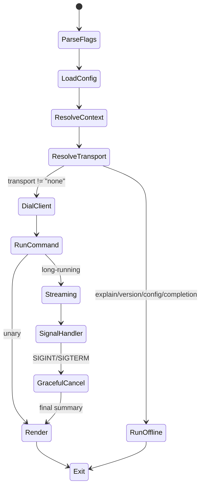
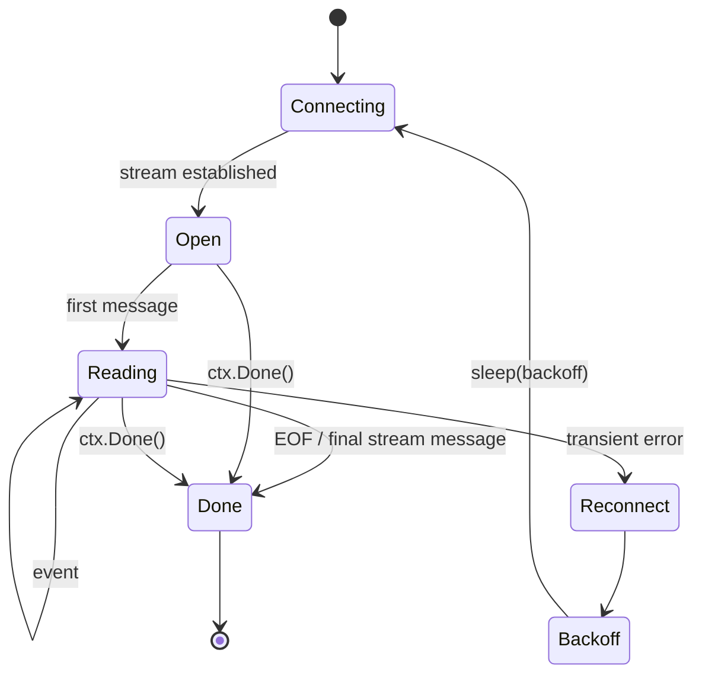
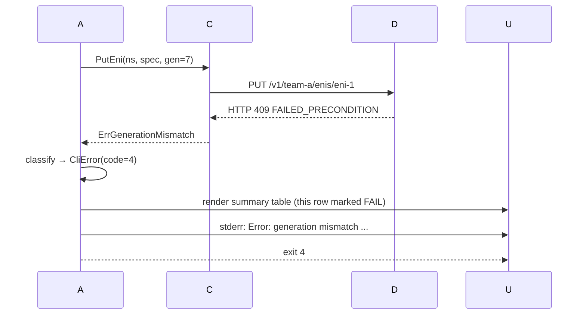
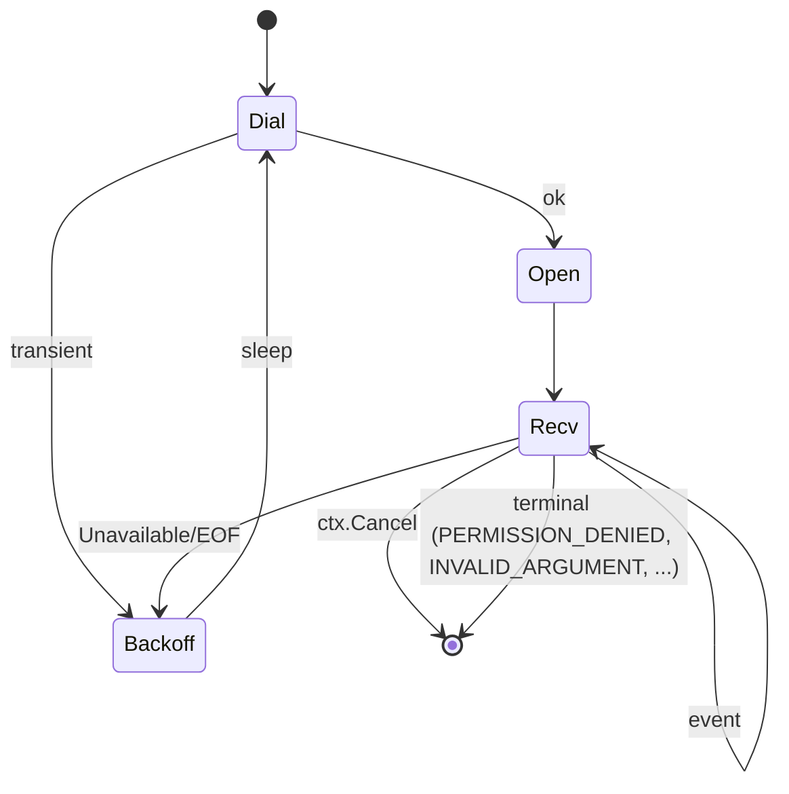
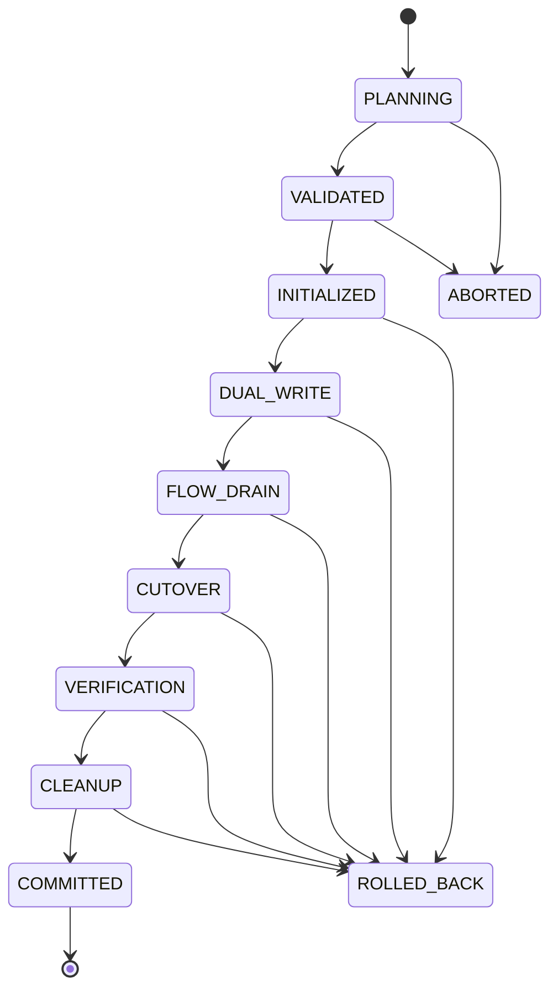
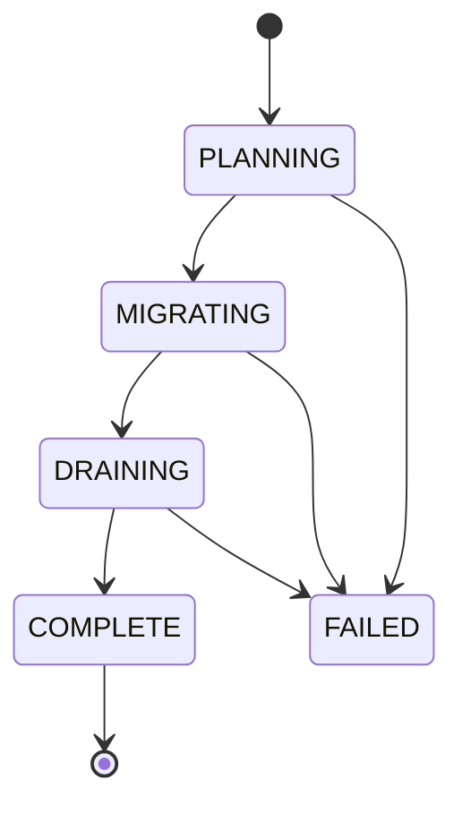

# Low-Level Design (LLD) — `dashctl` (DashCenter Operator CLI)

> **Document scope.** Implementable-grade design for `dashctl`. Every
> module, type, function signature, file layout, error mapping, codec
> rule, output column, state machine, and test scenario referenced by the
> implementation plan is specified here. If you can build dashctl by
> reading this top-to-bottom, the document has done its job.
>
> **Companion HLD.** [`specs/HLD/dashctl-hld.md`](../HLD/dashctl-hld.md)
> defines the goals, principles, and command taxonomy at the system
> level. This LLD nails the implementation.
>
> **Implementation plan.** [`specs/Impl-Plan/dashctl-impl-phases.md`](../Impl-Plan/dashctl-impl-phases.md)
> tracks Phase 1 (REST) and Phase 2 (gRPC) gates.
>
> **Status.** Supersedes [`specs/LLD/dashctl.md`](dashctl.md) (early draft,
> kept for historical reference only).

---

## Table of contents

1. [Repository layout & module boundaries](#1-repository-layout--module-boundaries)
2. [Build system & dependencies](#2-build-system--dependencies)
3. [Process model & lifecycle](#3-process-model--lifecycle)
4. [Configuration system](#4-configuration-system)
5. [Command graph & per-command specs](#5-command-graph--per-command-specs)
6. [Client SDK (`pkg/client`)](#6-client-sdk-pkgclient)
7. [Codec — manifest schema](#7-codec--manifest-schema)
8. [Rendering engine (`internal/render`)](#8-rendering-engine-internalrender)
9. [Streaming engine (`internal/stream`)](#9-streaming-engine-internalstream)
10. [Error model & exit codes](#10-error-model--exit-codes)
11. [Authentication & TLS](#11-authentication--tls)
12. [Concurrency & cancellation](#12-concurrency--cancellation)
13. [Shell completion](#13-shell-completion)
14. [Logging & verbosity](#14-logging--verbosity)
15. [Testing strategy](#15-testing-strategy)
16. [Performance budgets](#16-performance-budgets)
17. [Cross-cutting state machines](#17-cross-cutting-state-machines)
18. [Reference appendices](#18-reference-appendices)

---

## 1. Repository layout & module boundaries

```
src/impl-go/dashctl/
├── go.mod
├── go.sum
├── Dockerfile                          # distroless static; multi-arch
├── README.md
├── Makefile                            # build / test / lint / release targets
├── cmd/
│   └── dashctl/
│       └── main.go                     # one line: cmd.Execute()
├── internal/
│   ├── cmd/                            # Cobra command tree (one file per top-level verb)
│   │   ├── root.go                     # NewRootCmd, persistent flags, context binding
│   │   ├── apply.go
│   │   ├── get.go
│   │   ├── describe.go
│   │   ├── delete.go
│   │   ├── edit.go
│   │   ├── replace.go
│   │   ├── label.go
│   │   ├── annotate.go
│   │   ├── explain.go
│   │   ├── diff.go
│   │   ├── events.go
│   │   ├── logs.go
│   │   ├── version.go
│   │   ├── config.go                   # config view/use-context/set-context/...
│   │   ├── completion.go
│   │   ├── reconcile.go
│   │   ├── dpu.go                      # dpu list/status/drift/cordon/uncordon/drain
│   │   ├── ha.go                       # ha switchover/failover/events       (Phase 2)
│   │   ├── migration.go                # migration plan/start/advance/...    (Phase 2)
│   │   ├── trace.go                    # trace flow/explain                  (Phase 2)
│   │   ├── resource_typed.go           # generates vnet/eni/... typed subgroups
│   │   ├── kinds.go                    # registry: kind ↔ aliases ↔ codec
│   │   └── flags.go                    # reusable flag sets (selector, all-ns, ...)
│   ├── cli/
│   │   ├── manifest.go                 # load -f file|dir|stdin, walk multi-doc
│   │   ├── selector.go                 # label selector parser (k8s subset)
│   │   ├── name.go                     # parse "vnet/foo" or "vnet foo"
│   │   ├── editor.go                   # invoke $EDITOR
│   │   └── prompt.go                   # interactive prompts (only when TTY + --interactive)
│   ├── config/
│   │   ├── config.go                   # Load / Save / Resolve
│   │   ├── context.go                  # Context type + merge logic
│   │   ├── precedence.go               # flag > env > context > default
│   │   └── config_test.go
│   ├── render/
│   │   ├── render.go                   # Renderer interface
│   │   ├── json.go
│   │   ├── yaml.go
│   │   ├── table.go
│   │   ├── wide.go
│   │   ├── name.go
│   │   ├── jsonpath.go
│   │   ├── template.go
│   │   ├── columns/                    # per-kind column definitions
│   │   │   ├── columns.go
│   │   │   ├── vnet.go ... ha_set.go
│   │   │   └── dpu.go
│   │   └── render_test.go              # golden files in testdata/
│   ├── stream/
│   │   ├── stream.go                   # StreamEngine + Reconnector
│   │   ├── backoff.go                  # jittered exponential
│   │   ├── signal.go                   # SIGINT → graceful cancel
│   │   └── stream_test.go
│   ├── errors/
│   │   ├── errors.go                   # CliError type + classifier
│   │   ├── exitcodes.go
│   │   └── errors_test.go
│   └── logging/
│       └── logger.go                   # slog setup, --log-level/--log-file
├── pkg/
│   ├── client/
│   │   ├── client.go                   # Client interface + Dial(ctx, ClientConfig)
│   │   ├── types.go                    # public re-exports of dashcenter.v1 messages
│   │   ├── rest/
│   │   │   ├── rest.go                 # REST backend (Phase 1)
│   │   │   ├── routes.go               # URL builders per kind
│   │   │   ├── sse.go                  # SSE / long-poll helpers
│   │   │   └── rest_test.go            # httptest fixture
│   │   └── grpc/
│   │       ├── grpc.go                 # gRPC backend (Phase 2)
│   │       ├── dial.go                 # interceptors, keepalive, retry
│   │       └── grpc_test.go            # bufconn fixture
│   └── manifest/
│       ├── envelope.go                 # Envelope ↔ dashcenter.v1.<Kind>Spec
│       ├── envelope_test.go
│       └── schema.go                   # apiVersion/kind table
└── testdata/
    ├── manifests/                      # canonical manifests for tests
    ├── golden/                         # expected -o outputs
    └── fixtures/                       # bufconn / httptest fixtures
```

### 1.1 Boundary rules (enforced by lint + code review)

| Rule | Enforcement |
|---|---|
| `pkg/` must not import `internal/` | `go vet` plus a custom linter rule (`forbidigo`-style). |
| `internal/cmd/` must not import `pkg/client/{rest,grpc}` directly — only `pkg/client` interface | one allow-list lint rule. |
| `internal/render/` is pure: no I/O, no logging, no clock; the only side-effect is writing to the `io.Writer` it is given. | Golden-file tests assert byte-equality. |
| `pkg/client` returns typed `dashcenter.v1` messages; never `map[string]any`. | Codegen import discipline. |
| No package in `internal/` may depend on `internal/cmd/`. | Command tree is the top of the DAG. |

---

## 2. Build system & dependencies

### 2.1 Toolchain

| Item | Version |
|---|---|
| Go | `>= 1.22` (matches dashd) |
| Cobra | `v1.8+` |
| Viper | `v1.18+` (config file binding) |
| protojson | `google.golang.org/protobuf/encoding/protojson` |
| yaml | `gopkg.in/yaml.v3` |
| grpc-go | `v1.66+` (Phase 2 only) |
| tablewriter | `github.com/olekukonko/tablewriter` (or `text/tabwriter` for minimal deps — decision deferred to Step 7 of Phase 1) |
| color | `github.com/fatih/color` (TTY-aware) |
| jsonpath | `k8s.io/client-go/util/jsonpath` (matches kubectl semantics) |

### 2.2 Build flags

```
CGO_ENABLED=0 go build \
  -trimpath \
  -ldflags="-s -w \
    -X main.version=${VERSION} \
    -X main.commit=${GIT_SHA} \
    -X main.buildDate=${DATE}" \
  -o bin/dashctl ./cmd/dashctl
```

### 2.3 go.mod (Phase 1)

```
module github.com/rashmirrout/DashCenter/src/impl-go/dashctl

go 1.22

require (
    github.com/spf13/cobra v1.8.1
    github.com/spf13/viper v1.18.2
    google.golang.org/protobuf v1.34.2
    gopkg.in/yaml.v3 v3.0.1
    github.com/fatih/color v1.17.0
    k8s.io/client-go v0.30.3              // jsonpath only
    github.com/rashmirrout/DashCenter/src/impl-go/gen/go v0.0.0
)

// Phase 2 additions:
// google.golang.org/grpc v1.66.0
// google.golang.org/grpc/credentials v1.66.0
```

A `go.work` entry at repo root will already include `src/impl-go/dashctl`
(same pattern as `dashd`, `dash-sim`, `dash-sim-client`).

---

## 3. Process model & lifecycle

dashctl is a **short-lived process**. The lifecycle for an arbitrary
command is:



Lifecycle constraints:
- Total process budget is `--timeout` (default 30s for unary, 0 = forever for streaming/`--watch`).
- All `*Dial*` calls receive a `context.WithTimeout` derived from the same root context.
- Exactly **one** signal handler is installed in `main` and forwards to a process-wide `context.CancelFunc`.

---

## 4. Configuration system

### 4.1 Types

```go
package config

type Config struct {
    APIVersion     string                   `yaml:"apiVersion"`        // "dashctl/v1"
    Kind           string                   `yaml:"kind"`              // "Config"
    CurrentContext string                   `yaml:"current-context"`
    Contexts       map[string]ContextEntry  `yaml:"contexts"`
    Preferences    Preferences              `yaml:"preferences"`
}

type ContextEntry struct {
    Endpoint  string     `yaml:"endpoint"`       // host:port or URL
    Transport string     `yaml:"transport"`      // "rest" | "grpc"
    Namespace string     `yaml:"namespace"`      // default for this context
    Auth      AuthConfig `yaml:"auth"`
    TLS       TLSConfig  `yaml:"tls"`
    Timeout   Duration   `yaml:"timeout"`
}

type AuthConfig struct {
    Mode      string `yaml:"mode"`               // "none" | "token" | "mtls" | "oidc"
    Token     string `yaml:"token,omitempty"`    // discouraged; prefer TokenEnv
    TokenEnv  string `yaml:"token-env,omitempty"`
    TokenFile string `yaml:"token-file,omitempty"`
    Issuer    string `yaml:"issuer,omitempty"`   // OIDC (post-Phase 2)
}

type TLSConfig struct {
    CAFile             string `yaml:"ca-file,omitempty"`
    CertFile           string `yaml:"cert-file,omitempty"`
    KeyFile            string `yaml:"key-file,omitempty"`
    Insecure           bool   `yaml:"insecure,omitempty"`            // plaintext gRPC
    InsecureSkipVerify bool   `yaml:"insecure-skip-verify,omitempty"`
}

type Preferences struct {
    Output    string `yaml:"output,omitempty"`     // "table" | "json" | ...
    Color     string `yaml:"color,omitempty"`      // "auto" | "always" | "never"
    PageSize  int    `yaml:"page-size,omitempty"`
}

// ResolvedConfig is the per-invocation merge of flags, env, context, defaults.
type ResolvedConfig struct {
    Endpoint  string
    Transport Transport         // typed enum
    Namespace string
    Auth      ResolvedAuth
    TLS       ResolvedTLS
    Timeout   time.Duration
    Output    OutputFormat
    Color     ColorMode
    PageSize  int
}
```

### 4.2 Loader contract

```go
func Load(path string) (*Config, error)                       // path == "" → search default locations
func Save(cfg *Config, path string) error
func (c *Config) Resolve(name string) (ContextEntry, error)
func Merge(flags Flags, env Env, ctx ContextEntry) ResolvedConfig
```

### 4.3 Precedence algorithm (deterministic)

For each field in `ResolvedConfig`, the value is the first non-zero from:

1. Explicit flag (`--endpoint=...`, `--namespace=...`, `-o=...`, `--timeout=...`).
2. Environment variable (`DASHCTL_ENDPOINT`, `DASHCTL_NAMESPACE`, `DASHCTL_OUTPUT`, `DASHCTL_TIMEOUT`, `DASHCTL_TOKEN`, `DASHCTL_CONTEXT`).
3. Active context in config file (selected by `--context`, then `DASHCTL_CONTEXT`, then `current-context`).
4. Built-in default (table 4.4).

### 4.4 Built-in defaults

| Field | Default |
|---|---|
| Endpoint | `http://localhost:8443` (Phase 1) / `localhost:9443` (Phase 2) |
| Transport | `rest` (Phase 1) / `grpc` (Phase 2) |
| Namespace | `default` |
| Timeout (unary) | `30s` |
| Timeout (streaming) | `0` (no client-side timeout) |
| Output (TTY) | `table` |
| Output (non-TTY) | `json` |
| Color | `auto` |
| Page size | `100` |
| TLS Insecure | `true` if endpoint scheme is `http://` else `false` |

---

## 5. Command graph & per-command specs

### 5.1 Top-level command graph

```mermaid
flowchart TD
    root[dashctl] --> apply
    root --> get
    root --> describe
    root --> delete
    root --> edit
    root --> replace
    root --> label
    root --> annotate
    root --> diff
    root --> explain
    root --> events
    root --> logs
    root --> reconcile
    root --> version
    root --> completion
    root --> config
    root --> dpu
    root --> debug[debug • hidden]
    root --> ha[ha • Phase 2]
    root --> migration[migration • Phase 2]
    root --> trace[trace • Phase 2]
    root --> vnet
    root --> eni
    root --> vnetmapping[vnet-mapping]
    root --> aclpolicy[acl-policy]
    root --> routepolicy[route-policy]
    root --> haset[ha-set]
    root --> servicetunnel[service-tunnel • Phase 2]
    root --> inventory

    dpu --> dpu_list[list]
    dpu --> dpu_status[status • Phase 2 stream]
    dpu --> dpu_drift[drift]
    dpu --> dpu_cordon[cordon • Phase 2]
    dpu --> dpu_uncordon[uncordon • Phase 2]
    dpu --> dpu_drain[drain • Phase 2]

    config --> cfg_view[view]
    config --> cfg_use[use-context]
    config --> cfg_set[set-context]
    config --> cfg_get[get-contexts]
    config --> cfg_cur[current-context]
    config --> cfg_del[delete-context]
    config --> cfg_ren[rename-context]

    debug --> dbg_putraw[put-raw]
    debug --> dbg_getraw[get-raw]
    debug --> dbg_curl[curl]
    debug --> dbg_admin[admin]
    debug --> dbg_grpcstream[grpc-stream • Phase 2]
    debug --> dbg_parity[parity • Phase 2]
```



### 5.2 Persistent (global) flags

| Flag | Type | Default | Purpose |
|---|---|---|---|
| `--config` | string | platform default | path to config file |
| `--context` | string | `current-context` | named context |
| `--endpoint` | string | from context | override endpoint |
| `--transport` | string | from context | `rest` / `grpc` |
| `-n`, `--namespace` | string | from context (`default`) | spec namespace |
| `--all-namespaces`, `-A` | bool | false | list/get across all namespaces |
| `-o`, `--output` | string | auto | `json`/`yaml`/`table`/`wide`/`name`/`jsonpath=...`/`template=...` |
| `--timeout` | duration | 30s (unary) | per-invocation timeout |
| `--token` | string | env | bearer token |
| `--insecure-skip-tls-verify` | bool | false | skip TLS cert verification |
| `--ca` / `--cert` / `--key` | string | — | TLS material |
| `--color` | string | `auto` | `auto`/`always`/`never` |
| `-q`, `--quiet` | bool | false | suppress non-essential output |
| `-v`, `--verbose` | bool | false | shorthand for `--log-level=debug` |
| `--log-level` | string | `warn` | `debug`/`info`/`warn`/`error` |
| `--log-file` | string | stderr | redirect logs to file |
| `--dry-run` | string | `none` | `none`/`client`/`server` (server uses `SimulateApply`) |

### 5.3 Per-command specs

Format below for every command: **purpose / args / flags / behaviour / output / exit codes / errors**.

---

#### `apply -f <file|dir|-> [--recursive]`

| Field | Value |
|---|---|
| Purpose | Declarative create-or-update; the primary write verb. |
| Args | none |
| Flags | `-f, --filename` (repeatable); `-R, --recursive`; `--dry-run client\|server`; `--prune` (Phase 2; deletes server-side specs labelled with `--selector` that are absent from the manifest); `--force-conflicts` (ignores `expected_generation` mismatch and re-Puts). |
| Behaviour | (1) Load manifest stream → []Envelope; (2) Group by Kind; (3) For each envelope, call typed `client.Put<Kind>(ns, spec)` with `expected_generation` if present; (4) Aggregate Acks; (5) Render summary table (kind/name/op/generation/result). |
| Output | One row per envelope: `KIND NAME OP GENERATION RESULT`. |
| Exit | 0 if all succeed; 4 on any generation mismatch; 5 on validation error; 10 on internal. |

---

#### `get <kind> [name] [-l selector]`

| Field | Value |
|---|---|
| Purpose | Read one or many specs. |
| Args | `<kind>` (required); `[name]` (optional; if absent → list) |
| Flags | `-l, --selector` (label selector); `-A, --all-namespaces`; `--watch` (Phase 2 streaming); `--page-size`; `--continue=<token>`. |
| Behaviour | If `name` given → `client.Get(ns, kind, name)`; else → `client.List(ns, kind, opts)`. |
| Output | `-o table` (default for TTY); per-kind column set (see §8). |
| Exit | 0 / 3 (not-found) / 6 (perm) / 7 (unavailable). |

---

#### `describe <kind> <name>`

| Field | Value |
|---|---|
| Purpose | Human-readable detail (kind metadata + spec + observed status + drift summary). |
| Args | `<kind> <name>` |
| Flags | `--show-events=true\|false` (Phase 2; includes recent PolicyEvents for this object). |
| Behaviour | Get spec → fetch related observed status via `GetDpuStatus` / `GetDrift` filtered by ENI/VNet → render multi-section text. |
| Output | Multi-section text (kubectl describe style). |
| Exit | 0 / 3 / 6 / 7. |

---

#### `delete <kind> <name>`

| Field | Value |
|---|---|
| Purpose | Remove a spec. |
| Args | `<kind> <name>` (or `-f file` for bulk delete from a manifest). |
| Flags | `--ignore-not-found`; `--cascade=true\|false` (Phase 2 — also deletes child specs, e.g. delete VNet → delete ENIs referencing it); `--grace-period=<dur>` (Phase 2; only meaningful for HA/drain interactions); `--expected-generation=<n>` (CAS). |
| Behaviour | `client.Delete(ns, kind, name, opts)`. |
| Output | One-line confirmation. |
| Exit | 0 / 3 (if not `--ignore-not-found`) / 4 (CAS) / 6 / 7. |

---

#### `edit <kind> <name>`

| Field | Value |
|---|---|
| Purpose | Fetch → open in `$EDITOR` → re-apply if changed. |
| Behaviour | (1) Get spec; (2) Convert to YAML envelope incl. `metadata.generation`; (3) Spawn editor; (4) On save, parse + Put with `expected_generation` from original. (5) If edit changes nothing → exit 0 with `no changes`. |
| Notes | Refuses to run when stdout is not a TTY unless `--no-tty-confirm` is set. |
| Exit | 0 / 1 (parse) / 4 / 5. |

---

#### `replace -f <file>`

| Field | Value |
|---|---|
| Purpose | Like `apply -f` but requires `metadata.generation`; bails on any mismatch. |
| Behaviour | Identical to apply except every envelope MUST carry a generation; absent generation → error code 5. |

---

#### `events [--watch] [-l selector] [--since <dur>]`

| Field | Value |
|---|---|
| Phase | 1: SSE long-poll fallback; 2: native gRPC stream. |
| Purpose | Live policy-event feed. |
| Output | NDJSON (default `-o json`); table mode shows TIME / KIND / NAMESPACE / NAME / OP / ACTOR. |
| Cancel | Ctrl-C → graceful; prints "stream closed: N events" on stderr. |

---

#### `reconcile [--dpu ID]... [--all]`

| Field | Value |
|---|---|
| Purpose | Force dashd reconciler to sweep. |
| Behaviour | Phase 1: `POST /v1/reconcile` (REST) or `POST /admin/reconcile` (Admin). Phase 2: `ControlPlane.Reconcile(ReconcileRequest{dpu_ids})`. |
| Output | One-line ack. |

---

#### `dpu list`

| Field | Value |
|---|---|
| Purpose | Snapshot inventory + state. |
| Phase 1 | `GET /admin/health` + `GET /admin/inventory`. |
| Phase 2 | gRPC `ObservabilityService.GetDpuStatus(deltas_only=false)` collected to a single snapshot. |

#### `dpu status [--dpu ID] [--watch]`

| Phase 1 | snapshot via admin; `--watch` polls every `--poll` (default 5s). |
| Phase 2 | native server-streaming `GetDpuStatus`. |

#### `dpu drift [--dpu ID]`

| Phase 1 | `GET /admin/drift?dpu=...` returning live add/update/remove items. |
| Phase 2 | `ObservabilityService.GetDrift(DriftRequest)` unary. |

#### `dpu cordon|uncordon|drain` (Phase 2)

Wraps `OperationsService` (gated on dashd Phase 2 PC). `drain` streams `DrainProgress` with stage transitions PLANNING → MIGRATING → DRAINING → COMPLETE.

---

#### `migration` (Phase 2)

| Subcommand | RPC |
|---|---|
| `plan create -f <plan.yaml>` | `MigrationService.CreateMigrationPlan` |
| `plan validate <id>` | `ValidateMigrationPlan` |
| `start <plan-id>` | `StartMigrationSession` |
| `advance <session-id>` | `AdvanceMigrationPhase` |
| `stream <session-id>` | `StreamMigrationSession` (10-phase state machine; see §17.4) |
| `rollback <session-id>` | `RollbackMigration` |
| `abort <session-id>` | `AbortMigration` |
| `commit <session-id>` | `CommitMigration` |
| `get <session-id>` | `GetMigrationSession` |
| `list` | `ListMigrationSessions` |
| `bundle export <session-id> -o <file>` | `ExportMigrationBundle` (byte-stream) |
| `bundle import -f <file>` | `ImportMigrationBundle` (byte-stream) |

---

#### `ha` (Phase 2)

| Subcommand | RPC |
|---|---|
| `set get <name>` | `GetHaSetState` |
| `scope get <name>` | `GetHaScopeState` |
| `switchover <ha-set> --to <dpu>` | `TriggerSwitchover` (server-stream progress) |
| `failover <ha-set> --to <dpu> --confirm` | `TriggerFailover` (server-stream); requires `--confirm` |
| `events [--watch]` | `WatchHaEvents` |
| `flow-sync-stats <ha-scope>` | `GetFlowSyncStats` |

---

#### `trace flow / trace explain` (Phase 2)

| Subcommand | RPC |
|---|---|
| `trace flow --src ... --dst ... [--eni ...]` | `DiagnosticsService.TraceFlow` |
| `trace explain --acl-rule ...` | `ExplainMatch` |
| `trace acl-stats [--dpu ...] [--zero-only]` | `GetAclHitStats` (server-stream) |
| `trace drift-explain --kind ... --name ...` | `ExplainDrift` |
| `trace resimulate --dpu ...` | `TriggerResimulation` |

---

#### `explain <kind>[.<field>...]` (offline)

| Field | Value |
|---|---|
| Purpose | Print field docs from embedded proto descriptors. Mirrors `kubectl explain`. |
| Behaviour | Reads embedded `FileDescriptorSet` (compiled into binary at build time); walks the proto path; prints field name, type, repeated/optional, comments. |
| Offline | Yes — no RPC. |

---

#### `version`

| Field | Value |
|---|---|
| Output | `Client: vX.Y.Z (commit, date)`<br>`Server: vX.Y.Z (dialed if context resolvable)` |
| Flags | `--client` skips server dial. |

---

#### `config <subcommand>` — see §4 table.

---

### 5.4 `debug` subcommand group

The `debug` group is a **hidden** top-level Cobra command (`Hidden: true`)
providing raw-protocol escape hatches. It does NOT appear in
`dashctl --help` but is accessible via `dashctl debug --help`.

Full spec — per-command flags, output format, architecture impact,
quality gates, and integration tests — is in the standalone companion
document:

> **[`specs/LLD/dashctl-debug.md`](dashctl-debug.md)**

Summary of subcommands:

| Command | Phase | Purpose |
|---|---|---|
| `debug put-raw` | Phase 1 ext | Bypass envelope codec; send raw JSON to `Put<Kind>` |
| `debug get-raw` | Phase 1 ext | Dump raw `PolicyObject.spec` protojson (no envelope) |
| `debug curl` | Phase 1 ext | Print equivalent `curl` / `grpcurl` command (offline) |
| `debug admin` | Phase 1 ext | Raw GET to dashd admin `:7443` |
| `debug grpc-stream` | 2A | Open a named gRPC server-stream; dump NDJSON |
| `debug parity` | 2A | Compare REST vs gRPC `Get` response; diff on mismatch |

---

## 6. Client SDK (`pkg/client`)

The SDK is **the only place where a transport choice is made**. Subcommand
code calls a transport-agnostic interface.

### 6.1 Public types

```go
package client

// Transport identifies the backend implementation.
type Transport string

const (
    TransportREST Transport = "rest"
    TransportGRPC Transport = "grpc"
)

// ClientConfig is what Dial requires.
type ClientConfig struct {
    Endpoint  string
    Transport Transport
    Namespace string
    Timeout   time.Duration
    Auth      AuthOption
    TLS       TLSOption
    Logger    *slog.Logger
}

// Client is the transport-agnostic interface every subcommand uses.
type Client interface {
    Close() error
    Health(ctx context.Context) (HealthReport, error)

    // ---- ControlPlane (writes) ----
    PutVnet(ctx context.Context, ns string, spec *dashcenterv1.VnetSpec) (*dashcenterv1.Ack, error)
    PutEni(ctx context.Context, ns string, spec *dashcenterv1.EniSpec) (*dashcenterv1.Ack, error)
    PutVnetMapping(ctx context.Context, ns string, spec *dashcenterv1.VnetMappingSpec) (*dashcenterv1.Ack, error)
    PutAclPolicy(ctx context.Context, ns string, spec *dashcenterv1.AclPolicySpec) (*dashcenterv1.Ack, error)
    PutRoutePolicy(ctx context.Context, ns string, spec *dashcenterv1.RoutePolicySpec) (*dashcenterv1.Ack, error)
    PutHaSet(ctx context.Context, ns string, spec *dashcenterv1.HaSetSpec) (*dashcenterv1.Ack, error)
    PutServiceTunnel(ctx context.Context, ns string, spec *dashcenterv1.ServiceTunnelSpec) (*dashcenterv1.Ack, error)

    PutInventory(ctx context.Context, inv *dashcenterv1.Inventory) (*dashcenterv1.Ack, error)

    Delete(ctx context.Context, ns, kind, name string, opts DeleteOptions) (*dashcenterv1.Ack, error)
    Get(ctx context.Context, ns, kind, name string) (*dashcenterv1.PolicyObject, error)
    List(ctx context.Context, ns, kind string, opts ListOptions) (ListResult, error)

    Reconcile(ctx context.Context, dpuIDs []string) (*dashcenterv1.Ack, error)

    // ---- Observability (reads, some streaming) ----
    GetDpuStatusSnapshot(ctx context.Context, dpuIDs []string) ([]*dashcenterv1.DpuStatusReport, error)
    GetDpuStatusStream(ctx context.Context, dpuIDs []string, deltasOnly bool) (DpuStatusStream, error)
    GetDrift(ctx context.Context, dpuID string) (*dashcenterv1.DriftReport, error)
    WatchEvents(ctx context.Context, filter EventFilterOpts) (EventStream, error)
    GetAuditLog(ctx context.Context, filter AuditFilterOpts) (AuditStream, error)

    // ---- Admin (REST-only on dashd; Phase 1 + 2) ----
    AdminHealth(ctx context.Context) (AdminHealth, error)
    AdminEniPlacement(ctx context.Context) ([]EniPlacementRow, error)
    AdminDrift(ctx context.Context, dpuID string) ([]DriftItem, error)
    AdminRaw(ctx context.Context, path string, params map[string]string) (json.RawMessage, error) // debug admin

    // ---- Phase 2 additions ----
    ApplyBatch(ctx context.Context) (ApplyBatchSender, error)            // client-stream; Phase 2 only
    SimulateApply(ctx context.Context, req *dashcenterv1.PolicyApplyRequest) (*dashcenterv1.SimulateApplyResult, error)

    // Debug (Phase 2 / 2A)
    DebugStream(ctx context.Context, key string, requestJSON json.RawMessage) (stream.Stream[json.RawMessage], error) // debug grpc-stream

    // Operations
    CordonDpu(ctx context.Context, dpuID string) (*dashcenterv1.Ack, error)
    UncordonDpu(ctx context.Context, dpuID string) (*dashcenterv1.Ack, error)
    DrainDpu(ctx context.Context, dpuID string, opts DrainOptions) (DrainStream, error)

    // Migration / HA / Diagnostics — see types in `pkg/client/types.go`.
}

// Dial chooses the backend per cfg.Transport.
func Dial(ctx context.Context, cfg ClientConfig) (Client, error)
```

### 6.2 Backend selection

```go
func Dial(ctx context.Context, cfg ClientConfig) (Client, error) {
    switch cfg.Transport {
    case TransportREST:
        return rest.New(ctx, cfg)
    case TransportGRPC:
        return grpc.New(ctx, cfg)
    default:
        return nil, fmt.Errorf("unknown transport %q", cfg.Transport)
    }
}
```

### 6.3 REST backend (Phase 1)

#### Routes

| Operation | Method | Path |
|---|---|---|
| PutVnet | PUT | `/v1/{ns}/vnets/{name}` |
| PutEni | PUT | `/v1/{ns}/enis/{name}` |
| PutVnetMapping | PUT | `/v1/{ns}/vnet-mappings/{name}` |
| PutAclPolicy | PUT | `/v1/{ns}/acl-policies/{name}` |
| PutRoutePolicy | PUT | `/v1/{ns}/route-policies/{name}` |
| PutHaSet | PUT | `/v1/{ns}/ha-sets/{name}` |
| PutServiceTunnel | PUT | `/v1/{ns}/service-tunnels/{name}` |
| Get | GET | `/v1/{ns}/{kind}/{name}` |
| List | GET | `/v1/{ns}/{kind}` |
| Delete | DELETE | `/v1/{ns}/{kind}/{name}` |
| PutInventory | PUT | `/v1/inventory` |
| GetInventory | GET | `/v1/inventory` |
| Reconcile | POST | `/v1/reconcile` |
| AdminHealth | GET | `/admin/health` |
| AdminInventory | GET | `/admin/inventory` |
| AdminDrift | GET | `/admin/drift?dpu={id}` |
| AdminEniPlacement | GET | `/admin/eni-placement` |
| ForceReconcile | POST | `/admin/reconcile` |

All non-admin routes go to the `endpoint`. Admin routes go to a derived
admin endpoint: if `endpoint` is `host:port` (Phase 1 REST), the admin
port is configured per context via `admin-endpoint: host:port`, otherwise
defaults to swapping `:8443` → `:7443`.

#### Request shape

```go
// Body: protojson-encoded dashcenter.v1.<Kind>Spec.
// Headers:
//   Content-Type: application/json
//   Accept: application/json
//   Authorization: Bearer <token>           (if auth.mode == token)
//   X-Dashctl-Client: dashctl/vX.Y.Z (commit)
//   X-Dashctl-Txn-Id: <uuid>                (for traceability)
//   X-Dashctl-Dry-Run: server               (if --dry-run=server; future)
```

#### Status code mapping

| HTTP | Client error type | Exit code |
|---|---|---|
| 200 / 201 / 204 | nil | 0 |
| 400 | `ErrInvalidArgument` | 5 |
| 401 | `ErrUnauthenticated` | 6 |
| 403 | `ErrPermissionDenied` | 6 |
| 404 | `ErrNotFound` | 3 |
| 409 | `ErrGenerationMismatch` / `ErrConflict` | 4 |
| 412 | `ErrFailedPrecondition` | 4 |
| 429 | `ErrResourceExhausted` (retry) | 10 |
| 500 | `ErrInternal` | 10 |
| 501 | `ErrUnimplemented` | 9 |
| 503 | `ErrUnavailable` | 7 |
| 504 | `ErrDeadlineExceeded` | 8 |
| other 4xx/5xx | `ErrInternal` with status text | 10 |

#### Streaming over REST

- **SSE**: `GET /v1/events?watch=true` with `Accept: text/event-stream`. Reader uses `bufio.Scanner` with the SSE framing (`data: <json>\n\n`).
- **Long-poll**: For endpoints without SSE, the SDK exposes the same `Stream` interface and polls every `poll-interval` (default 5s; user can override). Dedup is by `(kind, name, generation)`.

### 6.4 gRPC backend (Phase 2)

```go
package grpc

func New(ctx context.Context, cfg client.ClientConfig) (client.Client, error) {
    var opts []grpc.DialOption
    opts = append(opts, grpc.WithTransportCredentials(buildCreds(cfg.TLS)))
    if cfg.Auth.Mode == "token" {
        opts = append(opts, grpc.WithPerRPCCredentials(tokenCreds(cfg.Auth)))
    }
    opts = append(opts,
        grpc.WithChainUnaryInterceptor(timeoutInterceptor(cfg.Timeout), traceInterceptor(), retryInterceptor(retryPolicy)),
        grpc.WithKeepaliveParams(keepalive.ClientParameters{Time: 30*time.Second, Timeout: 10*time.Second}),
    )
    conn, err := grpc.NewClient(cfg.Endpoint, opts...)
    if err != nil { return nil, err }
    return &grpcClient{conn: conn,
        cp:  dashcenterv1.NewControlPlaneClient(conn),
        obs: dashcenterv1.NewObservabilityServiceClient(conn),
        // ops/ha/mig/diag: created lazily when first used (degrade to Unimplemented if dashd does not register them yet)
    }, nil
}
```

Retry policy (idempotent reads only): `UNAVAILABLE` and `DEADLINE_EXCEEDED`,
3 attempts, exponential 200ms → 1.6s, jittered. Writes are **never**
retried automatically (the user must re-issue with the correct generation).

---

## 7. Codec — manifest schema

### 7.1 Envelope

```go
package manifest

type Envelope struct {
    APIVersion string                 `yaml:"apiVersion" json:"apiVersion"` // "dashcenter.v1"
    Kind       string                 `yaml:"kind"       json:"kind"`
    Metadata   Metadata               `yaml:"metadata"   json:"metadata"`
    Spec       map[string]any         `yaml:"spec"       json:"spec"`       // protojson-shaped per Kind
}

type Metadata struct {
    Namespace  string            `yaml:"namespace,omitempty"  json:"namespace,omitempty"`
    Name       string            `yaml:"name"                 json:"name"`
    Generation uint64            `yaml:"generation,omitempty" json:"generation,omitempty"`
    Labels     map[string]string `yaml:"labels,omitempty"     json:"labels,omitempty"`
}
```

### 7.2 Kind registry

```go
type KindInfo struct {
    Kind            string                   // "Vnet"
    SingularURL     string                   // "vnets"  (REST plural fragment for routing)
    StoreKind       string                   // "vnet"   (dashd store kind)
    Aliases         []string                 // ["vn"]
    Phase           int                      // 1 or 2
    EmptySpec       func() proto.Message     // returns *dashcenterv1.VnetSpec{}
    PutFn           func(c Client, ctx context.Context, ns string, msg proto.Message) (*dashcenterv1.Ack, error)
}

var Registry = map[string]KindInfo{
    "Vnet":           {...},
    "Eni":            {...},
    "VnetMapping":    {...},
    "AclPolicy":      {...},
    "RoutePolicy":    {...},
    "HaSet":          {...},
    "ServiceTunnel":  {Phase: 2, ...},
}
```

### 7.3 Decode algorithm

```
1.  read whole document (yaml/json)
2.  validate apiVersion == "dashcenter.v1"
3.  lookup Registry[Kind] → KindInfo or err 5
4.  spec := KindInfo.EmptySpec()
5.  jsonBytes := marshal(env.Spec)               // map → JSON
6.  protojson.UnmarshalOptions{
        DiscardUnknown: false                     // strict: unknown fields → err 5
        AllowPartial:   false
    }.Unmarshal(jsonBytes, spec)
7.  if env.Metadata.Name set → spec.GetName()/SetName accordingly
8.  if env.Metadata.Generation > 0 → spec.ExpectedGeneration = generation
9.  KindInfo.PutFn(client, ctx, env.Metadata.Namespace || cfg.Namespace, spec)
```

### 7.4 Multi-doc + directory walk

```
LoadFiles(args []string) → []Envelope:
  for each arg in args:
    if arg == "-": parse stdin as multi-doc YAML
    if isDir(arg) && --recursive: walk *.yaml|*.yml|*.json
    if isDir(arg) && !--recursive: read top-level *.yaml|*.yml|*.json
    else: read file (auto-detect yaml vs json by extension or sniff)
  preserve order; stable across reruns.
```

Order matters: apply runs envelopes in **document order**, except when
`--reorder-by-deps` is set (Phase 2; uses dashd's 5-tier dependency
ordering to emit infrastructure-first).

---

## 8. Rendering engine (`internal/render`)

### 8.1 Interfaces

```go
package render

type Format int

const (
    FormatTable Format = iota
    FormatWide
    FormatName
    FormatJSON
    FormatYAML
    FormatJSONPath
    FormatTemplate
)

type Renderer interface {
    Render(w io.Writer, obj any) error           // single object or slice
    RenderStream(w io.Writer, ch <-chan any, done <-chan struct{}) error
}

func New(fmt Format, opts Options) (Renderer, error)
```

### 8.2 Per-kind column definitions

Located in `internal/render/columns/`. Each kind exports a `Columns()` table:

```go
// vnet.go
var VnetColumns = []Column{
    {Header: "NAMESPACE",  Width: 12, Get: func(o any) string { return spec(o).Namespace }},
    {Header: "NAME",       Width: 24, Get: func(o any) string { return spec(o).Name }},
    {Header: "VNI",        Width: 8,  Get: func(o any) string { return strconv.Itoa(int(spec(o).Vni)) }},
    {Header: "GENERATION", Width: 6,  Get: func(o any) string { return strconv.FormatUint(spec(o).ExpectedGeneration, 10) }},
    {Header: "LABELS",     Width: 0,  Get: func(o any) string { return formatLabels(spec(o).Labels) }, Wide: true},
}
```

`Wide: true` columns appear only in `-o wide`. Output uses
`text/tabwriter` with right-padding to `Width`; 0 = remaining width.

### 8.3 NDJSON / NDYAML for streams

`RenderStream` emits one object per line in `json`, one document per
record (separated by `---`) in `yaml`, and incremental tabwriter flush in
`table`/`wide`. Header is repeated every `--header-interval` (default 25
rows) when output is a TTY.

### 8.4 Color rules

- Apply `RESULT=ok` → green; `pending` → yellow; `failed` → red; `not-found` → grey.
- Honour `--color=auto|always|never` and `NO_COLOR` env.

### 8.5 Stable output guarantees

| Format | Guarantee |
|---|---|
| `json` | Field names are `UseProtoNames: true`; sorted; line-equal across runs for the same input. |
| `yaml` | Top-level keys: `apiVersion`, `kind`, `metadata`, `spec`, `status` (status omitted on put output). |
| `name` | Append-only: future kinds may appear; existing format never changes. |
| `table`/`wide` | Columns may be **added** at minor versions; renamed/removed only at major. |

---

## 9. Streaming engine (`internal/stream`)

### 9.1 Reconnector state machine



### 9.2 Backoff

```go
// Jittered exponential: base 1s, factor 2, cap 30s, jitter ±20%.
backoff := jitter(min(base * 2^attempts, cap))
```

Reset to base on a successful event.

### 9.3 Signal handling

```go
// Installed once per process in main.go.
ctx, cancel := signal.NotifyContext(context.Background(), os.Interrupt, syscall.SIGTERM)
defer cancel()
// Streams use this ctx. Render layer prints "stream cancelled by signal" + summary on exit.
```

### 9.4 Stream interfaces

```go
type Stream[T any] interface {
    Recv() (T, error)         // returns io.EOF on clean end
    Close() error
}
```

Concretely typed wrappers are generated per RPC:

```go
type DpuStatusStream     = Stream[*dashcenterv1.DpuStatusReport]
type EventStream         = Stream[*dashcenterv1.PolicyEvent]
type AuditStream         = Stream[*dashcenterv1.AuditEntry]
type DrainStream         = Stream[*dashcenterv1.DrainProgress]
type MigrationStream     = Stream[*dashcenterv1.MigrationSession]
type HaEventStream       = Stream[*dashcenterv1.HaEvent]
```

---

## 10. Error model & exit codes

### 10.1 Error type

```go
package errors

type CliError struct {
    Code        ErrorCode      // typed enum (see exitcodes.go)
    Reason      string         // human message
    ServerCode  string         // gRPC status / HTTP status text; "" for client errors
    TxnID       string         // dashd Ack.TxnID, when available
    Hint        string         // optional next-step
    Wrap        error          // original
}

func (e *CliError) Error() string
func (e *CliError) Unwrap() error
func (e *CliError) ExitCode() int
```

### 10.2 Classifier (transport → CliError)

```go
func Classify(err error) *CliError {
    // gRPC path
    if s, ok := status.FromError(err); ok {
        return fromGRPC(s)
    }
    // REST path (wrapped *RESTError carries HTTP status)
    var re *RESTError
    if errors.As(err, &re) {
        return fromHTTP(re)
    }
    // local
    if errors.Is(err, context.Canceled) {
        return &CliError{Code: ExitCanceled, Reason: "cancelled by user"}
    }
    return &CliError{Code: ExitInternal, Reason: err.Error(), Wrap: err}
}
```

### 10.3 Stable mapping

| gRPC code | HTTP | Exit | Reason template |
|---|---|---|---|
| OK | 200 | 0 | — |
| INVALID_ARGUMENT | 400 | 5 | "invalid spec: %s" |
| UNAUTHENTICATED | 401 | 6 | "authentication required" |
| PERMISSION_DENIED | 403 | 6 | "permission denied" |
| NOT_FOUND | 404 | 3 | "%s/%s not found" |
| ALREADY_EXISTS | 409 | 4 | "%s/%s already exists" |
| FAILED_PRECONDITION | 409 / 412 | 4 | "generation mismatch (have %d, want %d)" |
| RESOURCE_EXHAUSTED | 429 | 10 | "capacity exceeded on dpu %s" |
| UNIMPLEMENTED | 501 | 9 | "RPC not yet available" |
| UNAVAILABLE | 503 | 7 | "dashd unavailable: %s" |
| DEADLINE_EXCEEDED | 504 | 8 | "deadline exceeded" |
| INTERNAL | 500 | 10 | "internal: %s" |

---

## 11. Authentication & TLS

### 11.1 Phase 1 (REST)

```go
type AuthOption struct {
    Mode      string  // "none" | "token"
    Token     string  // resolved value (from --token, env, file)
}

type TLSOption struct {
    CAFile             string
    CertFile           string
    KeyFile            string
    InsecureSkipVerify bool
}
```

- `mode: none` → plaintext HTTP (only allowed for `http://localhost` and `http://127.0.0.1`; refused elsewhere unless `--allow-insecure-remote` is passed).
- `mode: token` → `Authorization: Bearer <token>`.

### 11.2 Phase 2 (gRPC)

- `mode: none` → `grpc.WithTransportCredentials(insecure.NewCredentials())` (plaintext; same `localhost`-only safeguard).
- `mode: token` → `WithPerRPCCredentials` providing metadata `authorization: Bearer <token>`.
- `mode: mtls` → mTLS via `credentials.NewTLS(...)` with client cert + key.

### 11.3 Token resolution order

1. `--token` flag (least secure; warns once on stderr).
2. `$DASHCTL_TOKEN`.
3. Context `auth.token-env` → read named env.
4. Context `auth.token-file` → read file (trim trailing newline).
5. Context `auth.token` literal (discouraged; warned).
6. No token → if `mode: token`, error code 6.

---

## 12. Concurrency & cancellation

- One root `context.Context` per invocation, cancellable via signal handler.
- All RPCs honour the root context.
- Streams: derive a child context per `Stream.Open()`; on `Stream.Close()`, child cancel is invoked; resources released within 5s (enforced by deferred test).
- `apply -f` with many envelopes: by default serial (preserves order); `--parallel N` (Phase 2) issues at most N RPCs concurrently; in case of failure, remaining envelopes complete then summary reports per-envelope status. No partial-success masking.

---

## 13. Shell completion

Cobra-generated for `bash`, `zsh`, `fish`, `pwsh`:

```
dashctl completion bash | source
dashctl completion zsh  >> ~/.zsh/completions/_dashctl
dashctl completion pwsh | Out-String | Invoke-Expression
```

Per-flag completion functions implemented for:
- `--context` → enumerate `~/.config/dashctl/config`.
- `--namespace` → list from active context (cached 60s in `$XDG_RUNTIME_DIR/dashctl/`).
- `<kind>` argument → Registry keys + aliases.
- `<name>` argument → live list from dashd (suppressed if no TTY/cache).

---

## 14. Logging & verbosity

```go
package logging

func Setup(level, file string) *slog.Logger
// level: "debug"|"info"|"warn"|"error"; default "warn"
// file:  "" → stderr; else NDJSON file
```

`--verbose` → equivalent to `--log-level=debug`. Each RPC produces an
info-level log on success and error-level on failure with fields
`method`, `endpoint`, `transport`, `latency_ms`, `code`. Payloads
logged only when `--log-payloads` is set.

---

## 15. Testing strategy

### 15.1 Pyramid

| Layer | Tooling | Coverage target |
|---|---|---|
| Unit (pure logic: config, codec, render, errors) | `go test` + table-driven | ≥ 90% |
| Backend unit | `httptest.Server` for REST; `bufconn` for gRPC | ≥ 85% |
| Command unit | Cobra command exec with in-memory backend + capture writer | ≥ 80% |
| Integration | Real `dashd` + `dash-sim` from `deploy/compose/`, `//go:build integration` | every command happy path |
| End-to-end / golden | Golden output files in `testdata/golden/` (string-equality on stdout/stderr) | every `-o` for every kind |

### 15.2 Test fixtures

```
testdata/
├── manifests/
│   ├── one-vnet.yaml
│   ├── multi-doc.yaml
│   ├── invalid-kind.yaml
│   └── ...
├── golden/
│   ├── vnet/list.json
│   ├── vnet/list.yaml
│   ├── vnet/list.table.txt
│   ├── dpu/status.json
│   └── ...
└── fixtures/
    ├── rest_server.go       # httptest with hand-rolled handlers
    └── grpc_server.go       # bufconn with hand-rolled service impls
```

### 15.3 Specific scenario tests (must-have)

1. `apply -f` round-trips: parse → put → readback equals original.
2. `apply -f` with generation mismatch → exit 4, stderr code = `FAILED_PRECONDITION`.
3. `get -o jsonpath='{.metadata.name}'` returns the right field.
4. `get --watch` with simulated reconnect: stream survives 3 disconnects in 10s without dropping events.
5. `delete --ignore-not-found` on missing object → exit 0.
6. `events --watch` cancellation: SIGINT → exit 0 within 250ms.
7. `apply -f -` reading stdin produces same result as a file.
8. `config use-context` writes the file atomically (tmp + rename).
9. Output golden tests for **every** kind in `-o table`, `-o wide`, `-o json`, `-o yaml`, `-o name`.
10. `version` with unreachable dashd: client section present, server section reports `unavailable`, exit 0.
11. Token resolution order: each layer tested in isolation.
12. REST status code → CliError mapping: full table covered.

---

## 16. Performance budgets

| Action | Budget |
|---|---|
| Cold start (parse flags, load config, no RPC) | ≤ 100 ms p99 on commodity laptop |
| `version` (offline) | ≤ 50 ms p99 |
| Simple `get vnet x` (LAN to dashd) | ≤ 300 ms p99 |
| `apply -f` of 100 specs serially | ≤ 5 s p99 (network-dominated; not a CLI constraint) |
| `events --watch` steady-state CPU | < 1% on single core |
| Memory ceiling for normal commands | ≤ 100 MB RSS |
| Memory ceiling for `events --watch` over 24h | ≤ 200 MB RSS (no leaks) |

CI gate: long-running stream test (10 min) asserts < 5% RSS growth.

---

## 17. Cross-cutting state machines

### 17.1 `apply -f` happy path

```mermaid
sequenceDiagram
    actor U as User
    participant A as apply.go
    participant M as manifest loader
    participant C as Client
    participant D as dashd
    U->>A: dashctl apply -f manifest.yaml
    A->>M: LoadFiles(["manifest.yaml"])
    M-->>A: []Envelope
    loop per envelope (in order)
      A->>C: Put<Kind>(ns, spec, expected_generation)
      C->>D: REST PUT or gRPC RPC
      D-->>C: Ack{generation, txn_id}
      C-->>A: Ack
    end
    A->>U: render summary table; exit 0
```

### 17.2 `apply -f` failure path



### 17.3 Streaming with reconnect



### 17.4 `migration stream` (Phase 2)

`dashctl migration stream <sid>` mirrors dashd's session state machine:



dashctl renders each transition with timestamp + elapsed. Final line on
`COMMITTED` / `ROLLED_BACK` / `ABORTED` exits 0 / non-zero respectively.

### 17.5 `drain` (Phase 2)



---

## 18. Reference appendices

### 18.1 RPC coverage matrix (full)

| dashd service | RPC | Phase 1 (REST) | Phase 2 (gRPC) | dashctl command |
|---|---|---|---|---|
| ControlPlane | PutInventory | ✅ | ✅ | `inventory put` / `apply` |
| ControlPlane | RegisterDpu | via PutInventory | ✅ | `dpu register` |
| ControlPlane | DeregisterDpu | via PutInventory | ✅ | `dpu deregister` |
| ControlPlane | PutVnet | ✅ | ✅ | `vnet put` / `apply` |
| ControlPlane | PutEni | ✅ | ✅ | `eni put` / `apply` |
| ControlPlane | PutVnetMapping | ✅ | ✅ | `vnet-mapping put` / `apply` |
| ControlPlane | PutAclPolicy | ✅ | ✅ | `acl-policy put` / `apply` |
| ControlPlane | PutRoutePolicy | ✅ | ✅ | `route-policy put` / `apply` |
| ControlPlane | PutHaSet | ✅ | ✅ | `ha-set put` / `apply` |
| ControlPlane | PutServiceTunnel | ✅ (gated) | ✅ | `service-tunnel put` |
| ControlPlane | Delete | ✅ | ✅ | `delete` |
| ControlPlane | Get | ✅ | ✅ | `get` |
| ControlPlane | List | ✅ paged | ✅ stream | `get` |
| ControlPlane | ApplyBatch | ⬜ | ✅ | `apply --batch` (Phase 2) |
| ControlPlane | SimulateApply | ✅ | ✅ | `apply --dry-run=server`, `diff` |
| ControlPlane | Reconcile | ✅ | ✅ | `reconcile` |
| Observability | GetDpuStatus | ✅ snapshot via admin | ✅ stream | `dpu status` |
| Observability | GetFlowStats | ✅ | ✅ | `dpu flow-stats` |
| Observability | GetFlowList | ⬜ | ✅ stream | `dpu flows` |
| Observability | GetDrift | ✅ | ✅ | `dpu drift` |
| Observability | GetCounters | ⬜ | ✅ stream | `counters` |
| Observability | WatchEvents | ⬜ SSE if available | ✅ stream | `events --watch` |
| Observability | GetAuditLog | ⬜ | ✅ stream | `logs` |
| Operations | CordonDpu | ⬜ | ✅ | `dpu cordon` |
| Operations | UncordonDpu | ⬜ | ✅ | `dpu uncordon` |
| Operations | DrainDpu | ⬜ | ✅ stream | `dpu drain` |
| HaService | * | ⬜ | ✅ | `ha *` |
| MigrationService | * | ⬜ | ✅ | `migration *` |
| DiagnosticsService | * | ⬜ | ✅ | `trace *` |
| — (debug) | n/a (uses existing RPCs) | ✅ `debug put-raw/get-raw/curl/admin` | ✅ `debug grpc-stream/parity` | see [`dashctl-debug.md`](dashctl-debug.md) |

### 18.2 Env vars (complete)

| Var | Purpose |
|---|---|
| `DASHCTL_CONFIG` | config file path |
| `DASHCTL_CONTEXT` | active context |
| `DASHCTL_ENDPOINT` | endpoint override |
| `DASHCTL_TRANSPORT` | `rest`/`grpc` |
| `DASHCTL_NAMESPACE` | default namespace |
| `DASHCTL_OUTPUT` | default `-o` |
| `DASHCTL_TIMEOUT` | default unary timeout |
| `DASHCTL_TOKEN` | bearer token |
| `DASHCTL_LOG_LEVEL` | logging level |
| `NO_COLOR` | disable color (industry std) |
| `EDITOR` / `VISUAL` | for `dashctl edit` |

### 18.3 File locations

| Purpose | Path |
|---|---|
| Config (Linux/macOS) | `$XDG_CONFIG_HOME/dashctl/config` |
| Config (Windows) | `%APPDATA%\dashctl\config` |
| Cache (namespaces, names) | `$XDG_CACHE_HOME/dashctl/` |
| Default log file (if redirected) | `$XDG_STATE_HOME/dashctl/dashctl.log` |

### 18.4 Public API stability promise

- `pkg/client.Client` interface methods may **add** between minor versions; signatures of existing methods are **fixed** within a major version.
- Backend constructors `rest.New` / `grpc.New` accept `ClientConfig`; new optional fields are append-only.
- Stable JSON/YAML output is the contract — see §8.5.

---

> **End of LLD.** See [`specs/Impl-Plan/dashctl-impl-phases.md`](../Impl-Plan/dashctl-impl-phases.md)
> for the two-phase delivery plan (Phase 1: REST, Phase 2: gRPC) with
> step-by-step gates.
