# Low-Level Design (LLD) Specification: `dashd` — DashCenter Core Daemon

> **Document scope.** This LLD specifies the **internal design** of `dashd`
> — every module, its interfaces, state machines, and interaction
> patterns. It is the implementation contract for the engineering team.
>
> **Companion documents:**
> * [`specs/HLD/dashd-hld.md`](../HLD/dashd-hld.md) — system-level
>   architecture, dual-mode overview, operator model.
> * [`specs/LLD/dashd.md`](dashd.md) — earlier draft LLD (kept for
>   reference; this `dashd-lld.md` is the comprehensive authoritative
>   spec going forward).
> * [`specs/Impl-Plan/impl-plan-basic.md`](../Impl-Plan/impl-plan-basic.md)
>   — Phase 1 (Basic) implementation steps.
> * [`specs/Impl-Plan/impl-plan-advanced.md`](../Impl-Plan/impl-plan-advanced.md)
>   — Phase 2 (Advanced) implementation steps.
> * [`proto/dashcenter/v1/`](../../proto/dashcenter/v1/) — northbound proto
>   surface (authoritative API spec).
>
> **Conventions used throughout:**
> * Code snippets are illustrative Go interfaces unless marked otherwise.
> * `ctx context.Context` is omitted from method signatures where obvious.
> * Mermaid diagrams are the source of truth for state machines and
>   sequence flows; ASCII diagrams illustrate package layout.

---

## Table of Contents

1. [Purpose and Positioning](#1-purpose-and-positioning)
2. [Non-Goals](#2-non-goals)
3. [Process Architecture & Goroutine Model](#3-process-architecture--goroutine-model)
4. [Three-Space State Model](#4-three-space-state-model)
5. [`dashcenter.v1` Proto Surface](#5-dashcenterv1-proto-surface)
6. [Module: `internal/config/`](#6-module-internalconfig)
7. [Module: `internal/store/`](#7-module-internalstore)
8. [Module: `internal/inventory/`](#8-module-internalinventory)
9. [Module: `internal/model/`](#9-module-internalmodel)
10. [Module: `internal/placement/`](#10-module-internalplacement)
11. [Module: `internal/subscribe/`](#11-module-internalsubscribe)
12. [Module: `internal/dispatch/`](#12-module-internaldispatch)
13. [Module: `internal/reconciler/`](#13-module-internalreconciler)
14. [Module: `internal/server/grpc/`](#14-module-internalservergrpc)
15. [Module: `internal/server/rest/`](#15-module-internalserverrest)
16. [Module: `internal/server/admin/`](#16-module-internalserveradmin)
17. [Module: `internal/ha/` — Controller-mode HA](#17-module-internalha--controller-mode-ha)
18. [Module: `internal/gossip/` — Controllerless](#18-module-internalgossip--controllerless)
19. [Module: `internal/raft/` — Controllerless](#19-module-internalraft--controllerless)
20. [Module: `internal/proxy/` — Controllerless](#20-module-internalproxy--controllerless)
21. [Module: `internal/migration/`](#21-module-internalmigration)
22. [Module: `internal/operations/`](#22-module-internaloperations)
23. [Module: `internal/namespace/`](#23-module-internalnamespace)
24. [Module: `internal/auth/`](#24-module-internalauth)
25. [Module: `internal/audit/`](#25-module-internalaudit)
26. [Module: `internal/observability/`](#26-module-internalobservability)
27. [Module: `internal/diagnostics/`](#27-module-internaldiagnostics)
28. [5-Stage Write Pipeline](#28-5-stage-write-pipeline)
29. [Read Pipeline](#29-read-pipeline)
30. [Concurrency & Back-Pressure Model](#30-concurrency--back-pressure-model)
31. [Failure Semantics](#31-failure-semantics)
32. [Security Implementation](#32-security-implementation)
33. [Persistence](#33-persistence)
34. [Configuration Model](#34-configuration-model)
35. [Bootstrap and Shutdown Sequence](#35-bootstrap-and-shutdown-sequence)
36. [Rust Implementation Parity](#36-rust-implementation-parity)
37. [Open Questions](#37-open-questions)
38. [Phased Milestones](#38-phased-milestones)

---

## 1. Purpose and Positioning

`dashd` is the **reconciler-style central daemon** that translates
operator intent (`dashcenter.v1`) into per-DPU configuration
(`dashapi.v1`). It is the only process in DASHCenter that holds a
**fleet-wide view**:

```
                  ┌──────────────────────────┐
                  │   operator / pipeline    │
                  │  (Terraform, GitOps,     │
                  │   UI, dashctl, scripts)  │
                  └──────────────┬───────────┘
                                 │ dashcenter.v1
                                 │ (gRPC + REST)
                                 ▼
                  ┌──────────────────────────┐
                  │           dashd          │  ← this LLD
                  │  - desired-state store   │
                  │  - reconciliation loop   │
                  │  - per-DPU workers       │
                  │  - HA (etcd or Raft)     │
                  └──────────────┬───────────┘
                                 │ dashapi.v1 (per DPU)
       ┌─────────────────────────┼─────────────────────────┐
       │                         │                         │
  ┌────▼────┐               ┌────▼────┐               ┌────▼────┐
  │ dash-sim│               │  dash-  │               │ real DPU│
  │  (CI)   │               │ redis-  │               │  agent  │
  │         │               │ adapter │               │         │
  └─────────┘               └─────────┘               └─────────┘
```

* **What it owns**: desired state (the operator's intent), placement
  decisions (which DPU runs which `dashapi.v1.Object`), and the
  reconciliation loop that converges the two.
* **What it does not own**: the DPU agent's `dashapi.v1` surface itself,
  the dataplane, or any SAI call. It is a *client* to every DPU agent.

The same binary serves both deployment topologies described in the HLD —
controller and controllerless. This LLD calls out per-module which parts
are shared and which are mode-specific.

---

## 2. Non-Goals

* **No data plane.** `dashd` never sees or processes a packet.
* **No SAI calls.** It only speaks `dashapi.v1` to DPU agents.
* **No general-purpose scheduler.** Object placement rules are explicit
  and DASH-specific (an ENI lives on a specific DPU; a `vnet_mapping` is
  replicated to all DPUs that host ENIs of that VNET). It is not a
  Kubernetes-style scheduler.
* **No HLD-authoring tool.** Higher-level abstractions (e.g. "VPC" with
  CIDR plan) are exposed as proto types in `dashcenter.v1` but their
  lifecycle is owned by the upstream operator (Terraform, Pulumi, hand
  YAML, UI). `dashd` only consumes them.
* **No alerting / SLO computation.** `dashd` emits metrics; alerting is
  delegated to Prometheus + Alertmanager (or operator-of-choice).

---

## 3. Process Architecture & Goroutine Model

A live `dashd` process runs the following long-lived goroutines:

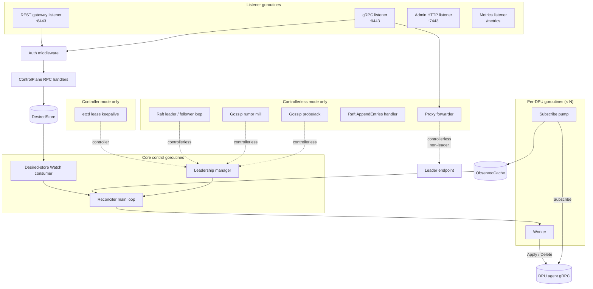
```mermaid
flowchart TB
    subgraph "Listener goroutines"
        L1[REST gateway listener<br/>:8443]
        L2[gRPC listener<br/>:9443]
        L3[Admin HTTP listener<br/>:7443]
        L4[Metrics listener<br/>/metrics]
    end

    subgraph "Core control goroutines"
        R[Reconciler main loop]
        SW[Desired-store Watch consumer]
        HA[Leadership manager]
    end

    subgraph "Per-DPU goroutines (× N)"
        W[Worker]
        SP[Subscribe pump]
    end

    subgraph "Controller mode only"
        EL[etcd lease keepalive]
    end

    subgraph "Controllerless mode only"
        GR[Gossip rumor mill]
        GP[Gossip probe/ack]
        RL[Raft leader / follower loop]
        RA[Raft AppendEntries handler]
        PR[Proxy forwarder]
    end

    L1 & L2 --> AUTH[Auth middleware]
    AUTH --> CP[ControlPlane RPC handlers]
    CP --> STORE[(DesiredStore)]
    STORE --> SW
    SW --> R
    R --> W
    W -->|Apply / Delete| DPU[(DPU agent gRPC)]
    SP -->|Subscribe| DPU
    SP --> CACHE[(ObservedCache)]
    CACHE --> R
    HA --> R
    EL -.->|controller| HA
    RL -.->|controllerless| HA
    GR & GP -.->|controllerless| HA
    L2 --> PR
    PR -.->|controllerless<br/>non-leader| FWD[Leader endpoint]
```

### 3.1 Goroutine inventory

| Goroutine | Count | Lifetime | Owner module |
|---|---|---|---|
| REST gateway | 1 | process | `server/rest` |
| gRPC listener | 1 | process | `server/grpc` |
| Admin HTTP | 1 | process | `server/admin` |
| Metrics listener | 1 | process | `observability` |
| Reconciler main loop | 1 | leader-only | `reconciler` |
| Desired-store Watch | 1 | process | `store` |
| Leadership manager | 1 | process | `ha` |
| Per-DPU Worker | N (= len(Inventory)) | leader-only | `dispatch` |
| Per-DPU Subscribe pump | N | leader-only | `subscribe` |
| etcd lease keepalive | 1 | leader-only (controller) | `ha/etcd_lease` |
| Gossip rumor mill | 1 | process (controllerless) | `gossip` |
| Gossip probe/ack | 1 | process (controllerless) | `gossip` |
| Raft loop | 1 | process (controllerless) | `raft` |
| Proxy forwarder | per-request | request (controllerless) | `proxy` |

### 3.2 Goroutine lifecycle rules

* All long-lived goroutines accept a `context.Context` and exit on
  cancellation.
* Per-DPU goroutines are children of a `leaderCtx` that is cancelled when
  this node loses leadership.
* `SIGTERM` / `SIGINT` cancels the process context, which propagates
  through all goroutines. Graceful shutdown order is specified in § 35.

---

## 4. Three-Space State Model

`dashd`'s data model has exactly three coordinate spaces, related by
deterministic transformations:

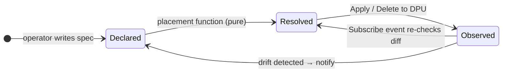
```mermaid
stateDiagram-v2
    direction LR
    [*] --> Declared : operator writes spec
    Declared --> Resolved : placement function (pure)
    Resolved --> Observed : Apply / Delete to DPU
    Observed --> Declared : drift detected → notify
    Observed --> Resolved : Subscribe event re-checks diff
```

| Space | Owner | Representation | Storage |
|---|---|---|---|
| **Declared** | operator | `dashcenter.v1` "spec" types: `VnetSpec`, `EniSpec`, `AclPolicySpec`, `RoutePolicySpec`, `HaSetSpec`, etc., plus `DpuRecord` for inventory | `DesiredStore` (file / etcd) |
| **Resolved** | `dashd` | `dashapi.v1.Object`s grouped by `DpuId`; produced by the **placement function** | derived; cached in `model.ResolvedView` (memory only) |
| **Observed** | DPU agents | `dashapi.v1.Object`s as actually present in each DPU's store | per-DPU; subscribed via `dashapi.v1.Subscribe`; cached in `model.ObservedCache` |

### 4.1 Reconciliation invariant

> For every DPU `d` in `Inventory`:
> `Resolved[d]` (from current `Declared` + `Inventory`) equals
> `Observed[d]` (modulo drift detection).

When the operator changes Declared OR a Subscribe event mutates
Observed, the reconciler emits per-DPU `Apply` / `Delete` calls to
re-establish the invariant.

### 4.2 Keying

All three spaces share the same key schema:

```
key = (namespace, kind, name)
```

* `namespace`: multi-tenancy boundary (see § 23). Default is
  `"default"`.
* `kind`: one of the 29 `dashapi.v1` ObjectKinds, or one of the higher-
  level `dashcenter.v1` types (e.g. `inventory`, `migration_session`,
  `ha_set`).
* `name`: unique within `(namespace, kind)`.

Generation counters (`generation int64`) are monotonic per key and
maintained by `DesiredStore`. Every Put RPC takes an
`expected_generation`; mismatches fail with `FAILED_PRECONDITION` (CAS).

---

## 5. `dashcenter.v1` Proto Surface

The `dashcenter.v1` proto surface lives under
[`proto/dashcenter/v1/`](../../proto/dashcenter/v1/). It is the
operator-facing northbound API consumed by `dashctl`, the Web Console,
and 3rd-party SDKs. It is intentionally distinct from `dashapi.v1` (the
per-DPU southbound contract): many `dashcenter.v1` specs trans-compile
into multiple `dashapi.v1.Object`s on multiple DPUs via the placement
function (§ 10) and the 5-stage write pipeline (§ 28).

### 5.1 File map

| File | Service | Responsibility |
|---|---|---|
| [`types.proto`](../../proto/dashcenter/v1/types.proto) | _(shared types)_ | `DpuIdentity`, `DpuState` (8-state lifecycle), `DpuCapacityLimits`, `DpuCapabilities` (13 capability flags), `Inventory`, generic envelopes (`Ack`, `NameRef`, `KindFilter`), `FlowTableStats`, `CounterReport` (30+ counters), `AuditEntry`. |
| [`control_plane.proto`](../../proto/dashcenter/v1/control_plane.proto) | `ControlPlane` | Per-kind `Put*` for `Vnet` / `Eni` / `VnetMapping` / `AclPolicy` / `RoutePolicy` / `HaSet` / `ServiceTunnel`; uniform `Delete` / `Get` / `List`; streamed `ApplyBatch` (transactional, all-or-nothing or `partial_ok`); unary `SimulateApply` (dry-run); `Reconcile`. Every spec carries `namespace` and `expected_generation`. |
| [`observability.proto`](../../proto/dashcenter/v1/observability.proto) | `ObservabilityService` | Streamed `GetDpuStatus`, `GetFlowList`, `GetCounters`, `WatchEvents`, `GetAuditLog`; unary `GetFlowStats`, `GetDrift`. Read-only telemetry. |
| [`diagnostics.proto`](../../proto/dashcenter/v1/diagnostics.proto) | `DiagnosticsService` | `TraceFlow`, `ExplainMatch`, streamed `GetAclHitStats`, `ExplainDrift`, `TriggerResimulation`. |
| [`operations.proto`](../../proto/dashcenter/v1/operations.proto) | `OperationsService` | `CordonDpu` / `UncordonDpu`; streamed `DrainDpu` with `DrainProgress` (planning → migrating → draining → complete). |
| [`migration.proto`](../../proto/dashcenter/v1/migration.proto) | `MigrationService` | Full 10-phase ENI live-migration state machine: `CreateMigrationPlan` / `ValidateMigrationPlan` / `StartMigrationSession` / `AdvanceMigrationPhase` (generation-gated) / `RollbackMigration` / `AbortMigration` / `CommitMigration`; streamed `StreamMigrationSession`; chunked `ExportMigrationBundle` / `ImportMigrationBundle`. Four `MigrationStrategy` variants: `NEW_FLOWS_FIRST_DRAIN` (default), `FULL_REHOME`, `MAINTENANCE_FAST`, `CANARY_SPLIT`. |
| [`ha.proto`](../../proto/dashcenter/v1/ha.proto) | `HaService` | `GetHaSetState` / `GetHaScopeState`; streamed `TriggerSwitchover` (planned, drains first) / `TriggerFailover` (unplanned, immediate); `WatchHaEvents`; `GetFlowSyncStats`. Mirrors the upstream 10-state DPU role machine (`HaScopeRole`, 12 values) and 5-state flow-sync state. |

### 5.2 Conventions enforced across the surface

* **Package**: `dashcenter.v1` everywhere.
* **Go package**: `github.com/rashmirrout/DashCenter/src/impl-go/gen/go/dashcenter/v1;dashcenterv1`.
* **Multi-tenancy**: every spec carries a `namespace` field. Cross-namespace
  references are rejected at validation time unless the target namespace
  exports the object.
* **Optimistic concurrency**: every `Put*` and every
  `AdvanceMigrationPhase` accepts an `expected_generation`. Mismatches
  return `FAILED_PRECONDITION`.
* **Streaming**: long-lived watches (`Get*`, `Watch*`, `Stream*`) use
  server-side keepalives; clients must be prepared for re-subscription.
* **Enums**: closed (`_UNSPECIFIED = 0`), additive — never reuse a number.
* **Audit**: every mutating call emits one `AuditEntry`, surfaced via
  `ObservabilityService.GetAuditLog`.

### 5.3 Coverage map vs. production-gap audit

The audit in
[`docs/dash-sim-alignment-audit.md`](../../docs/dash-sim-alignment-audit.md)
enumerated 21 production gaps. The proto surface covers the API-visible
portion of every gap. See the `Coverage map` table in
[`proto/dashcenter/v1/README.md`](../../proto/dashcenter/v1/README.md)
for the gap-to-RPC mapping.

### 5.4 Codegen

The `proto/` tree is auto-discovered by both pipelines:

* **buf**: `src/impl-go/codegen/buf/buf.gen.yaml` reads
  `inputs.directory: ../../../proto`.
* **protoc fallback**: `src/impl-go/codegen/protoc/protoc.mk` globs
  `*.proto` recursively under `proto/`.

Generated Go output lives at `src/impl-go/gen/go/dashcenter/v1/`.

---

## 6. Module: `internal/config/`

### 6.1 Responsibility

* Load `dashd.yaml` from the path given by `--config` (default
  `/etc/dashd/dashd.yaml`).
* Apply environment-variable overrides (`DASHD_LISTEN_GRPC_ADDR`, etc.).
* Apply flag overrides.
* Validate the merged config; reject startup if invalid.
* Expose an **immutable** `*Config` struct to all other modules.

### 6.2 Public interface

```go
package config

type Config struct {
    Mode      Mode             // "controller" | "controllerless"
    Node      NodeConfig       // node_id, advertise_addr
    Listen    ListenConfig     // rest_addr, grpc_addr, admin_addr, metrics_addr
    Storage   StorageConfig    // backend + per-backend config
    HA        HAConfig         // controller-mode etcd or controllerless raft
    Gossip    GossipConfig     // controllerless only
    Inventory InventoryConfig  // file vs api
    Reconcile ReconcileConfig  // tick, per-dpu inbox capacity, rate-limit
    Auth      AuthConfig       // token-in-header or oidc
    TLS       TLSConfig        // cert/key/client_ca
    Audit     AuditConfig      // sink, replicate (controllerless)
    Log       LogConfig        // level, format
    Tracing   TracingConfig    // otlp endpoint
}

type Mode string
const (
    ModeController     Mode = "controller"
    ModeControllerless Mode = "controllerless"
)

// Load returns a validated, immutable Config or an error.
func Load(path string, flagOverrides []string) (*Config, error)

// Validate is also exported so tests can run it without a file.
func (c *Config) Validate() error
```

### 6.3 Mode-conditional fields

| Mode | Required | Forbidden |
|---|---|---|
| `controller` | `ha.etcd_endpoints`, optionally `storage.etcd_endpoints` | `gossip`, `raft` blocks |
| `controllerless` | `gossip.bind_addr`, `gossip.seed_peers`, `raft.bind_addr`, `raft.data_dir`, `node.node_id` | `ha.etcd_endpoints` |

Validation rejects misconfigured combinations early at startup. Full YAML
schema is in § 34.

### 6.4 Reload policy

* **No live reload** in v1. Changing config requires `SIGTERM` + restart.
* In a leader-mode `dashd` cluster, restart one replica at a time;
  followers absorb the gap.

---

## 7. Module: `internal/store/`

### 7.1 Responsibility

Persistent store for **all declared state**:
* `dashcenter.v1` specs (Vnet, Eni, VnetMapping, AclPolicy, RoutePolicy,
  HaSet, ServiceTunnel);
* Inventory (`DpuRecord` per DPU);
* Migration sessions (their state-machine state);
* HA set states (their current operational state mirror).

### 7.2 Public interface

```go
package store

// DesiredStore is the storage abstraction. Implementations: FileStore,
// EtcdStore (controller mode), RaftStore (controllerless mode, fronted
// by the raft module).
type DesiredStore interface {
    // CAS write. expectedGen=-1 means "create or overwrite, ignore gen".
    Put(ctx context.Context, key Key, spec proto.Message, expectedGen int64) (PutResult, error)

    // Delete by key. Returns NotFound if absent.
    Delete(ctx context.Context, key Key, expectedGen int64) (DeleteResult, error)

    // Get one object.
    Get(ctx context.Context, key Key) (Record, error)

    // List by (namespace, kind). Optional name prefix filter.
    List(ctx context.Context, ns string, kind string, namePrefix string) ([]Record, error)

    // Watch emits every change since the start position (or "now" if empty).
    // Stream terminates only on context cancel or store closure.
    Watch(ctx context.Context, start string) (<-chan Event, error)

    // Snapshot writes a consistent point-in-time snapshot to w. Used by
    // RaftStore for log compaction and by /admin/snapshot.
    Snapshot(ctx context.Context, w io.Writer) (snapshotID string, err error)

    // Close blocks until all in-flight writes are durable.
    Close() error
}

type Key struct {
    Namespace string
    Kind      string
    Name      string
}

type PutResult struct {
    Generation int64
    CreatedAt  time.Time
    UpdatedAt  time.Time
}

type Record struct {
    Key
    Generation int64
    CreatedAt  time.Time
    UpdatedAt  time.Time
    Spec       proto.Message
}

type EventType int
const (
    EventPut EventType = iota
    EventDelete
)

type Event struct {
    Type   EventType
    Record Record
    Cursor string // opaque, monotonic; for resuming Watch
}
```

### 7.3 Implementations

#### 7.3.1 `FileStore`

* Backed by a directory tree under `--storage.file.state_dir`
  (default `/var/lib/dashd`).
* On-disk layout:

  ```
  state_dir/
    inventory/
      __meta.json
      dpu-0.json
      dpu-1.json
    vnet/
      default/
        vnet-1.json
        vnet-2.json
    eni/
      default/
        eni-1.json
    ...
    migration_session/
      default/
        session-abc.json
    audit.log    (audit module, not store)
    wal/
      000001.log
      000002.log
  ```

* **Atomic writes**: each Put is `write-temp + rename` on the per-key
  file plus an append to the current WAL segment. `Watch` tails the WAL.
* **Snapshot rotates WAL** to limit recovery time.
* **NOT FOR PRODUCTION** beyond single-node dev / CI.

#### 7.3.2 `EtcdStore` (controller mode)

* Key encoding: `/dashd/state/{namespace}/{kind}/{name}` →
  `protojson(Spec)`.
* `Generation` uses etcd's `mod_revision` directly.
* `Watch` uses etcd's native Watch API; `cursor` = `revision`.
* `Snapshot` issues `etcdctl snapshot save` equivalent via the v3 API.

#### 7.3.3 `RaftStore` (controllerless mode)

* Fronts a `FileStore` (or BoltDB) on disk.
* Every Put / Delete becomes a Raft log entry; the FSM applies it to the
  underlying file/boltdb when committed by quorum.
* `Watch` is a local subscription to FSM-applied events.
* Detailed contract is in § 19.

### 7.4 Mermaid: store layered architecture

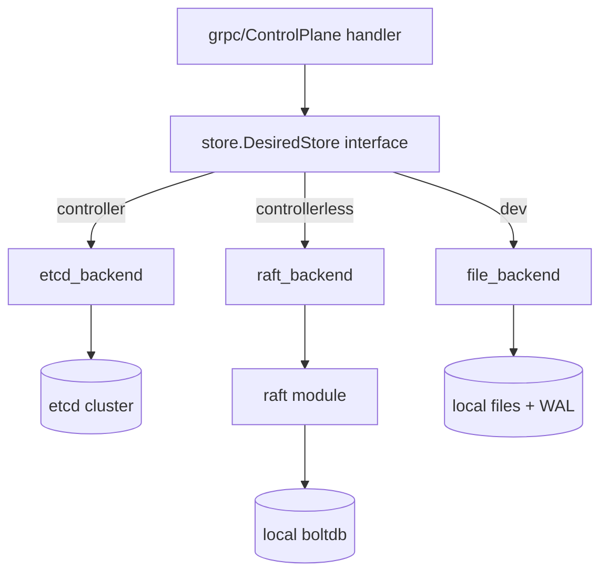
```mermaid
flowchart TD
    A[grpc/ControlPlane handler] --> B[store.DesiredStore interface]
    B -->|controller| C[etcd_backend]
    B -->|controllerless| D[raft_backend]
    B -->|dev| E[file_backend]
    C --> CC[(etcd cluster)]
    D --> DD[raft module] --> DE[(local boltdb)]
    E --> EE[(local files + WAL)]
```

---

## 8. Module: `internal/inventory/`

### 8.1 Responsibility

The single source of truth for **what DPUs exist** and **their state**.

* DPU identity (id, endpoint, mTLS cert pool, vendor, hardware caps).
* Capacity limits per DPU (ENI count, ACL rules count, route entries,
  flow capacity, etc.).
* Capabilities advertised by each DPU (`service_tunnel`, `ipv6`,
  `eni_live_migration`, ...).
* Lifecycle state for each DPU.
* Liveness probes (periodic `dashapi.v1.Get(vnet, "")` or no-op `List`).

### 8.2 DPU lifecycle state machine

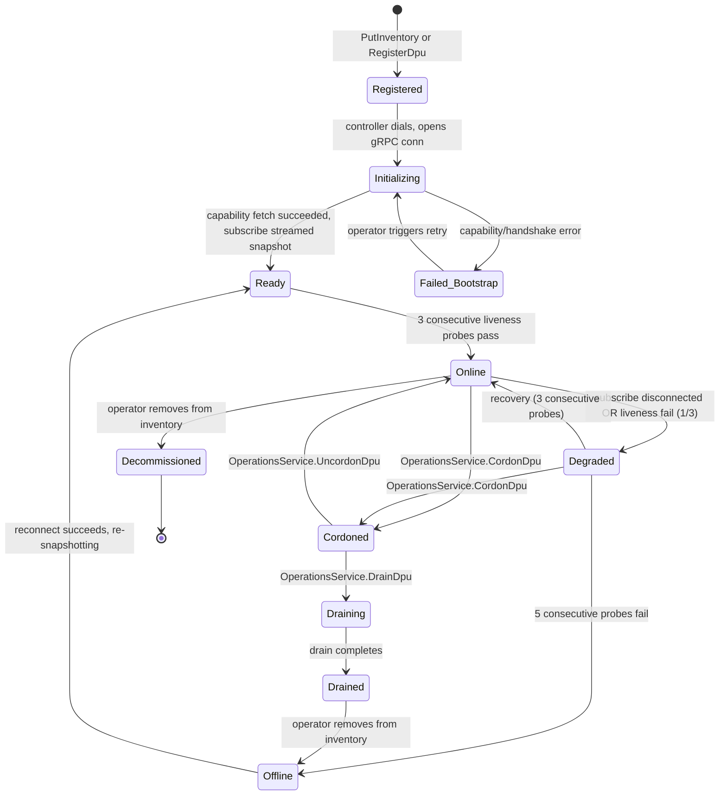
```mermaid
stateDiagram-v2
    [*] --> Registered : PutInventory or RegisterDpu
    Registered --> Initializing : controller dials, opens gRPC conn
    Initializing --> Ready : capability fetch succeeded, subscribe streamed snapshot
    Initializing --> Failed_Bootstrap : capability/handshake error
    Failed_Bootstrap --> Initializing : operator triggers retry
    Ready --> Online : 3 consecutive liveness probes pass
    Online --> Degraded : subscribe disconnected OR liveness fail (1/3)
    Degraded --> Online : recovery (3 consecutive probes)
    Degraded --> Offline : 5 consecutive probes fail
    Offline --> Ready : reconnect succeeds, re-snapshotting
    Online --> Cordoned : OperationsService.CordonDpu
    Degraded --> Cordoned : OperationsService.CordonDpu
    Cordoned --> Online : OperationsService.UncordonDpu
    Cordoned --> Draining : OperationsService.DrainDpu
    Draining --> Drained : drain completes
    Drained --> Offline : operator removes from inventory
    Online --> Decommissioned : operator removes from inventory
    Decommissioned --> [*]
```

The 8 primary states map to `dashcenter.v1.DpuState`:

| State | Apply allowed? | Subscribe active? | Liveness probe? |
|---|---|---|---|
| `Registered` | No | No | No |
| `Initializing` | No | No | Yes |
| `Ready` | No (init not done) | Yes (snapshot in flight) | Yes |
| `Online` | **Yes** | Yes | Yes |
| `Degraded` | Yes, with retries | Yes (reconnecting) | Yes |
| `Offline` | Queued | No | Yes (backoff) |
| `Cordoned` | No (drains writes) | Yes | Yes |
| `Draining` | No | Yes | Yes |
| `Drained` | No | No | No |
| `Decommissioned` | terminal | terminal | terminal |

### 8.3 Public interface

```go
package inventory

type Inventory interface {
    // Get returns the record for one DPU, or NotFound.
    Get(id string) (Record, bool)

    // List returns all current DPU records.
    List() []Record

    // Watch streams every membership change since the start position.
    Watch(ctx context.Context, start string) (<-chan Event, error)

    // SetState atomically transitions one DPU's lifecycle state.
    // Rejected if the transition is illegal per the state machine.
    SetState(id string, newState DpuState, reason string) error

    // RegisterDynamic adds a DPU from a self-registration RPC, after
    // credential validation.
    RegisterDynamic(rec Record) error

    // Remove deletes a DPU. Only allowed from terminal states
    // (Drained, Decommissioned).
    Remove(id string, reason string) error
}

type Record struct {
    Identity      DpuIdentity     // from dashcenter.v1.types
    Capabilities  DpuCapabilities // 13 flags
    Capacity      DpuCapacityLimits
    State         DpuState
    LastProbe     time.Time
    LastError     string
    Generation    int64
}
```

### 8.4 Inventory YAML format

```yaml
apiVersion: dashcenter.io/v1
kind: Inventory
metadata:
  cluster_name: rack-04-east
items:
  - id: dpu-0
    endpoint: "dpu-0.fleet.local:50051"
    advertise_addr: "10.0.0.10"
    vendor: bluefield3
    namespace: tenant-prod
    labels:
      role: edge-router
      rack: 04
    tls:
      ca_file: /etc/dashd/tls/dpu-0-ca.pem
      cert_file: /etc/dashd/tls/dashd-client.pem
      key_file:  /etc/dashd/tls/dashd-client-key.pem
```

### 8.5 Dynamic registration

DPUs may self-register via `ControlPlane.RegisterDpu(RegisterDpuRequest)`.
The handler:
1. Validates the DPU's mTLS cert against a configured CA bundle.
2. Verifies the requested `id` is not already registered (or matches the
   existing cert if re-registration).
3. Inserts into `DesiredStore` as `inventory/<id>.json`.
4. Returns `Ack{accepted=true}` with the assigned `generation`.

The dynamic flow is symmetric to the static YAML flow — both produce a
`DpuRecord` in `DesiredStore`. The Inventory module is the consumer.

### 8.6 Capacity admission control

When a `PutEni` RPC arrives, the validator (§ 14.1) checks against
`Inventory.Get(dpu_id).Capacity.MaxEnis` *before* writing to
`DesiredStore`. Over-capacity writes fail with
`RESOURCE_EXHAUSTED{remaining_quota}`.

---

## 9. Module: `internal/model/`

### 9.1 Responsibility

In-memory canonical model:
* `DesiredModel`: mirrors `DesiredStore` for fast O(1) lookups by
  `(namespace, kind, name)` and indexes by `vnet → enis`, `vnet → mappings`,
  `aclGroup → enis`, etc.
* `ObservedCache`: per-DPU `map[ObjectKey]*dashapi.v1.Object`, kept up to
  date by `subscribe/` module.
* `ResolvedView`: derived map `dpu_id → map[ObjectKey]*dashapi.v1.Object`
  produced by the placement function (re-computed on every dirty event).

### 9.2 Public interface

```go
package model

type DesiredModel interface {
    // GetSpec returns one spec by key. nil if absent.
    GetSpec(key store.Key) proto.Message

    // ListByKind returns every spec of one kind (optionally namespace-scoped).
    ListByKind(ns string, kind string) []proto.Message

    // Index lookups used by the placement function:
    EnisByVnet(ns, vnet string) []*dashcenterv1.EniSpec
    EnisByDpu(dpu string) []*dashcenterv1.EniSpec
    EnisByAclGroup(ns, group string) []*dashcenterv1.EniSpec

    // Reload reads a snapshot from DesiredStore (used on cold start
    // or after leadership change).
    Reload(ctx context.Context, store store.DesiredStore) error

    // Apply applies one store event in-memory (used by the Watch consumer).
    Apply(ev store.Event)
}

type ObservedCache interface {
    Get(dpu string, key ObjectKey) *dashapiv1.Object
    AllForDpu(dpu string) map[ObjectKey]*dashapiv1.Object
    Replace(dpu string, snapshot map[ObjectKey]*dashapiv1.Object)
    ApplyEvent(dpu string, ev *dashapiv1.SubscribeResponse)
}

type ObjectKey struct {
    Kind string
    Name string
}
```

### 9.3 Concurrency

* `DesiredModel` is single-writer (the store Watch consumer) /
  multi-reader (gRPC handlers, reconciler, dispatcher). Implemented as a
  `sync.RWMutex`-protected struct.
* `ObservedCache` is multi-writer (one Subscribe pump per DPU) /
  multi-reader. Implemented as a `sync.Map` of `dpu → *sync.RWMutex` +
  inner map.
* `ResolvedView` is never persisted; it is re-computed by the reconciler
  on every dirty event.

---

## 10. Module: `internal/placement/`

### 10.1 Responsibility

**The translator** from `dashcenter.v1` specs to per-DPU
`dashapi.v1.Object`s. This is the most algorithmically interesting module
in `dashd`.

The placement function is:
* **Pure** — same inputs always produce same outputs.
* **Deterministic** — output order is stable across runs (sort keys are
  defined per kind).
* **Side-effect-free** — does not touch the store, the cache, or the DPU.
* **Unit-testable** — given a static `DesiredModel` + `Inventory`, a test
  asserts the expected output.

### 10.2 Public interface

```go
package placement

type Engine interface {
    // Resolve returns the dashapi.v1.Objects that should be present on
    // the given DPU, given the current desired model and inventory.
    Resolve(dpu string, model model.DesiredModel, inv inventory.Inventory) []*dashapiv1.Object

    // ResolveAll returns the map for all DPUs.
    ResolveAll(model model.DesiredModel, inv inventory.Inventory) map[string][]*dashapiv1.Object
}
```

### 10.3 Per-kind placement rules

| `dashcenter.v1` spec | Target DPUs | Resulting `dashapi.v1` objects |
|---|---|---|
| `VnetSpec` | Every DPU that hosts at least one ENI in this VNET | `vnet` |
| `EniSpec` | The single DPU named by `dpu_id` | `eni` + 0..N `eni_route` |
| `VnetMappingSpec` | Every DPU that hosts ≥1 ENI in the same VNET | `vnet_mapping` |
| `AclPolicySpec` | Every DPU that hosts ≥1 ENI referencing this `acl_group_id` | `acl_group` + N `acl_rule` |
| `RoutePolicySpec` | Every DPU that hosts ≥1 ENI referencing this route group | `route_group` + N `route` |
| `HaSetSpec` | Every DPU listed in `member_dpus` | `ha_set` + `ha_set_config` |
| `ServiceTunnelSpec` | Every DPU that hosts ≥1 ENI bound to this tunnel | `tunnel` + 0..N `pa_validation` |

### 10.4 Dependency ordering (5 tiers)

For `Apply` operations, objects must be created in dependency order:

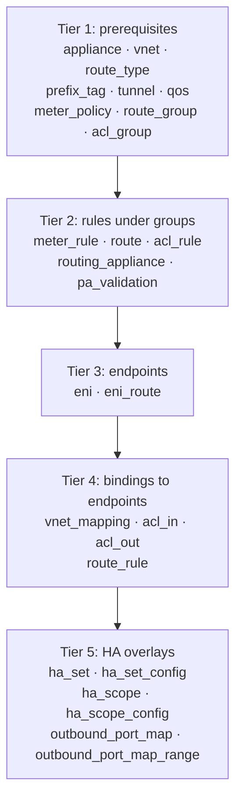
```mermaid
flowchart TD
    T1["Tier 1: prerequisites<br/>appliance · vnet · route_type<br/>prefix_tag · tunnel · qos<br/>meter_policy · route_group · acl_group"]
    T2["Tier 2: rules under groups<br/>meter_rule · route · acl_rule<br/>routing_appliance · pa_validation"]
    T3["Tier 3: endpoints<br/>eni · eni_route"]
    T4["Tier 4: bindings to endpoints<br/>vnet_mapping · acl_in · acl_out<br/>route_rule"]
    T5["Tier 5: HA overlays<br/>ha_set · ha_set_config<br/>ha_scope · ha_scope_config<br/>outbound_port_map · outbound_port_map_range"]
    T1 --> T2 --> T3 --> T4 --> T5
```

For `Delete` operations, order is **reversed** (Tier 5 first, then 4,
3, 2, 1). Within each tier, order is alphabetical by `(kind, name)` for
determinism.

### 10.5 Idempotence

The dispatcher's diff (§ 12.3) compares Resolved vs Observed by full
content (proto `Equal`). If an `Apply` is re-issued with the same spec,
the DPU agent returns `ack.accepted=true, applied=false` and no state
changes — by `dashapi.v1` contract.

### 10.6 Pseudocode

```go
func (e *Engine) Resolve(dpu string, m model.DesiredModel, inv inventory.Inventory) []*dashapiv1.Object {
    var out []*dashapiv1.Object

    // ENIs first — they're the placement anchor.
    enis := m.EnisByDpu(dpu)
    for _, eni := range enis {
        out = append(out, eniToDashApi(eni))
        out = append(out, eniRoutesToDashApi(eni)...)
    }

    // VNETs that this DPU needs (= union of vnets referenced by its ENIs).
    vnetIds := uniqueVnetIdsOf(enis)
    for _, vid := range vnetIds {
        if v := m.GetSpec(store.Key{Kind: "vnet", Name: vid}); v != nil {
            out = append(out, vnetToDashApi(v.(*dashcenterv1.VnetSpec)))
        }
    }

    // VnetMappings for each (vnet, ip) in those vnets.
    for _, vid := range vnetIds {
        for _, mp := range m.ListVnetMappingsByVnet(vid) {
            out = append(out, vnetMappingToDashApi(mp))
        }
    }

    // AclGroups referenced by any local ENI.
    aclGroupIds := uniqueAclGroupIdsOf(enis)
    for _, gid := range aclGroupIds {
        if g := m.GetSpec(store.Key{Kind: "acl_policy", Name: gid}); g != nil {
            grpObj, ruleObjs := aclPolicyToDashApi(g.(*dashcenterv1.AclPolicySpec))
            out = append(out, grpObj)
            out = append(out, ruleObjs...)
        }
    }

    // ... routes, HA, tunnels ...

    sortByTierThenKindThenName(out)
    return out
}
```

---

## 11. Module: `internal/subscribe/`

### 11.1 Responsibility

For every DPU in `Online` / `Degraded` / `Cordoned` / `Draining` state,
maintain a **long-lived `dashapi.v1.Subscribe` stream** that:
1. Receives an initial snapshot of every object on the DPU.
2. Streams every subsequent change as a `SubscribeResponse{event}`.
3. Reconnects with full snapshot on any error.

This populates `ObservedCache` and wakes the reconciler on every change.

### 11.2 Lifecycle

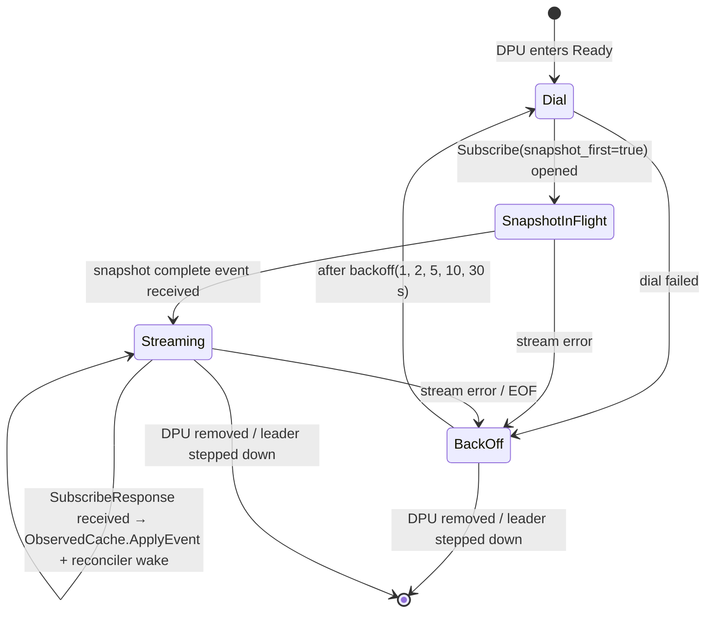
```mermaid
stateDiagram-v2
    [*] --> Dial : DPU enters Ready
    Dial --> SnapshotInFlight : Subscribe(snapshot_first=true) opened
    Dial --> BackOff : dial failed
    BackOff --> Dial : after backoff(1, 2, 5, 10, 30 s)
    SnapshotInFlight --> Streaming : snapshot complete event received
    SnapshotInFlight --> BackOff : stream error
    Streaming --> Streaming : SubscribeResponse received → ObservedCache.ApplyEvent + reconciler wake
    Streaming --> BackOff : stream error / EOF
    BackOff --> [*] : DPU removed / leader stepped down
    Streaming --> [*] : DPU removed / leader stepped down
```

### 11.3 Public interface

```go
package subscribe

type Pump interface {
    Start(ctx context.Context) error
    Stop()
    LastEventAt() time.Time
    State() State
}

type Manager interface {
    // EnsurePump starts a pump for the DPU if not already running.
    EnsurePump(dpu string) error

    // StopPump stops the pump for one DPU (used when DPU is decommissioned).
    StopPump(dpu string) error

    // StopAll stops all pumps (used on leadership loss / shutdown).
    StopAll()
}
```

### 11.4 Snapshot-on-reconnect invariant

Every reconnect issues `Subscribe(snapshot_first=true)`. The pump
**clears** `ObservedCache[dpu]` before the snapshot starts streaming, so
there is **no possibility of stale observed state** after a transient
disconnect.

### 11.5 Sequence: end-to-end observe path

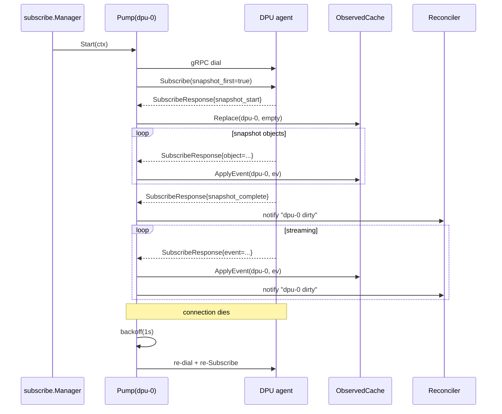
```mermaid
sequenceDiagram
    participant Mgr as subscribe.Manager
    participant Pump as Pump(dpu-0)
    participant DPU as DPU agent
    participant Cache as ObservedCache
    participant Recon as Reconciler

    Mgr->>Pump: Start(ctx)
    Pump->>DPU: gRPC dial
    Pump->>DPU: Subscribe(snapshot_first=true)
    DPU-->>Pump: SubscribeResponse{snapshot_start}
    Pump->>Cache: Replace(dpu-0, empty)
    loop snapshot objects
        DPU-->>Pump: SubscribeResponse{object=...}
        Pump->>Cache: ApplyEvent(dpu-0, ev)
    end
    DPU-->>Pump: SubscribeResponse{snapshot_complete}
    Pump->>Recon: notify "dpu-0 dirty"
    loop streaming
        DPU-->>Pump: SubscribeResponse{event=...}
        Pump->>Cache: ApplyEvent(dpu-0, ev)
        Pump->>Recon: notify "dpu-0 dirty"
    end
    Note over Pump,DPU: connection dies
    Pump->>Pump: backoff(1s)
    Pump->>DPU: re-dial + re-Subscribe
```

---

## 12. Module: `internal/dispatch/`

### 12.1 Responsibility

The **per-DPU worker pool**. One goroutine per DPU; owns one
`dashapi.v1.DashApi` gRPC client; issues `Apply` / `Delete` operations
sequenced by the placement-tier rules.

### 12.2 Public interface

```go
package dispatch

type Dispatcher interface {
    // Schedule wakes the worker for one DPU. Coalesces if already pending.
    Schedule(dpu string)

    // ScheduleAll wakes all workers.
    ScheduleAll()

    // EnsureWorker starts a worker for one DPU if not present.
    EnsureWorker(dpu string) error

    // StopWorker stops one worker (on DPU removal).
    StopWorker(dpu string) error

    // StopAll stops every worker (on leadership loss / shutdown).
    StopAll()
}

type Worker interface {
    Run(ctx context.Context)
    Schedule()
}
```

### 12.3 Worker run loop

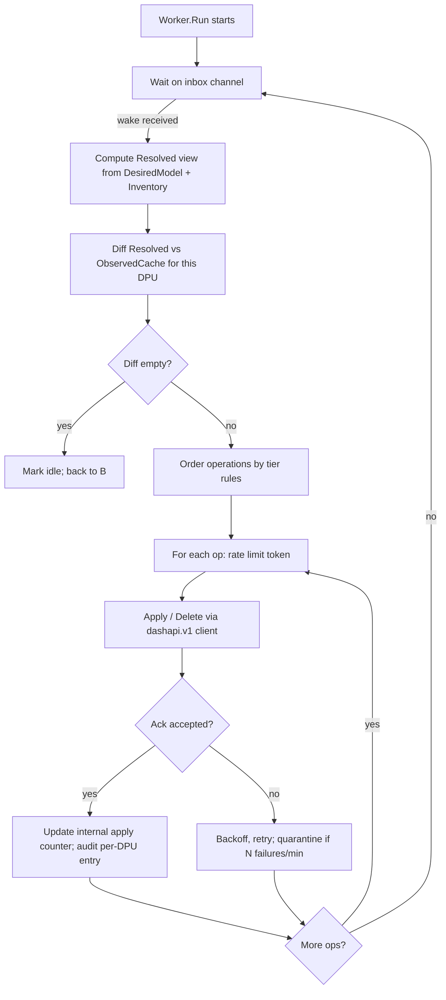
```mermaid
flowchart TD
    A[Worker.Run starts] --> B[Wait on inbox channel]
    B -->|wake received| C[Compute Resolved view from DesiredModel + Inventory]
    C --> D[Diff Resolved vs ObservedCache for this DPU]
    D --> E{Diff empty?}
    E -->|yes| F[Mark idle; back to B]
    E -->|no| G[Order operations by tier rules]
    G --> H[For each op: rate limit token]
    H --> I[Apply / Delete via dashapi.v1 client]
    I --> J{Ack accepted?}
    J -->|yes| K[Update internal apply counter; audit per-DPU entry]
    J -->|no| L[Backoff, retry; quarantine if N failures/min]
    K --> M{More ops?}
    L --> M
    M -->|yes| H
    M -->|no| B
```

### 12.4 Concurrency primitives

```go
type Worker struct {
    id        string
    client    dashapiv1.DashApiClient
    inbox     chan struct{}    // capacity 1, coalesces wakes
    rate      *rate.Limiter    // token bucket, default 100 ops/s
    quarantine *Quarantine     // see § 30
    audit     audit.Sink
}
```

### 12.5 Coalescing

The inbox is `chan struct{}` with capacity 1. `Schedule()` is:

```go
func (w *Worker) Schedule() {
    select {
    case w.inbox <- struct{}{}:
    default: // already pending, drop
    }
}
```

Result: bursts of 1,000 wakes for the same DPU collapse to a single
reconcile pass.

### 12.6 Diff algorithm

```go
func diff(resolved, observed map[ObjectKey]*dashapiv1.Object) (toApply, toDelete []*dashapiv1.Object) {
    for k, r := range resolved {
        o, ok := observed[k]
        if !ok || !proto.Equal(r, o) {
            toApply = append(toApply, r)
        }
    }
    for k, o := range observed {
        if _, ok := resolved[k]; !ok {
            toDelete = append(toDelete, o)
        }
    }
    return
}
```

### 12.7 Rate limiting and quarantine

* **Rate limit**: per-DPU token bucket, default 100 ops/s. Configurable
  via `reconcile.per_dpu_rate`.
* **Quarantine**: if a DPU returns > `quarantine.error_threshold` errors
  (default 50) in a 60 s window, the worker enters `QUARANTINED` state:
  * stops sending writes;
  * surfaces in `DpuStatusReport.health=quarantined`;
  * requires `OperationsService.UncordonDpu` or `--force-resume` to
    re-enter `Online`.

---

## 13. Module: `internal/reconciler/`

### 13.1 Responsibility

The **event + tick driven** main loop that turns store events and
observed events into per-DPU wakes.

### 13.2 Public interface

```go
package reconciler

type Reconciler interface {
    Run(ctx context.Context) error
    Stop()
    DirtySet() []string  // for /admin/drift
}
```

### 13.3 Main loop

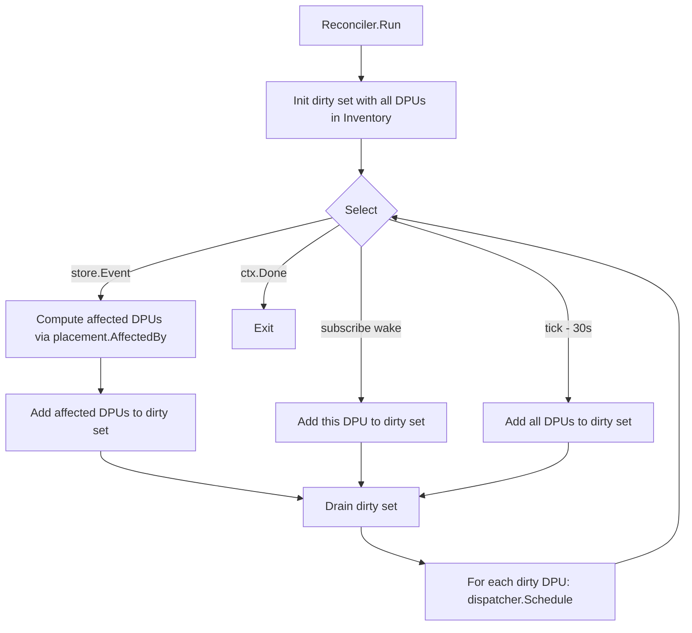
```mermaid
flowchart TD
    A[Reconciler.Run] --> B[Init dirty set with all DPUs in Inventory]
    B --> C{Select}
    C -->|store.Event| D[Compute affected DPUs via placement.AffectedBy]
    D --> E[Add affected DPUs to dirty set]
    C -->|subscribe wake| F[Add this DPU to dirty set]
    C -->|tick - 30s| G[Add all DPUs to dirty set]
    C -->|ctx.Done| H[Exit]
    E --> I[Drain dirty set]
    F --> I
    G --> I
    I --> J[For each dirty DPU: dispatcher.Schedule]
    J --> C
```

### 13.4 `placement.AffectedBy` helper

For each store event, the reconciler asks placement *which DPUs' Resolved
view depends on this key*:

```go
package placement

// AffectedBy returns the DPUs whose Resolve(...) output may change after
// this store event. Implementations should be conservative (overestimate
// is fine; underestimate is a bug).
func AffectedBy(ev store.Event, m model.DesiredModel) []string
```

Examples:
* `PutVnet(vnet-1)` → all DPUs hosting ENIs in vnet-1.
* `PutEni(eni-1)` → the DPU named in `eni-1.dpu_id`, plus (if this is a
  re-home) the previous DPU.
* `DeleteAclPolicy(grp-1)` → all DPUs whose ENIs reference grp-1.

### 13.5 Tick-driven full sweep

Every `reconcile.tick` interval (default 30 s) the reconciler marks every
Online DPU dirty. This is the safety net: even if a store event is lost
or a Subscribe event was missed during a brief disconnect, convergence
re-establishes itself within 30 s.

---

## 14. Module: `internal/server/grpc/`

### 14.1 Responsibility

Hosts all six `dashcenter.v1` services on `:9443`. Translates RPC calls
into operations on the rest of the system (Store, Reconciler,
Dispatcher, Observability, Diagnostics, Migration, HA).

Subdirectories:

```
server/
  grpc/
    server.go            // gRPC server setup, TLS, interceptors
    controlplane.go      // ControlPlane service
    observability.go     // ObservabilityService
    diagnostics.go       // DiagnosticsService
    operations.go        // OperationsService
    migration.go         // MigrationService
    ha.go                // HaService
    middleware/
      auth.go
      audit.go
      tracing.go
      rate_limit.go
```

### 14.2 Server setup

```go
package grpcserver

func New(cfg *config.Config, deps Deps) (*Server, error)

type Deps struct {
    Store        store.DesiredStore
    Model        model.DesiredModel
    Observed     model.ObservedCache
    Inventory    inventory.Inventory
    Reconciler   reconciler.Reconciler
    Dispatcher   dispatch.Dispatcher
    Subscriber   subscribe.Manager
    Migration    migration.Orchestrator
    Operations   operations.Orchestrator
    HA           ha.Service
    Auth         auth.Identifier
    Audit        audit.Sink
    Diagnostics  diagnostics.Service
    Leadership   ha.Leader
}
```

### 14.3 Service: `ControlPlane`

| RPC | Handler responsibilities |
|---|---|
| `PutInventory` | Validate; for each item, normalize → `DpuRecord`; CAS-write to `DesiredStore[inventory/*]`; audit; ack. Inventory module's Watch consumer reacts. |
| `RegisterDpu` | Validate DPU credentials; check duplicate; insert into inventory; audit; ack. |
| `PutVnet` / `PutEni` / `PutVnetMapping` / `PutAclPolicy` / `PutRoutePolicy` / `PutHaSet` / `PutServiceTunnel` | (1) Auth check; (2) namespace check; (3) per-kind semantic validation; (4) capacity admission (Eni only); (5) CAS write to store; (6) audit; (7) ack. |
| `Delete` | Auth + namespace + CAS delete + audit + ack. |
| `Get` | Auth + namespace check; read from `model.DesiredModel`; return. |
| `List` | Auth + namespace filter; read from model; return. |
| `ApplyBatch` (client-streaming) | Accumulate all items; validate as a unit; either commit all (transactional) or report per-item rejection (`partial_ok`). |
| `SimulateApply` | Read-only: compute the resulting Resolved view + diff against current Observed; return the planned op set without applying. |
| `Reconcile` | Force `dispatcher.ScheduleAll()`; return immediately. |

### 14.4 Service: `ObservabilityService`

| RPC | Handler |
|---|---|
| `GetDpuStatus` (streamed) | For each DPU id in request: serve a stream of `DpuStatusReport` (state, last apply time, drift summary, recent errors). Updates on every store / observed event. |
| `GetFlowList` (streamed) | Per DPU: call `dashapi.v1.GetFlowList` and forward. |
| `GetCounters` (streamed) | Per DPU: call `dashapi.v1.GetCounters` and forward; merge across DPUs if requested. |
| `WatchEvents` (streamed) | Multiplexes audit events, DPU lifecycle changes, migration progress, HA events. Filter by `event_kinds`. |
| `GetAuditLog` (streamed) | Reads the audit log (file / Raft-replicated) since the given cursor. |
| `GetFlowStats` | Aggregates `FlowTableStats` across DPUs in scope. |
| `GetDrift` | Returns the per-DPU drift summary (computed live by the dispatcher's diff). |

### 14.5 Service: `DiagnosticsService`

See § 27. Key handlers:

| RPC | Handler |
|---|---|
| `TraceFlow` | Build a synthetic packet from the request 5-tuple; for each DPU in path, call `dashapi.v1.TraceFlow` and stitch the pipeline reports together. |
| `ExplainMatch` | For one DPU + one packet: return ranked candidate ACL / route entries with rationale. |
| `GetAclHitStats` (streamed) | Long-running stream of ACL hit counters; can be filtered to surface dead rules (hit_count==0 over window). |
| `ExplainDrift` | Walks the dispatcher's diff for one DPU and returns human-readable causes (e.g. "vnet-1.vni changed from 100 to 200, requires re-apply"). |
| `TriggerResimulation` | Forces re-resolve on selected DPU(s) and returns the planned op set. |

### 14.6 Service: `OperationsService`

See § 22. Handlers map directly to `operations.Orchestrator` calls.

### 14.7 Service: `MigrationService`

See § 21. Handlers map directly to `migration.Orchestrator` calls.

### 14.8 Service: `HaService`

| RPC | Handler |
|---|---|
| `GetHaSetState` / `GetHaScopeState` | Read from `DesiredModel` (declared HA topology) and `ObservedCache` (per-DPU `ha_set` / `ha_scope` objects). Merge to produce the current operational state. |
| `TriggerSwitchover` (streamed) | Planned switchover: (1) drain new-flow traffic from primary; (2) flow-sync completion check; (3) issue DPU-level Apply to swap roles; (4) verify via Subscribe events; (5) emit progress events on stream. |
| `TriggerFailover` (streamed) | Unplanned: skip drain; immediate role swap; emit progress events. |
| `WatchHaEvents` (streamed) | Stream of HA role transitions and flow-sync state changes. |
| `GetFlowSyncStats` | Counters from the relevant DPUs' `CounterReport.flow_sync_*`. |

### 14.9 gRPC interceptors

Every RPC passes through a chain of unary / stream interceptors:

```
recover  →  tracing  →  auth  →  namespace  →  rate_limit  →  audit_pre  →  handler  →  audit_post
```

| Interceptor | Purpose |
|---|---|
| `recover` | Catch panics, return `Internal`, log + metric. |
| `tracing` | OTel span start, baggage propagation. |
| `auth` | Extract identity from mTLS cert / bearer token; reject if absent for mutating RPCs. |
| `namespace` | Verify request namespace is in caller's scope. |
| `rate_limit` | Per-caller / per-RPC rate limit (default 100 RPS). |
| `audit_pre` / `audit_post` | Emit `AuditEntry{started, finished, status, error}` for every mutating RPC. |

---

## 15. Module: `internal/server/rest/`

### 15.1 Responsibility

Generate a REST surface from the gRPC server using **gRPC-Gateway**.
Mounts on `:8443`. Translates HTTP requests to gRPC calls in-process,
then translates gRPC responses back to JSON.

### 15.2 HTTP↔RPC routing

| HTTP | Path | gRPC RPC |
|---|---|---|
| PUT | `/v1/inventory` | `ControlPlane.PutInventory` |
| GET | `/v1/inventory` | `ControlPlane.GetInventory` (alias to `List(kind=inventory)`) |
| POST | `/v1/dpus/{id}/register` | `ControlPlane.RegisterDpu` |
| PUT | `/v1/{ns}/vnets/{name}` | `ControlPlane.PutVnet` |
| PUT | `/v1/{ns}/enis/{name}` | `ControlPlane.PutEni` |
| PUT | `/v1/{ns}/vnet-mappings/{vnet}/{ip}` | `ControlPlane.PutVnetMapping` |
| PUT | `/v1/{ns}/acl-policies/{name}` | `ControlPlane.PutAclPolicy` |
| PUT | `/v1/{ns}/route-policies/{name}` | `ControlPlane.PutRoutePolicy` |
| PUT | `/v1/{ns}/ha-sets/{name}` | `ControlPlane.PutHaSet` |
| PUT | `/v1/{ns}/service-tunnels/{name}` | `ControlPlane.PutServiceTunnel` |
| DELETE | `/v1/{ns}/{kind}/{name}` | `ControlPlane.Delete` |
| GET | `/v1/{ns}/{kind}/{name}` | `ControlPlane.Get` |
| GET | `/v1/{ns}/{kind}` | `ControlPlane.List` |
| POST | `/v1/apply-batch` | `ControlPlane.ApplyBatch` (streaming over WS) |
| POST | `/v1/simulate-apply` | `ControlPlane.SimulateApply` |
| POST | `/v1/reconcile` | `ControlPlane.Reconcile` |
| GET | `/v1/dpus/{id}/status` | `ObservabilityService.GetDpuStatus` (SSE) |
| GET | `/v1/{ns}/drift` | `ObservabilityService.GetDrift` |
| GET | `/v1/events` | `ObservabilityService.WatchEvents` (SSE) |
| GET | `/v1/audit` | `ObservabilityService.GetAuditLog` (SSE) |
| POST | `/v1/diagnostics/trace-flow` | `DiagnosticsService.TraceFlow` |
| POST | `/v1/diagnostics/explain-match` | `DiagnosticsService.ExplainMatch` |
| POST | `/v1/{ns}/operations/cordon/{dpu}` | `OperationsService.CordonDpu` |
| POST | `/v1/{ns}/operations/uncordon/{dpu}` | `OperationsService.UncordonDpu` |
| POST | `/v1/{ns}/operations/drain/{dpu}` | `OperationsService.DrainDpu` (SSE) |
| POST | `/v1/{ns}/migrations` | `MigrationService.StartMigrationSession` |
| POST | `/v1/{ns}/migrations/{id}/advance` | `MigrationService.AdvanceMigrationPhase` |
| POST | `/v1/{ns}/migrations/{id}/commit` | `MigrationService.CommitMigration` |
| POST | `/v1/{ns}/migrations/{id}/rollback` | `MigrationService.RollbackMigration` |
| POST | `/v1/{ns}/migrations/{id}/abort` | `MigrationService.AbortMigration` |
| GET | `/v1/{ns}/migrations/{id}` | `MigrationService.StreamMigrationSession` (SSE) |
| POST | `/v1/{ns}/ha-sets/{name}/switchover` | `HaService.TriggerSwitchover` (SSE) |
| POST | `/v1/{ns}/ha-sets/{name}/failover` | `HaService.TriggerFailover` (SSE) |
| GET | `/v1/{ns}/ha-sets/{name}` | `HaService.GetHaSetState` |
| GET | `/v1/{ns}/ha-events` | `HaService.WatchHaEvents` (SSE) |

### 15.3 JSON conventions

* protojson encoding: snake_case field names; enums as strings.
* Timestamps: RFC3339.
* Errors: `{ "code": "<grpc-code>", "message": "...", "details": [...] }`.
* Streaming responses: SSE (`Content-Type: text/event-stream`) for browsers,
  newline-delimited JSON for `curl --no-buffer`.

---

## 16. Module: `internal/server/admin/`

### 16.1 Responsibility

Operator-debug HTTP surface on `:7443`. **Not** part of the
`dashcenter.v1` API contract — these endpoints can change between
releases.

### 16.2 Endpoints

| Method | Path | Purpose |
|---|---|---|
| GET | `/admin/health` | `{status: "ok"\|"degraded", dpus: {dpu-0: "online", ...}, leader: bool}` |
| GET | `/admin/leader` | `{node_id: "...", role: "leader"\|"follower", term: 7, leader_endpoint: "..."}` |
| GET | `/admin/inventory` | dump of `Inventory.List()` |
| GET | `/admin/desired?ns=&kind=` | dump declared state, filtered |
| GET | `/admin/observed?dpu=` | dump observed cache for one DPU |
| GET | `/admin/resolved?dpu=` | dump resolved view (placement output) for one DPU |
| GET | `/admin/drift?dpu=` | computed add / update / remove queue per DPU |
| POST | `/admin/reconcile?dpu=` | force one or all DPUs into the dirty set |
| POST | `/admin/snapshot` | snapshot the desired store; returns snapshot ID |
| GET | `/admin/config` | dump effective config (secrets redacted) |
| GET | `/admin/version` | `{version, commit, build_date, go_version}` |
| GET | `/debug/pprof/*` | Go pprof handlers (gated by `admin.debug_pprof: true`) |

### 16.3 Auth

Admin endpoints require `role=admin`. In dev mode (`auth.mode: none`)
they are open to localhost only.

---

## 17. Module: `internal/ha/` — Controller-mode HA

### 17.1 Responsibility

Provides the **`Leader` abstraction** used by every other module that
needs to know "should I be running cluster-active work?". Two
implementations:

* `etcd_lease.Leader` — controller mode
* `raft_leadership.Leader` — controllerless mode (see § 19)

```go
package ha

type Leader interface {
    // Run blocks until leadership is acquired or ctx is cancelled.
    Run(ctx context.Context) error

    // IsLeader reports whether this node currently holds leadership.
    IsLeader() bool

    // OnLeadershipChange subscribes to leadership transitions.
    OnLeadershipChange(fn func(isLeader bool))

    // LeaderEndpoint returns the gRPC endpoint of the current leader
    // (for proxy / redirect). Empty if unknown.
    LeaderEndpoint() string
}
```

### 17.2 `etcd_lease.Leader` implementation

* On `Run`, acquires a session on `/dashd/leader/<cluster_name>` with TTL
  from `ha.lease_ttl` (default 15 s).
* Spawns a keepalive goroutine that renews the lease every `lease_ttl/3`.
* On successful acquisition, sets `IsLeader() = true` and notifies
  subscribers.
* If the lease key contains the endpoint of the current holder, followers
  expose it via `LeaderEndpoint()` for redirect responses.

### 17.3 Leader state machine

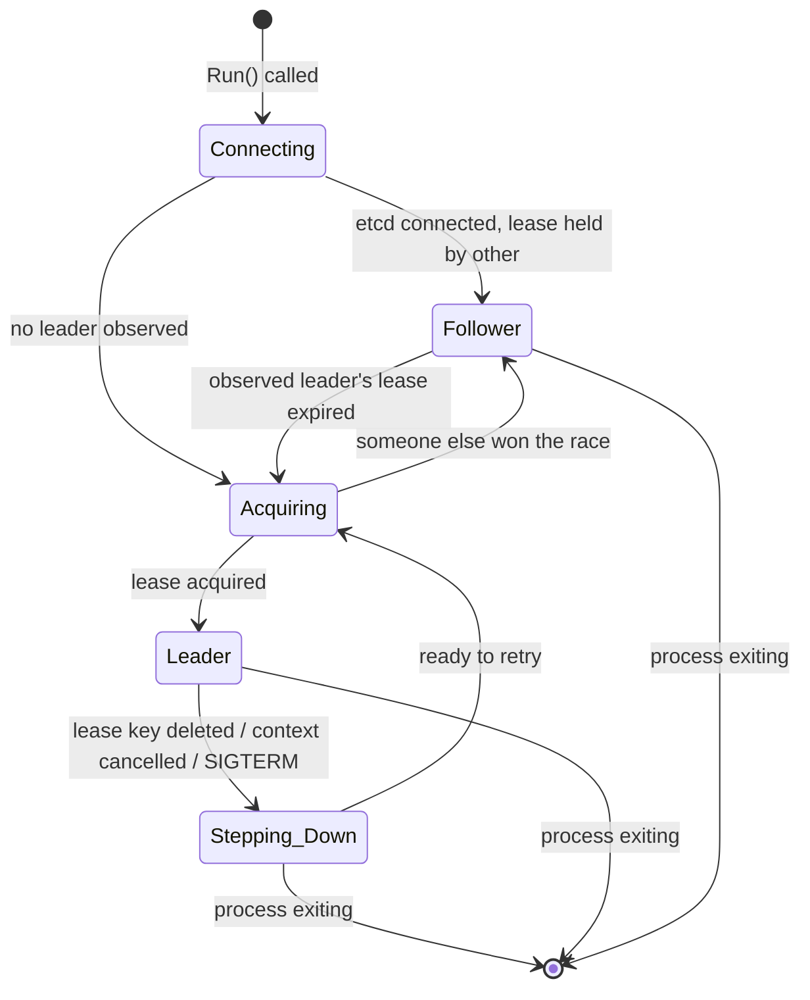
```mermaid
stateDiagram-v2
    [*] --> Connecting : Run() called
    Connecting --> Follower : etcd connected, lease held by other
    Connecting --> Acquiring : no leader observed
    Acquiring --> Leader : lease acquired
    Acquiring --> Follower : someone else won the race
    Follower --> Acquiring : observed leader's lease expired
    Leader --> Stepping_Down : lease key deleted / context cancelled / SIGTERM
    Stepping_Down --> Acquiring : ready to retry
    Stepping_Down --> [*] : process exiting
    Leader --> [*] : process exiting
    Follower --> [*] : process exiting
```

### 17.4 Effect on other modules

| Module | Action on `Leader → true` | Action on `Leader → false` |
|---|---|---|
| Reconciler | `Run(leaderCtx)` | cancel `leaderCtx`; stop loop |
| Subscribe Manager | start pumps for every DPU | stop all pumps |
| Dispatcher | start workers for every DPU | stop all workers |
| Migration orchestrator | resume in-flight sessions from store | quiesce |
| HA orchestrator (HaService) | resume in-flight switchovers | quiesce |
| grpc `ControlPlane` mutating handlers | accept writes | reject with `FAILED_PRECONDITION{leader_endpoint=...}` |
| grpc read-only handlers | accept | accept |

### 17.5 Stepping-down sequence

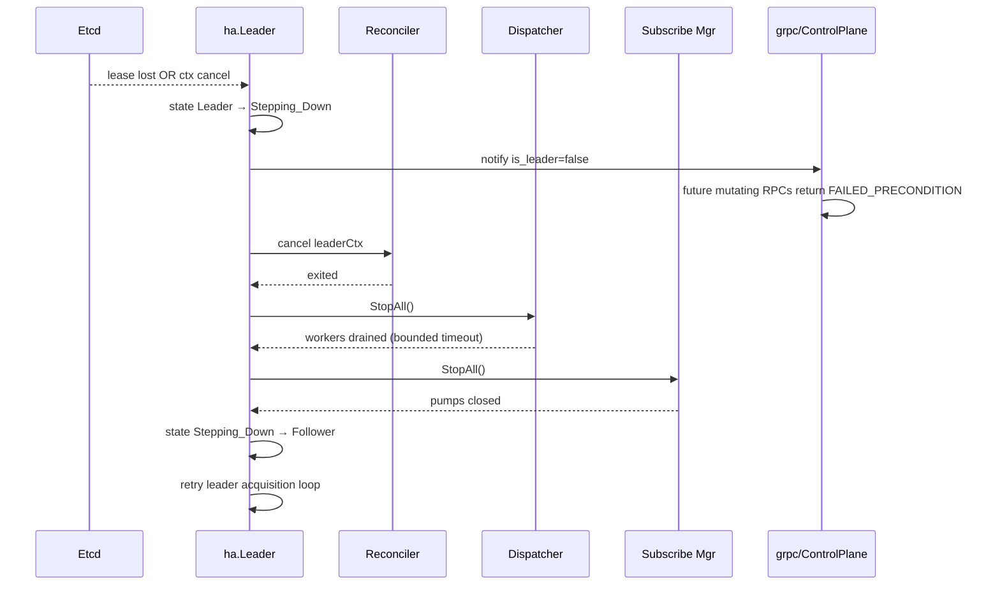
```mermaid
sequenceDiagram
    participant Etcd
    participant HA as ha.Leader
    participant Recon as Reconciler
    participant Disp as Dispatcher
    participant Sub as Subscribe Mgr
    participant GRPC as grpc/ControlPlane

    Etcd-->>HA: lease lost OR ctx cancel
    HA->>HA: state Leader → Stepping_Down
    HA->>GRPC: notify is_leader=false
    GRPC->>GRPC: future mutating RPCs return FAILED_PRECONDITION
    HA->>Recon: cancel leaderCtx
    Recon-->>HA: exited
    HA->>Disp: StopAll()
    Disp-->>HA: workers drained (bounded timeout)
    HA->>Sub: StopAll()
    Sub-->>HA: pumps closed
    HA->>HA: state Stepping_Down → Follower
    HA->>HA: retry leader acquisition loop
```

End-to-end stepdown budget: ~5 s in steady state (etcd TTL).

---

## 18. Module: `internal/gossip/` — Controllerless

### 18.1 Responsibility

SWIM-style gossip protocol for membership + soft state. Used **only in
controllerless mode**. Built on `hashicorp/memberlist`.

* Liveness / failure detection: 1 s suspicion timer, 5 s confirm.
* Soft state: each node gossips its current `role_hint` (Master /
  Secondary / Backup), Raft term, build version, load metrics.
* Anti-entropy: every 30 s, two random peers exchange full member tables.

### 18.2 Public interface

```go
package gossip

type Member struct {
    NodeID        string
    AdvertiseAddr string
    State         MemberState  // Alive | Suspect | Faulty
    RoleHint      RoleHint     // Master | Secondary | Backup | Voter | Unknown
    RaftTerm      uint64       // hint, may lag actual Raft state
    BuildVersion  string
    LoadMetrics   LoadSnapshot
}

type Manager interface {
    // Start joins the cluster using the seed list.
    Start(ctx context.Context) error

    // Members returns the current member list snapshot.
    Members() []Member

    // SetLocalSoftState publishes our own role hint, etc.
    SetLocalSoftState(s LocalSoftState)

    // OnMemberChange subscribes to membership transitions.
    OnMemberChange(fn func(ev MemberEvent))

    // Leave gracefully announces departure.
    Leave() error
}
```

### 18.3 Member state machine

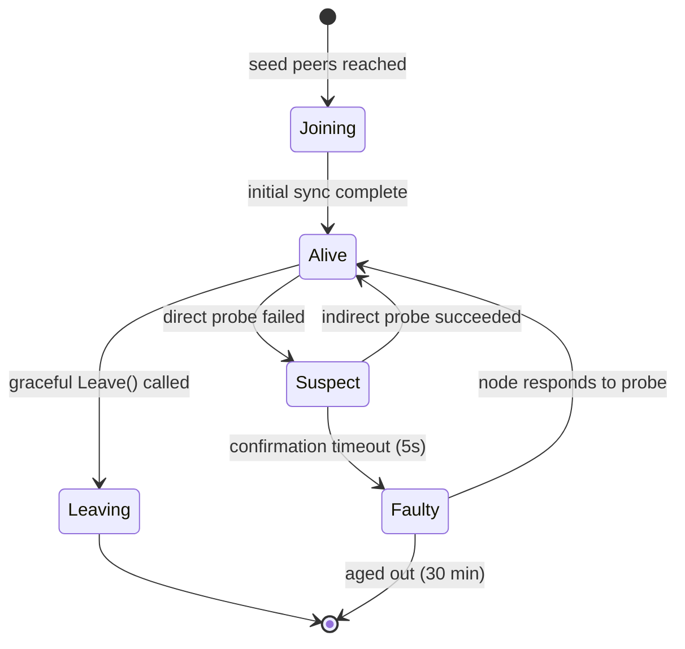
```mermaid
stateDiagram-v2
    [*] --> Joining : seed peers reached
    Joining --> Alive : initial sync complete
    Alive --> Suspect : direct probe failed
    Suspect --> Alive : indirect probe succeeded
    Suspect --> Faulty : confirmation timeout (5s)
    Faulty --> Alive : node responds to probe
    Alive --> Leaving : graceful Leave() called
    Leaving --> [*]
    Faulty --> [*] : aged out (30 min)
```

### 18.4 Soft-state schema

```go
type LocalSoftState struct {
    RoleHint     RoleHint
    RaftTerm     uint64
    BuildVersion string
    Load         LoadSnapshot   // cpu_percent, mem_mb, open_subscribers
}
```

Soft state is **advisory only**. Authoritative role assignment comes
from Raft (§ 19). The hint accelerates client routing: when a non-leader
node receives a write, it consults its gossip leader-hint table before
asking Raft "who is leader right now?".

### 18.5 Interaction with HA

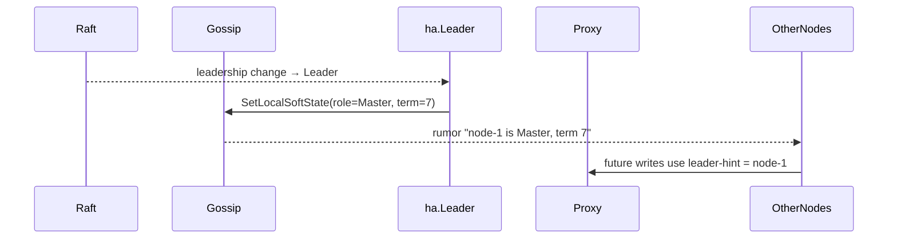
```mermaid
sequenceDiagram
    participant Raft
    participant Gossip
    participant HA as ha.Leader
    participant Proxy

    Raft-->>HA: leadership change → Leader
    HA->>Gossip: SetLocalSoftState(role=Master, term=7)
    Gossip-->>OtherNodes: rumor "node-1 is Master, term 7"
    OtherNodes->>Proxy: future writes use leader-hint = node-1
```

---

## 19. Module: `internal/raft/` — Controllerless

### 19.1 Responsibility

Replicated state machine over `DesiredStore` writes. Used **only in
controllerless mode**. Built on `hashicorp/raft` (Go) with BoltDB log
store.

Every `DesiredStore.Put` / `Delete` becomes a Raft log entry; the FSM
applies it to a local boltdb when committed by quorum.

### 19.2 Raft state machine

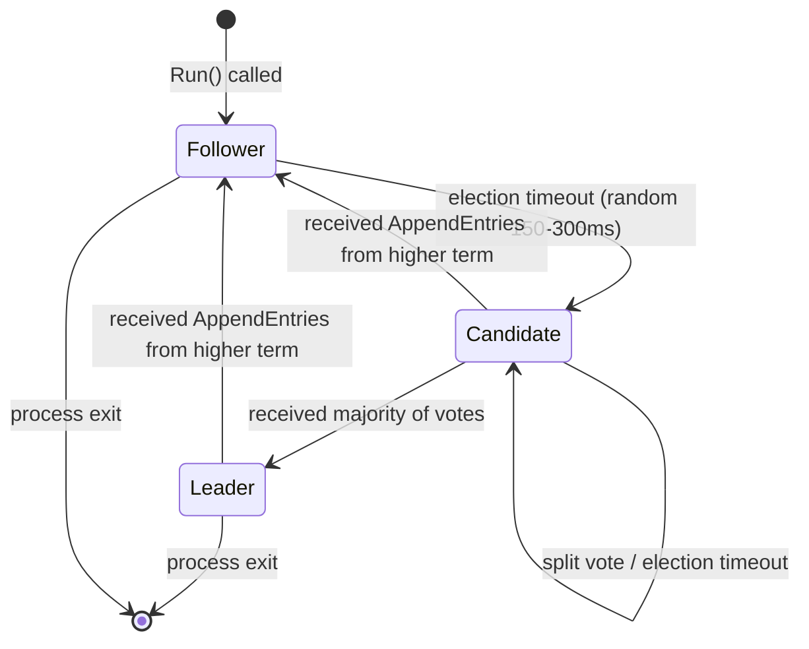
```mermaid
stateDiagram-v2
    [*] --> Follower : Run() called
    Follower --> Candidate : election timeout (random 150-300ms)
    Candidate --> Leader : received majority of votes
    Candidate --> Follower : received AppendEntries from higher term
    Candidate --> Candidate : split vote / election timeout
    Leader --> Follower : received AppendEntries from higher term
    Leader --> [*] : process exit
    Follower --> [*] : process exit
```

### 19.3 Log entry schema

Every committed entry is one of:

| Entry type | Payload | FSM action |
|---|---|---|
| `STORE_PUT` | `{key, spec_bytes, expected_gen, new_gen}` | Write to boltdb; bump generation; emit local Watch event |
| `STORE_DELETE` | `{key, expected_gen}` | Delete from boltdb; emit local Watch event |
| `INVENTORY_UPDATE` | `{dpu_id, state, reason}` | Update inventory state |
| `MIGRATION_PHASE` | `{session_id, new_phase, generation}` | Update migration session state |
| `HA_OPERATION` | `{ha_set_id, op_type, payload}` | Update HA orchestrator state |
| `AUDIT_ENTRY` | `AuditEntry` (only if `audit.replicate: true`) | Append to audit log |

### 19.4 Public interface

```go
package raft

type FSM interface {
    Apply(entry LogEntry) ApplyResult
    Snapshot() (FSMSnapshot, error)
    Restore(io.ReadCloser) error
}

type Node interface {
    // Run starts the Raft loop.
    Run(ctx context.Context) error

    // Propose submits a log entry. Blocks until committed by quorum or
    // returns an error (timeout, not-leader, etc.).
    Propose(entry LogEntry, timeout time.Duration) (ApplyResult, error)

    // State returns current Raft state.
    State() RaftState

    // Leader returns the current leader's node_id, "" if unknown.
    Leader() string

    // OnLeadershipChange subscribes to leadership transitions.
    OnLeadershipChange(fn func(isLeader bool))
}
```

### 19.5 RaftStore wiring

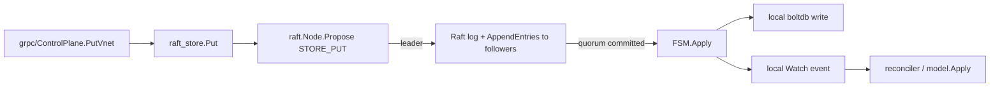
```mermaid
flowchart LR
    A[grpc/ControlPlane.PutVnet] --> B[raft_store.Put]
    B --> C[raft.Node.Propose STORE_PUT]
    C -->|leader| D[Raft log + AppendEntries to followers]
    D -->|quorum committed| E[FSM.Apply]
    E --> F[local boltdb write]
    E --> G[local Watch event]
    G --> H[reconciler / model.Apply]
```

### 19.6 Snapshot & log compaction

* Raft snapshots are taken every 10,000 log entries OR every 24 hours.
* Snapshot = bolt-db dump + a metadata file `(last_applied_index,
  last_applied_term)`.
* On node restart: load snapshot → replay any subsequent log entries.
* On lagging follower catch-up: leader sends `InstallSnapshot` if the
  follower is too far behind to replay log entries individually.

### 19.7 Membership changes

Adding or removing a node uses Raft's `ConfigChange` mechanism (joint
consensus). Triggered by `dashctl cluster add-node` / `remove-node`,
which call an admin RPC that issues the change via the current leader.

---

## 20. Module: `internal/proxy/` — Controllerless

### 20.1 Responsibility

The **"login anywhere" router**. Implements transparent server-side
proxying when a non-leader node receives a write or a strongly-consistent
read. Hides the leader-election topology from clients.

### 20.2 Routing rules

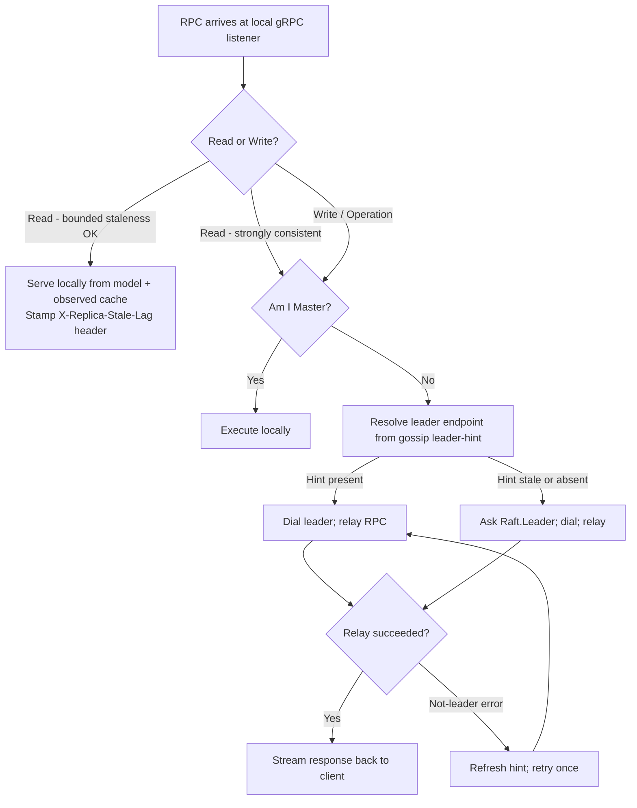
```mermaid
flowchart TD
    A[RPC arrives at local gRPC listener] --> B{Read or Write?}
    B -->|Read - bounded staleness OK| C[Serve locally from model + observed cache<br/>Stamp X-Replica-Stale-Lag header]
    B -->|Read - strongly consistent| D{Am I Master?}
    B -->|Write / Operation| D
    D -->|Yes| E[Execute locally]
    D -->|No| F[Resolve leader endpoint from gossip leader-hint]
    F -->|Hint present| G[Dial leader; relay RPC]
    F -->|Hint stale or absent| H[Ask Raft.Leader; dial; relay]
    G --> I{Relay succeeded?}
    H --> I
    I -->|Yes| J[Stream response back to client]
    I -->|Not-leader error| K[Refresh hint; retry once]
    K --> G
```

### 20.3 Public interface

```go
package proxy

type Router interface {
    // ShouldProxy decides whether a given RPC must be forwarded to leader.
    ShouldProxy(method string) Decision

    // Forward establishes a server-streaming RPC to the leader and pipes
    // both directions.
    Forward(ctx context.Context, leader string, method string, in proto.Message) (out proto.Message, err error)
}

type Decision struct {
    Strategy ProxyStrategy  // Local | ProxyToLeader | LocalReadStale
    Reason   string
}
```

### 20.4 Per-RPC routing table

| RPC | Strategy |
|---|---|
| `ControlPlane.Put*` / `Delete` / `ApplyBatch` | `ProxyToLeader` |
| `ControlPlane.Get` / `List` (default) | `LocalReadStale` |
| `ControlPlane.Get` / `List` with `consistency=STRONG` header | `ProxyToLeader` |
| `ControlPlane.SimulateApply` | `ProxyToLeader` (needs latest model) |
| `ControlPlane.Reconcile` | `ProxyToLeader` |
| `ObservabilityService.GetDpuStatus` (own DPU) | `Local` |
| `ObservabilityService.GetDpuStatus` (other DPU) | `ProxyToLeader` |
| `ObservabilityService.GetCounters` | `Local` (own DPU) or `ProxyToLeader` (cross-fleet) |
| `ObservabilityService.WatchEvents` | `Local` for own-DPU subset; `ProxyToLeader` for cluster events |
| `MigrationService.*` mutating | `ProxyToLeader` |
| `MigrationService.StreamMigrationSession` | `ProxyToLeader` |
| `OperationsService.*` mutating | `ProxyToLeader` |
| `HaService.Trigger*` | `ProxyToLeader` |
| `DiagnosticsService.TraceFlow` | `ProxyToLeader` (may need multi-DPU coord) |
| Admin `/admin/*` | `Local` (informational about this node) |

### 20.5 Stale-read headers

When `LocalReadStale` is used, the response includes:

```
X-Replica-Stale: true
X-Replica-Lag-Ms: 42
X-Leader-Endpoint: dpu-01.fleet.local:9443
```

Clients that need strong consistency can opt in via:

```
X-Consistency: strong
```

### 20.6 Stale leader hint handling

If the hinted leader is itself a follower, it returns
`FAILED_PRECONDITION{leader_endpoint=...}`. The proxy refreshes its hint
and retries **once**. After two failed retries, the original error is
returned to the client.

---

## 21. Module: `internal/migration/`

### 21.1 Responsibility

ENI live migration orchestration. Implements the 10-phase state machine
defined in `dashcenter.v1.MigrationService`.

### 21.2 Migration session state machine

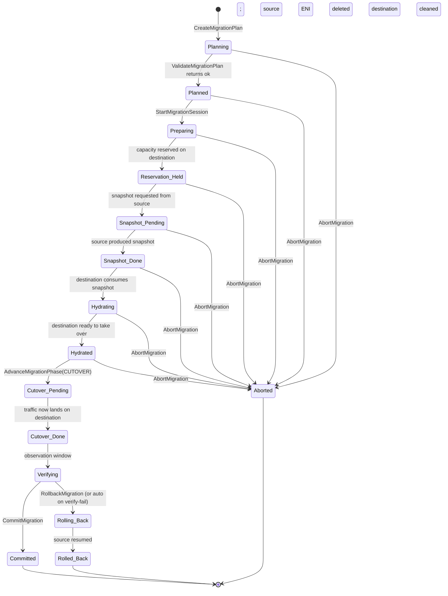
```mermaid
stateDiagram-v2
    [*] --> Planning : CreateMigrationPlan
    Planning --> Planned : ValidateMigrationPlan returns ok
    Planned --> Preparing : StartMigrationSession
    Preparing --> Reservation_Held : capacity reserved on destination
    Reservation_Held --> Snapshot_Pending : snapshot requested from source
    Snapshot_Pending --> Snapshot_Done : source produced snapshot
    Snapshot_Done --> Hydrating : destination consumes snapshot
    Hydrating --> Hydrated : destination ready to take over
    Hydrated --> Cutover_Pending : AdvanceMigrationPhase(CUTOVER)
    Cutover_Pending --> Cutover_Done : traffic now lands on destination
    Cutover_Done --> Verifying : observation window
    Verifying --> Committed : CommitMigration; source ENI deleted
    Verifying --> Rolling_Back : RollbackMigration (or auto on verify-fail)
    Rolling_Back --> Rolled_Back : source resumed; destination cleaned
    Committed --> [*]
    Rolled_Back --> [*]

    Planning --> Aborted : AbortMigration
    Planned --> Aborted : AbortMigration
    Preparing --> Aborted : AbortMigration
    Reservation_Held --> Aborted : AbortMigration
    Snapshot_Pending --> Aborted : AbortMigration
    Snapshot_Done --> Aborted : AbortMigration
    Hydrating --> Aborted : AbortMigration
    Hydrated --> Aborted : AbortMigration
    Aborted --> [*]
```

### 21.3 Strategies

| Strategy | Cutover semantics | Best for |
|---|---|---|
| `NEW_FLOWS_FIRST_DRAIN` (default) | New flows land on destination; existing flows drain on source over a TTL window; cutover when remaining_flow_count < threshold | Most workloads; minimizes disruption |
| `FULL_REHOME` | Immediate cutover; existing flows broken or re-handshaked | Cold workloads; lab; testing |
| `MAINTENANCE_FAST` | Skip flow-drain; assume operator pre-drained at L4; immediate cutover | Maintenance windows |
| `CANARY_SPLIT` | Probabilistic split (e.g. 5% destination); promote to 100% via repeated `AdvanceMigrationPhase` | Validating destination behavior |

### 21.4 Public interface

```go
package migration

type Orchestrator interface {
    CreatePlan(req *dashcenterv1.CreateMigrationPlanRequest) (*dashcenterv1.MigrationPlan, error)
    ValidatePlan(plan *dashcenterv1.MigrationPlan) error
    StartSession(plan *dashcenterv1.MigrationPlan) (*Session, error)
    Advance(sessionID string, expectedPhase Phase) (Phase, error)
    Rollback(sessionID string) error
    Abort(sessionID string) error
    Commit(sessionID string) error
    Stream(ctx context.Context, sessionID string) (<-chan SessionEvent, error)
    Get(sessionID string) (*Session, bool)
}

type Session struct {
    ID            string
    Plan          *dashcenterv1.MigrationPlan
    Phase         Phase
    Generation    int64
    History       []PhaseTransition
    LastError     string
    StartedAt     time.Time
    UpdatedAt     time.Time
}
```

### 21.5 Per-phase actions

| Phase | Source DPU actions | Destination DPU actions |
|---|---|---|
| Planning / Planned | none | none |
| Preparing | (none) | capacity check |
| Reservation_Held | (none) | reserve ENI slot (apply soft `eni` with `reserved=true`) |
| Snapshot_Pending | snapshot ENI state (counters, flows, ARP cache); produce blob | (waits) |
| Snapshot_Done | (waits) | (waits) |
| Hydrating | (still serving) | apply ENI + restore flows from snapshot blob |
| Hydrated | mark ENI as `migrating_source` | mark ENI as `migrating_target` |
| Cutover_Pending | apply route weight adjustment per strategy | apply route weight adjustment per strategy |
| Cutover_Done | flows drain | new flows land |
| Verifying | observation window (e.g. 60 s); flow counters reported | observation window |
| Committed | delete `eni` | promote `eni` (drop `migrating_target` flag) |
| Rolling_Back | re-apply route weights to 100% source | clean up `eni`, release reservation |

### 21.6 Persistence

Each `Session` is persisted as `migration_session/{namespace}/{id}.json`
in `DesiredStore` so it survives leader failover. On resume, the
orchestrator's `Restore()` walks all sessions in non-terminal phases
and continues from the persisted phase.

### 21.7 Crash safety

* Every `Advance` is gated by `expected_generation` (mismatches return
  `FAILED_PRECONDITION`). Generation is bumped on every transition.
* The state machine is **forward-only** except for `Rollback` and
  `Abort`. If a node crashes mid-phase, the resumed orchestrator re-tries
  the **idempotent** action for the current phase.
* `Apply` operations to source/destination DPUs are reconciler-driven
  (declared state in store → reconciler converges) — they are inherently
  idempotent.

---

## 22. Module: `internal/operations/`

### 22.1 Responsibility

Cordon, drain, uncordon, and other DPU-lifecycle operations exposed via
`OperationsService`.

### 22.2 Cordon semantics

* `Cordon(dpu)` transitions the DPU from `Online → Cordoned`. Effect:
  the placement function continues to include this DPU in resolution
  (existing objects remain), but new ENI placements onto this DPU are
  rejected with `RESOURCE_EXHAUSTED{reason="dpu_cordoned"}`.
* `Uncordon(dpu)` transitions `Cordoned → Online`.

### 22.3 Drain workflow

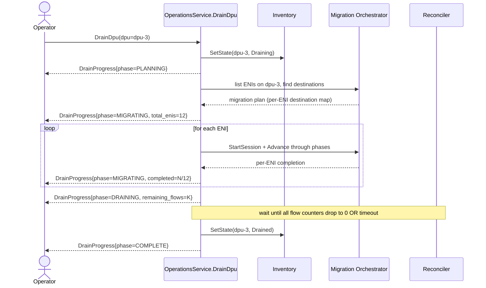
```mermaid
sequenceDiagram
    actor Op as Operator
    participant Ops as OperationsService.DrainDpu
    participant Inv as Inventory
    participant Mig as Migration Orchestrator
    participant Recon as Reconciler

    Op->>Ops: DrainDpu(dpu=dpu-3)
    Ops->>Inv: SetState(dpu-3, Draining)
    Ops-->>Op: DrainProgress{phase=PLANNING}
    Ops->>Mig: list ENIs on dpu-3, find destinations
    Mig-->>Ops: migration plan (per-ENI destination map)
    Ops-->>Op: DrainProgress{phase=MIGRATING, total_enis=12}
    loop for each ENI
        Ops->>Mig: StartSession + Advance through phases
        Mig-->>Ops: per-ENI completion
        Ops-->>Op: DrainProgress{phase=MIGRATING, completed=N/12}
    end
    Ops-->>Op: DrainProgress{phase=DRAINING, remaining_flows=K}
    Note over Ops,Recon: wait until all flow counters drop to 0 OR timeout
    Ops->>Inv: SetState(dpu-3, Drained)
    Ops-->>Op: DrainProgress{phase=COMPLETE}
```

### 22.4 Public interface

```go
package operations

type Orchestrator interface {
    Cordon(dpu string, reason string) error
    Uncordon(dpu string) error
    Drain(ctx context.Context, dpu string, opts DrainOptions) (<-chan DrainProgress, error)
    EniMigrationLink(eni string, targetDpu string) (string, error) // returns session ID
}

type DrainOptions struct {
    Strategy       dashcenterv1.MigrationStrategy
    FlowDrainTTL   time.Duration   // default 5 min
    MaxConcurrent  int             // default 4 ENIs in flight at once
}
```

---

## 23. Module: `internal/namespace/`

### 23.1 Responsibility

Multi-tenant isolation. Every `dashcenter.v1` spec carries a `namespace`
field (defaulting to `"default"`). The namespace module:

* Enforces that cross-namespace references in specs are rejected at
  validation time, unless the target namespace exports the object.
* Provides namespace-aware `List` filtering.
* Maps RBAC tokens / mTLS identities to a set of accessible namespaces.

### 23.2 Public interface

```go
package namespace

type Manager interface {
    Get(name string) (*Namespace, bool)
    List() []*Namespace
    Create(spec *NamespaceSpec) error
    Delete(name string) error

    // CanAccess returns true if the identity's allowed namespaces
    // include the requested namespace.
    CanAccess(id auth.Identity, ns string) bool

    // ValidateReference checks that a cross-namespace reference is
    // permitted (target namespace must export the referenced object).
    ValidateReference(fromNs, toNs, kind, name string) error
}

type Namespace struct {
    Name        string
    Description string
    Exports     []ExportRule  // which objects this ns exports for cross-ns ref
    Quotas      Quotas        // optional per-ns quotas (max ENIs, etc.)
}
```

### 23.3 Storage

Namespaces are themselves `dashcenter.v1` resources, persisted in
`DesiredStore` under `namespace/{name}.json`. They are bootstrapped by a
hard-coded `default` namespace on first start.

---

## 24. Module: `internal/auth/`

### 24.1 Responsibility

Identify the caller of every RPC; expose `Identity` to handlers and
interceptors.

### 24.2 Public interface

```go
package auth

type Identifier interface {
    // FromContext extracts and validates identity from incoming gRPC
    // metadata or HTTP headers.
    FromContext(ctx context.Context) (Identity, error)
}

type Identity struct {
    Subject      string         // user / service principal
    Roles        []Role         // viewer | operator | admin
    Namespaces   []string       // accessible namespaces; ["*"] for all
    AuthMethod   string         // "mtls" | "token" | "oidc" | "none"
    CertSubject  string         // for mTLS
}

type Role string
const (
    RoleViewer    Role = "viewer"
    RoleOperator  Role = "operator"
    RoleAdmin     Role = "admin"
)
```

### 24.3 Implementations

| Provider | Source of identity | Notes |
|---|---|---|
| `none` (dev only) | always returns `anonymous` with `admin` role | rejected in prod by config validator |
| `token-in-header` | bearer token; mapped to identity via `auth.tokens.yaml` | suitable for scripts, CI |
| `mtls` | peer cert subject; mapped via `auth.cert_subjects.yaml` | preferred production |
| `oidc` | OIDC ID token (Azure AD, Google, Okta); claims mapped via `auth.oidc.claim_mapping` | preferred enterprise |

### 24.4 RBAC matrix

| Role | Read RPCs | Mutating RPCs | Operational RPCs | Admin endpoints |
|---|---|---|---|---|
| `viewer` | ✓ | ✗ | ✗ | ✗ |
| `operator` | ✓ | ✓ | ✓ (cordon/drain) | ✗ |
| `admin` | ✓ | ✓ | ✓ + failover | ✓ |

### 24.5 Future work

* SPIFFE / SPIRE workload identities.
* Per-resource ACLs (e.g. "this service principal can only write to
  `enis/eni-7`").

---

## 25. Module: `internal/audit/`

### 25.1 Responsibility

Append-only audit log. **Exactly one** entry per mutating RPC.

### 25.2 Entry schema

```protobuf
message AuditEntry {
  string         entry_id        = 1;  // UUIDv7
  google.protobuf.Timestamp ts   = 2;
  string         caller_subject  = 3;
  string         caller_role     = 4;
  string         namespace       = 5;
  string         rpc             = 6;  // e.g. "ControlPlane.PutVnet"
  string         resource_kind   = 7;
  string         resource_name   = 8;
  int64          previous_gen    = 9;
  int64          new_gen         = 10;
  string         outcome         = 11; // "ok" | "rejected" | "error"
  string         error           = 12; // empty on ok
  bytes          request_digest  = 13; // SHA-256 of request payload
  string         trace_id        = 14; // OTel trace ID
}
```

### 25.3 Public interface

```go
package audit

type Sink interface {
    // Append writes one entry. Must be durable before returning.
    Append(entry *dashcenterv1.AuditEntry) error

    // Stream returns entries since the given cursor.
    Stream(ctx context.Context, since string) (<-chan *dashcenterv1.AuditEntry, error)

    // Close flushes any buffered state.
    Close() error
}
```

### 25.4 Implementations

* `file_sink`: append to `<state_dir>/audit.log`; rotate at 100 MB;
  retain N rotations.
* `raft_sink` (controllerless, opt-in): proposes each entry as a Raft
  log entry of type `AUDIT_ENTRY` so the audit log itself is replicated
  and survives single-node loss.
* `syslog_sink`: send to local syslog.
* (Future) `kafka_sink`.

### 25.5 Read API

`ObservabilityService.GetAuditLog(GetAuditLogRequest)` streams entries
matching filters (namespace, caller, resource_kind, time range). It is
backed directly by `audit.Sink.Stream`.

---

## 26. Module: `internal/observability/`

### 26.1 Responsibility

Centralized telemetry setup:
* `slog` JSON logger configured with level + output.
* Prometheus registry + `/metrics` endpoint.
* OTel tracer provider + OTLP exporter.

### 26.2 Metrics catalog (full)

| Metric | Type | Labels | Description |
|---|---|---|---|
| `dashd_build_info` | Gauge | version, commit, go_version | Always 1; for grouping. |
| `dashd_leader` | Gauge | node_id | 1 if this node is leader, 0 otherwise. |
| `dashd_raft_term` | Gauge | node_id | Current Raft term (controllerless only). |
| `dashd_raft_state` | Gauge | node_id, state | 1 for current state (Follower/Candidate/Leader). |
| `dashd_gossip_members` | Gauge | node_id, state | Members per state (Alive/Suspect/Faulty). |
| `dashd_desired_objects` | Gauge | namespace, kind | Count of declared specs per kind. |
| `dashd_observed_objects` | Gauge | dpu, kind | Count of observed objects per DPU per kind. |
| `dashd_drift_objects` | Gauge | dpu, kind, op | Count of pending add/update/remove per DPU. |
| `dashd_dpu_health` | Gauge | dpu, state | 1 for current DPU state (8 states). |
| `dashd_reconcile_runs_total` | Counter | result | success / error. |
| `dashd_apply_total` | Counter | dpu, kind, accepted | Cumulative Apply attempts. |
| `dashd_apply_latency_seconds` | Histogram | dpu, kind | Apply RPC latency. |
| `dashd_delete_total` | Counter | dpu, kind, accepted | Cumulative Delete attempts. |
| `dashd_subscribe_disconnects_total` | Counter | dpu | Subscribe stream resets. |
| `dashd_subscribe_events_total` | Counter | dpu, type | Snapshot / streaming event counts. |
| `dashd_grpc_requests_total` | Counter | service, method, code | Request rates per RPC. |
| `dashd_grpc_request_latency_seconds` | Histogram | service, method | Server-side latency. |
| `dashd_audit_entries_total` | Counter | rpc, outcome | Cumulative audit entries. |
| `dashd_migration_sessions` | Gauge | phase | Sessions per phase. |
| `dashd_migration_advance_total` | Counter | phase, outcome | Phase advances. |
| `dashd_ha_switchover_total` | Counter | ha_set, outcome | Switchover attempts. |
| `dashd_quarantined_dpus` | Gauge | dpu | 1 if quarantined. |
| `dashd_rate_limited_requests_total` | Counter | caller, rpc | RPCs rejected by per-caller rate limit. |
| `dashd_capacity_rejections_total` | Counter | dpu, kind | Writes rejected for capacity. |

### 26.3 Tracing

Span tree for a typical write:

```
PUT /v1/default/enis/eni-1
└─ grpc ControlPlane.PutEni
   ├─ auth.FromContext
   ├─ namespace.ValidateReference
   ├─ inventory.CapacityCheck(dpu-0)
   ├─ store.Put
   │  └─ raft.Propose (controllerless only)
   ├─ audit.Append
   └─ reconciler.Notify
      └─ dispatch.Schedule(dpu-0)
         └─ (later, async)
            ├─ placement.Resolve(dpu-0)
            └─ dashapi.DashApi.Apply(eni)
```

### 26.4 Logging

Structured `slog` with these standard fields:
* `level`, `ts`, `msg`
* `trace_id`, `span_id`
* `caller_subject` (when in RPC context)
* `dpu`, `kind`, `name` (when applicable)

Output: JSON to stdout. Log level configurable via `--log-level` or
config. Future: dynamic log level adjustment via admin RPC.

---

## 27. Module: `internal/diagnostics/`

### 27.1 Responsibility

Implements `DiagnosticsService`. The "explain what's happening" surface.

### 27.2 TraceFlow pipeline

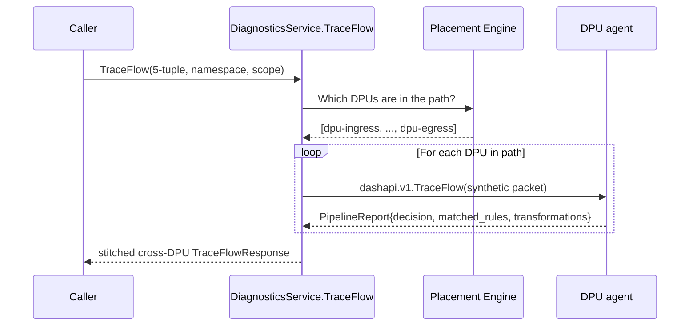
```mermaid
sequenceDiagram
    participant Caller
    participant Diag as DiagnosticsService.TraceFlow
    participant Place as Placement Engine
    participant DPU as DPU agent

    Caller->>Diag: TraceFlow(5-tuple, namespace, scope)
    Diag->>Place: Which DPUs are in the path?
    Place-->>Diag: [dpu-ingress, ..., dpu-egress]
    loop For each DPU in path
        Diag->>DPU: dashapi.v1.TraceFlow(synthetic packet)
        DPU-->>Diag: PipelineReport{decision, matched_rules, transformations}
    end
    Diag-->>Caller: stitched cross-DPU TraceFlowResponse
```

### 27.3 ExplainMatch

For one DPU + one packet, returns the top-K candidate rules with:
* whether the rule matched (yes/no/partial);
* per-field match score;
* rationale: which fields tipped the decision.

### 27.4 ACL hit stats

* `GetAclHitStats(streaming)` periodically polls each DPU's per-rule hit
  counters and streams a roll-up to the client.
* Dead-rule detection: rules with `hit_count == 0` over a 24 h window are
  flagged. The Web Console can render these for cleanup.

### 27.5 ExplainDrift

Walks the dispatcher's diff for one DPU and translates each pending op
into human-readable English (e.g. "vnet-1.vni changed from 100 to 200,
requires re-apply"). Used by the Console "drift" view.

### 27.6 TriggerResimulation

Forces a fresh placement resolution for one DPU and returns the new
plan. Useful after schema changes or library version updates.

---

## 28. 5-Stage Write Pipeline

The full lifecycle of a single mutating RPC (e.g. `PutEni`):

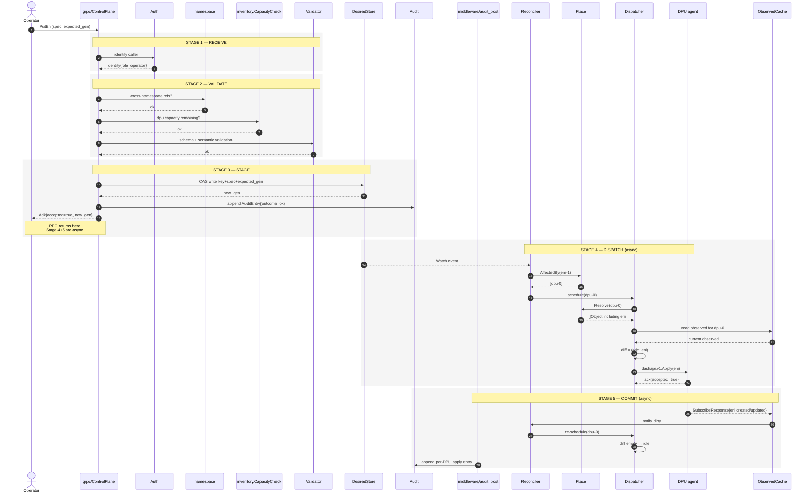
```mermaid
sequenceDiagram
    autonumber
    actor Op as Operator
    participant API as grpc/ControlPlane
    participant Auth
    participant Ns as namespace
    participant Cap as inventory.CapacityCheck
    participant Val as Validator
    participant Store as DesiredStore
    participant Audit
    participant Mw as middleware/audit_post
    participant Recon as Reconciler
    participant Place
    participant Disp as Dispatcher
    participant DPU as DPU agent
    participant Cache as ObservedCache

    Op->>API: PutEni(spec, expected_gen)

    rect rgb(245,245,245)
        note over API,Val: STAGE 1 — RECEIVE
        API->>Auth: identify caller
        Auth-->>API: identity{role=operator}
    end

    rect rgb(245,245,245)
        note over API,Val: STAGE 2 — VALIDATE
        API->>Ns: cross-namespace refs?
        Ns-->>API: ok
        API->>Cap: dpu capacity remaining?
        Cap-->>API: ok
        API->>Val: schema + semantic validation
        Val-->>API: ok
    end

    rect rgb(245,245,245)
        note over API,Store: STAGE 3 — STAGE
        API->>Store: CAS write key+spec+expected_gen
        Store-->>API: new_gen
        API->>Audit: append AuditEntry(outcome=ok)
        API-->>Op: Ack{accepted=true, new_gen}
        Note over API,Op: RPC returns here.<br/>Stage 4+5 are async.
    end

    rect rgb(245,245,245)
        note over Recon,DPU: STAGE 4 — DISPATCH (async)
        Store-->>Recon: Watch event
        Recon->>Place: AffectedBy(eni-1)
        Place-->>Recon: [dpu-0]
        Recon->>Disp: schedule(dpu-0)
        Disp->>Place: Resolve(dpu-0)
        Place-->>Disp: []Object including eni
        Disp->>Cache: read observed for dpu-0
        Cache-->>Disp: current observed
        Disp->>Disp: diff = (add: eni)
        Disp->>DPU: dashapi.v1.Apply(eni)
        DPU-->>Disp: ack{accepted=true}
    end

    rect rgb(245,245,245)
        note over Cache,Mw: STAGE 5 — COMMIT (async)
        DPU-->>Cache: SubscribeResponse{eni created/updated}
        Cache->>Recon: notify dirty
        Recon->>Disp: re-schedule(dpu-0)
        Disp->>Disp: diff empty → idle
        Mw->>Audit: append per-DPU apply entry
    end
```

### 28.1 Failure modes per stage

| Stage | Failure | Behavior |
|---|---|---|
| 1 Receive | Auth missing | `UNAUTHENTICATED` |
| 1 Receive | Auth invalid | `UNAUTHENTICATED` |
| 2 Validate | Cross-namespace ref denied | `PERMISSION_DENIED` |
| 2 Validate | Schema invalid | `INVALID_ARGUMENT` |
| 2 Validate | Capacity exceeded | `RESOURCE_EXHAUSTED` |
| 3 Stage | CAS gen mismatch | `FAILED_PRECONDITION` |
| 3 Stage | Store unavailable | `UNAVAILABLE`; RPC returns error |
| 3 Stage | Audit append fails | log + metric; **do not fail the RPC** (audit is best-effort) |
| 4 Dispatch | DPU unreachable | apply queued; retry with backoff; surfaced in DpuStatus |
| 4 Dispatch | DPU rejects apply | logged + audited per-DPU; surfaced; retried with backoff |
| 5 Commit | Subscribe event never arrives | reconciler's tick (30 s) re-checks; if still missing, alert via metric `dashd_drift_objects` |

---

## 29. Read Pipeline

### 29.1 Standard read

```mermaid
flowchart TD
    A[grpc/ControlPlane.Get] --> B[auth.FromContext]
    B --> C[namespace.CanAccess]
    C --> D[model.DesiredModel.GetSpec]
    D --> E[return]
```

* Served entirely from in-memory `DesiredModel`. Sub-millisecond.
* No DPU traffic.

### 29.2 Observed read

For `GetDpuStatus`:

```mermaid
flowchart TD
    A[grpc/ObservabilityService.GetDpuStatus] --> B[loop on subscription channel]
    B --> C[merge<br/>Inventory.Get dpu +<br/>ObservedCache.AllForDpu dpu +<br/>dispatcher drift summary +<br/>recent_errors ring buffer]
    C --> D[emit DpuStatusReport]
    D --> B
```

### 29.3 Live read (future)

`Get` with `?live=true` (or `consistency=STRONG`) issues a synchronous
`dashapi.v1.Get` to the relevant DPU before returning. Used for
forensics; bypasses the cache.

### 29.4 Streaming reads

All `Watch*` / `Stream*` RPCs are server-streaming gRPC. Backend
implementation:
* The handler subscribes to an internal in-memory event bus
  (`observability.EventBus`).
* Per-RPC filter (kinds, namespaces, dpu IDs) is applied before send.
* Keepalive frames every `streaming.keepalive_seconds` (default 30 s).
* Client expected to reconnect on disconnect; resume cursor is included
  in every event.

---

## 30. Concurrency & Back-Pressure Model

### 30.1 Goroutine fan-out

* **One** reconciler goroutine drains the dirty set and dispatches.
* **One** worker per DPU. Wakes coalesce via capacity-1 inbox.
* **One** Subscribe pump per DPU. Independent lifecycle from worker —
  even when reconciliation is paused (e.g. during failover), Observed
  state keeps tracking.
* **One** etcd lease keepalive (controller mode) or **one** Raft loop +
  **two** gossip goroutines (controllerless mode).

### 30.2 Rate limiting

| Limit | Default | Configurable |
|---|---|---|
| Per-DPU Apply rate | 100 ops/s | `reconcile.per_dpu_rate` |
| Per-caller RPC rate | 100 RPS | `middleware.rate_limit.per_caller_rps` |
| Per-RPC rate | unlimited (controlled by per-caller) | per-RPC overrides via config |
| Streaming send buffer | 100 events | `streaming.send_buffer` |

### 30.3 Back-pressure

* When a DPU is slow, the per-DPU worker's `Apply` calls block on the
  rate limiter. Wakes continue to coalesce in the inbox.
* When the streaming send buffer fills, the server-side stream returns
  `RESOURCE_EXHAUSTED` to the slow consumer and closes the stream.
  Client must reconnect with the latest cursor.
* When the reconciler is backed up, the desired-store Watch consumer
  pauses (channel blocks). Etcd / Raft will buffer up to its own limit;
  beyond that, Watch reconnects with a fresh cursor.

### 30.4 Quarantine

Per-DPU error budget: > 50 errors in 60 s → state `QUARANTINED`. While
quarantined:
* dispatcher worker stops sending Apply / Delete (Subscribe pump
  continues);
* `Apply` to a quarantined DPU returns `RESOURCE_EXHAUSTED{reason=
  "dpu_quarantined"}`;
* operator must `Uncordon` (or set `--force-resume`) to clear.

---

## 31. Failure Semantics

| Failure | Detection | Behavior |
|---|---|---|
| DPU unreachable | gRPC dial error or stream EOF | Mark `OFFLINE`; Subscribe pump backs off (1, 2, 5, 10, 30 s); reconciler skips writes targeting this DPU |
| `Apply` rejected (`ack.accepted=false`) | per-RPC | Retry with exponential backoff (100 ms → 30 s, capped); surface in `DpuStatusReport.recent_errors`; never silently dropped |
| Leader lease lost (controller) | etcd notification | Stop workers and pumps cleanly; close clients; return non-error from `/admin/leader` reporting `role=follower` |
| Raft leader lost (controllerless) | Raft notification | Same as above; in addition, gossip soft-state updates `role_hint=unknown` |
| `dashd` crash | systemd / orchestrator | Restart; state survives via persistent store; new leader resumes |
| Storage backend down | per-op | Reads from in-memory cache; writes rejected with `UNAVAILABLE`; reconciler pauses |
| Audit sink unavailable | per-Append | Log + metric; do **not** fail the RPC |
| Migration session orphaned | leader resume | Orchestrator's Restore() walks sessions; resumes from persisted phase |
| Etcd quorum loss (controller) | etcd ops fail | All `dashd` instances become followers; read-only mode |
| Raft quorum loss (controllerless) | Raft Propose times out | Writes return `UNAVAILABLE`; local reads with `X-Replica-Stale=true` continue |
| Gossip partition (controllerless) | per-side | Minority side detects via SWIM; rejects writes |

---

## 32. Security Implementation

### 32.1 TLS

* Listeners:
  * `:8443` REST: TLS 1.3, server cert from `tls.cert_file/key_file`.
  * `:9443` gRPC: TLS 1.3 + mTLS if `tls.client_ca_file` is set.
  * `:7443` admin: TLS 1.3; bound to localhost by default.
* mTLS verification: client cert must be issued by a CA in
  `tls.client_ca_file`. Common name / SAN extracted into
  `Identity.CertSubject`.

### 32.2 Southbound mTLS

For every DPU in `Inventory`, the per-DPU client is configured with:
* server CA = `dpu.tls.ca_file`;
* client cert = `dpu.tls.cert_file` (typically a per-cluster `dashd`
  client cert).

### 32.3 Raft mTLS (controllerless)

All Raft RPCs use mTLS. Cert config under `raft.tls.*` (server cert,
client CA, peer cert).

### 32.4 Token / OIDC

* Tokens are configured in `auth.tokens.yaml`:

  ```yaml
  - token: "sha256:abcd..."
    subject: "ci-deploy"
    roles: [operator]
    namespaces: ["default", "staging"]
  ```
* OIDC: `auth.oidc.{issuer_url, client_id, claim_mapping}` configures
  the verifier; ID tokens validated on every RPC.

### 32.5 Secrets handling

* No TLS keys, tokens, or OIDC client secrets in `dashd.yaml`.
* Loaded from env vars or files at startup; redacted from
  `/admin/config` output.

### 32.6 Audit

Every mutating RPC produces one `AuditEntry` (see § 25). Audit log is:
* file-based by default;
* Raft-replicated in controllerless mode if `audit.replicate: true`;
* exposed via `ObservabilityService.GetAuditLog` (RBAC: `viewer`+).

---

## 33. Persistence

| Data | Where | Format | Survives |
|---|---|---|---|
| `dashcenter.v1` specs (Vnet, Eni, ...) | `DesiredStore` | protojson | restart, leader change |
| Inventory | `DesiredStore[inventory/*]` | protojson | restart, leader change |
| Migration sessions | `DesiredStore[migration_session/*]` | protojson | restart, leader change |
| HA orchestrator state | `DesiredStore[ha_state/*]` | protojson | restart, leader change |
| Audit log | `<state_dir>/audit.log` or Raft log | NDJSON / Raft entry | restart; replicated if Raft |
| Reconciler dirty set | in-memory | n/a | reconstructed by initial full sweep on leader election |
| `ObservedCache` | in-memory | n/a | reconstructed via Subscribe snapshot on leader election |
| `DesiredModel` indexes | in-memory | n/a | reconstructed from `DesiredStore` on startup |
| Prometheus metrics | external (Prometheus) | OpenMetrics | as long as scraper retains |
| OTel traces | external (collector) | OTLP | as long as backend retains |

### 33.1 Cold-start sequence

1. `Store.Open` → load index of all keys.
2. `Model.Reload(store)` → walk every key, populate in-memory model +
   indexes.
3. `Inventory.Load(store)` → reconstruct inventory.
4. If leader: spin up Subscribe pumps and workers per DPU. Each Subscribe
   pump runs an initial snapshot that fully repopulates `ObservedCache`.
5. Reconciler marks every DPU dirty; first sweep dispatches any drift.

---

## 34. Configuration Model

### 34.1 Full `dashd.yaml` schema

```yaml
# Required: which deployment topology this dashd participates in.
mode: controller            # controller | controllerless

# Node identity (required for controllerless; optional for controller).
node:
  node_id: "dashd-1"        # unique within cluster
  advertise_addr: "10.0.0.10:9443"

# Listener configuration.
listen:
  rest_addr:    ":8443"
  grpc_addr:    ":9443"
  admin_addr:   "127.0.0.1:7443"
  metrics_addr: ":7444"

# TLS for northbound listeners.
tls:
  cert_file: /etc/dashd/tls/server.crt
  key_file:  /etc/dashd/tls/server.key
  client_ca_file: /etc/dashd/tls/client-ca.crt   # optional; enables mTLS

# Desired state storage backend.
storage:
  backend: file              # file | etcd | raft (controllerless)
  file:
    state_dir: /var/lib/dashd
    wal_segment_size: 64MB
  etcd:
    endpoints: ["etcd-0:2379", "etcd-1:2379", "etcd-2:2379"]
    tls:
      ca_file: /etc/dashd/tls/etcd-ca.crt
      cert_file: /etc/dashd/tls/etcd-client.crt
      key_file:  /etc/dashd/tls/etcd-client.key
    prefix: /dashd/state
  raft:    # controllerless only; raft module owns the on-disk store
    data_dir: /var/lib/dashd/raft

# HA (controller mode).
ha:
  mode: etcd                 # none | etcd
  lease_ttl: 15s
  etcd_endpoints: ["etcd-0:2379", "etcd-1:2379", "etcd-2:2379"]
  cluster_name: "prod-east-1"

# Gossip (controllerless only).
gossip:
  bind_addr: "0.0.0.0:7946"
  advertise_addr: ""         # default: derived from node.advertise_addr
  seed_peers: ["dpu-1:7946", "dpu-2:7946", "dpu-3:7946"]
  probe_interval: 1s
  suspicion_mult: 5

# Raft (controllerless only).
raft:
  bind_addr: "0.0.0.0:7000"
  advertise_addr: ""
  peers: ["dpu-1:7000", "dpu-2:7000", "dpu-3:7000"]
  data_dir: /var/lib/dashd/raft
  heartbeat_timeout: 100ms
  election_timeout: 300ms
  snapshot_interval: 24h
  snapshot_threshold: 10000
  tls:
    ca_file: /etc/dashd/tls/raft-ca.crt
    cert_file: /etc/dashd/tls/raft.crt
    key_file:  /etc/dashd/tls/raft.key

# Inventory source.
inventory:
  source: file               # file | api
  file: /etc/dashd/inventory.yaml

# Reconciliation tuning.
reconcile:
  tick: 30s
  per_dpu_inbox: 1
  per_dpu_rate: 100          # Apply ops/s per DPU

# Quarantine.
quarantine:
  error_threshold: 50        # errors per window
  window: 60s

# Authentication.
auth:
  mode: mtls                 # none | token | mtls | oidc
  tokens_file: /etc/dashd/auth/tokens.yaml
  cert_subjects_file: /etc/dashd/auth/cert-subjects.yaml
  oidc:
    issuer_url: ""
    client_id: ""
    claim_mapping:
      subject: sub
      roles: roles
      namespaces: namespaces

# Audit.
audit:
  sinks:
    - kind: file
      file: /var/log/dashd/audit.log
      rotate_size_mb: 100
      retain: 30
  replicate: false           # controllerless: replicate via Raft

# Streaming.
streaming:
  keepalive_seconds: 30
  send_buffer: 100

# Per-caller rate limit.
middleware:
  rate_limit:
    per_caller_rps: 100

# Logging.
log:
  level: info                # debug | info | warn | error
  format: json               # json | text
  output: stdout

# OTel tracing.
tracing:
  enabled: true
  exporter: otlp
  otlp:
    endpoint: "otel-collector:4317"
    insecure: false

# Admin endpoints.
admin:
  debug_pprof: false         # gate /debug/pprof
```

### 34.2 Flag overrides

Every config field has a `--<dotted-path>` flag. Example:

```
dashd --config /etc/dashd/dashd.yaml \
      --listen.grpc-addr=:19443 \
      --log.level=debug
```

### 34.3 Env overrides

`DASHD_<UPPER_DOTTED_PATH>` overrides one field. Example:

```
DASHD_LISTEN_GRPC_ADDR=:19443 dashd --config /etc/dashd/dashd.yaml
```

Precedence: env > flags > YAML.

---

## 35. Bootstrap and Shutdown Sequence

### 35.1 Bootstrap (controller mode)

```mermaid
sequenceDiagram
    participant Main
    participant Cfg as config
    participant Store
    participant Inv as inventory
    participant Audit
    participant Obs as observability
    participant HA as ha.Leader
    participant Sub as subscribe.Mgr
    participant Disp as dispatch
    participant Recon as reconciler
    participant Grpc as server/grpc
    participant Rest as server/rest
    participant Adm as server/admin

    Main->>Cfg: Load + validate
    Main->>Obs: init tracer, slog, metrics
    Main->>Store: Open
    Main->>Inv: Load(store)
    Main->>Audit: Open
    Main->>HA: Run(ctx)
    HA-->>Main: started (will signal leadership async)
    Main->>Grpc: New + Serve
    Main->>Rest: NewGateway + Serve
    Main->>Adm: New + Serve

    Note over Main,HA: All listeners are up.<br/>Follower mode - writes return 503 until leader.

    HA-->>Main: leadership acquired
    Main->>Sub: StartAll()
    Main->>Disp: StartAll
    Main->>Recon: Run leaderCtx
    Note over Main,Recon: full system running
```

### 35.2 Shutdown

```mermaid
sequenceDiagram
    participant OS as Signal
    participant Main
    participant Adm
    participant Rest
    participant Grpc
    participant Recon
    participant Disp
    participant Sub
    participant HA
    participant Audit
    participant Store
    participant Obs

    OS->>Main: SIGTERM
    Main->>Adm: Shutdown 5s timeout
    Main->>Rest: Shutdown 10s timeout
    Main->>Grpc: GracefulStop - reject new, drain in-flight
    Main->>Recon: Stop
    Recon-->>Main: exited
    Main->>Disp: StopAll
    Disp-->>Main: workers drained
    Main->>Sub: StopAll
    Sub-->>Main: pumps closed
    Main->>HA: Release - step-down voluntarily
    HA-->>Main: leadership released
    Main->>Audit: Close
    Main->>Store: Close
    Main->>Obs: shutdown tracer
    Main->>OS: exit 0
```

Shutdown SLA: **complete within 30 s**, regardless of in-flight work
(bounded by component-level timeouts).

---

## 36. Rust Implementation Parity

A future Rust implementation under `src/impl-rust/dashd/` MUST follow the
same module boundaries, interfaces, and state machines. The Go interfaces
in §§ 6–27 translate to Rust traits 1:1.

### 36.1 Sketch

```rust
// store
#[async_trait]
pub trait DesiredStore: Send + Sync {
    async fn put(&self, key: Key, spec: prost::bytes::Bytes, expected_gen: i64)
        -> Result<PutResult, StoreError>;
    async fn delete(&self, key: Key, expected_gen: i64) -> Result<DeleteResult, StoreError>;
    async fn get(&self, key: Key) -> Result<Record, StoreError>;
    async fn list(&self, ns: &str, kind: &str, prefix: &str) -> Result<Vec<Record>, StoreError>;
    async fn watch(&self, start: String)
        -> Result<Pin<Box<dyn Stream<Item = Event> + Send>>, StoreError>;
}

// ha
#[async_trait]
pub trait Leader: Send + Sync {
    async fn run(&self, ctx: CancellationToken) -> Result<(), HaError>;
    fn is_leader(&self) -> bool;
    fn leader_endpoint(&self) -> Option<String>;
}

// dispatch::Worker
pub struct Worker {
    pub id: String,
    pub client: DashApiClient<Channel>,
    pub inbox: tokio::sync::mpsc::Receiver<()>,
    pub rate: tokio::sync::Semaphore,
}

impl Worker {
    pub async fn run(mut self, store: Arc<dyn DesiredStore>, obs: Arc<ObservedCache>) {
        while self.inbox.recv().await.is_some() {
            let desired = placement::resolve(&self.id, &*store).await;
            let observed = obs.for_dpu(&self.id);
            let (add, upd, rem) = diff(&desired, &observed);
            for op in order(add, upd, rem) {
                let _permit = self.rate.acquire().await.unwrap();
                let _ = match op {
                    Op::Apply(o)  => self.client.apply(ApplyRequest { object: Some(o) }).await,
                    Op::Delete(d) => self.client.delete(d).await,
                };
            }
        }
    }
}
```

### 36.2 Mode-specific crates

* Controller: `crates/dashd-ha-etcd`, `crates/dashd-store-etcd`.
* Controllerless: `crates/dashd-gossip` (`memberlist-rs` or hand-rolled),
  `crates/dashd-raft` (`openraft`).

---

## 37. Open Questions

| # | Question | Recommended default |
|---|---|---|
| 1 | Should `dashcenter.v1` ship a YAML-CRD primary API alongside gRPC? | gRPC primary; YAML loaders as `dashctl apply -f` sugar. |
| 2 | Multi-tenant in v1? | Yes — namespace is in every spec from day 1. RBAC enforcement: v1 simple (role + ns list); v2 per-resource ACLs. |
| 3 | Cross-DPU transactional rollout (e.g. VPC peering across 2 DPUs atomically)? | Build a generic saga module in Phase 2; ENI migration is the first user. |
| 4 | HA backend default for controller mode: etcd vs embedded Raft? | Etcd. Operationally simpler; many teams already run it. |
| 5 | Schema evolution: how do we handle a DPU running an older `dashapi.v1` minor than dashd? | dashd queries reflection on first connect; rejects writes that use kinds the DPU does not advertise; `dashapi.v1` enums are additive only. |
| 6 | Drift policy when a human manually `Apply`s on a DPU | v1: re-converge automatically (single source of truth is dashd). Future: `dashcenter.io/drift-allowed=true` label. |
| 7 | Gossip transport encryption | Phase 2: symmetric AEAD; Phase 3: full mTLS over UDP via `wireguard`/`quic`. |
| 8 | Configuration hot-reload | v1: no; restart required. v2: SIGHUP for read-only subset (log level, rate limits). |

---

## 38. Phased Milestones

End-state is large; ship in four landings. Mirrors the existing draft LLD
(`specs/LLD/dashd.md` § 24) but expanded.

### M1 — Single-node skeleton (1 week)

* `internal/config`, `internal/store/file`, `internal/inventory` (file
  loader only), basic `internal/server/grpc/controlplane` (`PutInventory`,
  `PutVnet`, `Get`, `List`).
* No reconciler. Writes persist to disk.
* No HA — single-process leader.
* Exit: `dashd` accepts `PutInventory` + `PutVnet` + survives restart.

### M2 — Reconciliation (2 weeks)

* `internal/placement` (Vnet, Eni, VnetMapping).
* `internal/subscribe`, `internal/dispatch`, `internal/reconciler`.
* `internal/model` indexes.
* `/admin/reconcile`, `/admin/drift`, `/admin/observed`.
* Exit: declared inventory + Vnets + Enis end up in `dash-sim` without
  manual help; edits re-converge within 30 s.

### M3 — Controller-mode HA (1 week)

* `internal/store/etcd`.
* `internal/ha/etcd_lease`.
* Read-only RPCs on followers; mutating RPCs return
  `FAILED_PRECONDITION{leader_endpoint=...}`.
* Exit: 3-node `dashd` cluster keeps reconciling through a `kill -9` of
  the leader.

### M4 — TLS + auth + observability + advanced services (parallelisable)

* `internal/auth` (token + mTLS).
* `internal/audit`.
* `internal/observability` full metrics catalog.
* `internal/migration` orchestrator (ENI live migration).
* `internal/operations` (cordon/drain).
* `internal/diagnostics` (TraceFlow, ExplainDrift).
* `internal/server/rest` (gRPC-Gateway).
* `dashctl` catching up to all RPCs.
* Production-ready Dockerfile + Helm chart.
* Exit: a real operator can run dashd in production behind a load
  balancer with three replicas, audit log, metrics, and a usable
  `dashctl`.

### M5 — Controllerless mode (3 weeks)

* `internal/gossip` (SWIM, `memberlist`).
* `internal/raft` (Hashicorp-raft).
* `internal/ha/raft_leadership`.
* `internal/store/raft_backend`.
* `internal/proxy` (login-anywhere).
* `dashctl cluster bootstrap` / `add-node` / `remove-node` / `status`.
* Exit: a 3-DPU cluster forms automatically, elects a master, survives
  arbitrary single-node failure, and the operator can target any node
  for `dashctl` commands.

### M6 — Polish (ongoing)

* OIDC auth.
* WASM policy hooks.
* Cross-cluster federation.
* Web Console MVP (separate spec).
* Pluggable placement strategies.

---

> **End of LLD.** This document is the authoritative implementation
> contract for `dashd`. Material changes (new modules, interface changes,
> state-machine modifications) require a PR that updates this document
> *first*, then the implementation. The companion HLD
> (`specs/HLD/dashd-hld.md`) defines the system-level architecture; the
> two documents together fully specify `dashd`.