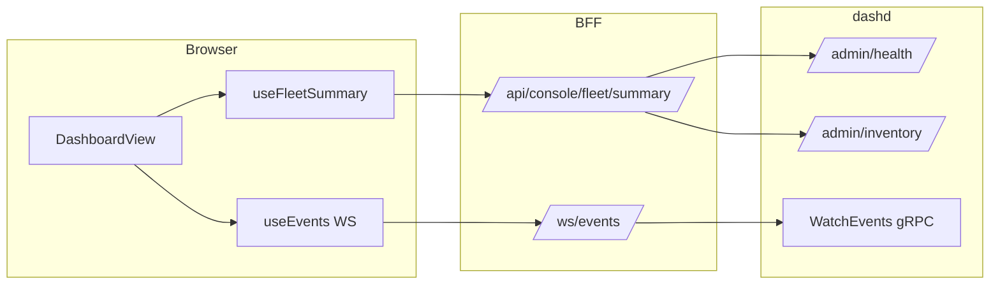
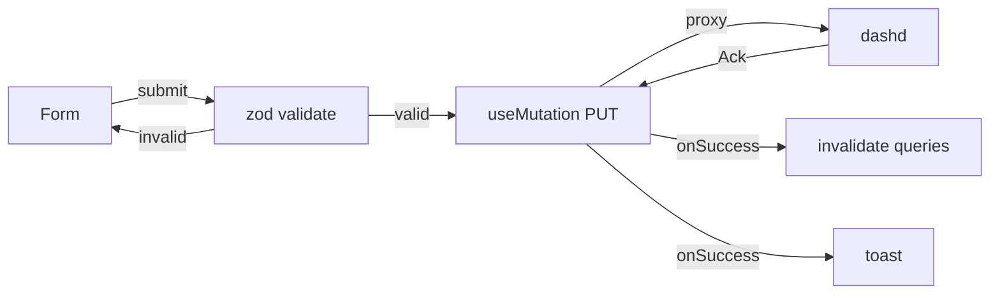

# Low-Level Design (LLD) — DashCenter Web Console (`dashw`)

> **Document scope.** Implementable-grade design for `dashw`. Every
> module, type, function signature, file layout, API contract, WebSocket
> frame schema, React component, Zustand store shape, TanStack Query key,
> CSS token, animation spec, and test scenario referenced by the
> implementation plan is specified here. If you can build dashw by
> reading this top-to-bottom, the document has done its job.
>
> **Companion HLD.** [`specs/HLD/dashw-web-hld.md`](../HLD/dashw-web-hld.md)
> defines the goals, principles, view catalog, and architecture at the
> system level. This LLD nails the implementation.
>
> **Implementation plan.** [`specs/Impl-Plan/dashw-web-impl-plan.md`](../Impl-Plan/dashw-web-impl-plan.md)
> tracks Phase A (REST-only), Phase B (gRPC streaming), and Phase C
> (diagnostics/advanced).

---

## Table of contents

1. [Repository layout & module boundaries](#1-repository-layout--module-boundaries)
2. [Build system & dependencies](#2-build-system--dependencies)
3. [BFF — Go server core](#3-bff--go-server-core)
4. [BFF — REST proxy layer](#4-bff--rest-proxy-layer)
5. [BFF — Aggregation endpoints](#5-bff--aggregation-endpoints)
6. [BFF — WebSocket ↔ gRPC bridge](#6-bff--websocket--grpc-bridge)
7. [BFF — Configuration & CLI flags](#7-bff--configuration--cli-flags)
8. [BFF — Health, metrics, middleware](#8-bff--health-metrics-middleware)
9. [SPA — Project structure & toolchain](#9-spa--project-structure--toolchain)
10. [SPA — Routing & lazy loading](#10-spa--routing--lazy-loading)
11. [SPA — App shell & layout](#11-spa--app-shell--layout)
12. [SPA — Design tokens & theme](#12-spa--design-tokens--theme)
13. [SPA — Shared component library](#13-spa--shared-component-library)
14. [SPA — Data layer: API client](#14-spa--data-layer-api-client)
15. [SPA — Data layer: TanStack Query](#15-spa--data-layer-tanstack-query)
16. [SPA — Data layer: WebSocket hooks](#16-spa--data-layer-websocket-hooks)
17. [SPA — State management: Zustand stores](#17-spa--state-management-zustand-stores)
18. [SPA — View: Dashboard](#18-spa--view-dashboard)
19. [SPA — View: Fleet](#19-spa--view-fleet)
20. [SPA — View: DPU](#20-spa--view-dpu)
21. [SPA — View: Vnet](#21-spa--view-vnet)
22. [SPA — View: Routing](#22-spa--view-routing)
23. [SPA — View: Tunnel](#23-spa--view-tunnel)
24. [SPA — View: Policy](#24-spa--view-policy)
25. [SPA — View: Flow Trace](#25-spa--view-flow-trace)
26. [SPA — View: Audit Log](#26-spa--view-audit-log)
27. [SPA — View: dashd Health](#27-spa--view-dashd-health)
28. [SPA — View: Admin Operations](#28-spa--view-admin-operations)
29. [SPA — View: Command View](#29-spa--view-command-view)
30. [SPA — View: Debug](#30-spa--view-debug)
31. [SPA — Form validation schemas (zod)](#31-spa--form-validation-schemas-zod)
32. [SPA — Animation specifications](#32-spa--animation-specifications)
33. [SPA — Accessibility](#33-spa--accessibility)
34. [SPA — Error boundaries & error states](#34-spa--error-boundaries--error-states)
35. [End-to-end data flow diagrams](#35-end-to-end-data-flow-diagrams)
36. [Testing strategy](#36-testing-strategy)
37. [Performance optimization](#37-performance-optimization)
38. [Security considerations](#38-security-considerations)
39. [Reference appendices](#39-reference-appendices)

---

## 1. Repository layout & module boundaries

### 1.1 BFF (Go)

```
src/impl-go/console/
├── go.mod                              # module: github.com/<org>/dashcenter/console
├── go.sum
├── Dockerfile                          # multi-stage: node → go → distroless
├── Makefile                            # build / test / lint / docker targets
├── README.md
├── cmd/
│   └── dashw/
│       └── main.go                     # flag parsing, server bootstrap
├── internal/
│   ├── config/
│   │   └── config.go                   # Config struct, env/flag loading
│   ├── server/
│   │   ├── server.go                   # HTTP server setup, graceful shutdown
│   │   ├── router.go                   # route registration
│   │   ├── middleware.go               # logging, recovery, CORS, request-id
│   │   └── spa.go                      # go:embed SPA handler, SPA fallback
│   ├── proxy/
│   │   ├── rest.go                     # reverse-proxy to dashd REST :8443
│   │   ├── admin.go                    # reverse-proxy to dashd Admin :7443
│   │   └── sim.go                      # reverse-proxy to dash-sim :8080
│   ├── aggregation/
│   │   ├── fleet.go                    # /api/console/fleet/summary
│   │   ├── dpu_detail.go              # /api/console/dpu/{id}/detail
│   │   ├── topology.go                 # /api/console/topology
│   │   ├── vnet_detail.go             # /api/console/vnet/{name}/detail
│   │   ├── capacity.go                 # /api/console/stats/capacity
│   │   └── types.go                    # shared aggregation response types
│   ├── ws/
│   │   ├── bridge.go                   # generic WS↔gRPC bridge engine
│   │   ├── handler.go                  # per-stream WebSocket handlers
│   │   ├── frame.go                    # WSFrame envelope type
│   │   └── reconnect.go               # gRPC stream reconnect logic
│   ├── health/
│   │   └── health.go                   # /healthz handler
│   └── metrics/
│       └── metrics.go                  # optional /metrics (prometheus)
├── web/
│   └── dist/                           # embedded SPA build output (gitignored)
│       └── .gitkeep
└── embed.go                            # //go:embed web/dist/* declaration
```

### 1.2 SPA (React/TypeScript)

```
src/impl-web/console/
├── package.json
├── package-lock.json
├── tsconfig.json                       # strict mode, path aliases
├── tsconfig.node.json
├── vite.config.ts                      # build config, proxy dev config
├── tailwind.config.ts                  # v4 config, design tokens
├── postcss.config.js
├── index.html                          # SPA entry point
├── .eslintrc.cjs
├── .prettierrc
├── public/
│   ├── favicon.svg
│   └── fonts/
│       ├── inter-variable.woff2
│       └── jetbrains-mono-variable.woff2
├── src/
│   ├── main.tsx                        # React root, QueryClientProvider, RouterProvider
│   ├── App.tsx                         # App shell (layout + router outlet)
│   ├── router.tsx                      # route definitions with lazy imports
│   ├── vite-env.d.ts
│   ├── api/                            # typed HTTP client wrappers
│   │   ├── client.ts                   # base fetch wrapper
│   │   ├── dashd-rest.ts              # dashd REST :8443 proxy calls
│   │   ├── dashd-admin.ts             # dashd Admin :7443 proxy calls
│   │   ├── console-api.ts             # BFF aggregation calls
│   │   └── types.ts                    # shared API response types (mirrors proto)
│   ├── hooks/                          # custom React hooks
│   │   ├── useWebSocket.ts             # generic WebSocket hook with reconnect
│   │   ├── useDpuStatus.ts            # WS /ws/dpu-status consumer
│   │   ├── useEvents.ts               # WS /ws/events consumer
│   │   ├── useFlows.ts                # WS /ws/flows/{dpuId} consumer
│   │   ├── useCounters.ts             # WS /ws/counters/{dpuId} consumer
│   │   ├── useAudit.ts                # WS /ws/audit consumer
│   │   ├── useDrain.ts                # WS /ws/drain/{dpuId} consumer
│   │   ├── useMigration.ts            # WS /ws/migration/{sessId} consumer
│   │   ├── useHaEvents.ts             # WS /ws/ha-events consumer
│   │   ├── useAclHits.ts              # WS /ws/acl-hits/{eniName} consumer
│   │   ├── useMediaQuery.ts            # responsive breakpoint hook
│   │   ├── useKeyboard.ts             # keyboard shortcut hook
│   │   └── useDebounce.ts             # debounce hook
│   ├── stores/                         # Zustand state stores
│   │   ├── fleet-store.ts
│   │   ├── dpu-store.ts
│   │   ├── vnet-store.ts
│   │   ├── policy-store.ts
│   │   ├── event-store.ts
│   │   ├── ws-connection-store.ts
│   │   ├── ui-prefs-store.ts
│   │   ├── trace-history-store.ts
│   │   └── command-store.ts
│   ├── queries/                        # TanStack Query key factories + hooks
│   │   ├── keys.ts                     # query key factory
│   │   ├── fleet.ts
│   │   ├── dpu.ts
│   │   ├── vnet.ts
│   │   ├── eni.ts
│   │   ├── policy.ts
│   │   ├── mapping.ts
│   │   ├── tunnel.ts
│   │   ├── health.ts
│   │   ├── inventory.ts
│   │   └── mutations.ts               # usePutVnet, usePutEni, useDelete, ...
│   ├── components/                     # shared reusable components
│   │   ├── ui/                         # shadcn/ui primitives
│   │   │   └── (button, card, dialog, dropdown-menu, input, label,
│   │   │        select, separator, sheet, skeleton, switch, table,
│   │   │        tabs, textarea, toast, toaster, tooltip, badge)
│   │   ├── layout/
│   │   │   ├── AppShell.tsx
│   │   │   ├── Sidebar.tsx
│   │   │   ├── TopBar.tsx
│   │   │   ├── Breadcrumb.tsx
│   │   │   └── PageHeader.tsx
│   │   ├── data/
│   │   │   ├── DataTable.tsx           # generic sortable/filterable table
│   │   │   ├── DataTablePagination.tsx
│   │   │   ├── DataTableToolbar.tsx
│   │   │   ├── DataTableColumnHeader.tsx
│   │   │   └── VirtualizedTable.tsx    # virtual rows for large datasets
│   │   ├── visualization/
│   │   │   ├── TopologyGraph.tsx        # React Flow wrapper
│   │   │   ├── DpuNode.tsx             # custom node: DPU hexagon
│   │   │   ├── EniNode.tsx             # custom node: ENI rectangle
│   │   │   ├── VnetNode.tsx            # custom node: Vnet circle
│   │   │   ├── CapacityGauge.tsx       # radial capacity gauge (SVG)
│   │   │   ├── SparklineChart.tsx      # inline sparkline (Recharts)
│   │   │   ├── HealthDonut.tsx         # donut chart
│   │   │   ├── PrefixTree.tsx          # D3.js radix tree
│   │   │   ├── TunnelMap.tsx           # tunnel overlay/underlay viz
│   │   │   ├── FlowAnimator.tsx        # animated packet trace SVG
│   │   │   ├── FlowPipelineStage.tsx   # individual stage in trace
│   │   │   └── EniPipe.tsx             # ENI pipe with flow particles
│   │   ├── feedback/
│   │   │   ├── StatusBadge.tsx         # pulsing status indicator
│   │   │   ├── GlassCard.tsx           # glass morphism card
│   │   │   ├── StatsCard.tsx           # metric card
│   │   │   ├── ConnectionIndicator.tsx # WS connection state
│   │   │   ├── EmptyState.tsx
│   │   │   ├── ErrorState.tsx
│   │   │   ├── LoadingSkeleton.tsx
│   │   │   └── StalenessIndicator.tsx
│   │   ├── forms/
│   │   │   ├── ResourceForm.tsx        # generic resource form
│   │   │   ├── IpInput.tsx · MacInput.tsx · CidrInput.tsx · PortRangeInput.tsx
│   │   │   ├── NamespaceSelector.tsx · LabelEditor.tsx
│   │   │   ├── AclRuleEditor.tsx · RouteEditor.tsx
│   │   │   ├── ManifestUploader.tsx · DiffPreview.tsx
│   │   ├── command/
│   │   │   ├── CommandCatalog.tsx · CommandDetail.tsx
│   │   │   ├── CommandBuilder.tsx · CommandPreview.tsx · CommandOutput.tsx
│   │   └── common/
│   │       ├── CommandPalette.tsx       # Cmd+K global search
│   │       ├── JsonViewer.tsx · CodeEditor.tsx · CopyButton.tsx
│   │       ├── TimeAgo.tsx · ExportButton.tsx
│   ├── views/                          # page-level view modules (lazy-loaded)
│   │   ├── dashboard/   (DashboardView, FleetHealthPanel, CapacityPanel, ...)
│   │   ├── fleet/       (FleetView, FleetTopology, FleetTable, ...)
│   │   ├── dpu/         (DpuView, DpuHeader, EniPipePanel, ...)
│   │   ├── vnet/        (VnetView, VnetHeader, VnetTopology, ...)
│   │   ├── routing/     (RoutingView, PrefixTreePanel, RouteTable, ...)
│   │   ├── tunnel/      (TunnelView, TunnelMapPanel, TunnelTable, ...)
│   │   ├── policy/      (PolicyView, AclPolicyList, RoutePolicyList, ...)
│   │   ├── flow-trace/  (FlowTraceView, TraceInputForm, TraceAnimation, ...)
│   │   ├── audit/       (AuditView, AuditFeed, AuditFilters, ...)
│   │   ├── health/      (HealthView, LeaderPanel, ClusterHealthPanel, ...)
│   │   ├── admin/       (AdminView, CreateResourceForm, BatchUploader, ...)
│   │   ├── command/     (CommandView, CommandExecutor)
│   │   └── debug/       (DebugView, RawApiCaller, SimInspector, WsTester)
│   ├── lib/                            # pure utility functions
│   │   ├── cn.ts                       # clsx + tailwind-merge
│   │   ├── format.ts                   # IP, MAC, byte, duration formatters
│   │   ├── topology.ts                 # graph layout computation
│   │   ├── command-registry.ts         # dashctl command metadata
│   │   ├── ws-manager.ts              # WebSocket connection manager
│   │   └── constants.ts                # poll intervals, WS URLs, etc.
│   └── styles/
│       ├── globals.css                 # @tailwind, CSS custom properties
│       ├── fonts.css                   # @font-face declarations
│       └── animations.css             # keyframe definitions
└── tests/
    ├── setup.ts                        # vitest setup (jsdom, MSW)
    ├── mocks/  (handlers.ts, data.ts, ws-server.ts)
    ├── components/ · hooks/ · views/ · stores/
```

### 1.3 Module boundary rules

| Boundary | Rule |
|---|---|
| `views/*` → `components/*` | ✅ Views import shared components. Never reverse. |
| `views/*` → `queries/*` | ✅ Views call query hooks. Never raw `fetch`. |
| `views/*` → `stores/*` | ✅ Views subscribe to stores for client-side state. |
| `views/*` → `hooks/*` | ✅ Views use WebSocket hooks for real-time data. |
| `components/*` → `api/*` | ❌ **Forbidden.** Components are data-agnostic; data via props. |
| `queries/*` → `api/*` | ✅ Queries call API client functions. |
| `hooks/*` → `stores/*` | ✅ WebSocket hooks push into Zustand stores. |
| `stores/*` → `api/*` | ❌ **Forbidden.** Stores are client-side only. |

---

## 2. Build system & dependencies

### 2.1 BFF Go dependencies

```
module github.com/<org>/dashcenter/console
go 1.22

require (
    google.golang.org/grpc        v1.65.x    // gRPC client for dashd :9443
    google.golang.org/protobuf    v1.34.x    // proto serialization
    github.com/gorilla/websocket  v1.5.x     // WebSocket upgrade
    github.com/go-chi/chi/v5      v5.1.x     // HTTP router
    github.com/go-chi/cors        v1.x       // CORS middleware
    github.com/prometheus/client_golang v1.x // optional /metrics
    // proto stubs generated from proto/dashcenter/v1/
)
```

### 2.2 SPA npm dependencies

```json
{
  "dependencies": {
    "react": "^18.3.0",
    "react-dom": "^18.3.0",
    "react-router-dom": "^6.23.0",
    "@tanstack/react-query": "^5.50.0",
    "@tanstack/react-table": "^8.17.0",
    "zustand": "^4.5.0",
    "@xyflow/react": "^12.0.0",
    "recharts": "^2.12.0",
    "framer-motion": "^11.2.0",
    "d3": "^7.9.0",
    "zod": "^3.23.0",
    "clsx": "^2.1.0",
    "tailwind-merge": "^2.3.0",
    "date-fns": "^3.6.0",
    "lucide-react": "^0.390.0",
    "sonner": "^1.5.0",
    "cmdk": "^1.0.0",
    "react-ace": "^12.0.0",
    "js-yaml": "^4.1.0"
  },
  "devDependencies": {
    "typescript": "^5.5.0",
    "vite": "^5.3.0",
    "@vitejs/plugin-react-swc": "^3.7.0",
    "tailwindcss": "^4.0.0",
    "@tailwindcss/vite": "^4.0.0",
    "eslint": "^9.5.0",
    "prettier": "^3.3.0",
    "vitest": "^1.6.0",
    "@testing-library/react": "^16.0.0",
    "@testing-library/jest-dom": "^6.4.0",
    "msw": "^2.3.0",
    "jsdom": "^24.1.0",
    "@types/react": "^18.3.0",
    "@types/d3": "^7.4.0"
  }
}
```

### 2.3 Dockerfile (multi-stage)

```dockerfile
# Stage 1: Build SPA
FROM node:20-alpine AS web-builder
WORKDIR /app/web
COPY src/impl-web/console/package*.json ./
RUN npm ci
COPY src/impl-web/console/ ./
RUN npm run build

# Stage 2: Build BFF
FROM golang:1.22-alpine AS go-builder
WORKDIR /app
COPY src/impl-go/console/go.* ./
RUN go mod download
COPY src/impl-go/console/ ./
COPY --from=web-builder /app/web/dist ./web/dist
RUN CGO_ENABLED=0 go build -trimpath -ldflags="-s -w" -o /dashw ./cmd/dashw

# Stage 3: Runtime
FROM gcr.io/distroless/static-debian12:nonroot
COPY --from=go-builder /dashw /dashw
EXPOSE 8080
ENTRYPOINT ["/dashw"]
```

### 2.4 Makefile targets

```makefile
.PHONY: web-build bff-build docker-console

web-build:
	cd src/impl-web/console && npm ci && npm run build
	rm -rf src/impl-go/console/web/dist
	cp -r src/impl-web/console/dist src/impl-go/console/web/dist

bff-build: web-build
	cd src/impl-go/console && CGO_ENABLED=0 go build -trimpath \
	  -ldflags="-s -w -X main.version=$(VERSION)" \
	  -o ../../bin/dashw ./cmd/dashw

docker-console:
	docker build -t dashw:$(VERSION) -f src/impl-go/console/Dockerfile .
```

---

## 3. BFF — Go server core

### 3.1 `cmd/dashw/main.go`

```go
package main

import (
    "context"
    "log/slog"
    "os"
    "os/signal"
    "syscall"

    "github.com/<org>/dashcenter/console/internal/config"
    "github.com/<org>/dashcenter/console/internal/server"
)

var version = "dev"

func main() {
    cfg := config.Parse(os.Args[1:])
    cfg.Version = version

    logger := slog.New(slog.NewJSONHandler(os.Stdout, &slog.HandlerOptions{
        Level: cfg.LogLevel,
    }))
    slog.SetDefault(logger)

    ctx, cancel := signal.NotifyContext(context.Background(),
        syscall.SIGINT, syscall.SIGTERM)
    defer cancel()

    srv, err := server.New(cfg, logger)
    if err != nil {
        slog.Error("server init failed", "error", err)
        os.Exit(1)
    }
    if err := srv.Run(ctx); err != nil {
        slog.Error("server error", "error", err)
        os.Exit(1)
    }
}
```

### 3.2 `internal/config/config.go`

```go
package config

import (
    "flag"
    "log/slog"
    "os"
    "time"
)

type Config struct {
    Listen          string        // ":8080"
    DashdRestAddr   string        // "http://localhost:8443"
    DashdGrpcAddr   string        // "localhost:9443"
    DashdAdminAddr  string        // "http://localhost:7443"
    SimBaseAddr     string        // "http://sim-{id}:8080" template
    ProxyTimeout    time.Duration // 30s
    GrpcDialTimeout time.Duration // 10s
    WsWriteTimeout  time.Duration // 10s
    WsPongTimeout   time.Duration // 60s
    WsPingInterval  time.Duration // 30s
    EnableMetrics   bool
    EnableCORS      bool
    DashdInsecure   bool
    LogLevel        slog.Level
    Version         string
    DashdAuthToken  string
    DashdTLSCert    string
    DashdTLSKey     string
    DashdTLSCA      string
}

func Parse(args []string) *Config {
    cfg := &Config{}
    fs := flag.NewFlagSet("dashw", flag.ExitOnError)
    fs.StringVar(&cfg.Listen, "listen", env("DASHW_LISTEN", ":8080"), "listen addr")
    fs.StringVar(&cfg.DashdRestAddr, "dashd-rest", env("DASHD_REST_ADDR", "http://localhost:8443"), "dashd REST")
    fs.StringVar(&cfg.DashdGrpcAddr, "dashd-grpc", env("DASHD_GRPC_ADDR", "localhost:9443"), "dashd gRPC")
    fs.StringVar(&cfg.DashdAdminAddr, "dashd-admin", env("DASHD_ADMIN_ADDR", "http://localhost:7443"), "dashd Admin")
    fs.StringVar(&cfg.SimBaseAddr, "sim-base", env("DASHW_SIM_BASE", ""), "dash-sim URL template")
    fs.DurationVar(&cfg.ProxyTimeout, "proxy-timeout", 30*time.Second, "proxy timeout")
    fs.DurationVar(&cfg.GrpcDialTimeout, "grpc-dial-timeout", 10*time.Second, "gRPC dial timeout")
    fs.DurationVar(&cfg.WsWriteTimeout, "ws-write-timeout", 10*time.Second, "WS write timeout")
    fs.DurationVar(&cfg.WsPongTimeout, "ws-pong-timeout", 60*time.Second, "WS pong timeout")
    fs.DurationVar(&cfg.WsPingInterval, "ws-ping-interval", 30*time.Second, "WS ping interval")
    fs.BoolVar(&cfg.EnableMetrics, "metrics", envBool("DASHW_METRICS"), "enable /metrics")
    fs.BoolVar(&cfg.EnableCORS, "cors", envBool("DASHW_CORS"), "enable CORS")
    fs.BoolVar(&cfg.DashdInsecure, "dashd-insecure", true, "skip dashd TLS verify")
    var logLvl string
    fs.StringVar(&logLvl, "log-level", env("DASHW_LOG_LEVEL", "info"), "log level")
    _ = fs.Parse(args)
    cfg.LogLevel = parseLevel(logLvl)
    cfg.DashdAuthToken = os.Getenv("DASHD_AUTH_TOKEN")
    cfg.DashdTLSCert = os.Getenv("DASHD_TLS_CERT")
    cfg.DashdTLSKey = os.Getenv("DASHD_TLS_KEY")
    cfg.DashdTLSCA = os.Getenv("DASHD_TLS_CA")
    return cfg
}

func env(k, d string) string { if v := os.Getenv(k); v != "" { return v }; return d }
func envBool(k string) bool  { v := os.Getenv(k); return v == "true" || v == "1" }
func parseLevel(s string) slog.Level {
    switch s {
    case "debug": return slog.LevelDebug
    case "warn":  return slog.LevelWarn
    case "error": return slog.LevelError
    default:      return slog.LevelInfo
    }
}
```

### 3.3 `internal/server/server.go`

```go
package server

import (
    "context"
    "fmt"
    "log/slog"
    "net/http"
    "time"

    "github.com/<org>/dashcenter/console/internal/config"
    "google.golang.org/grpc"
    "google.golang.org/grpc/credentials/insecure"
)

type Server struct {
    cfg      *config.Config
    logger   *slog.Logger
    httpSrv  *http.Server
    grpcConn *grpc.ClientConn
}

func New(cfg *config.Config, logger *slog.Logger) (*Server, error) {
    s := &Server{cfg: cfg, logger: logger}

    if cfg.DashdGrpcAddr != "" {
        ctx, cancel := context.WithTimeout(context.Background(), cfg.GrpcDialTimeout)
        defer cancel()
        opts := []grpc.DialOption{}
        if cfg.DashdInsecure {
            opts = append(opts, grpc.WithTransportCredentials(insecure.NewCredentials()))
        }
        conn, err := grpc.DialContext(ctx, cfg.DashdGrpcAddr, opts...)
        if err != nil {
            logger.Warn("gRPC dial failed; WS streams unavailable", "addr", cfg.DashdGrpcAddr, "err", err)
        } else {
            s.grpcConn = conn
        }
    }

    s.httpSrv = &http.Server{
        Addr:         cfg.Listen,
        Handler:      s.buildRouter(),
        ReadTimeout:  30 * time.Second,
        WriteTimeout: 60 * time.Second,
        IdleTimeout:  120 * time.Second,
    }
    return s, nil
}

func (s *Server) Run(ctx context.Context) error {
    errCh := make(chan error, 1)
    go func() {
        s.logger.Info("dashw listening", "addr", s.cfg.Listen, "version", s.cfg.Version)
        errCh <- s.httpSrv.ListenAndServe()
    }()
    select {
    case <-ctx.Done():
        s.logger.Info("shutting down")
        shutCtx, cancel := context.WithTimeout(context.Background(), 15*time.Second)
        defer cancel()
        if s.grpcConn != nil { _ = s.grpcConn.Close() }
        return s.httpSrv.Shutdown(shutCtx)
    case err := <-errCh:
        return fmt.Errorf("http: %w", err)
    }
}
```

### 3.4 `internal/server/router.go`

```go
func (s *Server) buildRouter() http.Handler {
    r := chi.NewRouter()

    // --- Middleware ---
    r.Use(chimw.RequestID, chimw.RealIP, s.loggingMW, s.recoveryMW)
    if s.cfg.EnableCORS {
        r.Use(cors.Handler(cors.Options{
            AllowedOrigins: []string{"*"}, AllowedMethods: []string{"GET","POST","PUT","DELETE","OPTIONS"},
            AllowedHeaders: []string{"*"}, AllowCredentials: true, MaxAge: 300,
        }))
    }

    // --- Health & Metrics ---
    r.Get("/healthz", health.Handler(s.cfg))
    if s.cfg.EnableMetrics { r.Handle("/metrics", s.metricsHandler()) }

    // --- REST Proxies ---
    restProxy := proxy.NewRestProxy(s.cfg.DashdRestAddr, s.cfg.ProxyTimeout, s.logger)
    adminProxy := proxy.NewAdminProxy(s.cfg.DashdAdminAddr, s.cfg.ProxyTimeout, s.logger)
    r.Route("/api", func(r chi.Router) {
        r.HandleFunc("/v1/*", restProxy.ServeHTTP)
        r.HandleFunc("/admin/*", adminProxy.ServeHTTP)
        if s.cfg.SimBaseAddr != "" {
            simProxy := proxy.NewSimProxy(s.cfg.SimBaseAddr, s.cfg.ProxyTimeout, s.logger)
            r.HandleFunc("/sim/{simId}/admin/*", simProxy.ServeHTTP)
        }
        // --- Aggregation ---
        agg := aggregation.New(s.cfg, s.logger)
        r.Get("/console/fleet/summary", agg.FleetSummary)
        r.Get("/console/dpu/{dpuId}/detail", agg.DpuDetail)
        r.Get("/console/topology", agg.Topology)
        r.Get("/console/vnet/{vnetName}/detail", agg.VnetDetail)
        r.Get("/console/stats/capacity", agg.CapacityStats)
    })

    // --- WebSocket Bridges (Phase B) ---
    if s.grpcConn != nil {
        wsRouter := ws.NewRouter(s.grpcConn, s.cfg, s.logger)
        r.Get("/ws/dpu-status", wsRouter.DpuStatus)
        r.Get("/ws/events", wsRouter.Events)
        r.Get("/ws/flows/{dpuId}", wsRouter.Flows)
        r.Get("/ws/counters/{dpuId}", wsRouter.Counters)
        r.Get("/ws/audit", wsRouter.Audit)
        r.Get("/ws/drain/{dpuId}", wsRouter.Drain)
        r.Get("/ws/migration/{sessionId}", wsRouter.Migration)
        r.Get("/ws/ha-events", wsRouter.HaEvents)
        r.Get("/ws/acl-hits/{eniName}", wsRouter.AclHits)
    }

    // --- SPA fallback (must be last) ---
    r.NotFound(s.spaHandler())
    return r
}
```

---

## 4. BFF — REST proxy layer

### 4.1 `internal/proxy/rest.go`

```go
package proxy

// RestProxy reverse-proxies /api/v1/* to dashd REST :8443.
// Path rewrite: strips "/api" prefix. Example:
//   Browser: PUT /api/v1/default/enis/eni-01
//   dashd:   PUT /v1/default/enis/eni-01
type RestProxy struct {
    proxy  *httputil.ReverseProxy
    logger *slog.Logger
}

func NewRestProxy(targetAddr string, timeout time.Duration, logger *slog.Logger) *RestProxy {
    target, _ := url.Parse(targetAddr)
    rp := httputil.NewSingleHostReverseProxy(target)
    rp.Director = func(req *http.Request) {
        req.URL.Scheme = target.Scheme
        req.URL.Host = target.Host
        req.URL.Path = strings.TrimPrefix(req.URL.Path, "/api")
        req.Host = target.Host
    }
    rp.Transport = &http.Transport{
        ResponseHeaderTimeout: timeout,
        MaxIdleConns: 100, MaxIdleConnsPerHost: 20, IdleConnTimeout: 90 * time.Second,
    }
    rp.ErrorHandler = func(w http.ResponseWriter, r *http.Request, err error) {
        logger.Error("proxy error", "path", r.URL.Path, "err", err)
        http.Error(w, `{"error":"dashd unreachable","detail":"`+err.Error()+`"}`, 502)
    }
    return &RestProxy{proxy: rp, logger: logger}
}
func (p *RestProxy) ServeHTTP(w http.ResponseWriter, r *http.Request) { p.proxy.ServeHTTP(w, r) }
```

### 4.2 Admin & Sim proxies

`admin.go` — identical pattern, strips `/api/admin/` → `/admin/`, targets `:7443`.

`sim.go` — dynamic proxy: extracts `{simId}` from chi URL param, replaces `{id}` in `SimBaseAddr` template, forwards `/admin/*` path to that sim instance.

### 4.3 Proxy path mapping table

| Browser request | BFF strips | Forwards to |
|---|---|---|
| `PUT /api/v1/default/enis/eni-01` | `/api` | `PUT http://dashd:8443/v1/default/enis/eni-01` |
| `GET /api/v1/default/vnets` | `/api` | `GET http://dashd:8443/v1/default/vnets` |
| `GET /api/admin/health` | `/api` | `GET http://dashd:7443/admin/health` |
| `GET /api/admin/drift?dpu=dpu-01` | `/api` | `GET http://dashd:7443/admin/drift?dpu=dpu-01` |
| `POST /api/v1/reconcile` | `/api` | `POST http://dashd:8443/v1/reconcile` |
| `POST /api/v1/simulate` | `/api` | `POST http://dashd:8443/v1/simulate` |
| `GET /api/sim/sim-01/admin/dump` | `/api/sim/sim-01` | `GET http://sim-01:8080/admin/dump` |

---

## 5. BFF — Aggregation endpoints

### 5.1 `GET /api/console/fleet/summary`

**Purpose:** Single-call fleet overview. Eliminates N+1 from browser.

**Fan-out (parallel via `errgroup`):**
1. `GET /admin/health` → cluster health, per-DPU states, leader
2. `GET /admin/inventory` → DPU list with endpoints
3. `GET /v1/default/vnets` → Vnet count
4. `GET /v1/default/enis` → ENI count

**Response type — `FleetSummary`:**

```go
type FleetSummary struct {
    Timestamp      time.Time          `json:"timestamp"`
    ClusterHealthy bool               `json:"cluster_healthy"`
    LeaderNode     string             `json:"leader_node"`
    DpuCount       int                `json:"dpu_count"`
    DpusByState    map[string]int     `json:"dpus_by_state"`     // {"HEALTHY":3,"DEGRADED":1}
    EniCount       int                `json:"eni_count"`
    VnetCount      int                `json:"vnet_count"`
    CapacityTotal  AggregatedCapacity `json:"capacity_total"`
    CapacityUsed   AggregatedCapacity `json:"capacity_used"`
    DriftedDpus    []string           `json:"drifted_dpus"`
    OfflineDpus    []string           `json:"offline_dpus"`
    Dpus           []DpuSummary       `json:"dpus"`
}

type AggregatedCapacity struct {
    Enis     int64 `json:"enis"`
    Routes   int64 `json:"routes"`
    AclRules int64 `json:"acl_rules"`
    Flows    int64 `json:"flows"`
}

type DpuSummary struct {
    ID              string            `json:"id"`
    State           string            `json:"state"`
    UnderlayIP      string            `json:"underlay_ip"`
    EniCount        int               `json:"eni_count"`
    CapacityPercent float64           `json:"capacity_percent"`
    LastSeen        time.Time         `json:"last_seen"`
    Labels          map[string]string `json:"labels,omitempty"`
}
```

**Cache:** In-memory, 5s TTL. Concurrent requests coalesced via `singleflight.Group`.

### 5.2 `GET /api/console/dpu/{dpuId}/detail`

**Fan-out:**
1. `GET /admin/health` → this DPU's status
2. `GET /admin/drift?dpu={dpuId}` → drift items
3. `GET /admin/observed?dpu={dpuId}` → observed state
4. `GET /v1/default/enis` → filter ENIs placed on this DPU
5. `GET /v1/default/acl-policies` → filter by this DPU's ENIs
6. `GET /v1/default/route-policies` → filter by this DPU's Vnets

**Response type — `DpuDetail`:**

```go
type DpuDetail struct {
    ID            string               `json:"id"`
    State         string               `json:"state"`
    UnderlayIP    string               `json:"underlay_ip"`
    LastSeen      time.Time            `json:"last_seen"`
    Capacity      DpuCapacity          `json:"capacity"`
    Enis          []EniInfo            `json:"enis"`
    DriftItems    []DriftItem          `json:"drift_items"`
    AclPolicies   []AclPolicySummary   `json:"acl_policies"`
    RoutePolicies []RoutePolicySummary `json:"route_policies"`
}

type DpuCapacity struct {
    EnisUsed, EnisMax         int64
    RoutesUsed, RoutesMax     int64
    AclRulesUsed, AclRulesMax int64
    FlowsUsed, FlowsMax      int64
}

type EniInfo struct {
    Name, MacAddress, VnetName, AdminState, UnderlayIP string
}

type DriftItem struct {
    Kind      string `json:"kind"`       // DECLARED_NOT_OBSERVED | OBSERVED_NOT_DECLARED | FIELD_MISMATCH
    TargetRef string `json:"target_ref"` // "Eni/default/eni-01"
    Detail    string `json:"detail,omitempty"`
}
```

### 5.3 `GET /api/console/topology`

**Purpose:** Pre-computed React Flow graph data.

**Fan-out:** health + inventory + vnets + enis (same as fleet summary).

**Response type — `TopologyGraph`:**

```go
type TopologyGraph struct {
    Nodes []TopologyNode `json:"nodes"`
    Edges []TopologyEdge `json:"edges"`
}

type TopologyNode struct {
    ID       string         `json:"id"`
    Type     string         `json:"type"`      // "dpu" | "eni" | "vnet"
    Label    string         `json:"label"`
    State    string         `json:"state,omitempty"`
    ParentID string         `json:"parent_id,omitempty"` // ENI → DPU parent
    Data     map[string]any `json:"data,omitempty"`
    Position *Position      `json:"position,omitempty"`
}

type Position struct { X, Y float64 }

type TopologyEdge struct {
    ID, Source, Target, Type string
    Label                    string `json:"label,omitempty"`
}
```

### 5.4 `GET /api/console/vnet/{vnetName}/detail`

**Fan-out:** vnet spec + enis (filtered) + mappings (filtered) + route-policies (filtered) + service-tunnels (filtered) + eni-placement.

### 5.5 `GET /api/console/stats/capacity`

**Fan-out:** `GET /admin/health` → aggregate DPU capacity data.

### 5.6 Aggregation implementation pattern

```go
// All aggregation handlers follow this pattern:
func (a *Agg) FleetSummary(w http.ResponseWriter, r *http.Request) {
    ctx := r.Context()
    g, ctx := errgroup.WithContext(ctx)

    var health HealthResp; var inv InvResp; var vnets []VnetSpec; var enis []EniSpec

    g.Go(func() error { var e error; health, e = a.fetchHealth(ctx); return e })
    g.Go(func() error { var e error; inv, e = a.fetchInventory(ctx); return e })
    g.Go(func() error { var e error; vnets, e = a.fetchVnets(ctx); return e })
    g.Go(func() error { var e error; enis, e = a.fetchEnis(ctx); return e })

    if err := g.Wait(); err != nil {
        a.logger.Error("fan-out failed", "err", err)
        http.Error(w, `{"error":"partial data unavailable"}`, 502)
        return
    }
    summary := merge(health, inv, vnets, enis)
    w.Header().Set("Content-Type", "application/json")
    json.NewEncoder(w).Encode(summary)
}

// fetchHealth uses singleflight to coalesce concurrent calls
func (a *Agg) fetchHealth(ctx context.Context) (HealthResp, error) {
    val, err, _ := a.sf.Do("health", func() (any, error) { /* GET /admin/health */ })
    return val.(HealthResp), err
}
```

---

## 6. BFF — WebSocket ↔ gRPC bridge

### 6.1 Frame envelope — `internal/ws/frame.go`

```go
type WSFrame struct {
    Type      string          `json:"type"`
    Data      json.RawMessage `json:"data"`
    Seq       uint64          `json:"seq"`
    Timestamp time.Time       `json:"timestamp"`
    Error     *WSError        `json:"error,omitempty"`
}

type WSError struct {
    Code    string `json:"code"`    // STREAM_INTERRUPTED | PERMISSION_DENIED | UNAVAILABLE
    Message string `json:"message"`
}
```

### 6.2 Bridge engine — `internal/ws/bridge.go`

```go
type StreamFactory func(ctx context.Context, conn *grpc.ClientConn) (GrpcStream, error)

type GrpcStream interface { Recv() (any, error) }

type Bridge struct {
    conn       *grpc.ClientConn
    wsUpgrader websocket.Upgrader
    logger     *slog.Logger
    cfg        *BridgeConfig
}

type BridgeConfig struct {
    WriteTimeout, PongTimeout, PingInterval time.Duration
}

// Handle upgrades HTTP→WS, opens gRPC stream, pumps messages until close.
func (b *Bridge) Handle(w http.ResponseWriter, r *http.Request, streamType string, factory StreamFactory) {
    ws, err := b.wsUpgrader.Upgrade(w, r, nil)
    if err != nil { return }
    defer ws.Close()

    ctx, cancel := context.WithCancel(r.Context())
    defer cancel()

    stream, err := factory(ctx, b.conn)
    if err != nil { b.sendError(ws, streamType, "UNAVAILABLE", err.Error()); return }

    go b.pingLoop(ctx, ws, cancel)
    go b.readPump(ctx, ws, cancel)

    var seq atomic.Uint64
    for {
        msg, err := stream.Recv()
        if err != nil {
            if ctx.Err() != nil { return }
            b.sendError(ws, streamType, "STREAM_INTERRUPTED", err.Error()); return
        }
        data, _ := json.Marshal(msg)
        frame := WSFrame{Type: streamType, Data: data, Seq: seq.Add(1), Timestamp: time.Now().UTC()}
        ws.SetWriteDeadline(time.Now().Add(b.cfg.WriteTimeout))
        if err := ws.WriteJSON(frame); err != nil { return }
    }
}
```

### 6.3 Per-stream handlers — `internal/ws/handler.go`

```go
type Router struct { bridge *Bridge }

func (wr *Router) DpuStatus(w http.ResponseWriter, r *http.Request) {
    wr.bridge.Handle(w, r, "dpu_status", func(ctx context.Context, conn *grpc.ClientConn) (GrpcStream, error) {
        return pb.NewObservabilityServiceClient(conn).GetDpuStatus(ctx, &pb.GetDpuStatusRequest{})
    })
}

func (wr *Router) Events(w http.ResponseWriter, r *http.Request) {
    wr.bridge.Handle(w, r, "event", func(ctx context.Context, conn *grpc.ClientConn) (GrpcStream, error) {
        return pb.NewObservabilityServiceClient(conn).WatchEvents(ctx, &pb.WatchEventsRequest{})
    })
}

func (wr *Router) Flows(w http.ResponseWriter, r *http.Request) {
    dpuId := chi.URLParam(r, "dpuId")
    wr.bridge.Handle(w, r, "flow", func(ctx context.Context, conn *grpc.ClientConn) (GrpcStream, error) {
        return pb.NewObservabilityServiceClient(conn).GetFlowList(ctx, &pb.GetFlowListRequest{DpuId: dpuId})
    })
}

func (wr *Router) Counters(w http.ResponseWriter, r *http.Request) {
    dpuId := chi.URLParam(r, "dpuId")
    wr.bridge.Handle(w, r, "counter", func(ctx context.Context, conn *grpc.ClientConn) (GrpcStream, error) {
        return pb.NewObservabilityServiceClient(conn).GetCounters(ctx, &pb.GetCountersRequest{DpuId: dpuId})
    })
}

func (wr *Router) Audit(w http.ResponseWriter, r *http.Request) {
    wr.bridge.Handle(w, r, "audit", func(ctx context.Context, conn *grpc.ClientConn) (GrpcStream, error) {
        return pb.NewObservabilityServiceClient(conn).GetAuditLog(ctx, &pb.GetAuditLogRequest{})
    })
}

func (wr *Router) Drain(w http.ResponseWriter, r *http.Request) {
    dpuId := chi.URLParam(r, "dpuId")
    wr.bridge.Handle(w, r, "drain", func(ctx context.Context, conn *grpc.ClientConn) (GrpcStream, error) {
        return pb.NewOperationsServiceClient(conn).DrainDpu(ctx, &pb.DrainDpuRequest{DpuId: dpuId})
    })
}

func (wr *Router) Migration(w http.ResponseWriter, r *http.Request) {
    sid := chi.URLParam(r, "sessionId")
    wr.bridge.Handle(w, r, "migration", func(ctx context.Context, conn *grpc.ClientConn) (GrpcStream, error) {
        return pb.NewMigrationServiceClient(conn).StreamMigrationSession(ctx, &pb.StreamMigrationSessionRequest{SessionId: sid})
    })
}

func (wr *Router) HaEvents(w http.ResponseWriter, r *http.Request) {
    wr.bridge.Handle(w, r, "ha_event", func(ctx context.Context, conn *grpc.ClientConn) (GrpcStream, error) {
        return pb.NewHaServiceClient(conn).WatchHaEvents(ctx, &pb.WatchHaEventsRequest{})
    })
}

func (wr *Router) AclHits(w http.ResponseWriter, r *http.Request) {
    eniName := chi.URLParam(r, "eniName")
    wr.bridge.Handle(w, r, "acl_hit", func(ctx context.Context, conn *grpc.ClientConn) (GrpcStream, error) {
        return pb.NewDiagnosticsServiceClient(conn).GetAclHitStats(ctx, &pb.GetAclHitStatsRequest{EniName: eniName})
    })
}
```

### 6.4 WebSocket stream inventory

| Endpoint | gRPC RPC | Frame type | Phase |
|---|---|---|---|
| `WS /ws/dpu-status` | `ObservabilityService.GetDpuStatus` | `dpu_status` | B |
| `WS /ws/events` | `ObservabilityService.WatchEvents` | `event` | B |
| `WS /ws/flows/{dpuId}` | `ObservabilityService.GetFlowList` | `flow` | B |
| `WS /ws/counters/{dpuId}` | `ObservabilityService.GetCounters` | `counter` | B |
| `WS /ws/audit` | `ObservabilityService.GetAuditLog` | `audit` | B |
| `WS /ws/drain/{dpuId}` | `OperationsService.DrainDpu` | `drain` | B |
| `WS /ws/migration/{sessId}` | `MigrationService.StreamMigrationSession` | `migration` | B |
| `WS /ws/ha-events` | `HaService.WatchHaEvents` | `ha_event` | B |
| `WS /ws/acl-hits/{eniName}` | `DiagnosticsService.GetAclHitStats` | `acl_hit` | C |

---

## 7. BFF — Configuration & CLI flags

| Flag | Env var | Default | Description |
|---|---|---|---|
| `--listen` | `DASHW_LISTEN` | `:8080` | BFF listen address |
| `--dashd-rest` | `DASHD_REST_ADDR` | `http://localhost:8443` | dashd REST |
| `--dashd-grpc` | `DASHD_GRPC_ADDR` | `localhost:9443` | dashd gRPC |
| `--dashd-admin` | `DASHD_ADMIN_ADDR` | `http://localhost:7443` | dashd Admin |
| `--sim-base` | `DASHW_SIM_BASE` | (empty) | dash-sim URL template |
| `--proxy-timeout` | — | `30s` | Proxy timeout |
| `--grpc-dial-timeout` | — | `10s` | gRPC dial timeout |
| `--ws-write-timeout` | — | `10s` | WS write deadline |
| `--ws-pong-timeout` | — | `60s` | WS pong wait |
| `--ws-ping-interval` | — | `30s` | WS ping interval |
| `--metrics` | `DASHW_METRICS` | `false` | Enable `/metrics` |
| `--cors` | `DASHW_CORS` | `false` | Enable CORS |
| `--dashd-insecure` | `DASHD_INSECURE` | `true` | Skip dashd TLS verify |
| `--log-level` | `DASHW_LOG_LEVEL` | `info` | Log level |
| — | `DASHD_AUTH_TOKEN` | — | Bearer token |
| — | `DASHD_TLS_CERT` | — | Client cert path |
| — | `DASHD_TLS_KEY` | — | Client key path |
| — | `DASHD_TLS_CA` | — | CA cert path |

---

## 8. BFF — Health, metrics, middleware

### 8.1 Health endpoint (`GET /healthz`)

```go
func Handler(cfg *config.Config) http.HandlerFunc {
    return func(w http.ResponseWriter, r *http.Request) {
        checks := map[string]string{}
        healthy := true
        resp, err := http.Get(cfg.DashdAdminAddr + "/admin/health")
        if err != nil || resp.StatusCode != 200 {
            checks["dashd_rest"] = "unhealthy"; healthy = false
        } else { checks["dashd_rest"] = "healthy" }
        status := 200; if !healthy { status = 503 }
        w.Header().Set("Content-Type", "application/json")
        w.WriteHeader(status)
        json.NewEncoder(w).Encode(map[string]any{"status": healthy, "checks": checks})
    }
}
```

### 8.2 Middleware stack

| Middleware | Purpose |
|---|---|
| `RequestID` | `X-Request-Id` header |
| `RealIP` | Extract client IP |
| `loggingMW` | Structured access log (method, path, status, latency, request_id) via `slog` |
| `recoveryMW` | Catch panics → 500 + log stack trace |
| `CORS` | Permissive CORS for dev (opt-in) |

---

## 9. SPA — Project structure & toolchain

### 9.1 Vite configuration

```typescript
// vite.config.ts
export default defineConfig({
  plugins: [react(), tailwindcss()],
  resolve: { alias: { '@': path.resolve(__dirname, './src') } },
  build: {
    outDir: 'dist', sourcemap: true,
    rollupOptions: {
      output: {
        manualChunks: {
          'react-vendor': ['react', 'react-dom', 'react-router-dom'],
          'query-vendor': ['@tanstack/react-query', '@tanstack/react-table'],
          'viz-vendor': ['@xyflow/react', 'recharts', 'd3'],
          'motion-vendor': ['framer-motion'],
        },
      },
    },
  },
  server: {
    port: 3000,
    proxy: {
      '/api': 'http://localhost:8080',
      '/ws': { target: 'ws://localhost:8080', ws: true },
    },
  },
});
```

### 9.2 TypeScript — strict mode

```json
{
  "compilerOptions": {
    "target": "ES2022", "lib": ["ES2022", "DOM", "DOM.Iterable"],
    "module": "ESNext", "moduleResolution": "bundler",
    "jsx": "react-jsx", "strict": true,
    "noUncheckedIndexedAccess": true, "forceConsistentCasingInFileNames": true,
    "paths": { "@/*": ["./src/*"] }
  }
}
```

---

## 10. SPA — Routing & lazy loading

```typescript
// src/router.tsx
const DashboardView = lazy(() => import('@/views/dashboard/DashboardView'));
const FleetView     = lazy(() => import('@/views/fleet/FleetView'));
const DpuView       = lazy(() => import('@/views/dpu/DpuView'));
const VnetView      = lazy(() => import('@/views/vnet/VnetView'));
const RoutingView   = lazy(() => import('@/views/routing/RoutingView'));
const TunnelView    = lazy(() => import('@/views/tunnel/TunnelView'));
const PolicyView    = lazy(() => import('@/views/policy/PolicyView'));
const FlowTraceView = lazy(() => import('@/views/flow-trace/FlowTraceView'));
const AuditView     = lazy(() => import('@/views/audit/AuditView'));
const HealthView    = lazy(() => import('@/views/health/HealthView'));
const AdminView     = lazy(() => import('@/views/admin/AdminView'));
const CommandView   = lazy(() => import('@/views/command/CommandView'));
const DebugView     = lazy(() => import('@/views/debug/DebugView'));

export const router = createBrowserRouter([{
  path: '/', element: <AppShell />,
  children: [
    { index: true, element: <Navigate to="/dashboard" replace /> },
    { path: 'dashboard',      element: <S><DashboardView /></S> },
    { path: 'fleet',          element: <S><FleetView /></S> },
    { path: 'dpu/:dpuId',     element: <S><DpuView /></S> },
    { path: 'vnet/:vnetName', element: <S><VnetView /></S> },
    { path: 'routing',        element: <S><RoutingView /></S> },
    { path: 'tunnels',        element: <S><TunnelView /></S> },
    { path: 'policies',       element: <S><PolicyView /></S> },
    { path: 'flow-trace',     element: <S><FlowTraceView /></S> },
    { path: 'audit',          element: <S><AuditView /></S> },
    { path: 'health',         element: <S><HealthView /></S> },
    { path: 'admin',          element: <S><AdminView /></S> },
    { path: 'commands',       element: <S><CommandView /></S> },
    { path: 'debug',          element: <S><DebugView /></S> },
  ],
}]);
// S = Suspense wrapper with LoadingSkeleton fallback
```

### Route → sidebar mapping

| Path | Label | Icon | Group |
|---|---|---|---|
| `/dashboard` | Dashboard | `LayoutDashboard` | — |
| `/fleet` | Fleet | `Network` | Observe |
| `/routing` | Routing | `Route` | Observe |
| `/tunnels` | Tunnels | `Cable` | Observe |
| `/policies` | Policies | `Shield` | Observe |
| `/flow-trace` | Flow Trace | `Workflow` | Diagnostics |
| `/audit` | Audit Log | `ScrollText` | Diagnostics |
| `/health` | Health | `HeartPulse` | Diagnostics |
| `/admin` | Admin Ops | `Settings` | Operate |
| `/commands` | Commands | `Terminal` | Operate |
| `/debug` | Debug | `Bug` | Operate |

---

## 11. SPA — App shell & layout

### `AppShell.tsx` structure

```
<div class="flex h-screen bg-bg-primary text-text-primary">
  <Sidebar collapsed={} onToggle={} />         // left nav
  <div class="flex flex-1 flex-col overflow-hidden">
    <TopBar onMenuClick={} />                    // top header
    <main class="flex-1 overflow-auto p-6">
      <Outlet />                                 // React Router
    </main>
  </div>
  <Toaster position="bottom-right" />
  <CommandPalette />                             // Cmd+K
</div>
```

### Sidebar navigation groups

```typescript
const NAV_GROUPS = [
  { label: null, items: [{ path: '/dashboard', label: 'Dashboard', icon: LayoutDashboard }] },
  { label: 'Observe', items: [
    { path: '/fleet', label: 'Fleet', icon: Network },
    { path: '/routing', label: 'Routing', icon: Route },
    { path: '/tunnels', label: 'Tunnels', icon: Cable },
    { path: '/policies', label: 'Policies', icon: Shield },
  ]},
  { label: 'Diagnostics', items: [
    { path: '/flow-trace', label: 'Flow Trace', icon: Workflow },
    { path: '/audit', label: 'Audit Log', icon: ScrollText },
    { path: '/health', label: 'Health', icon: HeartPulse },
  ]},
  { label: 'Operate', items: [
    { path: '/admin', label: 'Admin Ops', icon: Settings },
    { path: '/commands', label: 'Commands', icon: Terminal },
    { path: '/debug', label: 'Debug', icon: Bug },
  ]},
];
```

### TopBar contents

`[hamburger] [breadcrumb] [spacer] [Cmd+K search] [WS status dot] [version]`

---

## 12. SPA — Design tokens & theme

### CSS custom properties (`globals.css`)

```css
:root {
  --bg-primary: #0A0E1A;        /* page background */
  --bg-surface: #111827;        /* card/panel */
  --bg-elevated: #1F2937;       /* hover, elevated */
  --bg-overlay: rgba(17,24,39,0.8);
  --border: #374151;
  --border-focus: #00D4FF;
  --text-primary: #F9FAFB;
  --text-secondary: #9CA3AF;
  --text-muted: #6B7280;
  --accent-cyan: #00D4FF;       /* primary accent */
  --accent-cyan-dim: rgba(0,212,255,0.15);
  --accent-green: #00FF88;      /* success, healthy */
  --accent-green-dim: rgba(0,255,136,0.15);
  --accent-amber: #FFB800;      /* warning, degraded */
  --accent-amber-dim: rgba(255,184,0,0.15);
  --accent-red: #FF3860;        /* error, critical */
  --accent-red-dim: rgba(255,56,96,0.15);
  --accent-purple: #A855F7;     /* HA/migration */
  --shadow-glow-cyan: 0 0 20px rgba(0,212,255,0.15);
}
```

### Typography

| Role | Font | Weight | Size |
|---|---|---|---|
| UI text | Inter | 400/500/600 | 14px base |
| Headings | Inter | 700 | 18–32px |
| Code/IPs/MACs | JetBrains Mono | 400 | 13px |
| Metrics/numbers | JetBrains Mono | 500 | 14–24px |

### Responsive breakpoints

| Breakpoint | Layout |
|---|---|
| ≥1440px | Sidebar + main + right panel |
| 1024–1439px | Sidebar icons; right panel as drawer |
| 768–1023px | Top nav; topology hidden; tables stack |
| <768px | Single column; view-only |

---

## 13. SPA — Shared component library

### 13.1 `GlassCard.tsx`

Semi-transparent card with `backdrop-blur-xl`, subtle border glow on hover. Props: `children`, `className`, `glow` (`cyan|green|amber|red|purple|none`), `hoverable`.

### 13.2 `StatusBadge.tsx`

Pulsing dot + label. State colors: HEALTHY=green (slow pulse), DEGRADED=amber (medium pulse), OFFLINE=red (fast pulse), UNKNOWN=gray (no pulse). Props: `state`, `label`, `size` (`sm|md|lg`), `pulse`.

### 13.3 `CapacityGauge.tsx`

SVG radial gauge. Props: `label`, `used`, `max`, `size`. Color thresholds: >90% red, >70% amber, else cyan. Animated arc with `transition-all duration-500`.

### 13.4 `SparklineChart.tsx`

Recharts inline mini-chart. Props: `data` (number[]), `width`, `height`, `color`. Cyan stroke, no axes, 60-sample rolling window. `AreaChart` with gradient fill.

### 13.5 `TopologyGraph.tsx`

React Flow wrapper. Custom node types: `dpu` (DpuNode hexagon), `eni` (EniNode rounded rect), `vnet` (VnetNode circle). Props: `nodes`, `edges`, `onNodeClick`, `height`. Includes `Controls`, `MiniMap`, `Background`.

### 13.6 `DpuNode.tsx`

Custom React Flow node. SVG hexagon `<polygon points="40,5 75,25 75,65 40,85 5,65 5,25">`. Border color by health state. Label and state text inside.

### 13.7 `DataTable.tsx`

Built on `@tanstack/react-table` + shadcn `Table`. Props: `columns`, `data`, `searchKey`, `onRowClick`, `pageSize`, `enableSorting/Filtering/Pagination/ColumnVisibility`, `virtualize`, `emptyMessage`, `isLoading`. Virtual scrolling via `@tanstack/react-virtual` when `virtualize=true`.

### 13.8 `FlowAnimator.tsx`

Animated packet trace SVG. 6 pipeline stages: ENI Ingress → ACL Evaluation → Route Lookup → Vnet Mapping → Tunnel Encap/Decap → Egress. Framer Motion animated dot traverses stages. Each stage highlights when dot enters, shows matched rule. Respects `prefers-reduced-motion`.

### 13.9 `PrefixTree.tsx`

D3.js radix tree. Nodes sized by prefix length; colored by next-hop type (vnet=cyan, service_tunnel=amber, direct=green, drop=red). Click node to expand. Props: `routes`, `onNodeClick`.

### 13.10 `CommandPalette.tsx`

`Cmd+K` / `Ctrl+K` global search. Uses `cmdk` library. Searches across: views (navigate), resources (navigate to detail), commands (navigate to command view pre-selected). Fuzzy matching.

---

## 14. SPA — Data layer: API client

### `api/client.ts` — Base fetch wrapper

```typescript
class ApiError extends Error {
  constructor(public status: number, public statusText: string, public body: unknown) {
    super(`API Error ${status}: ${statusText}`);
  }
}

async function apiFetch<T>(path: string, opts: RequestInit & { params?: Record<string,string> } = {}): Promise<T> {
  const { params, ...fetchOpts } = opts;
  let url = path;
  if (params) url += '?' + new URLSearchParams(params).toString();
  const headers = new Headers(fetchOpts.headers);
  if (!headers.has('Content-Type') && fetchOpts.body) headers.set('Content-Type', 'application/json');
  const resp = await fetch(url, { ...fetchOpts, headers });
  if (!resp.ok) throw new ApiError(resp.status, resp.statusText, await resp.json().catch(() => null));
  if (resp.status === 204) return undefined as T;
  return resp.json();
}

export const api = {
  get: <T>(path: string, params?: Record<string,string>) => apiFetch<T>(path, { params }),
  put: <T>(path: string, body: unknown) => apiFetch<T>(path, { method: 'PUT', body: JSON.stringify(body) }),
  post: <T>(path: string, body?: unknown) => apiFetch<T>(path, { method: 'POST', body: body ? JSON.stringify(body) : undefined }),
  delete: <T>(path: string) => apiFetch<T>(path, { method: 'DELETE' }),
};
```

### `api/dashd-rest.ts` — Per-kind CRUD

```typescript
export const vnetApi = {
  list: (ns = 'default') => api.get<VnetSpec[]>(`/api/v1/${ns}/vnets`),
  get: (ns: string, name: string) => api.get<VnetSpec>(`/api/v1/${ns}/vnets/${name}`),
  put: (ns: string, name: string, spec: VnetSpec) => api.put<Ack>(`/api/v1/${ns}/vnets/${name}`, spec),
  delete: (ns: string, name: string) => api.delete<void>(`/api/v1/${ns}/vnets/${name}`),
};
// Same pattern for eniApi, vnetMappingApi, aclPolicyApi, routePolicyApi, haSetApi, serviceTunnelApi
// Plus: inventoryApi.get/put, opsApi.reconcile/simulate
```

### `api/dashd-admin.ts`

```typescript
export const adminApi = {
  health: () => api.get<AdminHealthResponse>('/api/admin/health'),
  leader: () => api.get<LeaderResponse>('/api/admin/leader'),
  inventory: () => api.get<AdminInventoryResponse>('/api/admin/inventory'),
  drift: (dpuId: string) => api.get<DriftResponse>('/api/admin/drift', { dpu: dpuId }),
  observed: (dpuId: string) => api.get<any>('/api/admin/observed', { dpu: dpuId }),
  eniPlacement: (vnet: string, eni: string) => api.get<any>('/api/admin/eni-placement', { vnet, eni }),
};
```

### `api/console-api.ts`

```typescript
export const consoleApi = {
  fleetSummary: () => api.get<FleetSummary>('/api/console/fleet/summary'),
  dpuDetail: (dpuId: string) => api.get<DpuDetail>(`/api/console/dpu/${dpuId}/detail`),
  topology: () => api.get<TopologyGraph>('/api/console/topology'),
  vnetDetail: (name: string) => api.get<VnetDetail>(`/api/console/vnet/${name}/detail`),
  capacityStats: () => api.get<CapacityStats>('/api/console/stats/capacity'),
};
```

### `api/types.ts` — Complete TypeScript type inventory

All types mirror `dashcenter.v1` proto messages. Key types:

- `VnetSpec`, `EniSpec`, `VnetMappingSpec`, `AclPolicySpec`, `AclRuleSpec`, `RoutePolicySpec`, `RouteSpec`, `HaSetSpec`, `ServiceTunnelSpec`
- `Ack` (`generation`, `txn_id`)
- `DpuStatusReport` (`identity`, `state`, `capacity_usage`, `capacity_limits`, `flow_stats`, `last_seen`)
- `DpuCapacityUsage` / `DpuCapacityLimits` (enis, routes, acl_rules, flows)
- `FlowEntry` (`dpu_id`, `eni_name`, `src_ip`, `dst_ip`, `protocol`, `src_port`, `dst_port`, `direction`, `action`, `age`, `packets`, `bytes`)
- `DriftItem` (`kind`, `target_ref`, `detail`)
- `PolicyEvent` (`type`, `timestamp`, `namespace`, `kind`, `name`, `actor`)
- `AuditEntry` (`txn_id`, `timestamp`, `actor`, `rpc`, `target`)
- `CounterReport` (`dpu_id` + 70+ counter fields)
- `FlowTraceResult` (`verdict`, `matched_acl`, `matched_route`, `matched_vnet_mapping`)
- `SimulateRequest` / `SimulateResponse`
- BFF types: `FleetSummary`, `DpuDetail`, `TopologyGraph`, `TopologyNode`, `TopologyEdge`, `VnetDetail`, `CapacityStats`
- `WSFrame<T>` (`type`, `data`, `seq`, `timestamp`, `error?`)

---

## 15. SPA — Data layer: TanStack Query

### Query key factory

```typescript
export const queryKeys = {
  fleet:     { all: ['fleet'], summary: () => ['fleet','summary'], topology: () => ['fleet','topology'] },
  dpu:       { all: ['dpu'], list: () => ['dpu','list'], detail: (id: string) => ['dpu','detail',id], drift: (id: string) => ['dpu','drift',id] },
  vnet:      { all: ['vnet'], list: () => ['vnet','list'], detail: (n: string) => ['vnet','detail',n] },
  eni:       { all: ['eni'], list: () => ['eni','list'] },
  policy:    { all: ['policy'], acl: () => ['policy','acl'], route: () => ['policy','route'] },
  mapping:   { all: ['mapping'], list: () => ['mapping','list'] },
  tunnel:    { all: ['tunnel'], list: () => ['tunnel','list'] },
  health:    { all: ['health'], cluster: () => ['health','cluster'], leader: () => ['health','leader'] },
  capacity:  { all: ['capacity'], stats: () => ['capacity','stats'] },
  inventory: { all: ['inventory'] },
} as const;
```

### Query hooks (example)

```typescript
export function useFleetSummary() {
  return useQuery({ queryKey: queryKeys.fleet.summary(), queryFn: () => consoleApi.fleetSummary(),
    staleTime: 5_000, refetchInterval: 10_000 });
}
export function useFleetTopology() {
  return useQuery({ queryKey: queryKeys.fleet.topology(), queryFn: () => consoleApi.topology(),
    staleTime: 15_000, refetchInterval: 30_000 });
}
export function useDpuDetail(dpuId: string) {
  return useQuery({ queryKey: queryKeys.dpu.detail(dpuId), queryFn: () => consoleApi.dpuDetail(dpuId),
    staleTime: 5_000, refetchInterval: 15_000, enabled: !!dpuId });
}
```

### Mutation hooks

```typescript
export function usePutEni() {
  const qc = useQueryClient();
  return useMutation({
    mutationFn: ({ ns, name, spec }: { ns: string; name: string; spec: EniSpec }) => eniApi.put(ns, name, spec),
    onSuccess: (ack) => {
      toast.success(`ENI created (gen: ${ack.generation})`);
      qc.invalidateQueries({ queryKey: queryKeys.eni.all });
      qc.invalidateQueries({ queryKey: queryKeys.dpu.all });
      qc.invalidateQueries({ queryKey: queryKeys.fleet.all });
    },
  });
}
// Same pattern for usePutVnet, useDeleteResource, useReconcile, useSimulateFlow
```

### Polling constants

```typescript
export const POLL_INTERVALS = { FAST: 10_000, MEDIUM: 15_000, SLOW: 30_000 } as const;
```

---

## 16. SPA — Data layer: WebSocket hooks

### Generic `useWebSocket.ts`

```typescript
interface UseWebSocketOptions<T> {
  url: string; enabled?: boolean;
  onMessage?: (data: T) => void; onConnect?: () => void; onDisconnect?: () => void;
  reconnect?: boolean; reconnectBaseDelay?: number; reconnectMaxDelay?: number;
}

export function useWebSocket<T>(opts: UseWebSocketOptions<T>) {
  // State: 'connecting' | 'connected' | 'disconnected' | 'reconnecting'
  // On open: set connected, reset attempts, update wsConnectionStore
  // On message: parse WSFrame<T>, call onMessage(frame.data)
  // On close: if reconnect, exponential backoff (1s→30s, jittered)
  // Cleanup: close WS on unmount or url change
  // Returns: { status, lastMessage, send, close }
}
```

### Specialized hooks

```typescript
export function useDpuStatus(enabled = true) {
  const update = useDpuStore(s => s.updateStatus);
  return useWebSocket<DpuStatusReport>({ url: '/ws/dpu-status', enabled,
    onMessage: (r) => update(r.identity, r) });
}
export function useEvents(enabled = true) {
  const add = useEventStore(s => s.addEvent);
  return useWebSocket<PolicyEvent>({ url: '/ws/events', enabled, onMessage: add });
}
export function useCounters(dpuId: string, enabled = true) {
  const update = useDpuStore(s => s.updateCounters);
  return useWebSocket<CounterReport>({ url: `/ws/counters/${dpuId}`, enabled: enabled && !!dpuId,
    onMessage: (r) => update(dpuId, r) });
}
export function useFlows(dpuId: string, enabled = true) { /* WS /ws/flows/{dpuId} */ }
export function useAudit(enabled = true) { /* WS /ws/audit */ }
export function useDrain(dpuId: string, enabled = true) { /* WS /ws/drain/{dpuId} */ }
export function useMigration(sessId: string, enabled = true) { /* WS /ws/migration/{sessId} */ }
export function useHaEvents(enabled = true) { /* WS /ws/ha-events */ }
export function useAclHits(eniName: string, enabled = true) { /* WS /ws/acl-hits/{eniName} */ }
```

---

## 17. SPA — State management: Zustand stores

### `dpu-store.ts`

```typescript
interface DpuState {
  statuses: Record<string, DpuStatusReport>;       // dpuId → latest
  counterHistory: Record<string, CounterReport[]>;  // dpuId → last 60 samples
  updateStatus: (dpuId: string, report: DpuStatusReport) => void;
  updateCounters: (dpuId: string, report: CounterReport) => void;
}
// counterHistory keeps rolling window of 60 for sparklines
```

### `event-store.ts`

```typescript
interface EventState {
  events: PolicyEvent[];  // ring buffer, max 1000
  addEvent: (e: PolicyEvent) => void;
  clear: () => void;
}
```

### `ws-connection-store.ts`

```typescript
interface WsConnectionState {
  connections: Record<string, boolean>;  // URL → connected
  setConnected: (url: string, connected: boolean) => void;
  overallStatus: 'connected' | 'partial' | 'disconnected';
}
// overallStatus derived from all connection states
```

### `ui-prefs-store.ts`

```typescript
// Persisted to localStorage via zustand/middleware persist
interface UiPrefsState {
  sidebarCollapsed: boolean;
  outputFormat: 'json' | 'yaml' | 'table';
  reducedMotion: boolean;
  toggleSidebar: () => void; setOutputFormat: (...) => void; setReducedMotion: (...) => void;
}
```

### `trace-history-store.ts`

```typescript
// Stores last 10 flow trace results in session memory
interface TraceHistoryState {
  traces: Array<{ input: SimulateRequest; result: FlowTraceResult; timestamp: string }>;
  addTrace: (input, result) => void;
  clear: () => void;
}
```

Additional stores: `fleet-store.ts`, `vnet-store.ts`, `policy-store.ts`, `command-store.ts` — same pattern.

---

## 18–30. SPA — View specifications

### 18. Dashboard View

```
DashboardView
├── PageHeader ("Dashboard")
├── AlertBanner (offline/drifted DPU alerts from useFleetSummary)
├── Grid (3-col xl, 2-col lg, 1-col md)
│   ├── GlassCard: HealthDonut (dpus_by_state)
│   ├── StatsCard ×3 (DPU count, ENI count, Vnet count)
│   └── GlassCard: CapacityGauge ×4 (ENIs, Routes, ACLs, Flows)
├── GlassCard: RecentEventsPanel (useEvents WS or poll, last 20)
└── GlassCard: MiniTopology (TopologyGraph h=300, DPU-only)
```

Data: `useFleetSummary()` (poll 10s), `useEvents()` (WS Phase B), `useFleetTopology()` (poll 30s).

### 19. Fleet View

```
FleetView
├── PageHeader ("Fleet")
├── FleetFilters (health, namespace, labels)
├── Tabs: "Topology" | "Table"
│   ├── FleetTopology → TopologyGraph (full, DPU+ENI+Vnet)
│   └── FleetTable → DataTable (ID, State, IP, Cap%, ENIs, LastSeen) → row click: navigate(/dpu/{id})
└── VnetCardGrid → GlassCard ×N (name, VNI, ENI count) → click: navigate(/vnet/{name})
```

### 20. DPU View (`/dpu/:dpuId`)

```
DpuView
├── DpuHeader (ID, StatusBadge, IP, TimeAgo)
├── Grid (2-col)
│   ├── EniPipePanel (EniPipe ×N: MAC, Vnet, admin state, particles)
│   ├── DpuCapacityPanel (CapacityGauge ×4)
│   ├── PacketStatsPanel (SparklineChart ×N from useCounters WS)
│   └── DriftPanel (badge + DriftItem list from useDpuDetail)
├── DpuPolicyPanel (Accordion: ACL, Route policies)
└── FlowTablePanel (DataTable: src, dst, proto, port, dir, action, age, pkts, bytes)
    ← useFlows(dpuId) WS Phase B or poll Phase A
```

### 21. Vnet View — Dual-Plane Interactive Canvas (`/vnet/:vnetName`)

The Vnet View is the most visually ambitious page in the console. It
renders a **dual-plane interactive canvas** (overlay above, underlay
below) with full mesh tunnel visualization, animated entry sequences,
and rich interactive behaviors on every element.

#### 21.1 Component tree

```
VnetView
├── VnetPropertyFlash                ← entry animation orchestrator
│   └── AnimatePresence (Framer Motion)
├── VnetCanvas                       ← main React Flow canvas (height: 65vh)
│   ├── ── Overlay Plane (top ~38%) ──────────────────────────────────
│   │   ├── VnetCircleNode           (custom RF node: glowing cyan ⬤)
│   │   │   ├── label: vnet name (Inter 18px 600)
│   │   │   └── VniBadge             (amber pill: "VNI: 10001", pulsing)
│   │   └── OverlayEniNode ×N        (custom RF node: small cyan rounded rect)
│   │       ├── label: ENI name (12px)
│   │       └── sublabel: MAC address short (JetBrains Mono 11px)
│   │
│   ├── ── Layer Divider ─────────────────────────────────────────────
│   │   └── LayerDividerEdge         (custom RF edge: dashed horizontal line)
│   │       └── label: "OVERLAY │ UNDERLAY" (text-secondary, 11px, centered)
│   │
│   ├── ── Underlay Plane (bottom ~62%) ──────────────────────────────
│   │   ├── DpuHexNode ×5            (custom RF node: SVG hexagon, 90px)
│   │   │   ├── hexagon border: health-state glow ring
│   │   │   │   ├── HEALTHY: #00FF88, slow pulse (2s)
│   │   │   │   ├── DEGRADED: #FFB800, medium pulse (1s)
│   │   │   │   └── OFFLINE: #FF3860, fast pulse (0.5s)
│   │   │   ├── DPU ID label (Inter 13px 600, inside hexagon)
│   │   │   ├── EniSubBadge ×2       (mini cyan rects inside hexagon)
│   │   │   │   └── label: MAC short "aa:bb" (JetBrains Mono 9px)
│   │   │   └── underlay IP below hexagon (JetBrains Mono 11px, text-muted)
│   │   │
│   │   └── TunnelEdge ×10           (custom RF edge: cubic Bézier + particles)
│   │       ├── stroke: #00D4FF @ 40% opacity, 1.5px
│   │       ├── TunnelParticle ×3    (motion.circle, staggered phase loop)
│   │       └── hover state: 100% opacity, 2.5px, drop-shadow glow
│   │
│   ├── ── Connector Edges ───────────────────────────────────────────
│   │   └── EniConnectorEdge ×10     (overlay ENI → parent DPU hexagon)
│   │       └── dashed cyan, 1px, crosses layer divider
│   │
│   ├── Controls (React Flow: zoom, fit-view, minimap)
│   └── Background (React Flow: dots pattern, #0A0E1A/#111827 split)
│
├── DpuTooltip                       ← floating glass card on DPU hover
│   └── GlassCard (glow="cyan", hoverable=false)
│       ├── DPU ID + StatusBadge
│       ├── IP: underlay IP
│       ├── ENIs: used/max (CapacityBar inline)
│       ├── Routes: used/max
│       ├── ACL Rules: used/max
│       └── Flows: used/max
│
├── TunnelDetailDrawer               ← right Sheet (420px) on tunnel click
│   └── Sheet (shadcn/ui)
│       ├── Header: "DPU-1 ↔ DPU-3" with StatusBadge
│       ├── Section "Overlay": Vnet name, VNI
│       ├── Section "Underlay": local IP, remote IP, MTU, state
│       └── Section "Stats" (Phase B): SparklineChart ×2 (pkts/s, bytes/s), drops
│
└── VnetDataTabs                     ← tabbed tables below canvas
    └── Tabs: "ENIs" | "Mappings" | "Routes" | "Tunnels"
        ├── VnetEniTable → DataTable (name, MAC, underlay IP, DPU, admin state)
        │   └── row click: navigate('/dpu/{dpuId}')
        ├── VnetMappingTable → DataTable (src IP → dst IP, MAC, action, params)
        ├── VnetRouteTree → PrefixTree (D3: prefix → next-hop, colored)
        └── VnetTunnelTable → DataTable (name, local IP, remote IP, VNI, state)
```

#### 21.2 Canvas data model (TypeScript types)

```typescript
// Request: GET /api/console/vnet/{name}/canvas
// Response: VnetCanvasData

interface VnetCanvasData {
  vnet: {
    name: string;
    vni: number;
    namespace: string;
    guid: string;
    labels: Record<string, string>;
    eni_count: number;
  };
  dpus: CanvasDpu[];
  tunnels: CanvasTunnel[];
  enis: CanvasEni[];
}

interface CanvasDpu {
  id: string;
  state: 'HEALTHY' | 'DEGRADED' | 'OFFLINE' | 'UNKNOWN';
  underlay_ip: string;
  capacity: {
    enis: { used: number; max: number };
    routes: { used: number; max: number };
    acl_rules: { used: number; max: number };
    flows: { used: number; max: number };
  };
  eni_ids: string[];       // ENIs on this DPU belonging to this Vnet
}

interface CanvasTunnel {
  id: string;              // e.g., "dpu-1--dpu-3"
  name: string;
  src_dpu_id: string;
  dst_dpu_id: string;
  local_underlay_ip: string;
  remote_underlay_ip: string;
  vni: number;
  mtu: number;
  state: 'ACTIVE' | 'DOWN' | 'UNKNOWN';
}

interface CanvasEni {
  id: string;
  name: string;
  mac_address: string;
  underlay_ip: string;
  dpu_id: string;          // which DPU hosts this ENI
  admin_state: 'up' | 'down';
}
```

#### 21.3 Layout algorithm — Pentagon ring + overlay positioning

```typescript
// --- Constants ---
const CANVAS_WIDTH = 1200;
const CANVAS_HEIGHT = 800;
const DIVIDER_Y = CANVAS_HEIGHT * 0.38;       // 304px — overlay/underlay split

// --- Overlay plane positions ---
const VNET_CIRCLE_POS = { x: CANVAS_WIDTH / 2, y: 80 };

function computeOverlayEniPositions(eniCount: number): Position[] {
  const startX = (CANVAS_WIDTH - eniCount * 100) / 2;
  return Array.from({ length: eniCount }, (_, i) => ({
    x: startX + i * 100 + 50,
    y: 200,
  }));
}

// --- Underlay plane positions (pentagon ring) ---
const UNDERLAY_CENTER = { x: CANVAS_WIDTH / 2, y: DIVIDER_Y + (CANVAS_HEIGHT - DIVIDER_Y) / 2 };
const RING_RADIUS = 220;

function computePentagonPositions(dpuCount: number): Position[] {
  return Array.from({ length: dpuCount }, (_, i) => {
    const angle = (i * 2 * Math.PI) / dpuCount - Math.PI / 2;
    return {
      x: UNDERLAY_CENTER.x + RING_RADIUS * Math.cos(angle),
      y: UNDERLAY_CENTER.y + RING_RADIUS * Math.sin(angle),
    };
  });
}

// --- Full mesh tunnel edges ---
// C(N,2) edges for N DPUs
function computeFullMeshEdges(dpuIds: string[]): Array<[string, string]> {
  const edges: Array<[string, string]> = [];
  for (let i = 0; i < dpuIds.length; i++) {
    for (let j = i + 1; j < dpuIds.length; j++) {
      edges.push([dpuIds[i], dpuIds[j]]);
    }
  }
  return edges; // 5 DPUs → 10 edges
}
```

#### 21.4 Custom React Flow node: `DpuHexNode`

```typescript
import { Handle, Position, type NodeProps } from '@xyflow/react';
import { motion } from 'framer-motion';

interface DpuHexNodeData {
  dpuId: string;
  state: 'HEALTHY' | 'DEGRADED' | 'OFFLINE' | 'UNKNOWN';
  underlayIp: string;
  enis: Array<{ id: string; macShort: string }>;
}

const STATE_COLORS = {
  HEALTHY: '#00FF88',
  DEGRADED: '#FFB800',
  OFFLINE: '#FF3860',
  UNKNOWN: '#6B7280',
} as const;

const PULSE_DURATIONS = {
  HEALTHY: 2,
  DEGRADED: 1,
  OFFLINE: 0.5,
  UNKNOWN: 0,
} as const;

// Hexagon SVG: 90px wide, 100px tall
const HEX_POINTS = '45,2 85,24 85,72 45,94 5,72 5,24';

export function DpuHexNode({ data }: NodeProps<DpuHexNodeData>) {
  const color = STATE_COLORS[data.state];
  const pulse = PULSE_DURATIONS[data.state];

  return (
    <motion.div
      initial={{ scale: 0 }}
      animate={{ scale: 1 }}
      transition={{ type: 'spring', stiffness: 300, damping: 20 }}
      className="relative cursor-pointer"
    >
      <svg width="90" height="100" viewBox="0 0 90 96">
        {/* Outer glow ring */}
        {pulse > 0 && (
          <polygon points={HEX_POINTS} fill="none" stroke={color}
            strokeWidth="2" opacity="0.3">
            <animate attributeName="opacity" values="0.1;0.5;0.1"
              dur={`${pulse}s`} repeatCount="indefinite" />
          </polygon>
        )}
        {/* Main hexagon */}
        <polygon points={HEX_POINTS}
          fill="var(--bg-surface)" stroke={color} strokeWidth="1.5" />
        {/* DPU ID label */}
        <text x="45" y="38" textAnchor="middle" fill="var(--text-primary)"
          fontSize="12" fontFamily="Inter" fontWeight="600">
          {data.dpuId}
        </text>
        {/* ENI sub-badges inside hexagon */}
        {data.enis.slice(0, 2).map((eni, i) => (
          <g key={eni.id} transform={`translate(${15 + i * 30}, 50)`}>
            <rect width="26" height="14" rx="3"
              fill="var(--accent-cyan-dim)" stroke="var(--accent-cyan)"
              strokeWidth="0.5" />
            <text x="13" y="10" textAnchor="middle"
              fill="var(--accent-cyan)" fontSize="8"
              fontFamily="JetBrains Mono">
              {eni.macShort}
            </text>
          </g>
        ))}
      </svg>
      {/* Underlay IP below */}
      <div className="text-center mt-1 font-mono text-[11px] text-muted">
        {data.underlayIp}
      </div>
      {/* React Flow handles */}
      <Handle type="target" position={Position.Top} className="opacity-0" />
      <Handle type="source" position={Position.Bottom} className="opacity-0" />
    </motion.div>
  );
}
```

#### 21.5 Custom React Flow edge: `TunnelEdge` with animated particles

```typescript
import { type EdgeProps, getBezierPath } from '@xyflow/react';
import { motion } from 'framer-motion';
import { useState, useCallback, useMemo } from 'react';

interface TunnelEdgeData {
  tunnelId: string;
  state: 'ACTIVE' | 'DOWN' | 'UNKNOWN';
  vni: number;
}

const PARTICLE_COUNT = 3;

export function TunnelEdge({
  id, sourceX, sourceY, targetX, targetY,
  sourcePosition, targetPosition, data, style,
}: EdgeProps<TunnelEdgeData>) {
  const [hovered, setHovered] = useState(false);

  // Bézier with control points pulling UP into overlay region
  // to visually convey "crossing the layer boundary"
  const midY = Math.min(sourceY, targetY) - 120; // pull into overlay
  const path = `M ${sourceX} ${sourceY}
                C ${sourceX} ${midY},
                  ${targetX} ${midY},
                  ${targetX} ${targetY}`;

  const pathLength = useMemo(() => {
    // approximate for animation duration calc
    const dx = targetX - sourceX;
    const dy = targetY - sourceY;
    return Math.sqrt(dx * dx + dy * dy) * 1.4; // bezier is ~1.4× straight
  }, [sourceX, sourceY, targetX, targetY]);

  return (
    <g
      onMouseEnter={() => setHovered(true)}
      onMouseLeave={() => setHovered(false)}
      className="cursor-pointer"
    >
      {/* Invisible wide hit area for hover/click */}
      <path d={path} fill="none" stroke="transparent" strokeWidth="16" />

      {/* Visible tunnel line */}
      <motion.path
        d={path}
        fill="none"
        stroke="#00D4FF"
        strokeWidth={hovered ? 2.5 : 1.5}
        strokeOpacity={hovered ? 1.0 : 0.4}
        filter={hovered ? 'drop-shadow(0 0 4px #00D4FF)' : 'none'}
        transition={{ duration: 0.15 }}
      />

      {/* Animated particles flowing along the edge */}
      {data?.state === 'ACTIVE' &&
        Array.from({ length: PARTICLE_COUNT }, (_, i) => (
          <motion.circle
            key={`${id}-particle-${i}`}
            r={hovered ? 3 : 2}
            fill="#00D4FF"
            filter="drop-shadow(0 0 3px #00D4FF)"
          >
            <animateMotion
              dur={`${2 + i * 0.3}s`}
              repeatCount="indefinite"
              begin={`${i * 0.7}s`}
              path={path}
            />
            <animate
              attributeName="opacity"
              values="0;1;1;0"
              dur={`${2 + i * 0.3}s`}
              repeatCount="indefinite"
              begin={`${i * 0.7}s`}
            />
          </motion.circle>
        ))}
    </g>
  );
}
```

#### 21.6 Entry animation — `VnetPropertyFlash` orchestrator

```typescript
import { motion, AnimatePresence, useMotionValue } from 'framer-motion';
import { useState, useEffect } from 'react';

interface VnetPropertyFlashProps {
  vnetName: string;
  vni: number;
  eniCount: number;
  dpuCount: number;
  onComplete: () => void;
}

// Staggered entry sequence (see HLD §6.4 timing table)
const STAGES = {
  CANVAS_FADE:     { delay: 0,    duration: 0.2 },
  VNET_CIRCLE:     { delay: 0.2,  spring: { stiffness: 300, damping: 20 } },
  VNI_BADGE:       { delay: 0.35, duration: 0.3, glowRepeat: 3 },
  ENI_CASCADE:     { delay: 0.5,  stagger: 0.06, duration: 0.25 },
  LAYER_DIVIDER:   { delay: 0.7,  duration: 0.3 },
  DPU_HEXAGONS:    { delay: 0.8,  stagger: 0.08, spring: { stiffness: 300, damping: 20 } },
  TUNNEL_DRAW:     { delay: 1.1,  stagger: 0.05, duration: 0.4 },
  PARTICLES_START: { delay: 1.5 },
} as const;

export function VnetPropertyFlash({
  vnetName, vni, eniCount, dpuCount, onComplete,
}: VnetPropertyFlashProps) {
  const [stage, setStage] = useState(0);

  useEffect(() => {
    const timer = setTimeout(onComplete, 1800); // total sequence ~1.5s + buffer
    return () => clearTimeout(timer);
  }, [onComplete]);

  return (
    <AnimatePresence>
      {/* Stage 0: Canvas container fades in */}
      <motion.div
        initial={{ opacity: 0 }}
        animate={{ opacity: 1 }}
        transition={{ duration: STAGES.CANVAS_FADE.duration }}
      >
        {/* Stage 1: Vnet name typewriter in top-left corner */}
        <motion.h2
          className="absolute top-4 left-6 text-2xl font-bold text-accent-cyan z-50"
          initial={{ opacity: 0, width: 0 }}
          animate={{ opacity: 1, width: 'auto' }}
          transition={{ delay: STAGES.VNET_CIRCLE.delay, duration: 0.4 }}
          style={{ overflow: 'hidden', whiteSpace: 'nowrap' }}
        >
          {vnetName}
        </motion.h2>

        {/* Stage 1b: VNI badge slides in */}
        <motion.div
          className="absolute top-4 right-6 z-50"
          initial={{ x: 60, opacity: 0 }}
          animate={{ x: 0, opacity: 1 }}
          transition={{ delay: STAGES.VNI_BADGE.delay, duration: 0.3 }}
        >
          <motion.span
            className="px-3 py-1 rounded-full bg-accent-amber/20 text-accent-amber
                        font-mono text-sm border border-accent-amber/30"
            animate={{ boxShadow: [
              '0 0 0px #FFB800',
              '0 0 12px #FFB800',
              '0 0 0px #FFB800',
            ]}}
            transition={{ delay: STAGES.VNI_BADGE.delay + 0.1,
                          duration: 0.6, repeat: 2 }}
          >
            VNI: {vni}
          </motion.span>
        </motion.div>
      </motion.div>
    </AnimatePresence>
  );
}
```

#### 21.7 `DpuTooltip` — floating glass card on DPU hover

```typescript
import { GlassCard } from '@/components/GlassCard';
import { StatusBadge } from '@/components/StatusBadge';
import type { CanvasDpu } from '@/api/types';

interface DpuTooltipProps {
  dpu: CanvasDpu;
  position: { x: number; y: number };
  visible: boolean;
}

// Positioned absolutely, offset from cursor, glass morphism
export function DpuTooltip({ dpu, position, visible }: DpuTooltipProps) {
  if (!visible) return null;

  const capBar = (used: number, max: number) => {
    const pct = max > 0 ? (used / max) * 100 : 0;
    const color = pct > 90 ? 'bg-accent-red' : pct > 70 ? 'bg-accent-amber' : 'bg-accent-cyan';
    return (
      <div className="flex items-center gap-2 text-xs">
        <div className="w-20 h-1.5 bg-border rounded-full overflow-hidden">
          <div className={`h-full ${color} rounded-full`} style={{ width: `${pct}%` }} />
        </div>
        <span className="font-mono text-text-secondary">{used}/{max}</span>
      </div>
    );
  };

  return (
    <div
      className="fixed z-[100] pointer-events-none"
      style={{ left: position.x + 16, top: position.y - 8 }}
    >
      <GlassCard glow="cyan" hoverable={false} className="p-3 min-w-[220px]">
        <div className="flex items-center gap-2 mb-2">
          <span className="text-sm font-semibold text-text-primary">⬡ {dpu.id}</span>
          <StatusBadge state={dpu.state} size="sm" />
        </div>
        <div className="space-y-1.5 text-xs">
          <div className="flex justify-between">
            <span className="text-text-secondary">IP</span>
            <span className="font-mono text-text-primary">{dpu.underlay_ip}</span>
          </div>
          <div className="flex justify-between items-center">
            <span className="text-text-secondary">ENIs</span>
            {capBar(dpu.capacity.enis.used, dpu.capacity.enis.max)}
          </div>
          <div className="flex justify-between items-center">
            <span className="text-text-secondary">Routes</span>
            {capBar(dpu.capacity.routes.used, dpu.capacity.routes.max)}
          </div>
          <div className="flex justify-between items-center">
            <span className="text-text-secondary">ACL Rules</span>
            {capBar(dpu.capacity.acl_rules.used, dpu.capacity.acl_rules.max)}
          </div>
          <div className="flex justify-between items-center">
            <span className="text-text-secondary">Flows</span>
            {capBar(dpu.capacity.flows.used, dpu.capacity.flows.max)}
          </div>
        </div>
      </GlassCard>
    </div>
  );
}
```

#### 21.8 `TunnelDetailDrawer` — right sheet on tunnel click

```typescript
import { Sheet, SheetContent, SheetHeader, SheetTitle } from '@/components/ui/sheet';
import { StatusBadge } from '@/components/StatusBadge';
import { SparklineChart } from '@/components/SparklineChart';
import type { CanvasTunnel } from '@/api/types';

interface TunnelDetailDrawerProps {
  tunnel: CanvasTunnel | null;
  vnetName: string;
  open: boolean;
  onClose: () => void;
}

export function TunnelDetailDrawer({ tunnel, vnetName, open, onClose }: TunnelDetailDrawerProps) {
  if (!tunnel) return null;

  return (
    <Sheet open={open} onOpenChange={(v) => !v && onClose()}>
      <SheetContent side="right" className="w-[420px] bg-bg-surface border-border">
        <SheetHeader>
          <SheetTitle className="flex items-center gap-2 text-text-primary">
            <span className="font-mono">{tunnel.src_dpu_id}</span>
            <span className="text-accent-cyan">↔</span>
            <span className="font-mono">{tunnel.dst_dpu_id}</span>
            <StatusBadge state={tunnel.state === 'ACTIVE' ? 'HEALTHY' : 'OFFLINE'} size="sm" />
          </SheetTitle>
        </SheetHeader>

        <div className="mt-6 space-y-6">
          {/* Overlay section */}
          <section>
            <h4 className="text-xs font-semibold text-text-secondary uppercase tracking-wider mb-3">
              Overlay
            </h4>
            <div className="space-y-2">
              <InfoRow label="Vnet" value={vnetName} />
              <InfoRow label="VNI" value={String(tunnel.vni)} mono />
            </div>
          </section>

          {/* Underlay section */}
          <section>
            <h4 className="text-xs font-semibold text-text-secondary uppercase tracking-wider mb-3">
              Underlay
            </h4>
            <div className="space-y-2">
              <InfoRow label="Local IP" value={tunnel.local_underlay_ip} mono />
              <InfoRow label="Remote IP" value={tunnel.remote_underlay_ip} mono />
              <InfoRow label="MTU" value={String(tunnel.mtu)} mono />
              <InfoRow label="State" value={tunnel.state}
                       badge={tunnel.state === 'ACTIVE' ? 'green' : 'red'} />
            </div>
          </section>

          {/* Stats section (Phase B — live sparklines) */}
          <section>
            <h4 className="text-xs font-semibold text-text-secondary uppercase tracking-wider mb-3">
              Stats <span className="text-text-muted">(Phase B)</span>
            </h4>
            <div className="space-y-3">
              <div className="flex items-center justify-between">
                <span className="text-xs text-text-secondary">Packets/s</span>
                <SparklineChart data={[]} width={120} height={24} color="var(--accent-cyan)" />
              </div>
              <div className="flex items-center justify-between">
                <span className="text-xs text-text-secondary">Bytes/s</span>
                <SparklineChart data={[]} width={120} height={24} color="var(--accent-green)" />
              </div>
              <InfoRow label="Drops" value="—" />
            </div>
          </section>
        </div>
      </SheetContent>
    </Sheet>
  );
}

function InfoRow({ label, value, mono, badge }: {
  label: string; value: string; mono?: boolean;
  badge?: 'green' | 'red' | 'amber';
}) {
  return (
    <div className="flex justify-between items-center">
      <span className="text-xs text-text-secondary">{label}</span>
      <span className={`text-sm text-text-primary ${mono ? 'font-mono' : ''}`}>
        {badge && <span className={`inline-block w-2 h-2 rounded-full mr-1.5
          ${badge === 'green' ? 'bg-accent-green' : badge === 'red' ? 'bg-accent-red' : 'bg-accent-amber'}`} />}
        {value}
      </span>
    </div>
  );
}
```

#### 21.9 `VnetCanvas` — main canvas component (wiring)

```typescript
import ReactFlow, {
  Controls, MiniMap, Background, BackgroundVariant,
  useNodesState, useEdgesState,
  type Node, type Edge,
} from '@xyflow/react';
import { useNavigate } from 'react-router-dom';
import { useCallback, useMemo, useState } from 'react';
import { DpuHexNode } from './DpuHexNode';
import { TunnelEdge } from './TunnelEdge';
import { DpuTooltip } from './DpuTooltip';
import { TunnelDetailDrawer } from './TunnelDetailDrawer';
import {
  computePentagonPositions, computeOverlayEniPositions,
  computeFullMeshEdges, CANVAS_WIDTH, CANVAS_HEIGHT,
  DIVIDER_Y, VNET_CIRCLE_POS,
} from './layout';
import type { VnetCanvasData, CanvasDpu, CanvasTunnel } from '@/api/types';

const nodeTypes = {
  dpuHex: DpuHexNode,
  vnetCircle: VnetCircleNode,     // §21.10
  overlayEni: OverlayEniNode,     // §21.11
};

const edgeTypes = {
  tunnel: TunnelEdge,
  eniConnector: EniConnectorEdge,  // dashed, crosses divider
  layerDivider: LayerDividerEdge,  // horizontal dashed line
};

interface VnetCanvasProps {
  data: VnetCanvasData;
}

export function VnetCanvas({ data }: VnetCanvasProps) {
  const navigate = useNavigate();
  const [hoveredDpu, setHoveredDpu] = useState<{ dpu: CanvasDpu; pos: { x: number; y: number } } | null>(null);
  const [selectedTunnel, setSelectedTunnel] = useState<CanvasTunnel | null>(null);

  // --- Compute node positions ---
  const dpuPositions = useMemo(
    () => computePentagonPositions(data.dpus.length),
    [data.dpus.length]
  );
  const eniPositions = useMemo(
    () => computeOverlayEniPositions(data.enis.length),
    [data.enis.length]
  );

  // --- Build React Flow nodes ---
  const nodes: Node[] = useMemo(() => [
    // Vnet circle (overlay)
    { id: 'vnet', type: 'vnetCircle', position: VNET_CIRCLE_POS,
      data: { name: data.vnet.name, vni: data.vnet.vni } },
    // ENI nodes (overlay)
    ...data.enis.map((eni, i) => ({
      id: `eni-${eni.id}`, type: 'overlayEni', position: eniPositions[i],
      data: { name: eni.name, mac: eni.mac_address, state: eni.admin_state },
    })),
    // DPU hexagons (underlay)
    ...data.dpus.map((dpu, i) => ({
      id: `dpu-${dpu.id}`, type: 'dpuHex', position: dpuPositions[i],
      data: {
        dpuId: dpu.id, state: dpu.state, underlayIp: dpu.underlay_ip,
        enis: data.enis.filter(e => e.dpu_id === dpu.id)
          .map(e => ({ id: e.id, macShort: e.mac_address.slice(0, 5) })),
      },
    })),
  ], [data, dpuPositions, eniPositions]);

  // --- Build React Flow edges ---
  const meshEdges = useMemo(() => computeFullMeshEdges(data.dpus.map(d => d.id)), [data.dpus]);

  const edges: Edge[] = useMemo(() => [
    // Layer divider (decorative)
    { id: 'divider', type: 'layerDivider', source: 'divider-l', target: 'divider-r',
      data: { y: DIVIDER_Y } },
    // Tunnel edges (full mesh)
    ...meshEdges.map(([src, dst], i) => {
      const tunnel = data.tunnels.find(
        t => (t.src_dpu_id === src && t.dst_dpu_id === dst) ||
             (t.src_dpu_id === dst && t.dst_dpu_id === src)
      );
      return {
        id: `tunnel-${src}-${dst}`, type: 'tunnel',
        source: `dpu-${src}`, target: `dpu-${dst}`,
        data: { tunnelId: tunnel?.id ?? '', state: tunnel?.state ?? 'UNKNOWN', vni: tunnel?.vni ?? 0 },
      };
    }),
    // ENI connectors (overlay ENI → DPU)
    ...data.enis.map(eni => ({
      id: `conn-${eni.id}`, type: 'eniConnector',
      source: `eni-${eni.id}`, target: `dpu-${eni.dpu_id}`,
      animated: false,
      style: { stroke: '#00D4FF', strokeWidth: 1, strokeDasharray: '4 4', opacity: 0.3 },
    })),
  ], [data, meshEdges]);

  // --- Interaction handlers ---
  const onNodeMouseEnter = useCallback((_: React.MouseEvent, node: Node) => {
    if (node.type === 'dpuHex') {
      const dpu = data.dpus.find(d => d.id === node.data.dpuId);
      if (dpu) setHoveredDpu({ dpu, pos: { x: node.position.x + 100, y: node.position.y } });
    }
  }, [data.dpus]);

  const onNodeMouseLeave = useCallback(() => setHoveredDpu(null), []);

  const onNodeClick = useCallback((_: React.MouseEvent, node: Node) => {
    if (node.type === 'dpuHex') navigate(`/dpu/${node.data.dpuId}`);
  }, [navigate]);

  const onEdgeClick = useCallback((_: React.MouseEvent, edge: Edge) => {
    if (edge.type === 'tunnel') {
      const tunnel = data.tunnels.find(t => t.id === edge.data?.tunnelId);
      if (tunnel) setSelectedTunnel(tunnel);
    }
  }, [data.tunnels]);

  return (
    <div className="relative" style={{ height: '65vh', minHeight: 500 }}>
      <ReactFlow
        nodes={nodes} edges={edges}
        nodeTypes={nodeTypes} edgeTypes={edgeTypes}
        onNodeMouseEnter={onNodeMouseEnter}
        onNodeMouseLeave={onNodeMouseLeave}
        onNodeClick={onNodeClick}
        onEdgeClick={onEdgeClick}
        fitView
        proOptions={{ hideAttribution: true }}
      >
        <Controls position="bottom-right" />
        <MiniMap nodeColor={(n) => n.type === 'dpuHex' ? '#00D4FF' : '#374151'}
                 className="!bg-bg-primary !border-border" />
        <Background variant={BackgroundVariant.Dots} color="#1F2937" gap={20} />
      </ReactFlow>

      {/* DPU hover tooltip */}
      <DpuTooltip
        dpu={hoveredDpu?.dpu!}
        position={hoveredDpu?.pos ?? { x: 0, y: 0 }}
        visible={!!hoveredDpu}
      />

      {/* Tunnel detail drawer */}
      <TunnelDetailDrawer
        tunnel={selectedTunnel}
        vnetName={data.vnet.name}
        open={!!selectedTunnel}
        onClose={() => setSelectedTunnel(null)}
      />
    </div>
  );
}
```

#### 21.10 Additional custom nodes (brief specs)

**`VnetCircleNode`** — Overlay plane: large glowing circle (`#00D4FF` ring, `backdrop-blur`, 60px radius). Label = Vnet name inside. `VniBadge` pill positioned to upper-right.

**`OverlayEniNode`** — Small rounded rect (50×28px), `accent-cyan-dim` fill, cyan border. Label = ENI name (Inter 11px). Sub-label = MAC (JetBrains Mono 9px). Admin state dot (green/red, 4px).

**`LayerDividerEdge`** — Full-width horizontal edge at `DIVIDER_Y`. Dashed stroke (`stroke-dasharray: 8 4`), `#374151`. Center label: `"OVERLAY │ UNDERLAY"` in `text-secondary` 11px. SVG `stroke-dashoffset` animate on entry (draws left→right in 300ms).

**`EniConnectorEdge`** — Straight vertical dashed line from overlay ENI node → parent DPU hexagon in underlay. `#00D4FF` at 30% opacity, 1px, `stroke-dasharray: 4 4`. Crosses the layer divider.

#### 21.11 BFF aggregation endpoint — `vnet/{name}/canvas`

Added to `internal/api/aggregator.go`:

```go
// GET /api/console/vnet/{name}/canvas
//
// Produces a pre-computed canvas model for the Vnet View:
// 1. Fetch Vnet spec                 → dashd REST GET /v1/{ns}/vnets/{name}
// 2. List all ENIs in this Vnet      → dashd REST GET /v1/{ns}/enis?vnet={name}
// 3. For each unique DPU hosting an ENI, fetch DPU status
//    → dashd Admin GET /admin/health (extract per-DPU)
// 4. List ServiceTunnels with this Vnet's VNI
//    → dashd REST GET /v1/{ns}/service-tunnels?vni={vni}
// 5. Merge into VnetCanvasData JSON response
func (a *Aggregator) HandleVnetCanvas(w http.ResponseWriter, r *http.Request) {
    vnetName := chi.URLParam(r, "name")
    ns := r.URL.Query().Get("ns")
    if ns == "" { ns = "default" }

    // 1. Vnet
    vnet, err := a.dashdREST.GetVnet(r.Context(), ns, vnetName)
    // 2. ENIs
    enis, err := a.dashdREST.ListEnis(r.Context(), ns, ListOptions{VnetFilter: vnetName})
    // 3. Unique DPUs
    dpuIDs := uniqueDpuIDs(enis)
    health, err := a.dashdAdmin.GetHealth(r.Context())
    dpus := extractDpuDetails(health, dpuIDs)
    // 4. Tunnels (full mesh between DPUs in this Vnet)
    tunnels, err := a.dashdREST.ListServiceTunnels(r.Context(), ns, ListOptions{VNIFilter: vnet.VNI})

    canvas := VnetCanvasData{
        Vnet:    vnetSummary(vnet, len(enis)),
        Dpus:    dpus,
        Tunnels: tunnels,
        Enis:    mapEnisToCanvas(enis),
    }
    writeJSON(w, http.StatusOK, canvas)
}
```

#### 21.12 Query hook

```typescript
export function useVnetCanvas(vnetName: string) {
  return useQuery({
    queryKey: ['vnet', 'canvas', vnetName],
    queryFn: () => api.get<VnetCanvasData>(`/api/console/vnet/${vnetName}/canvas`),
    staleTime: 10_000,
    refetchInterval: 30_000,
    enabled: !!vnetName,
  });
}
```

#### 21.13 Accessibility & reduced motion

- All animated elements check `prefers-reduced-motion`:
  - If `reduce`: skip particle animations, use instant transitions, no typewriter
  - Entry animation collapses to a single 300ms `opacity 0→1`
- DPU hexagons and tunnel edges are keyboard-focusable (`tabIndex={0}`)
- `aria-label` on every interactive node: `"DPU dpu-1, state healthy, click to view details"`
- Tunnel edges: `role="link"` + `aria-label="Tunnel between DPU-1 and DPU-3, click for details"`
- DpuTooltip content is announced via `aria-live="polite"` region
- Canvas supports keyboard navigation: `Tab` to cycle nodes, `Enter` to click, `Escape` to close drawer

### 22. Routing View

```
RoutingView
├── Tabs: "Prefix Tree" | "Table"
│   ├── PrefixTreePanel → PrefixTree (D3, colored by next-hop type)
│   └── RouteTable → DataTable (prefix, type, target, ECMP, Vnet)
└── RouteAssociation (selected route → DPUs, Vnets, ENIs)
```

### 23. Tunnel View

```
TunnelView
├── OverlayUnderlayToggle
├── TunnelMapPanel → TunnelMap (SVG: endpoints + VNI + particles)
└── TunnelTable → DataTable (name, local IP, remote IP, VNI)
```

### 24. Policy View

```
PolicyView
├── Tabs: "ACL Policies" | "Route Policies"
│   ├── AclPolicyList → DataTable (expand: AclRuleDetail rows, color-coded)
│   └── RoutePolicyList → DataTable (expand: route detail)
├── PolicyInlineEditor (inline edits tracked as pending, "Apply" button)
└── PolicyDiffPanel (side-by-side current vs proposed)
```

### 25. Flow Trace View

```
FlowTraceView
├── Grid (2-col: input + result)
│   ├── TraceInputForm (IpInput ×2, Select protocol/direction/DPU/ENI, PortRangeInput ×2)
│   │   └── Button "Simulate Flow" → useSimulateFlow()
│   └── TraceResultPanel (StatusBadge verdict, matched ACL/route/mapping detail)
├── TraceAnimation → FlowAnimator (SVG pipeline, animated dot, 6 stages)
└── TraceHistory (last 10, click → replay)
```

### 26. Audit Log View

```
AuditView
├── AuditFilters (time range, actor, RPC, kind, namespace)
├── AuditFeed (VirtualizedTable: timestamp, actor, RPC, target, txn_id)
│   ← useAudit() WS Phase B or poll
│   └── Row click → AuditDetailDrawer (Sheet)
└── AuditExport (ExportButton CSV/JSON)
```

### 27. dashd Health View

```
HealthView
├── Grid (2-col)
│   ├── LeaderPanel (GlassCard: leader, election state, uptime)
│   ├── ClusterHealthPanel (GlassCard: overall health, per-node)
│   ├── ConnectedDpuTable (DataTable: DPU, state, heartbeat)
│   └── ReconcilePanel (last reconcile, pending count, "Force Reconcile")
```

### 28. Admin Operations View

```
AdminView
├── Tabs: "Create" | "Edit" | "Delete" | "Batch" | "Reconcile"
│   ├── Create: ResourceTypeSelector + ResourceForm (zod validation) + DiffPreview
│   ├── Edit: resource selector + pre-filled form + diff preview
│   ├── Delete: DeleteDialog (confirmation with name echo)
│   ├── Batch: ManifestUploader (drag-drop YAML/JSON, parse, preview, apply)
│   └── Reconcile: ReconcileButton (optional DPU filter)
```

### 29. Command View

```
CommandView
├── Grid (2-col)
│   ├── CommandCatalog (left: grouped command list, search)
│   └── Main panel (right):
│       ├── CommandDetail (description, synopsis, flags, examples)
│       ├── CommandBuilder (interactive flag inputs, real-time command string)
│       ├── CommandPreview (readonly code + CopyButton)
│       ├── Button "Execute" → API call through BFF
│       └── CommandOutput (syntax-highlighted, streaming for long-running)
```

### 30. Debug View

```
DebugView
├── Tabs: "Raw API" | "Admin" | "Simulators" | "WebSocket"
│   ├── RawApiCaller (method, URL, body editor, headers, Send, response)
│   ├── AdminEndpoints (quick-access buttons for all /admin/*)
│   ├── SimInspector (dropdown per sim: /admin/dump, /kinds, /faults, /health)
│   └── WsTester (URL selector, connect/disconnect, raw frame log)
```

---

## 31. SPA — Form validation schemas (zod)

```typescript
const ipv4 = z.string().regex(/^(\d{1,3}\.){3}\d{1,3}$/);
const cidr = z.string().regex(/^(\d{1,3}\.){3}\d{1,3}\/\d{1,2}$/);
const mac  = z.string().regex(/^([0-9a-fA-F]{2}:){5}[0-9a-fA-F]{2}$/);
const port = z.number().int().min(0).max(65535);

export const vnetSchema = z.object({
  namespace: z.string().min(1), name: z.string().min(1).max(63).regex(/^[a-z0-9-]+$/),
  vni: z.number().int().min(1).max(16777215), guid: z.string().optional(), labels: z.record(z.string()).optional(),
});
export const eniSchema = z.object({
  namespace: z.string().min(1), name: z.string().min(1).max(63), vnet_name: z.string().min(1),
  mac_address: mac, underlay_ip: ipv4, admin_state: z.enum(['up','down']),
  placement_hint_dpu_ids: z.array(z.string()).optional(),
});
export const aclRuleSchema = z.object({
  priority: z.number().int().min(1).max(65535), action: z.enum(['PERMIT','DENY']),
  src_addr: cidr.optional(), dst_addr: cidr.optional(),
  protocol: z.string().optional(), src_port: port.optional(), dst_port: port.optional(),
});
export const aclPolicySchema = z.object({
  namespace: z.string().min(1), name: z.string().min(1).max(63),
  eni_name: z.string().min(1), rules: z.array(aclRuleSchema).min(1),
});
export const routeSchema = z.object({
  prefix: cidr, next_hop_type: z.enum(['vnet','service_tunnel','direct','drop']),
  next_hop_target: z.string().optional(), ecmp_members: z.array(z.string()).optional(),
});
export const routePolicySchema = z.object({
  namespace: z.string().min(1), name: z.string().min(1).max(63), vnet_name: z.string().min(1),
  routes: z.array(routeSchema).min(1), default_action: z.string().optional(),
});
export const vnetMappingSchema = z.object({
  namespace: z.string().min(1), name: z.string().min(1).max(63), vnet_name: z.string().min(1),
  src_ip: ipv4, dst_ip: ipv4, mac_address: mac.optional(), action: z.string().min(1),
});
export const haSetSchema = z.object({
  namespace: z.string().min(1), name: z.string().min(1).max(63),
  members: z.array(z.string()).min(1), ha_scope_name: z.string().min(1),
});
export const serviceTunnelSchema = z.object({
  namespace: z.string().min(1), name: z.string().min(1).max(63),
  local_underlay_ip: ipv4, remote_underlay_ip: ipv4, vni: z.number().int().min(1).max(16777215),
});
export const simulateRequestSchema = z.object({
  src_ip: ipv4, dst_ip: ipv4, protocol: z.string().optional(),
  src_port: port.optional(), dst_port: port.optional(),
  direction: z.enum(['INBOUND','OUTBOUND']).optional(),
  dpu_id: z.string().optional(), eni_name: z.string().optional(),
});

// Schema registry for dynamic form generation
export const RESOURCE_SCHEMAS: Record<string, z.ZodType> = {
  vnet: vnetSchema, eni: eniSchema, 'vnet-mapping': vnetMappingSchema,
  'acl-policy': aclPolicySchema, 'route-policy': routePolicySchema,
  'ha-set': haSetSchema, 'service-tunnel': serviceTunnelSchema,
};
```

---

## 32. SPA — Animation specifications

### CSS keyframes

```css
@keyframes pulse-slow   { 0%,100% { opacity:1 } 50% { opacity:0.5 } }
@keyframes pulse-medium { 0%,100% { opacity:1 } 50% { opacity:0.4 } }
@keyframes pulse-fast   { 0%,100% { opacity:1 } 50% { opacity:0.3 } }
.animate-pulse-slow   { animation: pulse-slow 3s ease-in-out infinite }
.animate-pulse-medium { animation: pulse-medium 2s ease-in-out infinite }
.animate-pulse-fast   { animation: pulse-fast 1s ease-in-out infinite }

@keyframes glow { 0%,100% { box-shadow: 0 0 5px rgba(0,212,255,0.3) } 50% { box-shadow: 0 0 20px rgba(0,212,255,0.6) } }
@keyframes fade-in { from { opacity:0; transform:translateY(8px) } to { opacity:1; transform:translateY(0) } }
.animate-fade-in { animation: fade-in 0.3s ease-out }
```

### Flow Trace animation (Framer Motion)

6 stages (ENI Ingress → ACL → Route → Mapping → Tunnel → Egress). Animated `<motion.circle>` traverses stages with `duration: 3s`, each stage highlights on entry. SVG glow filter. Respects `prefers-reduced-motion` (skips animation, shows result instantly).

---

## 33. SPA — Accessibility

| Requirement | Implementation |
|---|---|
| **WCAG 2.1 AA contrast** | All text 4.5:1 min; large text 3:1 min |
| **Keyboard navigation** | All interactive elements focusable; tab order matches visual |
| **Focus indicators** | `ring-2 ring-accent-cyan ring-offset-2 ring-offset-bg-primary` |
| **Screen reader** | `aria-label` on icon buttons; `role` on custom components; `aria-live="polite"` on dynamic regions |
| **Form labels** | All inputs have `<label>`; errors via `aria-describedby` |
| **Data tables** | `<th scope="col">`; `aria-sort` for sort state |
| **Status indicators** | Color + text label (never color-only) |
| **Modals** | Focus trap; `Escape` closes; `aria-modal`; return focus |
| **Topology** | `aria-label`; alt table view for non-visual access |
| **Reduced motion** | All animations disabled; instant transitions |
| **Skip link** | Hidden "Skip to main content" link |

---

## 34. SPA — Error boundaries & error states

- **Per-view Error Boundary:** Wraps each lazy-loaded view. Fallback: error message + "Try Again" button.
- **Query error states:** Inline error card with `AlertCircle` icon, message, "Retry" button. Used when TanStack Query retries exhaust (3× with backoff).
- **WebSocket disconnect:** Auto-reconnect. Connection status indicator in TopBar. Error frame renders toast.
- **Form validation errors:** Field-level red highlights + `aria-describedby` error messages.
- **403 Permission Denied:** Disable action button + tooltip. Toast on unexpected 403.

---

## 35. End-to-end data flow diagrams

### Dashboard data flow



### Mutation flow



---

## 36. Testing strategy

### BFF tests (Go)

| Layer | Tool | Target | What |
|---|---|---|---|
| Unit | `go test` | 80% | Config, merge logic, frame serialization, URL rewrite |
| Integration | `go test` + `httptest` | Key paths | Proxy forwarding, aggregation fan-out, WS bridge |

### SPA tests (TypeScript)

| Layer | Tool | Target | What |
|---|---|---|---|
| Unit (components) | Vitest + RTL | 70% | GlassCard, StatusBadge, CapacityGauge, DataTable |
| Unit (hooks) | Vitest + renderHook | 90% | useWebSocket lifecycle, useDebounce |
| Unit (stores) | Vitest | 90% | All actions, ring buffer, connection status |
| Unit (utils) | Vitest | 95% | Format (IP, MAC, bytes), topology, schemas |
| Integration (views) | Vitest + MSW | Key views | Dashboard render, Admin form submit, Command execute |

### MSW mock handlers

Factory functions for test data: `createFleetSummary()`, `createDpuDetail(id)`, `createTopology()`, etc.

---

## 37. Performance optimization

| Technique | Detail |
|---|---|
| **Code splitting** | Manual chunks: react-vendor, query-vendor, viz-vendor, motion-vendor. Views lazy-loaded. |
| **Virtual scrolling** | `@tanstack/react-virtual` for tables >100 rows |
| **React.memo** | Topology nodes, DataTable rows |
| **Debounced inputs** | 300ms via `useDebounce` |
| **TanStack Query dedup** | Concurrent identical requests coalesced; `staleTime` prevents redundant fetches |
| **WebSocket batching** | React 18 auto-batching coalesces Zustand → render |
| **Singleflight** | BFF aggregation coalesces concurrent dashd calls |
| **Font loading** | `font-display: swap`; variable fonts |
| **Gzip** | BFF serves gzipped SPA assets |

### Performance budgets

| Metric | Target |
|---|---|
| LCP | < 2.0s |
| TTI | < 3.0s |
| Initial JS (gzip) | < 500KB |
| Lazy chunk (gzip) | < 200KB |
| API proxy overhead | < 50ms |
| WS frame latency | < 100ms |
| Topology render (100 DPU) | < 500ms |
| Table render (1000 rows) | < 200ms |

---

## 38. Security considerations

| Concern | Mitigation |
|---|---|
| XSS | React default escaping; CSP header; no `dangerouslySetInnerHTML` |
| CSRF | `SameSite` cookies; no cookie auth in Phase A |
| Injection | All input validated with zod; dashd validates server-side |
| Credentials | No storage in BFF; per-request passthrough; `httpOnly` cookies Phase B+ |
| Dependencies | `npm audit` + `govulncheck` in CI |
| CORS | Disabled by default; `--cors` for dev only |
| WS auth | Phase A: no auth (localhost). Phase B+: cookie/token on upgrade |

---

## 39. Reference appendices

### 39.1 Complete BFF endpoint inventory

| Method | Path | Handler | Phase |
|---|---|---|---|
| GET | `/healthz` | `health.Handler` | A |
| GET | `/metrics` | Prometheus | A (opt) |
| ALL | `/api/v1/*` | `proxy.RestProxy` | A |
| ALL | `/api/admin/*` | `proxy.AdminProxy` | A |
| ALL | `/api/sim/{simId}/admin/*` | `proxy.SimProxy` | A |
| GET | `/api/console/fleet/summary` | `agg.FleetSummary` | A |
| GET | `/api/console/dpu/{dpuId}/detail` | `agg.DpuDetail` | A |
| GET | `/api/console/topology` | `agg.Topology` | A |
| GET | `/api/console/vnet/{vnetName}/detail` | `agg.VnetDetail` | A |
| GET | `/api/console/stats/capacity` | `agg.CapacityStats` | A |
| WS | `/ws/dpu-status` | `ws.DpuStatus` | B |
| WS | `/ws/events` | `ws.Events` | B |
| WS | `/ws/flows/{dpuId}` | `ws.Flows` | B |
| WS | `/ws/counters/{dpuId}` | `ws.Counters` | B |
| WS | `/ws/audit` | `ws.Audit` | B |
| WS | `/ws/drain/{dpuId}` | `ws.Drain` | B |
| WS | `/ws/migration/{sessionId}` | `ws.Migration` | B |
| WS | `/ws/ha-events` | `ws.HaEvents` | B |
| WS | `/ws/acl-hits/{eniName}` | `ws.AclHits` | C |
| GET | `/*` (fallback) | `spa.Handler` | A |

### 39.2 dashd endpoint dependency matrix

| BFF endpoint | dashd REST :8443 | dashd Admin :7443 | dashd gRPC :9443 |
|---|---|---|---|
| `/api/v1/*` proxy | ✅ all | — | — |
| `/api/admin/*` proxy | — | ✅ all | — |
| fleet/summary | `/v1/*/vnets`, `/v1/*/enis` | `/admin/health`, `/admin/inventory` | — |
| dpu/detail | `/v1/*/enis`, `/v1/*/acl-policies`, `/v1/*/route-policies` | `/admin/health`, `/admin/drift`, `/admin/observed` | — |
| topology | `/v1/*/vnets`, `/v1/*/enis` | `/admin/health`, `/admin/inventory` | — |
| vnet/detail | `/v1/*/vnets/*`, `/v1/*/enis`, `/v1/*/vnet-mappings`, `/v1/*/route-policies`, `/v1/*/service-tunnels` | `/admin/eni-placement` | — |
| WS bridges | — | — | ✅ streaming RPCs |

### 39.3 Data freshness summary

| Data | Phase A (REST poll) | Phase B (WebSocket) |
|---|---|---|
| DPU status | `GET /admin/health` every 10s | `WS /ws/dpu-status` continuous |
| Events | `GET /admin/health` every 5s (limited) | `WS /ws/events` continuous |
| Flows | `GET /admin/observed` every 15s | `WS /ws/flows/{dpuId}` continuous |
| Counters | — (not available) | `WS /ws/counters/{dpuId}` continuous |
| Audit | — (not available) | `WS /ws/audit` continuous |
| Drift | `GET /admin/drift` every 15s | Same (no stream) |
| Fleet summary | `GET /api/console/fleet/summary` every 10s | Same + WS overlay |
| Topology | `GET /api/console/topology` every 30s | Same |
| Resource lists | `GET /api/v1/*/` every 30s | Same + invalidate on mutation |

---

> **End of LLD.** For the phased delivery plan — Phase A (REST-only),
> Phase B (gRPC streaming), Phase C (diagnostics/advanced), with gates,
> tasks, and dependencies — see
> [`specs/Impl-Plan/dashw-web-impl-plan.md`](../Impl-Plan/dashw-web-impl-plan.md).